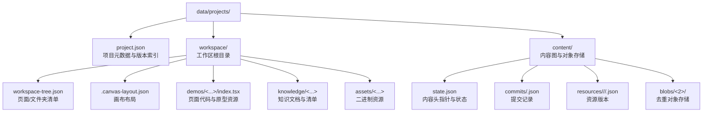
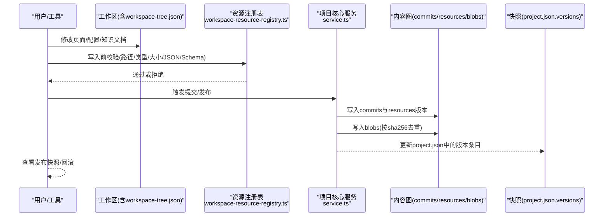
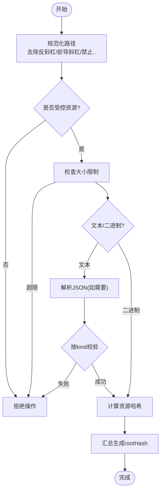
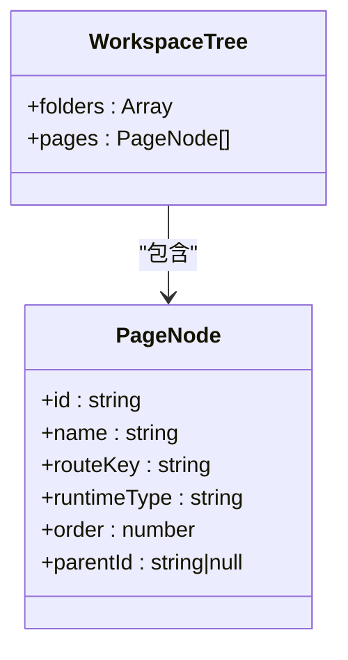
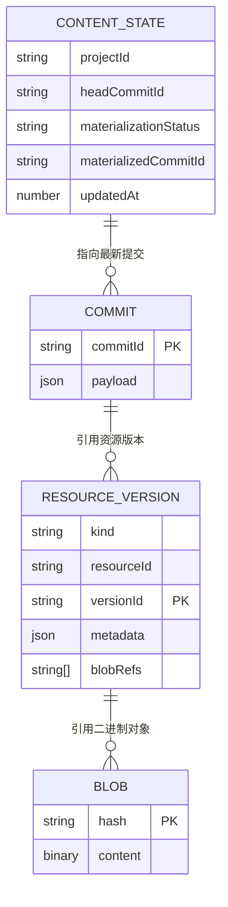
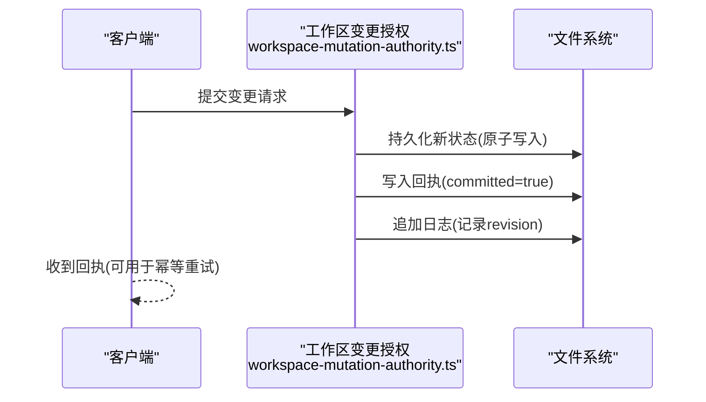
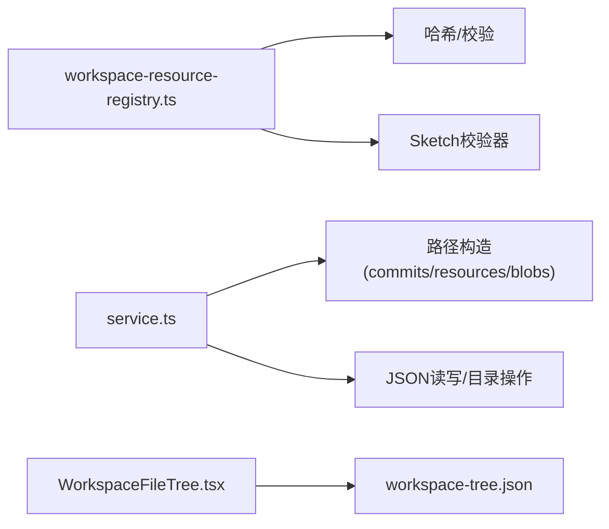

# 文件系统结构

<cite>
**本文引用的文件**
- [project.json](file://data/projects/proj_1782718595285_h4lda7/project.json)
- [workspace-tree.json](file://data/projects/proj_1782718595285_h4lda7/workspace/workspace-tree.json)
- [state.json](file://data/projects/proj_1782718595285_h4lda7/content/state.json)
- [commit_1783583164493_el5z41.json](file://data/projects/proj_1782718595285_h4lda7/content/commits/commit_1783583164493_el5z41.json)
- [service.ts](file://packages/project-core/src/service.ts)
- [workspace-resource-registry.ts](file://packages/project-core/src/workspace-resource-registry.ts)
- [canvas-layout-tool.ts](file://packages/agent-service/src/backends/pi-tools/canvas-layout-tool.ts)
- [delete-page-tool.ts](file://packages/agent-service/src/backends/pi-tools/delete-page-tool.ts)
- [WorkspaceFileTree.tsx](file://packages/author-site/src/components/demo/WorkspaceFileTree.tsx)
- [workspace-mutation-authority.ts](file://packages/agent-service/src/workspace/workspace-mutation-authority.ts)
</cite>

## 目录
1. [简介](#简介)
2. [项目结构](#项目结构)
3. [核心组件](#核心组件)
4. [架构总览](#架构总览)
5. [详细组件分析](#详细组件分析)
6. [依赖关系分析](#依赖关系分析)
7. [性能考虑](#性能考虑)
8. [故障排查指南](#故障排查指南)
9. [结论](#结论)
10. [附录](#附录)

## 简介
本文件面向 Workbench 平台的数据存储与文件系统规范，聚焦以下目标：
- 说明 data/projects 下的项目目录组织与内容存储格式
- 定义工作区文件系统规范，包括 workspace-tree.json 结构与资源注册表机制
- 解释快照存储格式（commits、blobs）及版本化策略
- 明确资源配置文件的命名规范与元数据结构
- 阐述权限控制、路径安全验证与并发访问保护机制
- 提供文件系统操作的最佳实践与性能优化建议

## 项目结构
Workbench 将“项目元数据 + 工作区 + 内容图”分层管理。每个项目在 data/projects 下以唯一 ID 为根目录，包含 project.json、workspace 与工作区内的内容图 content。

图表来源
- [project.json:1-216](file://data/projects/proj_1782718595285_h4lda7/project.json#L1-L216)
- [workspace-tree.json:1-21](file://data/projects/proj_1782718595285_h4lda7/workspace/workspace-tree.json#L1-L21)
- [state.json:1-7](file://data/projects/proj_1782718595285_h4lda7/content/state.json#L1-L7)
- [service.ts:4785-4829](file://packages/project-core/src/service.ts#L4785-L4829)

章节来源
- [project.json:1-216](file://data/projects/proj_1782718595285_h4lda7/project.json#L1-L216)
- [workspace-tree.json:1-21](file://data/projects/proj_1782718595285_h4lda7/workspace/workspace-tree.json#L1-L21)
- [state.json:1-7](file://data/projects/proj_1782718595285_h4lda7/content/state.json#L1-L7)
- [service.ts:4785-4829](file://packages/project-core/src/service.ts#L4785-L4829)

## 核心组件
- 项目元数据 project.json
  - 维护项目基本信息、演示页清单、版本历史、发布版本、活跃工作区等
  - 版本项包含 versionId、type、savedAt、snapshotPath、fileCount、note 等字段
- 工作区 workspace
  - 顶层关键文件：workspace-tree.json、.canvas-layout.json、project.config.schema.json、project.config.values.json
  - demos 目录存放页面代码与原型资源；knowledge 存放知识文档；assets 存放二进制资源
- 内容图 content
  - state.json 指向 headCommitId 与 materialization 状态
  - commits 目录保存每次提交的 JSON 描述
  - resources 按 kind/resourceId/versionId 组织资源版本
  - blobs 按哈希前两位分桶存储二进制对象，实现去重与增量

章节来源
- [project.json:1-216](file://data/projects/proj_1782718595285_h4lda7/project.json#L1-L216)
- [workspace-tree.json:1-21](file://data/projects/proj_1782718595285_h4lda7/workspace/workspace-tree.json#L1-L21)
- [state.json:1-7](file://data/projects/proj_1782718595285_h4lda7/content/state.json#L1-L7)
- [service.ts:4785-4829](file://packages/project-core/src/service.ts#L4785-L4829)

## 架构总览
下图展示从工作区变更到内容图提交、再到发布快照的端到端流程。

图表来源
- [workspace-resource-registry.ts:52-136](file://packages/project-core/src/workspace-resource-registry.ts#L52-L136)
- [service.ts:4947-4963](file://packages/project-core/src/service.ts#L4947-L4963)
- [project.json:26-206](file://data/projects/proj_1782718595285_h4lda7/project.json#L26-L206)

## 详细组件分析

### 工作区文件系统规范
- 受控资源集合与命名约定
  - 页面代码：demos/<pageId>/index.tsx
  - 原型资源：demos/<pageId>/prototype.{html,css}
  - 原型元信息：demos/<pageId>/prototype.meta.json
  - 页面 Schema：demos/<pageId>/config.schema.json
  - Sketch 场景：demos/<pageId>/sketch.scene.json
  - Sketch 元信息：demos/<pageId>/sketch.meta.json
  - 项目 Schema：project.config.schema.json
  - 项目配置值：project.config.values.json
  - 工作区树：workspace-tree.json
  - 画布布局：.canvas-layout.json
  - 知识文档：knowledge/<docId>.{md|markdown|mdown}
  - 知识清单：knowledge/manifest.json
  - 静态资源：assets/<任意路径>
- 路径规范化与安全校验
  - 统一使用正斜杠，去除前导斜杠，禁止空串、零字节、.. 越界
  - 文本资源最大 2MB，二进制资源最大 20MB
  - JSON 类资源需为对象；workspace-tree.json 必须包含 pages 与 folders 数组
  - sketch-scene 需通过专用校验器
- 根清单与完整性
  - 基于所有受控资源的 path:hash 列表计算 rootHash，用于快速比对一致性

图表来源
- [workspace-resource-registry.ts:41-136](file://packages/project-core/src/workspace-resource-registry.ts#L41-L136)

章节来源
- [workspace-resource-registry.ts:52-136](file://packages/project-core/src/workspace-resource-registry.ts#L52-L136)

### workspace-tree.json 结构定义
- 顶层字段
  - folders: 文件夹节点数组（当前示例为空）
  - pages: 页面节点数组，每个节点包含 id、name、routeKey、runtimeType、order、parentId
- 用途
  - 作为工作区导航与渲染的权威清单
  - 被前端组件直接消费，递归渲染目录树与页面列表

图表来源
- [workspace-tree.json:1-21](file://data/projects/proj_1782718595285_h4lda7/workspace/workspace-tree.json#L1-L21)

章节来源
- [workspace-tree.json:1-21](file://data/projects/proj_1782718595285_h4lda7/workspace/workspace-tree.json#L1-L21)
- [WorkspaceFileTree.tsx:139-214](file://packages/author-site/src/components/demo/WorkspaceFileTree.tsx#L139-L214)

### 资源注册表工作机制
- 职责
  - 描述受控资源的路径模式、类型、大小上限与校验策略
  - 在创建根清单时执行路径规范化、类型与内容校验、哈希计算
- 关键点
  - 对 workspace-tree.json 强制要求 pages 与 folders 均为数组
  - 对 sketch-scene 调用专用校验器
  - 对 JSON 类资源要求为对象而非数组

章节来源
- [workspace-resource-registry.ts:52-136](file://packages/project-core/src/workspace-resource-registry.ts#L52-L136)

### 内容图与快照存储格式
- 内容图 state.json
  - projectId、headCommitId、materializationStatus、materializedCommitId、updatedAt
- 提交 commits
  - 文件名形如 commit_<timestamp>_<random>.json
  - 由 service.ts 通过 commitPath 构造并持久化
- 资源版本 resources
  - 路径形如 resources/<kind>/<resourceId>/<versionId>.json
  - 支持按 kind 与 resourceId 维度列举与排序
- 对象存储 blobs
  - 路径形如 blobs/<2>/<hash>，按 sha256 前两位分桶
  - writeBlob/readBlob 保证存在性幂等与只写一次

图表来源
- [state.json:1-7](file://data/projects/proj_1782718595285_h4lda7/content/state.json#L1-L7)
- [service.ts:4785-4829](file://packages/project-core/src/service.ts#L4785-L4829)
- [service.ts:4947-4963](file://packages/project-core/src/service.ts#L4947-L4963)

章节来源
- [state.json:1-7](file://data/projects/proj_1782718595285_h4lda7/content/state.json#L1-L7)
- [service.ts:4785-4829](file://packages/project-core/src/service.ts#L4785-L4829)
- [service.ts:4947-4963](file://packages/project-core/src/service.ts#L4947-L4963)

### 项目版本与快照
- project.json 的 versions 数组
  - 每条记录包含 versionId、type（auto_checkpoint/publish_snapshot/restore_snapshot）、savedAt、savedBy、sessionId、snapshotPath、fileCount、note
  - snapshotPath 指向 data/snapshots/<projectId>/<versionId> 的工作区快照
- 快照用途
  - 自动检查点与发布快照便于回溯与恢复
  - 发布快照通常由系统触发，人工恢复会新增 restore_snapshot 类型版本

章节来源
- [project.json:26-206](file://data/projects/proj_1782718595285_h4lda7/project.json#L26-L206)

### 工作区变更与并发保护
- 工作区变更授权与持久化
  - 在提交回执之前先持久化状态，确保崩溃后不会暴露旧修订
  - 使用原子写入与日志追加保障一致性与可观测性
- 撤销/重置文件
  - 支持基于 Git 或内存快照的回滚
  - 清理快照以避免内存泄漏

图表来源
- [workspace-mutation-authority.ts:534-560](file://packages/agent-service/src/workspace/workspace-mutation-authority.ts#L534-L560)

章节来源
- [workspace-mutation-authority.ts:534-560](file://packages/agent-service/src/workspace/workspace-mutation-authority.ts#L534-L560)

### 工具链对 workspace-tree.json 的读写
- 画布布局工具与删除页面工具均通过固定文件名 workspace-tree.json 进行读取与写入
- 典型流程：读取 -> 解析 -> 修改 -> 写回，并在必要时触发钩子通知

章节来源
- [canvas-layout-tool.ts:9-28](file://packages/agent-service/src/backends/pi-tools/canvas-layout-tool.ts#L9-L28)
- [canvas-layout-tool.ts:141-184](file://packages/agent-service/src/backends/pi-tools/canvas-layout-tool.ts#L141-L184)
- [delete-page-tool.ts:13-22](file://packages/agent-service/src/backends/pi-tools/delete-page-tool.ts#L13-L22)
- [delete-page-tool.ts:184-230](file://packages/agent-service/src/backends/pi-tools/delete-page-tool.ts#L184-L230)

## 依赖关系分析
- 工作区资源注册表依赖
  - 路径规范化与哈希函数
  - Sketch 场景校验器
- 项目核心服务依赖
  - 内容图路径构造（commits、resources、blobs）
  - JSON 读写与目录创建
- 前端组件依赖
  - 直接消费 workspace-tree.json 的结构进行渲染

图表来源
- [workspace-resource-registry.ts:41-136](file://packages/project-core/src/workspace-resource-registry.ts#L41-L136)
- [service.ts:4785-4829](file://packages/project-core/src/service.ts#L4785-L4829)
- [WorkspaceFileTree.tsx:139-214](file://packages/author-site/src/components/demo/WorkspaceFileTree.tsx#L139-L214)

章节来源
- [workspace-resource-registry.ts:41-136](file://packages/project-core/src/workspace-resource-registry.ts#L41-L136)
- [service.ts:4785-4829](file://packages/project-core/src/service.ts#L4785-L4829)
- [WorkspaceFileTree.tsx:139-214](file://packages/author-site/src/components/demo/WorkspaceFileTree.tsx#L139-L214)

## 性能考虑
- 对象去重与分桶
  - 使用 sha256 作为对象标识，按前两位分桶降低单目录文件数，提升遍历与查找效率
- 增量与幂等
  - writeBlob 仅在不存在时写入，避免重复 I/O
  - 提交与回执顺序保证幂等与可恢复
- 批量与排序
  - 资源清单按路径排序，利于缓存命中与差异对比
- 前端渲染优化
  - 按需展开目录，减少 DOM 节点数量

[本节为通用指导，不直接分析具体文件]

## 故障排查指南
- 常见错误
  - WORKSPACE_INVALID_OPERATION：路径不受控、类型不符、大小超限、JSON 非对象、workspace-tree 缺少 pages/folders、sketch-scene 校验失败
  - 提交缺失：state.json 未指向有效 headCommitId 或对应 commit 不存在
  - Blob 缺失：资源版本引用的 blob 不存在导致 materialize 失败
- 定位步骤
  - 检查 workspace-tree.json 结构是否符合规范
  - 核对 resource 版本是否存在且 blob 引用完整
  - 确认 project.json 中 publishedVersion 与 snapshots 路径可达
  - 审查变更授权回执与日志，确认 revision 递增与 committed 标志

章节来源
- [workspace-resource-registry.ts:114-136](file://packages/project-core/src/workspace-resource-registry.ts#L114-L136)
- [service.ts:1988-2020](file://packages/project-core/src/service.ts#L1988-L2020)
- [workspace-mutation-authority.ts:534-560](file://packages/agent-service/src/workspace/workspace-mutation-authority.ts#L534-L560)

## 结论
Workbench 的文件系统采用“工作区 + 内容图 + 快照”的分层设计：
- 工作区通过严格的资源注册表与路径规范保证写入安全与一致性
- 内容图以提交与资源版本为中心，结合对象存储实现去重与可追溯
- 快照与发布版本提供可靠的回滚与分发能力
- 并发保护与原子持久化确保多进程/多线程环境下的可靠性

[本节为总结性内容，不直接分析具体文件]

## 附录
- 最佳实践
  - 始终通过资源注册表进行写入，避免绕过校验
  - 大文件优先走 assets 与 blobs，避免阻塞 JSON 处理
  - 变更前后保持 workspace-tree.json 与 demo 资源的一致性
  - 使用发布快照进行稳定分发，保留足够的自动检查点以便回滚
- 路径安全要点
  - 禁止 ..、空路径、零字节、非法字符
  - 统一使用正斜杠，避免跨平台差异
- 并发与幂等
  - 先持久化状态再写回执，配合日志追加
  - 利用 mutationId 与 revision 做幂等与冲突检测

[本节为通用指导，不直接分析具体文件]