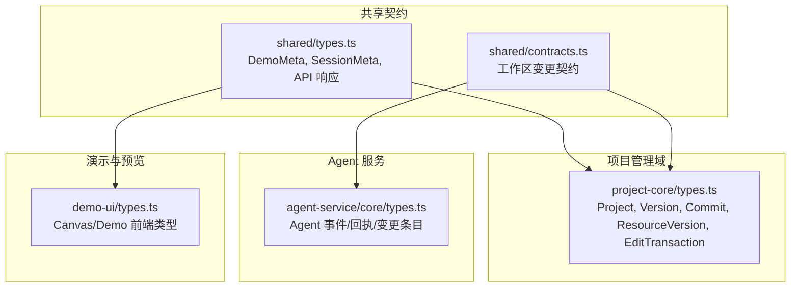
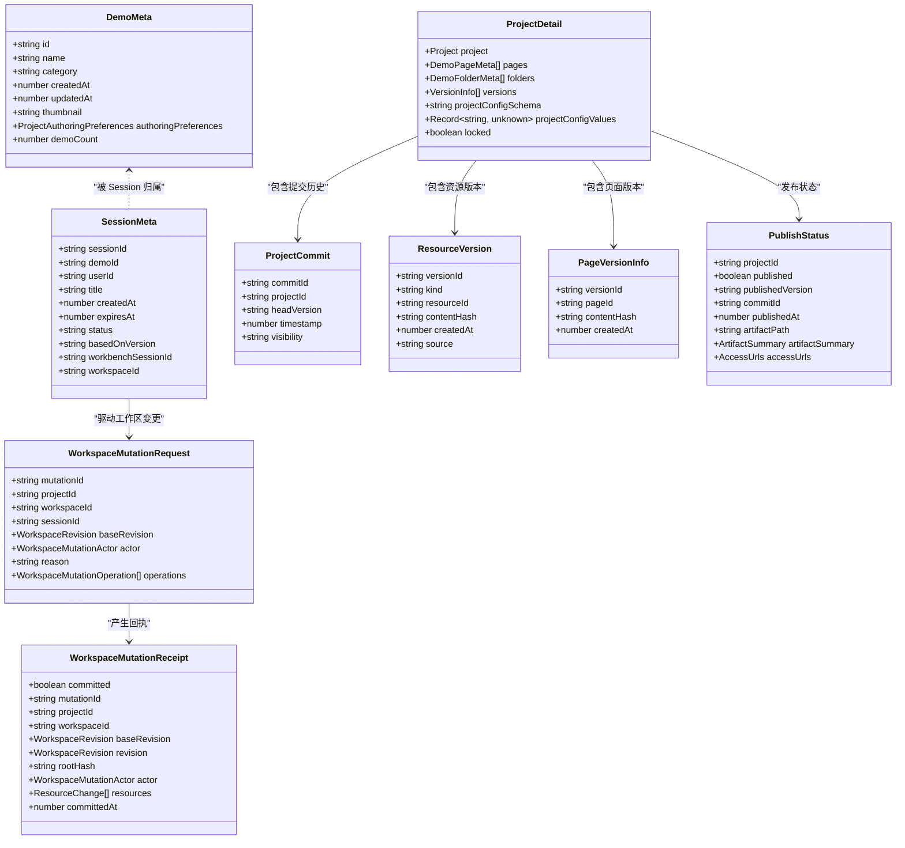
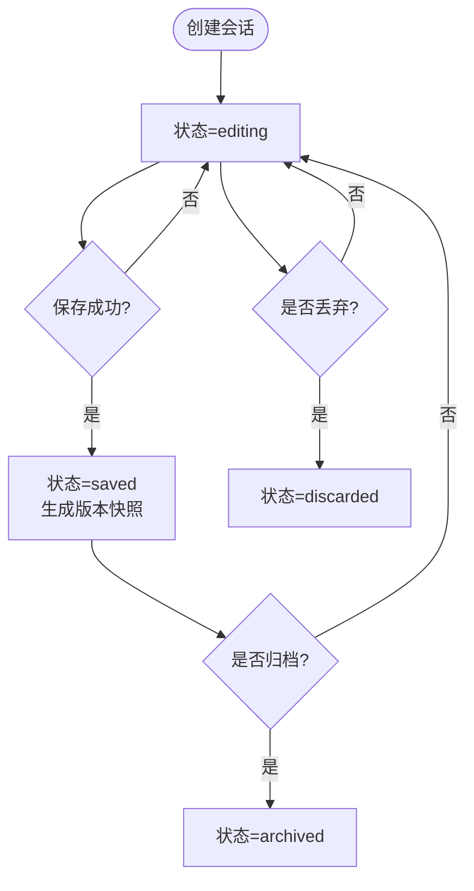
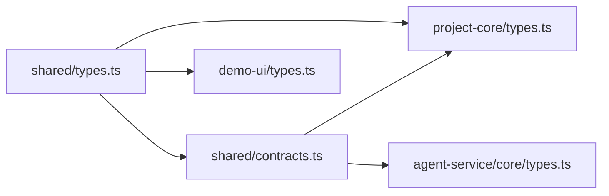

# 核心实体定义

<cite>
**本文引用的文件**   
- [packages/shared/src/types.ts](file://packages/shared/src/types.ts)
- [packages/shared/src/contracts.ts](file://packages/shared/src/contracts.ts)
- [packages/project-core/src/types.ts](file://packages/project-core/src/types.ts)
- [packages/agent-service/src/core/types.ts](file://packages/agent-service/src/core/types.ts)
- [packages/demo-ui/src/types.ts](file://packages/demo-ui/src/types.ts)
</cite>

## 目录
1. [引言](#引言)
2. [项目结构](#项目结构)
3. [核心组件](#核心组件)
4. [架构总览](#架构总览)
5. [详细组件分析](#详细组件分析)
6. [依赖关系分析](#依赖关系分析)
7. [性能考虑](#性能考虑)
8. [故障排查指南](#故障排查指南)
9. [结论](#结论)
10. [附录](#附录)

## 引言
本文件聚焦 Workbench 平台的核心数据实体，围绕 Project、Workspace、Session、Version、Demo 等关键实体的 TypeScript 接口定义进行系统化说明。文档覆盖字段类型、必填约束与业务含义，阐述实体间关联（如项目与工作区、会话与演示的归属），并详细描述 Session 的状态转换与 Version 的版本控制机制。同时给出验证规则、默认值设置、扩展点设计以及常见操作模式与示例路径，帮助读者快速理解并正确使用这些核心实体。

## 项目结构
Workbench 将核心契约与领域模型分散在多个包中：
- shared：跨包共享的契约与通用类型（如 DemoMeta、SessionMeta、API 响应、错误码）
- project-core：项目管理域的类型与输入输出（版本、提交、发布、资源版本、编辑事务等）
- agent-service：Agent 运行期类型（消息、事件、变更回执等）
- demo-ui：预览与画布相关的前端类型（页面布局、渲染模式、诊断信息等）

图表来源
- [packages/shared/src/types.ts:1-86](file://packages/shared/src/types.ts#L1-L86)
- [packages/shared/src/contracts.ts:1-202](file://packages/shared/src/contracts.ts#L1-L202)
- [packages/project-core/src/types.ts:1-673](file://packages/project-core/src/types.ts#L1-L673)
- [packages/agent-service/src/core/types.ts:1-325](file://packages/agent-service/src/core/types.ts#L1-L325)
- [packages/demo-ui/src/types.ts:1-420](file://packages/demo-ui/src/types.ts#L1-L420)

章节来源
- [packages/shared/src/types.ts:1-86](file://packages/shared/src/types.ts#L1-L86)
- [packages/shared/src/contracts.ts:1-202](file://packages/shared/src/contracts.ts#L1-L202)
- [packages/project-core/src/types.ts:1-673](file://packages/project-core/src/types.ts#L1-L673)
- [packages/agent-service/src/core/types.ts:1-325](file://packages/agent-service/src/core/types.ts#L1-L325)
- [packages/demo-ui/src/types.ts:1-420](file://packages/demo-ui/src/types.ts#L1-L420)

## 核心组件
本节对核心实体进行分层梳理，明确字段、约束与业务语义。

- Demo（演示）
  - 代表一个可运行的演示单元，包含元信息、缩略图、作者偏好等
  - 关键字段：id、name、category、createdAt、updatedAt、thumbnail、authoringPreferences、demoCount
  - 典型用途：作为 Session 的归属目标；与页面、文件夹、版本共同构成项目内容

- Session（会话）
  - 表示一次基于某个 Demo/Project 的编辑或交互会话
  - 关键字段：sessionId、demoId、userId、title、createdAt、expiresAt、status、basedOnVersion、workbenchSessionId、workspaceId
  - 状态：editing、saved、discarded、archived（见后文状态机）
  - 作用：隔离用户级编辑上下文，关联 Workspace 与版本基线

- Workspace（工作区）
  - 提供单写者、持久化的活跃工作空间契约，承载增量变更与一致性保证
  - 关键契约：WorkspaceMutationRequest、WorkspaceMutationReceipt、WorkspaceProjectionAck 等
  - 作用：为 Session 提供并发安全、幂等、可审计的变更通道

- Version（版本）
  - 通过 ProjectCommit、ResourceVersion、PageVersionInfo 等描述项目、资源、页面的历史快照
  - 支持版本创建、恢复、清理、发布等能力
  - 作用：实现“可回溯”的内容管理，支撑回滚与审计

- Project（项目）
  - 聚合多个 Demo、页面、配置、版本与发布状态
  - 通过 ProjectDetail、ProjectSummary、PublishStatus 等表达详情与发布态

章节来源
- [packages/shared/src/types.ts:1-86](file://packages/shared/src/types.ts#L1-L86)
- [packages/shared/src/contracts.ts:1-202](file://packages/shared/src/contracts.ts#L1-L202)
- [packages/project-core/src/types.ts:1-673](file://packages/project-core/src/types.ts#L1-L673)

## 架构总览
下图展示核心实体间的静态关系与主要职责边界。

图表来源
- [packages/shared/src/types.ts:1-86](file://packages/shared/src/types.ts#L1-L86)
- [packages/shared/src/contracts.ts:1-202](file://packages/shared/src/contracts.ts#L1-202)
- [packages/project-core/src/types.ts:1-673](file://packages/project-core/src/types.ts#L1-673)

## 详细组件分析

### 实体：Demo（演示）
- 字段与含义
  - id：唯一标识
  - name：演示名称
  - category：分类标签（可选）
  - createdAt/updatedAt：创建与更新时间戳
  - thumbnail：缩略图地址（可选）
  - authoringPreferences：作者偏好（来自工作区配置）
  - demoCount：子演示数量（可选）
- 必填约束
  - id、name、createdAt、updatedAt 为必填
- 业务含义
  - 作为最小可运行单元，被 Session 归属，并与页面、文件夹、版本共同组成项目内容
- 常见用法
  - 列表展示、筛选、跳转至编辑器或预览器
- 参考路径
  - [DemoMeta 定义:3-12](file://packages/shared/src/types.ts#L3-L12)

章节来源
- [packages/shared/src/types.ts:1-86](file://packages/shared/src/types.ts#L1-L86)

### 实体：Session（会话）
- 字段与含义
  - sessionId：会话唯一标识
  - demoId：所属演示/项目标识（兼容字段，实际值为 projectId）
  - userId：编辑者标识（可选）
  - title：会话标题（可选）
  - createdAt/expiresAt：创建与过期时间
  - status：会话状态（editing/saved/discarded/archived）
  - basedOnVersion：基于哪个版本开始编辑（可选）
  - workbenchSessionId：Workbench 内部会话标识（可选）
  - workspaceId：关联的工作区 ID（可选）
- 必填约束
  - sessionId、demoId、createdAt、expiresAt 为必填
- 状态与转换
  - editing：正在编辑
  - saved：已保存（生成版本快照）
  - discarded：已丢弃
  - archived：已归档
- 生命周期流程

图表来源
- [packages/shared/src/types.ts:19-30](file://packages/shared/src/types.ts#L19-L30)

- 关联关系
  - 与 Workspace：通过 workspaceId 关联，驱动工作区变更
  - 与 Version：通过 basedOnVersion 记录编辑起点
- 常见操作
  - 创建/更新/关闭/归档/删除
- 参考路径
  - [SessionMeta 定义:19-30](file://packages/shared/src/types.ts#L19-L30)

章节来源
- [packages/shared/src/types.ts:19-30](file://packages/shared/src/types.ts#L19-L30)

### 实体：Workspace（工作区）
- 角色与职责
  - 提供单写者的活跃工作空间契约，确保变更的幂等、一致性与可审计
- 关键契约
  - WorkspaceMutationRequest：变更请求（含基础版本、操作集合、执行者、原因）
  - WorkspaceMutationReceipt：变更回执（含新修订号、根哈希、资源变更明细）
  - WorkspaceProjectionAck：投影确认（用于预览/截图等消费端确认应用结果）
- 操作类型
  - put_text：写入文本
  - put_binary：上传二进制（先暂存再引用）
  - delete_path：删除路径
  - move_path：移动路径
- 校验与保护
  - 路径规范化与管理范围检查
  - 文本大小限制与受管资源白名单
- 参考路径
  - [工作区变更契约:1-202](file://packages/shared/src/contracts.ts#L1-L202)

章节来源
- [packages/shared/src/contracts.ts:1-202](file://packages/shared/src/contracts.ts#L1-L202)

### 实体：Version（版本）
- 版本层次
  - ProjectCommit：项目级提交，包含头版本、可见性、时间戳等
  - ResourceVersion：资源级版本（按 kind/resourceId 维度）
  - PageVersionInfo：页面级版本（按 pageId 维度）
- 版本创建与恢复
  - 支持从工作区快照创建版本，记录 note、sketchPatchSummary 等
  - 支持按版本恢复单个资源或页面
- 版本清理
  - 保留最近 N 个版本，自动清理旧版本
- 参考路径
  - [版本与提交相关类型:157-310](file://packages/project-core/src/types.ts#L157-L310)
  - [资源版本历史与恢复:212-253](file://packages/project-core/src/types.ts#L212-L253)
  - [页面版本历史与恢复:178-191](file://packages/project-core/src/types.ts#L178-L191)

章节来源
- [packages/project-core/src/types.ts:157-310](file://packages/project-core/src/types.ts#L157-L310)
- [packages/project-core/src/types.ts:212-253](file://packages/project-core/src/types.ts#L212-L253)
- [packages/project-core/src/types.ts:178-191](file://packages/project-core/src/types.ts#L178-L191)

### 实体：Project（项目）
- 聚合内容
  - ProjectDetail：包含项目本体、页面、文件夹、版本、配置 Schema/值、锁定状态
  - ProjectSummary：精简摘要（含发布版本、发布时间等）
- 发布状态
  - PublishStatus：是否已发布、发布版本、提交 ID、制品路径、访问 URL 等
- 参考路径
  - [项目详情与摘要:157-171](file://packages/project-core/src/types.ts#L157-L171)
  - [发布状态:347-365](file://packages/project-core/src/types.ts#L347-L365)

章节来源
- [packages/project-core/src/types.ts:157-171](file://packages/project-core/src/types.ts#L157-L171)
- [packages/project-core/src/types.ts:347-365](file://packages/project-core/src/types.ts#L347-L365)

### 实体：EditTransaction（编辑事务）
- 作用
  - 封装一次编辑操作的上下文：编辑者、工作区、基线版本、有效期、状态等
- 关键字段
  - editId、projectId、workspaceId、workspacePath、baseVersion、actor、createdAt、expiresAt、status
- 状态
  - editing、committed、discarded、expired
- 参考路径
  - [编辑事务](file://packages/project-core/src/types.ts:329-L340)

章节来源
- [packages/project-core/src/types.ts:329-340](file://packages/project-core/src/types.ts#L329-L340)

### 实体：Agent 运行期（与 Session/Workspace 协作）
- 作用
  - 在会话上下文中驱动工具调用、文件变更、计划与权限请求等
- 关键类型
  - AgentConfig、AgentResult、FileChange、RunSummary、MutationReceiptEntry、ProjectionAckEntry
- 参考路径
  - [Agent 核心类型](file://packages/agent-service/src/core/types.ts:1-L325)

章节来源
- [packages/agent-service/src/core/types.ts:1-325](file://packages/agent-service/src/core/types.ts#L1-L325)

### 前端：Demo/Canvas 预览与画布
- 作用
  - 描述页面布局、渲染模式、诊断信息、画布节点与知识文档等
- 关键字段
  - CanvasPageData、CanvasState、PreviewDiagnostic、CanvasKnowledgeDocument 等
- 参考路径
  - [演示与画布类型](file://packages/demo-ui/src/types.ts:1-L420)

章节来源
- [packages/demo-ui/src/types.ts:1-420](file://packages/demo-ui/src/types.ts#L1-L420)

## 依赖关系分析
- 耦合与内聚
  - shared 层提供最小契约，project-core 与 agent-service 分别面向管理与运行期，demo-ui 专注前端呈现
  - Session 作为桥接点，连接 Demo/Project 与 Workspace/Version
- 直接依赖
  - project-core 依赖 shared 的 DemoMeta、SessionMeta、WorkspaceRevision 等
  - agent-service 依赖 shared 的 BackendProvidersConfig 等外部配置
  - demo-ui 依赖 shared 的 DemoMeta 与自身画布类型
- 潜在循环
  - 通过 contracts 与 types 解耦，避免循环引用
- 外部集成点
  - 工作区 Authority、Agent 后端、预览引擎、知识库等

图表来源
- [packages/shared/src/types.ts:1-86](file://packages/shared/src/types.ts#L1-L86)
- [packages/shared/src/contracts.ts:1-202](file://packages/shared/src/contracts.ts#L1-L202)
- [packages/project-core/src/types.ts:1-673](file://packages/project-core/src/types.ts#L1-L673)
- [packages/agent-service/src/core/types.ts:1-325](file://packages/agent-service/src/core/types.ts#L1-L325)
- [packages/demo-ui/src/types.ts:1-420](file://packages/demo-ui/src/types.ts#L1-L420)

章节来源
- [packages/shared/src/types.ts:1-86](file://packages/shared/src/types.ts#L1-L86)
- [packages/shared/src/contracts.ts:1-202](file://packages/shared/src/contracts.ts#L1-L202)
- [packages/project-core/src/types.ts:1-673](file://packages/project-core/src/types.ts#L1-L673)
- [packages/agent-service/src/core/types.ts:1-325](file://packages/agent-service/src/core/types.ts#L1-L325)
- [packages/demo-ui/src/types.ts:1-420](file://packages/demo-ui/src/types.ts#L1-L420)

## 性能考虑
- 工作区变更
  - 使用根哈希与修订号保障一致性，减少全量同步开销
  - 二进制文件走暂存上传，避免大对象进入变更体
- 版本管理
  - 仅保留最近 N 个版本，降低存储与查询压力
  - 资源/页面粒度恢复，避免整项目回滚
- 预览与画布
  - 按需加载与懒渲染，结合占位截图提升首屏体验
  - 诊断信息异步收集，避免阻塞主流程

[本节为通用指导，不直接分析具体文件]

## 故障排查指南
- 常见错误码
  - DEMO_NOT_FOUND、SESSION_NOT_FOUND、WORKSPACE_STALE、PROJECT_NOT_FOUND、VALIDATION_ERROR、FILE_TOO_LARGE 等
- 定位建议
  - 检查 Session 的 status 与 expiresAt，确认是否过期或归档
  - 核对 Workspace 的 baseRevision 与当前 revision，避免冲突
  - 查看 Project 的 PublishStatus 与 Commit 历史，确认发布与版本一致性
- 参考路径
  - [错误码与消息映射](file://packages/shared/src/types.ts:48-L86)
  - [工作区权威 API 错误码](file://packages/shared/src/contracts.ts:20-L58)

章节来源
- [packages/shared/src/types.ts:48-86](file://packages/shared/src/types.ts#L48-L86)
- [packages/shared/src/contracts.ts:20-58](file://packages/shared/src/contracts.ts#L20-L58)

## 结论
Workbench 的核心实体以 shared 契约为中心，围绕 Session 串联 Demo/Project 与 Workspace/Version，形成“可编辑、可追溯、可发布”的完整闭环。通过严格的变更契约与版本化策略，系统在保证一致性的同时提供了良好的扩展性与运维能力。

[本节为总结性内容，不直接分析具体文件]

## 附录

### 实体实例示例（路径指引）
- 创建演示与页面
  - [页面创建输入](file://packages/project-core/src/types.ts:594-L610)
- 创建会话并关联工作区
  - [会话元信息](file://packages/shared/src/types.ts:19-L30)
  - [工作区变更请求](file://packages/shared/src/contracts.ts:104-L113)
- 保存并生成版本
  - [资源版本创建输入](file://packages/project-core/src/types.ts:229-L242)
  - [页面版本创建输入](file://packages/project-core/src/types.ts:193-L203)
- 发布项目
  - [发布提交输入](file://packages/project-core/src/types.ts:262-L266)
  - [发布状态](file://packages/project-core/src/types.ts:347-L365)

### 常见操作模式
- 编辑-保存-归档
  - 创建 Session → 驱动 Workspace 变更 → 保存生成版本 → 归档 Session
- 版本回滚
  - 查询版本历史 → 选择目标版本 → 恢复资源/页面 → 重新发布
- 多端协作
  - 多客户端订阅工作区事件 → 投影确认 → 冲突检测与合并

[本节为概念性说明，不直接分析具体文件]