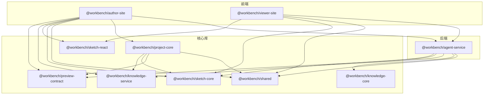
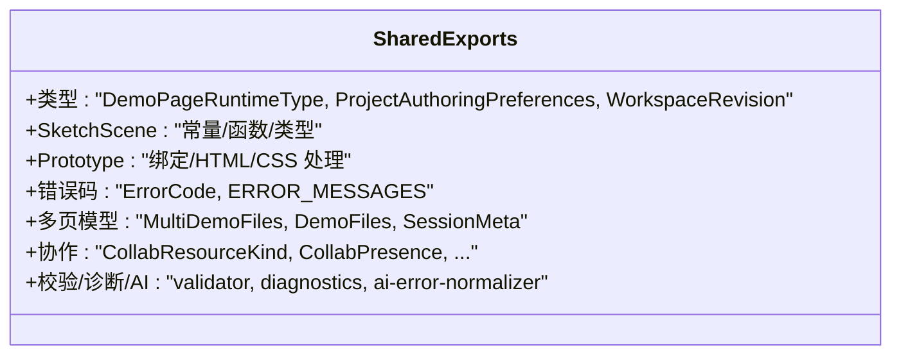
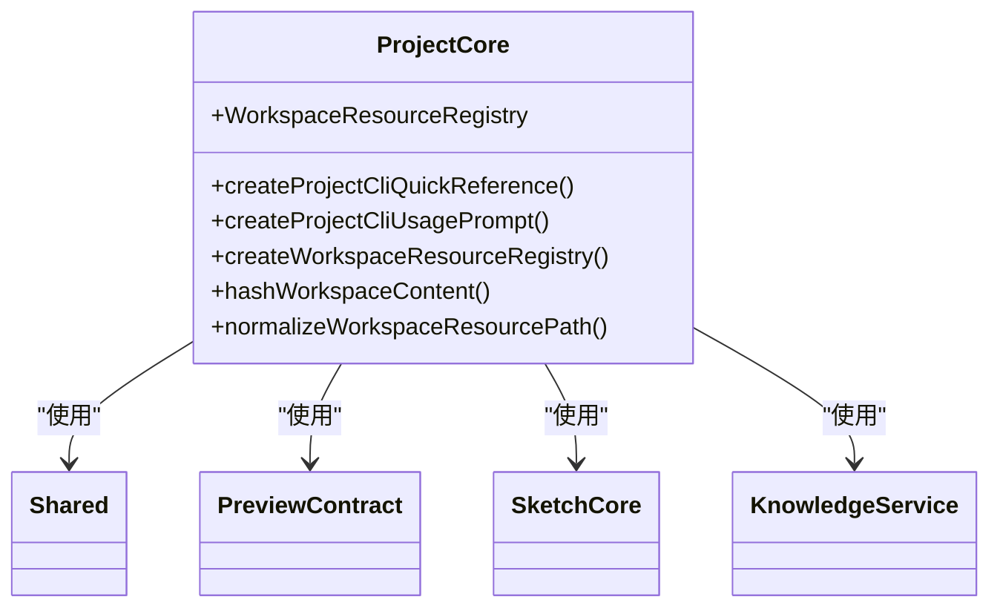
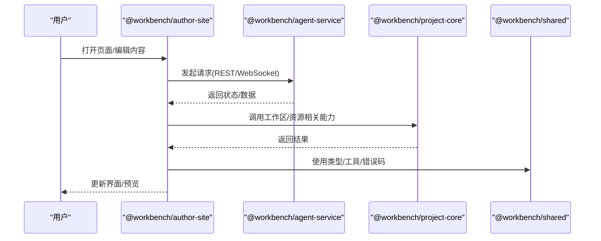
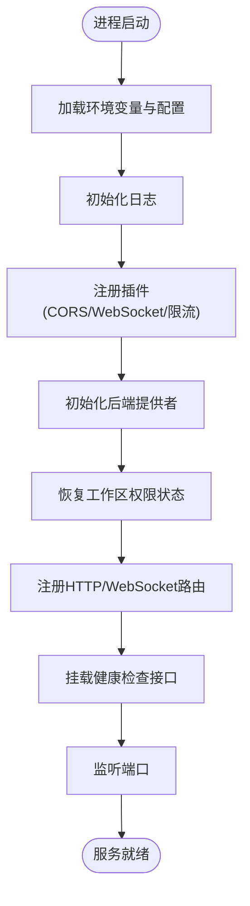
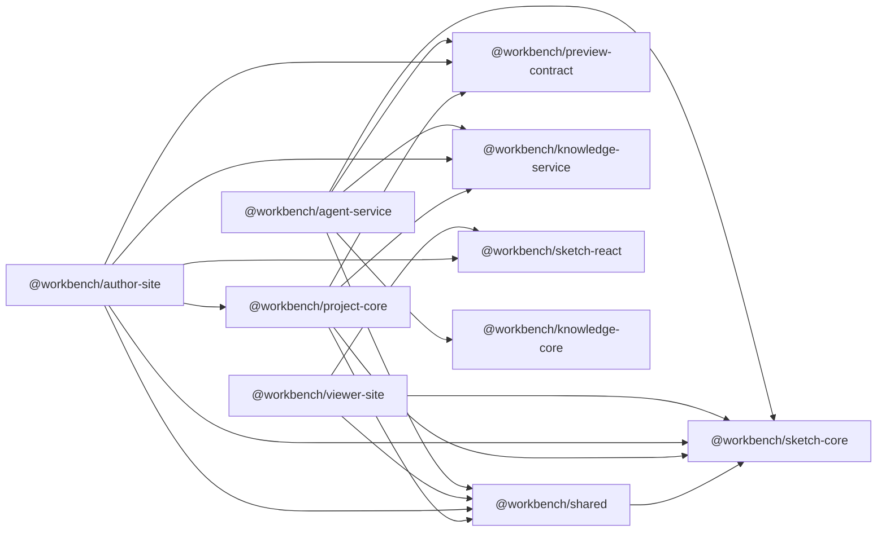

# Monorepo 结构

<cite>
**本文引用的文件**   
- [package.json](file://package.json)
- [turbo.json](file://turbo.json)
- [pnpm-workspace.yaml](file://pnpm-workspace.yaml)
- [packages/shared/package.json](file://packages/shared/package.json)
- [packages/shared/src/index.ts](file://packages/shared/src/index.ts)
- [packages/project-core/package.json](file://packages/project-core/package.json)
- [packages/project-core/src/index.ts](file://packages/project-core/src/index.ts)
- [packages/agent-service/package.json](file://packages/agent-service/package.json)
- [packages/agent-service/src/server.ts](file://packages/agent-service/src/server.ts)
- [packages/author-site/package.json](file://packages/author-site/package.json)
- [packages/viewer-site/package.json](file://packages/viewer-site/package.json)
</cite>

## 目录
1. [简介](#简介)
2. [项目结构](#项目结构)
3. [核心组件](#核心组件)
4. [架构总览](#架构总览)
5. [详细组件分析](#详细组件分析)
6. [依赖关系分析](#依赖关系分析)
7. [性能与构建缓存](#性能与构建缓存)
8. [版本管理与发布策略](#版本管理与发布策略)
9. [开发工作流](#开发工作流)
10. [故障排查指南](#故障排查指南)
11. [结论](#结论)

## 简介
本文件面向 Workbench 平台的 Monorepo 结构设计，聚焦于 packages 目录下的包职责划分、内部依赖关系、共享模块设计、基于 Turborepo 的增量与并行构建优化、版本管理与发布策略，以及本地开发与调试的最佳实践。目标是帮助开发者快速理解整体架构并高效协作。

## 项目结构
仓库采用 pnpm workspace + Turborepo 的 Monorepo 组织方式：
- 根 package.json 提供统一脚本入口（如 dev、build、check:*、test:e2e 等）
- pnpm-workspace.yaml 声明包范围与原生依赖构建白名单
- turbo.json 定义任务图、依赖顺序与输出缓存路径
- packages/* 为业务与工具包集合，包含前端站点、后端服务、核心库与共享模块

```mermaid
graph TB
root["根工作区<br/>package.json / turbo.json / pnpm-workspace.yaml"] --> author["@workbench/author-site"]
root --> viewer["@workbench/viewer-site"]
root --> agent["@workbench/agent-service"]
root --> shared["@workbench/shared"]
root --> project_core["@workbench/project-core"]
root --> preview_contract["@workbench/preview-contract"]
root --> sketch_core["@workbench/sketch-core"]
root --> sketch_react["@workbench/sketch-react"]
root --> knowledge_core["@workbench/knowledge-core"]
root --> knowledge_service["@workbench/knowledge-service"]
root --> screenshot_service["@workbench/screenshot-service"]
root --> project_cli["@workbench/project-cli"]
root --> project_scaffold["@workbench/project-scaffold"]
root --> demo_ui["@workbench/demo-ui"]
root --> agent_client["@workbench/agent-client"]
```

图表来源
- [package.json:1-101](file://package.json#L1-L101)
- [turbo.json:1-20](file://turbo.json#L1-L20)
- [pnpm-workspace.yaml:1-15](file://pnpm-workspace.yaml#L1-L15)

章节来源
- [package.json:1-101](file://package.json#L1-L101)
- [turbo.json:1-20](file://turbo.json#L1-L20)
- [pnpm-workspace.yaml:1-15](file://pnpm-workspace.yaml#L1-L15)

## 核心组件
- @workbench/author-site：创作端 Next.js 应用，负责页面编辑、配置面板、预览生成、与 Agent 服务交互等
- @workbench/viewer-site：预览端 Next.js 应用，负责渲染与展示已发布的 Demo 页面
- @workbench/agent-service：独立 Agent 服务，提供会话管理、协作同步、AI 代理编排、权限恢复等能力
- @workbench/project-core：项目管理核心库，暴露工作区资源注册、哈希计算、CLI 提示等能力
- @workbench/shared：跨包共享类型、协议常量、错误码、演示与原型处理工具等
- 其他支撑包：sketch-core、sketch-react、knowledge-core、knowledge-service、screenshot-service、project-cli、project-scaffold、demo-ui、agent-client、preview-contract 等

章节来源
- [packages/author-site/package.json:1-127](file://packages/author-site/package.json#L1-L127)
- [packages/viewer-site/package.json:1-62](file://packages/viewer-site/package.json#L1-L62)
- [packages/agent-service/package.json:1-53](file://packages/agent-service/package.json#L1-L53)
- [packages/project-core/package.json:1-27](file://packages/project-core/package.json#L1-L27)
- [packages/shared/package.json:1-21](file://packages/shared/package.json#L1-L21)

## 架构总览
Workbench 由“创作端 + 预览端 + 独立 Agent 服务 + 核心库/共享模块”构成。创作端通过 API/WebSocket 与 Agent 服务通信；预览端主要消费已生成的产物；核心库与共享模块被多个包复用，保证类型一致性与行为一致性。

图表来源
- [packages/author-site/package.json:1-127](file://packages/author-site/package.json#L1-L127)
- [packages/viewer-site/package.json:1-62](file://packages/viewer-site/package.json#L1-L62)
- [packages/agent-service/package.json:1-53](file://packages/agent-service/package.json#L1-L53)
- [packages/project-core/package.json:1-27](file://packages/project-core/package.json#L1-L27)
- [packages/shared/package.json:1-21](file://packages/shared/package.json#L1-L21)

## 详细组件分析

### 共享模块 @workbench/shared
- 职责：集中导出跨包复用的类型、协议常量、错误码、演示与原型处理工具、校验器、诊断与 AI 错误归一化等
- 关键导出：
  - 类型与协议：DemoPageRuntimeType、ProjectAuthoringPreferences、WorkspaceRevision、SketchScene* 系列类型与常量
  - 演示与原型：applyPrototypeBindings、buildPrototypePreviewDocumentHtml、sanitizePrototypeHtml/Css 等
  - 错误体系：ErrorCode 常量与 ERROR_MESSAGES 映射
  - 多页 Demo 模型：MultiDemoFiles、DemoFiles、SessionMeta、Collab* 系列类型
- 对外暴露策略：通过 package.json 的 exports 字段精确控制子路径导出，便于按需引用与类型推断

图表来源
- [packages/shared/src/index.ts:1-310](file://packages/shared/src/index.ts#L1-L310)
- [packages/shared/package.json:1-21](file://packages/shared/package.json#L1-L21)

章节来源
- [packages/shared/src/index.ts:1-310](file://packages/shared/src/index.ts#L1-L310)
- [packages/shared/package.json:1-21](file://packages/shared/package.json#L1-L21)

### 项目核心 @workbench/project-core
- 职责：提供工作区资源注册表、内容哈希、路径规范化、CLI 提示等核心能力
- 对外导出：createProjectCliQuickReference、createProjectCliUsagePrompt、WorkspaceResourceRegistry、hashWorkspaceContent、normalizeWorkspaceResourcePath 等
- 依赖：knowledge-service、preview-contract、sketch-core、shared

图表来源
- [packages/project-core/src/index.ts:1-15](file://packages/project-core/src/index.ts#L1-L15)
- [packages/project-core/package.json:1-27](file://packages/project-core/package.json#L1-L27)

章节来源
- [packages/project-core/src/index.ts:1-15](file://packages/project-core/src/index.ts#L1-L15)
- [packages/project-core/package.json:1-27](file://packages/project-core/package.json#L1-L27)

### 创作端 @workbench/author-site
- 职责：Next.js 应用，集成编辑器、配置面板、预览生成、与 Agent 服务协作、知识服务等
- 依赖：agent-client、demo-ui、knowledge-service、preview-contract、project-core、project-scaffold、shared、sketch-core、sketch-react 等
- 脚本：dev/build/start/lint/typecheck/test/db:init

图表来源
- [packages/author-site/package.json:1-127](file://packages/author-site/package.json#L1-L127)
- [packages/agent-service/src/server.ts:1-117](file://packages/agent-service/src/server.ts#L1-L117)
- [packages/project-core/src/index.ts:1-15](file://packages/project-core/src/index.ts#L1-L15)
- [packages/shared/src/index.ts:1-310](file://packages/shared/src/index.ts#L1-L310)

章节来源
- [packages/author-site/package.json:1-127](file://packages/author-site/package.json#L1-L127)

### 预览端 @workbench/viewer-site
- 职责：Next.js 应用，用于渲染和展示已发布的 Demo 页面
- 依赖：demo-ui、sketch-core、sketch-react、shared 等
- 脚本：dev/build/start/lint/typecheck

章节来源
- [packages/viewer-site/package.json:1-62](file://packages/viewer-site/package.json#L1-L62)

### 独立 Agent 服务 @workbench/agent-service
- 职责：Fastify 服务，提供路由、WebSocket、限流、CORS、会话存储、工作区权限启动恢复、Agent 工厂与后端注册等
- 启动流程要点：
  - 加载配置与日志
  - 注册 CORS/WebSocket/RateLimit
  - 初始化后端提供者与 Agent 工厂
  - 恢复工作区权限状态
  - 注册路由与健康检查
  - 监听端口并优雅关闭

图表来源
- [packages/agent-service/src/server.ts:1-117](file://packages/agent-service/src/server.ts#L1-L117)
- [packages/agent-service/package.json:1-53](file://packages/agent-service/package.json#L1-L53)

章节来源
- [packages/agent-service/src/server.ts:1-117](file://packages/agent-service/src/server.ts#L1-L117)
- [packages/agent-service/package.json:1-53](file://packages/agent-service/package.json#L1-L53)

## 依赖关系分析
- 内部依赖
  - author-site 依赖：agent-client、demo-ui、knowledge-service、preview-contract、project-core、project-scaffold、shared、sketch-core、sketch-react
  - viewer-site 依赖：demo-ui、sketch-core、sketch-react、shared
  - agent-service 依赖：knowledge-core、knowledge-service、preview-contract、sketch-core、shared
  - project-core 依赖：knowledge-service、preview-contract、sketch-core、shared
  - shared 依赖：sketch-core（仅运行时/类型层面）
- 外部依赖管理策略
  - 根 pnpm-workspace.yaml 中 allowBuilds 允许特定原生依赖在 monorepo 内构建
  - overrides 统一第三方包版本，避免冲突
  - 根 package.json engines 指定 Node 版本要求

图表来源
- [packages/author-site/package.json:1-127](file://packages/author-site/package.json#L1-L127)
- [packages/viewer-site/package.json:1-62](file://packages/viewer-site/package.json#L1-L62)
- [packages/agent-service/package.json:1-53](file://packages/agent-service/package.json#L1-L53)
- [packages/project-core/package.json:1-27](file://packages/project-core/package.json#L1-L27)
- [packages/shared/package.json:1-21](file://packages/shared/package.json#L1-L21)

章节来源
- [packages/author-site/package.json:1-127](file://packages/author-site/package.json#L1-L127)
- [packages/viewer-site/package.json:1-62](file://packages/viewer-site/package.json#L1-L62)
- [packages/agent-service/package.json:1-53](file://packages/agent-service/package.json#L1-L53)
- [packages/project-core/package.json:1-27](file://packages/project-core/package.json#L1-L27)
- [packages/shared/package.json:1-21](file://packages/shared/package.json#L1-L21)
- [pnpm-workspace.yaml:1-15](file://pnpm-workspace.yaml#L1-L15)
- [package.json:1-101](file://package.json#L1-L101)

## 性能与构建缓存
- 增量构建与并行执行
  - turbo.json 中 build 任务声明 dependsOn: ["^build"]，确保依赖先构建
  - outputs 指定 .next/** 与 dist/** 作为缓存输出，跳过 .next/cache 以避免污染
  - dev 任务设置为 persistent 且 cache: false，适合热重载开发体验
- 建议
  - 合理拆分任务，减少不必要的重构建
  - 将稳定产物纳入 outputs，提升缓存命中率
  - 对大型依赖（如 Next.js）启用远程缓存（可选）

章节来源
- [turbo.json:1-20](file://turbo.json#L1-L20)

## 版本管理与发布策略
- 当前状态
  - 各包 version 多为私有或固定版本，未启用统一的自动版本管理
  - 根 package.json 提供 check:* 脚本组合 typecheck 与 test，保障变更质量
- 建议策略
  - 引入 changesets 或 lerna 进行语义化版本与变更集管理
  - 对共享包（shared、project-core、preview-contract）严格遵循向后兼容原则
  - 发布流水线：lint → typecheck → test → build → publish，结合 CI 自动化
  - 依赖升级时优先使用 pnpm overrides 收敛版本，避免重复实例

[本节为通用建议，不直接分析具体文件]

## 开发工作流
- 本地开发
  - 根脚本：
    - dev：统一开发入口（可能触发子包开发）
    - dev:services：并行启动 author、agent、viewer、screenshot 服务
    - dev:author / dev:viewer / dev:agent / dev:screenshot：单独启动对应服务
  - 子包脚本：
    - author-site：next dev -p 3200
    - viewer-site：next dev -p 3300
    - agent-service：tsx watch src/server.ts
- 调试与测试
  - typecheck：tsc --noEmit
  - test：vitest/jest（按包配置）
  - e2e：playwright（根脚本 test:e2e*）
- 推荐实践
  - 修改共享模块后，运行 check:all 或针对包的 check:* 脚本
  - 使用 dev:services 一次性拉起多服务，配合浏览器调试与日志查看

章节来源
- [package.json:1-101](file://package.json#L1-L101)
- [packages/author-site/package.json:1-127](file://packages/author-site/package.json#L1-L127)
- [packages/viewer-site/package.json:1-62](file://packages/viewer-site/package.json#L1-L62)
- [packages/agent-service/package.json:1-53](file://packages/agent-service/package.json#L1-L53)

## 故障排查指南
- 服务启动问题
  - 检查环境变量与 CORS_ORIGINS 配置是否覆盖本地端口
  - 确认 WebSocket 与限流插件注册成功
  - 查看健康检查接口返回状态
- 类型与契约不一致
  - 运行 check:contracts 与 check-viewer-contracts 验证前后端契约
  - 对 shared 与 preview-contract 的变更需同步更新消费者
- 构建缓存异常
  - 清理 .next 与 dist 缓存目录后重试
  - 调整 turbo.json outputs 以匹配实际产物路径
- 依赖冲突
  - 使用 pnpm overrides 统一第三方包版本
  - 检查 allowBuilds 列表是否包含必要的原生依赖

章节来源
- [packages/agent-service/src/server.ts:1-117](file://packages/agent-service/src/server.ts#L1-L117)
- [package.json:1-101](file://package.json#L1-L101)
- [turbo.json:1-20](file://turbo.json#L1-L20)
- [pnpm-workspace.yaml:1-15](file://pnpm-workspace.yaml#L1-L15)

## 结论
本 Monorepo 通过清晰的包职责划分、严格的共享类型与契约管理、Turborepo 的增量与并行构建机制，实现了高效的开发与交付流程。建议在后续演进中引入统一的版本管理与发布流水线，持续优化依赖收敛与缓存策略，进一步提升稳定性与可维护性。