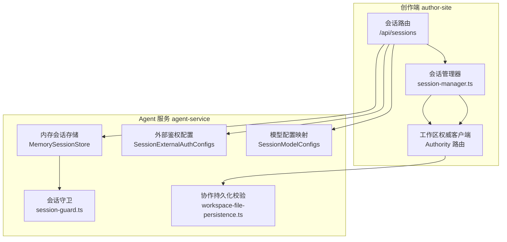
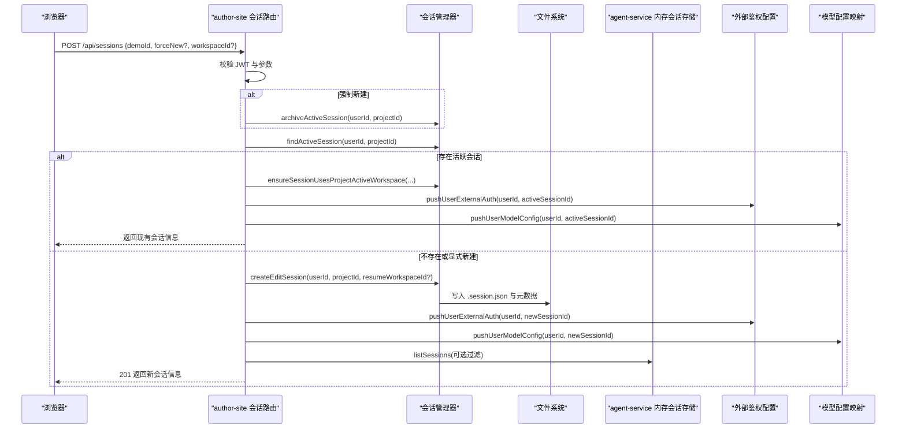
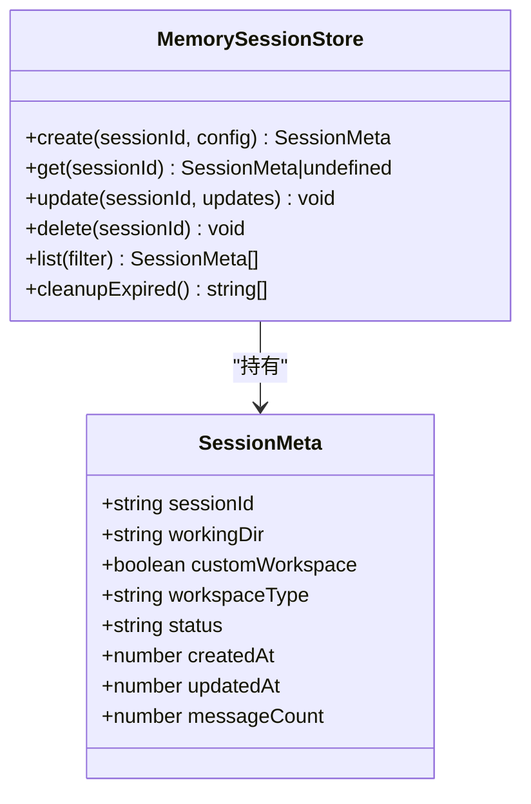
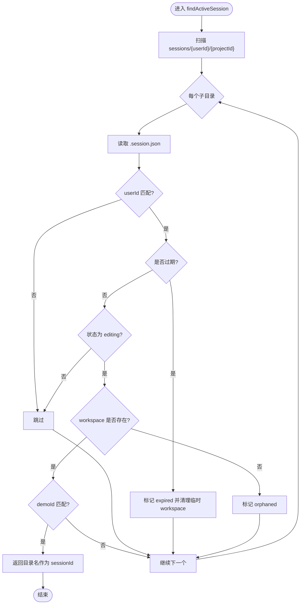
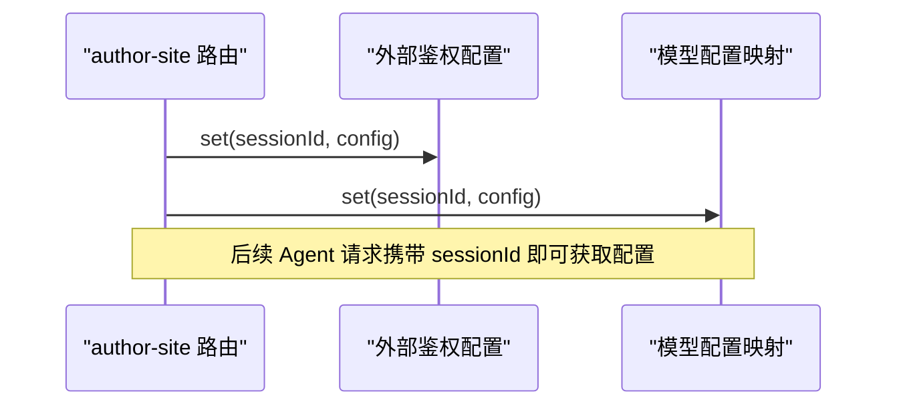
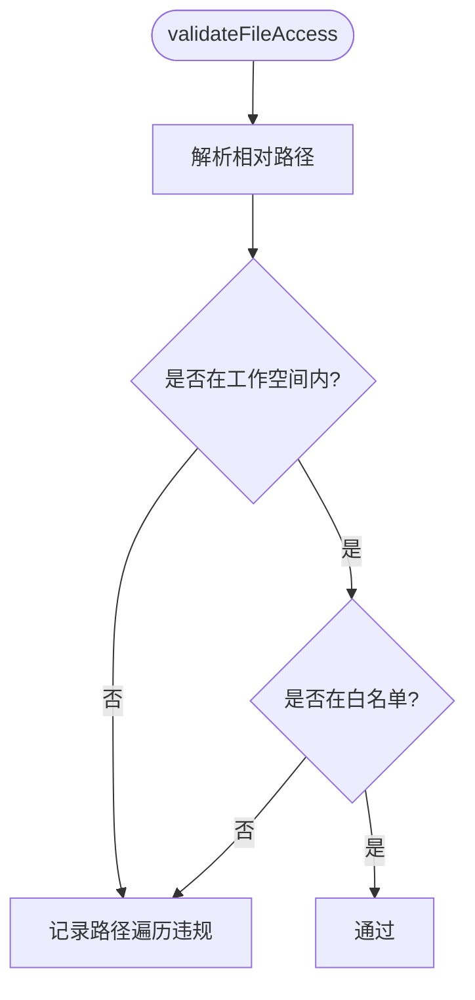
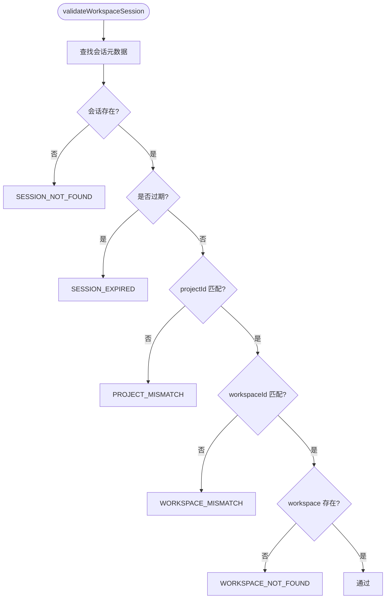
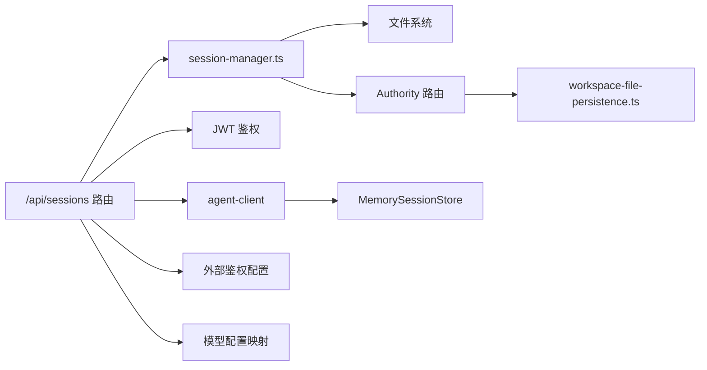

# 会话安全管理

<cite>
**本文引用的文件**   
- [packages/agent-service/src/session/session-store.ts](file://packages/agent-service/src/session/session-store.ts)
- [packages/author-site/src/lib/session-manager.ts](file://packages/author-site/src/lib/session-manager.ts)
- [packages/author-site/src/app/api/sessions/route.ts](file://packages/author-site/src/app/api/sessions/route.ts)
- [packages/author-site/src/app/api/sessions/[sessionId]/route.ts](file://packages/author-site/src/app/api/sessions/[sessionId]/route.ts)
- [packages/agent-service/src/config/session-external-auth.ts](file://packages/agent-service/src/config/session-external-auth.ts)
- [packages/agent-service/src/config/session-model-configs.ts](file://packages/agent-service/src/config/session-model-configs.ts)
- [packages/agent-service/src/session/session-guard.ts](file://packages/agent-service/src/session/session-guard.ts)
- [packages/agent-service/src/collab/workspace-file-persistence.ts](file://packages/agent-service/src/collab/workspace-file-persistence.ts)
- [packages/author-site/src/app/api/workspace-authority/[projectId]/[workspaceId]/[...segments]/route.ts](file://packages/author-site/src/app/api/workspace-authority/[projectId]/[workspaceId]/[...segments]/route.ts)
- [scripts/deploy-author-with-data.sh](file://scripts/deploy-author-with-data.sh)
</cite>

## 目录
1. [引言](#引言)
2. [项目结构](#项目结构)
3. [核心组件](#核心组件)
4. [架构总览](#架构总览)
5. [详细组件分析](#详细组件分析)
6. [依赖关系分析](#依赖关系分析)
7. [性能考虑](#性能考虑)
8. [故障恢复与一致性](#故障恢复与一致性)
9. [排障指南](#排障指南)
10. [结论](#结论)

## 引言
本文件面向 Workbench 平台的“会话安全管理”，覆盖以下关键主题：
- 会话存储机制：内存会话、持久化存储、分布式同步边界
- 会话生命周期：创建、更新、销毁、自动过期
- 并发与会话控制：单点登录、冲突解决、多设备管理
- 安全策略：会话固定防护、劫持检测、异常识别
- AI 对话会话管理：上下文保持、状态同步、迁移
- 性能优化：压缩、缓存、内存管理
- 故障恢复：备份、灾难恢复、数据一致性保证

## 项目结构
Workbench 的会话相关能力分布在创作端（author-site）与 Agent 服务（agent-service）两侧，并通过文件系统与 API 协同工作。

图表来源
- [packages/author-site/src/app/api/sessions/route.ts:70-179](file://packages/author-site/src/app/api/sessions/route.ts#L70-L179)
- [packages/author-site/src/lib/session-manager.ts:420-496](file://packages/author-site/src/lib/session-manager.ts#L420-L496)
- [packages/author-site/src/app/api/workspace-authority/[projectId]/[workspaceId]/[...segments]/route.ts:28-47](file://packages/author-site/src/app/api/workspace-authority/[projectId]/[workspaceId]/[...segments]/route.ts#L28-L47)
- [packages/agent-service/src/session/session-store.ts:43-122](file://packages/agent-service/src/session/session-store.ts#L43-L122)
- [packages/agent-service/src/config/session-external-auth.ts:3-17](file://packages/agent-service/src/config/session-external-auth.ts#L3-L17)
- [packages/agent-service/src/config/session-model-configs.ts:3-17](file://packages/agent-service/src/config/session-model-configs.ts#L3-L17)
- [packages/agent-service/src/session/session-guard.ts:12-36](file://packages/agent-service/src/session/session-guard.ts#L12-L36)
- [packages/agent-service/src/collab/workspace-file-persistence.ts:98-136](file://packages/agent-service/src/collab/workspace-file-persistence.ts#L98-L136)

章节来源
- [packages/author-site/src/app/api/sessions/route.ts:70-179](file://packages/author-site/src/app/api/sessions/route.ts#L70-L179)
- [packages/author-site/src/lib/session-manager.ts:420-496](file://packages/author-site/src/lib/session-manager.ts#L420-L496)
- [packages/agent-service/src/session/session-store.ts:43-122](file://packages/agent-service/src/session/session-store.ts#L43-L122)

## 核心组件
- 内存会话存储（agent-service）
  - 提供会话元数据的创建、查询、更新、删除、列表与过期清理；以 Map 为后端，定时任务周期性清理过期项。
- 持久化会话管理（author-site）
  - 基于文件系统（sessions/{userId}/{projectId}/session-id/.session.json）维护会话元数据、状态与过期时间；负责创建、查找、续期、归档与数量限制。
- 会话鉴权与配置注入
  - 在创建或复用会话时，将用户的外部鉴权与模型配置推送至 agent-service 的进程内配置映射，供后续调用使用。
- 会话守卫与路径校验
  - 对会话工作空间内的文件访问进行白名单与路径遍历防护，防止越权访问。
- 协作持久化校验
  - 在协作写入前校验 sessionId、projectId、workspaceId 的一致性，并检查 workspace 存在性与归属。

章节来源
- [packages/agent-service/src/session/session-store.ts:43-122](file://packages/agent-service/src/session/session-store.ts#L43-L122)
- [packages/author-site/src/lib/session-manager.ts:107-151](file://packages/author-site/src/lib/session-manager.ts#L107-L151)
- [packages/author-site/src/lib/session-manager.ts:157-207](file://packages/author-site/src/lib/session-manager.ts#L157-L207)
- [packages/author-site/src/lib/session-manager.ts:209-302](file://packages/author-site/src/lib/session-manager.ts#L209-L302)
- [packages/author-site/src/lib/session-manager.ts:420-496](file://packages/author-site/src/lib/session-manager.ts#L420-L496)
- [packages/author-site/src/app/api/sessions/route.ts:31-68](file://packages/author-site/src/app/api/sessions/route.ts#L31-L68)
- [packages/agent-service/src/config/session-external-auth.ts:3-17](file://packages/agent-service/src/config/session-external-auth.ts#L3-L17)
- [packages/agent-service/src/config/session-model-configs.ts:3-17](file://packages/agent-service/src/config/session-model-configs.ts#L3-L17)
- [packages/agent-service/src/session/session-guard.ts:12-36](file://packages/agent-service/src/session/session-guard.ts#L12-L36)
- [packages/agent-service/src/collab/workspace-file-persistence.ts:98-136](file://packages/agent-service/src/collab/workspace-file-persistence.ts#L98-L136)

## 架构总览
下图展示从浏览器到服务端的关键交互：会话创建、复用、配置注入、权限校验与持久化。

图表来源
- [packages/author-site/src/app/api/sessions/route.ts:70-179](file://packages/author-site/src/app/api/sessions/route.ts#L70-L179)
- [packages/author-site/src/lib/session-manager.ts:420-496](file://packages/author-site/src/lib/session-manager.ts#L420-L496)
- [packages/agent-service/src/session/session-store.ts:86-99](file://packages/agent-service/src/session/session-store.ts#L86-L99)

## 详细组件分析

### 组件A：内存会话存储（agent-service）
- 职责
  - 维护进程内会话元数据（创建、读取、更新、删除、列表）。
  - 按更新时间戳判断过期，定时清理。
- 数据结构
  - SessionMeta：包含 sessionId、workingDir、workspaceType、status、createdAt、updatedAt、messageCount 等。
- 复杂度
  - 创建/更新/删除/查询均为 O(1)。
  - 列表过滤为 O(n)，n 为当前会话数。
  - 过期清理为 O(n)。
- 并发与一致性
  - 单进程 Map 无锁实现，适合单机部署；多实例需配合外部存储或共享存储。
- 错误处理
  - 清理过程记录日志，不影响其他操作。

图表来源
- [packages/agent-service/src/session/session-store.ts:11-24](file://packages/agent-service/src/session/session-store.ts#L11-L24)
- [packages/agent-service/src/session/session-store.ts:43-122](file://packages/agent-service/src/session/session-store.ts#L43-L122)

章节来源
- [packages/agent-service/src/session/session-store.ts:43-122](file://packages/agent-service/src/session/session-store.ts#L43-L122)

### 组件B：持久化会话管理（author-site）
- 职责
  - 基于文件系统维护会话元数据与状态（editing/archived/expired/orphaned/saved）。
  - 支持会话创建、查找、续期、归档、数量限制与过期处理。
- 关键流程
  - 创建：生成 sessionId，写入 .session.json，设置 expiresAt。
  - 查找：扫描 sessions/{userId}/{projectId}，跳过过期与无效状态，修复不一致字段。
  - 续期：将状态置为 editing，刷新 expiresAt。
  - 归档：将编辑中且过期的会话标记为 expired，保留消息历史。
  - 限制：超出最大数量时删除最旧会话。
- 复杂度
  - 查找/归档/限制均涉及目录扫描，O(n) 级别。
- 错误处理
  - 解析失败或 IO 异常时跳过对应条目，不中断整体流程。

图表来源
- [packages/author-site/src/lib/session-manager.ts:209-302](file://packages/author-site/src/lib/session-manager.ts#L209-L302)

章节来源
- [packages/author-site/src/lib/session-manager.ts:107-151](file://packages/author-site/src/lib/session-manager.ts#L107-L151)
- [packages/author-site/src/lib/session-manager.ts:157-207](file://packages/author-site/src/lib/session-manager.ts#L157-L207)
- [packages/author-site/src/lib/session-manager.ts:209-302](file://packages/author-site/src/lib/session-manager.ts#L209-L302)
- [packages/author-site/src/lib/session-manager.ts:420-496](file://packages/author-site/src/lib/session-manager.ts#L420-L496)

### 组件C：会话鉴权与配置注入
- 外部鉴权配置
  - 进程内 Map 存储 sessionId -> ExternalAuthSessionConfig，避免重复授权。
- 模型配置映射
  - 进程内 Map 存储 sessionId -> BackendProvidersConfig，用于 LLM 调用。
- 注入时机
  - 在创建或复用会话后，由 author-site 路由调用推送接口，将配置下发至 agent-service。

图表来源
- [packages/author-site/src/app/api/sessions/route.ts:31-68](file://packages/author-site/src/app/api/sessions/route.ts#L31-L68)
- [packages/agent-service/src/config/session-external-auth.ts:3-17](file://packages/agent-service/src/config/session-external-auth.ts#L3-L17)
- [packages/agent-service/src/config/session-model-configs.ts:3-17](file://packages/agent-service/src/config/session-model-configs.ts#L3-L17)

章节来源
- [packages/author-site/src/app/api/sessions/route.ts:31-68](file://packages/author-site/src/app/api/sessions/route.ts#L31-L68)
- [packages/agent-service/src/config/session-external-auth.ts:3-17](file://packages/agent-service/src/config/session-external-auth.ts#L3-L17)
- [packages/agent-service/src/config/session-model-configs.ts:3-17](file://packages/agent-service/src/config/session-model-configs.ts#L3-L17)

### 组件D：会话守卫与路径校验
- 功能
  - 校验目标路径是否在会话工作空间内，拒绝路径遍历与符号链接逃逸。
  - 白名单允许的文件集合，限制可访问资源范围。
- 适用场景
  - Agent 工具、AI 对话上下文读取、文件变更审计等。

图表来源
- [packages/agent-service/src/session/session-guard.ts:12-36](file://packages/agent-service/src/session/session-guard.ts#L12-L36)

章节来源
- [packages/agent-service/src/session/session-guard.ts:12-36](file://packages/agent-service/src/session/session-guard.ts#L12-L36)

### 组件E：协作持久化校验
- 功能
  - 在协作写入前校验 sessionId、projectId、workspaceId 的一致性，确保 workspace 存在且归属正确。
- 返回值
  - ok 表示通过，否则返回具体原因（SESSION_NOT_FOUND、SESSION_EXPIRED、PROJECT_MISMATCH、WORKSPACE_MISMATCH、WORKSPACE_NOT_FOUND 等）。

图表来源
- [packages/agent-service/src/collab/workspace-file-persistence.ts:98-136](file://packages/agent-service/src/collab/workspace-file-persistence.ts#L98-L136)

章节来源
- [packages/agent-service/src/collab/workspace-file-persistence.ts:98-136](file://packages/agent-service/src/collab/workspace-file-persistence.ts#L98-L136)

## 依赖关系分析
- author-site 会话路由依赖：
  - 认证模块（JWT）、会话管理器、文件系统工具、Agent 客户端、外部鉴权与模型配置推送。
- agent-service 会话存储依赖：
  - 日志模块、共享合约类型（WorkspaceMeta）。
- 协作持久化依赖：
  - 会话与工作区元数据读取、路径解析与校验。

图表来源
- [packages/author-site/src/app/api/sessions/route.ts:70-179](file://packages/author-site/src/app/api/sessions/route.ts#L70-L179)
- [packages/author-site/src/lib/session-manager.ts:420-496](file://packages/author-site/src/lib/session-manager.ts#L420-L496)
- [packages/agent-service/src/session/session-store.ts:43-122](file://packages/agent-service/src/session/session-store.ts#L43-L122)
- [packages/agent-service/src/collab/workspace-file-persistence.ts:98-136](file://packages/agent-service/src/collab/workspace-file-persistence.ts#L98-L136)

章节来源
- [packages/author-site/src/app/api/sessions/route.ts:70-179](file://packages/author-site/src/app/api/sessions/route.ts#L70-L179)
- [packages/author-site/src/lib/session-manager.ts:420-496](file://packages/author-site/src/lib/session-manager.ts#L420-L496)
- [packages/agent-service/src/session/session-store.ts:43-122](file://packages/agent-service/src/session/session-store.ts#L43-L122)
- [packages/agent-service/src/collab/workspace-file-persistence.ts:98-136](file://packages/agent-service/src/collab/workspace-file-persistence.ts#L98-L136)

## 性能考虑
- 内存会话存储
  - 使用 Map 实现 O(1) 读写；列表与过期清理为 O(n)，建议定期清理并监控会话规模。
- 持久化会话管理
  - 目录扫描与 JSON 解析带来 I/O 开销；可通过分页/限制列表、增量扫描与缓存减少压力。
- 配置注入
  - 进程内 Map 避免重复网络请求；注意进程重启导致配置丢失，需在启动阶段重建或持久化。
- 协作持久化校验
  - 校验逻辑轻量，但频繁调用时应合并批量校验或引入本地缓存。

[本节为通用指导，无需源码引用]

## 故障恢复与一致性
- 备份与灾难恢复
  - 部署脚本支持远端 data 目录打包备份，便于灾难恢复。
- 一致性保证
  - 协作写入前进行会话与工作区一致性校验，避免跨会话/项目的误写。
  - 会话过期归档保留消息历史，仅清理临时 workspace，兼顾可用性与空间占用。
- 数据一致性
  - 会话元数据与文件系统强一致；进程内配置在重启后需重建。

章节来源
- [scripts/deploy-author-with-data.sh:172-215](file://scripts/deploy-author-with-data.sh#L172-L215)
- [packages/agent-service/src/collab/workspace-file-persistence.ts:98-136](file://packages/agent-service/src/collab/workspace-file-persistence.ts#L98-L136)
- [packages/author-site/src/lib/session-manager.ts:209-302](file://packages/author-site/src/lib/session-manager.ts#L209-L302)

## 排障指南
- 常见问题定位
  - 会话未找到：检查 sessionId 是否存在、是否属于当前用户、是否过期。
  - 会话过期：确认 expiresAt 与当前时间，必要时触发续期。
  - 工作区缺失：检查 workspaceId 对应的路径是否存在，必要时重新绑定到项目活跃工作区。
  - 权限问题：确认 JWT 有效、userId 与会话元数据一致。
- 诊断命令
  - 使用 CLI 查询会话信息，辅助定位会话状态与关联工作区。

章节来源
- [packages/author-site/src/app/api/sessions/[sessionId]/route.ts:15-54](file://packages/author-site/src/app/api/sessions/[sessionId]/route.ts#L15-L54)
- [packages/author-site/src/lib/session-manager.ts:209-302](file://packages/author-site/src/lib/session-manager.ts#L209-L302)

## 结论
Workbench 的会话安全管理围绕“进程内快速访问 + 文件系统持久化 + 严格权限校验”展开：
- 内存会话存储满足低延迟访问与简单清理需求；
- 持久化会话管理保障跨进程/重启后的可用性；
- 鉴权与配置注入确保会话上下文与外部依赖的正确性；
- 守卫与协作校验强化安全性与一致性；
- 备份与归档机制提升容灾能力与资源利用率。

[本节为总结，无需源码引用]