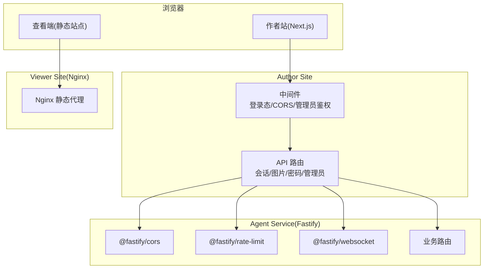
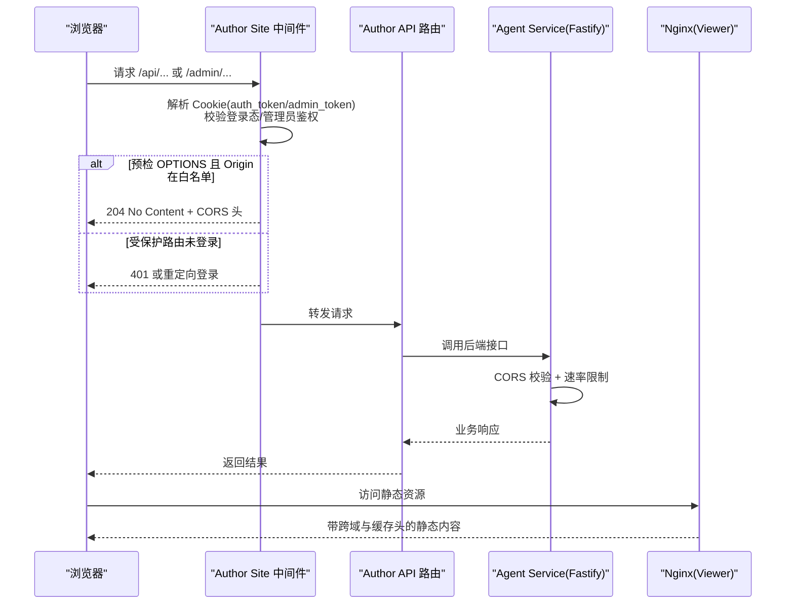
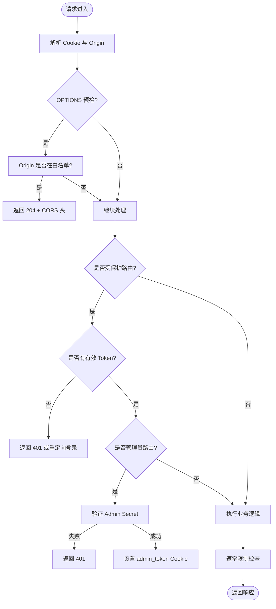
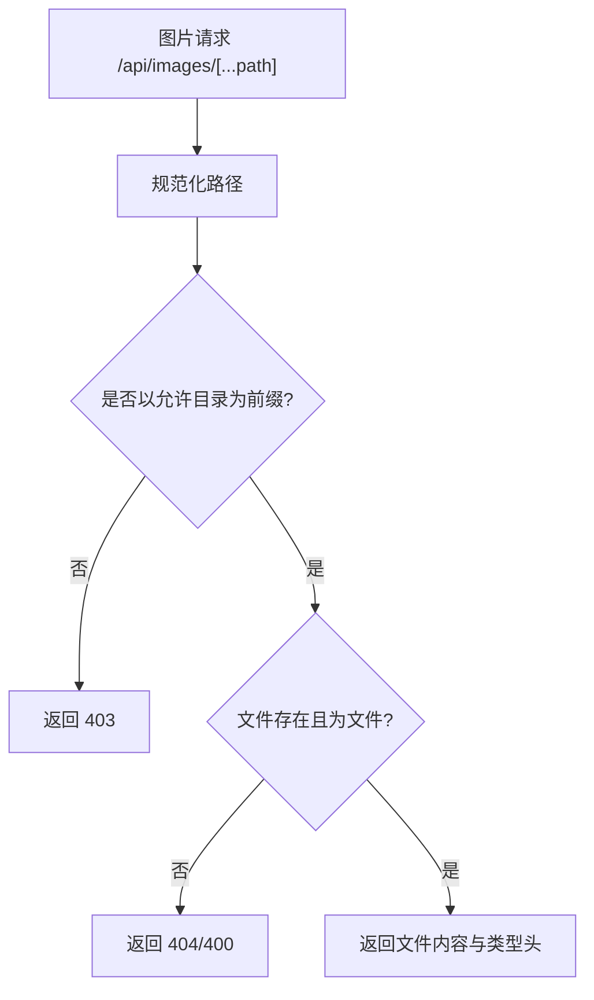
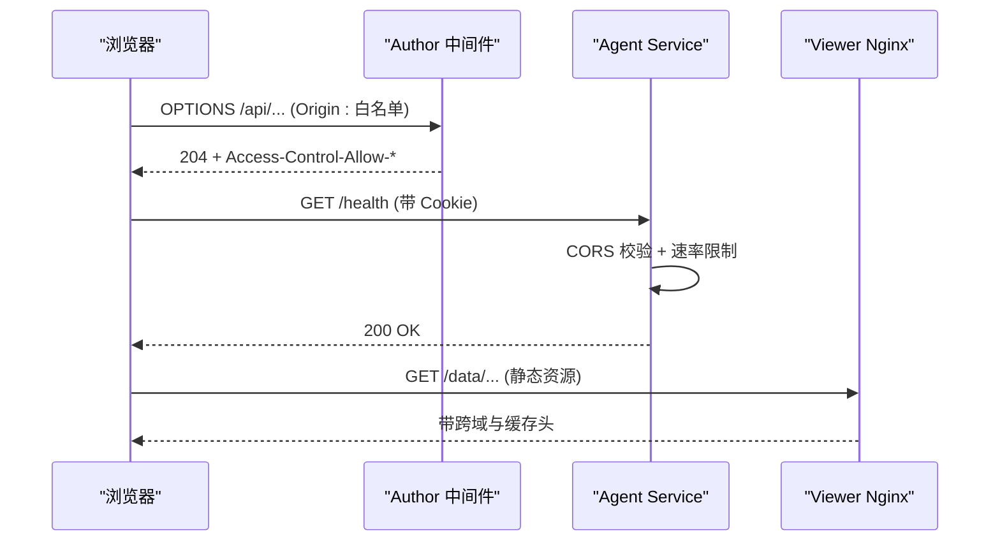
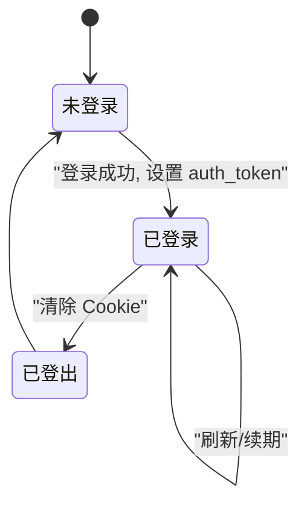
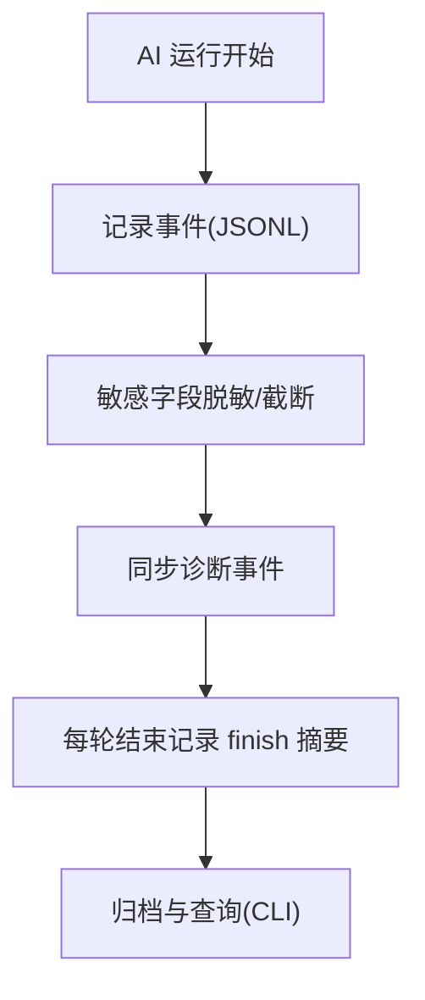
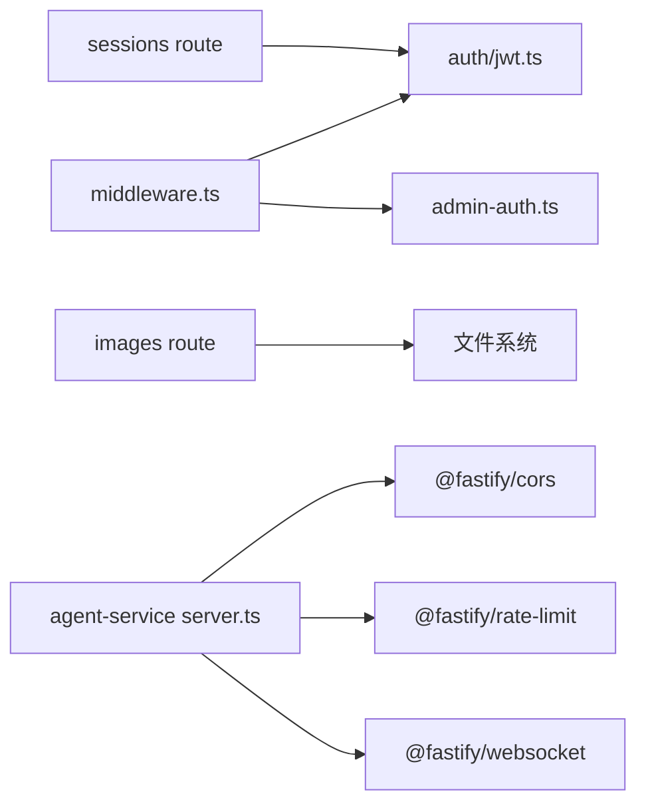

# 安全架构

<cite>
**本文引用的文件列表**
- [packages/author-site/src/lib/auth/jwt.ts](file://packages/author-site/src/lib/auth/jwt.ts)
- [packages/author-site/src/middleware.ts](file://packages/author-site/src/middleware.ts)
- [packages/agent-service/src/server.ts](file://packages/agent-service/src/server.ts)
- [packages/agent-service/src/utils/config.ts](file://packages/agent-service/src/utils/config.ts)
- [packages/agent-service/src/backends/pi-tools/web-read-tool.ts](file://packages/agent-service/src/backends/pi-tools/web-read-tool.ts)
- [packages/author-site/src/app/api/images/[...path]/route.ts](file://packages/author-site/src/app/api/images/[...path]/route.ts)
- [packages/author-site/src/lib/admin-auth.ts](file://packages/author-site/src/lib/admin-auth.ts)
- [packages/author-site/src/app/api/sessions/[sessionId]/route.ts](file://packages/author-site/src/app/api/sessions/[sessionId]/route.ts)
- [packages/author-site/src/lib/session-manager.ts](file://packages/author-site/src/lib/session-manager.ts)
- [packages/author-site/src/lib/user.ts](file://packages/author-site/src/lib/user.ts)
- [packages/author-site/src/lib/auth/password.ts](file://packages/author-site/src/lib/auth/password.ts)
- [packages/author-site/src/app/api/auth/change-password/route.ts](file://packages/author-site/src/app/api/auth/change-password/route.ts)
- [packages/author-site/src/app/api/admin/users/[userId]/reset-password/route.ts](file://packages/author-site/src/app/api/admin/users/[userId]/reset-password/route.ts)
- [packages/author-site/src/lib/external-auth.ts](file://packages/author-site/src/lib/external-auth.ts)
- [packages/author-site/src/lib/user-model-config.ts](file://packages/author-site/src/lib/user-model-config.ts)
- [docs/项目文档/使用端/03-部署与嵌入/技术/01_部署与CORS配置.md](file://docs/项目文档/使用端/03-部署与嵌入/技术/01_部署与CORS配置.md)
- [docker/viewer-site/nginx.conf](file://docker/viewer-site/nginx.conf)
- [docs/项目文档/创作端/05-AI对话/技术/07_运行进度与事件日志.md](file://docs/项目文档/创作端/05-AI对话/技术/07_运行进度与事件日志.md)
- [OPS/CLI/src/commands/logs.ts](file://OPS/CLI/src/commands/logs.ts)
- [OPS/CLI/src/commands/diagnostics.ts](file://OPS/CLI/src/commands/diagnostics.ts)
- [docs/项目文档/创作端/06-基础设施/技术/03_Docker部署方案.md](file://docs/项目文档/创作端/06-基础设施/技术/03_Docker部署方案.md)
- [docs/项目文档/创作端/08-管理后台/技术/01_架构设计.md](file://docs/项目文档/创作端/08-管理后台/技术/01_架构设计.md)
</cite>

## 目录
1. [简介](#简介)
2. [项目结构](#项目结构)
3. [核心组件](#核心组件)
4. [架构总览](#架构总览)
5. [详细组件分析](#详细组件分析)
6. [依赖关系分析](#依赖关系分析)
7. [性能与安全权衡](#性能与安全权衡)
8. [故障排查指南](#故障排查指南)
9. [结论](#结论)
10. [附录：最佳实践与合规建议](#附录最佳实践与合规建议)

## 简介
本安全架构文档面向 Workbench 平台，围绕认证授权、API 访问控制、数据安全、网络安全、会话安全、审计日志、应急响应与安全配置管理等维度进行系统化说明。文档基于仓库中实际实现进行分析，并给出可视化图示与可操作的安全建议，帮助研发与运维团队在开发与生产环境中正确落地安全策略。

## 项目结构
Workbench 采用多包（monorepo）组织，关键安全相关代码分布在 author-site（Next.js 创作端）、agent-service（Fastify 后端服务）、viewer-site（静态站点/Nginx）以及 OPS CLI 工具中。整体分层如下：
- 前端中间件与路由守卫：author-site 的 Next.js 中间件负责登录态校验、CORS 头注入、管理员鉴权等。
- 服务端网关与限流：agent-service 基于 Fastify 注册 CORS、WebSocket、速率限制插件，并提供健康检查与路由。
- 数据与权限：用户密码哈希存储、JWT 令牌签发与校验、外部凭证加密、工作区权限校验、路径穿越防护等。
- 审计与诊断：AI 运行日志 JSONL、结构化诊断事件、CLI 日志收集与展示。
- 部署与网络：Nginx 静态资源代理、CORS 环境变量统一配置、HTTPS 支持策略。



图表来源
- [packages/author-site/src/middleware.ts:1-153](file://packages/author-site/src/middleware.ts#L1-L153)
- [packages/agent-service/src/server.ts:1-117](file://packages/agent-service/src/server.ts#L1-L117)
- [docker/viewer-site/nginx.conf:1-44](file://docker/viewer-site/nginx.conf#L1-L44)

章节来源
- [packages/author-site/src/middleware.ts:1-153](file://packages/author-site/src/middleware.ts#L1-L153)
- [packages/agent-service/src/server.ts:1-117](file://packages/agent-service/src/server.ts#L1-L117)
- [docker/viewer-site/nginx.conf:1-44](file://docker/viewer-site/nginx.conf#L1-L44)

## 核心组件
- JWT 令牌管理：创建、验证、Cookie 设置与清除，支持生产环境 secure 标志与环境变量开关。
- 用户身份验证：用户名/密码校验、密码哈希与验证、修改密码流程、管理员重置密码。
- 管理员鉴权：Admin Secret 校验（URL 参数或 Cookie），Edge Runtime 兼容的 SHA-256 哈希。
- API 访问控制：中间件对受保护页面/API 进行登录态拦截；CORS 白名单与预检处理；速率限制。
- 数据安全：图片路径遍历防护、会话元数据一致性校验、外部凭证 AES-GCM 加密、敏感字段脱敏。
- 网络安全：CORS 配置（author-site 中间件与 agent-service 插件）、Nginx 静态资源跨域与缓存策略。
- 会话安全：Cookie 属性（httpOnly、secure、sameSite、maxAge）、登出清理、并发与会话数量限制。
- 审计日志：AI 运行日志 JSONL、诊断事件聚合、CLI 日志检索与过滤。

章节来源
- [packages/author-site/src/lib/auth/jwt.ts:1-71](file://packages/author-site/src/lib/auth/jwt.ts#L1-L71)
- [packages/author-site/src/lib/admin-auth.ts:1-134](file://packages/author-site/src/lib/admin-auth.ts#L1-L134)
- [packages/author-site/src/middleware.ts:1-153](file://packages/author-site/src/middleware.ts#L1-L153)
- [packages/agent-service/src/server.ts:1-117](file://packages/agent-service/src/server.ts#L1-L117)
- [packages/agent-service/src/utils/config.ts:1-47](file://packages/agent-service/src/utils/config.ts#L1-L47)
- [packages/author-site/src/lib/external-auth.ts:44-89](file://packages/author-site/src/lib/external-auth.ts#L44-L89)
- [packages/author-site/src/lib/user-model-config.ts:1-61](file://packages/author-site/src/lib/user-model-config.ts#L1-L61)
- [docs/项目文档/创作端/05-AI对话/技术/07_运行进度与事件日志.md:61-81](file://docs/项目文档/创作端/05-AI对话/技术/07_运行进度与事件日志.md#L61-L81)

## 架构总览
从请求进入至响应返回的关键安全链路：
- 浏览器发起请求到 author-site，中间件解析 Cookie 中的 auth_token，校验登录态；若为 OPTIONS 预检且 Origin 在白名单，直接返回 204。
- 受保护页面/API 未登录则重定向登录页或返回 401。
- 管理员路由需 Admin Secret 校验，支持 URL 参数首次访问后设置 admin_token Cookie。
- 业务 API 调用 agent-service，后者启用 CORS 与速率限制，并对 WebSocket 提供连接能力。
- 对外静态资源由 viewer-site 的 Nginx 代理，按需设置跨域与缓存策略。



图表来源
- [packages/author-site/src/middleware.ts:45-147](file://packages/author-site/src/middleware.ts#L45-L147)
- [packages/agent-service/src/server.ts:46-66](file://packages/agent-service/src/server.ts#L46-L66)
- [docker/viewer-site/nginx.conf:12-31](file://docker/viewer-site/nginx.conf#L12-L31)

## 详细组件分析

### 认证与授权机制
- JWT 令牌管理
  - 使用 HS256 算法签名，默认 7 天过期，通过 httpOnly Cookie 传递，生产环境默认启用 secure 标志，可通过环境变量关闭以适配 HTTP 内网部署。
  - 提供创建、验证、获取、清除 Cookie 的统一方法。
- 用户身份验证
  - 用户名/密码校验，密码使用 bcrypt 哈希存储与比对；提供最小长度校验。
  - 修改密码流程要求当前登录态，成功后记录重置日志并强制重新登录。
- 管理员鉴权
  - Admin Secret 支持 URL 参数与 Cookie 两种形式，Edge Runtime 下使用 Web Crypto API 计算 SHA-256 哈希。
  - 中间件对 /admin 与 /api/admin/* 进行拦截，未通过返回 401。

```mermaid
classDiagram
class JwtManager {
+createToken(payload) string
+verifyToken(token) UserPayload|null
+setAuthCookie(token) void
+getAuthCookie() string|undefined
+clearAuthCookie() void
}
class AdminAuth {
+getAdminSecret() string
+hashSecret(secret) Promise~string~
+verifyAdminSecret(request) Promise~boolean~
+verifyAdminRequest(request) Promise~boolean~
+setAdminCookie() Promise~void~
+clearAdminCookie() void
+withAdminAuth(request, handler) Response
}
class PasswordUtils {
+hashPassword(password) Promise~string~
+verifyPassword(password, hash) Promise~boolean~
+validateUsername(username) {valid,error}
+validatePassword(password) {valid,error}
}
JwtManager --> PasswordUtils : "配合登录流程"
AdminAuth --> JwtManager : "独立于用户登录态"
```

图表来源
- [packages/author-site/src/lib/auth/jwt.ts:1-71](file://packages/author-site/src/lib/auth/jwt.ts#L1-L71)
- [packages/author-site/src/lib/admin-auth.ts:1-134](file://packages/author-site/src/lib/admin-auth.ts#L1-L134)
- [packages/author-site/src/lib/auth/password.ts:1-34](file://packages/author-site/src/lib/auth/password.ts#L1-L34)

章节来源
- [packages/author-site/src/lib/auth/jwt.ts:1-71](file://packages/author-site/src/lib/auth/jwt.ts#L1-L71)
- [packages/author-site/src/lib/admin-auth.ts:1-134](file://packages/author-site/src/lib/admin-auth.ts#L1-L134)
- [packages/author-site/src/lib/auth/password.ts:1-34](file://packages/author-site/src/lib/auth/password.ts#L1-L34)
- [packages/author-site/src/app/api/auth/change-password/route.ts:1-43](file://packages/author-site/src/app/api/auth/change-password/route.ts#L1-L43)
- [packages/author-site/src/app/api/admin/users/[userId]/reset-password/route.ts:1-51](file://packages/author-site/src/app/api/admin/users/[userId]/reset-password/route.ts#L1-L51)

### API 访问控制
- 路由守卫
  - 中间件对受保护页面与 API 进行登录态校验；已登录访问登录/注册页自动重定向首页。
  - 管理员路由需要 Admin Secret 校验，并通过 Cookie 维持会话。
- 权限验证
  - 会话删除等操作在 API 层再次校验 token 与 payload，确保资源归属一致。
- 请求频率限制
  - agent-service 启用 @fastify/rate-limit，通过环境变量配置最大请求数与时间窗口。



图表来源
- [packages/author-site/src/middleware.ts:45-147](file://packages/author-site/src/middleware.ts#L45-L147)
- [packages/agent-service/src/server.ts:63-66](file://packages/agent-service/src/server.ts#L63-L66)
- [packages/agent-service/src/utils/config.ts:42-46](file://packages/agent-service/src/utils/config.ts#L42-L46)

章节来源
- [packages/author-site/src/middleware.ts:1-153](file://packages/author-site/src/middleware.ts#L1-L153)
- [packages/agent-service/src/server.ts:1-117](file://packages/agent-service/src/server.ts#L1-L117)
- [packages/agent-service/src/utils/config.ts:1-47](file://packages/agent-service/src/utils/config.ts#L1-L47)
- [packages/author-site/src/app/api/sessions/[sessionId]/route.ts:72-98](file://packages/author-site/src/app/api/sessions/[sessionId]/route.ts#L72-L98)

### 数据安全保护
- 路径遍历防护
  - 图片读取 API 严格校验目标路径位于允许目录前缀，拒绝非文件或不存在的路径。
- 文件访问控制
  - 会话管理器在列举与清理时进行防御性检查，确保 session 元数据 userId 与路径一致，避免越权访问。
- 敏感信息加密
  - 外部授权凭据与用户模型配置使用 AES-GCM 加密存储，密钥来源于环境变量或 JWT_SECRET 派生。
  - AI 运行日志对 key、token、authorization、password、secret 等敏感字段脱敏，长文本截断。



图表来源
- [packages/author-site/src/app/api/images/[...path]/route.ts:49-74](file://packages/author-site/src/app/api/images/[...path]/route.ts#L49-L74)

章节来源
- [packages/author-site/src/app/api/images/[...path]/route.ts:49-74](file://packages/author-site/src/app/api/images/[...path]/route.ts#L49-L74)
- [packages/author-site/src/lib/session-manager.ts:218-240](file://packages/author-site/src/lib/session-manager.ts#L218-L240)
- [packages/author-site/src/lib/external-auth.ts:44-89](file://packages/author-site/src/lib/external-auth.ts#L44-L89)
- [packages/author-site/src/lib/user-model-config.ts:1-61](file://packages/author-site/src/lib/user-model-config.ts#L1-L61)
- [docs/项目文档/创作端/05-AI对话/技术/07_运行进度与事件日志.md:61-81](file://docs/项目文档/创作端/05-AI对话/技术/07_运行进度与事件日志.md#L61-L81)

### 网络安全措施
- CORS 配置
  - author-site 中间件针对 /api、/embed、/viewer、/data 路由设置允许的 Origin，并支持预检快速返回。
  - agent-service 使用 @fastify/cors，通过 CORS_ORIGINS 环境变量统一配置，支持 credentials。
- HTTPS 支持
  - 生产环境默认启用 secure Cookie，可通过 USE_SECURE_COOKIE=false 适配 HTTP 内网部署。
  - 建议在反向代理层（如 Nginx/Traefik）终止 TLS，仅对内网暴露 HTTP。
- 输入验证与过滤
  - 用户名/密码强度校验；预览产物中移除危险标签与 javascript: 协议链接，降低 XSS 风险。
  - web-read 工具限制协议、禁止包含凭据的 URL、阻断内网与保留地址、限制跳转次数与内容类型。



图表来源
- [packages/author-site/src/middleware.ts:58-73](file://packages/author-site/src/middleware.ts#L58-L73)
- [packages/agent-service/src/server.ts:46-66](file://packages/agent-service/src/server.ts#L46-L66)
- [docker/viewer-site/nginx.conf:12-31](file://docker/viewer-site/nginx.conf#L12-L31)
- [docs/项目文档/使用端/03-部署与嵌入/技术/01_部署与CORS配置.md:70-101](file://docs/项目文档/使用端/03-部署与嵌入/技术/01_部署与CORS配置.md#L70-L101)

章节来源
- [packages/author-site/src/middleware.ts:1-153](file://packages/author-site/src/middleware.ts#L1-L153)
- [packages/agent-service/src/server.ts:1-117](file://packages/agent-service/src/server.ts#L1-L117)
- [docker/viewer-site/nginx.conf:1-44](file://docker/viewer-site/nginx.conf#L1-L44)
- [docs/项目文档/使用端/03-部署与嵌入/技术/01_部署与CORS配置.md:70-101](file://docs/项目文档/使用端/03-部署与嵌入/技术/01_部署与CORS配置.md#L70-L101)
- [packages/agent-service/src/backends/pi-tools/web-read-tool.ts:202-375](file://packages/agent-service/src/backends/pi-tools/web-read-tool.ts#L202-L375)

### 会话安全管理
- 会话存储与过期
  - 用户会话通过 JWT Cookie 维护，httpOnly、sameSite=lax、maxAge=7 天；生产环境默认 secure。
  - 管理员会话通过 admin_token Cookie，2 小时过期。
- 并发控制
  - 会话数量限制与清理策略按用户与项目维度执行，避免单用户占用过多资源。
- 并发与会话一致性
  - 会话元数据 userId 与路径不一致时记录警告并跳过，防止数据损坏导致的越权。



图表来源
- [packages/author-site/src/lib/auth/jwt.ts:44-56](file://packages/author-site/src/lib/auth/jwt.ts#L44-L56)
- [packages/author-site/src/lib/admin-auth.ts:89-106](file://packages/author-site/src/lib/admin-auth.ts#L89-L106)
- [packages/author-site/src/lib/session-manager.ts:218-240](file://packages/author-site/src/lib/session-manager.ts#L218-L240)

章节来源
- [packages/author-site/src/lib/auth/jwt.ts:1-71](file://packages/author-site/src/lib/auth/jwt.ts#L1-L71)
- [packages/author-site/src/lib/admin-auth.ts:1-134](file://packages/author-site/src/lib/admin-auth.ts#L1-L134)
- [packages/author-site/src/lib/session-manager.ts:218-240](file://packages/author-site/src/lib/session-manager.ts#L218-L240)

### 审计日志系统
- 操作记录
  - AI 运行日志以 JSONL 格式写入 data/agent-run-logs/<sessionId>/<messageId>.jsonl，包含时间、级别、来源、事件类型、摘要与脱敏后的 payload。
- 安全事件追踪
  - 关键边界事件同步到结构化诊断事件流，便于 SQLite/JSONL 查询入口串联。
- 合规性报告
  - OPS CLI 提供日志收集、过滤与展示，支持本地文件与远程会话诊断聚合。



图表来源
- [docs/项目文档/创作端/05-AI对话/技术/07_运行进度与事件日志.md:61-81](file://docs/项目文档/创作端/05-AI对话/技术/07_运行进度与事件日志.md#L61-L81)
- [OPS/CLI/src/commands/logs.ts:46-94](file://OPS/CLI/src/commands/logs.ts#L46-L94)
- [OPS/CLI/src/commands/diagnostics.ts:639-665](file://OPS/CLI/src/commands/diagnostics.ts#L639-L665)

章节来源
- [docs/项目文档/创作端/05-AI对话/技术/07_运行进度与事件日志.md:61-81](file://docs/项目文档/创作端/05-AI对话/技术/07_运行进度与事件日志.md#L61-L81)
- [OPS/CLI/src/commands/logs.ts:46-94](file://OPS/CLI/src/commands/logs.ts#L46-L94)
- [OPS/CLI/src/commands/diagnostics.ts:639-665](file://OPS/CLI/src/commands/diagnostics.ts#L639-L665)

## 依赖关系分析
- 组件耦合
  - author-site 中间件依赖 JWT 与 Admin Auth 模块；API 路由依赖会话管理与用户模型。
  - agent-service 依赖 Fastify 插件（cors、rate-limit、websocket）与配置加载器。
- 外部依赖
  - jose（JWT）、bcrypt（密码哈希）、@fastify/*（CORS、rate-limit、websocket）。
- 潜在循环依赖
  - 当前实现未见明显循环依赖；中间件与路由职责清晰分离。



图表来源
- [packages/author-site/src/middleware.ts:1-153](file://packages/author-site/src/middleware.ts#L1-L153)
- [packages/agent-service/src/server.ts:1-117](file://packages/agent-service/src/server.ts#L1-L117)

章节来源
- [packages/author-site/src/middleware.ts:1-153](file://packages/author-site/src/middleware.ts#L1-L153)
- [packages/agent-service/src/server.ts:1-117](file://packages/agent-service/src/server.ts#L1-L117)

## 性能与安全权衡
- 速率限制
  - 合理设置 RATE_LIMIT_MAX 与 RATE_LIMIT_WINDOW，平衡用户体验与抗滥用能力。
- 静态资源缓存
  - Nginx 对静态资源设置合理的 Cache-Control，减少带宽与服务器压力，同时保证敏感数据 no-store。
- 日志体积控制
  - 脱敏与截断避免大体积日志影响磁盘与 I/O，必要时结合日志轮转与归档策略。

[本节为通用指导，不直接分析具体文件]

## 故障排查指南
- 登录态异常
  - 检查 auth_token 是否存在、是否 httpOnly/secure/sameSite 配置符合预期；确认 JWT_SECRET 一致。
- CORS 预检失败
  - 核对 CORS_ORIGINS 环境变量与浏览器 Origin 匹配；确认中间件对 OPTIONS 返回 204。
- 图片访问 403/404
  - 检查路径是否以允许目录为前缀、文件是否存在且为文件类型。
- 管理员无法访问
  - 确认 Admin Secret 是否正确；URL 参数或 admin_token Cookie 是否有效。
- 日志缺失
  - 使用 OPS CLI 定位日志位置与最近条目；检查 JSONL 写入权限与磁盘空间。

章节来源
- [packages/author-site/src/lib/auth/jwt.ts:1-71](file://packages/author-site/src/lib/auth/jwt.ts#L1-L71)
- [packages/author-site/src/middleware.ts:1-153](file://packages/author-site/src/middleware.ts#L1-L153)
- [packages/author-site/src/app/api/images/[...path]/route.ts:49-74](file://packages/author-site/src/app/api/images/[...path]/route.ts#L49-L74)
- [packages/author-site/src/lib/admin-auth.ts:1-134](file://packages/author-site/src/lib/admin-auth.ts#L1-L134)
- [OPS/CLI/src/commands/logs.ts:46-94](file://OPS/CLI/src/commands/logs.ts#L46-L94)

## 结论
Workbench 平台在认证授权、API 访问控制、数据安全、网络安全、会话安全与审计日志方面具备较为完善的基础能力。通过环境变量集中化配置、中间件统一治理、插件化限流与跨域控制，形成了层次化的安全防线。建议在生产环境强化 HTTPS 终止、密钥轮换、日志归档与告警联动，持续提升整体安全水位。

[本节为总结性内容，不直接分析具体文件]

## 附录：最佳实践与合规建议
- 代码安全扫描
  - 引入 SAST/DAST 工具链，定期扫描依赖漏洞与敏感信息泄露。
- 漏洞检测与修复
  - 建立漏洞分级与 SLA，优先修复高危问题；对第三方依赖进行版本锁定与更新计划。
- 应急响应流程
  - 制定事件分级、处置步骤与复盘模板；演练常见攻击场景（凭证泄露、越权访问、SSRF 等）。
- 安全配置管理
  - 密钥管理：JWT_SECRET、ADMIN_SECRET、MODEL_CONFIG_ENCRYPTION_KEY 等必须通过安全渠道注入，禁止硬编码。
  - 证书配置：在反向代理层管理 TLS 证书，定期轮换；开启 HSTS、强密码套件。
  - 安全参数调优：根据业务量调整速率限制阈值、日志保留周期与静态资源缓存策略。

章节来源
- [docs/项目文档/创作端/06-基础设施/技术/03_Docker部署方案.md:151-169](file://docs/项目文档/创作端/06-基础设施/技术/03_Docker部署方案.md#L151-L169)
- [docs/项目文档/创作端/08-管理后台/技术/01_架构设计.md:297-328](file://docs/项目文档/创作端/08-管理后台/技术/01_架构设计.md#L297-L328)