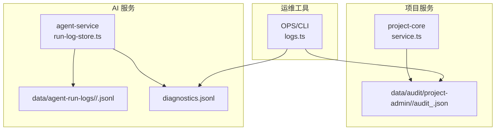
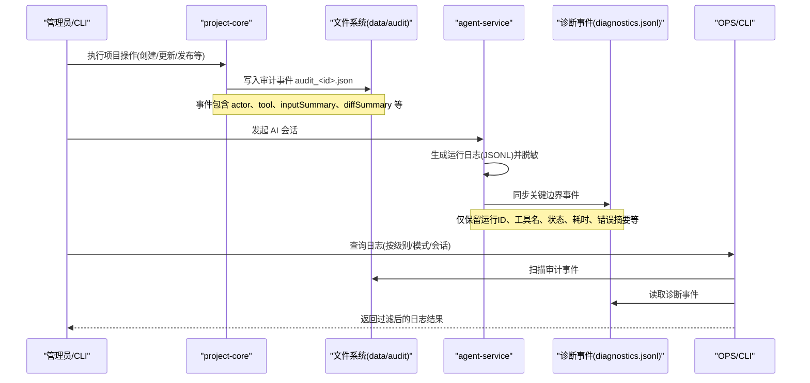
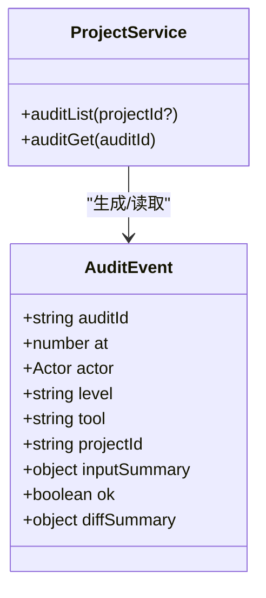
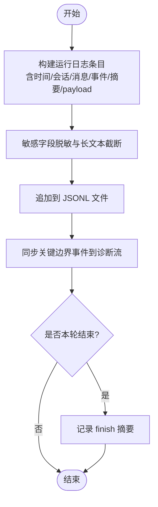
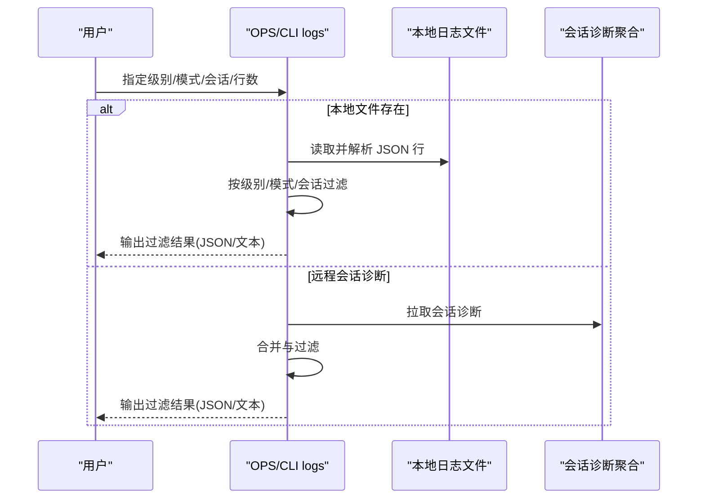
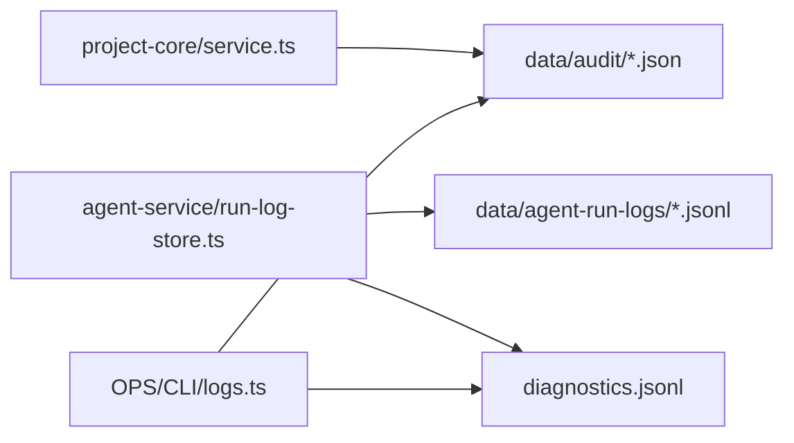

# 审计日志系统

<cite>
**本文引用的文件**   
- [packages/project-core/src/service.ts](file://packages/project-core/src/service.ts)
- [data/audit/project-admin/2026-07-02/audit_1782980494806_mrytao.json](file://data/audit/project-admin/2026-07-02/audit_1782980494806_mrytao.json)
- [docs/项目文档/创作端/05-AI对话/技术/07_运行进度与事件日志.md](file://docs/项目文档/创作端/05-AI对话/技术/07_运行进度与事件日志.md)
- [packages/agent-service/src/session/run-log-store.ts](file://packages/agent-service/src/session/run-log-store.ts)
- [OPS/CLI/src/commands/logs.ts](file://OPS/CLI/src/commands/logs.ts)
</cite>

## 目录
1. [简介](#简介)
2. [项目结构](#项目结构)
3. [核心组件](#核心组件)
4. [架构总览](#架构总览)
5. [详细组件分析](#详细组件分析)
6. [依赖分析](#依赖分析)
7. [性能考虑](#性能考虑)
8. [故障排查指南](#故障排查指南)
9. [结论](#结论)
10. [附录](#附录)

## 简介
本文件为 Workbench 平台的审计日志系统提供系统化文档，覆盖操作记录机制、安全事件追踪、日志存储策略、日志分析工具、合规性报告以及日志安全与性能优化。内容基于仓库中已实现的审计与诊断日志能力进行梳理，并结合现有数据与代码路径给出可操作的实践建议。

## 项目结构
Workbench 的审计与诊断日志涉及多个子系统：
- 项目管理侧（project-core）负责“项目级”审计事件的生成与持久化，按日期分目录存放 JSON 文件。
- AI 会话侧（agent-service）负责“AI 运行日志”，以 JSONL 形式落盘，并对敏感字段脱敏；同时输出结构化诊断事件供统一查询。
- 运维 CLI（OPS/CLI）提供本地日志检索与过滤能力，支持按级别、模式、会话 ID 筛选。
- 数据层（data/audit）保存历史审计事件，便于回溯与导出。

图示来源
- [packages/project-core/src/service.ts:4562-4578](file://packages/project-core/src/service.ts#L4562-L4578)
- [packages/agent-service/src/session/run-log-store.ts:355-384](file://packages/agent-service/src/session/run-log-store.ts#L355-L384)
- [OPS/CLI/src/commands/logs.ts:61-129](file://OPS/CLI/src/commands/logs.ts#L61-L129)

章节来源
- [packages/project-core/src/service.ts:4562-4578](file://packages/project-core/src/service.ts#L4562-L4578)
- [packages/agent-service/src/session/run-log-store.ts:355-384](file://packages/agent-service/src/session/run-log-store.ts#L355-L384)
- [OPS/CLI/src/commands/logs.ts:61-129](file://OPS/CLI/src/commands/logs.ts#L61-L129)

## 核心组件
- 项目审计事件写入与查询
  - 写入：在关键业务动作完成后，生成审计事件并写入 data/audit/project-admin/<YYYY-MM-DD>/<auditId>.json。
  - 查询：提供列表与按 ID 获取接口，支持按 projectId 过滤并按时间倒序排序。
- AI 运行日志与诊断事件
  - 运行日志：以 JSONL 格式写入 data/agent-run-logs/<sessionId>/<messageId>.jsonl，包含时间戳、会话/消息标识、事件类型、标题、摘要及脱敏后的 payload。
  - 诊断事件：将本轮运行的关键边界事件同步到结构化诊断流，便于跨模块串联查询。
- 运维日志检索
  - 支持从本地日志文件或远程会话诊断聚合结果中读取，按级别、模式、会话 ID 过滤，并以 JSON 或格式化文本输出。

章节来源
- [packages/project-core/src/service.ts:4562-4578](file://packages/project-core/src/service.ts#L4562-L4578)
- [docs/项目文档/创作端/05-AI对话/技术/07_运行进度与事件日志.md:61-81](file://docs/项目文档/创作端/05-AI对话/技术/07_运行进度与事件日志.md#L61-L81)
- [packages/agent-service/src/session/run-log-store.ts:355-384](file://packages/agent-service/src/session/run-log-store.ts#L355-L384)
- [OPS/CLI/src/commands/logs.ts:61-129](file://OPS/CLI/src/commands/logs.ts#L61-L129)

## 架构总览
审计日志体系由“项目审计 + AI 运行日志 + 诊断事件 + 运维检索”构成，形成端到端的可观测闭环。

图示来源
- [packages/project-core/src/service.ts:4562-4578](file://packages/project-core/src/service.ts#L4562-L4578)
- [packages/agent-service/src/session/run-log-store.ts:355-384](file://packages/agent-service/src/session/run-log-store.ts#L355-L384)
- [OPS/CLI/src/commands/logs.ts:61-129](file://OPS/CLI/src/commands/logs.ts#L61-L129)

## 详细组件分析

### 项目审计事件（Project Audit）
- 事件模型要点
  - 唯一标识：auditId
  - 时间戳：at
  - 操作者：actor.id/name/role/source
  - 级别：level（如 L1）
  - 工具/动作：tool（如 project_create）
  - 资源：projectId
  - 输入摘要：inputSummary
  - 结果：ok
  - 变更摘要：diffSummary（如 created/updated/deleted）
- 存储与访问
  - 存储路径：data/audit/project-admin/<YYYY-MM-DD>/<auditId>.json
  - 列表与详情：通过 service.ts 提供的 auditList 与 auditGet 方法实现，支持按 projectId 过滤与时间倒序排列。

图示来源
- [packages/project-core/src/service.ts:4562-4578](file://packages/project-core/src/service.ts#L4562-L4578)
- [data/audit/project-admin/2026-07-02/audit_1782980494806_mrytao.json:1-23](file://data/audit/project-admin/2026-07-02/audit_1782980494806_mrytao.json#L1-L23)

章节来源
- [packages/project-core/src/service.ts:4562-4578](file://packages/project-core/src/service.ts#L4562-L4578)
- [data/audit/project-admin/2026-07-02/audit_1782980494806_mrytao.json:1-23](file://data/audit/project-admin/2026-07-02/audit_1782980494806_mrytao.json#L1-L23)

### AI 运行日志与诊断事件（Agent Run Logs & Diagnostics）
- 运行日志
  - 路径：data/agent-run-logs/<sessionId>/<messageId>.jsonl
  - 每条日志为一行 JSON，包含时间、级别、来源、事件类型、标题、摘要、关联工具调用 ID 和脱敏后的 payload。
  - 写入失败不应中断用户对话，仅记录服务端警告。
  - 敏感字段脱敏：key、token、authorization、password、secret 等；长文本截断。
- 诊断事件
  - 同步关键边界事件到结构化诊断事件流，便于跨模块串联查询。
  - 每轮结束必须记录 finish 摘要，包括最终回复长度、累计流式输出长度、工具结果数量、子 Agent 结果数量、文件结果数量、Authority receipt 资源信息、后端错误或空回复调试信息等。

图示来源
- [docs/项目文档/创作端/05-AI对话/技术/07_运行进度与事件日志.md:61-81](file://docs/项目文档/创作端/05-AI对话/技术/07_运行进度与事件日志.md#L61-L81)
- [packages/agent-service/src/session/run-log-store.ts:355-384](file://packages/agent-service/src/session/run-log-store.ts#L355-L384)

章节来源
- [docs/项目文档/创作端/05-AI对话/技术/07_运行进度与事件日志.md:61-81](file://docs/项目文档/创作端/05-AI对话/技术/07_运行进度与事件日志.md#L61-L81)
- [packages/agent-service/src/session/run-log-store.ts:355-384](file://packages/agent-service/src/session/run-log-store.ts#L355-L384)

### 运维日志检索（OPS/CLI logs）
- 功能要点
  - 自动定位本地日志文件（支持根目录或 latest.log）。
  - 支持按级别、模式、会话 ID 过滤，返回最近 N 条。
  - 支持 JSON 模式输出，便于集成自动化流程。
- 使用场景
  - 快速定位问题、核对审计事件、查看 AI 运行日志与诊断事件。

图示来源
- [OPS/CLI/src/commands/logs.ts:61-129](file://OPS/CLI/src/commands/logs.ts#L61-L129)

章节来源
- [OPS/CLI/src/commands/logs.ts:61-129](file://OPS/CLI/src/commands/logs.ts#L61-L129)

## 依赖分析
- 组件耦合
  - project-core 直接依赖文件系统写入审计事件，并通过 service.ts 暴露查询接口。
  - agent-service 独立维护运行日志与诊断事件，避免对主业务流程产生阻塞。
  - OPS/CLI 作为只读消费者，聚合本地与远程日志源，提供统一检索入口。
- 外部依赖
  - 文件系统 I/O：JSON/JSONL 文件读写。
  - 可选远程 API：用于会话诊断聚合（当本地不可用时）。

图示来源
- [packages/project-core/src/service.ts:4562-4578](file://packages/project-core/src/service.ts#L4562-L4578)
- [packages/agent-service/src/session/run-log-store.ts:355-384](file://packages/agent-service/src/session/run-log-store.ts#L355-L384)
- [OPS/CLI/src/commands/logs.ts:61-129](file://OPS/CLI/src/commands/logs.ts#L61-L129)

章节来源
- [packages/project-core/src/service.ts:4562-4578](file://packages/project-core/src/service.ts#L4562-L4578)
- [packages/agent-service/src/session/run-log-store.ts:355-384](file://packages/agent-service/src/session/run-log-store.ts#L355-L384)
- [OPS/CLI/src/commands/logs.ts:61-129](file://OPS/CLI/src/commands/logs.ts#L61-L129)

## 性能考虑
- 异步写入与容错
  - AI 运行日志写入失败不应中断用户对话，仅记录警告，确保用户体验不受影响。
- 批量处理
  - 建议对高频审计事件采用批量化写入（例如缓冲后批量落盘），降低频繁 I/O 开销。
- 索引优化
  - 当前按日期分目录存储，适合按天范围查询。若需提升按 sessionId 或 tool 的检索效率，可在上层引入轻量索引（如 SQLite 或 JSONL 索引文件）。
- 脱敏与截断
  - 对敏感字段脱敏与长文本截断可减少日志体积，提高 I/O 与传输效率。

[本节为通用性能建议，不直接分析具体文件]

## 故障排查指南
- 常见问题
  - 审计事件缺失：检查 project-core 写入逻辑与 data/audit 目录权限。
  - AI 运行日志未生成：确认 run-log-store 的 append 流程与磁盘空间。
  - 运维检索无结果：确认本地日志路径是否存在，或远程会话诊断是否可达。
- 定位步骤
  - 使用 OPS/CLI 按级别/模式/会话过滤，快速缩小范围。
  - 针对特定项目，使用 auditList 与 auditGet 精确查找审计事件。
  - 结合 AI 运行日志与诊断事件，交叉验证关键边界事件与 finish 摘要。

章节来源
- [packages/project-core/src/service.ts:4562-4578](file://packages/project-core/src/service.ts#L4562-L4578)
- [packages/agent-service/src/session/run-log-store.ts:355-384](file://packages/agent-service/src/session/run-log-store.ts#L355-L384)
- [OPS/CLI/src/commands/logs.ts:61-129](file://OPS/CLI/src/commands/logs.ts#L61-L129)

## 结论
Workbench 的审计日志体系在项目级与 AI 会话级均具备完善的记录与检索能力。通过统一的运维 CLI 与标准化的事件模型，平台实现了可追溯、可分析、可扩展的日志基础设施。后续可在批量写入、索引优化与可视化报表方面进一步增强，以满足更高吞吐与更复杂的合规需求。

[本节为总结性内容，不直接分析具体文件]

## 附录

### 操作记录机制
- 用户行为追踪
  - 通过 project-core 的审计事件记录关键操作（创建、更新、删除、发布等），包含操作者、工具、输入摘要与变更摘要。
- API 调用日志
  - 当前以项目操作为主，API 调用可通过审计事件中的 tool 与 inputSummary 进行归类与分析。
- 文件操作审计
  - 建议在涉及文件增删改的关键路径上补充审计事件，记录文件路径摘要与变更类型。

章节来源
- [packages/project-core/src/service.ts:4562-4578](file://packages/project-core/src/service.ts#L4562-L4578)
- [data/audit/project-admin/2026-07-02/audit_1782980494806_mrytao.json:1-23](file://data/audit/project-admin/2026-07-02/audit_1782980494806_mrytao.json#L1-L23)

### 安全事件追踪
- 登录失败记录
  - 建议在认证流程中增加登录失败审计事件，记录失败原因与来源 IP。
- 权限违规检测
  - 利用审计事件中的 role 与 tool 字段，结合规则引擎识别越权访问。
- 异常访问告警
  - 基于 OPS/CLI 的过滤能力，配置阈值告警（如短时间内多次失败或异常操作）。

[本节为概念性建议，不直接分析具体文件]

### 日志存储策略
- 日志轮转
  - 当前按日期分目录存储，天然具备按日轮转特性。
- 归档管理
  - 建议对历史日期目录进行压缩归档，并保留元数据索引以便快速检索。
- 长期保留
  - 根据合规要求设定保留周期，过期数据迁移至冷存储。

[本节为通用策略建议，不直接分析具体文件]

### 日志分析工具
- 查询接口
  - 使用 OPS/CLI 的 logs 命令进行本地与远程日志检索。
- 可视化展示
  - 可将审计事件与诊断事件导入可视化平台（如 Grafana/Elastic），构建仪表盘。
- 报表生成
  - 基于审计事件与诊断事件，定期生成合规与运营报表。

章节来源
- [OPS/CLI/src/commands/logs.ts:61-129](file://OPS/CLI/src/commands/logs.ts#L61-L129)

### 合规性报告
- 审计报告导出
  - 通过 auditList 与 auditGet 导出指定时间段与项目的审计事件。
- 监管对接
  - 将审计事件标准化为监管要求的格式，提供定时推送接口。
- 合规检查
  - 基于审计事件与诊断事件，建立合规检查清单与自动化校验流程。

章节来源
- [packages/project-core/src/service.ts:4562-4578](file://packages/project-core/src/service.ts#L4562-L4578)

### 日志安全保护措施
- 日志脱敏
  - AI 运行日志已对敏感字段脱敏与长文本截断，建议扩展至所有审计事件。
- 访问控制
  - 限制对 data/audit 与 agent-run-logs 的访问权限，仅授权人员与系统可读写。
- 完整性验证
  - 为审计事件添加哈希或签名，防止篡改；在检索时进行完整性校验。

章节来源
- [docs/项目文档/创作端/05-AI对话/技术/07_运行进度与事件日志.md:61-81](file://docs/项目文档/创作端/05-AI对话/技术/07_运行进度与事件日志.md#L61-L81)
- [packages/agent-service/src/session/run-log-store.ts:355-384](file://packages/agent-service/src/session/run-log-store.ts#L355-L384)

### 日志性能优化方案
- 异步写入
  - 保持 AI 运行日志写入非阻塞，避免影响主流程。
- 批量处理
  - 对审计事件与诊断事件采用批量化写入，减少 I/O 次数。
- 索引优化
  - 引入轻量索引（SQLite/JSONL 索引）以提升按 sessionId、tool、time 的查询性能。

[本节为通用优化建议，不直接分析具体文件]