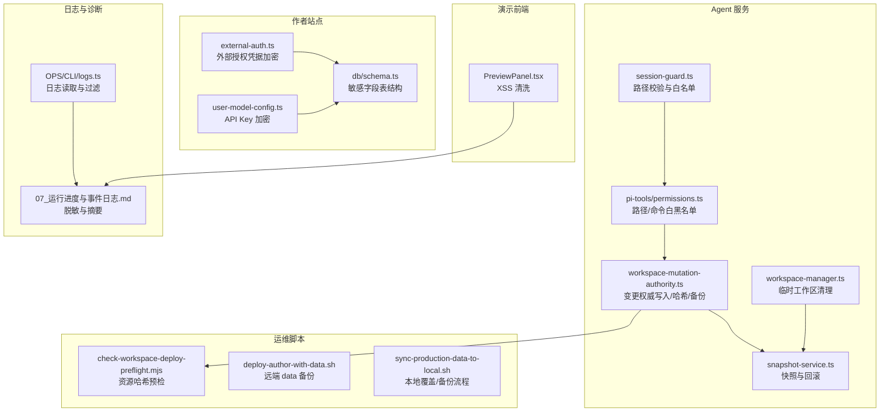
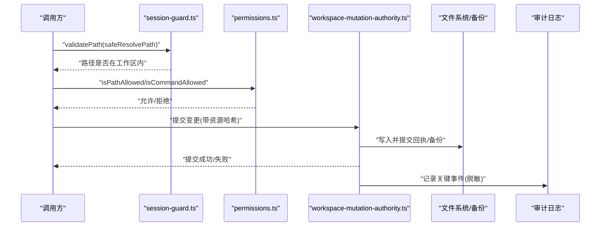
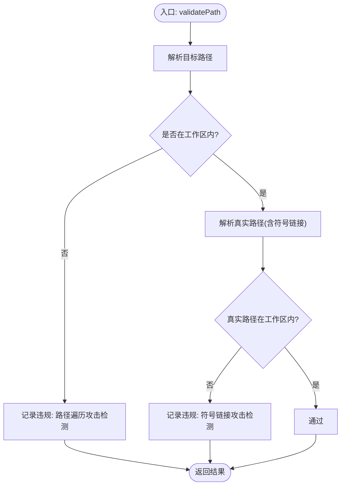
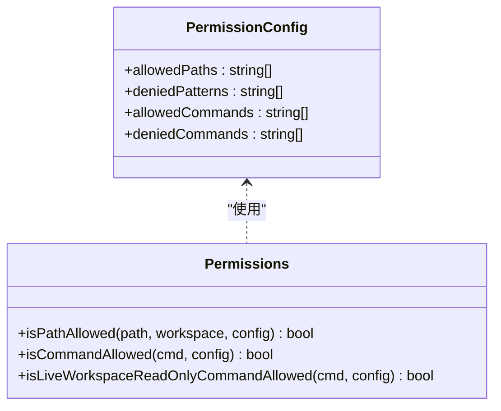
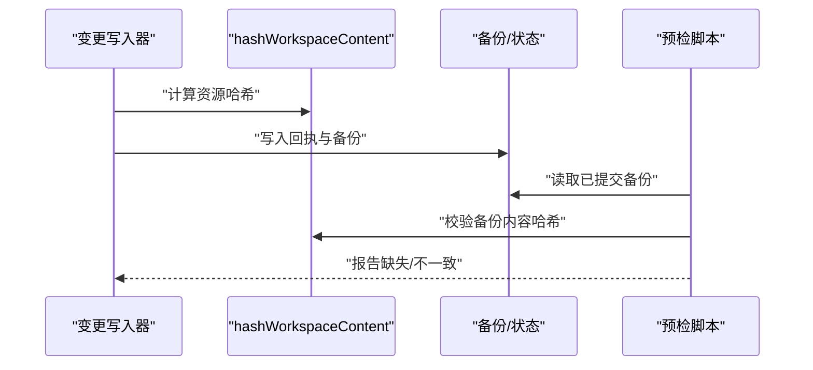
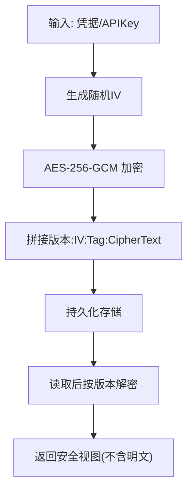
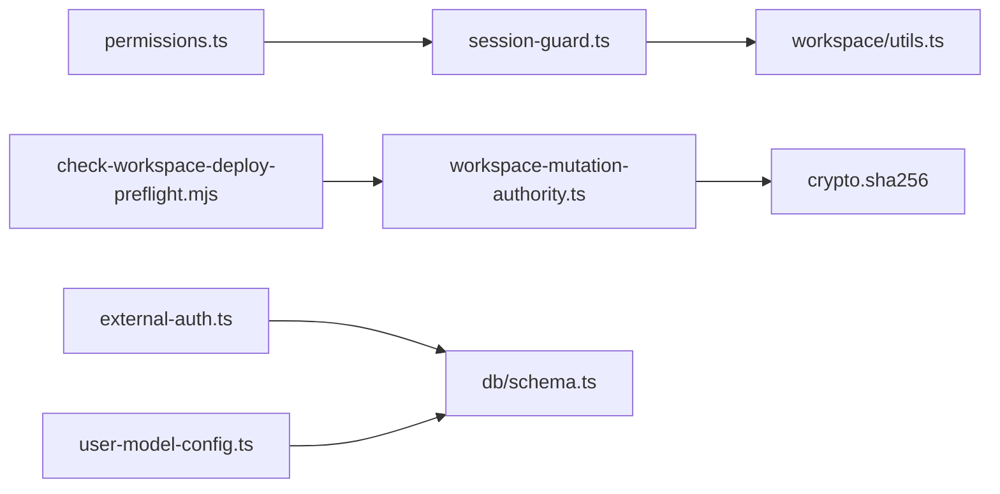

# 数据安全保护

<cite>
**本文引用的文件**   
- [packages/agent-service/src/session/session-guard.ts](file://packages/agent-service/src/session/session-guard.ts)
- [packages/agent-service/tests/unit/session-guard.test.ts](file://packages/agent-service/tests/unit/session-guard.test.ts)
- [packages/agent-service/src/backends/pi-tools/permissions.ts](file://packages/agent-service/src/backends/pi-tools/permissions.ts)
- [packages/agent-service/tests/unit/permissions.test.ts](file://packages/agent-service/tests/unit/permissions.test.ts)
- [packages/author-site/src/lib/external-auth.ts](file://packages/author-site/src/lib/external-auth.ts)
- [packages/author-site/src/lib/user-model-config.ts](file://packages/author-site/src/lib/user-model-config.ts)
- [packages/author-site/src/lib/db/schema.ts](file://packages/author-site/src/lib/db/schema.ts)
- [packages/agent-service/src/workspace/workspace-mutation-authority.ts](file://packages/agent-service/src/workspace/workspace-mutation-authority.ts)
- [scripts/check-workspace-deploy-preflight.mjs](file://scripts/check-workspace-deploy-preflight.mjs)
- [scripts/deploy-author-with-data.sh](file://scripts/deploy-author-with-data.sh)
- [scripts/sync-production-data-to-local.sh](file://scripts/sync-production-data-to-local.sh)
- [packages/demo-ui/src/PreviewPanel.tsx](file://packages/demo-ui/src/PreviewPanel.tsx)
- [docs/项目文档/创作端/05-AI对话/技术/07_运行进度与事件日志.md](file://docs/项目文档/创作端/05-AI对话/技术/07_运行进度与事件日志.md)
- [OPS/CLI/src/commands/logs.ts](file://OPS/CLI/src/commands/logs.ts)
- [packages/agent-service/src/workspace/workspace-manager.ts](file://packages/agent-service/src/workspace/workspace-manager.ts)
- [packages/agent-service/src/session/snapshot-service.ts](file://packages/agent-service/src/session/snapshot-service.ts)
</cite>

## 目录
1. [简介](#简介)
2. [项目结构](#项目结构)
3. [核心组件](#核心组件)
4. [架构总览](#架构总览)
5. [详细组件分析](#详细组件分析)
6. [依赖关系分析](#依赖关系分析)
7. [性能考量](#性能考量)
8. [故障排查指南](#故障排查指南)
9. [结论](#结论)
10. [附录](#附录)

## 简介
本文件面向 Workbench 平台的数据安全保护，覆盖路径遍历防护、工作区权限隔离、资源访问白名单与操作审计、敏感信息加密策略、数据完整性校验、内存与临时数据清理、最佳实践以及数据泄露防护方案。内容基于仓库中现有实现进行梳理与归纳，帮助读者理解当前安全措施的设计与落地方式。

## 项目结构
Workbench 在多个包中实现了数据安全相关能力：
- agent-service：会话与文件访问控制、工作区变更权威写入与备份恢复、快照回滚等
- author-site：用户模型配置与外部授权凭据的加密存储、数据库表结构定义
- demo-ui：预览输出 XSS 清洗
- scripts：部署前预检、生产数据同步与备份脚本
- OPS CLI：日志采集与展示（脱敏）
- docs：AI 行为约束与日志规范说明

图表来源
- [packages/agent-service/src/session/session-guard.ts:1-134](file://packages/agent-service/src/session/session-guard.ts#L1-L134)
- [packages/agent-service/src/backends/pi-tools/permissions.ts](file://packages/agent-service/src/backends/pi-tools/permissions.ts)
- [packages/agent-service/src/workspace/workspace-mutation-authority.ts:1-200](file://packages/agent-service/src/workspace/workspace-mutation-authority.ts#L1-L200)
- [packages/agent-service/src/session/snapshot-service.ts:302-341](file://packages/agent-service/src/session/snapshot-service.ts#L302-L341)
- [packages/agent-service/src/workspace/workspace-manager.ts:84-143](file://packages/agent-service/src/workspace/workspace-manager.ts#L84-L143)
- [packages/author-site/src/lib/external-auth.ts:59-104](file://packages/author-site/src/lib/external-auth.ts#L59-L104)
- [packages/author-site/src/lib/user-model-config.ts:45-88](file://packages/author-site/src/lib/user-model-config.ts#L45-L88)
- [packages/author-site/src/lib/db/schema.ts:1-111](file://packages/author-site/src/lib/db/schema.ts#L1-L111)
- [packages/demo-ui/src/PreviewPanel.tsx:129-168](file://packages/demo-ui/src/PreviewPanel.tsx#L129-L168)
- [scripts/check-workspace-deploy-preflight.mjs:141-164](file://scripts/check-workspace-deploy-preflight.mjs#L141-L164)
- [scripts/deploy-author-with-data.sh:172-215](file://scripts/deploy-author-with-data.sh#L172-L215)
- [scripts/sync-production-data-to-local.sh:302-334](file://scripts/sync-production-data-to-local.sh#L302-L334)
- [docs/项目文档/创作端/05-AI对话/技术/07_运行进度与事件日志.md:61-81](file://docs/项目文档/创作端/05-AI对话/技术/07_运行进度与事件日志.md#L61-L81)
- [OPS/CLI/src/commands/logs.ts:46-94](file://OPS/CLI/src/commands/logs.ts#L46-L94)

章节来源
- [packages/agent-service/src/session/session-guard.ts:1-134](file://packages/agent-service/src/session/session-guard.ts#L1-L134)
- [packages/agent-service/src/backends/pi-tools/permissions.ts](file://packages/agent-service/src/backends/pi-tools/permissions.ts)
- [packages/agent-service/src/workspace/workspace-mutation-authority.ts:1-200](file://packages/agent-service/src/workspace/workspace-mutation-authority.ts#L1-L200)
- [packages/author-site/src/lib/external-auth.ts:59-104](file://packages/author-site/src/lib/external-auth.ts#L59-L104)
- [packages/author-site/src/lib/user-model-config.ts:45-88](file://packages/author-site/src/lib/user-model-config.ts#L45-L88)
- [packages/author-site/src/lib/db/schema.ts:1-111](file://packages/author-site/src/lib/db/schema.ts#L1-L111)
- [packages/demo-ui/src/PreviewPanel.tsx:129-168](file://packages/demo-ui/src/PreviewPanel.tsx#L129-L168)
- [scripts/check-workspace-deploy-preflight.mjs:141-164](file://scripts/check-workspace-deploy-preflight.mjs#L141-L164)
- [scripts/deploy-author-with-data.sh:172-215](file://scripts/deploy-author-with-data.sh#L172-L215)
- [scripts/sync-production-data-to-local.sh:302-334](file://scripts/sync-production-data-to-local.sh#L302-L334)
- [docs/项目文档/创作端/05-AI对话/技术/07_运行进度与事件日志.md:61-81](file://docs/项目文档/创作端/05-AI对话/技术/07_运行进度与事件日志.md#L61-L81)
- [OPS/CLI/src/commands/logs.ts:46-94](file://OPS/CLI/src/commands/logs.ts#L46-L94)

## 核心组件
- 路径遍历与工作区边界防护：通过解析与规范化路径、符号链接真实路径校验、工作区内包含性检查，阻断越界访问。
- 资源访问白名单与命令白名单：对文件路径与可执行命令实施白/黑名单策略，默认拒绝危险命令与敏感文件。
- 变更权威写入与完整性校验：以 SHA-256 计算资源哈希，维护提交回执与备份，支持一致性预检与恢复。
- 敏感信息加密：对外部授权凭据与 API Key 使用 AES-256-GCM 加密，版本化存储，仅返回安全视图。
- 预览输出 XSS 清洗：移除危险标签与事件处理器，过滤 javascript: 协议。
- 审计与脱敏日志：结构化记录关键事件，对敏感字段脱敏并截断长文本。
- 临时数据与快照清理：按生命周期清理临时工作区与快照，避免残留敏感数据。

章节来源
- [packages/agent-service/src/session/session-guard.ts:76-133](file://packages/agent-service/src/session/session-guard.ts#L76-L133)
- [packages/agent-service/tests/unit/permissions.test.ts:1-141](file://packages/agent-service/tests/unit/permissions.test.ts#L1-L141)
- [packages/agent-service/src/workspace/workspace-mutation-authority.ts:23-25](file://packages/agent-service/src/workspace/workspace-mutation-authority.ts#L23-L25)
- [packages/author-site/src/lib/external-auth.ts:59-104](file://packages/author-site/src/lib/external-auth.ts#L59-L104)
- [packages/author-site/src/lib/user-model-config.ts:45-88](file://packages/author-site/src/lib/user-model-config.ts#L45-L88)
- [packages/demo-ui/src/PreviewPanel.tsx:129-168](file://packages/demo-ui/src/PreviewPanel.tsx#L129-L168)
- [docs/项目文档/创作端/05-AI对话/技术/07_运行进度与事件日志.md:61-81](file://docs/项目文档/创作端/05-AI对话/技术/07_运行进度与事件日志.md#L61-L81)
- [packages/agent-service/src/workspace/workspace-manager.ts:84-143](file://packages/agent-service/src/workspace/workspace-manager.ts#L84-L143)
- [packages/agent-service/src/session/snapshot-service.ts:302-341](file://packages/agent-service/src/session/snapshot-service.ts#L302-L341)

## 架构总览
下图展示了从请求到落盘的关键安全路径：路径校验→权限白名单→变更权威写入→备份与哈希校验→审计日志与脱敏。

图表来源
- [packages/agent-service/src/session/session-guard.ts:76-133](file://packages/agent-service/src/session/session-guard.ts#L76-L133)
- [packages/agent-service/src/backends/pi-tools/permissions.ts](file://packages/agent-service/src/backends/pi-tools/permissions.ts)
- [packages/agent-service/src/workspace/workspace-mutation-authority.ts:1-200](file://packages/agent-service/src/workspace/workspace-mutation-authority.ts#L1-L200)
- [docs/项目文档/创作端/05-AI对话/技术/07_运行进度与事件日志.md:61-81](file://docs/项目文档/创作端/05-AI对话/技术/07_运行进度与事件日志.md#L61-L81)

## 详细组件分析

### 路径遍历防护与目录边界检查
- 路径解析与规范化：先解析目标路径，再判断是否在指定工作区内；同时解析真实路径（含符号链接），再次校验边界，防止绕过。
- 非法字符与白名单：结合会话级白名单文件集合，限制可访问的文件名范围，降低误用风险。
- 批量校验：提供批量路径校验接口，便于统一拦截。

图表来源
- [packages/agent-service/src/session/session-guard.ts:76-107](file://packages/agent-service/src/session/session-guard.ts#L76-L107)
- [packages/agent-service/tests/unit/session-guard.test.ts:21-39](file://packages/agent-service/tests/unit/session-guard.test.ts#L21-L39)

章节来源
- [packages/agent-service/src/session/session-guard.ts:12-36](file://packages/agent-service/src/session/session-guard.ts#L12-L36)
- [packages/agent-service/src/session/session-guard.ts:76-133](file://packages/agent-service/src/session/session-guard.ts#L76-L133)
- [packages/agent-service/tests/unit/session-guard.test.ts:21-39](file://packages/agent-service/tests/unit/session-guard.test.ts#L21-L39)

### 工作区权限隔离与资源访问白名单
- 路径白/黑名单：支持 glob 模式，黑名单优先于白名单；默认拒绝 .env、node_modules、隐藏状态文件、monorepo packages 等。
- 命令白/黑名单：默认仅允许只读或受控命令，拒绝 rm/mv/cp/mkdir、sudo/chmod/chown、npm/npx、eval 等高危命令。
- Live 工作区只读命令增强：针对 live 场景进一步限制重定向、组合命令等。

图表来源
- [docs/项目文档/创作端/05-AI对话/技术/03_AI行为约束机制.md:109-122](file://docs/项目文档/创作端/05-AI对话/技术/03_AI行为约束机制.md#L109-L122)
- [packages/agent-service/tests/unit/permissions.test.ts:1-141](file://packages/agent-service/tests/unit/permissions.test.ts#L1-L141)

章节来源
- [packages/agent-service/tests/unit/permissions.test.ts:1-141](file://packages/agent-service/tests/unit/permissions.test.ts#L1-L141)
- [docs/项目文档/创作端/05-AI对话/技术/03_AI行为约束机制.md:109-122](file://docs/项目文档/创作端/05-AI对话/技术/03_AI行为约束机制.md#L109-L122)

### 变更权威写入与数据完整性验证
- 资源哈希：对每个资源计算 SHA-256，作为一致性基准。
- 提交回执与备份：将变更持久化为回执与备份文件，缺失或不一致将触发错误。
- 部署预检：对比期望哈希与实际备份，发现缺失或不一致即报告问题。

图表来源
- [packages/agent-service/src/workspace/workspace-mutation-authority.ts:23-25](file://packages/agent-service/src/workspace/workspace-mutation-authority.ts#L23-L25)
- [packages/agent-service/src/workspace/workspace-mutation-authority.ts:1005-1028](file://packages/agent-service/src/workspace/workspace-mutation-authority.ts#L1005-L1028)
- [scripts/check-workspace-deploy-preflight.mjs:141-164](file://scripts/check-workspace-deploy-preflight.mjs#L141-L164)

章节来源
- [packages/agent-service/src/workspace/workspace-mutation-authority.ts:1-200](file://packages/agent-service/src/workspace/workspace-mutation-authority.ts#L1-L200)
- [scripts/check-workspace-deploy-preflight.mjs:141-164](file://scripts/check-workspace-deploy-preflight.mjs#L141-L164)

### 敏感信息加密策略
- 外部授权凭据：AES-256-GCM 加密，版本化存储，解密时校验版本与认证标签。
- 用户模型 API Key：同样采用 AES-256-GCM 加密，返回安全视图时不暴露明文。
- 密钥来源：环境变量派生，生产环境需替换默认值。

图表来源
- [packages/author-site/src/lib/external-auth.ts:59-104](file://packages/author-site/src/lib/external-auth.ts#L59-L104)
- [packages/author-site/src/lib/user-model-config.ts:45-88](file://packages/author-site/src/lib/user-model-config.ts#L45-L88)

章节来源
- [packages/author-site/src/lib/external-auth.ts:59-104](file://packages/author-site/src/lib/external-auth.ts#L59-L104)
- [packages/author-site/src/lib/user-model-config.ts:45-88](file://packages/author-site/src/lib/user-model-config.ts#L45-L88)
- [packages/author-site/src/lib/db/schema.ts:1-111](file://packages/author-site/src/lib/db/schema.ts#L1-L111)

### 传输层数据保护与脱敏
- 传输层：外部 OAuth 刷新等网络请求应使用 HTTPS（由调用方保证）。
- 日志脱敏：对 key、token、authorization、password、secret 等字段脱敏，长文本截断，避免完整敏感内容进入日志。

章节来源
- [docs/项目文档/创作端/05-AI对话/技术/07_运行进度与事件日志.md:61-81](file://docs/项目文档/创作端/05-AI对话/技术/07_运行进度与事件日志.md#L61-L81)

### 预览输出 XSS 防护
- 移除危险标签：script、iframe、embed、object。
- 清理事件处理器：删除所有 on* 属性。
- 过滤危险协议：移除 href/src 中的 javascript: 协议。

章节来源
- [packages/demo-ui/src/PreviewPanel.tsx:129-168](file://packages/demo-ui/src/PreviewPanel.tsx#L129-L168)

### 审计日志与操作追踪
- 结构化事件：记录工具调用、状态、耗时、文件路径摘要等。
- 脱敏与截断：避免敏感信息与超长内容进入日志。
- 日志采集：CLI 支持按级别、模式、会话 ID 筛选与展示。

章节来源
- [docs/项目文档/创作端/05-AI对话/技术/07_运行进度与事件日志.md:61-81](file://docs/项目文档/创作端/05-AI对话/技术/07_运行进度与事件日志.md#L61-L81)
- [OPS/CLI/src/commands/logs.ts:46-94](file://OPS/CLI/src/commands/logs.ts#L46-L94)

### 内存与临时数据安全
- 临时工作区清理：进程内定时或按需清理临时目录，避免残留。
- 快照与回滚：根据 Git 或内存快照丢弃/重置文件，减少中间态泄露。

章节来源
- [packages/agent-service/src/workspace/workspace-manager.ts:84-143](file://packages/agent-service/src/workspace/workspace-manager.ts#L84-L143)
- [packages/agent-service/src/session/snapshot-service.ts:302-341](file://packages/agent-service/src/session/snapshot-service.ts#L302-L341)

### 数据备份与恢复
- 远端 data 备份：打包应用数据目录与旧卷数据，生成校验和。
- 本地覆盖流程：强制确认参数，分步执行备份与覆盖，确保可追溯。

章节来源
- [scripts/deploy-author-with-data.sh:172-215](file://scripts/deploy-author-with-data.sh#L172-L215)
- [scripts/sync-production-data-to-local.sh:302-334](file://scripts/sync-production-data-to-local.sh#L302-L334)

## 依赖关系分析
- session-guard 依赖工作区工具函数进行路径解析与边界检查。
- permissions 为上层工具与 Agent 提供统一的访问控制决策。
- workspace-mutation-authority 依赖哈希函数与文件系统，负责一致性保障与备份。
- external-auth 与 user-model-config 共享加密逻辑，均依赖数据库持久化。
- 预检脚本依赖 authority 的备份与哈希约定。

图表来源
- [packages/agent-service/src/session/session-guard.ts:1-4](file://packages/agent-service/src/session/session-guard.ts#L1-L4)
- [packages/agent-service/src/workspace/workspace-mutation-authority.ts:23-25](file://packages/agent-service/src/workspace/workspace-mutation-authority.ts#L23-L25)
- [packages/author-site/src/lib/external-auth.ts:1-13](file://packages/author-site/src/lib/external-auth.ts#L1-L13)
- [packages/author-site/src/lib/user-model-config.ts:1-9](file://packages/author-site/src/lib/user-model-config.ts#L1-L9)
- [scripts/check-workspace-deploy-preflight.mjs:141-164](file://scripts/check-workspace-deploy-preflight.mjs#L141-L164)

## 性能考量
- 路径校验与白名单匹配应在高频路径上缓存结果，避免重复解析。
- 哈希计算在大文件场景下可能成为瓶颈，建议增量计算或分层校验。
- 日志写入应避免阻塞主流程，采用异步队列与限流。

## 故障排查指南
- 路径越界报错：检查 resolveWorkspacePath 与 isPathInsideWorkspace 返回值，确认符号链接指向。
- 权限被拒：核对 deniedPatterns 与 allowedPaths 优先级，确认黑名单命中。
- 备份缺失或不一致：查看 authority 的 missingCommittedBackupCount 与预检报告的 missingResources。
- 凭据解密失败：确认 ENCRYPTION_VERSION 与 IV/Tag 格式，检查密钥环境变量。
- 预览 XSS 异常：确认危险标签与 on* 属性已被移除。

章节来源
- [packages/agent-service/src/session/session-guard.ts:76-107](file://packages/agent-service/src/session/session-guard.ts#L76-L107)
- [packages/agent-service/tests/unit/permissions.test.ts:71-91](file://packages/agent-service/tests/unit/permissions.test.ts#L71-L91)
- [packages/agent-service/src/workspace/workspace-mutation-authority.ts:1021-1028](file://packages/agent-service/src/workspace/workspace-mutation-authority.ts#L1021-L1028)
- [packages/author-site/src/lib/external-auth.ts:85-104](file://packages/author-site/src/lib/external-auth.ts#L85-L104)
- [packages/demo-ui/src/PreviewPanel.tsx:129-168](file://packages/demo-ui/src/PreviewPanel.tsx#L129-L168)

## 结论
Workbench 在路径边界、访问控制、完整性校验、敏感信息加密、预览 XSS 防护、审计日志与备份恢复等方面已形成较为完善的安全体系。建议在后续迭代中持续强化密钥管理、日志脱敏策略与性能优化，以满足更高合规要求。

## 附录
- 最小权限原则：仅在必要范围内授予路径与命令权限，默认拒绝未知路径与命令。
- 数据脱敏处理：对所有潜在敏感字段进行脱敏，限制日志长度与上下文。
- 合规性要求：遵循企业安全基线，定期审查权限配置与加密策略。
- SQL 注入防护：使用参数化查询与 ORM 封装，避免拼接 SQL。
- XSS 攻击防御：对渲染内容进行严格清洗，禁用危险协议与事件处理器。
- 敏感信息泄露检测：在 CI/CD 中加入扫描规则，禁止提交密钥与令牌。