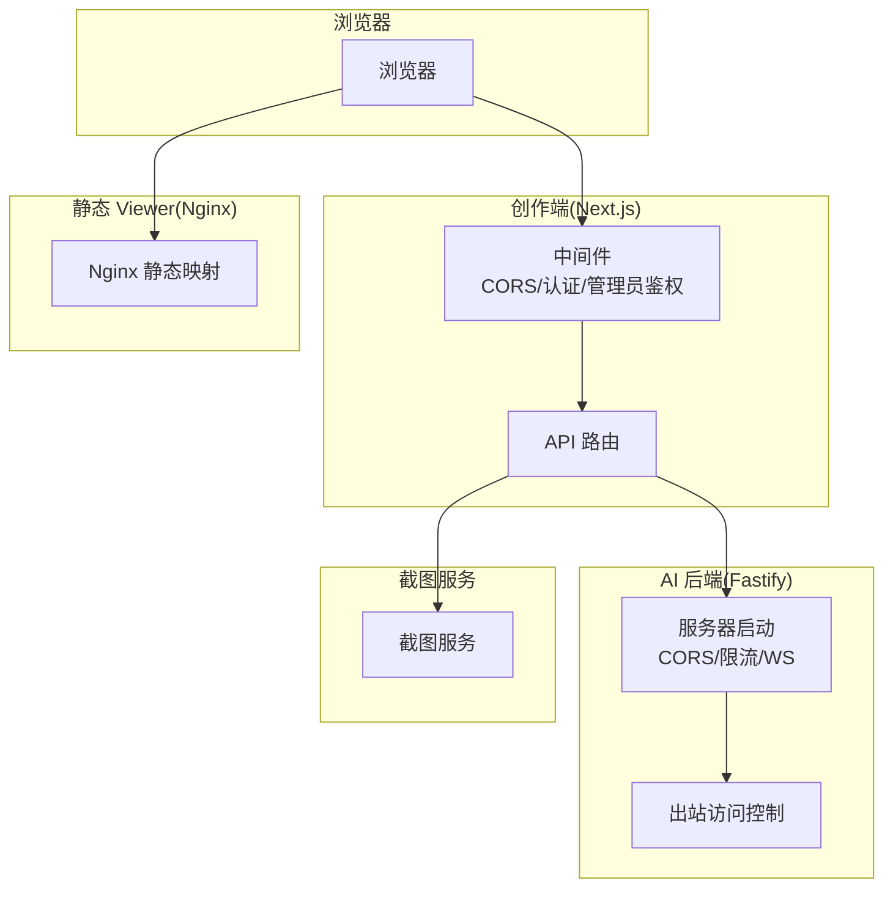
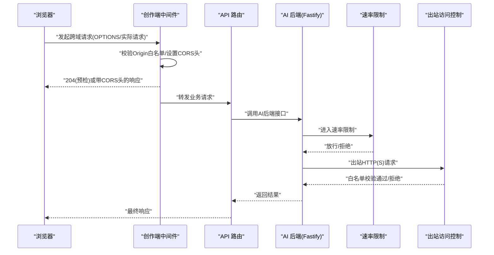
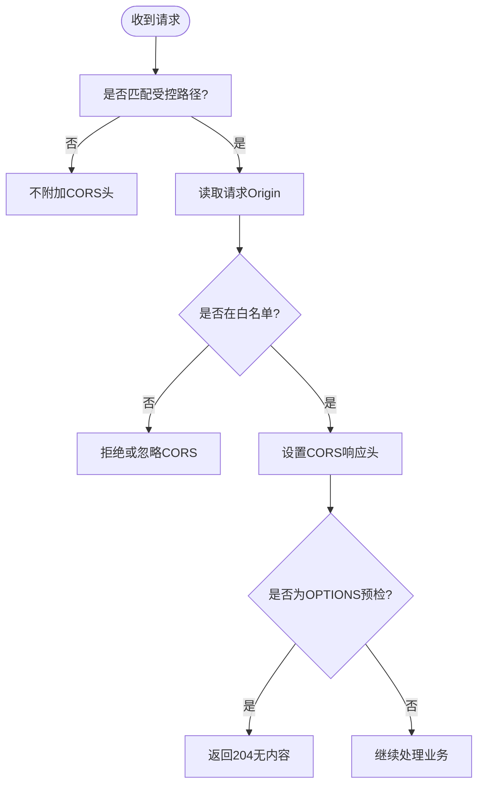
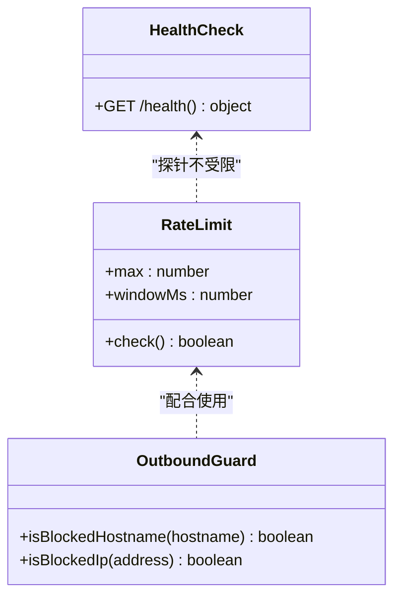
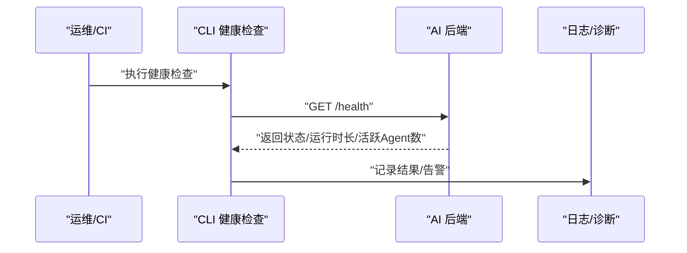
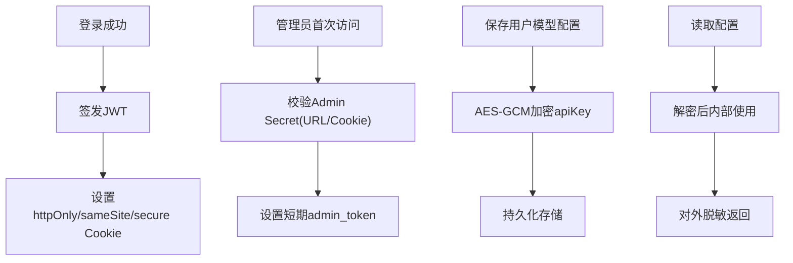
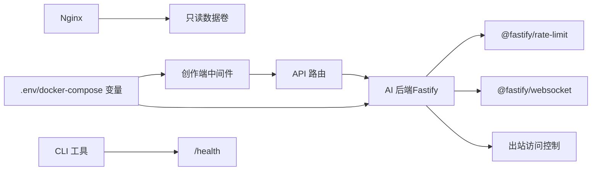

# 网络安全措施

<cite>
**本文引用的文件**   
- [packages/author-site/src/middleware.ts](file://packages/author-site/src/middleware.ts)
- [packages/agent-service/src/server.ts](file://packages/agent-service/src/server.ts)
- [packages/agent-service/src/utils/config.ts](file://packages/agent-service/src/utils/config.ts)
- [packages/agent-service/src/backends/pi-tools/web-read-tool.ts](file://packages/agent-service/src/backends/pi-tools/web-read-tool.ts)
- [docker/viewer-site/nginx.conf](file://docker/viewer-site/nginx.conf)
- [docker-compose.yml](file://docker-compose.yml)
- [packages/author-site/src/lib/auth/jwt.ts](file://packages/author-site/src/lib/auth/jwt.ts)
- [packages/author-site/src/lib/admin-auth.ts](file://packages/author-site/src/lib/admin-auth.ts)
- [packages/author-site/src/app/data/[...path]/route.ts](file://packages/author-site/src/app/data/[...path]/route.ts)
- [packages/author-site/src/app/api/images/[...path]/route.ts](file://packages/author-site/src/app/api/images/[...path]/route.ts)
- [packages/author-site/src/lib/user-model-config.ts](file://packages/author-site/src/lib/user-model-config.ts)
- [packages/author-site/src/lib/external-auth.ts](file://packages/author-site/src/lib/external-auth.ts)
- [packages/shared/src/diagnostics.ts](file://packages/shared/src/diagnostics.ts)
- [OPS/CLI/src/commands/logs.ts](file://OPS/CLI/src/commands/logs.ts)
- [OPS/CLI/src/commands/health.ts](file://OPS/CLI/src/commands/health.ts)
- [docs/项目文档/使用端/03-部署与嵌入/技术/01_部署与CORS配置.md](file://docs/项目文档/使用端/03-部署与嵌入/技术/01_部署与CORS配置.md)
- [docs/项目文档/创作端/08-管理后台/技术/01_架构设计.md](file://docs/项目文档/创作端/08-管理后台/技术/01_架构设计.md)
</cite>

## 目录
1. [简介](#简介)
2. [项目结构](#项目结构)
3. [核心组件](#核心组件)
4. [架构总览](#架构总览)
5. [详细组件分析](#详细组件分析)
6. [依赖关系分析](#依赖关系分析)
7. [性能与安全权衡](#性能与安全权衡)
8. [故障排查指南](#故障排查指南)
9. [结论](#结论)
10. [附录：最佳实践清单](#附录最佳实践清单)

## 简介
本文件面向 Workbench 平台的运维与研发人员，系统化梳理并补充平台在网络安全方面的现状与改进建议。内容覆盖跨域控制（CORS）、HTTPS/TLS、输入校验与过滤、网络访问限制、代理与反向代理、监控告警以及安全头与缓存策略等关键维度，并提供可落地的配置项与流程图示，帮助在生产环境构建纵深防御体系。

## 项目结构
Workbench 由多个服务组成，涉及浏览器端、创作端、AI 后端、截图服务与静态展示端。安全相关的关键位置包括：
- 创作端中间件：统一处理 CORS、认证与管理员鉴权
- AI 后端服务：CORS、速率限制、健康检查、出站请求白名单
- 静态 viewer 站点：Nginx 暴露数据目录与静态资源
- 容器编排：环境变量注入、端口映射、健康检查
- 敏感数据加密与脱敏：用户模型配置、外部授权凭证、诊断日志

**图示来源**
- [packages/author-site/src/middleware.ts:1-152](file://packages/author-site/src/middleware.ts#L1-L152)
- [packages/agent-service/src/server.ts:1-117](file://packages/agent-service/src/server.ts#L1-L117)
- [packages/agent-service/src/backends/pi-tools/web-read-tool.ts:282-327](file://packages/agent-service/src/backends/pi-tools/web-read-tool.ts#L282-L327)
- [docker/viewer-site/nginx.conf:1-44](file://docker/viewer-site/nginx.conf#L1-L44)

**章节来源**
- [docker-compose.yml:1-140](file://docker-compose.yml#L1-L140)
- [docs/项目文档/使用端/03-部署与嵌入/技术/01_部署与CORS配置.md:25-45](file://docs/项目文档/使用端/03-部署与嵌入/技术/01_部署与CORS配置.md#L25-L45)

## 核心组件
- 跨域控制（CORS）
  - 创作端中间件对 /api、/viewer、/embed、/data 等路径按来源白名单设置响应头，并对 OPTIONS 预检快速返回 204；公共预览模块允许更宽松的跨域。
  - AI 后端通过 Fastify cors 插件按环境变量配置允许的 Origin、方法、头部与凭据传递。
- 认证与会话
  - JWT 令牌签发与校验，Cookie 标记 httpOnly/sameSite，生产环境默认 secure（可通过环境变量关闭）。
  - 管理后台独立 Admin Secret 验证，支持 URL 参数与 Cookie 两种模式，并在首次通过后设置短期 Cookie。
- 速率限制与健康检查
  - AI 后端启用基于时间窗口的全局速率限制，提供 /health 健康接口供编排系统探测。
- 出站访问控制
  - AI 后端内置对本地回环、私有网段与特殊地址的阻断逻辑，防止 SSRF 风险。
- 静态数据与缓存
  - Nginx 将发布数据只读挂载并按类型设置 Cache-Control，部分 JSON 强制 no-store，JS 资源长期不可变缓存。

**章节来源**
- [packages/author-site/src/middleware.ts:1-152](file://packages/author-site/src/middleware.ts#L1-L152)
- [packages/agent-service/src/server.ts:46-66](file://packages/agent-service/src/server.ts#L46-L66)
- [packages/agent-service/src/utils/config.ts:1-47](file://packages/agent-service/src/utils/config.ts#L1-L47)
- [packages/author-site/src/lib/auth/jwt.ts:1-70](file://packages/author-site/src/lib/auth/jwt.ts#L1-L70)
- [packages/author-site/src/lib/admin-auth.ts:1-134](file://packages/author-site/src/lib/admin-auth.ts#L1-L134)
- [docker/viewer-site/nginx.conf:1-44](file://docker/viewer-site/nginx.conf#L1-L44)

## 架构总览
下图展示了从浏览器到各服务的典型请求路径与安全控制点。

**图示来源**
- [packages/author-site/src/middleware.ts:45-73](file://packages/author-site/src/middleware.ts#L45-L73)
- [packages/agent-service/src/server.ts:46-66](file://packages/agent-service/src/server.ts#L46-L66)
- [packages/agent-service/src/backends/pi-tools/web-read-tool.ts:282-327](file://packages/agent-service/src/backends/pi-tools/web-read-tool.ts#L282-L327)

## 详细组件分析

### 跨域控制（CORS）策略
- 创作端
  - 仅对特定前缀路径应用 CORS，避免影响静态资源。
  - 对允许的来源返回 Access-Control-Allow-Origin、Methods、Headers 与 Credentials。
  - 对 OPTIONS 预检直接返回 204，减少后端负载。
  - 公共预览模块路由采用更宽松的跨域策略以支持第三方嵌入。
- AI 后端
  - 通过环境变量 CORS_ORIGINS 配置允许来源列表，支持多来源逗号分隔。
  - 显式声明允许的方法与头部，开启凭据传递。
- 静态 viewer
  - Nginx 为 /data 下不同资源设置不同的 Cache-Control，并为跨域场景添加 Allow-Origin。

**图示来源**
- [packages/author-site/src/middleware.ts:45-73](file://packages/author-site/src/middleware.ts#L45-L73)
- [packages/agent-service/src/server.ts:46-66](file://packages/agent-service/src/server.ts#L46-L66)
- [docker/viewer-site/nginx.conf:12-38](file://docker/viewer-site/nginx.conf#L12-L38)

**章节来源**
- [packages/author-site/src/middleware.ts:1-152](file://packages/author-site/src/middleware.ts#L1-L152)
- [packages/agent-service/src/server.ts:46-66](file://packages/agent-service/src/server.ts#L46-L66)
- [docs/项目文档/使用端/03-部署与嵌入/技术/01_部署与CORS配置.md:70-101](file://docs/项目文档/使用端/03-部署与嵌入/技术/01_部署与CORS配置.md#L70-L101)

### HTTPS 与 TLS 支持
- 现状
  - 当前容器编排未暴露 443 端口，服务默认监听 HTTP。
  - 创作端 Cookie 的 secure 标志在生产环境默认启用，但可通过环境变量关闭以适应内网 HTTP 部署。
- 建议
  - 在边缘层（云负载均衡/网关/Nginx）终止 TLS，仅对内网服务使用 HTTP。
  - 强制 HSTS、严格的安全头与最小化 TLS 版本（TLS1.2+），并启用现代密码套件。
  - 证书轮换与自动续期（如 ACME/Let’s Encrypt）。

[本节为通用指导，无需代码引用]

### 输入验证与过滤
- 服务端校验
  - AI 后端提供代码/Schema 校验接口，用于演示与调试场景，具备基础参数缺失校验与错误封装。
- 路径与资源访问
  - 图片与数据路由对目标路径进行存在性与类型校验，图片路由包含目录穿越防护。
- 建议
  - 对所有外部输入执行严格的 Schema 校验（类型、长度、枚举、正则）。
  - SQL 注入防护：若引入数据库查询，务必使用参数化查询与 ORM 白名单字段。
  - XSS 防护：输出编码、CSP、禁用危险 HTML 特性。

**章节来源**
- [packages/agent-service/src/routes/validate.ts:109-199](file://packages/agent-service/src/routes/validate.ts#L109-L199)
- [packages/author-site/src/app/api/images/[...path]/route.ts](file://packages/author-site/src/app/api/images/[...path]/route.ts#L49-L74)
- [packages/author-site/src/app/data/[...path]/route.ts](file://packages/author-site/src/app/data/[...path]/route.ts#L54-L86)

### 网络请求安全措施
- 速率限制
  - AI 后端启用基于时间窗口的全局限流，阈值与窗口大小由环境变量控制。
- IP 白名单与出站控制
  - 出站访问对本地回环、私有网段与特殊地址进行阻断，降低 SSRF 风险。
- 恶意请求检测
  - 建议在边缘层集成 WAF/IPS，结合异常行为分析与封禁策略。

**图示来源**
- [packages/agent-service/src/server.ts:63-66](file://packages/agent-service/src/server.ts#L63-L66)
- [packages/agent-service/src/utils/config.ts:16-47](file://packages/agent-service/src/utils/config.ts#L16-L47)
- [packages/agent-service/src/backends/pi-tools/web-read-tool.ts:282-327](file://packages/agent-service/src/backends/pi-tools/web-read-tool.ts#L282-L327)
- [packages/agent-service/src/server.ts:89-99](file://packages/agent-service/src/server.ts#L89-L99)

**章节来源**
- [packages/agent-service/src/server.ts:63-66](file://packages/agent-service/src/server.ts#L63-L66)
- [packages/agent-service/src/utils/config.ts:16-47](file://packages/agent-service/src/utils/config.ts#L16-L47)
- [packages/agent-service/src/backends/pi-tools/web-read-tool.ts:282-327](file://packages/agent-service/src/backends/pi-tools/web-read-tool.ts#L282-L327)

### 代理与反向代理配置
- Nginx（Viewer 静态站点）
  - 将发布数据目录只读挂载，按资源类型设置缓存策略，并为跨域场景添加 Allow-Origin。
  - 针对 demo JS 单独设置长期不可变缓存，提升加载性能。
- 负载均衡与健康检查
  - 在边缘层实现多实例均衡与主动健康检查，失败节点剔除。
- 建议
  - 关闭不必要的 HTTP 方法，限制请求体大小，启用 Gzip/Brotli。
  - 对 /health 做轻量级检查，避免重负载。

**章节来源**
- [docker/viewer-site/nginx.conf:1-44](file://docker/viewer-site/nginx.conf#L1-L44)
- [docker-compose.yml:116-121](file://docker-compose.yml#L116-L121)

### 网络安全监控方案
- 健康检查
  - AI 后端提供 /health 接口，CLI 工具可轮询并输出状态。
- 日志采集
  - CLI 支持从本地文件或 API 诊断接口收集日志，便于定位问题。
- 流量分析与异常检测
  - 建议在边缘层与后端接入结构化日志与指标上报，结合 SIEM/SOAR 实现告警与自动化处置。

**图示来源**
- [packages/agent-service/src/server.ts:89-99](file://packages/agent-service/src/server.ts#L89-L99)
- [OPS/CLI/src/commands/health.ts:1-54](file://OPS/CLI/src/commands/health.ts#L1-L54)
- [OPS/CLI/src/commands/logs.ts:138-160](file://OPS/CLI/src/commands/logs.ts#L138-L160)

**章节来源**
- [OPS/CLI/src/commands/health.ts:1-54](file://OPS/CLI/src/commands/health.ts#L1-L54)
- [OPS/CLI/src/commands/logs.ts:1-263](file://OPS/CLI/src/commands/logs.ts#L1-L263)

### 认证、授权与敏感数据处理
- 用户认证
  - JWT 签发与校验，Cookie 标记 httpOnly/sameSite，生产环境默认 secure。
- 管理员鉴权
  - Admin Secret 支持 URL 参数与 Cookie 双重方式，首次通过后设置短期 Cookie。
- 敏感数据保护
  - 用户模型配置与外部授权凭证采用 AES-GCM 加密存储，对外返回脱敏信息。
  - 诊断日志对敏感键值进行脱敏与截断，避免泄露。

**图示来源**
- [packages/author-site/src/lib/auth/jwt.ts:1-70](file://packages/author-site/src/lib/auth/jwt.ts#L1-L70)
- [packages/author-site/src/lib/admin-auth.ts:1-134](file://packages/author-site/src/lib/admin-auth.ts#L1-L134)
- [packages/author-site/src/lib/user-model-config.ts:45-61](file://packages/author-site/src/lib/user-model-config.ts#L45-L61)
- [packages/author-site/src/lib/external-auth.ts:59-89](file://packages/author-site/src/lib/external-auth.ts#L59-L89)
- [packages/shared/src/diagnostics.ts:418-459](file://packages/shared/src/diagnostics.ts#L418-L459)

**章节来源**
- [packages/author-site/src/lib/auth/jwt.ts:1-70](file://packages/author-site/src/lib/auth/jwt.ts#L1-L70)
- [packages/author-site/src/lib/admin-auth.ts:1-134](file://packages/author-site/src/lib/admin-auth.ts#L1-L134)
- [docs/项目文档/创作端/08-管理后台/技术/01_架构设计.md:297-328](file://docs/项目文档/创作端/08-管理后台/技术/01_架构设计.md#L297-L328)

## 依赖关系分析
- 创作端中间件依赖环境变量 CORS_ORIGINS、USE_SECURE_COOKIE、ADMIN_SECRET 等，控制跨域与鉴权行为。
- AI 后端依赖 CORS_ORIGINS、RATE_LIMIT_* 等环境变量，注册速率限制与 WebSocket。
- Nginx 通过只读卷挂载发布数据，按路径规则设置缓存与跨域头。
- CLI 工具依赖 /health 接口进行健康检查与日志采集。

**图示来源**
- [docker-compose.yml:1-140](file://docker-compose.yml#L1-L140)
- [packages/author-site/src/middleware.ts:1-152](file://packages/author-site/src/middleware.ts#L1-L152)
- [packages/agent-service/src/server.ts:1-117](file://packages/agent-service/src/server.ts#L1-L117)
- [docker/viewer-site/nginx.conf:1-44](file://docker/viewer-site/nginx.conf#L1-L44)
- [OPS/CLI/src/commands/health.ts:1-54](file://OPS/CLI/src/commands/health.ts#L1-L54)

**章节来源**
- [docker-compose.yml:1-140](file://docker-compose.yml#L1-L140)
- [packages/author-site/src/middleware.ts:1-152](file://packages/author-site/src/middleware.ts#L1-L152)
- [packages/agent-service/src/server.ts:1-117](file://packages/agent-service/src/server.ts#L1-L117)
- [docker/viewer-site/nginx.conf:1-44](file://docker/viewer-site/nginx.conf#L1-L44)

## 性能与安全权衡
- CORS 白名单越精确越好，避免使用通配符；预检请求应尽快返回以减少开销。
- 速率限制需根据业务峰值调优，避免误伤正常用户。
- 静态资源缓存策略应在“更新及时性”和“缓存命中”之间平衡，敏感数据禁用缓存。
- 加密与解密带来 CPU 开销，建议仅在必要时对敏感字段进行加解密。

[本节为通用指导，无需代码引用]

## 故障排查指南
- 跨域失败
  - 检查 CORS_ORIGINS 是否包含实际访问域名；确认中间件与后端均设置了正确的 Allow-Origin。
- 健康检查失败
  - 使用 CLI 查看 /health 返回码与详情，确认进程存活与依赖可用。
- 日志缺失
  - 优先查看 stdout 或通过 API 诊断接口获取会话上下文。
- 管理员无法登录
  - 确认 ADMIN_SECRET 一致，URL 参数或 Cookie 是否正确传递。

**章节来源**
- [packages/author-site/src/middleware.ts:45-73](file://packages/author-site/src/middleware.ts#L45-L73)
- [packages/agent-service/src/server.ts:89-99](file://packages/agent-service/src/server.ts#L89-L99)
- [OPS/CLI/src/commands/health.ts:1-54](file://OPS/CLI/src/commands/health.ts#L1-L54)
- [OPS/CLI/src/commands/logs.ts:1-263](file://OPS/CLI/src/commands/logs.ts#L1-L263)
- [packages/author-site/src/lib/admin-auth.ts:1-134](file://packages/author-site/src/lib/admin-auth.ts#L1-L134)

## 结论
Workbench 已在跨域控制、认证鉴权、速率限制、出站访问控制与静态缓存等方面具备基础能力。建议在生产环境中完善 HTTPS/TLS 终止、安全头与 CSP、WAF/IPS 与集中化监控告警，形成端到端的纵深防御体系。

[本节为总结性内容，无需代码引用]

## 附录：最佳实践清单
- 安全头
  - 强制 HTTPS、HSTS、X-Content-Type-Options、X-Frame-Options、Referrer-Policy、Permissions-Policy 等。
- 缓存控制
  - 敏感 JSON 使用 no-store；静态资源使用 immutable 与长缓存；动态页面按需缓存。
- 内容安全策略（CSP）
  - 明确允许的资源来源，禁用 inline script 与 eval，严格限定脚本与样式来源。
- 密钥与证书
  - 使用强随机密钥，定期轮换；证书自动续期与最小权限原则。
- 审计与合规
  - 保留必要审计日志，脱敏敏感信息，满足合规要求。

[本节为通用指导，无需代码引用]