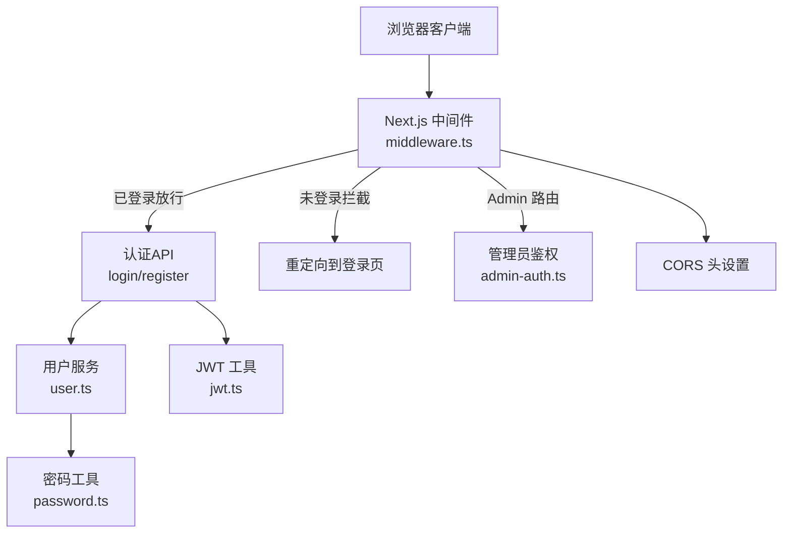
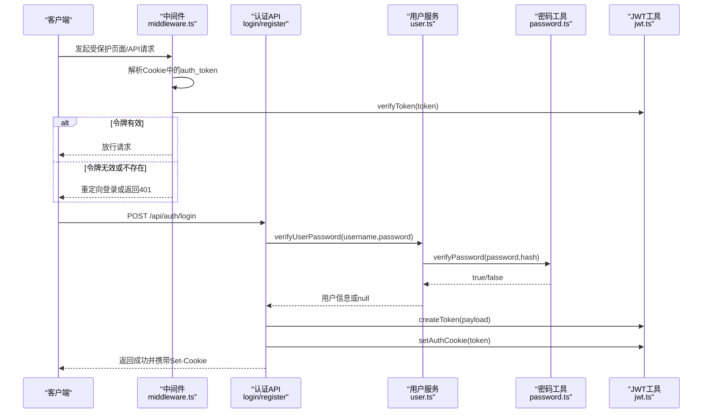
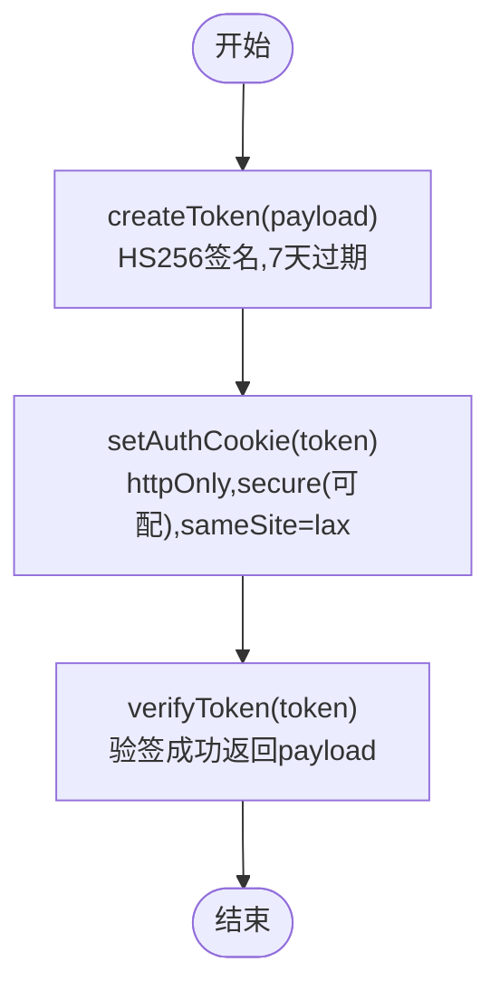
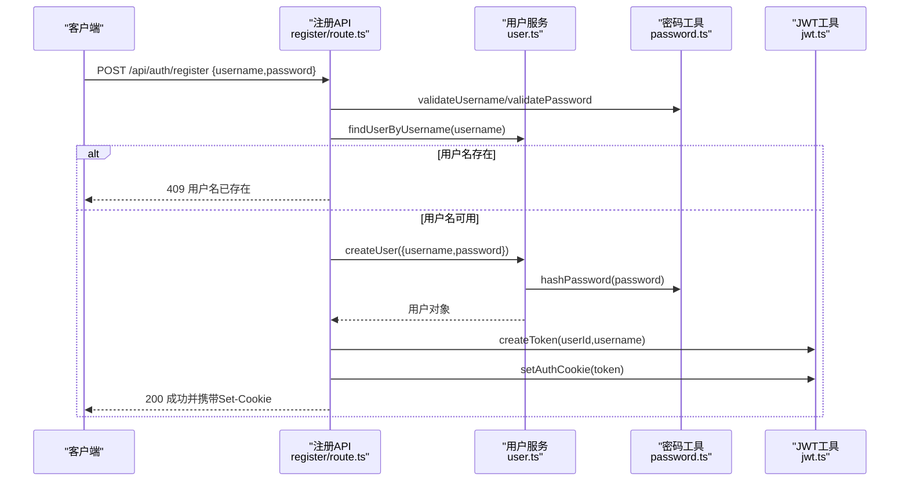
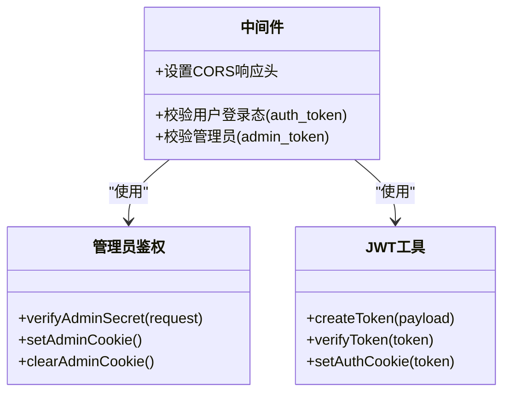
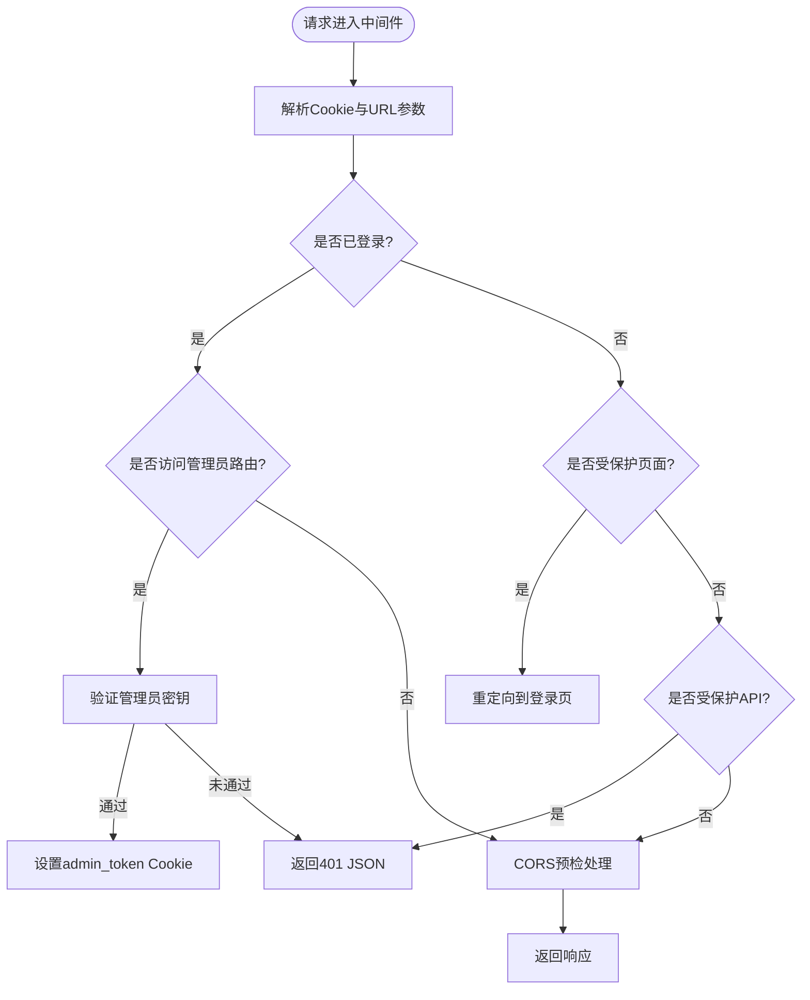
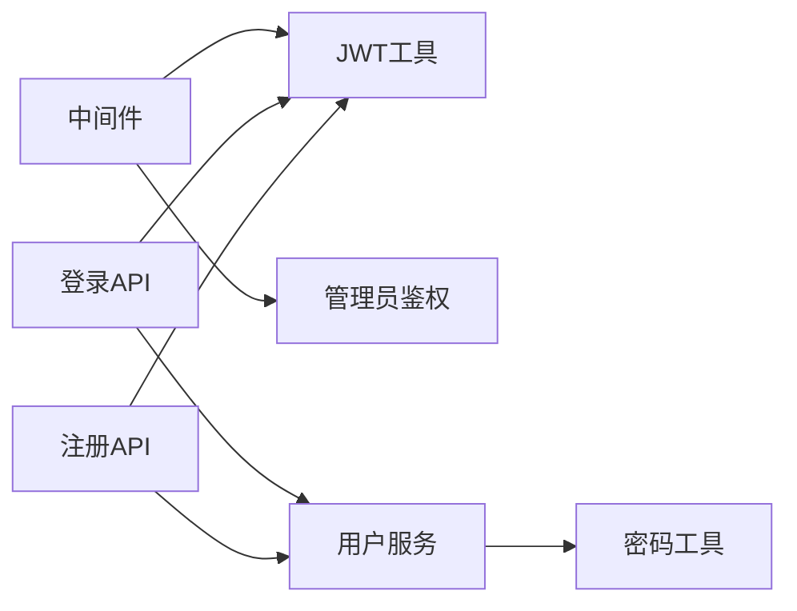

# 认证授权机制

<cite>
**本文引用的文件列表**
- [packages/author-site/src/middleware.ts](file://packages/author-site/src/middleware.ts)
- [packages/author-site/src/lib/auth/jwt.ts](file://packages/author-site/src/lib/auth/jwt.ts)
- [packages/author-site/src/app/api/auth/login/route.ts](file://packages/author-site/src/app/api/auth/login/route.ts)
- [packages/author-site/src/app/api/auth/register/route.ts](file://packages/author-site/src/app/api/auth/register/route.ts)
- [packages/author-site/src/lib/user.ts](file://packages/author-site/src/lib/user.ts)
- [packages/author-site/src/lib/auth/password.ts](file://packages/author-site/src/lib/auth/password.ts)
- [packages/author-site/src/lib/admin-auth.ts](file://packages/author-site/src/lib/admin-auth.ts)
- [docs/项目文档/使用端/03-部署与嵌入/技术/01_部署与CORS配置.md](file://docs/项目文档/使用端/03-部署与嵌入/技术/01_部署与CORS配置.md)
</cite>

## 目录
1. [简介](#简介)
2. [项目结构](#项目结构)
3. [核心组件](#核心组件)
4. [架构总览](#架构总览)
5. [详细组件分析](#详细组件分析)
6. [依赖关系分析](#依赖关系分析)
7. [性能与安全考量](#性能与安全考量)
8. [故障排查指南](#故障排查指南)
9. [结论](#结论)
10. [附录](#附录)

## 简介
本文件面向 Workbench 平台的认证与授权机制，聚焦以下目标：
- JWT 令牌管理：生成、验证、刷新与过期处理策略
- 用户身份验证：登录注册流程、密码加密存储与会话管理
- 角色权限控制：管理员与普通用户的访问控制及 API 鉴权
- 中间件鉴权：路由守卫、权限校验与请求拦截
- 管理后台安全：管理员密钥验证、Cookie 管理与安全策略
- 最佳实践：令牌安全存储、跨域认证与会话并发控制
- 常见问题防护：令牌劫持、CSRF 与暴力破解防护方案

## 项目结构
认证授权相关代码集中在 author-site 包中，采用 Next.js App Router 的 API Routes 与全局中间件实现。关键位置如下：
- 中间件：统一鉴权入口（JWT 校验、管理员密钥校验、CORS）
- API 路由：登录、注册等认证接口
- 工具库：JWT 封装、密码哈希、管理员密钥校验
- 数据层：用户模型与数据库操作

图表来源
- [packages/author-site/src/middleware.ts:1-153](file://packages/author-site/src/middleware.ts#L1-L153)
- [packages/author-site/src/app/api/auth/login/route.ts:1-48](file://packages/author-site/src/app/api/auth/login/route.ts#L1-L48)
- [packages/author-site/src/app/api/auth/register/route.ts:1-56](file://packages/author-site/src/app/api/auth/register/route.ts#L1-L56)
- [packages/author-site/src/lib/auth/jwt.ts:1-71](file://packages/author-site/src/lib/auth/jwt.ts#L1-L71)
- [packages/author-site/src/lib/user.ts:1-339](file://packages/author-site/src/lib/user.ts#L1-L339)
- [packages/author-site/src/lib/auth/password.ts:1-35](file://packages/author-site/src/lib/auth/password.ts#L1-L35)
- [packages/author-site/src/lib/admin-auth.ts:1-135](file://packages/author-site/src/lib/admin-auth.ts#L1-L135)

章节来源
- [packages/author-site/src/middleware.ts:1-153](file://packages/author-site/src/middleware.ts#L1-L153)

## 核心组件
- JWT 工具模块：负责令牌的创建、验证与 Cookie 读写
- 用户服务模块：负责用户创建、查找、密码校验与基础用户信息
- 密码工具模块：基于 bcrypt 的密码哈希与校验，以及用户名/密码规则校验
- 管理员鉴权模块：提供管理员密钥验证、Cookie 设置与辅助方法
- 中间件：统一处理登录态、管理员访问、CORS 预检与响应头注入

章节来源
- [packages/author-site/src/lib/auth/jwt.ts:1-71](file://packages/author-site/src/lib/auth/jwt.ts#L1-L71)
- [packages/author-site/src/lib/user.ts:1-339](file://packages/author-site/src/lib/user.ts#L1-L339)
- [packages/author-site/src/lib/auth/password.ts:1-35](file://packages/author-site/src/lib/auth/password.ts#L1-L35)
- [packages/author-site/src/lib/admin-auth.ts:1-135](file://packages/author-site/src/lib/admin-auth.ts#L1-L135)
- [packages/author-site/src/middleware.ts:1-153](file://packages/author-site/src/middleware.ts#L1-L153)

## 架构总览
整体认证授权流程由中间件作为统一入口，结合 API 路由完成登录注册与令牌发放；管理员访问通过独立密钥机制进行保护；CORS 在中间件中集中处理，确保跨域安全。

图表来源
- [packages/author-site/src/middleware.ts:45-98](file://packages/author-site/src/middleware.ts#L45-L98)
- [packages/author-site/src/app/api/auth/login/route.ts:6-47](file://packages/author-site/src/app/api/auth/login/route.ts#L6-L47)
- [packages/author-site/src/lib/user.ts:264-281](file://packages/author-site/src/lib/user.ts#L264-L281)
- [packages/author-site/src/lib/auth/password.ts:9-14](file://packages/author-site/src/lib/auth/password.ts#L9-L14)
- [packages/author-site/src/lib/auth/jwt.ts:16-34](file://packages/author-site/src/lib/auth/jwt.ts#L16-L34)

## 详细组件分析

### JWT 令牌管理
- 令牌生成：使用 HS256 算法签发，包含 userId 与 username，默认有效期为 7 天
- 令牌验证：服务端验签成功后返回载荷，失败返回 null
- 令牌存储：以 httpOnly Cookie 形式下发，生产环境默认启用 secure 标志，可通过环境变量调整
- 刷新与过期：当前实现未提供显式刷新接口；令牌过期后需重新登录。建议在前端检测 401 时引导用户重新登录或调用刷新接口（若后续扩展）

图表来源
- [packages/author-site/src/lib/auth/jwt.ts:16-56](file://packages/author-site/src/lib/auth/jwt.ts#L16-L56)

章节来源
- [packages/author-site/src/lib/auth/jwt.ts:1-71](file://packages/author-site/src/lib/auth/jwt.ts#L1-L71)

### 用户身份验证流程
- 登录：校验用户名与密码，成功后签发 JWT 并写入 Cookie
- 注册：校验用户名与密码规则，检查用户名唯一性，创建用户并签发 JWT
- 密码存储：使用 bcrypt 进行哈希存储，避免明文保存
- 会话管理：基于 Cookie 的无状态会话，服务端不维护会话状态

图表来源
- [packages/author-site/src/app/api/auth/register/route.ts:7-55](file://packages/author-site/src/app/api/auth/register/route.ts#L7-L55)
- [packages/author-site/src/lib/user.ts:32-46](file://packages/author-site/src/lib/user.ts#L32-L46)
- [packages/author-site/src/lib/auth/password.ts:5-14](file://packages/author-site/src/lib/auth/password.ts#L5-L14)
- [packages/author-site/src/lib/auth/jwt.ts:16-56](file://packages/author-site/src/lib/auth/jwt.ts#L16-L56)

章节来源
- [packages/author-site/src/app/api/auth/login/route.ts:1-48](file://packages/author-site/src/app/api/auth/login/route.ts#L1-L48)
- [packages/author-site/src/app/api/auth/register/route.ts:1-56](file://packages/author-site/src/app/api/auth/register/route.ts#L1-L56)
- [packages/author-site/src/lib/user.ts:1-339](file://packages/author-site/src/lib/user.ts#L1-L339)
- [packages/author-site/src/lib/auth/password.ts:1-35](file://packages/author-site/src/lib/auth/password.ts#L1-L35)

### 角色权限控制系统
- 普通用户：持有 auth_token 即可访问受保护的页面与 API
- 管理员：通过独立的 admin_token（基于 ADMIN_SECRET 的 SHA-256 哈希）访问 /admin 与 /api/admin/*
- API 访问控制：中间件对特定 API 路由进行登录态校验，未登录返回 401 JSON

图表来源
- [packages/author-site/src/middleware.ts:100-135](file://packages/author-site/src/middleware.ts#L100-L135)
- [packages/author-site/src/lib/admin-auth.ts:38-99](file://packages/author-site/src/lib/admin-auth.ts#L38-L99)
- [packages/author-site/src/lib/auth/jwt.ts:16-56](file://packages/author-site/src/lib/auth/jwt.ts#L16-L56)

章节来源
- [packages/author-site/src/middleware.ts:100-135](file://packages/author-site/src/middleware.ts#L100-L135)
- [packages/author-site/src/lib/admin-auth.ts:1-135](file://packages/author-site/src/lib/admin-auth.ts#L1-L135)

### 中间件鉴权实现
- 路由守卫：对 /demo、/cli 等页面路由进行登录态检查，未登录重定向至 /login
- API 鉴权：对 /api/sessions 等 API 路由进行登录态检查，未登录返回 401 JSON
- 管理员鉴权：对 /admin 与 /api/admin/* 进行管理员密钥校验，支持 URL 参数与 Cookie 两种方式
- CORS 处理：针对 /api/、/viewer/、/embed/、/data/ 等路径，根据允许的来源列表设置响应头，并对 OPTIONS 预检请求直接返回 204

图表来源
- [packages/author-site/src/middleware.ts:45-148](file://packages/author-site/src/middleware.ts#L45-L148)
- [packages/author-site/src/lib/admin-auth.ts:38-99](file://packages/author-site/src/lib/admin-auth.ts#L38-L99)

章节来源
- [packages/author-site/src/middleware.ts:1-153](file://packages/author-site/src/middleware.ts#L1-L153)

### 管理后台安全机制
- 管理员密钥验证：支持 URL 参数 secret 与 admin_token Cookie 两种验证方式
- Cookie 管理：验证通过后设置 httpOnly、sameSite=lax、maxAge=2h 的 admin_token
- 安全策略：生产环境默认启用 secure 标志，可通过环境变量调整；建议使用 HTTPS 部署

章节来源
- [packages/author-site/src/lib/admin-auth.ts:1-135](file://packages/author-site/src/lib/admin-auth.ts#L1-L135)
- [packages/author-site/src/middleware.ts:118-135](file://packages/author-site/src/middleware.ts#L118-L135)

## 依赖关系分析
- 中间件依赖 JWT 工具与管理员鉴权模块
- 认证 API 依赖用户服务与 JWT 工具
- 用户服务依赖密码工具进行哈希与校验
- CORS 配置来源于环境变量，并在中间件中应用

图表来源
- [packages/author-site/src/middleware.ts:1-153](file://packages/author-site/src/middleware.ts#L1-L153)
- [packages/author-site/src/app/api/auth/login/route.ts:1-48](file://packages/author-site/src/app/api/auth/login/route.ts#L1-L48)
- [packages/author-site/src/app/api/auth/register/route.ts:1-56](file://packages/author-site/src/app/api/auth/register/route.ts#L1-L56)
- [packages/author-site/src/lib/user.ts:1-339](file://packages/author-site/src/lib/user.ts#L1-L339)
- [packages/author-site/src/lib/auth/password.ts:1-35](file://packages/author-site/src/lib/auth/password.ts#L1-L35)
- [packages/author-site/src/lib/auth/jwt.ts:1-71](file://packages/author-site/src/lib/auth/jwt.ts#L1-L71)
- [packages/author-site/src/lib/admin-auth.ts:1-135](file://packages/author-site/src/lib/admin-auth.ts#L1-L135)

章节来源
- [packages/author-site/src/middleware.ts:1-153](file://packages/author-site/src/middleware.ts#L1-L153)

## 性能与安全考量
- 令牌安全存储：使用 httpOnly Cookie 防止前端脚本读取；生产环境启用 secure 标志仅通过 HTTPS 传输
- 跨域认证：CORS 白名单严格限制允许来源，OPTIONS 预检请求快速返回 204，减少服务器负载
- 会话并发控制：当前为无状态 JWT，服务端不维护会话状态；如需并发控制可在后续引入黑名单或短效令牌策略
- 密码强度：bcrypt 哈希与最小长度校验提升安全性
- 管理员密钥：SHA-256 哈希比较，避免明文泄露；建议定期轮换并限制传播范围

[本节为通用指导，无需具体文件引用]

## 故障排查指南
- 登录失败：检查用户名与密码是否正确，确认数据库中存在对应用户记录
- 注册失败：检查用户名是否符合规则且未被占用，确认密码满足最小长度要求
- 未登录访问受保护资源：确认 Cookie 中是否存在有效的 auth_token，检查中间件是否正确放行
- 管理员无法访问：确认 ADMIN_SECRET 环境变量正确，或通过 URL 参数 secret 访问一次以设置 admin_token
- CORS 错误：检查请求 Origin 是否在允许列表中，确认中间件已正确设置 Access-Control-Allow-Origin 与 Credentials

章节来源
- [packages/author-site/src/app/api/auth/login/route.ts:6-47](file://packages/author-site/src/app/api/auth/login/route.ts#L6-L47)
- [packages/author-site/src/app/api/auth/register/route.ts:7-55](file://packages/author-site/src/app/api/auth/register/route.ts#L7-L55)
- [packages/author-site/src/middleware.ts:45-98](file://packages/author-site/src/middleware.ts#L45-L98)
- [docs/项目文档/使用端/03-部署与嵌入/技术/01_部署与CORS配置.md:70-101](file://docs/项目文档/使用端/03-部署与嵌入/技术/01_部署与CORS配置.md#L70-L101)

## 结论
Workbench 平台采用基于 JWT 的无状态认证与基于管理员密钥的管理员访问控制，配合中间件实现统一的路由守卫与 CORS 处理。该设计简洁高效，适合前后端分离场景。后续可扩展令牌刷新机制、细粒度权限控制与会话并发控制以提升安全性与可用性。

[本节为总结性内容，无需具体文件引用]

## 附录
- 环境变量说明
  - JWT_SECRET：JWT 签名密钥，生产环境务必替换为强随机值
  - ADMIN_SECRET：管理员密钥，用于生成 admin_token 的哈希基准
  - USE_SECURE_COOKIE：控制是否启用 secure Cookie 标志（生产默认启用）
  - CORS_ORIGINS：逗号分隔的允许来源列表，影响 /api/、/viewer/ 等路径的跨域响应头

章节来源
- [packages/author-site/src/lib/auth/jwt.ts:4-6](file://packages/author-site/src/lib/auth/jwt.ts#L4-L6)
- [packages/author-site/src/lib/admin-auth.ts:19-21](file://packages/author-site/src/lib/admin-auth.ts#L19-L21)
- [packages/author-site/src/middleware.ts:18-24](file://packages/author-site/src/middleware.ts#L18-L24)
- [docs/项目文档/使用端/03-部署与嵌入/技术/01_部署与CORS配置.md:70-101](file://docs/项目文档/使用端/03-部署与嵌入/技术/01_部署与CORS配置.md#L70-L101)