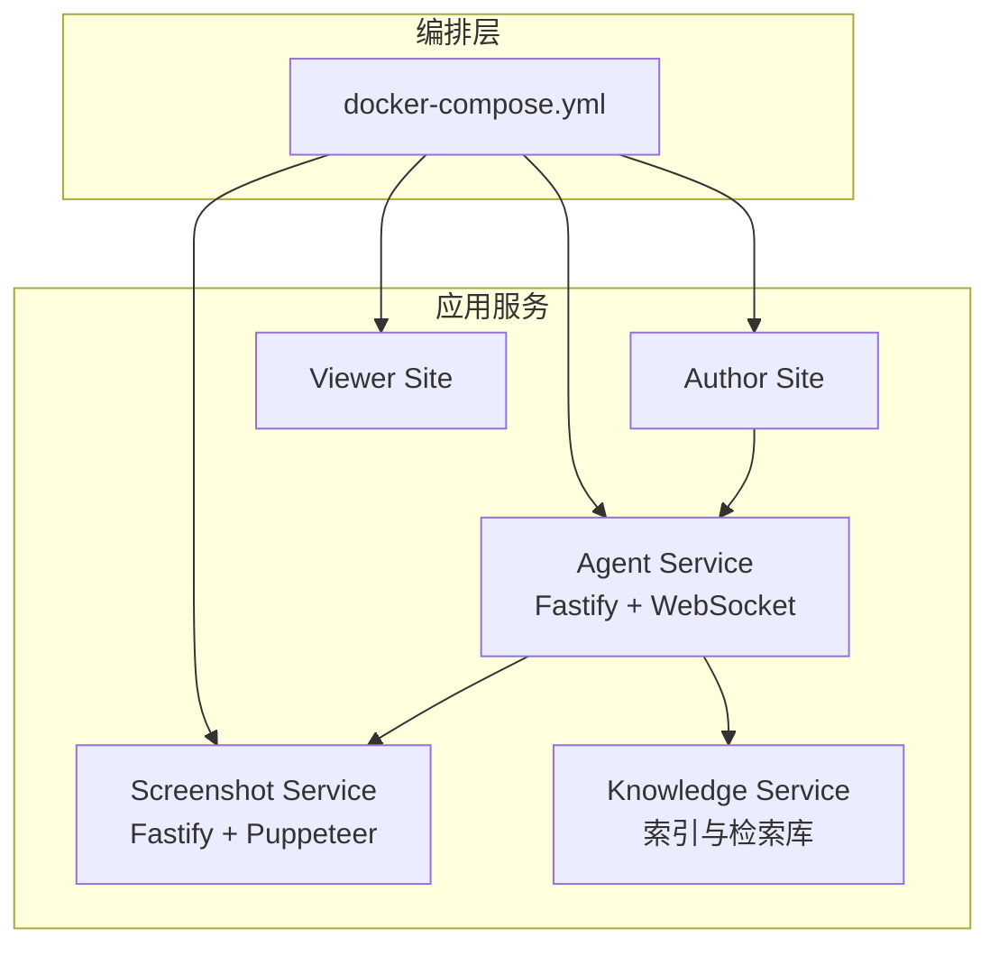
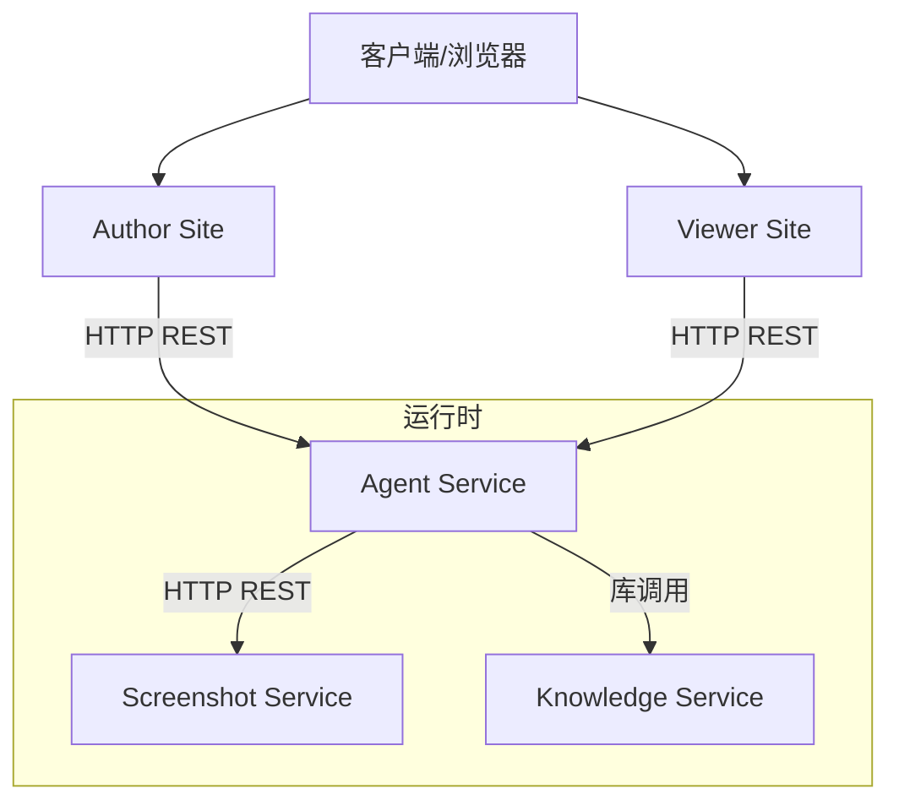
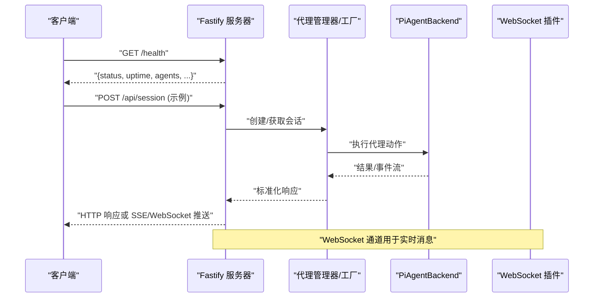
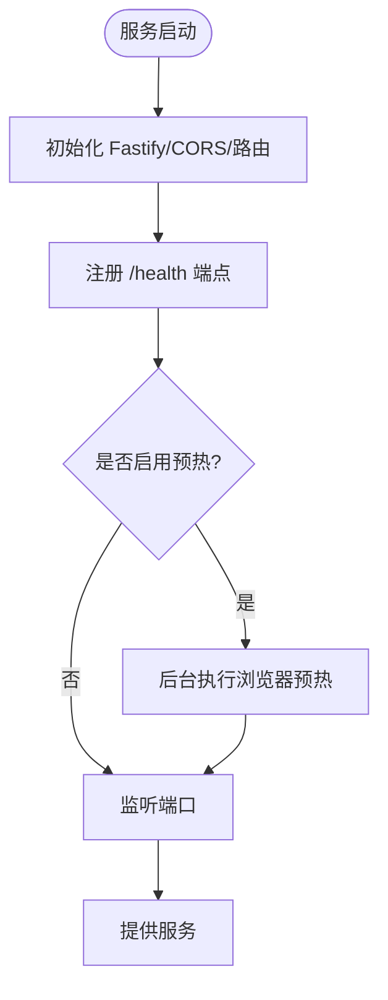
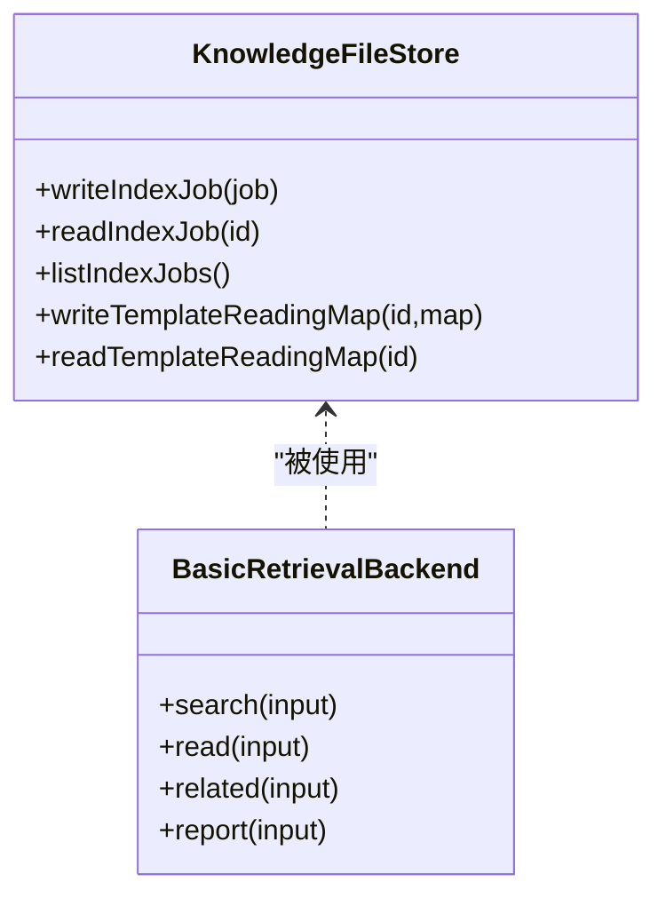
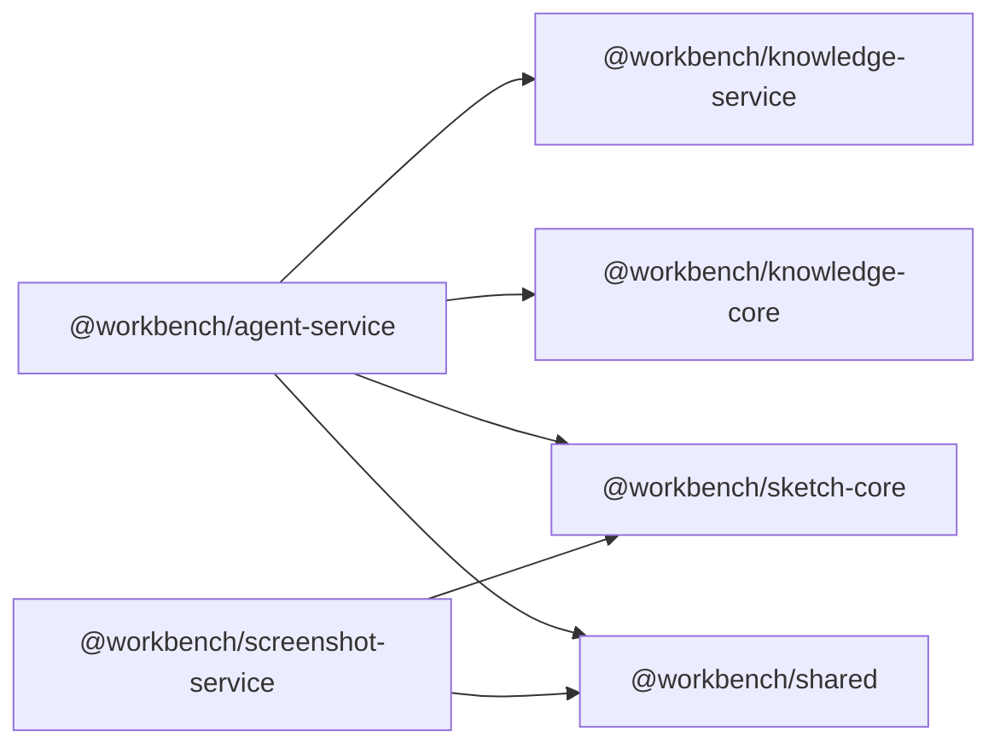

# 微服务设计

<cite>
**本文引用的文件**
- [docker-compose.yml](file://docker-compose.yml)
- [packages/agent-service/package.json](file://packages/agent-service/package.json)
- [packages/screenshot-service/package.json](file://packages/screenshot-service/package.json)
- [packages/knowledge-service/package.json](file://packages/knowledge-service/package.json)
- [packages/agent-service/src/server.ts](file://packages/agent-service/src/server.ts)
- [packages/screenshot-service/src/server.ts](file://packages/screenshot-service/src/server.ts)
- [packages/knowledge-service/src/index.ts](file://packages/knowledge-service/src/index.ts)
</cite>

## 目录
1. [引言](#引言)
2. [项目结构](#项目结构)
3. [核心组件](#核心组件)
4. [架构总览](#架构总览)
5. [详细组件分析](#详细组件分析)
6. [依赖分析](#依赖分析)
7. [性能考虑](#性能考虑)
8. [故障排查指南](#故障排查指南)
9. [结论](#结论)
10. [附录](#附录)

## 引言
本设计文档面向 Workbench 平台的微服务化演进，重点围绕以下目标展开：
- Agent Service 的 Fastify 服务器架构、AI 代理管理器与会话管理机制
- 服务间通信协议：HTTP REST API 规范、WebSocket 实时通信与错误处理机制
- 服务发现与负载均衡策略（Docker Compose 编排与健康检查）
- 配置管理方案：环境变量、配置文件组织与动态更新
- 日志收集与监控：结构化日志、日志聚合与性能指标
- 扩展机制：插件架构、中间件设计与第三方集成模式
- 容错与弹性：熔断降级与重试策略

## 项目结构
仓库采用多包（monorepo）组织方式，关键微服务位于 packages 目录下，并通过 docker-compose.yml 进行本地编排。

图表来源
- [docker-compose.yml:1-140](file://docker-compose.yml#L1-L140)

章节来源
- [docker-compose.yml:1-140](file://docker-compose.yml#L1-L140)

## 核心组件
- Agent Service
  - 基于 Fastify 提供 HTTP 与 WebSocket 能力
  - 内置速率限制、CORS、健康检查端点
  - 注册后端代理工厂，支持动态加载 PiAgentBackend
  - 启动时恢复工作区权限状态，暴露 /health 返回运行态信息
- Screenshot Service
  - 基于 Fastify 提供截图生成接口
  - 浏览器池管理与深度健康检查
  - 编译缓存与指标采集，支持预热
- Knowledge Service
  - 提供知识索引、检索、相关项与报告构建等能力
  - 基于文件系统存储模板阅读地图与索引任务

章节来源
- [packages/agent-service/src/server.ts:1-117](file://packages/agent-service/src/server.ts#L1-L117)
- [packages/screenshot-service/src/server.ts:1-110](file://packages/screenshot-service/src/server.ts#L1-L110)
- [packages/knowledge-service/src/index.ts:1-543](file://packages/knowledge-service/src/index.ts#L1-L543)

## 架构总览
Workbench 平台由多个独立部署的微服务组成，通过 Docker Compose 在本地或开发环境编排。Author Site 与 Viewer Site 作为前端站点，分别调用 Agent Service 与 Screenshot Service；Agent Service 可调用 Screenshot Service 与 Knowledge Service。

图表来源
- [docker-compose.yml:1-140](file://docker-compose.yml#L1-L140)
- [packages/agent-service/src/server.ts:1-117](file://packages/agent-service/src/server.ts#L1-L117)
- [packages/screenshot-service/src/server.ts:1-110](file://packages/screenshot-service/src/server.ts#L1-L110)
- [packages/knowledge-service/src/index.ts:1-543](file://packages/knowledge-service/src/index.ts#L1-L543)

## 详细组件分析

### Agent Service 架构
- 服务器初始化
  - 使用 Fastify 并启用 pino 结构化日志与 pretty 输出
  - 注册 CORS、WebSocket、Rate Limit 插件
  - 读取配置与环境变量，设置监听端口与主机
- 后端代理工厂
  - 通过工厂注册 pi-agent 后端，封装为 BackendAgent
  - 若 ESM 依赖不可用则记录警告并继续启动
- 会话与工作区
  - 启动时恢复工作区权限状态，暴露健康检查端点
  - 进程信号处理中销毁所有代理实例并关闭会话存储与服务
- 实时通信
  - 已注册 @fastify/websocket，可用于流式响应与双向通信

图表来源
- [packages/agent-service/src/server.ts:1-117](file://packages/agent-service/src/server.ts#L1-L117)
- [packages/agent-service/package.json:1-53](file://packages/agent-service/package.json#L1-L53)

章节来源
- [packages/agent-service/src/server.ts:1-117](file://packages/agent-service/src/server.ts#L1-L117)
- [packages/agent-service/package.json:1-53](file://packages/agent-service/package.json#L1-L53)

### Screenshot Service 架构
- 服务器初始化
  - 使用 Fastify 与 CORS，注册路由
  - 暴露 /health 端点，包含浏览器池状态、队列、缓存与指标快照
- 浏览器池与预热
  - 启动后可选择预热浏览器，提升首屏性能
  - 支持深度健康检查以验证浏览器可用性
- 指标与缓存
  - 提供截图指标快照与编译缓存统计

图表来源
- [packages/screenshot-service/src/server.ts:1-110](file://packages/screenshot-service/src/server.ts#L1-L110)
- [packages/screenshot-service/package.json:1-39](file://packages/screenshot-service/package.json#L1-39)

章节来源
- [packages/screenshot-service/src/server.ts:1-110](file://packages/screenshot-service/src/server.ts#L1-L110)
- [packages/screenshot-service/package.json:1-39](file://packages/screenshot-service/package.json#L1-39)

### Knowledge Service 能力
- 索引与检索
  - 提供 BasicRetrievalBackend 实现搜索、读取、相关项与报告构建
  - 基于文件系统存储索引任务与模板阅读地图
- 模板索引流程
  - 创建索引任务 -> 扫描工作区 -> 生成阅读地图 -> 持久化 -> 标记就绪
- 增强摘要
  - 支持外部组织者对条目进行摘要增强并回写

图表来源
- [packages/knowledge-service/src/index.ts:1-543](file://packages/knowledge-service/src/index.ts#L1-L543)

章节来源
- [packages/knowledge-service/src/index.ts:1-543](file://packages/knowledge-service/src/index.ts#L1-L543)

## 依赖分析
- Agent Service
  - 运行时依赖：fastify、@fastify/cors、@fastify/rate-limit、@fastify/websocket、pino、undici、ws、yjs/y-protocols/lib0
  - 内部依赖：knowledge-core、knowledge-service、preview-contract、sketch-core、shared
- Screenshot Service
  - 运行时依赖：fastify、@fastify/cors、puppeteer-core、pino
  - 内部依赖：sketch-core、shared
- Knowledge Service
  - 运行时依赖：knowledge-core、shared（库形式，无独立 HTTP 服务）

图表来源
- [packages/agent-service/package.json:1-53](file://packages/agent-service/package.json#L1-53)
- [packages/screenshot-service/package.json:1-39](file://packages/screenshot-service/package.json#L1-39)
- [packages/knowledge-service/package.json:1-25](file://packages/knowledge-service/package.json#L1-25)

章节来源
- [packages/agent-service/package.json:1-53](file://packages/agent-service/package.json#L1-53)
- [packages/screenshot-service/package.json:1-39](file://packages/screenshot-service/package.json#L1-39)
- [packages/knowledge-service/package.json:1-25](file://packages/knowledge-service/package.json#L1-25)

## 性能考虑
- 资源限制
  - 各服务在编排文件中设置了 CPU、内存与进程数上限，避免相互影响
- 浏览器池与预热
  - Screenshot Service 支持浏览器池与预热，减少冷启动延迟
- 缓存与指标
  - 截图服务提供编译缓存与指标快照，便于定位瓶颈
- 限流与并发
  - Agent Service 启用速率限制，保护后端与系统稳定性

[本节为通用指导，不直接分析具体文件]

## 故障排查指南
- 健康检查
  - Agent Service 与 Screenshot Service 均提供 /health 端点，返回运行时间、状态与关键指标
  - Screenshot Service 支持深度健康检查参数，验证浏览器可用性
- 优雅停机
  - 两个服务均监听 SIGTERM/SIGINT，关闭前清理资源并退出
- 常见问题
  - 浏览器不可用：检查 Screenshot Service 的浏览器池状态与深度检查结果
  - 跨域问题：确认 CORS_ORIGINS 配置包含请求来源
  - 端口冲突：核对 docker-compose.yml 中的端口映射

章节来源
- [packages/agent-service/src/server.ts:1-117](file://packages/agent-service/src/server.ts#L1-L117)
- [packages/screenshot-service/src/server.ts:1-110](file://packages/screenshot-service/src/server.ts#L1-L110)
- [docker-compose.yml:1-140](file://docker-compose.yml#L1-L140)

## 结论
Workbench 平台通过清晰的微服务边界与标准化的通信协议，实现了可扩展、可观测与高可用的架构。Agent Service 作为 AI 代理与协作的核心，结合 Screenshot Service 的渲染能力与 Knowledge Service 的知识检索，形成完整的工作流闭环。配合 Docker Compose 的资源限制与健康检查，可在本地与生产环境中稳定运行。

[本节为总结性内容，不直接分析具体文件]

## 附录

### 服务间通信协议规范
- HTTP REST API
  - 统一健康检查：/health
  - 建议遵循 JSON 请求/响应体，携带必要元数据（如 traceId、requestId）
  - 错误码建议分层：业务错误与系统错误分离，并在响应体中包含可读信息
- WebSocket 实时通信
  - 使用 @fastify/websocket 建立双向通道，适用于流式输出与事件推送
  - 建议定义消息类型与版本字段，保证向后兼容
- 错误处理机制
  - 服务端捕获异常并返回标准错误结构
  - 客户端根据状态码与错误类型进行重试或降级

[本节为通用规范说明，不直接分析具体文件]

### 服务发现与负载均衡策略
- 当前编排
  - 使用 Docker Compose 固定端口映射，适合单机或容器网络内直连
- 服务发现
  - 在容器网络中可通过服务名解析（如 agent-service:3201）
- 负载均衡
  - 建议在网关层（Nginx/Ingress）引入轮询或加权策略
  - 针对长连接（WebSocket）需确保粘性会话或会话共享

章节来源
- [docker-compose.yml:1-140](file://docker-compose.yml#L1-L140)

### 配置管理方案
- 环境变量
  - 通过 docker-compose.yml 注入 PORT、HOST、CORS_ORIGINS、DATA_DIR 等
  - Agent Service 与 Screenshot Service 均从 .env 加载默认配置
- 配置文件组织
  - 服务入口统一加载 dotenv，集中管理敏感信息与开关
- 动态配置更新
  - 建议引入配置中心或热重载机制，在不重启的情况下刷新运行时配置

章节来源
- [packages/agent-service/src/server.ts:1-117](file://packages/agent-service/src/server.ts#L1-L117)
- [packages/screenshot-service/src/server.ts:1-110](file://packages/screenshot-service/src/server.ts#L1-L110)
- [docker-compose.yml:1-140](file://docker-compose.yml#L1-L140)

### 日志收集与监控方案
- 结构化日志
  - 使用 pino 输出 JSON 格式日志，便于聚合与分析
- 日志聚合
  - 建议将 stdout/stderr 接入日志采集器（如 Filebeat/Fluent Bit），转发至 ELK/Loki
- 性能指标
  - Screenshot Service 提供指标快照，Agent Service 可暴露 Prometheus 指标端点
  - 建议统一埋点，覆盖请求耗时、错误率与队列长度

章节来源
- [packages/agent-service/src/server.ts:1-117](file://packages/agent-service/src/server.ts#L1-L117)
- [packages/screenshot-service/src/server.ts:1-110](file://packages/screenshot-service/src/server.ts#L1-L110)

### 服务扩展机制
- 插件架构
  - Agent Service 通过后端工厂注册不同后端（如 pi-agent），便于扩展新模型或工具集
- 中间件设计
  - 利用 Fastify 插件体系挂载 CORS、限流、鉴权、审计等横切逻辑
- 第三方集成
  - 通过环境变量控制外部依赖（如搜索、MCP、OAuth），按需启用

章节来源
- [packages/agent-service/src/server.ts:1-117](file://packages/agent-service/src/server.ts#L1-L117)
- [packages/agent-service/package.json:1-53](file://packages/agent-service/package.json#L1-53)

### 容错、熔断降级与重试策略
- 超时与重试
  - 对外部 LLM 与搜索服务的调用应设置超时与指数退避重试
- 熔断与降级
  - 当下游服务失败率超过阈值时触发熔断，返回降级响应或缓存结果
- 幂等与补偿
  - 对写入操作实现幂等键，失败后通过补偿任务修复状态

[本节为通用设计建议，不直接分析具体文件]