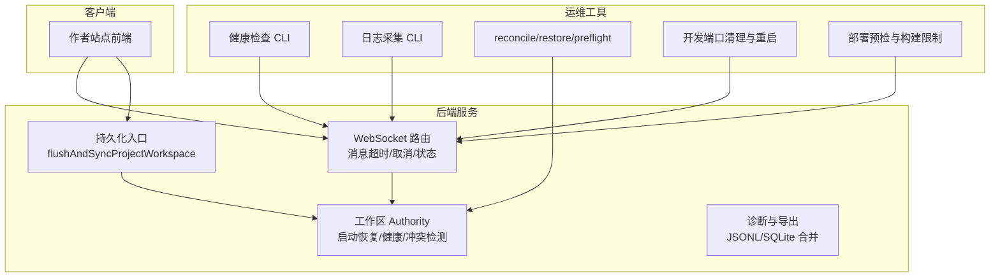
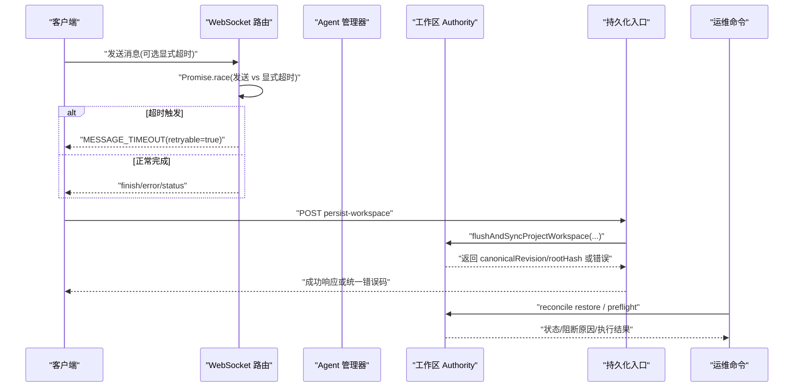
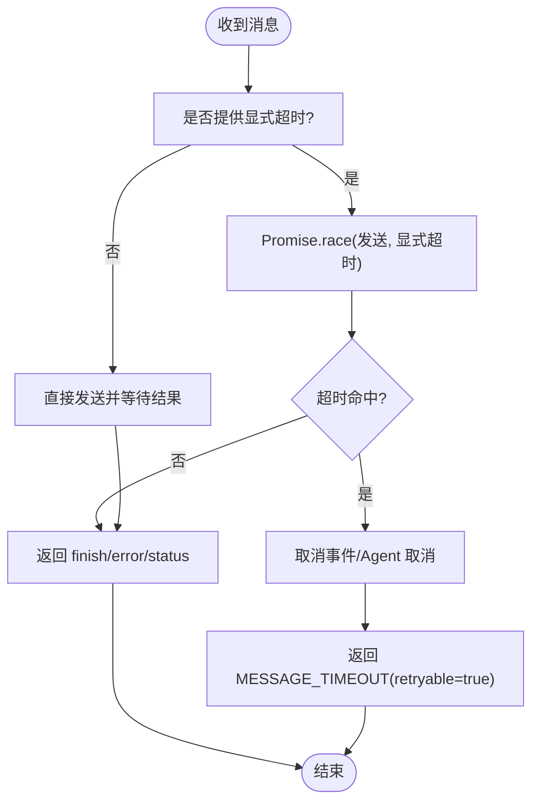
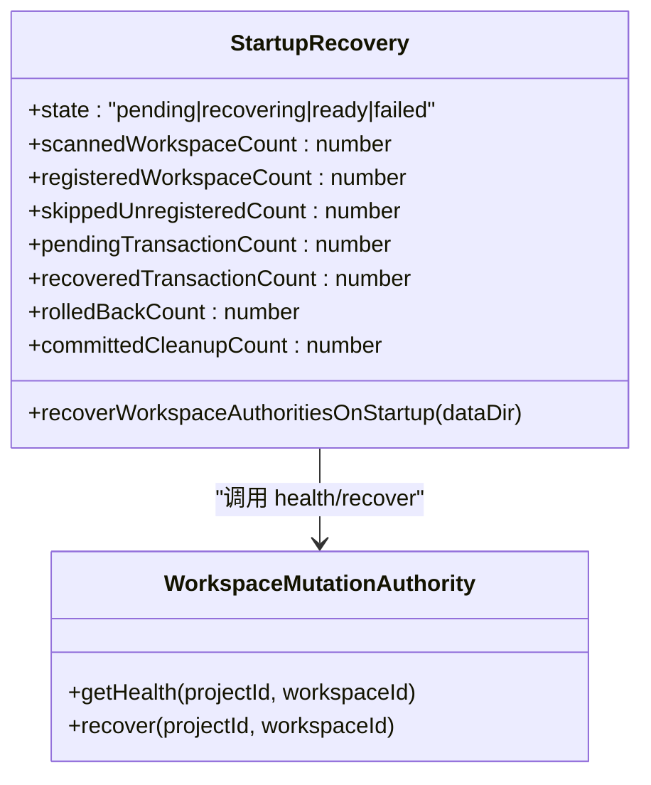
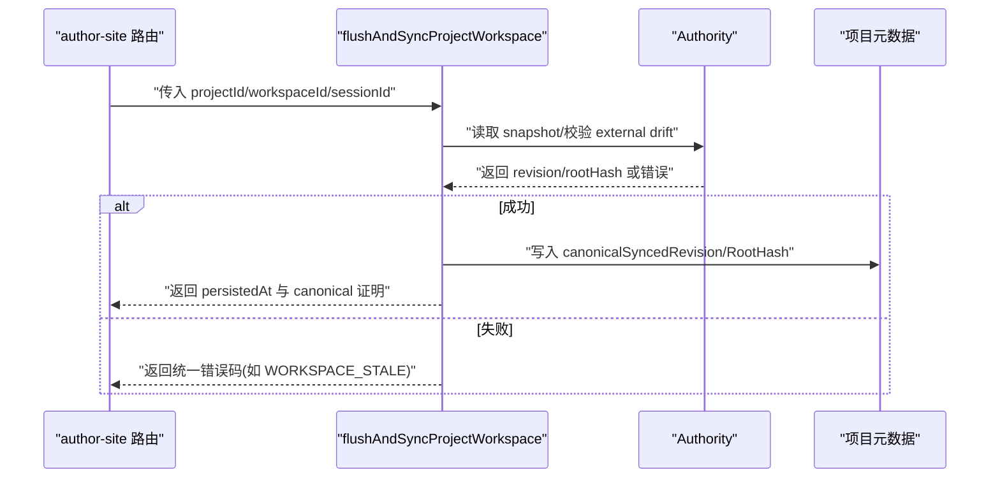
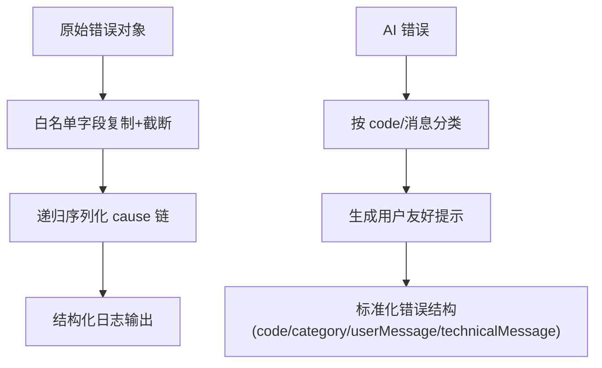
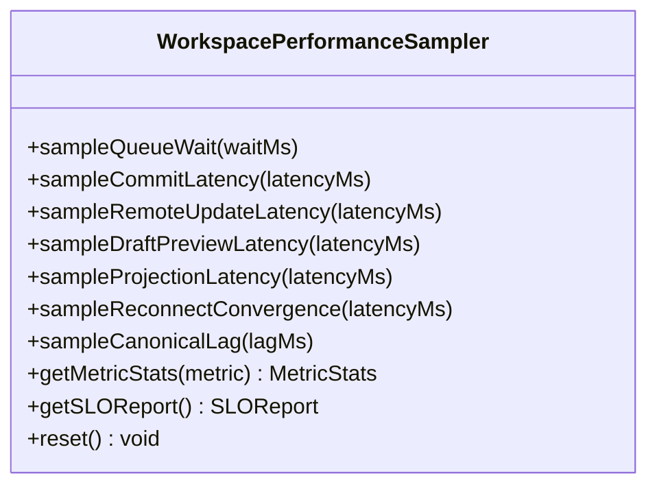
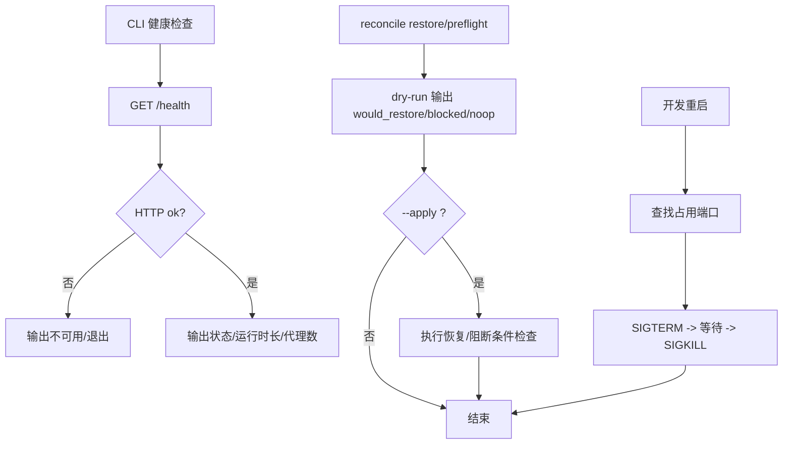
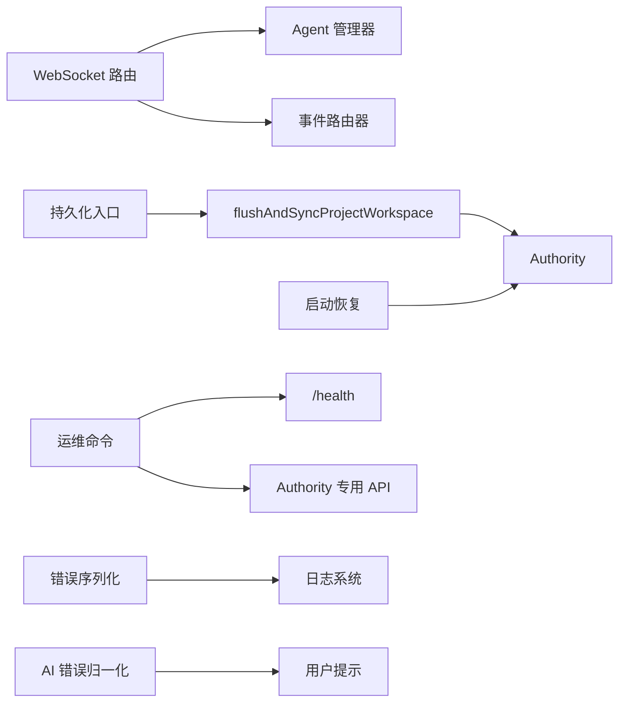

# 服务容错与可靠性

<cite>
**本文引用的文件**   
- [packages/agent-service/src/routes/websocket.ts](file://packages/agent-service/src/routes/websocket.ts)
- [packages/agent-service/tests/unit/websocket-timeout.test.ts](file://packages/agent-service/tests/unit/websocket-timeout.test.ts)
- [packages/agent-service/tests/unit/backend-agent-inactivity-timeout.test.ts](file://packages/agent-service/tests/unit/backend-agent-inactivity-timeout.test.ts)
- [packages/agent-service/src/utils/error-utils.ts](file://packages/agent-service/src/utils/error-utils.ts)
- [packages/shared/src/ai-error-normalizer.ts](file://packages/shared/src/ai-error-normalizer.ts)
- [packages/author-site/src/app/api/sessions/[sessionId]/persist-workspace/route.ts](file://packages/author-site/src/app/api/sessions/[sessionId]/persist-workspace/route.ts)
- [packages/author-site/src/lib/workspace-performance-sampling.ts](file://packages/author-site/src/lib/workspace-performance-sampling.ts)
- [packages/author-site/src/lib/__tests__/workspace-performance-sampling.test.ts](file://packages/author-site/src/lib/__tests__/workspace-performance-sampling.test.ts)
- [packages/agent-service/src/workspace/workspace-authority-startup-recovery.ts](file://packages/agent-service/src/workspace/workspace-authority-startup-recovery.ts)
- [packages/agent-service/tests/unit/workspace-authority-startup-recovery.test.ts](file://packages/agent-service/tests/unit/workspace-authority-startup-recovery.test.ts)
- [OPS/CLI/src/commands/workspace-authority.ts](file://OPS/CLI/src/commands/workspace-authority.ts)
- [OPS/CLI/src/commands/health.ts](file://OPS/CLI/src/commands/health.ts)
- [OPS/CLI/src/commands/logs.ts](file://OPS/CLI/src/commands/logs.ts)
- [scripts/dev-restart.mjs](file://scripts/dev-restart.mjs)
- [scripts/deploy.sh](file://scripts/deploy.sh)
- [docs/plans/进行中/创作端Workspace写入一致性-单写者事务改造方案.md](file://docs/plans/进行中/创作端Workspace写入一致性-单写者事务改造方案.md)
</cite>

## 目录
1. [引言](#引言)
2. [项目结构](#项目结构)
3. [核心组件](#核心组件)
4. [架构总览](#架构总览)
5. [详细组件分析](#详细组件分析)
6. [依赖关系分析](#依赖关系分析)
7. [性能考量](#性能考量)
8. [故障排查指南](#故障排查指南)
9. [结论](#结论)
10. [附录](#附录)

## 引言
本文件面向 Workbench 平台的服务容错与可靠性设计，聚焦以下主题：熔断与降级、重试与超时控制、数据持久化与恢复、服务自愈能力、分布式一致性保证、弹性伸缩方案，以及容错测试与故障演练方法。文档以仓库现有实现为依据，结合相关测试与运维脚本进行说明，并提供可视化图示帮助理解。

## 项目结构
Workbench 的容错与可靠性涉及多个子系统：
- agent-service：WebSocket 消息处理、Agent 生命周期、工作区 Authority 启动恢复与健康诊断
- author-site：会话工作区持久化、SLO 指标采样与报告
- OPS CLI：健康检查、日志采集、Authority reconcile/restore/preflight 等运维命令
- shared：AI 错误归一化与用户提示
- scripts：开发重启、部署预检等辅助脚本

图表来源
- [packages/agent-service/src/routes/websocket.ts:380-450](file://packages/agent-service/src/routes/websocket.ts#L380-L450)
- [packages/agent-service/src/workspace/workspace-authority-startup-recovery.ts:36-88](file://packages/agent-service/src/workspace/workspace-authority-startup-recovery.ts#L36-L88)
- [packages/author-site/src/app/api/sessions/[sessionId]/persist-workspace/route.ts:49-79](file://packages/author-site/src/app/api/sessions/[sessionId]/persist-workspace/route.ts#L49-L79)
- [OPS/CLI/src/commands/health.ts:11-54](file://OPS/CLI/src/commands/health.ts#L11-L54)
- [OPS/CLI/src/commands/logs.ts:138-160](file://OPS/CLI/src/commands/logs.ts#L138-L160)
- [OPS/CLI/src/commands/workspace-authority.ts:493-620](file://OPS/CLI/src/commands/workspace-authority.ts#L493-L620)
- [scripts/dev-restart.mjs:49-106](file://scripts/dev-restart.mjs#L49-L106)
- [scripts/deploy.sh:556-574](file://scripts/deploy.sh#L556-L574)

章节来源
- [packages/agent-service/src/routes/websocket.ts:380-450](file://packages/agent-service/src/routes/websocket.ts#L380-L450)
- [packages/agent-service/src/workspace/workspace-authority-startup-recovery.ts:36-88](file://packages/agent-service/src/workspace/workspace-authority-startup-recovery.ts#L36-L88)
- [packages/author-site/src/app/api/sessions/[sessionId]/persist-workspace/route.ts:49-79](file://packages/author-site/src/app/api/sessions/[sessionId]/persist-workspace/route.ts#L49-L79)
- [OPS/CLI/src/commands/health.ts:11-54](file://OPS/CLI/src/commands/health.ts#L11-L54)
- [OPS/CLI/src/commands/logs.ts:138-160](file://OPS/CLI/src/commands/logs.ts#L138-L160)
- [OPS/CLI/src/commands/workspace-authority.ts:493-620](file://OPS/CLI/src/commands/workspace-authority.ts#L493-L620)
- [scripts/dev-restart.mjs:49-106](file://scripts/dev-restart.mjs#L49-L106)
- [scripts/deploy.sh:556-574](file://scripts/deploy.sh#L556-L574)

## 核心组件
- WebSocket 消息超时与取消：显式超时上限、无进展保护、忙状态返回可重试错误码
- 工作区 Authority 启动恢复：扫描 live Workspace、回滚 prepared 事务、清理已提交残留、阻塞 stale lease
- 持久化与同步：持久化入口调用 flushAndSyncProjectWorkspace，返回 canonical revision/rootHash，失败映射为统一错误码
- 错误序列化与归一化：脱敏字段、长度截断、分类为用户友好提示
- SLO 指标采样：队列等待、commit 延迟、远程更新延迟、投影延迟、重连收敛、canonical 滞后等
- 运维命令：健康检查、日志采集、Authority reconcile/restore/preflight、开发重启、部署预检

章节来源
- [packages/agent-service/src/routes/websocket.ts:380-450](file://packages/agent-service/src/routes/websocket.ts#L380-L450)
- [packages/agent-service/src/workspace/workspace-authority-startup-recovery.ts:36-88](file://packages/agent-service/src/workspace/workspace-authority-startup-recovery.ts#L36-L88)
- [packages/author-site/src/app/api/sessions/[sessionId]/persist-workspace/route.ts:49-79](file://packages/author-site/src/app/api/sessions/[sessionId]/persist-workspace/route.ts#L49-L79)
- [packages/agent-service/src/utils/error-utils.ts:1-134](file://packages/agent-service/src/utils/error-utils.ts#L1-L134)
- [packages/shared/src/ai-error-normalizer.ts:116-156](file://packages/shared/src/ai-error-normalizer.ts#L116-L156)
- [packages/author-site/src/lib/workspace-performance-sampling.ts:201-279](file://packages/author-site/src/lib/workspace-performance-sampling.ts#L201-L279)
- [OPS/CLI/src/commands/health.ts:11-54](file://OPS/CLI/src/commands/health.ts#L11-L54)
- [OPS/CLI/src/commands/logs.ts:138-160](file://OPS/CLI/src/commands/logs.ts#L138-L160)
- [OPS/CLI/src/commands/workspace-authority.ts:493-620](file://OPS/CLI/src/commands/workspace-authority.ts#L493-L620)
- [scripts/dev-restart.mjs:49-106](file://scripts/dev-restart.mjs#L49-L106)
- [scripts/deploy.sh:556-574](file://scripts/deploy.sh#L556-L574)

## 架构总览
下图展示关键请求路径中的容错点：显式超时、忙状态重试、持久化失败映射、启动恢复与 reconcile restore 流程。

图表来源
- [packages/agent-service/src/routes/websocket.ts:380-450](file://packages/agent-service/src/routes/websocket.ts#L380-L450)
- [packages/author-site/src/app/api/sessions/[sessionId]/persist-workspace/route.ts:49-79](file://packages/author-site/src/app/api/sessions/[sessionId]/persist-workspace/route.ts#L49-L79)
- [OPS/CLI/src/commands/workspace-authority.ts:493-620](file://OPS/CLI/src/commands/workspace-authority.ts#L493-L620)

## 详细组件分析

### 组件A：WebSocket 消息超时与忙状态重试
- 显式超时：通过 Promise.race 将发送任务与显式超时定时器竞争；超时后取消事件并返回 MESSAGE_TIMEOUT（retryable=true）
- 忙状态：当上一轮请求仍在运行时返回 AGENT_BUSY（retryable=true），避免重复进入执行器
- 超时参数解析：仅当调用方显式提供时才生效，并对不安全值进行钳制

图表来源
- [packages/agent-service/src/routes/websocket.ts:380-450](file://packages/agent-service/src/routes/websocket.ts#L380-L450)
- [packages/agent-service/tests/unit/websocket-timeout.test.ts:1-53](file://packages/agent-service/tests/unit/websocket-timeout.test.ts#L1-L53)
- [packages/agent-service/tests/unit/backend-agent-inactivity-timeout.test.ts:41-88](file://packages/agent-service/tests/unit/backend-agent-inactivity-timeout.test.ts#L41-L88)

章节来源
- [packages/agent-service/src/routes/websocket.ts:380-450](file://packages/agent-service/src/routes/websocket.ts#L380-L450)
- [packages/agent-service/tests/unit/websocket-timeout.test.ts:1-53](file://packages/agent-service/tests/unit/websocket-timeout.test.ts#L1-L53)
- [packages/agent-service/tests/unit/backend-agent-inactivity-timeout.test.ts:41-88](file://packages/agent-service/tests/unit/backend-agent-inactivity-timeout.test.ts#L41-L88)

### 组件B：工作区 Authority 启动恢复与只读健康
- 启动恢复：扫描 live Workspace，对每个注册过的 Authority 执行 recover，统计 pending/recovered/rolled-back/committed-cleanup；遇到 stale lease 或 workspace 缺失则失败并阻止 ready
- 健康接口：暴露 ready、revision/rootHash、externalDrift、queueDepth、activeLease、prepared/staging/receipt/journal/projectionAck 计数等
- reconcile restore：dry-run 输出 would_restore 或 blocked，apply 才真正执行恢复，丢弃 external drift 并回到最后 committed rootHash

图表来源
- [packages/agent-service/src/workspace/workspace-authority-startup-recovery.ts:1-89](file://packages/agent-service/src/workspace/workspace-authority-startup-recovery.ts#L1-L89)
- [packages/agent-service/tests/unit/workspace-authority-startup-recovery.test.ts:127-151](file://packages/agent-service/tests/unit/workspace-authority-startup-recovery.test.ts#L127-L151)
- [OPS/CLI/src/commands/workspace-authority.ts:493-620](file://OPS/CLI/src/commands/workspace-authority.ts#L493-L620)

章节来源
- [packages/agent-service/src/workspace/workspace-authority-startup-recovery.ts:1-89](file://packages/agent-service/src/workspace/workspace-authority-startup-recovery.ts#L1-L89)
- [packages/agent-service/tests/unit/workspace-authority-startup-recovery.test.ts:127-151](file://packages/agent-service/tests/unit/workspace-authority-startup-recovery.test.ts#L127-L151)
- [OPS/CLI/src/commands/workspace-authority.ts:493-620](file://OPS/CLI/src/commands/workspace-authority.ts#L493-L620)

### 组件C：持久化与同步（会话工作区）
- 入口：POST /api/sessions/:sessionId/persist-workspace
- 行为：调用 flushAndSyncProjectWorkspace，成功后返回 canonicalRevision/canonicalRootHash；失败时映射为统一错误码（如 WORKSPACE_STALE）
- 边界：live Workspace 必须经过 Authority 校验，外部漂移 fail-closed

图表来源
- [packages/author-site/src/app/api/sessions/[sessionId]/persist-workspace/route.ts:49-79](file://packages/author-site/src/app/api/sessions/[sessionId]/persist-workspace/route.ts#L49-L79)
- [docs/plans/进行中/创作端Workspace写入一致性-单写者事务改造方案.md:817-826](file://docs/plans/进行中/创作端Workspace写入一致性-单写者事务改造方案.md#L817-L826)

章节来源
- [packages/author-site/src/app/api/sessions/[sessionId]/persist-workspace/route.ts:49-79](file://packages/author-site/src/app/api/sessions/[sessionId]/persist-workspace/route.ts#L49-L79)
- [docs/plans/进行中/创作端Workspace写入一致性-单写者事务改造方案.md:817-826](file://docs/plans/进行中/创作端Workspace写入一致性-单写者事务改造方案.md#L817-L826)

### 组件D：错误序列化与 AI 错误归一化
- 错误序列化：白名单字段复制、字符串截断、cause 链序列化，防止敏感信息泄露
- AI 错误归一化：按 code/技术消息分类为 connection/timeout/auth/quota/busy/cancelled/server/unknown，并生成用户友好提示

图表来源
- [packages/agent-service/src/utils/error-utils.ts:1-134](file://packages/agent-service/src/utils/error-utils.ts#L1-L134)
- [packages/shared/src/ai-error-normalizer.ts:116-156](file://packages/shared/src/ai-error-normalizer.ts#L116-L156)

章节来源
- [packages/agent-service/src/utils/error-utils.ts:1-134](file://packages/agent-service/src/utils/error-utils.ts#L1-L134)
- [packages/shared/src/ai-error-normalizer.ts:116-156](file://packages/shared/src/ai-error-normalizer.ts#L116-L156)

### 组件E：SLO 指标采样与报告
- 指标维度：autosave-debounce、queue-wait、commit-latency、remote-update-latency、draft-preview-latency、projection-latency、reconnect-convergence、canonical-lag
- 报告语义：无样本时全部通过；p95 超过目标则标记失败；支持 reset 清空

图表来源
- [packages/author-site/src/lib/workspace-performance-sampling.ts:201-279](file://packages/author-site/src/lib/workspace-performance-sampling.ts#L201-L279)
- [packages/author-site/src/lib/__tests__/workspace-performance-sampling.test.ts:114-185](file://packages/author-site/src/lib/__tests__/workspace-performance-sampling.test.ts#L114-L185)

章节来源
- [packages/author-site/src/lib/workspace-performance-sampling.ts:201-279](file://packages/author-site/src/lib/workspace-performance-sampling.ts#L201-L279)
- [packages/author-site/src/lib/__tests__/workspace-performance-sampling.test.ts:114-185](file://packages/author-site/src/lib/__tests__/workspace-performance-sampling.test.ts#L114-L185)

### 组件F：运维与自愈支撑
- 健康检查：CLI 调用 /health，输出 status/uptime/agents/backends
- 日志采集：拉取 /health 并记录到 logs，便于集中分析
- reconcile restore/preflight：只读检查 issues（state missing/lease/prepared/backup缺口），apply 才执行恢复
- 开发重启：释放占用端口，SIGTERM/SIGKILL 清理进程
- 部署预检：限制远端构建内存与负载阈值，拒绝高负载环境构建

图表来源
- [OPS/CLI/src/commands/health.ts:11-54](file://OPS/CLI/src/commands/health.ts#L11-L54)
- [OPS/CLI/src/commands/logs.ts:138-160](file://OPS/CLI/src/commands/logs.ts#L138-L160)
- [OPS/CLI/src/commands/workspace-authority.ts:493-620](file://OPS/CLI/src/commands/workspace-authority.ts#L493-L620)
- [scripts/dev-restart.mjs:49-106](file://scripts/dev-restart.mjs#L49-L106)
- [scripts/deploy.sh:556-574](file://scripts/deploy.sh#L556-L574)

章节来源
- [OPS/CLI/src/commands/health.ts:11-54](file://OPS/CLI/src/commands/health.ts#L11-L54)
- [OPS/CLI/src/commands/logs.ts:138-160](file://OPS/CLI/src/commands/logs.ts#L138-L160)
- [OPS/CLI/src/commands/workspace-authority.ts:493-620](file://OPS/CLI/src/commands/workspace-authority.ts#L493-L620)
- [scripts/dev-restart.mjs:49-106](file://scripts/dev-restart.mjs#L49-L106)
- [scripts/deploy.sh:556-574](file://scripts/deploy.sh#L556-L574)

## 依赖关系分析
- WebSocket 路由依赖 Agent 管理器与事件路由器，负责超时竞争与状态广播
- 持久化入口依赖 flushAndSyncProjectWorkspace，后者依赖 Authority 快照与项目元数据写入
- 启动恢复依赖 Authority 实例的 health/recover 接口，并在异常时设置 failed 状态
- 运维命令依赖 /health 与 Authority 专用 API，用于只读诊断与受控恢复
- 错误序列化与 AI 错误归一化被多处消费，确保日志与用户提示一致

图表来源
- [packages/agent-service/src/routes/websocket.ts:380-450](file://packages/agent-service/src/routes/websocket.ts#L380-L450)
- [packages/author-site/src/app/api/sessions/[sessionId]/persist-workspace/route.ts:49-79](file://packages/author-site/src/app/api/sessions/[sessionId]/persist-workspace/route.ts#L49-L79)
- [packages/agent-service/src/workspace/workspace-authority-startup-recovery.ts:36-88](file://packages/agent-service/src/workspace/workspace-authority-startup-recovery.ts#L36-L88)
- [OPS/CLI/src/commands/health.ts:11-54](file://OPS/CLI/src/commands/health.ts#L11-L54)
- [OPS/CLI/src/commands/workspace-authority.ts:493-620](file://OPS/CLI/src/commands/workspace-authority.ts#L493-L620)
- [packages/agent-service/src/utils/error-utils.ts:1-134](file://packages/agent-service/src/utils/error-utils.ts#L1-L134)
- [packages/shared/src/ai-error-normalizer.ts:116-156](file://packages/shared/src/ai-error-normalizer.ts#L116-L156)

章节来源
- [packages/agent-service/src/routes/websocket.ts:380-450](file://packages/agent-service/src/routes/websocket.ts#L380-L450)
- [packages/author-site/src/app/api/sessions/[sessionId]/persist-workspace/route.ts:49-79](file://packages/author-site/src/app/api/sessions/[sessionId]/persist-workspace/route.ts#L49-L79)
- [packages/agent-service/src/workspace/workspace-authority-startup-recovery.ts:36-88](file://packages/agent-service/src/workspace/workspace-authority-startup-recovery.ts#L36-L88)
- [OPS/CLI/src/commands/health.ts:11-54](file://OPS/CLI/src/commands/health.ts#L11-L54)
- [OPS/CLI/src/commands/workspace-authority.ts:493-620](file://OPS/CLI/src/commands/workspace-authority.ts#L493-L620)
- [packages/agent-service/src/utils/error-utils.ts:1-134](file://packages/agent-service/src/utils/error-utils.ts#L1-L134)
- [packages/shared/src/ai-error-normalizer.ts:116-156](file://packages/shared/src/ai-error-normalizer.ts#L116-L156)

## 性能考量
- 超时策略：显式超时与无进展保护相结合，避免长尾请求拖垮资源
- 重试策略：AGENT_BUSY 与 MESSAGE_TIMEOUT 均标记 retryable=true，客户端可实现指数退避与最大重试次数限制
- 指标观测：SLO 报告覆盖关键链路延迟，p95 超限时告警
- 部署约束：远端构建前检查可用内存与系统负载，降低过载风险

章节来源
- [packages/agent-service/tests/unit/websocket-timeout.test.ts:1-53](file://packages/agent-service/tests/unit/websocket-timeout.test.ts#L1-L53)
- [packages/agent-service/tests/unit/backend-agent-inactivity-timeout.test.ts:41-88](file://packages/agent-service/tests/unit/backend-agent-inactivity-timeout.test.ts#L41-L88)
- [packages/author-site/src/lib/workspace-performance-sampling.ts:201-279](file://packages/author-site/src/lib/workspace-performance-sampling.ts#L201-L279)
- [scripts/deploy.sh:556-574](file://scripts/deploy.sh#L556-L574)

## 故障排查指南
- 健康检查：使用 CLI 检查 /health，确认 status/uptime/agents/backends
- 日志采集：CLI 拉取健康信息并记录，便于定位问题
- Authority 恢复：使用 reconcile restore/preflight 查看 issues（state missing/lease/prepared/backup缺口），必要时 apply 执行恢复
- 启动失败：若存在 stale lease 或孤立 state，启动恢复会失败并保持 failed 状态，需先清理或 adopt
- 开发环境：dev-restart 自动释放端口并终止残留进程，避免端口占用导致重启失败

章节来源
- [OPS/CLI/src/commands/health.ts:11-54](file://OPS/CLI/src/commands/health.ts#L11-L54)
- [OPS/CLI/src/commands/logs.ts:138-160](file://OPS/CLI/src/commands/logs.ts#L138-L160)
- [OPS/CLI/src/commands/workspace-authority.ts:493-620](file://OPS/CLI/src/commands/workspace-authority.ts#L493-L620)
- [packages/agent-service/tests/unit/workspace-authority-startup-recovery.test.ts:127-151](file://packages/agent-service/tests/unit/workspace-authority-startup-recovery.test.ts#L127-L151)
- [scripts/dev-restart.mjs:49-106](file://scripts/dev-restart.mjs#L49-L106)

## 结论
Workbench 在 WebSocket 层实现了显式超时与忙状态重试，在持久化层引入 Authority 快照与 canonical 证明，保障 live Workspace 的一致性；启动恢复与 reconcile restore 提供了强一致性的自愈能力；错误序列化与 AI 错误归一化提升了可观测性与用户体验；SLO 指标与部署预检为稳定性与弹性提供基础。后续可在多副本场景下完善共享协调层与 CRDT 更新日志，进一步提升分布式一致性。

## 附录
- 熔断与降级：当前未实现通用熔断器模式；建议基于 /health 与 Authority health 指标在网关层实现熔断与降级策略
- 重试与退避：客户端可对 retryable=true 的错误实施指数退避与最大重试次数限制
- 分布式一致性：Authority 采用单写者与串行提交，配合 lease 与 backup；多实例协同需在后续引入共享协调层或 CRDT 更新日志
- 弹性伸缩：结合部署预检与 SLO 报告，在低负载窗口扩容，避免在高负载环境构建
- 容错测试与演练：利用 playwright 网络故障模拟、延迟注入与断网场景，验证客户端重试与 UI 提示；结合 reconcile restore 演练外部漂移恢复

[本节为概念性内容，不直接分析具体文件]