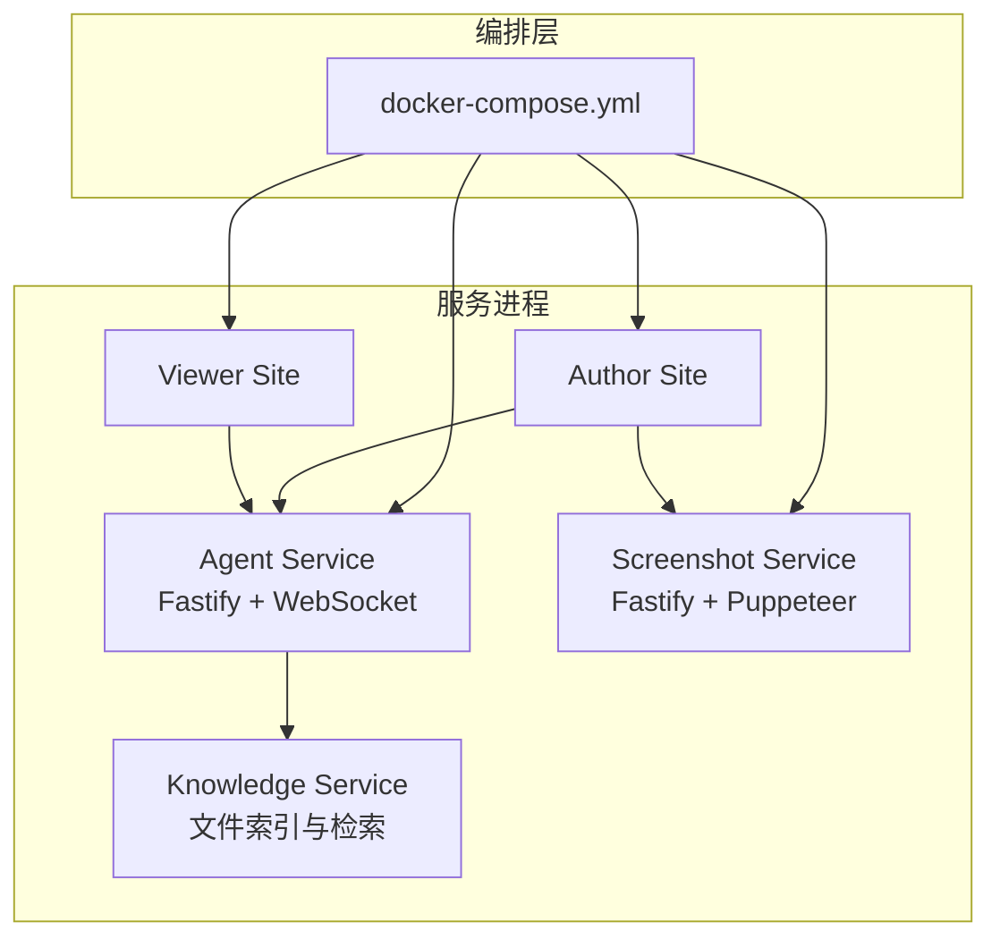
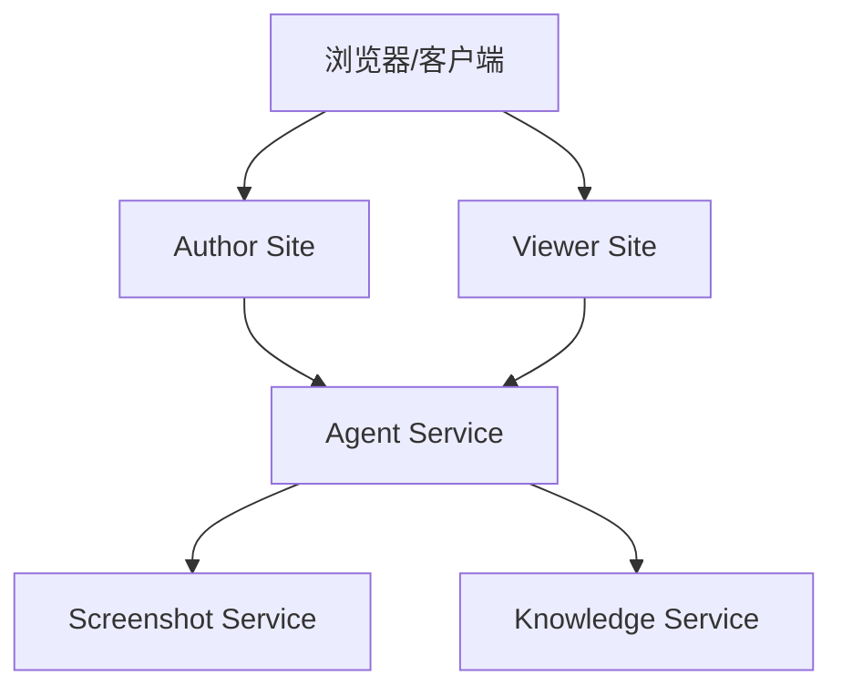
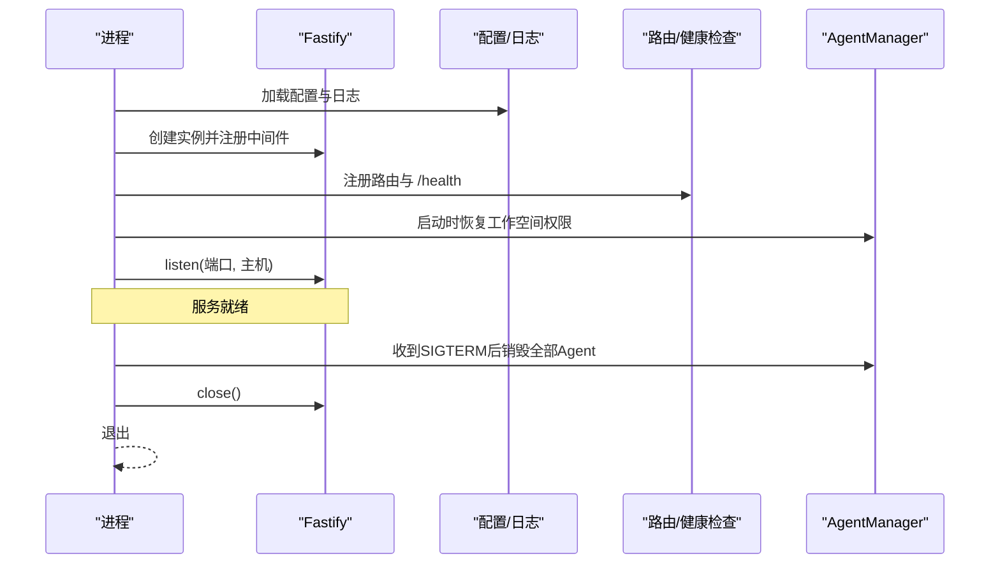
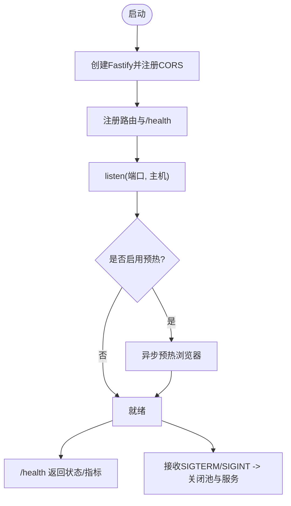
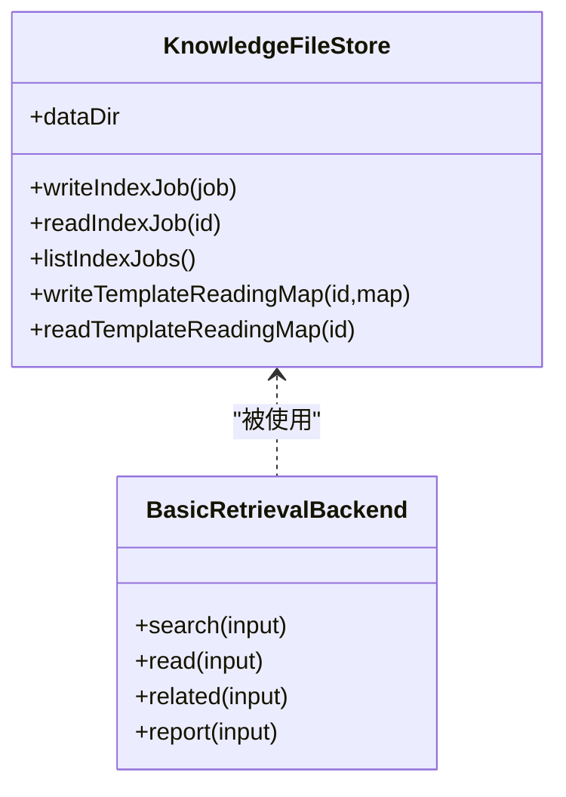
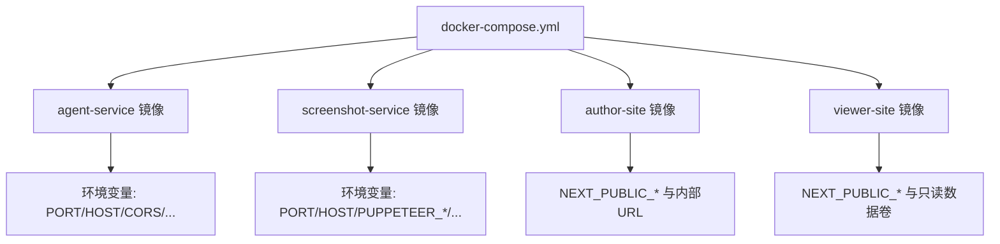
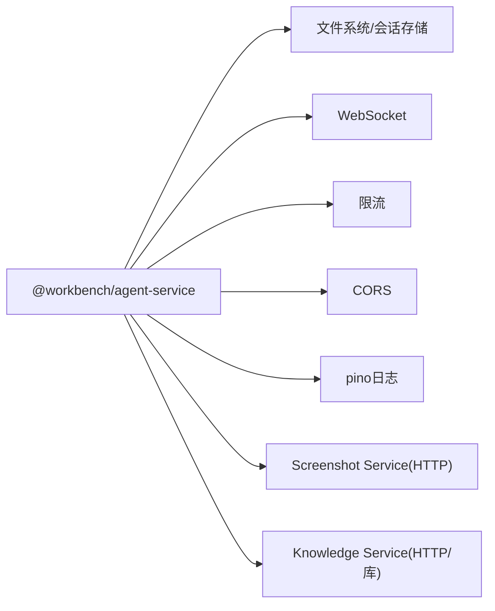

# 服务架构设计

<cite>
**本文引用的文件**   
- [docker-compose.yml](file://docker-compose.yml)
- [packages/agent-service/src/server.ts](file://packages/agent-service/src/server.ts)
- [packages/agent-service/package.json](file://packages/agent-service/package.json)
- [packages/screenshot-service/src/server.ts](file://packages/screenshot-service/src/server.ts)
- [packages/screenshot-service/src/config.ts](file://packages/screenshot-service/src/config.ts)
- [packages/knowledge-service/src/index.ts](file://packages/knowledge-service/src/index.ts)
- [docker/agent-service/Dockerfile](file://docker/agent-service/Dockerfile)
</cite>

## 目录
1. [引言](#引言)
2. [项目结构](#项目结构)
3. [核心组件](#核心组件)
4. [架构总览](#架构总览)
5. [详细组件分析](#详细组件分析)
6. [依赖分析](#依赖分析)
7. [性能考虑](#性能考虑)
8. [故障排查指南](#故障排查指南)
9. [结论](#结论)
10. [附录](#附录)

## 引言
本文件面向 Workbench 平台的服务架构，聚焦微服务划分、启动流程、服务间通信、生命周期管理、容器化部署与扩展机制。重点覆盖 Agent Service、Knowledge Service、Screenshot Service 的职责边界与协作方式，并结合现有代码与编排配置给出可落地的实践建议。

## 项目结构
Workbench 采用多包（monorepo）组织，关键服务位于 packages 下，并通过 docker-compose 进行本地编排：
- agent-service：提供 AI Agent 会话、WebSocket 流式交互、模型目录、工作空间与权限等能力
- screenshot-service：基于 Puppeteer 的截图服务，支持预热、深度健康检查与指标采集
- knowledge-service：知识检索与索引后端，提供文件存储、模板索引、检索与报告生成等能力
- author-site / viewer-site：创作端与查看端站点（静态或 Next.js），通过环境变量指向后端服务

图表来源
- [docker-compose.yml:1-140](file://docker-compose.yml#L1-L140)

章节来源
- [docker-compose.yml:1-140](file://docker-compose.yml#L1-L140)

## 核心组件
- Agent Service
  - 职责：HTTP 与 WebSocket 网关；会话与工作空间管理；模型目录适配；限流与鉴权中间件；与 Screenshot/Knowledge 等下游服务协同
  - 技术栈：Fastify、@fastify/cors、@fastify/rate-limit、@fastify/websocket、pino 日志
  - 入口：packages/agent-service/src/server.ts
- Screenshot Service
  - 职责：页面渲染与截图；浏览器池管理；编译缓存；队列与超时控制；健康检查与预热
  - 技术栈：Fastify、Puppeteer、内存缓存与指标
  - 入口：packages/screenshot-service/src/server.ts
- Knowledge Service
  - 职责：知识条目索引、检索、相关项推荐、报告生成；模板阅读地图构建与持久化
  - 技术栈：Node fs、JSON 文件存储、基础分词与评分
  - 入口：packages/knowledge-service/src/index.ts

章节来源
- [packages/agent-service/src/server.ts:1-117](file://packages/agent-service/src/server.ts#L1-L117)
- [packages/screenshot-service/src/server.ts:1-110](file://packages/screenshot-service/src/server.ts#L1-L110)
- [packages/knowledge-service/src/index.ts:1-543](file://packages/knowledge-service/src/index.ts#L1-L543)

## 架构总览
整体为“前端站点 + 微服务”的轻量微服务架构。站点通过 HTTP 调用 Agent Service，Agent Service 再按需同步调用 Screenshot Service 与 Knowledge Service。截图服务具备浏览器池与队列，保障并发与稳定性。

图表来源
- [docker-compose.yml:1-140](file://docker-compose.yml#L1-L140)
- [packages/agent-service/src/server.ts:1-117](file://packages/agent-service/src/server.ts#L1-L117)
- [packages/screenshot-service/src/server.ts:1-110](file://packages/screenshot-service/src/server.ts#L1-L110)

## 详细组件分析

### Agent Service 组件分析
- 启动流程
  - 加载配置与日志
  - 初始化后端提供者管理器
  - 创建 Fastify 实例并注册 CORS、WebSocket、限流中间件
  - 注册路由与健康检查
  - 监听端口并输出启动信息
  - 处理 SIGTERM 优雅关闭：销毁所有 Agent 实例、清理会话存储、关闭服务器
- 关键特性
  - 动态注册 Pi Agent 后端（失败时降级告警）
  - 工作空间权限恢复策略在启动阶段执行
  - 暴露 /health 返回运行状态、Agent 数量与恢复状态

图表来源
- [packages/agent-service/src/server.ts:1-117](file://packages/agent-service/src/server.ts#L1-L117)

章节来源
- [packages/agent-service/src/server.ts:1-117](file://packages/agent-service/src/server.ts#L1-L117)
- [packages/agent-service/package.json:1-53](file://packages/agent-service/package.json#L1-L53)

### Screenshot Service 组件分析
- 启动流程
  - 创建 Fastify 实例并注册 CORS
  - 注册路由与健康检查
  - 监听端口并输出启动信息
  - 可选预热：启动后异步预热浏览器
  - 处理 SIGTERM/SIGINT：关闭浏览器池与服务器
- 健康检查
  - 支持深度健康检查（可配置或通过查询参数触发）
  - 返回浏览器池状态、队列、缓存与指标快照

图表来源
- [packages/screenshot-service/src/server.ts:1-110](file://packages/screenshot-service/src/server.ts#L1-L110)
- [packages/screenshot-service/src/config.ts:1-52](file://packages/screenshot-service/src/config.ts#L1-L52)

章节来源
- [packages/screenshot-service/src/server.ts:1-110](file://packages/screenshot-service/src/server.ts#L1-L110)
- [packages/screenshot-service/src/config.ts:1-52](file://packages/screenshot-service/src/config.ts#L1-L52)

### Knowledge Service 组件分析
- 核心能力
  - 文件存储：索引任务、模板阅读地图读写
  - 模板索引：创建任务、扫描工作区、生成阅读地图、标记过期
  - 检索与报告：基础检索、相关项、报告生成
- 数据流
  - 读取 workspace-tree.json、project.config.schema.json、knowledge 清单或目录
  - 构建结构化阅读地图与任务条目
  - 支持摘要增强（可扩展接入外部组织者）

图表来源
- [packages/knowledge-service/src/index.ts:1-543](file://packages/knowledge-service/src/index.ts#L1-L543)

章节来源
- [packages/knowledge-service/src/index.ts:1-543](file://packages/knowledge-service/src/index.ts#L1-L543)

### 服务间通信模式
- 同步 HTTP 调用
  - 现状：Agent Service 作为统一入口，按业务需要调用 Screenshot/Knowledge 等下游服务
  - 建议：对耗时操作引入重试与熔断；统一错误码与超时策略
- 异步消息队列
  - 现状：未见内置消息队列实现
  - 建议：将长任务（如大规模索引、批量截图）迁移至队列，提升吞吐与弹性
- 事件驱动
  - 现状：Agent Service 通过 WebSocket 推送实时事件给前端
  - 建议：跨服务事件可通过事件总线或消息队列解耦

[本节为概念性说明，不直接分析具体文件]

### 服务生命周期管理
- 健康检查
  - Agent Service：/health 返回状态、运行时长、Agent 数量与权限恢复状态
  - Screenshot Service：/health 返回浏览器池、队列、缓存与指标，支持深度检查
- 优雅关闭
  - Agent Service：SIGTERM -> 销毁所有 Agent -> 清理会话 -> 关闭 Fastify
  - Screenshot Service：SIGTERM/SIGINT -> 关闭浏览器池 -> 关闭 Fastify
- 资源清理
  - 确保浏览器实例、连接与临时文件在关闭路径中释放

章节来源
- [packages/agent-service/src/server.ts:89-110](file://packages/agent-service/src/server.ts#L89-L110)
- [packages/screenshot-service/src/server.ts:44-87](file://packages/screenshot-service/src/server.ts#L44-L87)

### 容器化部署策略
- Docker 镜像构建
  - Agent Service：多阶段构建，仅拷贝产物与预装技能，运行时安装最小依赖集
  - 其他服务：参考 docker-compose 中的 Dockerfile 定义
- 环境变量配置
  - 通过 docker-compose.yml 注入端口、CORS、数据目录、第三方 API 密钥等
  - 站点通过 NEXT_PUBLIC_* 向客户端暴露必要 URL
- 服务编排
  - 使用 profiles 控制可选服务（如截图服务）
  - 设置 CPU/内存/PID 限制与共享内存大小，保证稳定性
  - 定义 healthcheck 用于编排器探测

图表来源
- [docker-compose.yml:1-140](file://docker-compose.yml#L1-L140)
- [docker/agent-service/Dockerfile:1-43](file://docker/agent-service/Dockerfile#L1-L43)

章节来源
- [docker-compose.yml:1-140](file://docker-compose.yml#L1-L140)
- [docker/agent-service/Dockerfile:1-43](file://docker/agent-service/Dockerfile#L1-L43)

### 服务扩展机制
- 插件架构
  - Agent Service 已具备后端提供者初始化与动态注册机制，便于扩展新的 AI 后端
  - 建议：抽象统一的 Provider 接口，集中注册与发现
- 第三方服务集成
  - 通过环境变量注入外部服务地址与凭据
  - 建议：封装统一的客户端 SDK，统一重试、超时、熔断与指标上报

[本节为概念性说明，不直接分析具体文件]

## 依赖分析
- 组件耦合
  - Agent Service 对外暴露 HTTP/WebSocket，对内聚合多个子系统（会话、权限、模型、工作空间）
  - Screenshot Service 独立于 Agent，通过 HTTP 被调用
  - Knowledge Service 以库形式被引用，也可独立部署为服务
- 外部依赖
  - Fastify 生态：cors、rate-limit、websocket
  - 日志：pino/pino-pretty
  - 浏览器自动化：Puppeteer（截图服务）
- 潜在循环依赖
  - 当前未发现直接循环依赖；建议保持服务间单向调用关系

图表来源
- [packages/agent-service/package.json:1-53](file://packages/agent-service/package.json#L1-L53)
- [packages/agent-service/src/server.ts:1-117](file://packages/agent-service/src/server.ts#L1-L117)
- [packages/screenshot-service/src/server.ts:1-110](file://packages/screenshot-service/src/server.ts#L1-L110)
- [packages/knowledge-service/src/index.ts:1-543](file://packages/knowledge-service/src/index.ts#L1-L543)

章节来源
- [packages/agent-service/package.json:1-53](file://packages/agent-service/package.json#L1-L53)
- [packages/agent-service/src/server.ts:1-117](file://packages/agent-service/src/server.ts#L1-L117)
- [packages/screenshot-service/src/server.ts:1-110](file://packages/screenshot-service/src/server.ts#L1-L110)
- [packages/knowledge-service/src/index.ts:1-543](file://packages/knowledge-service/src/index.ts#L1-L543)

## 性能考虑
- 限流与并发
  - Agent Service 启用速率限制，避免滥用
  - Screenshot Service 限制最大并发页面数与任务超时，防止资源耗尽
- 缓存与预热
  - 截图服务提供编译缓存与浏览器预热，降低冷启动延迟
- 资源隔离
  - 通过 docker-compose 设置 CPU/内存/PID 上限，保障多服务共存稳定
- 健康检查与自愈
  - 健康检查结合编排器重启策略，提高可用性

[本节为通用指导，不直接分析具体文件]

## 故障排查指南
- 常见问题定位
  - 服务未启动：检查端口占用、环境变量与镜像构建产物
  - 健康检查失败：访问 /health 查看返回字段，确认浏览器池、队列与缓存状态
  - 跨域问题：核对 CORS_ORIGINS 配置与请求来源
  - 截图失败：检查 PUPPETEER_EXECUTABLE_PATH、沙箱禁用与共享内存大小
- 诊断手段
  - 查看服务日志（pino 输出）
  - 使用编排器的 healthcheck 结果
  - 开启深度健康检查（截图服务）

章节来源
- [packages/agent-service/src/server.ts:89-110](file://packages/agent-service/src/server.ts#L89-L110)
- [packages/screenshot-service/src/server.ts:44-87](file://packages/screenshot-service/src/server.ts#L44-L87)
- [docker-compose.yml:116-121](file://docker-compose.yml#L116-L121)

## 结论
Workbench 当前采用轻量微服务架构，Agent Service 作为统一网关，Screenshot Service 与 Knowledge Service 分别承担渲染与知识检索职责。通过 Fastify 生态与 docker-compose 编排，实现了清晰的职责边界与可观测性。后续可在异步化、服务发现与统一客户端方面进一步增强，以提升系统弹性与可维护性。

## 附录
- 环境变量要点
  - 通用：PORT、HOST、CORS_ORIGINS、DATA_DIR
  - Agent：PI_AGENT_*、INTERNAL_API_TOKEN、SCREENSHOT_SERVICE_URL
  - Screenshot：PUPPETEER_*、AUTHOR_SITE_URL、CDN_BASE_URL
  - 站点：NEXT_PUBLIC_* 系列变量
- 健康检查端点
  - Agent Service：/health
  - Screenshot Service：/health?deep=1（可选深度检查）

章节来源
- [docker-compose.yml:1-140](file://docker-compose.yml#L1-L140)
- [packages/agent-service/src/server.ts:89-110](file://packages/agent-service/src/server.ts#L89-L110)
- [packages/screenshot-service/src/server.ts:44-87](file://packages/screenshot-service/src/server.ts#L44-L87)