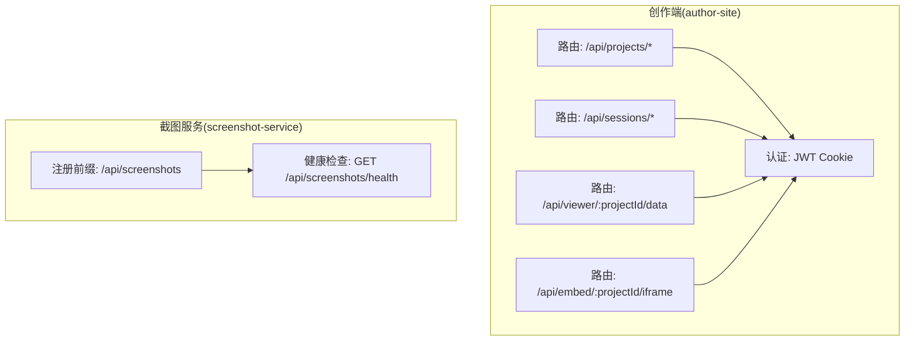
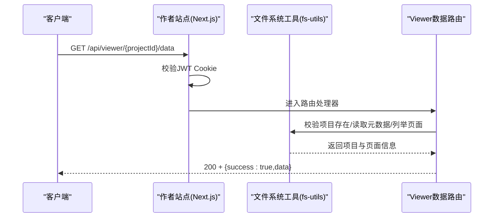
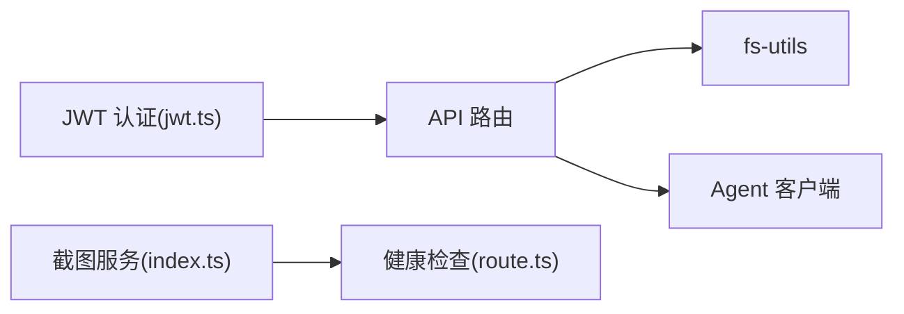

# HTTP REST API

<cite>
**本文引用的文件**
- [packages/author-site/src/app/api/projects/route.ts](file://packages/author-site/src/app/api/projects/route.ts)
- [packages/author-site/src/app/api/projects/[id]/route.ts](file://packages/author-site/src/app/api/projects/[id]/route.ts)
- [packages/author-site/src/app/api/sessions/route.ts](file://packages/author-site/src/app/api/sessions/route.ts)
- [packages/author-site/src/app/api/sessions/[sessionId]/route.ts](file://packages/author-site/src/app/api/sessions/[sessionId]/route.ts)
- [packages/author-site/src/app/api/sessions/[sessionId]/meta/route.ts](file://packages/author-site/src/app/api/sessions/[sessionId]/meta/route.ts)
- [packages/author-site/src/app/api/sessions/[sessionId]/files/[demoId]/route.ts](file://packages/author-site/src/app/api/sessions/[sessionId]/files/[demoId]/route.ts)
- [packages/author-site/src/app/api/sessions/[sessionId]/workspace/files/[...filePath]/route.ts](file://packages/author-site/src/app/api/sessions/[sessionId]/workspace/files/[...filePath]/route.ts)
- [packages/author-site/src/app/api/viewer/[projectId]/data/route.ts](file://packages/author-site/src/app/api/viewer/[projectId]/data/route.ts)
- [packages/author-site/src/app/api/embed/[projectId]/iframe/route.ts](file://packages/author-site/src/app/api/embed/[projectId]/iframe/route.ts)
- [packages/author-site/src/lib/auth/jwt.ts](file://packages/author-site/src/lib/auth/jwt.ts)
- [packages/shared/src/types.ts](file://packages/shared/src/types.ts)
- [packages/shared/src/index.ts](file://packages/shared/src/index.ts)
- [packages/author-site/src/lib/project-admin-service.ts](file://packages/author-site/src/lib/project-admin-service.ts)
- [packages/agent-service/src/routes/api-response.ts](file://packages/agent-service/src/routes/api-response.ts)
- [packages/screenshot-service/src/routes/index.ts](file://packages/screenshot-service/src/routes/index.ts)
- [packages/screenshot-service/src/routes/screenshots.ts](file://packages/screenshot-service/src/routes/screenshots.ts)
- [packages/author-site/src/app/api/screenshots/health/route.ts](file://packages/author-site/src/app/api/screenshots/health/route.ts)
</cite>

## 目录
1. [简介](#简介)
2. [项目结构](#项目结构)
3. [核心组件](#核心组件)
4. [架构总览](#架构总览)
5. [详细接口说明](#详细接口说明)
6. [依赖分析](#依赖分析)
7. [性能考虑](#性能考虑)
8. [故障排查指南](#故障排查指南)
9. [结论](#结论)
10. [附录](#附录)

## 简介
本文件为 Workbench 平台的 HTTP REST API 文档，覆盖以下能力：
- 项目管理（CRUD）
- 会话管理（创建、查询、元数据更新、删除等）
- 文件操作（工作区文件读取与写入、Demo 页面文件访问）
- 截图服务（生成、健康检查）
- 统一响应结构与错误码体系
- 认证机制与权限控制规则
- 请求与响应示例及状态码说明

## 项目结构
API 基于 Next.js App Router 的 Route Handlers 实现，位于 author-site 包中；截图服务为独立 Fastify 服务，通过 /api/screenshots 前缀暴露。

图表来源
- [packages/author-site/src/app/api/projects/route.ts](file://packages/author-site/src/app/api/projects/route.ts)
- [packages/author-site/src/app/api/sessions/route.ts](file://packages/author-site/src/app/api/sessions/route.ts)
- [packages/author-site/src/app/api/viewer/[projectId]/data/route.ts](file://packages/author-site/src/app/api/viewer/[projectId]/data/route.ts)
- [packages/author-site/src/app/api/embed/[projectId]/iframe/route.ts](file://packages/author-site/src/app/api/embed/[projectId]/iframe/route.ts)
- [packages/author-site/src/lib/auth/jwt.ts](file://packages/author-site/src/lib/auth/jwt.ts)
- [packages/screenshot-service/src/routes/index.ts](file://packages/screenshot-service/src/routes/index.ts)
- [packages/author-site/src/app/api/screenshots/health/route.ts](file://packages/author-site/src/app/api/screenshots/health/route.ts)

章节来源
- [packages/author-site/src/app/api/projects/route.ts](file://packages/author-site/src/app/api/projects/route.ts)
- [packages/author-site/src/app/api/sessions/route.ts](file://packages/author-site/src/app/api/sessions/route.ts)
- [packages/author-site/src/app/api/viewer/[projectId]/data/route.ts](file://packages/author-site/src/app/api/viewer/[projectId]/data/route.ts)
- [packages/author-site/src/app/api/embed/[projectId]/iframe/route.ts](file://packages/author-site/src/app/api/embed/[projectId]/iframe/route.ts)
- [packages/author-site/src/lib/auth/jwt.ts](file://packages/author-site/src/lib/auth/jwt.ts)
- [packages/screenshot-service/src/routes/index.ts](file://packages/screenshot-service/src/routes/index.ts)
- [packages/author-site/src/app/api/screenshots/health/route.ts](file://packages/author-site/src/app/api/screenshots/health/route.ts)

## 核心组件
- 统一响应封装
  - 成功响应：{ success: true, data }
  - 错误响应：{ success: false, error: { code, message, details? } }
- 错误码定义与消息映射
  - 标准错误码包括 DEMO_NOT_FOUND、SESSION_NOT_FOUND、INVALID_REQUEST、FILE_READ_ERROR、FILE_WRITE_ERROR、SESSION_EXPIRED、VALIDATION_ERROR、AGENT_SERVICE_ERROR、WORKSPACE_STALE、UNAUTHORIZED、FORBIDDEN、INTERNAL_ERROR、PROJECT_NOT_FOUND、INVALID_FILE_TYPE、FILE_TOO_LARGE、UPLOAD_FAILED 等
- 认证机制
  - 使用 JWT Cookie（auth_token），服务端在需要鉴权的接口校验 token，未登录或过期返回 UNAUTHORIZED
- 权限控制
  - 多数写操作要求登录并具备相应资源归属（如 Session/workspace 的 userId 匹配）
  - 部分管理操作需管理员角色（例如删除项目预览执行）

章节来源
- [packages/shared/src/types.ts](file://packages/shared/src/types.ts)
- [packages/shared/src/index.ts](file://packages/shared/src/index.ts)
- [packages/author-site/src/lib/auth/jwt.ts](file://packages/author-site/src/lib/auth/jwt.ts)
- [packages/author-site/src/lib/project-admin-service.ts](file://packages/author-site/src/lib/project-admin-service.ts)
- [packages/agent-service/src/routes/api-response.ts](file://packages/agent-service/src/routes/api-response.ts)

## 架构总览
下图展示典型“获取项目预览数据”的请求链路，体现认证、路由处理与数据组装过程。

图表来源
- [packages/author-site/src/app/api/viewer/[projectId]/data/route.ts](file://packages/author-site/src/app/api/viewer/[projectId]/data/route.ts)
- [packages/author-site/src/lib/auth/jwt.ts](file://packages/author-site/src/lib/auth/jwt.ts)

## 详细接口说明

### 通用约定
- 内容类型：application/json
- 成功响应：
  - 状态码：200（或 201 用于创建类接口）
  - 体：{ success: true, data: T }
- 错误响应：
  - 状态码：根据错误码映射（见后文）
  - 体：{ success: false, error: { code, message, details? } }

章节来源
- [packages/shared/src/types.ts](file://packages/shared/src/types.ts)
- [packages/shared/src/index.ts](file://packages/shared/src/index.ts)

### 认证与权限
- 认证方式：Cookie 中的 auth_token（JWT）
- 登录态设置：服务端在登录成功后设置 httpOnly Cookie，默认生产环境启用 secure
- 鉴权流程：受保护接口从 Cookie 读取 token 并验证，失败返回 UNAUTHORIZED
- 权限规则：
  - 读写 Session/workspace 时校验 sessionId 对应 meta.userId 与当前用户一致
  - 删除项目预览执行需管理员角色

章节来源
- [packages/author-site/src/lib/auth/jwt.ts](file://packages/author-site/src/lib/auth/jwt.ts)
- [packages/author-site/src/app/api/sessions/[sessionId]/route.ts](file://packages/author-site/src/app/api/sessions/[sessionId]/route.ts)
- [packages/author-site/src/lib/project-admin-service.ts](file://packages/author-site/src/lib/project-admin-service.ts)

### 项目管理接口

#### 获取项目列表
- 方法：GET
- 路径：/api/projects
- 认证：否
- 响应：
  - 200 { success: true, data: Project[] }
- 说明：按更新时间倒序返回项目元信息

章节来源
- [packages/author-site/src/app/api/projects/route.ts](file://packages/author-site/src/app/api/projects/route.ts)

#### 创建项目
- 方法：POST
- 路径：/api/projects
- 认证：否
- 请求体：
  - name: string（必填）
  - description?: string
- 响应：
  - 201 { success: true, data: Project }
- 说明：参数校验、生成唯一 ID、初始化目录与文件

章节来源
- [packages/author-site/src/app/api/projects/route.ts](file://packages/author-site/src/app/api/projects/route.ts)

#### 获取项目详情
- 方法：GET
- 路径：/api/projects/:id
- 认证：否
- 响应：
  - 200 { success: true, data: Project }

章节来源
- [packages/author-site/src/app/api/projects/[id]/route.ts](file://packages/author-site/src/app/api/projects/[id]/route.ts)

#### 删除项目
- 方法：DELETE
- 路径：/api/projects/:id
- 认证：是（管理员）
- 响应：
  - 200 { success: true, data: null }
- 说明：先创建删除计划，再执行确认令牌校验后删除

章节来源
- [packages/author-site/src/app/api/projects/[id]/route.ts](file://packages/author-site/src/app/api/projects/[id]/route.ts)
- [packages/author-site/src/lib/project-admin-service.ts](file://packages/author-site/src/lib/project-admin-service.ts)

### 会话管理接口

#### 创建/恢复编辑会话
- 方法：POST
- 路径：/api/sessions
- 认证：是
- 请求体：
  - demoId: string（必填，表示项目ID）
  - forceNew?: boolean
  - workspaceId?: string
- 响应：
  - 201 { success: true, data: { sessionId, workspaceId, workspaceScope, isSharedWorkspace, code, schema, workspacePath, tempWorkspace } }
- 说明：若存在活跃会话且未指定 workspaceId，则复用并推送模型配置与外部认证配置

章节来源
- [packages/author-site/src/app/api/sessions/route.ts](file://packages/author-site/src/app/api/sessions/route.ts)

#### 列出会话
- 方法：GET
- 路径：/api/sessions
- 认证：是
- 查询参数：
  - status?: string
  - limit?: number
  - offset?: number
- 响应：
  - 200 { success: true, data: SessionList }

章节来源
- [packages/author-site/src/app/api/sessions/route.ts](file://packages/author-site/src/app/api/sessions/route.ts)

#### 获取会话详情
- 方法：GET
- 路径：/api/sessions/:sessionId
- 认证：是
- 响应：
  - 200 { success: true, data: SessionMeta }
- 错误：
  - 401 UNAUTHORIZED
  - 404 SESSION_NOT_FOUND
  - 403 FORBIDDEN（非本人会话）

章节来源
- [packages/author-site/src/app/api/sessions/[sessionId]/route.ts](file://packages/author-site/src/app/api/sessions/[sessionId]/route.ts)

#### 更新会话元数据
- 方法：PATCH
- 路径：/api/sessions/:sessionId/meta
- 认证：是
- 请求体：SessionMeta 的部分字段
- 响应：
  - 200 { success: true, data: SessionMeta }
- 错误：
  - 401 UNAUTHORIZED
  - 404 SESSION_NOT_FOUND
  - 403 FORBIDDEN

章节来源
- [packages/author-site/src/app/api/sessions/[sessionId]/meta/route.ts](file://packages/author-site/src/app/api/sessions/[sessionId]/meta/route.ts)

#### 删除会话
- 方法：DELETE
- 路径：/api/sessions/:sessionId
- 认证：是
- 响应：
  - 200 { success: true, data: null }
- 错误：
  - 401 UNAUTHORIZED
  - 404 SESSION_NOT_FOUND
  - 403 FORBIDDEN

章节来源
- [packages/author-site/src/app/api/sessions/[sessionId]/route.ts](file://packages/author-site/src/app/api/sessions/[sessionId]/route.ts)

### 文件操作接口

#### 获取 Demo 页面文件清单
- 方法：GET
- 路径：/api/sessions/:sessionId/files/:demoId
- 认证：是
- 响应：
  - 200 { success: true, data: DemoFiles[] }
- 错误：
  - 401 UNAUTHORIZED
  - 404 SESSION_NOT_FOUND / DEMO_PAGE_NOT_FOUND
  - 403 FORBIDDEN
  - 410 SESSION_EXPIRED
  - 400 INVALID_REQUEST（未绑定 workspaceId 或不匹配）

章节来源
- [packages/author-site/src/app/api/sessions/[sessionId]/files/[demoId]/route.ts](file://packages/author-site/src/app/api/sessions/[sessionId]/files/[demoId]/route.ts)

#### 更新 Demo 页面代码/Schema
- 方法：PUT
- 路径：/api/sessions/:sessionId/files/:demoId
- 认证：是
- 请求体：
  - code?: string
  - schema?: string
- 约束：至少提供 code 或 schema 之一，且必须为字符串
- 响应：
  - 200 { success: true, data: ... }
- 错误：
  - 400 INVALID_REQUEST（参数校验失败、不匹配、未绑定 workspaceId）
  - 404 SESSION_NOT_FOUND
  - 403 FORBIDDEN
  - 410 SESSION_EXPIRED

章节来源
- [packages/author-site/src/app/api/sessions/[sessionId]/files/[demoId]/route.ts](file://packages/author-site/src/app/api/sessions/[sessionId]/files/[demoId]/route.ts)

#### 读取工作区文件内容
- 方法：GET
- 路径：/api/sessions/:sessionId/workspace/files/:filePath
- 认证：是
- 限制：单文件最大 1MB，超限返回 413
- 响应：
  - 200 { success: true, data: { path, content, editable, size } }
- 错误：
  - 401 UNAUTHORIZED
  - 404 FILE_NOT_FOUND
  - 413 FILE_TOO_LARGE
  - 500 FILE_READ_ERROR

章节来源
- [packages/author-site/src/app/api/sessions/[sessionId]/workspace/files/[...filePath]/route.ts](file://packages/author-site/src/app/api/sessions/[sessionId]/workspace/files/[...filePath]/route.ts)

#### 更新工作区文件内容
- 方法：PUT
- 路径：/api/sessions :sessionId/workspace/files/:filePath
- 认证：是
- 请求体：
  - content: string
- 响应：
  - 200 { success: true, data: ... }
- 错误：
  - 401 UNAUTHORIZED
  - 404 FILE_NOT_FOUND
  - 500 FILE_WRITE_ERROR

章节来源
- [packages/author-site/src/app/api/sessions/[sessionId]/workspace/files/[...filePath]/route.ts](file://packages/author-site/src/app/api/sessions/[sessionId]/workspace/files/[...filePath]/route.ts)

### 截图服务接口

#### 健康检查
- 方法：GET
- 路径：/api/screenshots/health
- 认证：否
- 响应：
  - 200 { success: true, data: HealthInfo }
- 异常：
  - 503 服务不可用或代理超时

章节来源
- [packages/author-site/src/app/api/screenshots/health/route.ts](file://packages/author-site/src/app/api/screenshots/health/route.ts)
- [packages/screenshot-service/src/routes/index.ts](file://packages/screenshot-service/src/routes/index.ts)

#### 批量生成截图（内部）
- 方法：POST
- 路径：/api/screenshots/batch
- 认证：由截图服务自身策略决定
- 请求体：
  - projectId: string
  - pages: BatchPage[]
  - sessionId?: string
- 响应：
  - 200 { success: true, data: BatchResult }
- 说明：支持优先级排序、并发控制、缓存命中统计、渲染阶段计时等

章节来源
- [packages/screenshot-service/src/routes/screenshots.ts](file://packages/screenshot-service/src/routes/screenshots.ts)

### 嵌入与预览接口

#### 项目级嵌入 iframe
- 方法：GET
- 路径：/api/embed/:projectId/iframe
- 认证：否
- 响应：
  - 200 text/html（包含编译后的 React 运行时、配置数据与通信脚本）
- 错误：
  - 404 Demo 页面不存在
  - 400 Schema 冲突
  - 500 内部错误

章节来源
- [packages/author-site/src/app/api/embed/[projectId]/iframe/route.ts](file://packages/author-site/src/app/api/embed/[projectId]/iframe/route.ts)

#### 项目预览数据
- 方法：GET
- 路径：/api/viewer/:projectId/data
- 认证：否
- 响应：
  - 200 { success: true, data: { project, demoPages[], projectConfigSchema?, projectConfigValues?, canvasState?, appGraph?, appGraphValidation? } }
- 错误：
  - 404 PROJECT_NOT_FOUND
  - 500 FILE_READ_ERROR

章节来源
- [packages/author-site/src/app/api/viewer/[projectId]/data/route.ts](file://packages/author-site/src/app/api/viewer/[projectId]/data/route.ts)

### 错误码与状态码映射
- 常见错误码与语义
  - DEMO_NOT_FOUND：Demo 不存在
  - SESSION_NOT_FOUND：Session 不存在
  - INVALID_REQUEST：请求参数无效
  - FILE_READ_ERROR：文件读取失败
  - FILE_WRITE_ERROR：文件写入失败
  - SESSION_EXPIRED：Session 已过期
  - VALIDATION_ERROR：数据校验失败
  - AGENT_SERVICE_ERROR：Agent 服务请求失败
  - WORKSPACE_STALE：工作区已过期
  - UNAUTHORIZED：未授权访问
  - FORBIDDEN：无权访问
  - INTERNAL_ERROR：内部服务器错误
  - PROJECT_NOT_FOUND：项目不存在
  - INVALID_FILE_TYPE：不支持的文件类型
  - FILE_TOO_LARGE：文件大小超过限制
  - UPLOAD_FAILED：文件上传失败
- 状态码建议
  - 400：INVALID_REQUEST、VALIDATION_ERROR
  - 401：UNAUTHORIZED
  - 403：FORBIDDEN
  - 404：DEMO_NOT_FOUND、SESSION_NOT_FOUND、PROJECT_NOT_FOUND、FILE_NOT_FOUND
  - 410：SESSION_EXPIRED
  - 413：FILE_TOO_LARGE
  - 500：FILE_READ_ERROR、FILE_WRITE_ERROR、INTERNAL_ERROR、AGENT_SERVICE_ERROR

章节来源
- [packages/shared/src/types.ts](file://packages/shared/src/types.ts)
- [packages/shared/src/index.ts](file://packages/shared/src/index.ts)
- [packages/author-site/src/lib/project-admin-service.ts](file://packages/author-site/src/lib/project-admin-service.ts)

### 请求与响应示例

- 登录（设置 Cookie）
  - POST /api/auth/login
  - 请求体：{ username, password }
  - 响应：200 { success: true, data: { token } }
  - 后续所有需要认证的接口需在 Cookie 中携带 auth_token

- 创建项目
  - POST /api/projects
  - 请求体：{ name: "MyProject", description: "示例项目" }
  - 响应：201 { success: true, data: { id, name, createdAt, updatedAt, ... } }

- 获取项目列表
  - GET /api/projects
  - 响应：200 { success: true, data: [Project, ...] }

- 创建/恢复会话
  - POST /api/sessions
  - 请求体：{ demoId: "proj_xxx", forceNew: false }
  - 响应：201 { success: true, data: { sessionId, workspaceId, code, schema, ... } }

- 读取工作区文件
  - GET /api/sessions/:sessionId/workspace/files/index.tsx
  - 响应：200 { success: true, data: { path, content, editable, size } }

- 更新工作区文件
  - PUT /api/sessions/:sessionId/workspace/files/index.tsx
  - 请求体：{ content: "..." }
  - 响应：200 { success: true, data: { ... } }

- 获取项目预览数据
  - GET /api/viewer/:projectId/data
  - 响应：200 { success: true, data: { project, demoPages[], ... } }

- 截图健康检查
  - GET /api/screenshots/health
  - 响应：200 { success: true, data: { ... } }

- 错误示例
  - 401 UNAUTHORIZED：{ success: false, error: { code: "UNAUTHORIZED", message: "未登录" } }
  - 404 SESSION_NOT_FOUND：{ success: false, error: { code: "SESSION_NOT_FOUND", message: "Session 不存在" } }
  - 400 INVALID_REQUEST：{ success: false, error: { code: "INVALID_REQUEST", message: "请求参数无效" } }

章节来源
- [packages/author-site/src/app/api/sessions/route.ts](file://packages/author-site/src/app/api/sessions/route.ts)
- [packages/author-site/src/app/api/viewer/[projectId]/data/route.ts](file://packages/author-site/src/app/api/viewer/[projectId]/data/route.ts)
- [packages/author-site/src/app/api/screenshots/health/route.ts](file://packages/author-site/src/app/api/screenshots/health/route.ts)
- [packages/shared/src/types.ts](file://packages/shared/src/types.ts)

## 依赖分析
- 模块耦合
  - author-site 路由层依赖 fs-utils 进行文件与元数据操作
  - 认证逻辑集中在 jwt.ts，被各受保护路由复用
  - 截图服务通过 Fastify 注册 /api/screenshots 前缀，提供健康检查与批量生成
- 外部依赖
  - Agent 服务：会话列表、AI 问答等通过 agent-client 调用
  - 文件系统：本地磁盘存储项目、会话与工作区数据

图表来源
- [packages/author-site/src/lib/auth/jwt.ts](file://packages/author-site/src/lib/auth/jwt.ts)
- [packages/author-site/src/app/api/sessions/route.ts](file://packages/author-site/src/app/api/sessions/route.ts)
- [packages/screenshot-service/src/routes/index.ts](file://packages/screenshot-service/src/routes/index.ts)
- [packages/author-site/src/app/api/screenshots/health/route.ts](file://packages/author-site/src/app/api/screenshots/health/route.ts)

章节来源
- [packages/author-site/src/lib/auth/jwt.ts](file://packages/author-site/src/lib/auth/jwt.ts)
- [packages/author-site/src/app/api/sessions/route.ts](file://packages/author-site/src/app/api/sessions/route.ts)
- [packages/screenshot-service/src/routes/index.ts](file://packages/screenshot-service/src/routes/index.ts)
- [packages/author-site/src/app/api/screenshots/health/route.ts](file://packages/author-site/src/app/api/screenshots/health/route.ts)

## 性能考虑
- 截图服务
  - 多级缓存：截图缓存、编译缓存、并发去重（in-flight）
  - 优先级队列：active/visible/nearby/thumbnail/background
  - 渲染阶段计时：便于定位瓶颈（浏览器、页面创建、等待网络空闲、截图等）
- 文件 I/O
  - 大文件限制（1MB）避免阻塞
  - 批量操作与异步清理旧截图，降低磁盘膨胀

[本节为通用指导，无需源码引用]

## 故障排查指南
- 常见问题
  - 401 UNAUTHORIZED：检查是否已登录且 Cookie 有效
  - 404 SESSION_NOT_FOUND：确认 sessionId 是否存在且未被归档
  - 403 FORBIDDEN：确认当前用户是否为该 Session/workspace 的所有者
  - 410 SESSION_EXPIRED：重新创建会话
  - 413 FILE_TOO_LARGE：拆分文件或减小体积
- 诊断步骤
  - 查看路由日志与错误堆栈
  - 检查文件系统权限与 DATA_DIR 配置
  - 截图服务健康检查与健康指标

章节来源
- [packages/author-site/src/app/api/sessions/[sessionId]/route.ts](file://packages/author-site/src/app/api/sessions/[sessionId]/route.ts)
- [packages/author-site/src/app/api/sessions/[sessionId]/workspace/files/[...filePath]/route.ts](file://packages/author-site/src/app/api/sessions/[sessionId]/workspace/files/[...filePath]/route.ts)
- [packages/author-site/src/app/api/screenshots/health/route.ts](file://packages/author-site/src/app/api/screenshots/health/route.ts)

## 结论
Workbench 平台通过 Next.js Route Handlers 与独立截图服务协同，提供完整的项目、会话、文件与截图能力。统一的响应结构与错误码体系简化了客户端集成；基于 JWT 的认证与细粒度权限控制保障了安全性。建议在集成时严格遵循错误码与状态码约定，并结合健康检查与监控指标提升稳定性。

[本节为总结性内容，无需源码引用]

## 附录

### 统一响应结构定义
- ApiSuccessResponse<T>
  - success: true
  - data: T
- ApiErrorResponse
  - success: false
  - error: { code: ErrorCodeType, message: string, details?: unknown }

章节来源
- [packages/shared/src/types.ts](file://packages/shared/src/types.ts)
- [packages/shared/src/index.ts](file://packages/shared/src/index.ts)

### 错误码常量与消息映射
- ErrorCode 常量集合与 ERROR_MESSAGES 映射表，涵盖 DEMO_NOT_FOUND、SESSION_NOT_FOUND、INVALID_REQUEST 等

章节来源
- [packages/shared/src/index.ts](file://packages/shared/src/index.ts)