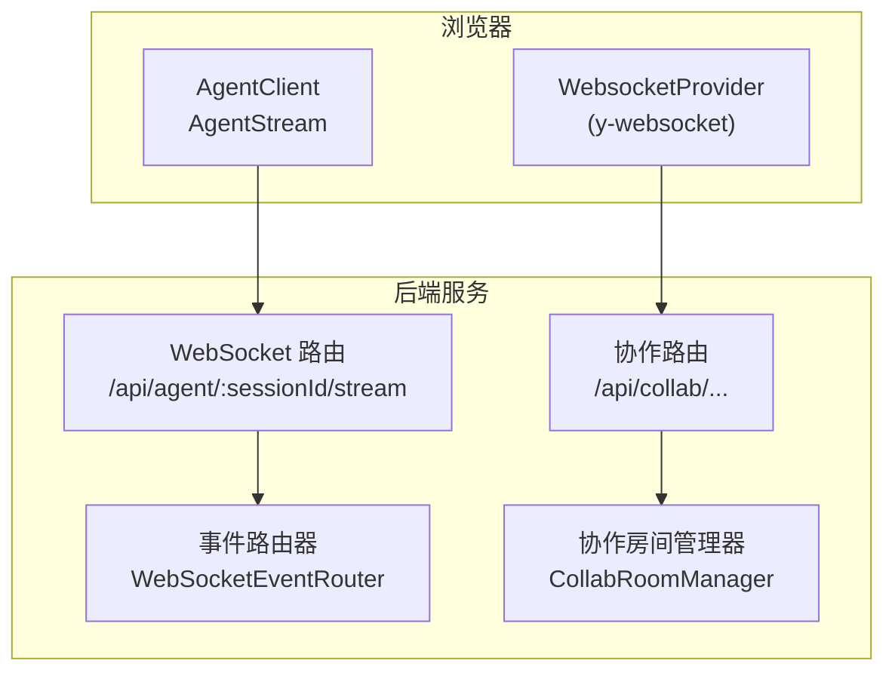
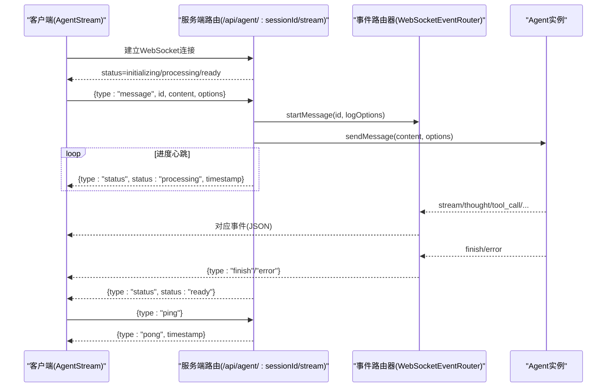
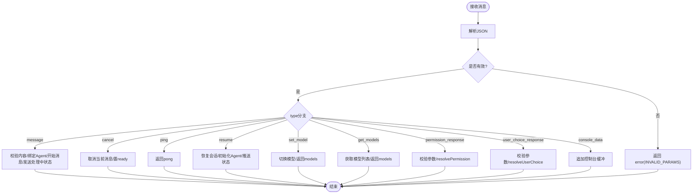
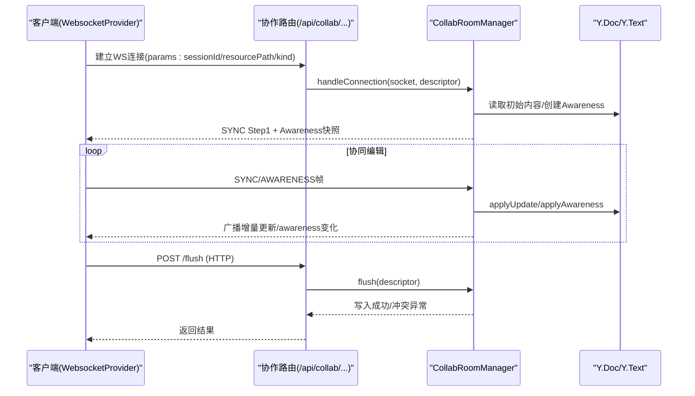
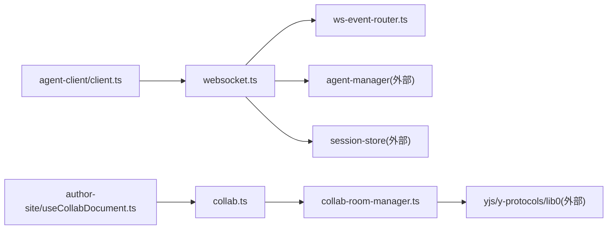

# WebSocket 实时通信

<cite>
**本文引用的文件**   
- [packages/agent-service/src/routes/websocket.ts](file://packages/agent-service/src/routes/websocket.ts)
- [packages/agent-service/src/routes/ws-event-router.ts](file://packages/agent-service/src/routes/ws-event-router.ts)
- [packages/agent-service/src/collab/collab-room-manager.ts](file://packages/agent-service/src/collab/collab-room-manager.ts)
- [packages/agent-service/src/routes/collab.ts](file://packages/agent-service/src/routes/collab.ts)
- [packages/agent-client/src/client.ts](file://packages/agent-client/src/client.ts)
- [packages/author-site/src/hooks/useCollabDocument.ts](file://packages/author-site/src/hooks/useCollabDocument.ts)
- [packages/author-site/src/components/ai-elements/chat/services/stream-service.ts](file://packages/author-site/src/components/ai-elements/chat/services/stream-service.ts)
</cite>

## 目录
1. [简介](#简介)
2. [项目结构](#项目结构)
3. [核心组件](#核心组件)
4. [架构总览](#架构总览)
5. [详细组件分析](#详细组件分析)
6. [依赖关系分析](#依赖关系分析)
7. [性能考虑](#性能考虑)
8. [故障排查指南](#故障排查指南)
9. [结论](#结论)
10. [附录](#附录)

## 简介
本文件为 Workbench 平台的 WebSocket 实时通信协议文档，覆盖两类通道：
- Agent 流式通道：用于 AI Agent 的流式输出、工具调用、权限与用户选择交互等。
- 协作通道：基于 Yjs 的实时协同编辑与会者感知（Awareness），支持工作区资源的多端同步与落盘。

文档包含连接建立流程、消息格式规范、事件机制、断线重连策略、客户端集成示例与性能优化建议。

## 项目结构
Workbench 的 WebSocket 能力由后端服务提供，前端通过两类客户端接入：
- Agent 流式客户端：AgentClient.stream() 返回 AgentStream，负责与 /api/agent/:sessionId/stream 建立连接并收发 JSON 消息。
- 协作客户端：使用 y-websocket 的 WebsocketProvider 与 /api/collab/projects/:projectId/workspaces/:workspaceId/:room 建立二进制协议连接，内部走 Yjs sync/awareness 协议。

图表来源
- [packages/agent-service/src/routes/websocket.ts:134-180](file://packages/agent-service/src/routes/websocket.ts#L134-L180)
- [packages/agent-service/src/routes/ws-event-router.ts:113-138](file://packages/agent-service/src/routes/ws-event-router.ts#L113-L138)
- [packages/agent-service/src/collab/collab-room-manager.ts:115-157](file://packages/agent-service/src/collab/collab-room-manager.ts#L115-L157)
- [packages/agent-service/src/routes/collab.ts:69-94](file://packages/agent-service/src/routes/collab.ts#L69-L94)
- [packages/agent-client/src/client.ts:200-203](file://packages/agent-client/src/client.ts#L200-L203)
- [packages/author-site/src/hooks/useCollabDocument.ts:173-185](file://packages/author-site/src/hooks/useCollabDocument.ts#L173-L185)

章节来源
- [packages/agent-service/src/routes/websocket.ts:134-180](file://packages/agent-service/src/routes/websocket.ts#L134-L180)
- [packages/agent-service/src/routes/collab.ts:69-94](file://packages/agent-service/src/routes/collab.ts#L69-L94)
- [packages/agent-client/src/client.ts:200-203](file://packages/agent-client/src/client.ts#L200-L203)
- [packages/author-site/src/hooks/useCollabDocument.ts:173-185](file://packages/author-site/src/hooks/useCollabDocument.ts#L173-L185)

## 核心组件
- Agent 服务端路由与心跳
  - 注册 /api/agent/:sessionId/stream，维护连接表、心跳检测、消息超时与进度心跳。
  - 解析客户端 JSON 指令（message、cancel、ping、resume、set_model、get_models、permission_response、user_choice_response、console_data）。
  - 将 Agent 事件转发到客户端（stream、thought、tool_call、tool_call_update、plan、error、status、finish、models、permission_request、user_choice_request）。
- 事件路由器
  - 绑定 Agent 事件源，按类型映射为统一的 ServerMessage 结构并通过 sendMessage 下发。
- 协作房间管理器
  - 管理 Y.Doc/Y.Text 与 Awareness，处理 Yjs sync/awareness 二进制帧，去抖持久化，冲突检测与回滚基线。
- 协作路由
  - 暴露 /api/collab/... 的 WebSocket 与 HTTP flush 接口，校验参数与权限，委派给 CollabRoomManager。
- 客户端
  - AgentStream：封装连接、自动重连、ping/pong、事件分发。
  - useCollabDocument：创建 WebsocketProvider，设置 presence，监听状态与同步事件，提供 flush 落盘。
  - StreamService：上层封装，统一等待连接、转发 console_data、保活心跳。

章节来源
- [packages/agent-service/src/routes/websocket.ts:134-180](file://packages/agent-service/src/routes/websocket.ts#L134-L180)
- [packages/agent-service/src/routes/ws-event-router.ts:113-138](file://packages/agent-service/src/routes/ws-event-router.ts#L113-L138)
- [packages/agent-service/src/collab/collab-room-manager.ts:115-157](file://packages/agent-service/src/collab/collab-room-manager.ts#L115-L157)
- [packages/agent-service/src/routes/collab.ts:69-94](file://packages/agent-service/src/routes/collab.ts#L69-L94)
- [packages/agent-client/src/client.ts:279-338](file://packages/agent-client/src/client.ts#L279-L338)
- [packages/author-site/src/hooks/useCollabDocument.ts:173-280](file://packages/author-site/src/hooks/useCollabDocument.ts#L173-L280)
- [packages/author-site/src/components/ai-elements/chat/services/stream-service.ts:185-228](file://packages/author-site/src/components/ai-elements/chat/services/stream-service.ts#L185-L228)

## 架构总览
下图展示 Agent 流式通道的完整请求-响应时序，包括连接、发送消息、进度心跳、完成或错误、以及模型切换与权限交互。

图表来源
- [packages/agent-service/src/routes/websocket.ts:134-180](file://packages/agent-service/src/routes/websocket.ts#L134-L180)
- [packages/agent-service/src/routes/websocket.ts:346-468](file://packages/agent-service/src/routes/websocket.ts#L346-L468)
- [packages/agent-service/src/routes/websocket.ts:715-721](file://packages/agent-service/src/routes/websocket.ts#L715-L721)
- [packages/agent-service/src/routes/ws-event-router.ts:197-321](file://packages/agent-service/src/routes/ws-event-router.ts#L197-L321)

## 详细组件分析

### Agent 流式通道（JSON）
- 连接建立
  - 客户端通过 AgentClient.stream(sessionId) 构造 wsUrl 并连接 /api/agent/:sessionId/stream。
  - 服务端记录连接、初始化事件路由器、启动心跳定时器。
- 握手与初始状态
  - 首次收到 message 时若 Agent 处于 initializing，会先启动 Agent 并推送 status=initializing；随后进入 processing，完成后回到 ready。
  - get_models/set_model 可查询/切换当前模型。
- 消息格式（客户端→服务端）
  - type: "message" | "cancel" | "ping" | "resume" | "set_model" | "get_models" | "permission_response" | "user_choice_response" | "console_data"
  - 关键字段：id、content、workingDir、projectId、demoId、model、images、files、systemPrompt、options.timeout/options.stream/options.resumeSessionId、permissionId/optionId/responseContent、requestId/choice、entries（console_data）。
- 消息格式（服务端→客户端）
  - type: "stream" | "thought" | "tool_call" | "tool_call_update" | "plan" | "error" | "finish" | "status" | "pong" | "permission_request" | "user_choice_request" | "models"
  - 字段包括 id、sessionId、content、done、error、files、metadata、toolCallId、title、kind、toolCallStatus、parameters、result、details、durationMs、timestamp、permissionRequest、userChoiceRequest、models、currentModelId、canSwitch。
- 心跳与保活
  - 服务端周期性检查 lastPing，超过 HEARTBEAT_TIMEOUT 则断开。
  - 客户端定期发送 ping，服务端回复 pong。
  - 长任务期间服务端每 MESSAGE_PROGRESS_HEARTBEAT_INTERVAL_MS 推送一次 status=processing 作为进度心跳。
- 超时与取消
  - 支持显式 timeout 上限，到达后返回 MESSAGE_TIMEOUT 错误并取消 Agent。
  - 客户端可发送 cancel 中断当前消息。
- 权限与用户选择
  - 服务端推送 permission_request/user_choice_request，客户端以 permission_response/user_choice_response 应答。

图表来源
- [packages/agent-service/src/routes/websocket.ts:182-206](file://packages/agent-service/src/routes/websocket.ts#L182-L206)
- [packages/agent-service/src/routes/websocket.ts:208-486](file://packages/agent-service/src/routes/websocket.ts#L208-L486)
- [packages/agent-service/src/routes/websocket.ts:715-797](file://packages/agent-service/src/routes/websocket.ts#L715-L797)

章节来源
- [packages/agent-service/src/routes/websocket.ts:134-180](file://packages/agent-service/src/routes/websocket.ts#L134-L180)
- [packages/agent-service/src/routes/websocket.ts:182-206](file://packages/agent-service/src/routes/websocket.ts#L182-L206)
- [packages/agent-service/src/routes/websocket.ts:208-486](file://packages/agent-service/src/routes/websocket.ts#L208-L486)
- [packages/agent-service/src/routes/websocket.ts:715-797](file://packages/agent-service/src/routes/websocket.ts#L715-L797)
- [packages/agent-service/src/routes/ws-event-router.ts:113-138](file://packages/agent-service/src/routes/ws-event-router.ts#L113-L138)
- [packages/agent-service/src/routes/ws-event-router.ts:197-321](file://packages/agent-service/src/routes/ws-event-router.ts#L197-L321)
- [packages/agent-client/src/client.ts:279-338](file://packages/agent-client/src/client.ts#L279-L338)
- [packages/agent-client/src/client.ts:340-408](file://packages/agent-client/src/client.ts#L340-L408)
- [packages/author-site/src/components/ai-elements/chat/services/stream-service.ts:185-228](file://packages/author-site/src/components/ai-elements/chat/services/stream-service.ts#L185-L228)
- [packages/author-site/src/components/ai-elements/chat/services/stream-service.ts:341-376](file://packages/author-site/src/components/ai-elements/chat/services/stream-service.ts#L341-L376)

### 协作通道（Yjs 二进制）
- 连接建立
  - 客户端通过 WebsocketProvider 连接 /api/collab/projects/:projectId/workspaces/:workspaceId/:room，并在 params 中携带 sessionId/resourcePath/kind。
  - 服务端校验参数与会话权限，分配或复用房间，发送 Yjs Sync Step1 与当前 Awareness 快照。
- 协议与消息
  - 二进制帧类型：SYNC(0)、AWARENESS(1)、QUERY_AWARENESS(3)。
  - 客户端与服务端通过 Yjs syncProtocol 交换增量更新；Awareness 广播多端光标/选区/活跃页等信息。
- 数据一致性
  - 每次 update 触发去抖保存；flush 时对比 baselineHash 与期望版本，发生外部变更则拒绝并抛出 WORKSPACE_RESOURCE_CONFLICT。
  - 当外部提交成功且房间未脏，服务器主动 reloadRoomFromFileState 拉齐 Y.Doc 基线。
- 清理与限流
  - 空闲房间在 TTL 到期后 flush 并销毁；同一 workspace 限制最大连接数，超限关闭新连接。

图表来源
- [packages/agent-service/src/routes/collab.ts:69-94](file://packages/agent-service/src/routes/collab.ts#L69-L94)
- [packages/agent-service/src/collab/collab-room-manager.ts:115-157](file://packages/agent-service/src/collab/collab-room-manager.ts#L115-L157)
- [packages/agent-service/src/collab/collab-room-manager.ts:237-318](file://packages/agent-service/src/collab/collab-room-manager.ts#L237-L318)
- [packages/agent-service/src/collab/collab-room-manager.ts:369-422](file://packages/agent-service/src/collab/collab-room-manager.ts#L369-L422)
- [packages/agent-service/src/collab/collab-room-manager.ts:424-450](file://packages/agent-service/src/collab/collab-room-manager.ts#L424-L450)

章节来源
- [packages/agent-service/src/routes/collab.ts:69-142](file://packages/agent-service/src/routes/collab.ts#L69-L142)
- [packages/agent-service/src/collab/collab-room-manager.ts:115-157](file://packages/agent-service/src/collab/collab-room-manager.ts#L115-L157)
- [packages/agent-service/src/collab/collab-room-manager.ts:237-318](file://packages/agent-service/src/collab/collab-room-manager.ts#L237-L318)
- [packages/agent-service/src/collab/collab-room-manager.ts:369-422](file://packages/agent-service/src/collab/collab-room-manager.ts#L369-L422)
- [packages/agent-service/src/collab/collab-room-manager.ts:424-450](file://packages/agent-service/src/collab/collab-room-manager.ts#L424-L450)
- [packages/author-site/src/hooks/useCollabDocument.ts:173-280](file://packages/author-site/src/hooks/useCollabDocument.ts#L173-L280)

### 断线重连与一致性保证
- Agent 通道
  - 客户端内置指数退避重连，最多尝试固定次数；连接成功后重置计数。
  - 服务端心跳检测：超过阈值自动断开，客户端感知后触发重连。
  - 长任务进度心跳确保“假死”场景下仍可感知。
- 协作通道
  - y-websocket 自带重连；服务端在连接重建后发送 Sync Step1 与 Awareness 快照，客户端增量合并至本地 Y.Doc。
  - 落盘冲突通过 WORKSPACE_RESOURCE_CONFLICT 提示，客户端应刷新 UI 或提示用户。

章节来源
- [packages/agent-client/src/client.ts:294-338](file://packages/agent-client/src/client.ts#L294-L338)
- [packages/agent-service/src/routes/websocket.ts:122-132](file://packages/agent-service/src/routes/websocket.ts#L122-L132)
- [packages/agent-service/src/collab/collab-room-manager.ts:115-157](file://packages/agent-service/src/collab/collab-room-manager.ts#L115-L157)
- [packages/agent-service/src/collab/collab-room-manager.ts:369-422](file://packages/agent-service/src/collab/collab-room-manager.ts#L369-L422)

### 客户端集成示例要点
- Agent 通道
  - 连接管理：使用 AgentClient.stream(sessionId)，监听 status 事件判断 connected/disconnected。
  - 发送消息：send(content, id, options)，支持 images/files/systemPrompt/options.timeout 等。
  - 事件监听：on("stream"/"thought"/"tool_call"/"tool_call_update"/"plan"/"error"/"finish"/"status"/"permission_request"/"user_choice_request"/"models")。
  - 错误处理：捕获 PARSE_ERROR/CONNECTION_ERROR/NOT_CONNECTED，结合 status 事件恢复。
  - 保活：定时 ping()，或使用 StreamService.startKeepalive()。
- 协作通道
  - 使用 useCollabDocument(descriptor, user) 创建 WebsocketProvider，设置 awareness.presence。
  - 监听 provider.on("status"/"sync"/"connection-error") 更新 UI 状态。
  - 手动落盘：调用 flush() 触发 /api/collab/.../flush。

章节来源
- [packages/agent-client/src/client.ts:200-203](file://packages/agent-client/src/client.ts#L200-L203)
- [packages/agent-client/src/client.ts:279-338](file://packages/agent-client/src/client.ts#L279-L338)
- [packages/agent-client/src/client.ts:340-408](file://packages/agent-client/src/client.ts#L340-L408)
- [packages/author-site/src/components/ai-elements/chat/services/stream-service.ts:185-228](file://packages/author-site/src/components/ai-elements/chat/services/stream-service.ts#L185-L228)
- [packages/author-site/src/components/ai-elements/chat/services/stream-service.ts:341-376](file://packages/author-site/src/components/ai-elements/chat/services/stream-service.ts#L341-L376)
- [packages/author-site/src/hooks/useCollabDocument.ts:173-280](file://packages/author-site/src/hooks/useCollabDocument.ts#L173-L280)
- [packages/author-site/src/hooks/useCollabDocument.ts:282-303](file://packages/author-site/src/hooks/useCollabDocument.ts#L282-L303)

## 依赖关系分析
- 模块耦合
  - websocket.ts 依赖 ws-event-router.ts 进行事件转发，依赖 agent-manager 与 session-store 等。
  - collab.ts 仅依赖 collab-room-manager.ts 与权限错误类型。
  - 客户端侧，AgentStream 独立于业务层；useCollabDocument 依赖 y-websocket 与共享类型。
- 外部依赖
  - Yjs/y-protocols/lib0：协作通道二进制协议实现。
  - ws：Node.js WebSocket 实现。
  - Fastify：HTTP/WebSocket 路由与中间件。

图表来源
- [packages/agent-service/src/routes/websocket.ts:134-180](file://packages/agent-service/src/routes/websocket.ts#L134-L180)
- [packages/agent-service/src/routes/ws-event-router.ts:113-138](file://packages/agent-service/src/routes/ws-event-router.ts#L113-L138)
- [packages/agent-service/src/routes/collab.ts:69-94](file://packages/agent-service/src/routes/collab.ts#L69-L94)
- [packages/agent-service/src/collab/collab-room-manager.ts:115-157](file://packages/agent-service/src/collab/collab-room-manager.ts#L115-L157)
- [packages/agent-client/src/client.ts:200-203](file://packages/agent-client/src/client.ts#L200-L203)
- [packages/author-site/src/hooks/useCollabDocument.ts:173-185](file://packages/author-site/src/hooks/useCollabDocument.ts#L173-L185)

章节来源
- [packages/agent-service/src/routes/websocket.ts:134-180](file://packages/agent-service/src/routes/websocket.ts#L134-L180)
- [packages/agent-service/src/routes/collab.ts:69-94](file://packages/agent-service/src/routes/collab.ts#L69-L94)
- [packages/agent-service/src/collab/collab-room-manager.ts:115-157](file://packages/agent-service/src/collab/collab-room-manager.ts#L115-L157)
- [packages/agent-client/src/client.ts:200-203](file://packages/agent-client/src/client.ts#L200-L203)
- [packages/author-site/src/hooks/useCollabDocument.ts:173-185](file://packages/author-site/src/hooks/useCollabDocument.ts#L173-L185)

## 性能考虑
- 消息批处理
  - 协作通道：update 去抖保存（默认约 1s），避免频繁磁盘 I/O。
  - Agent 通道：长任务期间每 25s 推送一次 status=processing 作为进度心跳，降低 UI 抖动。
- 心跳检测
  - 服务端 30s 周期检查，60s 超时断开；客户端定时 ping 保持活跃。
- 内存管理
  - 协作房间空闲 TTL 到期后 flush 并销毁 Y.Doc/Awareness，释放内存。
  - 单 workspace 最大连接数限制，防止过多连接导致资源耗尽。
- 传输优化
  - 协作通道采用 Yjs 二进制增量同步，仅传输差异。
  - 大文件/图片通过附件字段传递，避免在文本流中膨胀。

[本节为通用指导，不直接分析具体文件]

## 故障排查指南
- 连接失败
  - 检查 URL 与鉴权头；Agent 通道需正确 sessionId；协作通道需正确的 projectId/workspaceId/resourcePath/kind。
  - 关注 status 事件与 connection-error 事件，必要时重试或降级。
- 消息解析错误
  - 服务端对无效 JSON 返回 INVALID_PARAMS；客户端需捕获 PARSE_ERROR 并上报。
- 超时与卡死
  - 显式 timeout 达到后返回 MESSAGE_TIMEOUT；确认客户端是否正确处理并提示重试。
  - 若无进度心跳，检查服务端 progress heartbeat 是否被取消。
- 协作冲突
  - flush 返回 WORKSPACE_RESOURCE_CONFLICT 表示外部已修改；客户端应拉取最新基线并合并或提示用户。
- 心跳异常
  - 长时间无 pong 或服务端主动断开，检查网络与代理配置。

章节来源
- [packages/agent-service/src/routes/websocket.ts:182-206](file://packages/agent-service/src/routes/websocket.ts#L182-L206)
- [packages/agent-service/src/routes/websocket.ts:346-468](file://packages/agent-service/src/routes/websocket.ts#L346-L468)
- [packages/agent-service/src/collab/collab-room-manager.ts:369-422](file://packages/agent-service/src/collab/collab-room-manager.ts#L369-L422)
- [packages/author-site/src/hooks/useCollabDocument.ts:264-270](file://packages/author-site/src/hooks/useCollabDocument.ts#L264-L270)

## 结论
Workbench 的 WebSocket 体系围绕两条通道构建：面向 Agent 的 JSON 流式通道与基于 Yjs 的二进制协作通道。前者强调事件驱动与可控的超时/取消/权限交互；后者强调强一致性与低开销增量同步。通过心跳、去抖、TTL 清理与冲突检测，系统在可用性与一致性之间取得平衡。客户端应遵循状态机与错误码，配合重连与保活策略，以获得稳定体验。

[本节为总结性内容，不直接分析具体文件]

## 附录

### 事件与消息速查
- Agent 通道（客户端→服务端）
  - message：发送内容，支持 workingDir/projectId/demoId/model/images/files/systemPrompt/options。
  - cancel：取消当前消息。
  - ping：心跳探测。
  - resume：恢复历史会话。
  - set_model/get_models：模型管理与查询。
  - permission_response：权限确认。
  - user_choice_response：需求选择。
  - console_data：控制台日志批量上报。
- Agent 通道（服务端→客户端）
  - stream/thought/tool_call/tool_call_update/plan/error/finish/status：运行态事件。
  - models：模型信息。
  - permission_request/user_choice_request：需要客户端交互的事件。
  - pong：心跳响应。
- 协作通道
  - SYNC/AWARENESS/QUERY_AWARENESS：Yjs 协议帧。
  - flush：HTTP 接口触发落盘。

章节来源
- [packages/agent-service/src/routes/websocket.ts:39-67](file://packages/agent-service/src/routes/websocket.ts#L39-L67)
- [packages/agent-service/src/routes/ws-event-router.ts:22-104](file://packages/agent-service/src/routes/ws-event-router.ts#L22-L104)
- [packages/agent-service/src/collab/collab-room-manager.ts:15-18](file://packages/agent-service/src/collab/collab-room-manager.ts#L15-L18)
- [packages/agent-service/src/routes/collab.ts:96-141](file://packages/agent-service/src/routes/collab.ts#L96-L141)