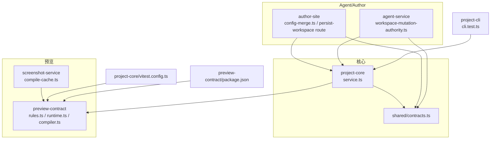
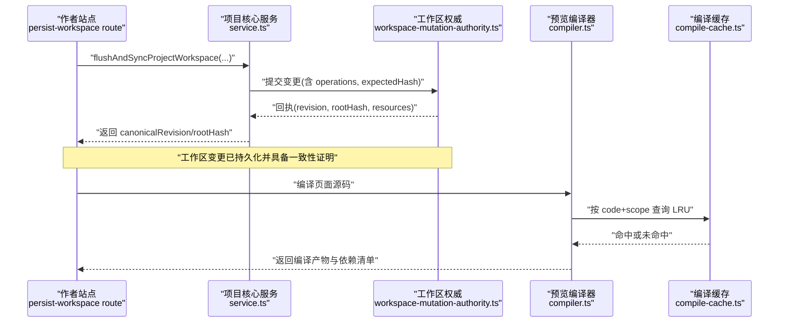
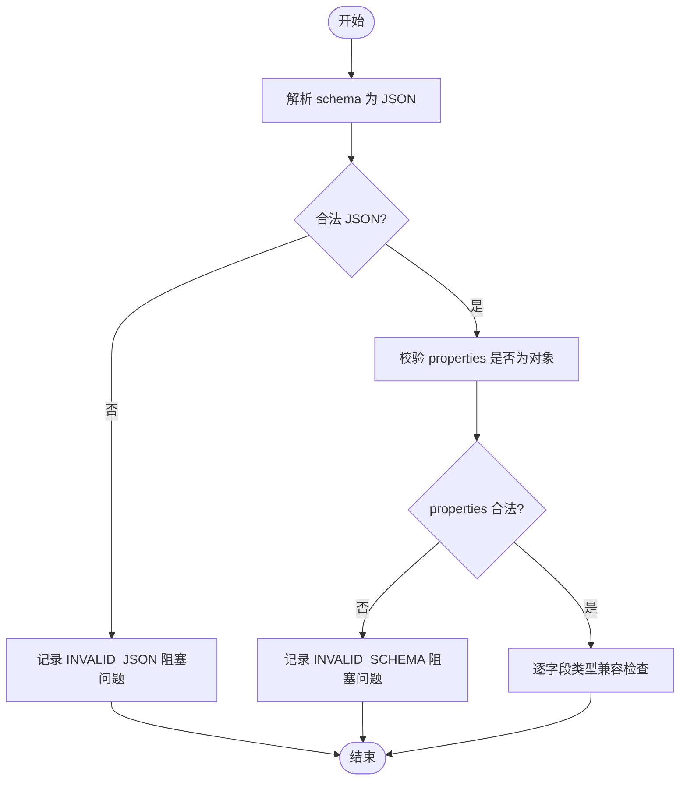
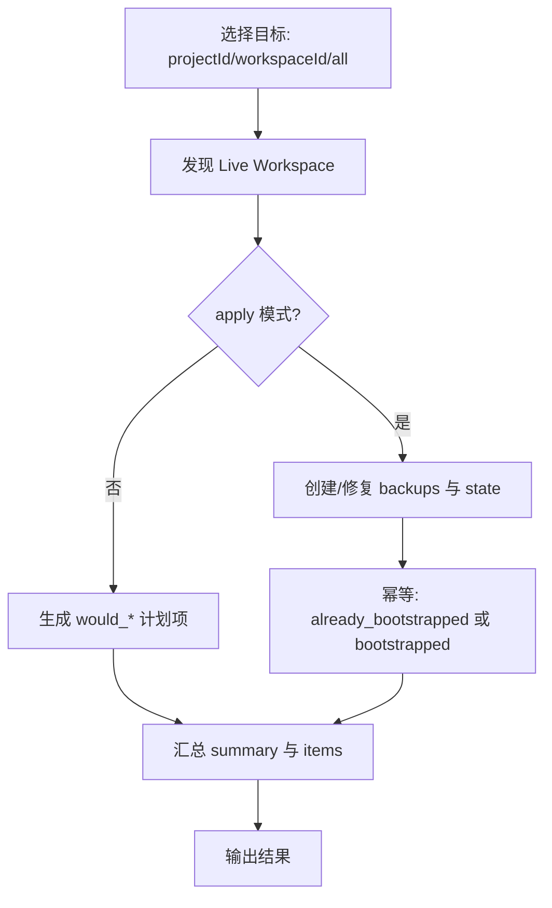
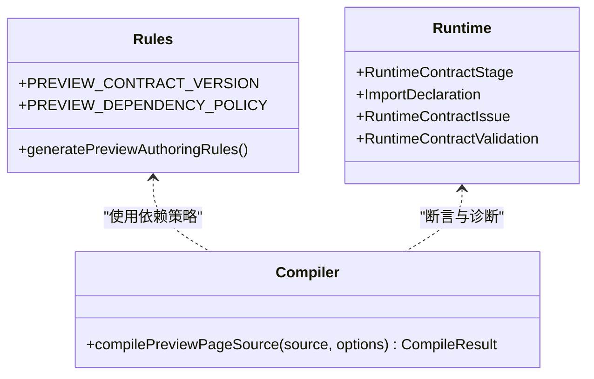
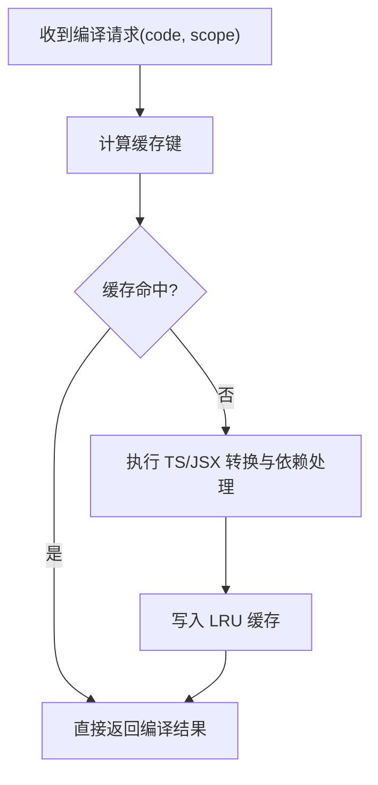
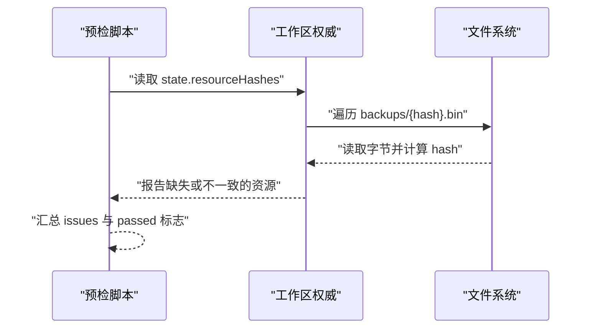
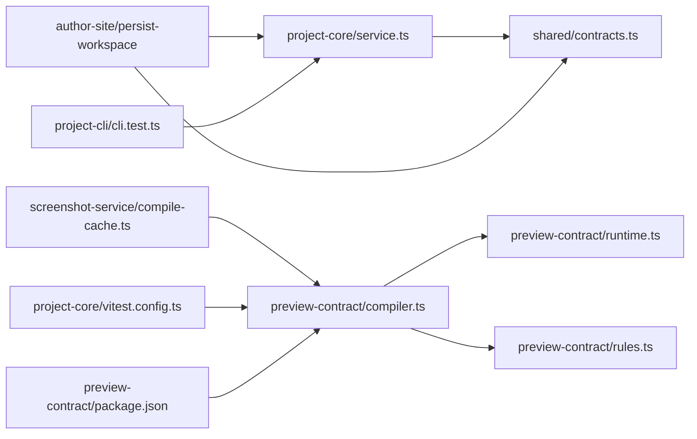

# 数据序列化与版本管理

<cite>
**本文引用的文件**   
- [packages/project-core/src/service.ts](file://packages/project-core/src/service.ts)
- [packages/author-site/src/lib/config-merge.ts](file://packages/author-site/src/lib/config-merge.ts)
- [packages/agent-service/src/backends/pi-tools/schema-tool.ts](file://packages/agent-service/src/backends/pi-tools/schema-tool.ts)
- [packages/preview-contract/src/rules.ts](file://packages/preview-contract/src/rules.ts)
- [packages/preview-contract/src/runtime.ts](file://packages/preview-contract/src/runtime.ts)
- [packages/preview-contract/src/compiler.ts](file://packages/preview-contract/src/compiler.ts)
- [packages/shared/src/contracts.ts](file://packages/shared/src/contracts.ts)
- [packages/agent-service/src/workspace/workspace-mutation-authority.ts](file://packages/agent-service/src/workspace/workspace-mutation-authority.ts)
- [scripts/check-workspace-deploy-preflight.mjs](file://scripts/check-workspace-deploy-preflight.mjs)
- [packages/screenshot-service/src/utils/compile-cache.ts](file://packages/screenshot-service/src/utils/compile-cache.ts)
- [packages/project-cli/src/cli.test.ts](file://packages/project-cli/src/cli.test.ts)
- [packages/project-core/src/types.ts](file://packages/project-core/src/types.ts)
- [packages/project-core/vitest.config.ts](file://packages/project-core/vitest.config.ts)
- [packages/preview-contract/package.json](file://packages/preview-contract/package.json)
- [packages/agent-service/src/collab/workspace-file-persistence.ts](file://packages/agent-service/src/collab/workspace-file-persistence.ts)
- [packages/author-site/src/app/api/sessions/[sessionId]/persist-workspace/route.ts](file://packages/author-site/src/app/api/sessions/[sessionId]/persist-workspace/route.ts)
- [packages/project-core/src/workspace-resource-registry.ts](file://packages/project-core/src/workspace-resource-registry.ts)
</cite>

## 目录
1. [简介](#简介)
2. [项目结构](#项目结构)
3. [核心组件](#核心组件)
4. [架构总览](#架构总览)
5. [详细组件分析](#详细组件分析)
6. [依赖关系分析](#依赖关系分析)
7. [性能考虑](#性能考虑)
8. [故障排查指南](#故障排查指南)
9. [结论](#结论)
10. [附录：数据格式示例](#附录数据格式示例)

## 简介
本文件面向 Workbench 平台的数据序列化与版本管理，覆盖以下关键主题：
- JSON Schema 验证机制：数据类型定义、字段约束与业务规则校验。
- 数据迁移策略：向后兼容、版本升级流程与数据结构演进。
- 预览运行时契约：组件接口、配置格式与渲染协议。
- 数据压缩与传输优化：请求体压缩、响应缓存与增量更新。
- 数据完整性检查：校验和验证、损坏数据恢复与备份策略。
- 数据格式示例：项目配置、工作区状态与会话数据的序列化格式。

## 项目结构
Workbench 在多个包中协作完成数据序列化、校验、版本管理与预览运行：
- project-core：资源版本化、内容图、持久化路径与元数据写入。
- shared/contracts：工作区变更契约、错误码与受管资源路径规范。
- preview-contract：预览运行时契约、依赖策略与编译转换。
- agent-service：工作区权威（Authority）与提交回执、备份与一致性校验。
- author-site：配置合并与类型兼容性检查、会话持久化 API。
- screenshot-service：编译缓存与 LRU 淘汰。
- project-cli：脚手架版本升级与差异对比。

图表来源
- [packages/project-core/src/service.ts:4785-4840](file://packages/project-core/src/service.ts#L4785-L4840)
- [packages/shared/src/contracts.ts:177-202](file://packages/shared/src/contracts.ts#L177-L202)
- [packages/preview-contract/src/rules.ts:1-37](file://packages/preview-contract/src/rules.ts#L1-L37)
- [packages/preview-contract/src/runtime.ts:1-57](file://packages/preview-contract/src/runtime.ts#L1-L57)
- [packages/preview-contract/src/compiler.ts:1-62](file://packages/preview-contract/src/compiler.ts#L1-L62)
- [packages/screenshot-service/src/utils/compile-cache.ts:1-69](file://packages/screenshot-service/src/utils/compile-cache.ts#L1-L69)
- [packages/agent-service/src/workspace/workspace-mutation-authority.ts:1005-1028](file://packages/agent-service/src/workspace/workspace-mutation-authority.ts#L1005-L1028)
- [packages/author-site/src/lib/config-merge.ts:102-132](file://packages/author-site/src/lib/config-merge.ts#L102-L132)
- [packages/author-site/src/app/api/sessions/[sessionId]/persist-workspace/route.ts:49-79](file://packages/author-site/src/app/api/sessions/[sessionId]/persist-workspace/route.ts#L49-L79)
- [packages/project-cli/src/cli.test.ts:132-153](file://packages/project-cli/src/cli.test.ts#L132-L153)
- [packages/project-core/vitest.config.ts:1-12](file://packages/project-core/vitest.config.ts#L1-L12)
- [packages/preview-contract/package.json:1-27](file://packages/preview-contract/package.json#L1-L27)

章节来源
- [packages/project-core/src/service.ts:4785-4840](file://packages/project-core/src/service.ts#L4785-L4840)
- [packages/shared/src/contracts.ts:177-202](file://packages/shared/src/contracts.ts#L177-L202)

## 核心组件
- 资源版本与内容图
  - 资源版本对象包含 contentHash、blobRefs、metadata、runtime（schemaVersion、materializerVersion、migrationStatus）、时间戳与来源信息，用于可追溯的版本化存储与回放。
- 工作区变更契约
  - 统一描述操作类型（文本/二进制/删除/移动）、期望哈希、提交回执与事件流，确保多端一致性与幂等性。
- 预览运行时契约
  - 声明依赖策略、运行时阶段、导入限制与编译产物断言，保障高保真页面在预览环境中的稳定执行。
- 配置合并与类型兼容
  - 基于 schema 的 properties 与 type 进行值兼容判断，避免不兼容类型污染用户配置。
- 工作区权威与备份
  - 通过 committed backups 与 rootHash/resourceHashes 保证工作区一致性，支持修复与恢复。

章节来源
- [packages/project-core/src/service.ts:5138-5294](file://packages/project-core/src/service.ts#L5138-L5294)
- [packages/shared/src/contracts.ts:104-175](file://packages/shared/src/contracts.ts#L104-L175)
- [packages/preview-contract/src/rules.ts:1-37](file://packages/preview-contract/src/rules.ts#L1-L37)
- [packages/preview-contract/src/runtime.ts:1-57](file://packages/preview-contract/src/runtime.ts#L1-L57)
- [packages/author-site/src/lib/config-merge.ts:102-132](file://packages/author-site/src/lib/config-merge.ts#L102-L132)
- [packages/agent-service/src/workspace/workspace-mutation-authority.ts:1005-1028](file://packages/agent-service/src/workspace/workspace-mutation-authority.ts#L1005-L1028)

## 架构总览
下图展示从“创作端保存”到“工作区权威落盘”，再到“预览编译与缓存”的关键链路。

图表来源
- [packages/author-site/src/app/api/sessions/[sessionId]/persist-workspace/route.ts:49-79](file://packages/author-site/src/app/api/sessions/[sessionId]/persist-workspace/route.ts#L49-L79)
- [packages/project-core/src/service.ts:4785-4840](file://packages/project-core/src/service.ts#L4785-L4840)
- [packages/agent-service/src/workspace/workspace-mutation-authority.ts:1005-1028](file://packages/agent-service/src/workspace/workspace-mutation-authority.ts#L1005-L1028)
- [packages/preview-contract/src/compiler.ts:1-62](file://packages/preview-contract/src/compiler.ts#L1-L62)
- [packages/screenshot-service/src/utils/compile-cache.ts:1-69](file://packages/screenshot-service/src/utils/compile-cache.ts#L1-L69)

## 详细组件分析

### JSON Schema 验证机制
- 解析与基础校验
  - 对 schema 字符串进行 JSON 解析，校验 properties 是否为对象；非法 JSON 或非法结构会记录阻塞级问题。
- 类型兼容判断
  - 根据 schema 的 type 字段（string/number/integer/boolean/array/object）判断现有值是否兼容，未知类型默认兼容。
- 工具侧校验
  - 提供 schemaValidate 工具，校验 JSON Schema 基本结构，提示缺失常见字段（type/$schema/properties）。
- 工作区资源文本校验
  - 针对 workspace-tree、sketch-scene 等特定资源进行结构化校验，拒绝非法内容。

图表来源
- [packages/project-core/src/service.ts:6253-6292](file://packages/project-core/src/service.ts#L6253-L6292)
- [packages/author-site/src/lib/config-merge.ts:102-132](file://packages/author-site/src/lib/config-merge.ts#L102-L132)
- [packages/agent-service/src/backends/pi-tools/schema-tool.ts:11-44](file://packages/agent-service/src/backends/pi-tools/schema-tool.ts#L11-L44)
- [packages/project-core/src/workspace-resource-registry.ts:114-140](file://packages/project-core/src/workspace-resource-registry.ts#L114-L140)

章节来源
- [packages/project-core/src/service.ts:6253-6292](file://packages/project-core/src/service.ts#L6253-L6292)
- [packages/author-site/src/lib/config-merge.ts:102-132](file://packages/author-site/src/lib/config-merge.ts#L102-L132)
- [packages/agent-service/src/backends/pi-tools/schema-tool.ts:11-44](file://packages/agent-service/src/backends/pi-tools/schema-tool.ts#L11-L44)
- [packages/project-core/src/workspace-resource-registry.ts:114-140](file://packages/project-core/src/workspace-resource-registry.ts#L114-L140)

### 数据迁移策略
- 工作区权限迁移
  - 支持 dry-run 与 apply 模式，幂等建立 state 与 committed backup，统计 matched/changed/blocked。
- 部署预检与一致性校验
  - 校验 committed backups 是否存在且 hash 匹配，报告缺失资源与根哈希不一致问题。
- 脚手架版本升级
  - 检测 scaffoldVersion 与脚本差异，执行 upgrade 后输出当前版本与变更文件列表。

图表来源
- [packages/agent-service/src/workspace/workspace-authority-migration.ts:1-81](file://packages/agent-service/src/workspace/workspace-authority-migration.ts#L1-81)
- [scripts/check-workspace-deploy-preflight.mjs:141-164](file://scripts/check-workspace-deploy-preflight.mjs#L141-L164)
- [packages/project-cli/src/cli.test.ts:132-153](file://packages/project-cli/src/cli.test.ts#L132-L153)

章节来源
- [packages/agent-service/src/workspace/workspace-authority-migration.ts:1-81](file://packages/agent-service/src/workspace/workspace-authority-migration.ts#L1-81)
- [scripts/check-workspace-deploy-preflight.mjs:141-164](file://scripts/check-workspace-deploy-preflight.mjs#L141-L164)
- [packages/project-cli/src/cli.test.ts:132-153](file://packages/project-cli/src/cli.test.ts#L132-L153)

### 预览运行时契约
- 依赖策略与版本锁定
  - 通过 PREVIEW_DEPENDENCY_POLICY 固定 react、react-dom、lucide-react、framer-motion、svgaplayerweb 与 @preview/sdk 的版本与种类。
- 运行时阶段与诊断
  - 定义 source_contract、dependency_import、component_export、render_contract、schema_contract、compile_transform、module_parse 等阶段及对应错误码。
- 编译转换与产物断言
  - 包裹源码、TS/JSX 转换、提取依赖、重写 import、断言编译产物符合约定。

图表来源
- [packages/preview-contract/src/rules.ts:1-37](file://packages/preview-contract/src/rules.ts#L1-L37)
- [packages/preview-contract/src/runtime.ts:1-57](file://packages/preview-contract/src/runtime.ts#L1-L57)
- [packages/preview-contract/src/compiler.ts:1-62](file://packages/preview-contract/src/compiler.ts#L1-L62)

章节来源
- [packages/preview-contract/src/rules.ts:1-37](file://packages/preview-contract/src/rules.ts#L1-L37)
- [packages/preview-contract/src/runtime.ts:1-57](file://packages/preview-contract/src/runtime.ts#L1-L57)
- [packages/preview-contract/src/compiler.ts:1-62](file://packages/preview-contract/src/compiler.ts#L1-L62)
- [packages/preview-contract/package.json:1-27](file://packages/preview-contract/package.json#L1-L27)

### 数据压缩与传输优化
- 编译缓存
  - 以 code 与 cacheScope 计算键，LRU 淘汰，减少重复编译与 HTML 拼装开销。
- 截图服务优化要点
  - 同 hash 合并、浏览器复用、队列限流、fullPage renderBox、资源预热与指标上报。
- 增量更新
  - 工作区变更通过 revision 与 resourceHashes 实现增量同步与冲突检测。

图表来源
- [packages/screenshot-service/src/utils/compile-cache.ts:1-69](file://packages/screenshot-service/src/utils/compile-cache.ts#L1-L69)
- [packages/preview-contract/src/compiler.ts:1-62](file://packages/preview-contract/src/compiler.ts#L1-L62)

章节来源
- [packages/screenshot-service/src/utils/compile-cache.ts:1-69](file://packages/screenshot-service/src/utils/compile-cache.ts#L1-L69)
- [packages/preview-contract/src/compiler.ts:1-62](file://packages/preview-contract/src/compiler.ts#L1-L62)

### 数据完整性检查与备份恢复
- 提交回执与资源指纹
  - 每次提交返回 revision、rootHash 与资源变更明细，便于客户端增量拉取与一致性校验。
- Committed Backups 校验
  - 读取 backups 目录下的 .bin 文件，比对 hash 与 expectedHash，缺失或不匹配则报错。
- 预检与修复
  - 部署前扫描 missing backups，统计 missingBackupCount，必要时触发 reconcileRestore 恢复。

图表来源
- [scripts/check-workspace-deploy-preflight.mjs:141-164](file://scripts/check-workspace-deploy-preflight.mjs#L141-L164)
- [packages/agent-service/src/workspace/workspace-mutation-authority.ts:1005-1028](file://packages/agent-service/src/workspace/workspace-mutation-authority.ts#L1005-L1028)

章节来源
- [scripts/check-workspace-deploy-preflight.mjs:141-164](file://scripts/check-workspace-deploy-preflight.mjs#L141-L164)
- [packages/agent-service/src/workspace/workspace-mutation-authority.ts:1005-1028](file://packages/agent-service/src/workspace/workspace-mutation-authority.ts#L1005-L1028)

## 依赖关系分析
- 模块耦合
  - project-core 依赖 shared/contracts 与工作区权威；author-site 调用 core 与服务端 API；preview-contract 被 compiler 与 runtime 共同消费。
- 外部依赖
  - preview-contract 依赖 sucrase、typescript、lucide-react 等，并通过 package.json 暴露入口与导出。
- 别名与测试配置
  - vitest.config.ts 将 @workbench/preview-contract 指向源码目录，便于本地联调与单测。

图表来源
- [packages/project-core/src/service.ts:4785-4840](file://packages/project-core/src/service.ts#L4785-L4840)
- [packages/shared/src/contracts.ts:177-202](file://packages/shared/src/contracts.ts#L177-L202)
- [packages/author-site/src/app/api/sessions/[sessionId]/persist-workspace/route.ts:49-79](file://packages/author-site/src/app/api/sessions/[sessionId]/persist-workspace/route.ts#L49-L79)
- [packages/preview-contract/src/compiler.ts:1-62](file://packages/preview-contract/src/compiler.ts#L1-L62)
- [packages/preview-contract/src/runtime.ts:1-57](file://packages/preview-contract/src/runtime.ts#L1-L57)
- [packages/preview-contract/src/rules.ts:1-37](file://packages/preview-contract/src/rules.ts#L1-L37)
- [packages/screenshot-service/src/utils/compile-cache.ts:1-69](file://packages/screenshot-service/src/utils/compile-cache.ts#L1-L69)
- [packages/project-cli/src/cli.test.ts:132-153](file://packages/project-cli/src/cli.test.ts#L132-L153)
- [packages/project-core/vitest.config.ts:1-12](file://packages/project-core/vitest.config.ts#L1-L12)
- [packages/preview-contract/package.json:1-27](file://packages/preview-contract/package.json#L1-L27)

章节来源
- [packages/project-core/vitest.config.ts:1-12](file://packages/project-core/vitest.config.ts#L1-L12)
- [packages/preview-contract/package.json:1-27](file://packages/preview-contract/package.json#L1-L27)

## 性能考虑
- 编译缓存命中率
  - 建议监控 LRU 命中率与淘汰率，结合 session scope 与 baseOrigin 细化缓存键，避免误命中。
- 并发与队列
  - 截图服务采用 BrowserPool 并发控制与优先级队列，关注 queueWaitMs 与 priorityStats 指标。
- 增量同步
  - 利用 revision 与 resourceHashes 做增量拉取，减少全量传输与渲染抖动。
- 资源预热
  - 提前收集图片 URL 并预热，缩短首次渲染等待时间。

[本节为通用指导，无需代码来源]

## 故障排查指南
- 工作区权威相关错误
  - WORKSPACE_AUTHORITY_BACKUP_MISSING：committed backup 缺失或 hash 不匹配，需修复 backups 目录。
  - WORKSPACE_EXTERNAL_DRIFT：外部修改导致漂移，应 reconcileRestore 恢复。
  - WORKSPACE_RESOURCE_CONFLICT：资源冲突，检查 expectedHash 与当前内容。
- 预检失败
  - committed backups incomplete：列出缺失资源路径，逐一补齐或重新 bootstrap。
- 配置合并异常
  - 类型不兼容：检查 schema.type 与现有值类型，必要时回退或提示用户修正。

章节来源
- [packages/shared/src/contracts.ts:20-58](file://packages/shared/src/contracts.ts#L20-L58)
- [scripts/check-workspace-deploy-preflight.mjs:141-164](file://scripts/check-workspace-deploy-preflight.mjs#L141-L164)
- [packages/author-site/src/lib/config-merge.ts:102-132](file://packages/author-site/src/lib/config-merge.ts#L102-L132)

## 结论
Workbench 通过统一的契约与版本化设计，实现了：
- 强一致的序列化与校验（JSON Schema + 资源结构校验）。
- 可追溯的资源版本与内容图（contentHash、blobRefs、runtime 元数据）。
- 稳定的预览运行时契约（依赖策略、编译转换与产物断言）。
- 健壮的备份与恢复机制（committed backups、rootHash/resourceHashes）。
- 高效的编译缓存与增量同步（LRU、revision、resourceHashes）。

这些能力共同保障了平台在生产环境中的数据可靠性与可扩展性。

[本节为总结，无需代码来源]

## 附录：数据格式示例
以下为各关键实体的字段说明与用途，便于理解序列化结构与演进方向。

- 资源版本（ResourceVersion）
  - 关键字段：contentHash、blobRefs、metadata、runtime.schemaVersion、runtime.materializerVersion、runtime.migrationStatus、createdAt、createdBy、source、note。
  - 用途：唯一标识资源快照，关联 blob 与元数据，记录运行时版本与迁移状态。
  - 参考路径：[packages/project-core/src/service.ts:5138-5294](file://packages/project-core/src/service.ts#L5138-L5294)

- 工作区变更请求与回执（WorkspaceMutationRequest/Receipt）
  - 关键字段：mutationId、projectId、workspaceId、baseRevision、actor、reason、operations[]、revision、rootHash、resources[].path/action/beforeHash/afterHash、committedAt。
  - 用途：描述一次原子变更及其影响范围，回执作为持久化证明。
  - 参考路径：[packages/shared/src/contracts.ts:104-131](file://packages/shared/src/contracts.ts#L104-L131)

- 预览依赖策略（PREVIEW_DEPENDENCY_POLICY）
  - 关键字段：package name -> { version, kind }。
  - 用途：锁定预览运行时可用依赖与版本，防止漂移。
  - 参考路径：[packages/preview-contract/src/rules.ts:10-17](file://packages/preview-contract/src/rules.ts#L10-L17)

- 编译结果（CompileResult）
  - 关键字段：compiledCode、dependencies、cssImports、moduleHash。
  - 用途：供预览运行时加载与缓存。
  - 参考路径：[packages/preview-contract/src/compiler.ts:14-19](file://packages/preview-contract/src/compiler.ts#L14-L19)

- 项目配置与 Schema
  - 关键字段：project.config.schema.json（properties/type/required 等）、project.config.values.json（实际值）。
  - 用途：定义项目级可配置字段与默认值，values 由合并逻辑校验类型兼容。
  - 参考路径：
    - [packages/author-site/src/lib/config-merge.ts:102-132](file://packages/author-site/src/lib/config-merge.ts#L102-L132)
    - [packages/project-core/src/types.ts:168-170](file://packages/project-core/src/types.ts#L168-L170)

- 工作区状态（WorkspaceAuthorityState）
  - 关键字段：workspaceId、projectId、revision、rootHash、resourceHashes、updatedAt。
  - 用途：客户端增量同步与一致性校验。
  - 参考路径：[packages/project-core/src/types.ts:132-139](file://packages/project-core/src/types.ts#L132-L139)

- 会话持久化 API 响应
  - 关键字段：sessionId、projectId、workspacePath、canonicalRevision、canonicalRootHash、persistedAt。
  - 用途：确认工作区已持久化并可被后续预览消费。
  - 参考路径：[packages/author-site/src/app/api/sessions/[sessionId]/persist-workspace/route.ts:49-79](file://packages/author-site/src/app/api/sessions/[sessionId]/persist-workspace/route.ts#L49-L79)

[本节为概念性示例说明，未直接引用具体代码片段]