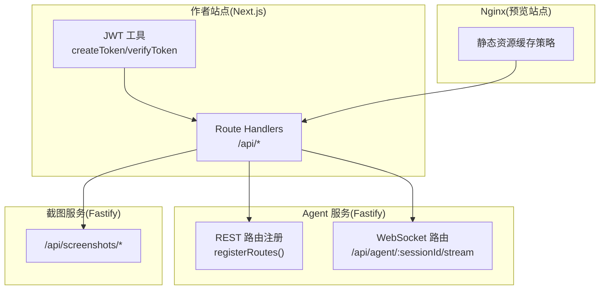
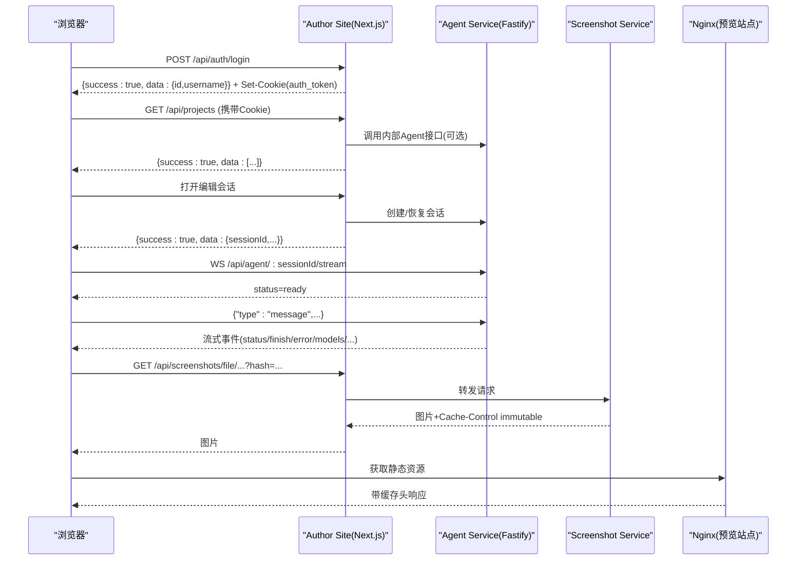
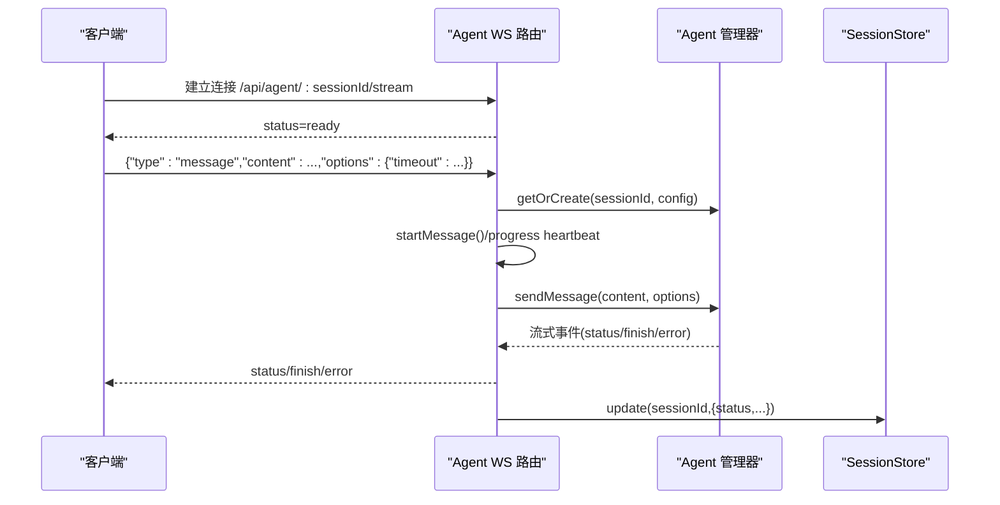
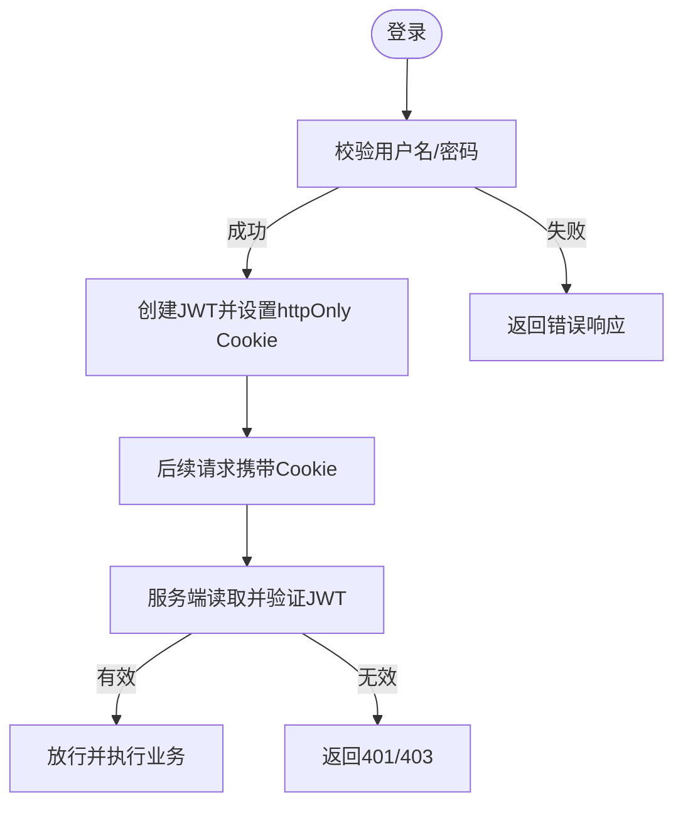
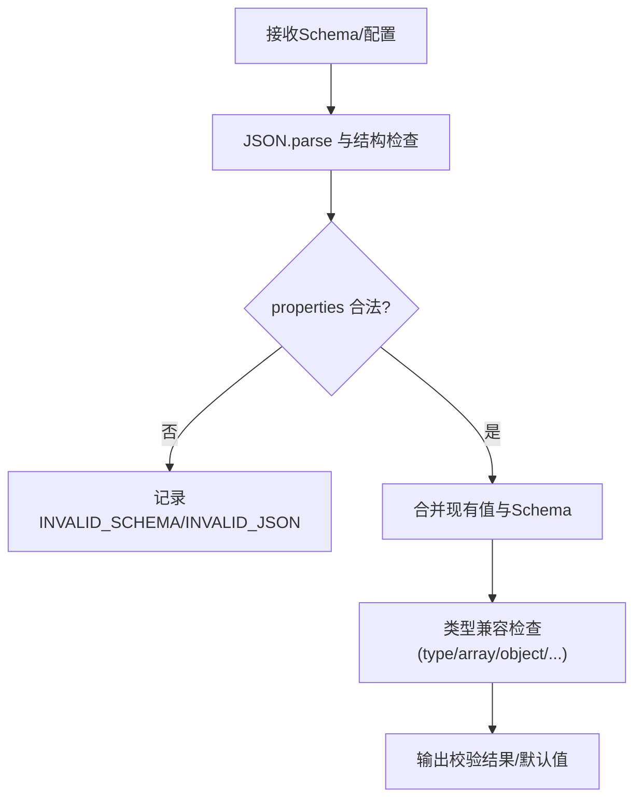
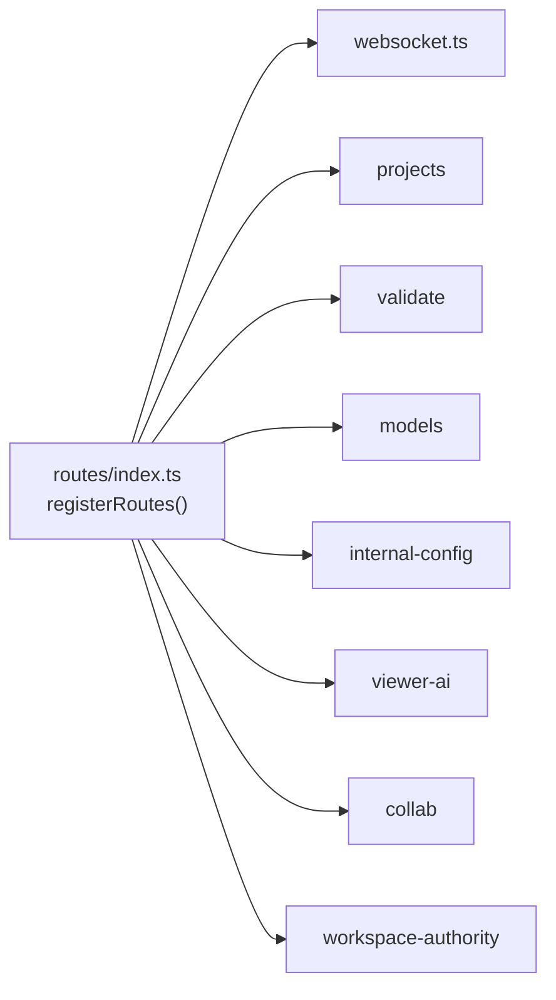

# 服务通信协议

<cite>
**本文引用的文件列表**
- [packages/agent-service/src/routes/index.ts](file://packages/agent-service/src/routes/index.ts)
- [packages/agent-service/src/routes/websocket.ts](file://packages/agent-service/src/routes/websocket.ts)
- [packages/author-site/src/lib/auth/jwt.ts](file://packages/author-site/src/lib/auth/jwt.ts)
- [docs/项目文档/创作端/06-基础设施/技术/01_路由设计.md](file://docs/项目文档/创作端/06-基础设施/技术/01_路由设计.md)
- [packages/agent-service/src/routes/api-response.ts](file://packages/agent-service/src/routes/api-response.ts)
- [packages/shared/src/ai-error-normalizer.ts](file://packages/shared/src/ai-error-normalizer.ts)
- [packages/author-site/src/app/api/workspace-authority/[projectId]/[workspaceId]/[...segments]/route.ts](file://packages/author-site/src/app/api/workspace-authority/[projectId]/[workspaceId]/[...segments]/route.ts)
- [packages/agent-client/src/client.ts](file://packages/agent-client/src/client.ts)
- [packages/author-site/src/components/ai-elements/chat/services/stream-service.ts](file://packages/author-site/src/components/ai-elements/chat/services/stream-service.ts)
- [docker/viewer-site/nginx.conf](file://docker/viewer-site/nginx.conf)
- [packages/screenshot-service/tests/screenshots-routes.test.ts](file://packages/screenshot-service/tests/screenshots-routes.test.ts)
- [packages/demo-ui/src/preview-resource-cache.ts](file://packages/demo-ui/src/preview-resource-cache.ts)
- [packages/project-core/src/service.ts](file://packages/project-core/src/service.ts)
- [packages/author-site/src/lib/config-merge.ts](file://packages/author-site/src/lib/config-merge.ts)
</cite>

## 目录
1. [简介](#简介)
2. [项目结构](#项目结构)
3. [核心组件](#核心组件)
4. [架构总览](#架构总览)
5. [详细组件分析](#详细组件分析)
6. [依赖关系分析](#依赖关系分析)
7. [性能与网络优化](#性能与网络优化)
8. [故障排查指南](#故障排查指南)
9. [结论](#结论)
10. [附录：客户端集成与版本兼容](#附录客户端集成与版本兼容)

## 简介
本文件为 Workbench 平台的服务通信协议规范，覆盖以下方面：
- HTTP REST API 设计规范（请求格式、响应结构、状态码定义、错误处理）
- WebSocket 实时通信协议（连接建立、消息格式、事件类型、断线重连）
- 认证授权机制（JWT 令牌传递、权限验证与安全策略）
- 数据序列化与校验（JSON Schema 验证、版本兼容性与迁移策略）
- 网络层优化（请求压缩、缓存策略、负载均衡配置建议）
- 客户端集成指南（SDK 使用示例、错误重试机制、性能监控）
- 协议版本管理与向后兼容性保证

## 项目结构
Workbench 采用多包仓库组织，HTTP 接口主要位于 author-site 的 Next.js Route Handlers；Agent 服务基于 Fastify 提供 Agent 流式能力与 WebSocket 长连接；截图服务独立部署并通过同源代理暴露。

图表来源
- [packages/agent-service/src/routes/index.ts:12-22](file://packages/agent-service/src/routes/index.ts#L12-L22)
- [packages/agent-service/src/routes/websocket.ts:134-150](file://packages/agent-service/src/routes/websocket.ts#L134-L150)
- [packages/author-site/src/lib/auth/jwt.ts:16-34](file://packages/author-site/src/lib/auth/jwt.ts#L16-L34)
- [docker/viewer-site/nginx.conf:19-44](file://docker/viewer-site/nginx.conf#L19-L44)

章节来源
- [docs/项目文档/创作端/06-基础设施/技术/01_路由设计.md:21-113](file://docs/项目文档/创作端/06-基础设施/技术/01_路由设计.md#L21-L113)
- [packages/agent-service/src/routes/index.ts:12-22](file://packages/agent-service/src/routes/index.ts#L12-L22)

## 核心组件
- HTTP REST API 统一响应封装：成功/失败体结构一致，便于前端统一处理。
- JWT 认证：登录/注册后签发并设置 httpOnly Cookie，后续请求由服务端读取并校验。
- WebSocket 会话通道：用于 AI 对话、模型切换、权限确认、用户选择等实时交互。
- 错误归一化：将底层错误分类为连接、超时、鉴权、配额、忙碌、取消、服务器等类别，便于客户端提示与重试策略。

章节来源
- [packages/agent-service/src/routes/api-response.ts:9-25](file://packages/agent-service/src/routes/api-response.ts#L9-L25)
- [packages/author-site/src/lib/auth/jwt.ts:16-34](file://packages/author-site/src/lib/auth/jwt.ts#L16-L34)
- [packages/shared/src/ai-error-normalizer.ts:1-17](file://packages/shared/src/ai-error-normalizer.ts#L1-L17)

## 架构总览
整体通信链路如下：
- 浏览器通过 Next.js 的 /api/* 访问业务接口，必要时转发到 Agent 服务或截图服务。
- 认证流程在 author-site 完成，返回 JWT 并写入 httpOnly Cookie。
- 实时对话通过 WebSocket 连接到 Agent 服务的 /api/agent/:sessionId/stream。
- 截图服务以同源路径 /api/screenshots/* 暴露，Nginx 对静态资源启用强缓存。

图表来源
- [packages/author-site/src/lib/auth/jwt.ts:44-56](file://packages/author-site/src/lib/auth/jwt.ts#L44-L56)
- [packages/agent-service/src/routes/websocket.ts:143-160](file://packages/agent-service/src/routes/websocket.ts#L143-L160)
- [packages/screenshot-service/tests/screenshots-routes.test.ts:617-652](file://packages/screenshot-service/tests/screenshots-routes.test.ts#L617-L652)
- [docker/viewer-site/nginx.conf:19-44](file://docker/viewer-site/nginx.conf#L19-L44)

## 详细组件分析

### HTTP REST API 规范
- 路由组织：按功能域划分，如 auth、projects、sessions、demos、workspaces、viewer 等。
- 统一响应体：
  - 成功：{ success: true, data: T }
  - 失败：{ success: false, error: { code, message, details? } }
- 常见状态码：
  - 200/201：成功
  - 400：参数无效或请求不合法
  - 401：未认证或会话缺失
  - 403：无权限
  - 404：资源不存在
  - 429：限流
  - 5xx：服务端异常
- 错误码体系：
  - 业务错误码见各路由实现与辅助函数 createApiError。
  - AI 相关错误经 normalizeAiError 归类为 connection/timeout/auth/quota/busy/cancelled/server/unknown，便于客户端差异化处理。

章节来源
- [docs/项目文档/创作端/06-基础设施/技术/01_路由设计.md:117-172](file://docs/项目文档/创作端/06-基础设施/技术/01_路由设计.md#L117-L172)
- [packages/agent-service/src/routes/api-response.ts:9-25](file://packages/agent-service/src/routes/api-response.ts#L9-L25)
- [packages/shared/src/ai-error-normalizer.ts:116-156](file://packages/shared/src/ai-error-normalizer.ts#L116-L156)

#### 典型接口清单（节选）
- 认证
  - POST /api/auth/register
  - POST /api/auth/login
  - GET /api/auth/me
- 项目
  - GET/POST /api/projects
  - GET/DELETE /api/projects/:id
  - GET/PUT /api/projects/:id/config
  - GET/POST /api/projects/:id/demos
  - GET/PATCH/DELETE /api/projects/:id/demos/:demoId
  - GET/PUT /api/projects/:id/demos/:demoId/files
  - GET/POST /api/projects/:id/folders
  - PATCH/DELETE /api/projects/:id/folders/:folderId
  - GET/POST /api/projects/:id/resources/:kind/:resourceId/versions
  - POST /api/projects/:id/resources/:kind/:resourceId/versions/:versionId
  - GET /api/projects/:id/versions
- 会话
  - GET/POST /api/sessions
  - GET/DELETE /api/sessions/:id
  - POST /api/sessions/:id/save
  - POST /api/sessions/:id/discard
  - GET/PUT /api/sessions/:id/files
  - GET/PUT /api/sessions/:id/files/:demoId
  - POST /api/sessions/:id/merge
  - GET /api/sessions/:id/messages
  - GET /api/sessions/:id/meta
  - POST /api/sessions/cleanup
  - GET /api/sessions/project/:projectId
- 工作区
  - POST /api/workspaces
  - GET/DELETE /api/workspaces/:workspaceId
- 其他
  - POST /api/compile
  - POST /api/generate-schema
  - GET /api/embed/:projectId/iframe
  - GET /api/viewer/:projectId/data
  - POST /api/demos/:id/cover

章节来源
- [docs/项目文档/创作端/06-基础设施/技术/01_路由设计.md:21-113](file://docs/项目文档/创作端/06-基础设施/技术/01_路由设计.md#L21-L113)
- [docs/项目文档/创作端/06-基础设施/技术/01_路由设计.md:175-800](file://docs/项目文档/创作端/06-基础设施/技术/01_路由设计.md#L175-L800)

### WebSocket 实时通信协议
- 连接建立
  - 客户端通过 ws/wss 连接 /api/agent/:sessionId/stream。
  - 服务端返回 status=ready 表示就绪。
- 心跳与保活
  - 客户端周期性发送 ping，服务端回复 pong。
  - 服务端定时清理长时间无心跳的连接。
- 消息类型（客户端→服务端）
  - message：发送对话内容，支持 images/files/systemPrompt/options 等扩展字段。
  - cancel：取消当前正在处理的请求。
  - resume：恢复指定 sessionId 的会话。
  - set_model/get_models：查询/切换当前模型。
  - permission_response：对权限询问进行一次性允许/拒绝。
  - user_choice_response：对用户需求选择进行响应。
  - console_data：辅助日志通道，直接入缓冲，不进入 Agent。
- 事件类型（服务端→客户端）
  - status：会话状态变化（initializing/processing/ready）。
  - finish：消息处理完成，包含 content/files/metadata。
  - error：错误信息，包含 code/message/retryable 等。
  - models：模型列表与当前模型。
  - pong：心跳应答。
- 超时与进度
  - 支持显式 options.timeout 限制消息处理时长，超时会返回 MESSAGE_TIMEOUT 并可重试。
  - 处理中周期性推送 status=processing 作为进度心跳。
- 断线重连
  - 客户端侧维护自动重连逻辑，并在连接成功后可发送 resume 恢复会话上下文。

图表来源
- [packages/agent-service/src/routes/websocket.ts:143-160](file://packages/agent-service/src/routes/websocket.ts#L143-L160)
- [packages/agent-service/src/routes/websocket.ts:208-486](file://packages/agent-service/src/routes/websocket.ts#L208-L486)
- [packages/agent-service/src/routes/websocket.ts:812-846](file://packages/agent-service/src/routes/websocket.ts#L812-L846)

章节来源
- [packages/agent-service/src/routes/websocket.ts:134-160](file://packages/agent-service/src/routes/websocket.ts#L134-L160)
- [packages/agent-service/src/routes/websocket.ts:182-206](file://packages/agent-service/src/routes/websocket.ts#L182-L206)
- [packages/agent-service/src/routes/websocket.ts:715-721](file://packages/agent-service/src/routes/websocket.ts#L715-L721)
- [packages/agent-service/src/routes/websocket.ts:812-846](file://packages/agent-service/src/routes/websocket.ts#L812-L846)

### 认证与授权
- 登录/注册
  - 服务端校验凭据后签发 JWT，并设置 httpOnly Cookie（生产默认 secure，可通过环境变量控制）。
- 鉴权方式
  - 后续请求由服务端从 Cookie 中读取 token 并校验，无需客户端手动附加 Authorization。
- 权限边界
  - Workspace Authority 路由根据方法白名单与路径前缀判定是否允许访问，并对 JSON 请求体中的 sessionId 进行解析与校验。

图表来源
- [packages/author-site/src/lib/auth/jwt.ts:16-34](file://packages/author-site/src/lib/auth/jwt.ts#L16-L34)
- [packages/author-site/src/lib/auth/jwt.ts:44-56](file://packages/author-site/src/lib/auth/jwt.ts#L44-L56)
- [packages/author-site/src/app/api/workspace-authority/[projectId]/[workspaceId]/[...segments]/route.ts:28-47](file://packages/author-site/src/app/api/workspace-authority/[projectId]/[workspaceId]/[...segments]/route.ts#L28-L47)

章节来源
- [packages/author-site/src/lib/auth/jwt.ts:16-34](file://packages/author-site/src/lib/auth/jwt.ts#L16-L34)
- [packages/author-site/src/lib/auth/jwt.ts:44-56](file://packages/author-site/src/lib/auth/jwt.ts#L44-L56)
- [packages/author-site/src/app/api/workspace-authority/[projectId]/[workspaceId]/[...segments]/route.ts:28-47](file://packages/author-site/src/app/api/workspace-authority/[projectId]/[workspaceId]/[...segments]/route.ts#L28-L47)

### 数据序列化与校验
- 统一 JSON 传输，服务端对关键输入进行 JSON 语法与结构校验。
- 配置 Schema 校验
  - 解析 properties 是否为对象，非法则记录 INVALID_SCHEMA/INVALID_JSON 问题。
  - 合并时检查值与 schema 类型约束的兼容性。
- 版本兼容与迁移
  - 通过 properties 与 required 提取，结合默认值生成与类型兼容判断，支撑渐进式演进。

图表来源
- [packages/project-core/src/service.ts:6253-6292](file://packages/project-core/src/service.ts#L6253-L6292)
- [packages/author-site/src/lib/config-merge.ts:102-132](file://packages/author-site/src/lib/config-merge.ts#L102-L132)

章节来源
- [packages/project-core/src/service.ts:6253-6292](file://packages/project-core/src/service.ts#L6253-L6292)
- [packages/author-site/src/lib/config-merge.ts:102-132](file://packages/author-site/src/lib/config-merge.ts#L102-L132)

### 网络层优化
- 缓存策略
  - 截图服务对按 hash 的文件返回 immutable 缓存头，利于 CDN/浏览器长期缓存。
  - 预览站点 Nginx 对静态资源与 JS 模块设置不同过期策略，提升加载性能。
- 前端资源预热
  - 预览资源缓存按 LRU 淘汰，并发预取图片等资源，降低首屏等待。
- 压缩与负载均衡
  - 建议在反向代理层开启 gzip/brotli 压缩；对多实例部署使用健康检查与权重轮询。

章节来源
- [packages/screenshot-service/tests/screenshots-routes.test.ts:617-652](file://packages/screenshot-service/tests/screenshots-routes.test.ts#L617-L652)
- [docker/viewer-site/nginx.conf:19-44](file://docker/viewer-site/nginx.conf#L19-L44)
- [packages/demo-ui/src/preview-resource-cache.ts:198-245](file://packages/demo-ui/src/preview-resource-cache.ts#L198-L245)

## 依赖关系分析
- 路由注册集中管理，新增路由需通过 registerRoutes 挂载。
- WebSocket 路由依赖 Agent 管理器、SessionStore、WorkspaceManager、SnapshotService 等子系统。
- 认证与授权贯穿所有受保护路由，Workspace Authority 进一步细化到路径与方法白名单。

图表来源
- [packages/agent-service/src/routes/index.ts:12-22](file://packages/agent-service/src/routes/index.ts#L12-L22)

章节来源
- [packages/agent-service/src/routes/index.ts:12-22](file://packages/agent-service/src/routes/index.ts#L12-L22)

## 性能与网络优化
- 连接保活
  - 服务端定期清理无心跳连接，避免僵尸连接占用资源。
- 消息超时
  - 支持显式 timeout，防止长任务阻塞；超时返回可重试错误码。
- 缓存命中
  - 截图与静态资源利用不可变缓存键，减少重复计算与带宽消耗。
- 资源预热
  - 前端主动预热图片与脚本，缩短渲染等待时间。

章节来源
- [packages/agent-service/src/routes/websocket.ts:122-132](file://packages/agent-service/src/routes/websocket.ts#L122-L132)
- [packages/agent-service/src/routes/websocket.ts:346-417](file://packages/agent-service/src/routes/websocket.ts#L346-L417)
- [packages/screenshot-service/tests/screenshots-routes.test.ts:617-652](file://packages/screenshot-service/tests/screenshots-routes.test.ts#L617-L652)
- [packages/demo-ui/src/preview-resource-cache.ts:198-245](file://packages/demo-ui/src/preview-resource-cache.ts#L198-L245)

## 故障排查指南
- 常见问题定位
  - 连接失败：检查 WS 握手与心跳；确认服务端存活与健康检查。
  - 鉴权失败：确认 Cookie 是否携带且未过期；核对 JWT_SECRET 配置。
  - 参数错误：检查 JSON 结构与必填字段；关注 INVALID_PARAMS 错误码。
  - 超时：关注 MESSAGE_TIMEOUT，适当增大 timeout 或优化后端处理。
  - 配额/限流：观察 429 与 quota 分类错误，实施退避重试。
- 错误分类与提示
  - 使用 normalizeAiError 将错误映射为用户友好提示与重试策略。

章节来源
- [packages/shared/src/ai-error-normalizer.ts:1-17](file://packages/shared/src/ai-error-normalizer.ts#L1-L17)
- [packages/shared/src/ai-error-normalizer.ts:116-156](file://packages/shared/src/ai-error-normalizer.ts#L116-L156)

## 结论
Workbench 的通信协议以 REST 为主、WebSocket 为辅，配合统一的响应体与错误分类，形成清晰、可扩展的交互契约。通过 JWT 与细粒度权限控制保障安全，借助缓存与预热提升性能，并以明确的超时与心跳机制增强稳定性。

## 附录：客户端集成与版本兼容

### SDK 使用要点
- 初始化与连接
  - 使用 agent-client 提供的 stream 方法建立 WS 连接，监听 status/finish/error 等事件。
- 连接等待与超时
  - 提供 waitForConnection 包装，确保 readyState 为 OPEN 后再发送消息。
- 心跳与重连
  - 客户端周期性发送 ping；断线后自动重连，必要时发送 resume 恢复会话。

章节来源
- [packages/agent-client/src/client.ts:380-408](file://packages/agent-client/src/client.ts#L380-L408)
- [packages/author-site/src/components/ai-elements/chat/services/stream-service.ts:185-228](file://packages/author-site/src/components/ai-elements/chat/services/stream-service.ts#L185-L228)

### 错误重试与降级
- 基于错误分类决定重试策略：
  - connection/timeout：指数退避重试
  - auth：引导重新登录
  - quota：延迟重试或提示用户
  - busy：等待或取消后重试
- 对于 MESSAGE_TIMEOUT，标记 retryable=true，客户端可按策略重试。

章节来源
- [packages/shared/src/ai-error-normalizer.ts:1-17](file://packages/shared/src/ai-error-normalizer.ts#L1-L17)
- [packages/shared/src/ai-error-normalizer.ts:116-156](file://packages/shared/src/ai-error-normalizer.ts#L116-L156)

### 性能监控建议
- 指标采集
  - WS 连接建立耗时、消息往返时延、错误率、心跳丢失率。
  - 截图生成耗时、缓存命中率、编译缓存命中率。
- 观测点
  - 在 WebSocket 事件路由器与 Agent 管理器处埋点，记录开始/结束时间与中间状态。
  - 在截图服务与 Nginx 层统计响应时间与缓存命中情况。

### 协议版本管理与向后兼容
- 版本标识
  - 在消息体中保留 version 字段（若需要），服务端按版本分支处理。
- 兼容策略
  - 新增字段应默认忽略；删除字段需保留兼容处理或废弃期过渡。
  - 行为变更通过版本号或特性开关控制，避免破坏旧客户端。
- 迁移指引
  - 发布说明中明确废弃字段与替代方案；提供迁移脚本或工具辅助升级。