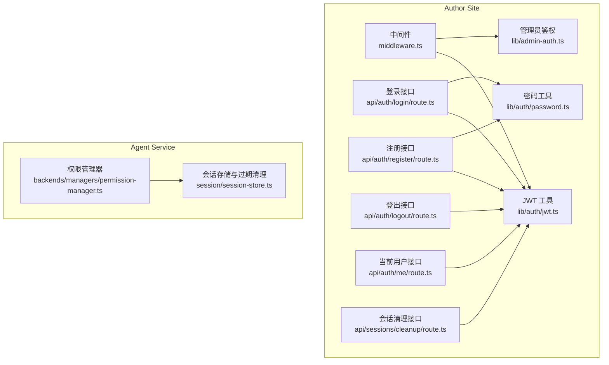
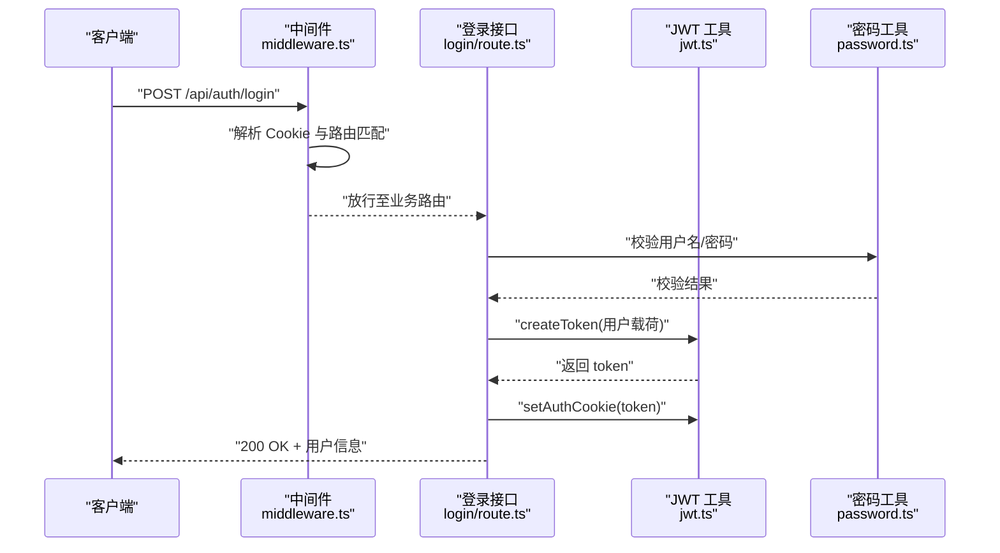
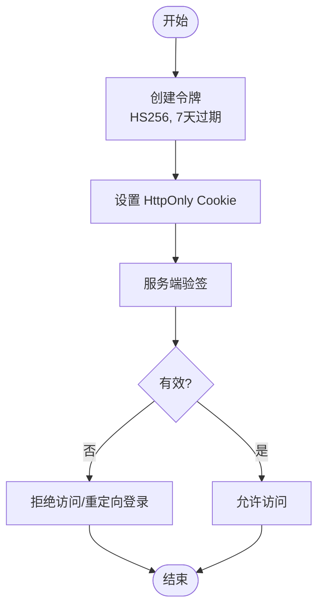
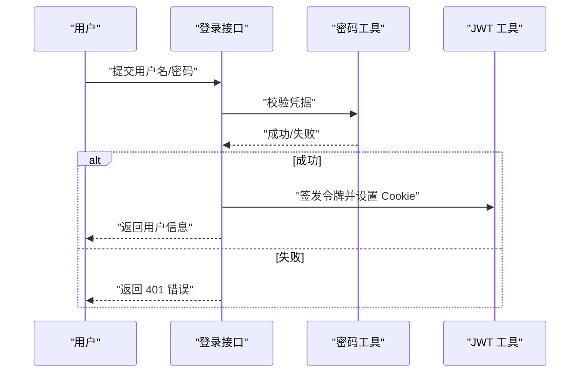
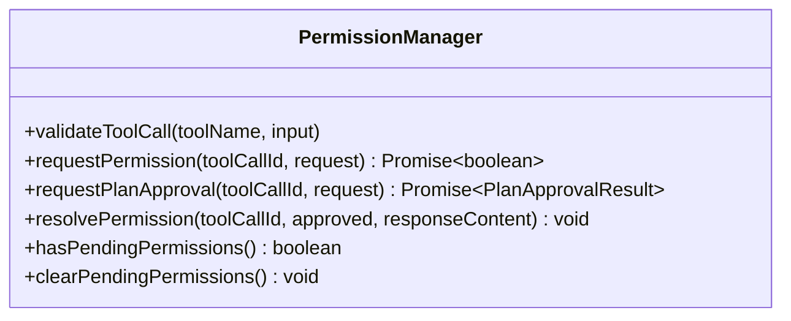
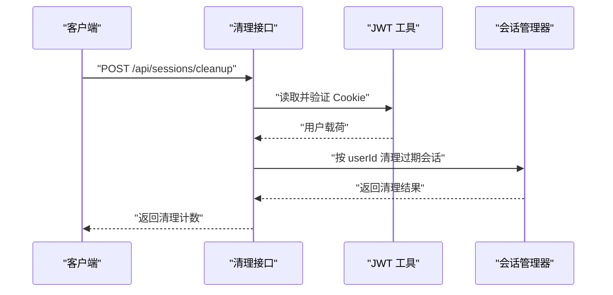
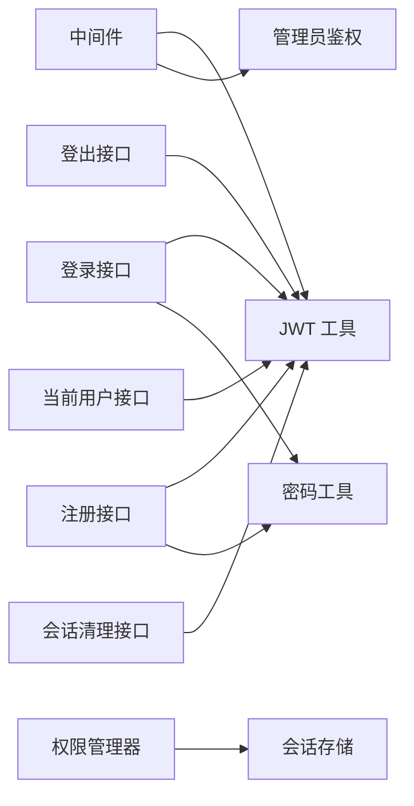

# 认证授权机制

<cite>
**本文引用的文件**
- [packages/author-site/src/lib/auth/jwt.ts](file://packages/author-site/src/lib/auth/jwt.ts)
- [packages/author-site/src/middleware.ts](file://packages/author-site/src/middleware.ts)
- [packages/author-site/src/app/api/auth/login/route.ts](file://packages/author-site/src/app/api/auth/login/route.ts)
- [packages/author-site/src/app/api/auth/register/route.ts](file://packages/author-site/src/app/api/auth/register/route.ts)
- [packages/author-site/src/app/api/auth/logout/route.ts](file://packages/author-site/src/app/api/auth/logout/route.ts)
- [packages/author-site/src/app/api/auth/me/route.ts](file://packages/author-site/src/app/api/auth/me/route.ts)
- [packages/author-site/src/lib/admin-auth.ts](file://packages/author-site/src/lib/admin-auth.ts)
- [packages/author-site/src/lib/auth/password.ts](file://packages/author-site/src/lib/auth/password.ts)
- [packages/agent-service/src/backends/managers/permission-manager.ts](file://packages/agent-service/src/backends/managers/permission-manager.ts)
- [packages/agent-service/src/session/session-store.ts](file://packages/agent-service/src/session/session-store.ts)
- [packages/author-site/src/app/api/sessions/cleanup/route.ts](file://packages/author-site/src/app/api/sessions/cleanup/route.ts)
</cite>

## 目录
1. [简介](#简介)
2. [项目结构](#项目结构)
3. [核心组件](#核心组件)
4. [架构总览](#架构总览)
5. [详细组件分析](#详细组件分析)
6. [依赖关系分析](#依赖关系分析)
7. [性能与安全考量](#性能与安全考量)
8. [故障排查指南](#故障排查指南)
9. [结论](#结论)
10. [附录：客户端集成与最佳实践](#附录客户端集成与最佳实践)

## 简介
本文件面向 Workbench 平台的认证与授权机制，覆盖以下主题：
- JWT 令牌生命周期管理（生成、验证、刷新、撤销）
- 用户身份验证流程（登录、注册、密码加密存储、多因素认证扩展点）
- 权限控制模型（角色与资源访问控制、操作权限校验）
- 安全策略配置（CORS、请求频率限制、输入验证过滤）
- 客户端认证集成（令牌存储、自动注入、错误处理）
- 安全最佳实践（传输安全、敏感信息保护、会话管理）

## 项目结构
认证与授权相关代码主要分布在 author-site 与 agent-service 两个包中：
- author-site：提供 Web 端认证入口、中间件鉴权、JWT 工具、管理员鉴权、密码哈希与校验等
- agent-service：提供 AI Agent 侧的权限管理器与会话清理能力

图表来源
- [packages/author-site/src/middleware.ts:1-153](file://packages/author-site/src/middleware.ts#L1-L153)
- [packages/author-site/src/lib/auth/jwt.ts:1-71](file://packages/author-site/src/lib/auth/jwt.ts#L1-L71)
- [packages/author-site/src/lib/admin-auth.ts:1-135](file://packages/author-site/src/lib/admin-auth.ts#L1-L135)
- [packages/author-site/src/lib/auth/password.ts:1-35](file://packages/author-site/src/lib/auth/password.ts#L1-L35)
- [packages/author-site/src/app/api/auth/login/route.ts:1-47](file://packages/author-site/src/app/api/auth/login/route.ts#L1-L47)
- [packages/author-site/src/app/api/auth/register/route.ts:1-56](file://packages/author-site/src/app/api/auth/register/route.ts#L1-L56)
- [packages/author-site/src/app/api/auth/logout/route.ts:1-9](file://packages/author-site/src/app/api/auth/logout/route.ts#L1-L9)
- [packages/author-site/src/app/api/auth/me/route.ts:1-35](file://packages/author-site/src/app/api/auth/me/route.ts#L1-L35)
- [packages/author-site/src/app/api/sessions/cleanup/route.ts:1-37](file://packages/author-site/src/app/api/sessions/cleanup/route.ts#L1-L37)
- [packages/agent-service/src/backends/managers/permission-manager.ts:1-200](file://packages/agent-service/src/backends/managers/permission-manager.ts#L1-L200)
- [packages/agent-service/src/session/session-store.ts:98-157](file://packages/agent-service/src/session/session-store.ts#L98-L157)

章节来源
- [packages/author-site/src/middleware.ts:1-153](file://packages/author-site/src/middleware.ts#L1-L153)
- [packages/author-site/src/lib/auth/jwt.ts:1-71](file://packages/author-site/src/lib/auth/jwt.ts#L1-L71)
- [packages/author-site/src/lib/admin-auth.ts:1-135](file://packages/author-site/src/lib/admin-auth.ts#L1-L135)
- [packages/author-site/src/lib/auth/password.ts:1-35](file://packages/author-site/src/lib/auth/password.ts#L1-L35)
- [packages/author-site/src/app/api/auth/login/route.ts:1-47](file://packages/author-site/src/app/api/auth/login/route.ts#L1-L47)
- [packages/author-site/src/app/api/auth/register/route.ts:1-56](file://packages/author-site/src/app/api/auth/register/route.ts#L1-L56)
- [packages/author-site/src/app/api/auth/logout/route.ts:1-9](file://packages/author-site/src/app/api/auth/logout/route.ts#L1-L9)
- [packages/author-site/src/app/api/auth/me/route.ts:1-35](file://packages/author-site/src/app/api/auth/me/route.ts#L1-L35)
- [packages/author-site/src/app/api/sessions/cleanup/route.ts:1-37](file://packages/author-site/src/app/api/sessions/cleanup/route.ts#L1-L37)
- [packages/agent-service/src/backends/managers/permission-manager.ts:1-200](file://packages/agent-service/src/backends/managers/permission-manager.ts#L1-L200)
- [packages/agent-service/src/session/session-store.ts:98-157](file://packages/agent-service/src/session/session-store.ts#L98-L157)

## 核心组件
- JWT 工具模块
  - 负责令牌签发、验签、Cookie 读写；默认 HS256，有效期 7 天；生产环境默认启用 secure Cookie
- 中间件鉴权
  - 统一解析 auth_token，对受保护页面/API 进行拦截；支持 CORS 预检与跨域白名单；管理后台独立鉴权
- 管理员鉴权
  - 基于 ADMIN_SECRET 的 SHA-256 哈希比对，支持 URL 参数与 Cookie 两种形式，Edge Runtime 兼容
- 密码工具
  - bcrypt 加盐哈希与校验；用户名/密码基础校验规则
- 登录/注册/登出/当前用户接口
  - 登录：校验凭据、签发并设置 Cookie、返回用户基本信息
  - 注册：校验输入、创建用户、签发并设置 Cookie
  - 登出：清除 Cookie
  - 当前用户：从 Cookie 解析并返回用户信息
- 权限管理器（Agent 侧）
  - 工具调用路径白/黑名单校验、知识库写保护、删除页面与计划审批的人机确认流程
- 会话清理
  - 服务端定时清理过期会话元数据；API 按当前用户清理其过期会话

章节来源
- [packages/author-site/src/lib/auth/jwt.ts:1-71](file://packages/author-site/src/lib/auth/jwt.ts#L1-L71)
- [packages/author-site/src/middleware.ts:1-153](file://packages/author-site/src/middleware.ts#L1-L153)
- [packages/author-site/src/lib/admin-auth.ts:1-135](file://packages/author-site/src/lib/admin-auth.ts#L1-L135)
- [packages/author-site/src/lib/auth/password.ts:1-35](file://packages/author-site/src/lib/auth/password.ts#L1-L35)
- [packages/author-site/src/app/api/auth/login/route.ts:1-47](file://packages/author-site/src/app/api/auth/login/route.ts#L1-L47)
- [packages/author-site/src/app/api/auth/register/route.ts:1-56](file://packages/author-site/src/app/api/auth/register/route.ts#L1-L56)
- [packages/author-site/src/app/api/auth/logout/route.ts:1-9](file://packages/author-site/src/app/api/auth/logout/route.ts#L1-L9)
- [packages/author-site/src/app/api/auth/me/route.ts:1-35](file://packages/author-site/src/app/api/auth/me/route.ts#L1-L35)
- [packages/agent-service/src/backends/managers/permission-manager.ts:1-200](file://packages/agent-service/src/backends/managers/permission-manager.ts#L1-L200)
- [packages/agent-service/src/session/session-store.ts:98-157](file://packages/agent-service/src/session/session-store.ts#L98-L157)
- [packages/author-site/src/app/api/sessions/cleanup/route.ts:1-37](file://packages/author-site/src/app/api/sessions/cleanup/route.ts#L1-L37)

## 架构总览
整体采用“无状态 JWT + HttpOnly Cookie”的认证模式，配合中间件集中鉴权；Agent 侧通过权限管理器实施细粒度资源与操作控制。

图表来源
- [packages/author-site/src/middleware.ts:1-153](file://packages/author-site/src/middleware.ts#L1-L153)
- [packages/author-site/src/app/api/auth/login/route.ts:1-47](file://packages/author-site/src/app/api/auth/login/route.ts#L1-L47)
- [packages/author-site/src/lib/auth/jwt.ts:1-71](file://packages/author-site/src/lib/auth/jwt.ts#L1-L71)
- [packages/author-site/src/lib/auth/password.ts:1-35](file://packages/author-site/src/lib/auth/password.ts#L1-L35)

## 详细组件分析

### JWT 令牌生命周期管理
- 令牌生成
  - 使用 HS256 算法，包含 userId 与 username 载荷，签发时间与会过期时间（7 天）
- 令牌验证
  - 服务端在中间件与各受保护接口处验签，失败则拒绝访问
- 令牌刷新
  - 当前实现未提供显式刷新接口；建议在前端于接近过期时调用刷新逻辑或重新登录
- 令牌撤销
  - 通过登出接口清除 Cookie 实现本地撤销；如需全局撤销可引入黑名单或缩短有效期

图表来源
- [packages/author-site/src/lib/auth/jwt.ts:1-71](file://packages/author-site/src/lib/auth/jwt.ts#L1-L71)
- [packages/author-site/src/middleware.ts:1-153](file://packages/author-site/src/middleware.ts#L1-L153)

章节来源
- [packages/author-site/src/lib/auth/jwt.ts:1-71](file://packages/author-site/src/lib/auth/jwt.ts#L1-L71)
- [packages/author-site/src/middleware.ts:1-153](file://packages/author-site/src/middleware.ts#L1-L153)

### 用户身份验证流程
- 登录
  - 接收用户名与密码，忽略首尾空白，校验通过后签发并设置 Cookie，返回用户基本信息
- 注册
  - 校验用户名与密码格式，检查重复，创建用户后签发并设置 Cookie
- 登出
  - 清除认证 Cookie
- 当前用户
  - 从 Cookie 解析并验签，返回用户基本信息
- 密码加密存储
  - 使用 bcrypt 加盐哈希；提供校验函数

图表来源
- [packages/author-site/src/app/api/auth/login/route.ts:1-47](file://packages/author-site/src/app/api/auth/login/route.ts#L1-L47)
- [packages/author-site/src/lib/auth/password.ts:1-35](file://packages/author-site/src/lib/auth/password.ts#L1-L35)
- [packages/author-site/src/lib/auth/jwt.ts:1-71](file://packages/author-site/src/lib/auth/jwt.ts#L1-L71)

章节来源
- [packages/author-site/src/app/api/auth/login/route.ts:1-47](file://packages/author-site/src/app/api/auth/login/route.ts#L1-L47)
- [packages/author-site/src/app/api/auth/register/route.ts:1-56](file://packages/author-site/src/app/api/auth/register/route.ts#L1-L56)
- [packages/author-site/src/app/api/auth/logout/route.ts:1-9](file://packages/author-site/src/app/api/auth/logout/route.ts#L1-L9)
- [packages/author-site/src/app/api/auth/me/route.ts:1-35](file://packages/author-site/src/app/api/auth/me/route.ts#L1-L35)
- [packages/author-site/src/lib/auth/password.ts:1-35](file://packages/author-site/src/lib/auth/password.ts#L1-L35)

### 多因素认证（MFA）扩展点
- 当前未内置 MFA 流程；可在登录接口中增加二次校验步骤（如一次性验证码），并在成功登录后签发令牌
- 建议在登录成功后将 MFA 已验证标记写入短期会话或令牌载荷，用于后续敏感操作二次校验

[本节为概念性说明，不直接分析具体文件]

### 权限控制模型
- 角色定义
  - 当前实现未提供显式 RBAC；可通过在 JWT 载荷中扩展角色字段并在中间件或路由层进行判断
- 资源访问控制
  - Agent 侧通过权限管理器对文件路径进行白/黑名单校验，并对知识库目录实施写保护
- 操作权限验证
  - 针对高风险操作（如删除页面、执行计划）采用人机确认流程，超时自动拒绝

图表来源
- [packages/agent-service/src/backends/managers/permission-manager.ts:1-200](file://packages/agent-service/src/backends/managers/permission-manager.ts#L1-L200)

章节来源
- [packages/agent-service/src/backends/managers/permission-manager.ts:1-200](file://packages/agent-service/src/backends/managers/permission-manager.ts#L1-L200)

### 安全策略配置
- CORS
  - 中间件根据环境变量合并默认与自定义允许的源，OPTIONS 预检直接返回 204；公共预览模块使用宽松策略
- 请求频率限制
  - 当前未实现限流；建议在网关或反向代理层添加速率限制
- 输入验证过滤
  - 登录/注册接口对用户名与密码进行基础校验；建议结合更严格的白名单与长度限制

章节来源
- [packages/author-site/src/middleware.ts:1-153](file://packages/author-site/src/middleware.ts#L1-L153)
- [packages/author-site/src/app/api/auth/login/route.ts:1-47](file://packages/author-site/src/app/api/auth/login/route.ts#L1-L47)
- [packages/author-site/src/app/api/auth/register/route.ts:1-56](file://packages/author-site/src/app/api/auth/register/route.ts#L1-L56)
- [packages/author-site/src/lib/auth/password.ts:1-35](file://packages/author-site/src/lib/auth/password.ts#L1-L35)

### 会话管理与清理
- 服务端会话清理
  - 定时任务清理过期的会话元数据，避免内存泄漏
- 用户级会话清理
  - 提供 API 仅清理当前用户的过期会话，需携带有效认证令牌

图表来源
- [packages/author-site/src/app/api/sessions/cleanup/route.ts:1-37](file://packages/author-site/src/app/api/sessions/cleanup/route.ts#L1-L37)
- [packages/author-site/src/lib/auth/jwt.ts:1-71](file://packages/author-site/src/lib/auth/jwt.ts#L1-L71)
- [packages/agent-service/src/session/session-store.ts:98-157](file://packages/agent-service/src/session/session-store.ts#L98-L157)

章节来源
- [packages/agent-service/src/session/session-store.ts:98-157](file://packages/agent-service/src/session/session-store.ts#L98-L157)
- [packages/author-site/src/app/api/sessions/cleanup/route.ts:1-37](file://packages/author-site/src/app/api/sessions/cleanup/route.ts#L1-L37)

## 依赖关系分析
- 中间件依赖 JWT 与管理员鉴权模块，统一处理认证与跨域
- 登录/注册/登出/当前用户接口依赖 JWT 与密码工具
- Agent 权限管理器依赖路径与权限配置，并与事件回调协作完成人机确认
- 会话清理接口依赖 JWT 与后端会话管理

图表来源
- [packages/author-site/src/middleware.ts:1-153](file://packages/author-site/src/middleware.ts#L1-L153)
- [packages/author-site/src/lib/auth/jwt.ts:1-71](file://packages/author-site/src/lib/auth/jwt.ts#L1-L71)
- [packages/author-site/src/lib/admin-auth.ts:1-135](file://packages/author-site/src/lib/admin-auth.ts#L1-L135)
- [packages/author-site/src/lib/auth/password.ts:1-35](file://packages/author-site/src/lib/auth/password.ts#L1-L35)
- [packages/author-site/src/app/api/auth/login/route.ts:1-47](file://packages/author-site/src/app/api/auth/login/route.ts#L1-L47)
- [packages/author-site/src/app/api/auth/register/route.ts:1-56](file://packages/author-site/src/app/api/auth/register/route.ts#L1-L56)
- [packages/author-site/src/app/api/auth/logout/route.ts:1-9](file://packages/author-site/src/app/api/auth/logout/route.ts#L1-L9)
- [packages/author-site/src/app/api/auth/me/route.ts:1-35](file://packages/author-site/src/app/api/auth/me/route.ts#L1-L35)
- [packages/author-site/src/app/api/sessions/cleanup/route.ts:1-37](file://packages/author-site/src/app/api/sessions/cleanup/route.ts#L1-L37)
- [packages/agent-service/src/backends/managers/permission-manager.ts:1-200](file://packages/agent-service/src/backends/managers/permission-manager.ts#L1-L200)
- [packages/agent-service/src/session/session-store.ts:98-157](file://packages/agent-service/src/session/session-store.ts#L98-L157)

章节来源
- [packages/author-site/src/middleware.ts:1-153](file://packages/author-site/src/middleware.ts#L1-L153)
- [packages/author-site/src/lib/auth/jwt.ts:1-71](file://packages/author-site/src/lib/auth/jwt.ts#L1-L71)
- [packages/author-site/src/lib/admin-auth.ts:1-135](file://packages/author-site/src/lib/admin-auth.ts#L1-L135)
- [packages/author-site/src/lib/auth/password.ts:1-35](file://packages/author-site/src/lib/auth/password.ts#L1-L35)
- [packages/author-site/src/app/api/auth/login/route.ts:1-47](file://packages/author-site/src/app/api/auth/login/route.ts#L1-L47)
- [packages/author-site/src/app/api/auth/register/route.ts:1-56](file://packages/author-site/src/app/api/auth/register/route.ts#L1-L56)
- [packages/author-site/src/app/api/auth/logout/route.ts:1-9](file://packages/author-site/src/app/api/auth/logout/route.ts#L1-L9)
- [packages/author-site/src/app/api/auth/me/route.ts:1-35](file://packages/author-site/src/app/api/auth/me/route.ts#L1-L35)
- [packages/author-site/src/app/api/sessions/cleanup/route.ts:1-37](file://packages/author-site/src/app/api/sessions/cleanup/route.ts#L1-L37)
- [packages/agent-service/src/backends/managers/permission-manager.ts:1-200](file://packages/agent-service/src/backends/managers/permission-manager.ts#L1-L200)
- [packages/agent-service/src/session/session-store.ts:98-157](file://packages/agent-service/src/session/session-store.ts#L98-L157)

## 性能与安全考量
- 性能
  - JWT 验签开销低；中间件集中处理减少重复逻辑
  - 会话清理采用定时器批量清理，避免频繁 I/O
- 安全
  - 使用 HttpOnly Cookie 降低 XSS 风险；生产环境默认启用 secure
  - 管理员鉴权使用 SHA-256 哈希比对，避免明文传输
  - 建议在生产环境强制 HTTPS，严格配置 CORS 白名单
  - 建议引入速率限制与输入白名单校验，防止暴力破解与注入

[本节为通用指导，不直接分析具体文件]

## 故障排查指南
- 登录失败
  - 检查用户名/密码校验逻辑与错误码
  - 确认 JWT 密钥与环境变量配置正确
- 未登录或登录过期
  - 检查中间件是否正确解析 Cookie 与验签
  - 确认浏览器是否接受第三方 Cookie 与 SameSite 策略
- 管理后台无法访问
  - 检查 ADMIN_SECRET 与 URL 参数/ Cookie 是否一致
  - 确认 Edge Runtime 下哈希计算是否可用
- 权限被拒绝
  - 检查 Agent 权限配置与工作空间路径
  - 关注人机确认是否超时或被取消

章节来源
- [packages/author-site/src/app/api/auth/login/route.ts:1-47](file://packages/author-site/src/app/api/auth/login/route.ts#L1-L47)
- [packages/author-site/src/middleware.ts:1-153](file://packages/author-site/src/middleware.ts#L1-L153)
- [packages/author-site/src/lib/admin-auth.ts:1-135](file://packages/author-site/src/lib/admin-auth.ts#L1-L135)
- [packages/agent-service/src/backends/managers/permission-manager.ts:1-200](file://packages/agent-service/src/backends/managers/permission-manager.ts#L1-L200)

## 结论
Workbench 平台采用轻量且可扩展的认证授权方案：以 JWT + HttpOnly Cookie 为核心，中间件统一鉴权，Agent 侧通过权限管理器实施细粒度控制。当前实现已满足基本安全需求，建议在生产环境中完善令牌刷新、全局撤销、速率限制与审计日志等能力。

[本节为总结性内容，不直接分析具体文件]

## 附录：客户端集成与最佳实践
- 令牌存储
  - 优先使用 HttpOnly Cookie；若必须前端持有，建议使用内存存储并避免持久化
- 自动注入
  - 在发起受保护 API 请求时确保携带 Cookie；跨域场景开启 credentials
- 错误处理
  - 对 401 与 403 做统一处理，引导用户重新登录或提示权限不足
- 传输安全
  - 生产环境强制 HTTPS；谨慎配置 CORS 白名单
- 敏感信息保护
  - 不在日志中输出令牌与密码；最小化载荷字段
- 会话管理
  - 定期清理过期会话；登出时主动清除本地状态与服务端 Cookie

[本节为通用指导，不直接分析具体文件]