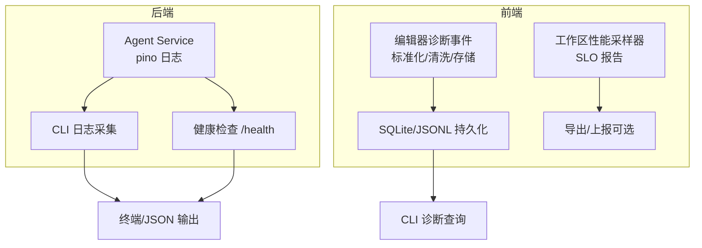
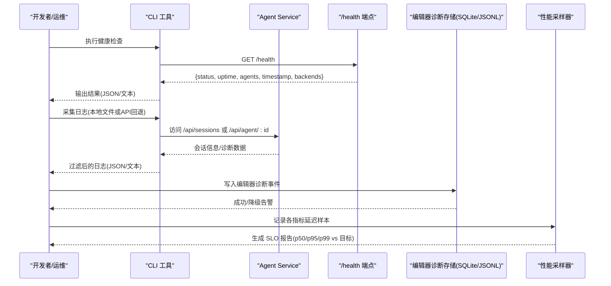
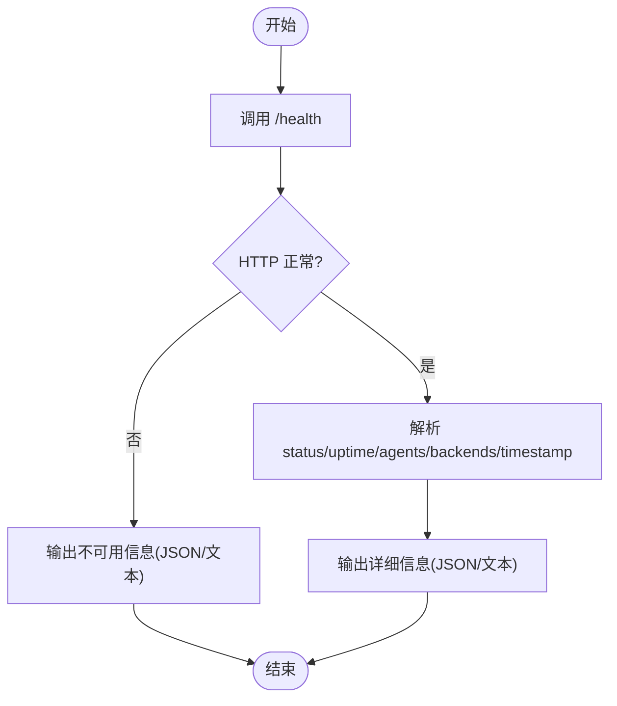
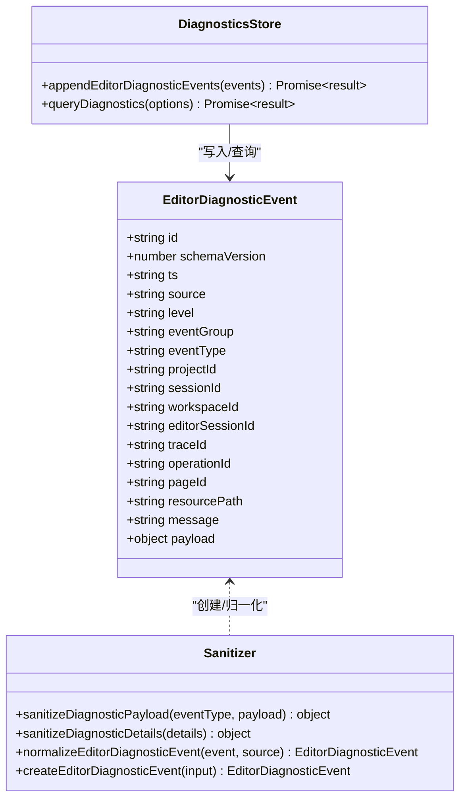
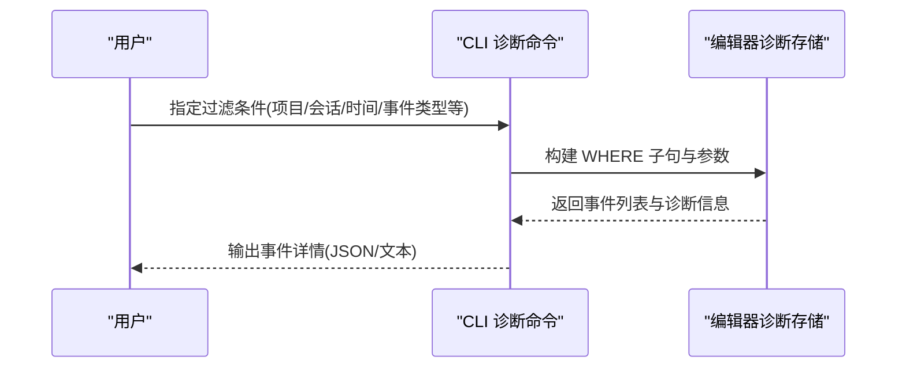
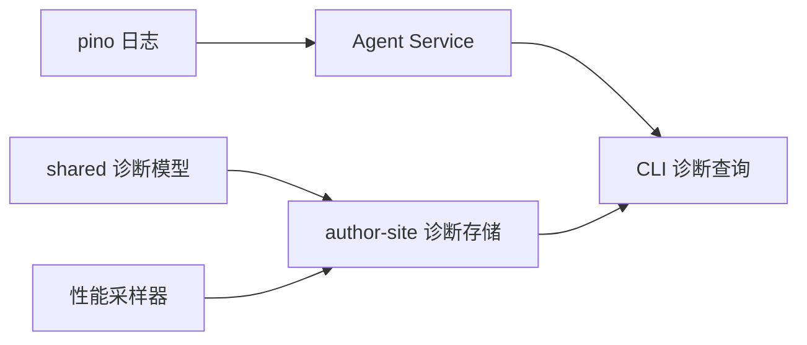

# 监控与日志

<cite>
**本文引用的文件**   
- [packages/agent-service/src/utils/logger.ts](file://packages/agent-service/src/utils/logger.ts)
- [OPS/CLI/src/commands/logs.ts](file://OPS/CLI/src/commands/logs.ts)
- [OPS/CLI/src/commands/health.ts](file://OPS/CLI/src/commands/health.ts)
- [packages/shared/src/diagnostics.ts](file://packages/shared/src/diagnostics.ts)
- [packages/author-site/src/lib/workspace-performance-sampling.ts](file://packages/author-site/src/lib/workspace-performance-sampling.ts)
- [packages/author-site/src/lib/editor-diagnostics/store.ts](file://packages/author-site/src/lib/editor-diagnostics/store.ts)
- [OPS/CLI/src/commands/diagnostics.ts](file://OPS/CLI/src/commands/diagnostics.ts)
</cite>

## 目录
1. [简介](#简介)
2. [项目结构](#项目结构)
3. [核心组件](#核心组件)
4. [架构总览](#架构总览)
5. [详细组件分析](#详细组件分析)
6. [依赖关系分析](#依赖关系分析)
7. [性能考虑](#性能考虑)
8. [故障排查指南](#故障排查指南)
9. [结论](#结论)
10. [附录](#附录)

## 简介
本文件面向 Workbench 平台的运维与研发人员，系统化说明结构化日志格式、性能监控指标、健康检查机制、错误追踪与诊断、日志分析工具以及监控最佳实践。文档基于仓库中现有实现进行梳理，帮助读者快速理解并落地可观测性方案。

## 项目结构
Workbench 的可观测性相关能力分布在以下位置：
- 后端服务日志：Agent Service 使用 pino 输出结构化 JSON 日志，支持通过环境变量控制级别与 pretty 传输。
- CLI 采集与展示：提供日志采集、会话诊断与健康检查命令，统一输出 JSON 或彩色文本。
- 前端诊断事件：编辑器侧定义统一的诊断事件模型、清洗与存储逻辑，支持 SQLite 与 JSONL 双写。
- 前端性能采样：工作区性能采样器按指标维度记录延迟样本，并提供 SLO 报告。

图表来源
- [packages/agent-service/src/utils/logger.ts:1-42](file://packages/agent-service/src/utils/logger.ts#L1-L42)
- [OPS/CLI/src/commands/logs.ts:1-294](file://OPS/CLI/src/commands/logs.ts#L1-L294)
- [OPS/CLI/src/commands/health.ts:1-90](file://OPS/CLI/src/commands/health.ts#L1-L90)
- [packages/shared/src/diagnostics.ts:1-540](file://packages/shared/src/diagnostics.ts#L1-L540)
- [packages/author-site/src/lib/editor-diagnostics/store.ts:190-433](file://packages/author-site/src/lib/editor-diagnostics/store.ts#L190-L433)
- [packages/author-site/src/lib/workspace-performance-sampling.ts:1-280](file://packages/author-site/src/lib/workspace-performance-sampling.ts#L1-L280)

章节来源
- [packages/agent-service/src/utils/logger.ts:1-42](file://packages/agent-service/src/utils/logger.ts#L1-L42)
- [OPS/CLI/src/commands/logs.ts:1-294](file://OPS/CLI/src/commands/logs.ts#L1-L294)
- [OPS/CLI/src/commands/health.ts:1-90](file://OPS/CLI/src/commands/health.ts#L1-L90)
- [packages/shared/src/diagnostics.ts:1-540](file://packages/shared/src/diagnostics.ts#L1-L540)
- [packages/author-site/src/lib/editor-diagnostics/store.ts:190-433](file://packages/author-site/src/lib/editor-diagnostics/store.ts#L190-L433)
- [packages/author-site/src/lib/workspace-performance-sampling.ts:1-280](file://packages/author-site/src/lib/workspace-performance-sampling.ts#L1-L280)

## 核心组件
- 结构化日志（后端）
  - 使用 pino 作为日志引擎，默认级别由环境变量控制，包含标准错误序列化与 pretty 传输。
  - 字段规范遵循 pino 默认约定（如 level、msg、time 等），并通过 serializers 规范化错误对象。
- 日志采集与过滤（CLI）
  - 优先读取本地日志文件；若不存在则回退到通过 API 收集会话诊断信息。
  - 支持按级别、模式、会话 ID 过滤，并以 JSON 或彩色文本输出。
- 健康检查（CLI）
  - 调用 /health 接口，返回服务状态、运行时间、活跃 Agent 数量、时间戳及后端列表等。
  - 支持 JSON 模式输出，便于自动化集成。
- 编辑器诊断事件（共享库 + 前端）
  - 统一事件模型，包含来源、级别、分组、类型、上下文标识与 payload。
  - 提供敏感信息与禁止键的清洗策略，确保隐私安全。
  - 存储层支持 SQLite 与 JSONL 双写，具备降级与告警能力。
- 工作区性能采样（前端）
  - 针对关键路径延迟进行采样，计算 p50/p95/p99 并与 SLO 目标对比生成报告。

章节来源
- [packages/agent-service/src/utils/logger.ts:1-42](file://packages/agent-service/src/utils/logger.ts#L1-L42)
- [OPS/CLI/src/commands/logs.ts:1-294](file://OPS/CLI/src/commands/logs.ts#L1-L294)
- [OPS/CLI/src/commands/health.ts:1-90](file://OPS/CLI/src/commands/health.ts#L1-L90)
- [packages/shared/src/diagnostics.ts:1-540](file://packages/shared/src/diagnostics.ts#L1-L540)
- [packages/author-site/src/lib/editor-diagnostics/store.ts:190-433](file://packages/author-site/src/lib/editor-diagnostics/store.ts#L190-L433)
- [packages/author-site/src/lib/workspace-performance-sampling.ts:1-280](file://packages/author-site/src/lib/workspace-performance-sampling.ts#L1-L280)

## 架构总览
下图展示了从服务启动、日志输出、健康检查到前端诊断与性能采样的整体链路。

图表来源
- [OPS/CLI/src/commands/health.ts:1-90](file://OPS/CLI/src/commands/health.ts#L1-L90)
- [OPS/CLI/src/commands/logs.ts:1-294](file://OPS/CLI/src/commands/logs.ts#L1-L294)
- [packages/author-site/src/lib/editor-diagnostics/store.ts:190-433](file://packages/author-site/src/lib/editor-diagnostics/store.ts#L190-L433)
- [packages/author-site/src/lib/workspace-performance-sampling.ts:1-280](file://packages/author-site/src/lib/workspace-performance-sampling.ts#L1-L280)

## 详细组件分析

### 结构化日志格式设计
- 日志级别
  - 后端采用 pino 内置级别，CLI 映射为 trace/debug/info/warn/error/fatal，数值对应 10/20/30/40/50/60。
- 字段规范
  - 基础字段：level、msg、time（ISO 字符串或毫秒时间戳）、name（服务名）。
  - 错误对象：通过标准序列化器将 err/error 规范化为结构化对象。
  - 业务字段：在 info/warn/error 调用时以对象形式附加，便于聚合与检索。
- 日志聚合策略
  - 开发环境：pino-pretty 输出彩色可读日志，便于调试。
  - 生产环境：建议将 stdout 接入集中式日志系统（如 ELK/Loki），结合 JSON 行解析与索引。
  - CLI 回退：当未找到本地日志文件时，通过 API 拉取会话诊断信息作为替代。

章节来源
- [packages/agent-service/src/utils/logger.ts:1-42](file://packages/agent-service/src/utils/logger.ts#L1-L42)
- [OPS/CLI/src/commands/logs.ts:1-294](file://OPS/CLI/src/commands/logs.ts#L1-L294)

### 性能监控指标
- 指标维度
  - autosave-debounce：停止输入到“已自动保存”的等待时间。
  - queue-wait：mutation 队列等待时间。
  - commit-latency：Authority commit 延迟。
  - remote-update-latency：远程协作更新延迟。
  - draft-preview-latency：React draft 预览延迟。
  - projection-latency：HTML/CSS/Sketch draft 预览延迟。
  - reconnect-convergence：WebSocket 重连收敛时间。
  - canonical-lag：Canonical 物化延迟（空闲）。
- 统计方法
  - 环形缓冲区固定容量，避免内存泄漏。
  - 计算 p50/p95/p99/min/max/count，并与 SLO 目标对比。
- SLO 报告
  - 每个指标独立评估是否达标，allPassed 汇总整体情况。
  - 适用于发布前验证与运行时抽检。

章节来源
- [packages/author-site/src/lib/workspace-performance-sampling.ts:1-280](file://packages/author-site/src/lib/workspace-performance-sampling.ts#L1-L280)

### 健康检查机制
- 服务可用性检测
  - CLI 调用 /health，校验 HTTP 状态码与响应体关键字段。
- 依赖服务状态监控
  - 响应中包含 backends 列表，用于识别可用后端引擎。
- 健康状态上报
  - 支持 JSON 模式输出，便于外部监控系统抓取与告警。
  - 失败场景给出明确提示与可能原因，辅助快速定位。

图表来源
- [OPS/CLI/src/commands/health.ts:1-90](file://OPS/CLI/src/commands/health.ts#L1-L90)

章节来源
- [OPS/CLI/src/commands/health.ts:1-90](file://OPS/CLI/src/commands/health.ts#L1-L90)

### 错误追踪与诊断
- 异常堆栈收集
  - 后端通过 pino 标准序列化器规范化错误对象，便于集中分析与关联。
- 错误分类
  - 前端诊断事件通过 eventGroup/eventType 进行分类，配合 level 区分严重度。
  - payload 白名单与禁止键策略保障安全与一致性。
- 告警通知机制
  - 当前实现未内建告警通道，建议对接外部告警系统（如 Prometheus+Alertmanager、企业 IM）。
  - 可通过 CLI 定期巡检 /health 与 /api/sessions，发现异常后触发通知。

章节来源
- [packages/agent-service/src/utils/logger.ts:1-42](file://packages/agent-service/src/utils/logger.ts#L1-L42)
- [packages/shared/src/diagnostics.ts:1-540](file://packages/shared/src/diagnostics.ts#L1-L540)
- [OPS/CLI/src/commands/health.ts:1-90](file://OPS/CLI/src/commands/health.ts#L1-L90)

### 日志分析工具
- 日志查询语法
  - 级别过滤：trace/debug/info/warn/error/fatal。
  - 模式匹配：对 msg 与整行 JSON 进行子串匹配。
  - 会话筛选：按 sessionId 过滤相关条目。
- 可视化展示
  - CLI 支持彩色文本输出，便于终端阅读。
  - JSON 模式输出便于导入可视化工具（如 Kibana、Grafana Loki Explore）。
- 趋势分析功能
  - 前端性能采样器提供 SLO 报告，可用于趋势与回归分析。
  - 建议将 SLO 报告与外部时序数据库对接，形成仪表盘。

章节来源
- [OPS/CLI/src/commands/logs.ts:1-294](file://OPS/CLI/src/commands/logs.ts#L1-L294)
- [packages/author-site/src/lib/workspace-performance-sampling.ts:1-280](file://packages/author-site/src/lib/workspace-performance-sampling.ts#L1-L280)

### 编辑器诊断事件模型与存储
- 事件模型
  - 统一字段：id、schemaVersion、ts、source、level、eventGroup、eventType、上下文标识（projectId/sessionId/workspaceId/editorSessionId/traceId/operationId/pageId/resourcePath/message）与 payload。
- 数据清洗
  - 敏感键匹配与禁止键摘要，限制嵌套深度与长度，防止泄露与膨胀。
- 存储与查询
  - 支持 SQLite 与 JSONL 双写，具备降级与告警能力。
  - 查询条件支持多字段组合与时间范围过滤，限制最大返回条数。

图表来源
- [packages/shared/src/diagnostics.ts:1-540](file://packages/shared/src/diagnostics.ts#L1-L540)
- [packages/author-site/src/lib/editor-diagnostics/store.ts:190-433](file://packages/author-site/src/lib/editor-diagnostics/store.ts#L190-L433)

章节来源
- [packages/shared/src/diagnostics.ts:1-540](file://packages/shared/src/diagnostics.ts#L1-L540)
- [packages/author-site/src/lib/editor-diagnostics/store.ts:190-433](file://packages/author-site/src/lib/editor-diagnostics/store.ts#L190-L433)

### 诊断事件查询流程（CLI）

图表来源
- [OPS/CLI/src/commands/diagnostics.ts:308-353](file://OPS/CLI/src/commands/diagnostics.ts#L308-L353)
- [packages/author-site/src/lib/editor-diagnostics/store.ts:394-433](file://packages/author-site/src/lib/editor-diagnostics/store.ts#L394-L433)

章节来源
- [OPS/CLI/src/commands/diagnostics.ts:308-353](file://OPS/CLI/src/commands/diagnostics.ts#L308-L353)
- [packages/author-site/src/lib/editor-diagnostics/store.ts:394-433](file://packages/author-site/src/lib/editor-diagnostics/store.ts#L394-L433)

## 依赖关系分析
- 模块耦合
  - CLI 与后端通过 REST 接口交互，低耦合且易于替换实现。
  - 前端诊断事件模型集中在 shared 包，前后端共享契约，降低不一致风险。
- 外部依赖
  - pino 与 pino-pretty 负责日志输出与格式化。
  - SQLite/JSONL 作为本地持久化介质，提升离线诊断能力。
- 潜在循环依赖
  - 当前实现未见循环引用，模块职责清晰。

图表来源
- [packages/agent-service/src/utils/logger.ts:1-42](file://packages/agent-service/src/utils/logger.ts#L1-L42)
- [OPS/CLI/src/commands/logs.ts:1-294](file://OPS/CLI/src/commands/logs.ts#L1-L294)
- [packages/shared/src/diagnostics.ts:1-540](file://packages/shared/src/diagnostics.ts#L1-L540)
- [packages/author-site/src/lib/editor-diagnostics/store.ts:190-433](file://packages/author-site/src/lib/editor-diagnostics/store.ts#L190-L433)
- [packages/author-site/src/lib/workspace-performance-sampling.ts:1-280](file://packages/author-site/src/lib/workspace-performance-sampling.ts#L1-L280)

章节来源
- [packages/agent-service/src/utils/logger.ts:1-42](file://packages/agent-service/src/utils/logger.ts#L1-L42)
- [OPS/CLI/src/commands/logs.ts:1-294](file://OPS/CLI/src/commands/logs.ts#L1-L294)
- [packages/shared/src/diagnostics.ts:1-540](file://packages/shared/src/diagnostics.ts#L1-L540)
- [packages/author-site/src/lib/editor-diagnostics/store.ts:190-433](file://packages/author-site/src/lib/editor-diagnostics/store.ts#L190-L433)
- [packages/author-site/src/lib/workspace-performance-sampling.ts:1-280](file://packages/author-site/src/lib/workspace-performance-sampling.ts#L1-L280)

## 性能考虑
- 日志开销
  - 生产环境建议关闭 pretty 传输，直接输出 JSON 行，减少 CPU 与 I/O 压力。
  - 合理设置 LOG_LEVEL，避免 debug/trace 在高负载下放大开销。
- 采样缓冲
  - 性能采样器使用固定容量环形缓冲区，避免无限增长导致内存泄漏。
  - 分位数计算在内存中进行，适合短时窗口分析；长期趋势需导出至时序数据库。
- 存储选择
  - SQLite 适合本地离线诊断；高并发写入场景建议引入异步落盘与批处理。
  - JSONL 作为降级路径，保证可用性但查询效率较低。

[本节为通用指导，不直接分析具体文件]

## 故障排查指南
- 服务不可用
  - 现象：CLI 健康检查返回非 2xx 或连接异常。
  - 排查：确认服务地址、端口与防火墙策略；查看后端日志与进程状态。
- 无日志文件
  - 现象：CLI 提示未找到日志文件，自动回退到 API 诊断。
  - 排查：确认日志输出路径与权限；在生产环境中将 stdout 接入集中式日志系统。
- 诊断事件缺失或不完整
  - 现象：查询结果为空或检测到事件间隙。
  - 排查：检查 SQLite/JSONL 双写状态与降级告警；确认客户端写入时机与网络状况。
- 性能 SLO 不达标
  - 现象：SLO 报告 allPassed=false。
  - 排查：定位具体指标（如 remote-update-latency、projection-latency），结合诊断事件与链路追踪分析瓶颈。

章节来源
- [OPS/CLI/src/commands/health.ts:1-90](file://OPS/CLI/src/commands/health.ts#L1-L90)
- [OPS/CLI/src/commands/logs.ts:1-294](file://OPS/CLI/src/commands/logs.ts#L1-L294)
- [packages/author-site/src/lib/editor-diagnostics/store.ts:190-433](file://packages/author-site/src/lib/editor-diagnostics/store.ts#L190-L433)
- [packages/author-site/src/lib/workspace-performance-sampling.ts:1-280](file://packages/author-site/src/lib/workspace-performance-sampling.ts#L1-L280)

## 结论
Workbench 平台已具备较为完善的可观测性基础：后端结构化日志、CLI 健康检查与日志采集、前端诊断事件模型与存储、以及工作区性能采样与 SLO 报告。建议在现有基础上完善告警通知与可视化仪表盘，并将关键指标纳入容量规划与变更评审流程，持续提升稳定性与用户体验。

[本节为总结性内容，不直接分析具体文件]

## 附录
- 指标命名规范
  - 使用短横线分隔的英文小写命名，语义清晰，避免缩写歧义。
  - 示例：remote-update-latency、commit-latency、reconnect-convergence。
- 告警阈值设置
  - 基于 SLO 目标设定 p95 上限，结合历史基线与业务容忍度动态调整。
  - 建议分层告警：警告（接近阈值）与严重（超过阈值）。
- 容量规划建议
  - 根据峰值 QPS 与平均日志大小估算存储与带宽需求。
  - 对高频指标采样率与保留周期进行分级管理，平衡成本与可追溯性。

[本节为通用指导，不直接分析具体文件]