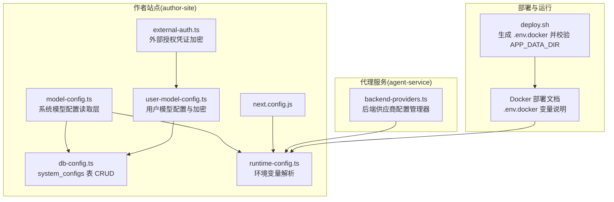
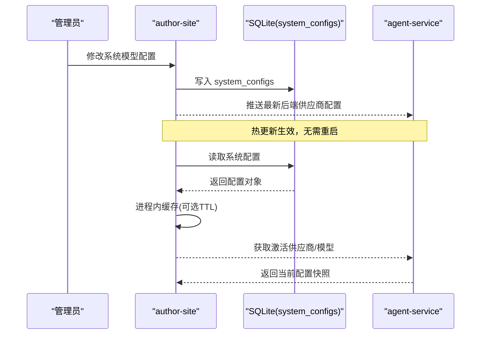
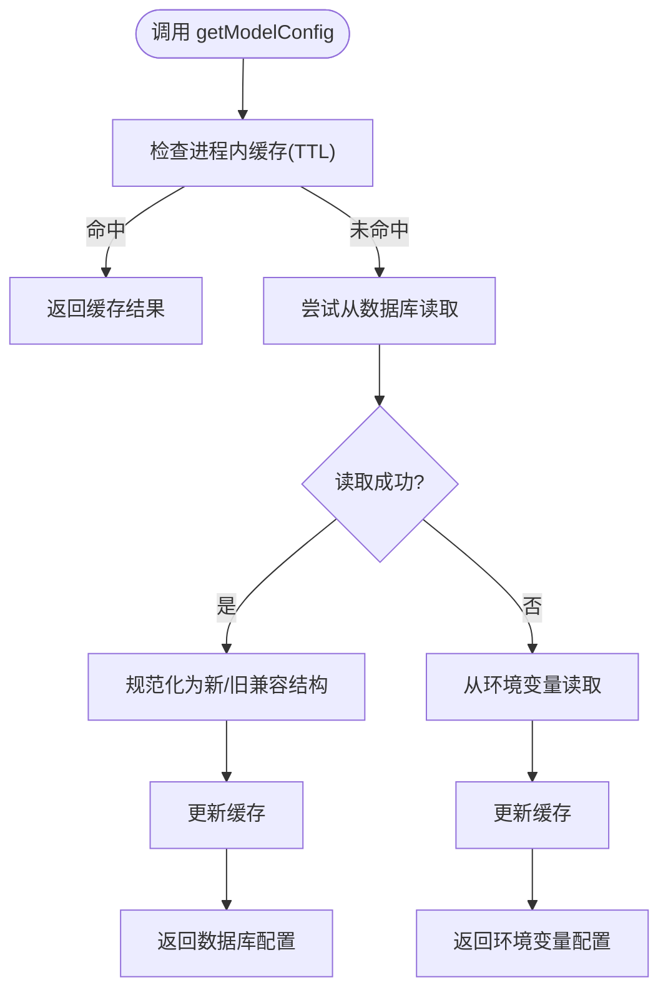
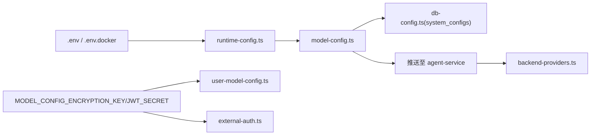

# 配置管理

<cite>
**本文引用的文件**   
- [packages/author-site/src/lib/model-config.ts](file://packages/author-site/src/lib/model-config.ts)
- [packages/author-site/src/lib/db-config.ts](file://packages/author-site/src/lib/db-config.ts)
- [packages/agent-service/src/config/backend-providers.ts](file://packages/agent-service/src/config/backend-providers.ts)
- [packages/author-site/src/lib/runtime-config.ts](file://packages/author-site/src/lib/runtime-config.ts)
- [packages/author-site/src/lib/user-model-config.ts](file://packages/author-site/src/lib/user-model-config.ts)
- [packages/author-site/src/lib/external-auth.ts](file://packages/author-site/src/lib/external-auth.ts)
- [packages/author-site/next.config.js](file://packages/author-site/next.config.js)
- [docs/项目文档/创作端/06-基础设施/技术/03_Docker部署方案.md](file://docs/项目文档/创作端/06-基础设施/技术/03_Docker部署方案.md)
- [scripts/deploy.sh](file://scripts/deploy.sh)
</cite>

## 目录
1. [简介](#简介)
2. [项目结构](#项目结构)
3. [核心组件](#核心组件)
4. [架构总览](#架构总览)
5. [详细组件分析](#详细组件分析)
6. [依赖关系分析](#依赖关系分析)
7. [性能考虑](#性能考虑)
8. [故障排查指南](#故障排查指南)
9. [结论](#结论)
10. [附录](#附录)

## 简介
本文件面向 Workbench 平台的配置管理体系，覆盖以下主题：
- 配置文件组织结构与环境变量管理
- 配置层次结构与默认值策略
- 动态配置更新机制（热重载、验证与回滚）
- 服务特定配置（数据库连接、缓存、日志级别、性能调优）
- 安全配置（敏感信息加密、密钥管理与访问控制）
- 环境差异化配置（开发、测试、生产隔离与注入）
- 最佳实践（模板、审计、版本控制）
- 故障排查与调试工具使用

## 项目结构
Workbench 的配置体系由“环境变量 + 数据库持久化 + 进程内缓存”构成，主要涉及以下模块：
- 作者站点（author-site）：负责系统级模型配置读写、运行时环境变量解析、用户模型配置与安全存储
- 代理服务（agent-service）：负责后端供应商配置加载与运行时热更新
- 部署脚本与 Docker 文档：负责环境差异化的环境变量注入与数据目录挂载



图表来源
- [packages/author-site/src/lib/model-config.ts:1-219](file://packages/author-site/src/lib/model-config.ts#L1-L219)
- [packages/author-site/src/lib/db-config.ts:1-130](file://packages/author-site/src/lib/db-config.ts#L1-L130)
- [packages/author-site/src/lib/runtime-config.ts:1-80](file://packages/author-site/src/lib/runtime-config.ts#L1-L80)
- [packages/author-site/src/lib/user-model-config.ts:1-271](file://packages/author-site/src/lib/user-model-config.ts#L1-L271)
- [packages/author-site/src/lib/external-auth.ts:44-89](file://packages/author-site/src/lib/external-auth.ts#L44-L89)
- [packages/author-site/next.config.js:1-24](file://packages/author-site/next.config.js#L1-L24)
- [docs/项目文档/创作端/06-基础设施/技术/03_Docker部署方案.md:151-169](file://docs/项目文档/创作端/06-基础设施/技术/03_Docker部署方案.md#L151-L169)
- [scripts/deploy.sh:444-471](file://scripts/deploy.sh#L444-L471)

章节来源
- [packages/author-site/src/lib/model-config.ts:1-219](file://packages/author-site/src/lib/model-config.ts#L1-L219)
- [packages/author-site/src/lib/db-config.ts:1-130](file://packages/author-site/src/lib/db-config.ts#L1-L130)
- [packages/author-site/src/lib/runtime-config.ts:1-80](file://packages/author-site/src/lib/runtime-config.ts#L1-L80)
- [packages/agent-service/src/config/backend-providers.ts:1-188](file://packages/agent-service/src/config/backend-providers.ts#L1-L188)
- [packages/author-site/src/lib/user-model-config.ts:1-271](file://packages/author-site/src/lib/user-model-config.ts#L1-L271)
- [packages/author-site/src/lib/external-auth.ts:44-89](file://packages/author-site/src/lib/external-auth.ts#L44-L89)
- [packages/author-site/next.config.js:1-24](file://packages/author-site/next.config.js#L1-L24)
- [docs/项目文档/创作端/06-基础设施/技术/03_Docker部署方案.md:151-169](file://docs/项目文档/创作端/06-基础设施/技术/03_Docker部署方案.md#L151-L169)
- [scripts/deploy.sh:444-471](file://scripts/deploy.sh#L444-L471)

## 核心组件
- 系统模型配置读取层（author-site）
  - 优先从数据库 system_configs 表读取，失败或不存在时回退到环境变量
  - 提供进程内缓存与失效接口，支持服务端同步场景的只读环境变量模式
- 数据库配置读写封装（author-site）
  - 对 system_configs 表进行增删改查，支持元信息（更新时间、操作者）
- 运行时环境变量解析（author-site）
  - 统一解析 NEXT_PUBLIC_* 与服务端专用环境变量，提供默认值与类型转换
- 后端供应商配置管理器（agent-service）
  - 启动时从环境变量加载，运行时接收 author-site 推送实现热更新
- 用户模型配置与安全存储（author-site）
  - 用户级 API Key 等敏感信息采用 AES-256-GCM 加密存储，并提供安全返回视图
- 外部授权凭证加密（author-site）
  - 外部认证凭据同样采用 AES-256-GCM 加密，密钥来源于环境变量
- 部署与环境注入
  - Docker 部署文档定义关键环境变量；部署脚本生成 .env.docker 并校验数据目录

章节来源
- [packages/author-site/src/lib/model-config.ts:1-219](file://packages/author-site/src/lib/model-config.ts#L1-L219)
- [packages/author-site/src/lib/db-config.ts:1-130](file://packages/author-site/src/lib/db-config.ts#L1-L130)
- [packages/author-site/src/lib/runtime-config.ts:1-80](file://packages/author-site/src/lib/runtime-config.ts#L1-L80)
- [packages/agent-service/src/config/backend-providers.ts:1-188](file://packages/agent-service/src/config/backend-providers.ts#L1-L188)
- [packages/author-site/src/lib/user-model-config.ts:1-271](file://packages/author-site/src/lib/user-model-config.ts#L1-L271)
- [packages/author-site/src/lib/external-auth.ts:44-89](file://packages/author-site/src/lib/external-auth.ts#L44-L89)
- [docs/项目文档/创作端/06-基础设施/技术/03_Docker部署方案.md:151-169](file://docs/项目文档/创作端/06-基础设施/技术/03_Docker部署方案.md#L151-L169)
- [scripts/deploy.sh:444-471](file://scripts/deploy.sh#L444-L471)

## 架构总览
配置生命周期与数据流如下：
- 启动阶段：author-site 解析环境变量并初始化默认值；agent-service 从环境变量加载后端供应商配置
- 运行阶段：author-site 将系统配置写入数据库，并主动推送至 agent-service 实现热更新
- 读取阶段：author-site 优先读库，失败则回退环境变量；agent-service 优先使用内存中最新配置



图表来源
- [packages/author-site/src/lib/model-config.ts:165-201](file://packages/author-site/src/lib/model-config.ts#L165-L201)
- [packages/author-site/src/lib/db-config.ts:33-93](file://packages/author-site/src/lib/db-config.ts#L33-L93)
- [packages/agent-service/src/config/backend-providers.ts:28-113](file://packages/agent-service/src/config/backend-providers.ts#L28-L113)

## 详细组件分析

### 系统模型配置读取层（author-site）
- 功能要点
  - 优先级：数据库 > 环境变量
  - 兼容新旧结构：enabledModels/autoEnableRules 与 allowedPrefixes/nameFilters/defaultModelIds/blacklist 双向映射
  - 进程内缓存与失效接口，避免频繁读库
  - 提供同步读取函数用于构建期或无法异步的场景（仅环境变量）
- 数据结构
  - ModelConfigData：包含前端启用规则、多模态模型列表、后端供应商配置
- 复杂度
  - 读取为 O(1) 缓存命中或一次数据库查询；规范化为 O(n) 字段合并



图表来源
- [packages/author-site/src/lib/model-config.ts:165-201](file://packages/author-site/src/lib/model-config.ts#L165-L201)
- [packages/author-site/src/lib/model-config.ts:90-163](file://packages/author-site/src/lib/model-config.ts#L90-L163)
- [packages/author-site/src/lib/runtime-config.ts:72-79](file://packages/author-site/src/lib/runtime-config.ts#L72-L79)

章节来源
- [packages/author-site/src/lib/model-config.ts:1-219](file://packages/author-site/src/lib/model-config.ts#L1-L219)
- [packages/author-site/src/lib/runtime-config.ts:1-80](file://packages/author-site/src/lib/runtime-config.ts#L1-L80)

### 数据库配置读写封装（author-site）
- 功能要点
  - 提供 read/write/list/delete/initDefault 等基础能力
  - 支持元信息（updated_at、updated_by），便于审计与回滚
- 典型用法
  - 写入系统配置后触发下游服务热更新
  - 初始化默认配置，确保首次启动可用

章节来源
- [packages/author-site/src/lib/db-config.ts:1-130](file://packages/author-site/src/lib/db-config.ts#L1-L130)

### 运行时环境变量解析（author-site）
- 功能要点
  - 统一解析 NEXT_PUBLIC_* 与服务端专用变量
  - 提供默认值与类型转换（CSV 拆分、整数解析、URL 清理）
- 关键变量示例
  - NEXT_PUBLIC_ALLOWED_MODEL_PREFIXES、NEXT_PUBLIC_MODEL_NAME_FILTERS、NEXT_PUBLIC_DEFAULT_MODEL_IDS、NEXT_PUBLIC_MODEL_BLACKLIST
  - AGENT_SERVICE_URL、SCREENSHOT_SERVICE_URL、INTERNAL_API_TOKEN 等

章节来源
- [packages/author-site/src/lib/runtime-config.ts:1-80](file://packages/author-site/src/lib/runtime-config.ts#L1-L80)
- [packages/author-site/next.config.js:1-24](file://packages/author-site/next.config.js#L1-L24)

### 后端供应商配置管理器（agent-service）
- 功能要点
  - 启动时从环境变量 PI_AGENT_PROVIDERS 加载
  - 运行时通过 setConfig 接收 author-site 推送，实现热更新
  - 提供 getActiveProviderId/getActiveModelId 等便捷方法
- 设计约束
  - 进程边界清晰：不直连数据库，依赖 author-site 推送
  - 容错：无效 JSON 或非法条目会被记录警告并跳过

```mermaid
classDiagram
class BackendProvidersManager {
-config : BackendProvidersConfig
-loaded : boolean
+initialize() void
+setConfig(config) void
+getConfig() BackendProvidersConfig
+getProvider(id) BackendProvider?
+getActiveProviderId() string?
+getActiveModelId() string?
+getProviderModels(providerId) {id,label}[]
}
```

图表来源
- [packages/agent-service/src/config/backend-providers.ts:18-178](file://packages/agent-service/src/config/backend-providers.ts#L18-L178)

章节来源
- [packages/agent-service/src/config/backend-providers.ts:1-188](file://packages/agent-service/src/config/backend-providers.ts#L1-L188)

### 用户模型配置与安全存储（author-site）
- 功能要点
  - 用户级 provider 配置（含 API Key）以 AES-256-GCM 加密存储
  - 提供安全视图（SafeUserModelConfig），对外不暴露明文密钥
  - 支持 upsert/read/delete 等操作，自动去重与 URL 校验
- 密钥来源
  - MODEL_CONFIG_ENCRYPTION_KEY 或 JWT_SECRET，生产环境必须设置强密钥

章节来源
- [packages/author-site/src/lib/user-model-config.ts:1-271](file://packages/author-site/src/lib/user-model-config.ts#L1-L271)
- [packages/author-site/src/lib/external-auth.ts:44-89](file://packages/author-site/src/lib/external-auth.ts#L44-L89)

### 环境变量与部署注入
- Docker 部署文档定义了关键环境变量及其用途（如模型白名单、服务地址、CORS、JWT_SECRET、内部令牌等）
- 部署脚本会生成 .env.docker 并在远程主机校验 APP_DATA_DIR 是否存在，必要时可创建空目录（需显式允许）

章节来源
- [docs/项目文档/创作端/06-基础设施/技术/03_Docker部署方案.md:151-169](file://docs/项目文档/创作端/06-基础设施/技术/03_Docker部署方案.md#L151-L169)
- [scripts/deploy.sh:444-471](file://scripts/deploy.sh#L444-L471)

## 依赖关系分析
- author-site 与 agent-service 解耦：通过内部接口推送配置，避免跨进程直接访问数据库
- 配置源优先级：
  - author-site：数据库 > 环境变量
  - agent-service：内存最新配置 > 环境变量（启动 fallback）
- 安全依赖：
  - 用户与外部授权凭据均依赖环境变量中的加密密钥



图表来源
- [packages/author-site/src/lib/runtime-config.ts:1-80](file://packages/author-site/src/lib/runtime-config.ts#L1-L80)
- [packages/author-site/src/lib/model-config.ts:1-219](file://packages/author-site/src/lib/model-config.ts#L1-L219)
- [packages/author-site/src/lib/db-config.ts:1-130](file://packages/author-site/src/lib/db-config.ts#L1-L130)
- [packages/agent-service/src/config/backend-providers.ts:1-188](file://packages/agent-service/src/config/backend-providers.ts#L1-L188)
- [packages/author-site/src/lib/user-model-config.ts:1-271](file://packages/author-site/src/lib/user-model-config.ts#L1-L271)
- [packages/author-site/src/lib/external-auth.ts:44-89](file://packages/author-site/src/lib/external-auth.ts#L44-L89)

## 性能考虑
- 进程内缓存：author-site 对系统模型配置设置 TTL，减少数据库压力
- 最小化网络往返：agent-service 通过内存配置提供服务，避免每次请求都拉取远端配置
- 批量与去重：用户模型配置在保存前对 models 去重，降低存储与传输开销
- 超时与重试：截图服务代理超时可通过环境变量调整，避免长尾阻塞

[本节为通用指导，不直接分析具体文件]

## 故障排查指南
- 配置未生效
  - 检查 author-site 是否成功写入 system_configs，并确认已推送至 agent-service
  - 查看 agent-service 日志中关于后端供应商配置的加载与更新记录
- 环境变量未注入
  - 确认 next.config.js 是否正确加载根目录 .env 并注入到 process.env
  - 核对 Docker 部署生成的 .env.docker 是否包含必要变量
- 敏感信息解密失败
  - 检查 MODEL_CONFIG_ENCRYPTION_KEY 或 JWT_SECRET 是否与加密时一致
  - 确认外部授权凭据格式是否匹配 v1 规范
- 数据目录问题
  - 部署脚本会在远程主机校验 APP_DATA_DIR，若不存在且未允许创建，部署将中止

章节来源
- [packages/author-site/next.config.js:1-24](file://packages/author-site/next.config.js#L1-L24)
- [packages/agent-service/src/config/backend-providers.ts:52-94](file://packages/agent-service/src/config/backend-providers.ts#L52-L94)
- [packages/author-site/src/lib/user-model-config.ts:45-88](file://packages/author-site/src/lib/user-model-config.ts#L45-L88)
- [packages/author-site/src/lib/external-auth.ts:68-89](file://packages/author-site/src/lib/external-auth.ts#L68-L89)
- [scripts/deploy.sh:444-471](file://scripts/deploy.sh#L444-L471)

## 结论
Workbench 的配置体系以“环境变量 + 数据库持久化 + 进程内缓存”为核心，结合“推送式热更新”，在保证灵活性的同时兼顾了安全性与可运维性。通过明确的环境差异化与严格的敏感信息加密策略，平台能够在多环境下稳定运行并快速响应配置变更。

[本节为总结性内容，不直接分析具体文件]

## 附录

### 环境变量清单（节选）
- 模型与前端
  - NEXT_PUBLIC_ALLOWED_MODEL_PREFIXES
  - NEXT_PUBLIC_MODEL_NAME_FILTERS
  - NEXT_PUBLIC_DEFAULT_MODEL_IDS
  - NEXT_PUBLIC_MODEL_BLACKLIST
- 服务地址
  - NEXT_PUBLIC_AGENT_SERVICE_URL / AGENT_SERVICE_URL
  - NEXT_PUBLIC_SCREENSHOT_SERVICE_URL / SCREENSHOT_SERVICE_URL
- 安全与鉴权
  - JWT_SECRET
  - INTERNAL_API_TOKEN
  - MODEL_CONFIG_ENCRYPTION_KEY
- 其他
  - CORS_ORIGINS
  - PREVIEW_RUNTIME_SOURCE
  - USE_SECURE_COOKIE
  - FIGMA_OAUTH_CLIENT_ID / CLIENT_SECRET / REDIRECT_URI / SCOPES

章节来源
- [docs/项目文档/创作端/06-基础设施/技术/03_Docker部署方案.md:151-169](file://docs/项目文档/创作端/06-基础设施/技术/03_Docker部署方案.md#L151-L169)
- [packages/author-site/src/lib/runtime-config.ts:1-80](file://packages/author-site/src/lib/runtime-config.ts#L1-L80)

### 配置最佳实践
- 模板化
  - 使用 .env.docker 作为部署模板，区分开发/测试/生产
- 审计与版本控制
  - 利用 system_configs 的 updated_at/updated_by 字段进行变更追踪
  - 将关键配置变更纳入发布流程与变更记录
- 回滚策略
  - 基于 updated_at 选择最近一次有效配置进行恢复
  - 配合推送幂等与校验，确保回滚过程稳定

[本节为通用指导，不直接分析具体文件]