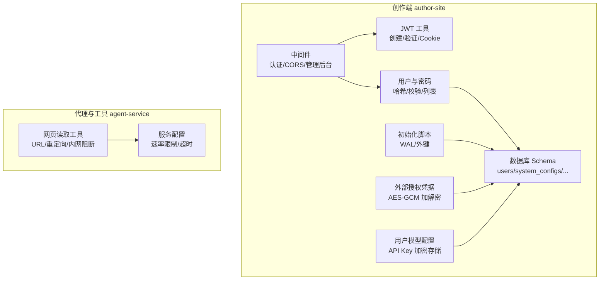
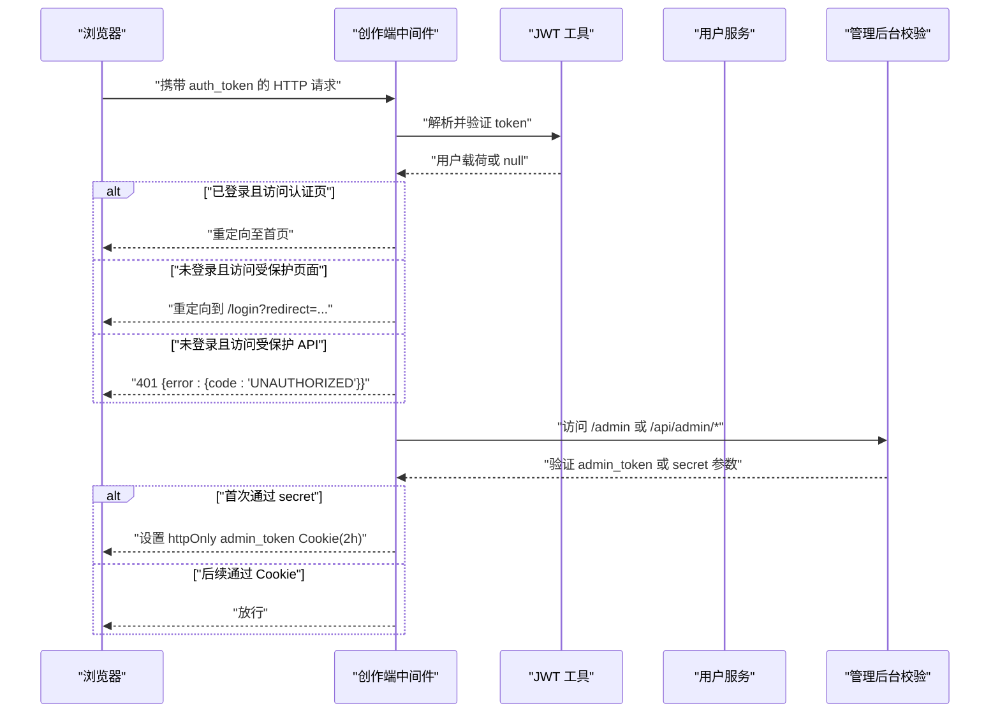
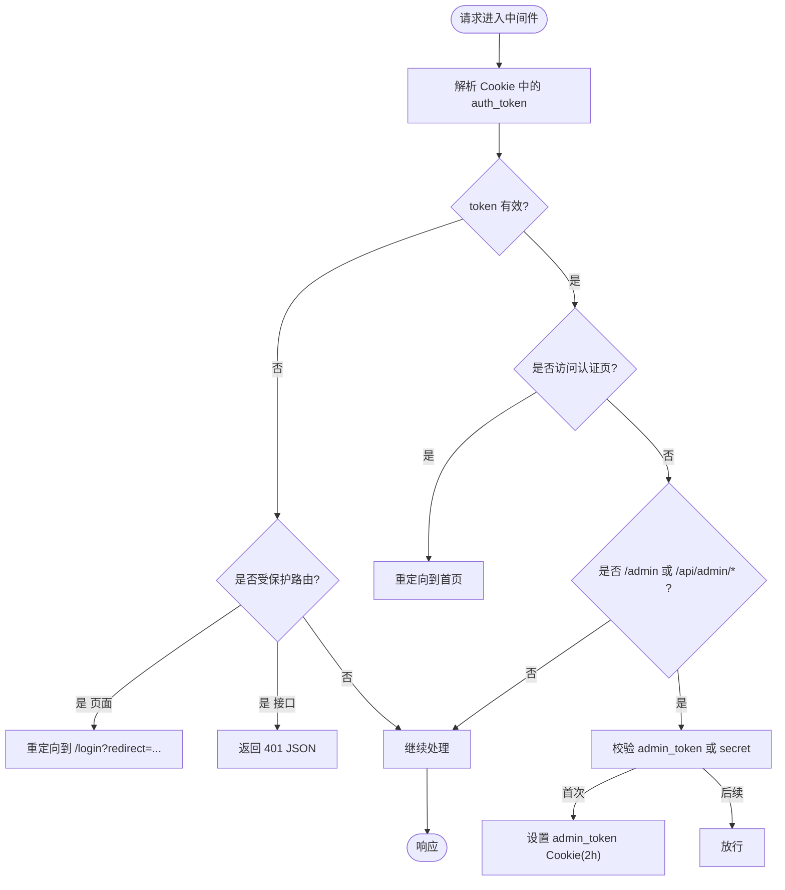
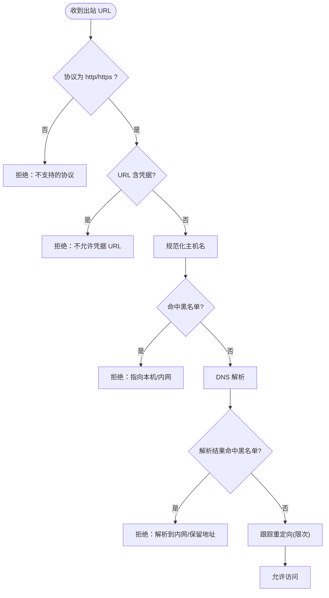
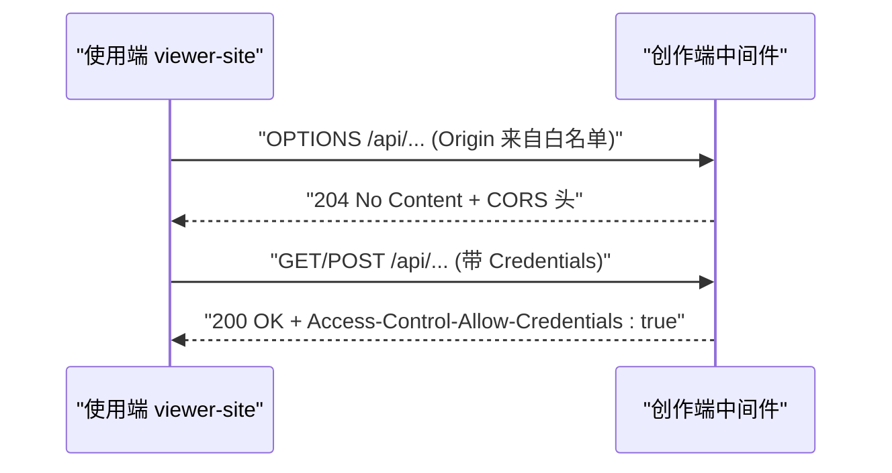
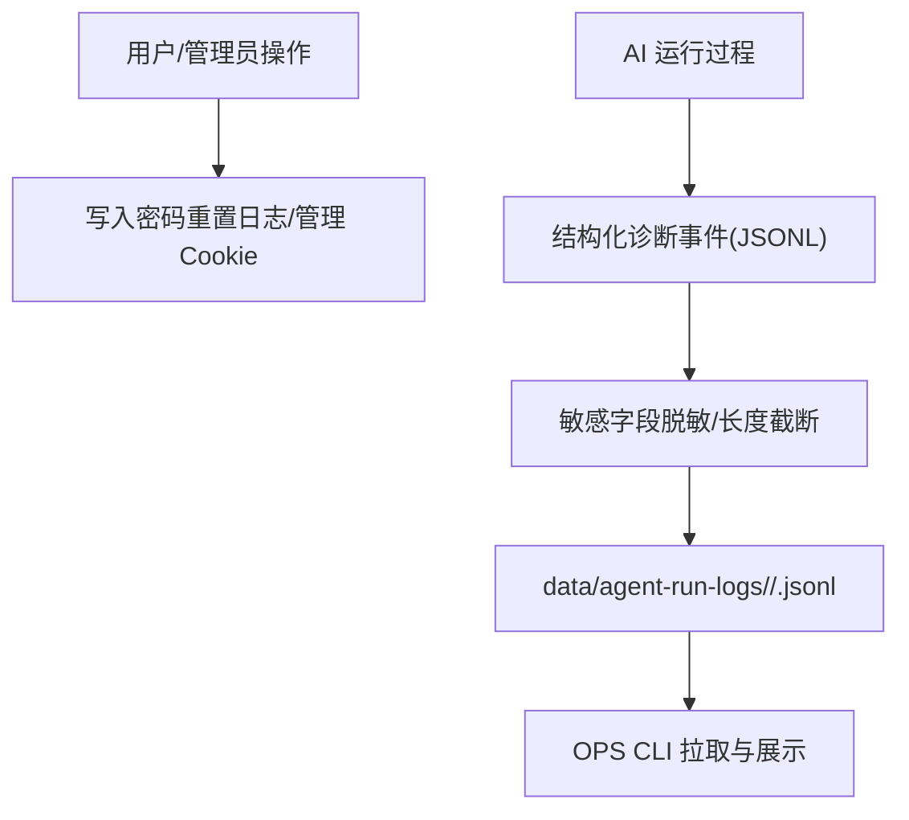
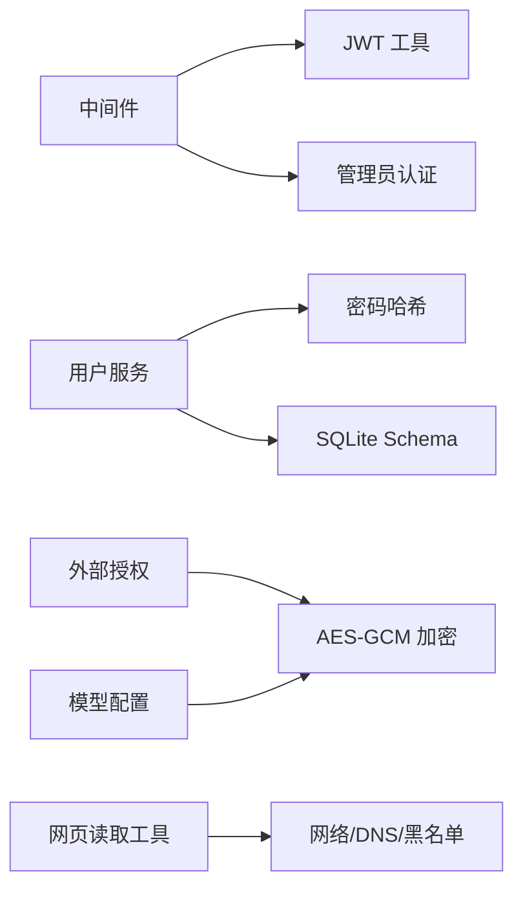

# 数据安全

<cite>
**本文引用的文件**   
- [packages/author-site/src/middleware.ts](file://packages/author-site/src/middleware.ts)
- [packages/author-site/src/lib/auth/jwt.ts](file://packages/author-site/src/lib/auth/jwt.ts)
- [packages/author-site/src/lib/user.ts](file://packages/author-site/src/lib/user.ts)
- [packages/author-site/src/lib/auth/password.ts](file://packages/author-site/src/lib/auth/password.ts)
- [packages/author-site/src/lib/db/schema.ts](file://packages/author-site/src/lib/db/schema.ts)
- [packages/author-site/scripts/init-db.js](file://packages/author-site/scripts/init-db.js)
- [packages/author-site/src/lib/user-model-config.ts](file://packages/author-site/src/lib/user-model-config.ts)
- [packages/author-site/src/lib/external-auth.ts](file://packages/author-site/src/lib/external-auth.ts)
- [docs/项目文档/创作端/08-管理后台/技术/01_架构设计.md](file://docs/项目文档/创作端/08-管理后台/技术/01_架构设计.md)
- [docs/项目文档/使用端/03-部署与嵌入/技术/01_部署与CORS配置.md](file://docs/项目文档/使用端/03-部署与嵌入/技术/01_部署与CORS配置.md)
- [packages/agent-service/src/backends/pi-tools/web-read-tool.ts](file://packages/agent-service/src/backends/pi-tools/web-read-tool.ts)
- [packages/agent-service/src/utils/config.ts](file://packages/agent-service/src/utils/config.ts)
- [test/创作端E2E回归测试/support/e2e-auth.ts](file://test/创作端E2E回归测试/support/e2e-auth.ts)
- [docs/项目文档/创作端/05-AI对话/技术/07_运行进度与事件日志.md](file://docs/项目文档/创作端/05-AI对话/技术/07_运行进度与事件日志.md)
- [OPS/CLI/src/commands/logs.ts](file://OPS/CLI/src/commands/logs.ts)
- [OPS/CLI/src/commands/diagnostics.ts](file://OPS/CLI/src/commands/diagnostics.ts)
</cite>

## 目录
1. [引言](#引言)
2. [项目结构](#项目结构)
3. [核心组件](#核心组件)
4. [架构总览](#架构总览)
5. [详细组件分析](#详细组件分析)
6. [依赖关系分析](#依赖关系分析)
7. [性能与安全特性](#性能与安全特性)
8. [故障排查指南](#故障排查指南)
9. [结论](#结论)
10. [附录](#附录)

## 引言
本文件面向 Workbench 平台的数据安全，覆盖认证授权、敏感信息保护、输入验证与过滤、网络安全、审计日志与合规、数据隐私以及安全配置最佳实践。内容基于仓库中实际实现进行梳理，并提供可视化图示帮助理解。

## 项目结构
Workbench 的安全相关能力主要分布在以下位置：
- 创作端（Next.js）：中间件鉴权、JWT 令牌、Cookie 策略、CORS、管理员访问控制
- 用户与密码：用户模型、密码哈希、外部身份绑定
- 数据库：SQLite 表结构与初始化脚本
- 外部凭据与模型配置：密钥加密存储
- 代理与工具层：出站 URL 校验、内网地址阻断、重定向限制
- 服务配置：速率限制等运行时参数
- 诊断与日志：脱敏、结构化事件、CLI 拉取



**图表来源**
- [packages/author-site/src/middleware.ts:1-153](file://packages/author-site/src/middleware.ts#L1-L153)
- [packages/author-site/src/lib/auth/jwt.ts:1-70](file://packages/author-site/src/lib/auth/jwt.ts#L1-L70)
- [packages/author-site/src/lib/user.ts:1-339](file://packages/author-site/src/lib/user.ts#L1-L339)
- [packages/author-site/src/lib/db/schema.ts:1-51](file://packages/author-site/src/lib/db/schema.ts#L1-L51)
- [packages/author-site/scripts/init-db.js:1-49](file://packages/author-site/scripts/init-db.js#L1-L49)
- [packages/author-site/src/lib/external-auth.ts:44-141](file://packages/author-site/src/lib/external-auth.ts#L44-L141)
- [packages/author-site/src/lib/user-model-config.ts:1-61](file://packages/author-site/src/lib/user-model-config.ts#L1-L61)
- [packages/agent-service/src/backends/pi-tools/web-read-tool.ts:202-375](file://packages/agent-service/src/backends/pi-tools/web-read-tool.ts#L202-L375)
- [packages/agent-service/src/utils/config.ts:1-47](file://packages/agent-service/src/utils/config.ts#L1-L47)

**章节来源**
- [packages/author-site/src/middleware.ts:1-153](file://packages/author-site/src/middleware.ts#L1-L153)
- [packages/author-site/src/lib/auth/jwt.ts:1-70](file://packages/author-site/src/lib/auth/jwt.ts#L1-L70)
- [packages/author-site/src/lib/user.ts:1-339](file://packages/author-site/src/lib/user.ts#L1-L339)
- [packages/author-site/src/lib/db/schema.ts:1-51](file://packages/author-site/src/lib/db/schema.ts#L1-L51)
- [packages/author-site/scripts/init-db.js:1-49](file://packages/author-site/scripts/init-db.js#L1-L49)
- [packages/author-site/src/lib/external-auth.ts:44-141](file://packages/author-site/src/lib/external-auth.ts#L44-L141)
- [packages/author-site/src/lib/user-model-config.ts:1-61](file://packages/author-site/src/lib/user-model-config.ts#L1-L61)
- [packages/agent-service/src/backends/pi-tools/web-read-tool.ts:202-375](file://packages/agent-service/src/backends/pi-tools/web-read-tool.ts#L202-L375)
- [packages/agent-service/src/utils/config.ts:1-47](file://packages/agent-service/src/utils/config.ts#L1-L47)

## 核心组件
- 认证与授权
  - JWT 无状态认证：HS256 签名、7 天过期、httpOnly Cookie、生产环境默认 secure
  - 路由守卫：页面与 API 分别处理未登录场景（重定向或 401）
  - 管理后台：Admin Secret + admin_token Cookie，首次通过 URL 参数设置，后续走 Cookie
- 敏感信息保护
  - 密码：bcrypt 哈希存储与校验
  - 外部凭据与模型 API Key：AES-256-GCM 加密，版本化存储格式
  - 密钥来源：环境变量优先，支持回退值
- 输入验证与过滤
  - 用户名/密码长度与字符集校验
  - 出站 URL 白名单与内网地址阻断、重定向次数限制
- 网络安全
  - CORS：按来源精确放行，预检请求快速返回 204
  - HTTPS：Cookie secure 标志在生产环境启用；反向代理负责终止 TLS
  - 速率限制：服务配置项暴露 rateLimit 参数
- 审计与日志
  - 操作记录：密码重置日志、管理员访问 Cookie 设置
  - 诊断事件：结构化 JSONL，敏感字段脱敏，长文本截断
  - CLI 拉取：聚合 SQLite 事件与 JSONL 日志，便于排障

**章节来源**
- [packages/author-site/src/middleware.ts:1-153](file://packages/author-site/src/middleware.ts#L1-L153)
- [packages/author-site/src/lib/auth/jwt.ts:1-70](file://packages/author-site/src/lib/auth/jwt.ts#L1-L70)
- [packages/author-site/src/lib/user.ts:1-339](file://packages/author-site/src/lib/user.ts#L1-L339)
- [packages/author-site/src/lib/auth/password.ts:1-35](file://packages/author-site/src/lib/auth/password.ts#L1-L35)
- [packages/author-site/src/lib/external-auth.ts:44-141](file://packages/author-site/src/lib/external-auth.ts#L44-L141)
- [packages/author-site/src/lib/user-model-config.ts:1-61](file://packages/author-site/src/lib/user-model-config.ts#L1-L61)
- [packages/agent-service/src/backends/pi-tools/web-read-tool.ts:202-375](file://packages/agent-service/src/backends/pi-tools/web-read-tool.ts#L202-L375)
- [packages/agent-service/src/utils/config.ts:1-47](file://packages/agent-service/src/utils/config.ts#L1-L47)
- [docs/项目文档/创作端/08-管理后台/技术/01_架构设计.md:297-328](file://docs/项目文档/创作端/08-管理后台/技术/01_架构设计.md#L297-L328)
- [docs/项目文档/使用端/03-部署与嵌入/技术/01_部署与CORS配置.md:70-101](file://docs/项目文档/使用端/03-部署与嵌入/技术/01_部署与CORS配置.md#L70-L101)
- [docs/项目文档/创作端/05-AI对话/技术/07_运行进度与事件日志.md:61-81](file://docs/项目文档/创作端/05-AI对话/技术/07_运行进度与事件日志.md#L61-L81)

## 架构总览
下图展示从浏览器到创作端中间件、JWT 校验、受保护路由与管理员访问控制的完整流程。



**图表来源**
- [packages/author-site/src/middleware.ts:1-153](file://packages/author-site/src/middleware.ts#L1-L153)
- [packages/author-site/src/lib/auth/jwt.ts:1-70](file://packages/author-site/src/lib/auth/jwt.ts#L1-L70)
- [docs/项目文档/创作端/08-管理后台/技术/01_架构设计.md:297-328](file://docs/项目文档/创作端/08-管理后台/技术/01_架构设计.md#L297-L328)

## 详细组件分析

### 认证与授权（JWT、Cookie、路由守卫、管理员访问）
- JWT 令牌
  - 算法 HS256，有效期 7 天，载荷包含 userId 与 username
  - 服务端通过 httpOnly Cookie 传递，生产环境默认 secure
- 路由守卫
  - 页面路由：未登录重定向到登录页，保留 redirect 参数
  - API 路由：未登录返回 401 JSON
  - 已登录访问认证页自动跳转首页
- 管理员访问
  - 首次通过 URL 参数 secret 访问，服务端设置 httpOnly admin_token Cookie（2 小时）
  - 后续访问通过 Cookie 校验，失败返回 401



**图表来源**
- [packages/author-site/src/middleware.ts:1-153](file://packages/author-site/src/middleware.ts#L1-L153)
- [packages/author-site/src/lib/auth/jwt.ts:1-70](file://packages/author-site/src/lib/auth/jwt.ts#L1-L70)
- [docs/项目文档/创作端/08-管理后台/技术/01_架构设计.md:297-328](file://docs/项目文档/创作端/08-管理后台/技术/01_架构设计.md#L297-L328)

**章节来源**
- [packages/author-site/src/middleware.ts:1-153](file://packages/author-site/src/middleware.ts#L1-L153)
- [packages/author-site/src/lib/auth/jwt.ts:1-70](file://packages/author-site/src/lib/auth/jwt.ts#L1-L70)
- [docs/项目文档/创作端/08-管理后台/技术/01_架构设计.md:297-328](file://docs/项目文档/创作端/08-管理后台/技术/01_架构设计.md#L297-L328)

### 敏感信息保护（密码、密钥、安全存储）
- 密码安全
  - 使用 bcrypt 进行哈希与校验，盐轮数固定
  - 用户注册/更新时写入 users.password_hash
- 外部凭据与模型 API Key
  - AES-256-GCM 加密，版本化存储格式（version:iv:tag:ciphertext）
  - 密钥来源优先级：专用环境变量 > JWT_SECRET > 回退值
- 数据库持久化
  - SQLite WAL 模式与外键约束开启
  - 关键表：users、system_configs、user_model_configs、user_external_auth_configs

```mermaid
classDiagram
class User {
+string id
+string username
+number createdAt
}
class UserModelConfig {
+string user_id
+string config_json
+number updated_at
}
class ExternalAuthConfig {
+string user_id
+string provider
+string config_json
+number updated_at
}
class SystemConfig {
+string id
+string config_json
+number updated_at
+string updated_by
}
User ||--o{ UserModelConfig : "一对多"
User ||--o{ ExternalAuthConfig : "一对多"
SystemConfig <.. User : "管理员配置影响全局"
```

**图表来源**
- [packages/author-site/src/lib/db/schema.ts:1-51](file://packages/author-site/src/lib/db/schema.ts#L1-L51)
- [packages/author-site/scripts/init-db.js:1-49](file://packages/author-site/scripts/init-db.js#L1-L49)
- [packages/author-site/src/lib/user-model-config.ts:1-61](file://packages/author-site/src/lib/user-model-config.ts#L1-L61)
- [packages/author-site/src/lib/external-auth.ts:44-141](file://packages/author-site/src/lib/external-auth.ts#L44-L141)

**章节来源**
- [packages/author-site/src/lib/auth/password.ts:1-35](file://packages/author-site/src/lib/auth/password.ts#L1-L35)
- [packages/author-site/src/lib/user.ts:1-339](file://packages/author-site/src/lib/user.ts#L1-L339)
- [packages/author-site/src/lib/user-model-config.ts:1-61](file://packages/author-site/src/lib/user-model-config.ts#L1-L61)
- [packages/author-site/src/lib/external-auth.ts:44-141](file://packages/author-site/src/lib/external-auth.ts#L44-L141)
- [packages/author-site/src/lib/db/schema.ts:1-51](file://packages/author-site/src/lib/db/schema.ts#L1-L51)
- [packages/author-site/scripts/init-db.js:1-49](file://packages/author-site/scripts/init-db.js#L1-L49)

### 输入验证与过滤（SQL 注入防护、XSS 防护、恶意请求检测）
- SQL 注入防护
  - 所有查询使用参数化语句，避免字符串拼接
- XSS 防护
  - 前端渲染由框架负责转义；后端不直接输出用户可控 HTML
- 恶意请求检测
  - 出站 URL 协议白名单（仅 http/https）
  - 禁止在 URL 中包含用户名/密码
  - 域名与 IP 黑名单（本地、私有段、环回、链路本地、组播等）
  - 重定向次数上限，防止循环跳转



**图表来源**
- [packages/agent-service/src/backends/pi-tools/web-read-tool.ts:202-375](file://packages/agent-service/src/backends/pi-tools/web-read-tool.ts#L202-L375)

**章节来源**
- [packages/author-site/src/lib/user.ts:1-339](file://packages/author-site/src/lib/user.ts#L1-L339)
- [packages/agent-service/src/backends/pi-tools/web-read-tool.ts:202-375](file://packages/agent-service/src/backends/pi-tools/web-read-tool.ts#L202-L375)

### 网络安全（CORS、HTTPS、频率限制）
- CORS
  - 仅对 /api/ 与 /viewer/ 等路径添加跨域头
  - 支持预检 OPTIONS 快速返回 204
  - 生产环境通过环境变量注入允许的 Origin 列表
- HTTPS
  - 生产环境默认启用 Cookie secure；需由反向代理终止 TLS
- 频率限制
  - 服务配置提供 rateLimit.max 与 rateLimit.windowMs 参数



**图表来源**
- [packages/author-site/src/middleware.ts:1-153](file://packages/author-site/src/middleware.ts#L1-L153)
- [docs/项目文档/使用端/03-部署与嵌入/技术/01_部署与CORS配置.md:70-101](file://docs/项目文档/使用端/03-部署与嵌入/技术/01_部署与CORS配置.md#L70-L101)
- [packages/agent-service/src/utils/config.ts:1-47](file://packages/agent-service/src/utils/config.ts#L1-L47)

**章节来源**
- [packages/author-site/src/middleware.ts:1-153](file://packages/author-site/src/middleware.ts#L1-L153)
- [docs/项目文档/使用端/03-部署与嵌入/技术/01_部署与CORS配置.md:70-101](file://docs/项目文档/使用端/03-部署与嵌入/技术/01_部署与CORS配置.md#L70-L101)
- [packages/agent-service/src/utils/config.ts:1-47](file://packages/agent-service/src/utils/config.ts#L1-L47)

### 审计日志系统（操作记录、安全事件追踪、合规报告）
- 操作记录
  - 密码重置日志：记录重置人、方式与时间
  - 管理员访问：admin_token 设置与校验
- 安全事件追踪
  - 结构化诊断事件流（SQLite/JSONL），包含会话 ID、工具调用摘要、错误摘要
  - AI 运行日志 JSONL，敏感字段脱敏，长文本截断
- 合规性报告
  - CLI 聚合最近事件与日志，支持按级别、模式、行数筛选，便于导出与审计



**图表来源**
- [packages/author-site/src/lib/user.ts:325-339](file://packages/author-site/src/lib/user.ts#L325-L339)
- [docs/项目文档/创作端/05-AI对话/技术/07_运行进度与事件日志.md:61-81](file://docs/项目文档/创作端/05-AI对话/技术/07_运行进度与事件日志.md#L61-L81)
- [OPS/CLI/src/commands/logs.ts:46-94](file://OPS/CLI/src/commands/logs.ts#L46-L94)
- [OPS/CLI/src/commands/diagnostics.ts:639-665](file://OPS/CLI/src/commands/diagnostics.ts#L639-L665)

**章节来源**
- [packages/author-site/src/lib/user.ts:325-339](file://packages/author-site/src/lib/user.ts#L325-L339)
- [docs/项目文档/创作端/05-AI对话/技术/07_运行进度与事件日志.md:61-81](file://docs/项目文档/创作端/05-AI对话/技术/07_运行进度与事件日志.md#L61-L81)
- [OPS/CLI/src/commands/logs.ts:46-94](file://OPS/CLI/src/commands/logs.ts#L46-L94)
- [OPS/CLI/src/commands/diagnostics.ts:639-665](file://OPS/CLI/src/commands/diagnostics.ts#L639-L665)

### 数据隐私保护（个人信息脱敏、最小化原则、GDPR 合规）
- 个人信息脱敏
  - 日志中对 key、token、authorization、password、secret 等字段脱敏
  - 对外调试读取时，敏感字段做脱敏处理
- 数据最小化
  - 用户列表 API 仅返回非敏感字段
  - 诊断事件只保存必要边界信息与摘要，避免全量敏感数据落盘
- GDPR 合规建议
  - 提供用户数据删除入口（删除用户时级联清理关联配置与日志）
  - 明确数据保留周期与导出机制（结合 CLI 与数据目录备份）

**章节来源**
- [docs/项目文档/创作端/05-AI对话/技术/07_运行进度与事件日志.md:61-81](file://docs/项目文档/创作端/05-AI对话/技术/07_运行进度与事件日志.md#L61-L81)
- [docs/项目文档/创作端/08-管理后台/技术/01_架构设计.md:297-328](file://docs/项目文档/创作端/08-管理后台/技术/01_架构设计.md#L297-L328)
- [packages/author-site/src/lib/user.ts:286-320](file://packages/author-site/src/lib/user.ts#L286-L320)

### 安全配置最佳实践与漏洞防护指南
- 密钥与令牌
  - 生产环境必须设置强随机 JWT_SECRET 与 MODEL_CONFIG_ENCRYPTION_KEY
  - 禁用可预测的回退值，确保容器镜像不包含明文
- Cookie 策略
  - 生产环境启用 secure；如需 HTTP 内网部署，显式关闭 secure 并评估风险
  - 合理设置 maxAge，定期轮换令牌
- 网络与访问控制
  - 严格配置 CORS_ORIGINS，仅放行业务域名
  - 反向代理强制 HTTPS，关闭不必要的端口暴露
- 输入与出站安全
  - 保持 URL 白名单与内网阻断规则生效
  - 限制重定向次数与最大响应体大小
- 速率限制与资源保护
  - 根据业务峰值调整 rateLimit.max 与 windowMs
  - 对截图、预览等重型任务设置队列与超时阈值
- 审计与可观测性
  - 集中收集 JSONL 与 SQLite 事件，建立告警规则
  - 定期导出审计日志，满足合规检查

[本节为通用指导，无需具体文件引用]

## 依赖关系分析
- 模块耦合
  - 中间件依赖 JWT 工具与管理员认证逻辑
  - 用户服务依赖数据库 Schema 与密码哈希工具
  - 外部凭据与模型配置共享加密密钥来源
- 外部依赖
  - jose（JWT）、bcrypt（密码哈希）、better-sqlite3（数据库）
  - Fastify @fastify/cors（agent-service 侧）



**图表来源**
- [packages/author-site/src/middleware.ts:1-153](file://packages/author-site/src/middleware.ts#L1-L153)
- [packages/author-site/src/lib/auth/jwt.ts:1-70](file://packages/author-site/src/lib/auth/jwt.ts#L1-L70)
- [packages/author-site/src/lib/user.ts:1-339](file://packages/author-site/src/lib/user.ts#L1-L339)
- [packages/author-site/src/lib/auth/password.ts:1-35](file://packages/author-site/src/lib/auth/password.ts#L1-L35)
- [packages/author-site/src/lib/db/schema.ts:1-51](file://packages/author-site/src/lib/db/schema.ts#L1-L51)
- [packages/author-site/src/lib/external-auth.ts:44-141](file://packages/author-site/src/lib/external-auth.ts#L44-L141)
- [packages/author-site/src/lib/user-model-config.ts:1-61](file://packages/author-site/src/lib/user-model-config.ts#L1-L61)
- [packages/agent-service/src/backends/pi-tools/web-read-tool.ts:202-375](file://packages/agent-service/src/backends/pi-tools/web-read-tool.ts#L202-L375)

**章节来源**
- [packages/author-site/src/middleware.ts:1-153](file://packages/author-site/src/middleware.ts#L1-L153)
- [packages/author-site/src/lib/auth/jwt.ts:1-70](file://packages/author-site/src/lib/auth/jwt.ts#L1-L70)
- [packages/author-site/src/lib/user.ts:1-339](file://packages/author-site/src/lib/user.ts#L1-L339)
- [packages/author-site/src/lib/auth/password.ts:1-35](file://packages/author-site/src/lib/auth/password.ts#L1-L35)
- [packages/author-site/src/lib/db/schema.ts:1-51](file://packages/author-site/src/lib/db/schema.ts#L1-L51)
- [packages/author-site/src/lib/external-auth.ts:44-141](file://packages/author-site/src/lib/external-auth.ts#L44-L141)
- [packages/author-site/src/lib/user-model-config.ts:1-61](file://packages/author-site/src/lib/user-model-config.ts#L1-L61)
- [packages/agent-service/src/backends/pi-tools/web-read-tool.ts:202-375](file://packages/agent-service/src/backends/pi-tools/web-read-tool.ts#L202-L375)

## 性能与安全特性
- 性能
  - SQLite WAL 提升并发读写性能
  - 环形缓冲区用于性能采样（SLO 指标）
- 安全
  - 预检请求快速返回 204，减少不必要处理
  - 出站 URL 校验与内网阻断降低 SSRF 风险
  - 速率限制与超时控制避免资源耗尽

**章节来源**
- [packages/author-site/scripts/init-db.js:1-49](file://packages/author-site/scripts/init-db.js#L1-L49)
- [packages/author-site/src/middleware.ts:1-153](file://packages/author-site/src/middleware.ts#L1-L153)
- [packages/agent-service/src/backends/pi-tools/web-read-tool.ts:202-375](file://packages/agent-service/src/backends/pi-tools/web-read-tool.ts#L202-L375)
- [packages/agent-service/src/utils/config.ts:1-47](file://packages/agent-service/src/utils/config.ts#L1-L47)

## 故障排查指南
- 登录与令牌
  - 确认 JWT_SECRET 一致；E2E 环境可从 .env 读取
  - 检查 Cookie 属性（httpOnly、secure、sameSite、maxAge）
- 管理后台访问
  - 首次通过 URL 参数 secret 访问后，后续应使用 admin_token Cookie
  - 若 Cookie 丢失或过期，重新通过 secret 访问
- CORS 问题
  - 确认 Origin 在白名单中；预检请求应返回 204
- 出站 URL 被拒
  - 检查是否为 http/https、是否包含凭据、是否解析到内网地址
- 日志与诊断
  - 使用 CLI 拉取最近事件与 JSONL 日志，关注敏感字段脱敏情况

**章节来源**
- [test/创作端E2E回归测试/support/e2e-auth.ts:49-95](file://test/创作端E2E回归测试/support/e2e-auth.ts#L49-L95)
- [docs/项目文档/创作端/08-管理后台/技术/01_架构设计.md:297-328](file://docs/项目文档/创作端/08-管理后台/技术/01_架构设计.md#L297-L328)
- [docs/项目文档/使用端/03-部署与嵌入/技术/01_部署与CORS配置.md:70-101](file://docs/项目文档/使用端/03-部署与嵌入/技术/01_部署与CORS配置.md#L70-L101)
- [packages/agent-service/src/backends/pi-tools/web-read-tool.ts:202-375](file://packages/agent-service/src/backends/pi-tools/web-read-tool.ts#L202-L375)
- [OPS/CLI/src/commands/logs.ts:46-94](file://OPS/CLI/src/commands/logs.ts#L46-L94)
- [OPS/CLI/src/commands/diagnostics.ts:639-665](file://OPS/CLI/src/commands/diagnostics.ts#L639-L665)

## 结论
Workbench 在认证授权、敏感信息保护、输入与出站安全、网络安全、审计日志与合规方面具备较为完善的基础能力。建议在现有基础上持续强化密钥管理、速率限制与审计告警，以满足更严格的合规与运营需求。

## 附录
- 术语
  - JWT：JSON Web Token，用于无状态认证
  - CORS：跨域资源共享
  - SSRF：服务器端请求伪造
  - GCM：Galois/Counter Mode，对称加密认证模式
- 参考
  - 认证架构设计与路由守卫文档
  - 部署与 CORS 配置说明
  - 管理后台安全机制说明

[本节为补充说明，无需具体文件引用]