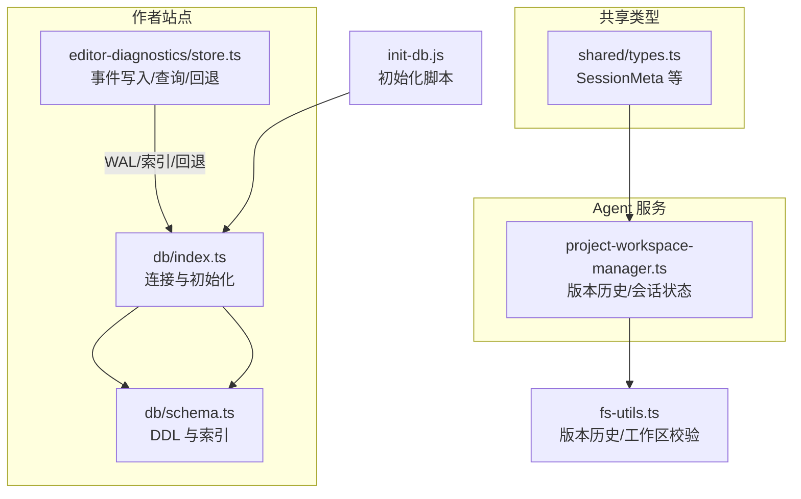
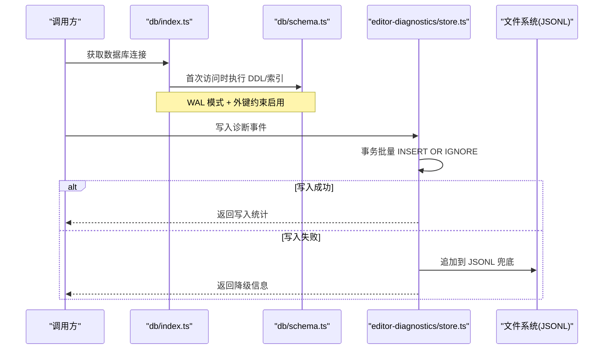
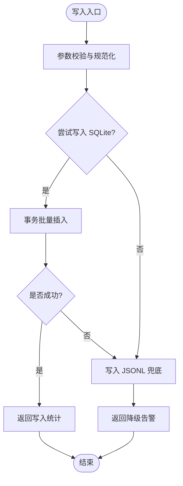
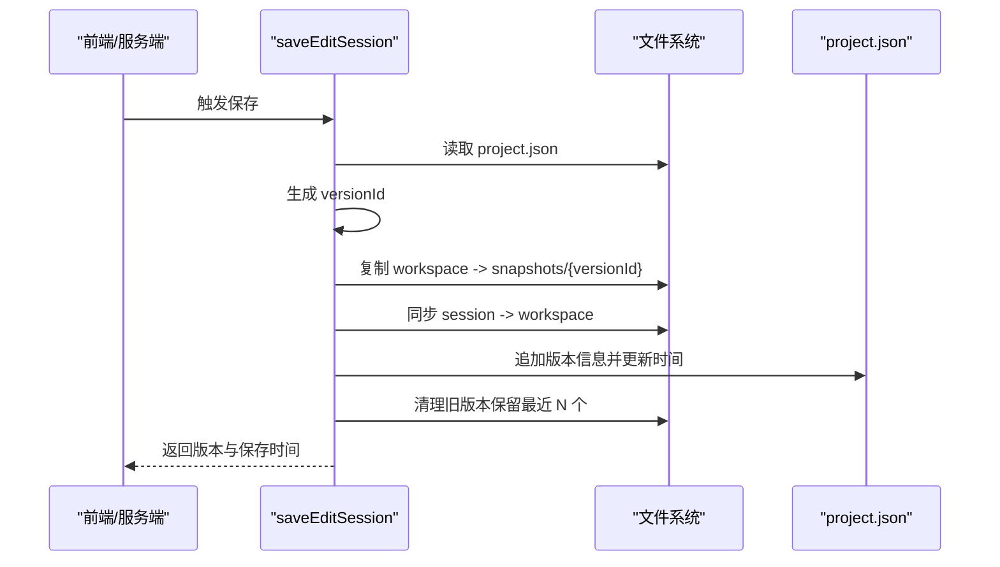
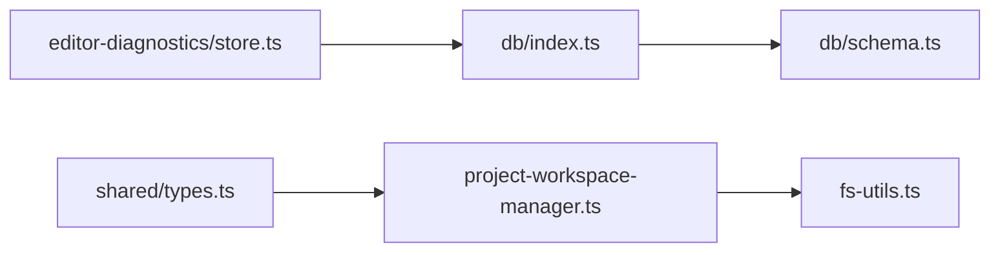

# 数据库设计

<cite>
**本文引用的文件**   
- [packages/author-site/src/lib/db/index.ts](file://packages/author-site/src/lib/db/index.ts)
- [packages/author-site/src/lib/db/schema.ts](file://packages/author-site/src/lib/db/schema.ts)
- [packages/author-site/scripts/init-db.js](file://packages/author-site/scripts/init-db.js)
- [packages/author-site/src/lib/editor-diagnostics/store.ts](file://packages/author-site/src/lib/editor-diagnostics/store.ts)
- [packages/shared/src/types.ts](file://packages/shared/src/types.ts)
- [packages/agent-service/src/workspace/project-workspace-manager.ts](file://packages/agent-service/src/workspace/project-workspace-manager.ts)
- [packages/author-site/src/lib/fs-utils.ts](file://packages/author-site/src/lib/fs-utils.ts)
- [docs/项目文档/创作端/03-项目管理/技术/06_项目工作空间迁移方案.md](file://docs/项目文档/创作端/03-项目管理/技术/06_项目工作空间迁移方案.md)
</cite>

## 目录
1. [引言](#引言)
2. [项目结构](#项目结构)
3. [核心组件](#核心组件)
4. [架构总览](#架构总览)
5. [详细组件分析](#详细组件分析)
6. [依赖分析](#依赖分析)
7. [性能考虑](#性能考虑)
8. [故障排查指南](#故障排查指南)
9. [结论](#结论)
10. [附录](#附录)

## 引言
本设计文档面向 Workbench 平台的 SQLite 数据层，聚焦以下目标：
- 明确现有与规划中的表结构设计（用户、系统配置、外部认证、钉钉身份、密码重置日志、编辑器诊断事件等）
- 说明主键/外键策略、索引优化与查询调优
- 解释数据迁移机制（版本管理与结构演进）
- 描述事务处理模型（并发控制与一致性保证）
- 提供备份恢复方案（定期备份与灾难恢复流程）
- 给出监控与维护指南（性能分析与故障排查）

说明：
- 当前仓库中已落地的持久化存储包括两类：
  - SQLite 数据库：用于用户、系统配置、鉴权相关及编辑器诊断事件
  - 文件系统：用于项目元数据、会话与工作区、版本快照等（非关系型）
- 本文在“项目/工作区/会话/版本历史”部分将同时覆盖现有基于文件的实现与未来可能的关系型建模建议。

## 项目结构
SQLite 相关代码主要分布在 author-site 的 lib/db 与 editor-diagnostics 模块，以及 agent-service 的工作区管理器；类型定义集中在 shared 包。



图表来源
- [packages/author-site/src/lib/db/index.ts:10-24](file://packages/author-site/src/lib/db/index.ts#L10-L24)
- [packages/author-site/src/lib/db/schema.ts:1-112](file://packages/author-site/src/lib/db/schema.ts#L1-L112)
- [packages/author-site/src/lib/editor-diagnostics/store.ts:65-100](file://packages/author-site/src/lib/editor-diagnostics/store.ts#L65-L100)
- [packages/shared/src/types.ts:19-30](file://packages/shared/src/types.ts#L19-L30)
- [packages/agent-service/src/workspace/project-workspace-manager.ts:448-461](file://packages/agent-service/src/workspace/project-workspace-manager.ts#L448-L461)
- [packages/author-site/src/lib/fs-utils.ts:1599-1609](file://packages/author-site/src/lib/fs-utils.ts#L1599-L1609)
- [packages/author-site/scripts/init-db.js:14-49](file://packages/author-site/scripts/init-db.js#L14-L49)

章节来源
- [packages/author-site/src/lib/db/index.ts:10-24](file://packages/author-site/src/lib/db/index.ts#L10-L24)
- [packages/author-site/src/lib/db/schema.ts:1-112](file://packages/author-site/src/lib/db/schema.ts#L1-L112)
- [packages/author-site/src/lib/editor-diagnostics/store.ts:65-100](file://packages/author-site/src/lib/editor-diagnostics/store.ts#L65-L100)
- [packages/shared/src/types.ts:19-30](file://packages/shared/src/types.ts#L19-L30)
- [packages/agent-service/src/workspace/project-workspace-manager.ts:448-461](file://packages/agent-service/src/workspace/project-workspace-manager.ts#L448-L461)
- [packages/author-site/src/lib/fs-utils.ts:1599-1609](file://packages/author-site/src/lib/fs-utils.ts#L1599-L1609)
- [packages/author-site/scripts/init-db.js:14-49](file://packages/author-site/scripts/init-db.js#L14-L49)

## 核心组件
- 数据库连接与初始化
  - 单例连接、WAL 模式、外键约束开启、懒初始化与关闭
- 数据模型与索引
  - 用户、系统配置、用户模型配置、作者偏好、外部认证、钉钉身份、密码重置日志
  - 针对常用查询路径建立复合索引
- 编辑器诊断事件库
  - 独立 SQLite 库 + JSONL 兜底，具备事务批量写入与多条件查询能力
- 项目/工作区/会话/版本历史（当前为文件系统实现）
  - 通过 project.json 维护 versions 列表，保存时生成快照并清理旧版本
  - 提供获取版本历史与最新版本的工具函数

章节来源
- [packages/author-site/src/lib/db/index.ts:10-24](file://packages/author-site/src/lib/db/index.ts#L10-L24)
- [packages/author-site/src/lib/db/schema.ts:6-98](file://packages/author-site/src/lib/db/schema.ts#L6-L98)
- [packages/author-site/src/lib/editor-diagnostics/store.ts:120-194](file://packages/author-site/src/lib/editor-diagnostics/store.ts#L120-L194)
- [packages/author-site/src/lib/fs-utils.ts:1599-1609](file://packages/author-site/src/lib/fs-utils.ts#L1599-L1609)
- [docs/项目文档/创作端/03-项目管理/技术/06_项目工作空间迁移方案.md:154-217](file://docs/项目文档/创作端/03-项目管理/技术/06_项目工作空间迁移方案.md#L154-L217)

## 架构总览
整体数据流包含两条主线：
- 业务元数据与鉴权：通过 users.db 管理用户、系统与用户级配置
- 诊断事件：通过 diagnostics/editor-events.db 记录编辑器诊断事件，失败时回落到 JSONL



图表来源
- [packages/author-site/src/lib/db/index.ts:10-24](file://packages/author-site/src/lib/db/index.ts#L10-L24)
- [packages/author-site/src/lib/db/schema.ts:1-112](file://packages/author-site/src/lib/db/schema.ts#L1-L112)
- [packages/author-site/src/lib/editor-diagnostics/store.ts:120-194](file://packages/author-site/src/lib/editor-diagnostics/store.ts#L120-L194)

## 详细组件分析

### 用户与配置子域（users.db）
- 表结构与约束
  - users：用户主表，id 为主键，username 唯一，created_at 时间戳
  - system_configs：系统级配置，id 主键，config_json 文本，updated_by 可选
  - user_model_configs：用户模型配置，user_id 主键且外键关联 users(id)，级联删除
  - user_authoring_preferences：用户作者偏好，user_id 主键且外键关联 users(id)，级联删除
  - user_external_auth_configs：用户外部认证配置，(user_id, provider) 复合主键，外键关联 users(id)，级联删除
  - user_dingtalk_identities：钉钉身份映射，id 主键，外键关联 users(id)，复合唯一索引（corp_id+union_id 条件）、corp_id+dingtalk_user_id 唯一索引、user_id 普通索引
  - password_reset_logs：密码重置日志，id 主键，外键关联 users(id)，user_id 与 created_at 索引
- 索引与查询优化
  - 针对登录/绑定/查询路径建立复合唯一索引与普通索引，避免全表扫描
  - 使用 ON DELETE CASCADE 保持引用完整性
- 事务与一致性
  - 通过 better-sqlite3 的事务 API 进行批量更新，确保同一操作原子性
  - 外键约束强制引用完整性

```mermaid
erDiagram
USERS {
text id PK
text username UK
text password_hash
integer created_at
}
SYSTEM_CONFIGS {
text id PK
text config_json
integer updated_at
text updated_by
}
USER_MODEL_CONFIGS {
text user_id PK
text config_json
integer updated_at
}
USER_AUTHORING_PREFERENCES {
text user_id PK
text preferences_json
integer updated_at
}
USER_EXTERNAL_AUTH_CONFIGS {
text user_id
text provider
text config_json
integer updated_at
primary_key (user_id, provider)
}
USER_DINGTALK_IDENTITIES {
text id PK
text user_id
text corp_id
text union_id
text dingtalk_user_id
text name
text avatar
text raw_json
integer created_at
integer updated_at
integer last_login_at
}
PASSWORD_RESET_LOGS {
text id PK
text user_id
text reset_by
text reset_method
integer created_at
}
USERS ||--o{ USER_MODEL_CONFIGS : "1:N"
USERS ||--o{ USER_AUTHORING_PREFERENCES : "1:N"
USERS ||--o{ USER_EXTERNAL_AUTH_CONFIGS : "1:N"
USERS ||--o{ USER_DINGTALK_IDENTITIES : "1:N"
USERS ||--o{ PASSWORD_RESET_LOGS : "1:N"
```

图表来源
- [packages/author-site/src/lib/db/schema.ts:6-98](file://packages/author-site/src/lib/db/schema.ts#L6-L98)

章节来源
- [packages/author-site/src/lib/db/schema.ts:6-98](file://packages/author-site/src/lib/db/schema.ts#L6-L98)

### 编辑器诊断事件库（diagnostics/editor-events.db）
- 表结构与索引
  - editor_events：事件主表，id 主键，ts 时间字符串，schema_version、source、level、event_group、event_type 等字段，payload_json 存储结构化负载
  - 索引：按 project_id/ts、session_id/ts、editor_session_id/ts、trace_id/ts、operation_id/ts、workspace_id/ts、event_type/ts、event_group/ts 等多维组合索引，支撑多维度过滤与时间排序
- 写入与回退
  - 优先写入 SQLite，失败则追加到 JSONL 文件（按 editor_session_id 分文件），并提供读取合并逻辑
- 查询
  - 支持按 projectId/sessionId/workspaceId/editorSessionId/traceId/operationId/eventType/since 等条件过滤，默认按 ts 倒序，限制条数



图表来源
- [packages/author-site/src/lib/editor-diagnostics/store.ts:120-194](file://packages/author-site/src/lib/editor-diagnostics/store.ts#L120-L194)
- [packages/author-site/src/lib/editor-diagnostics/store.ts:218-281](file://packages/author-site/src/lib/editor-diagnostics/store.ts#L218-L281)

章节来源
- [packages/author-site/src/lib/editor-diagnostics/store.ts:65-100](file://packages/author-site/src/lib/editor-diagnostics/store.ts#L65-L100)
- [packages/author-site/src/lib/editor-diagnostics/store.ts:120-194](file://packages/author-site/src/lib/editor-diagnostics/store.ts#L120-L194)
- [packages/author-site/src/lib/editor-diagnostics/store.ts:218-281](file://packages/author-site/src/lib/editor-diagnostics/store.ts#L218-L281)

### 项目/工作区/会话/版本历史（当前为文件系统实现）
- 数据模型（类型）
  - SessionMeta：包含 sessionId、demoId（实际为 projectId）、userId、workspaceId、status、basedOnVersion、createdAt、expiresAt 等
- 版本历史与快照
  - saveEditSession：生成版本号、复制 workspace 到 snapshots、同步工作区、记录版本信息、清理旧版本（保留最近 N 个）
  - getVersionHistory/getLatestVersion：从 project.json 的 versions 数组读取
- 工作区校验
  - 校验 activeWorkspace 与 canonicalSyncedAt 的一致性，防止过期工作区被误用



图表来源
- [docs/项目文档/创作端/03-项目管理/技术/06_项目工作空间迁移方案.md:154-217](file://docs/项目文档/创作端/03-项目管理/技术/06_项目工作空间迁移方案.md#L154-L217)
- [packages/author-site/src/lib/fs-utils.ts:1599-1609](file://packages/author-site/src/lib/fs-utils.ts#L1599-L1609)
- [packages/agent-service/src/workspace/project-workspace-manager.ts:448-461](file://packages/agent-service/src/workspace/project-workspace-manager.ts#L448-L461)

章节来源
- [packages/shared/src/types.ts:19-30](file://packages/shared/src/types.ts#L19-L30)
- [docs/项目文档/创作端/03-项目管理/技术/06_项目工作空间迁移方案.md:154-217](file://docs/项目文档/创作端/03-项目管理/技术/06_项目工作空间迁移方案.md#L154-L217)
- [packages/author-site/src/lib/fs-utils.ts:1599-1609](file://packages/author-site/src/lib/fs-utils.ts#L1599-L1609)
- [packages/agent-service/src/workspace/project-workspace-manager.ts:448-461](file://packages/agent-service/src/workspace/project-workspace-manager.ts#L448-L461)

## 依赖分析
- 模块耦合
  - db/index.ts 负责连接与初始化，db/schema.ts 负责 DDL/索引，二者强耦合
  - editor-diagnostics/store.ts 自持一个独立的 SQLite 实例与 JSONL 兜底，降低对主库的依赖
  - agent-service 与 author-site 通过 shared/types.ts 约定 SessionMeta 结构
- 外部依赖
  - better-sqlite3：同步高性能驱动，适合 Node 进程内使用
- 潜在循环依赖
  - 当前未见循环导入；schema 仅依赖 index 提供的连接



图表来源
- [packages/author-site/src/lib/db/index.ts:10-24](file://packages/author-site/src/lib/db/index.ts#L10-L24)
- [packages/author-site/src/lib/db/schema.ts:1-112](file://packages/author-site/src/lib/db/schema.ts#L1-L112)
- [packages/author-site/src/lib/editor-diagnostics/store.ts:65-100](file://packages/author-site/src/lib/editor-diagnostics/store.ts#L65-L100)
- [packages/shared/src/types.ts:19-30](file://packages/shared/src/types.ts#L19-L30)
- [packages/agent-service/src/workspace/project-workspace-manager.ts:448-461](file://packages/agent-service/src/workspace/project-workspace-manager.ts#L448-L461)
- [packages/author-site/src/lib/fs-utils.ts:1599-1609](file://packages/author-site/src/lib/fs-utils.ts#L1599-L1609)

章节来源
- [packages/author-site/src/lib/db/index.ts:10-24](file://packages/author-site/src/lib/db/index.ts#L10-L24)
- [packages/author-site/src/lib/db/schema.ts:1-112](file://packages/author-site/src/lib/db/schema.ts#L1-L112)
- [packages/author-site/src/lib/editor-diagnostics/store.ts:65-100](file://packages/author-site/src/lib/editor-diagnostics/store.ts#L65-L100)
- [packages/shared/src/types.ts:19-30](file://packages/shared/src/types.ts#L19-L30)
- [packages/agent-service/src/workspace/project-workspace-manager.ts:448-461](file://packages/agent-service/src/workspace/project-workspace-manager.ts#L448-L461)
- [packages/author-site/src/lib/fs-utils.ts:1599-1609](file://packages/author-site/src/lib/fs-utils.ts#L1599-L1609)

## 性能考虑
- 并发与锁
  - 启用 WAL 模式提升读并发能力；busy_timeout 缓解忙等待
- 索引策略
  - 针对高频过滤维度建立复合索引（如 project_id+ts、editor_session_id+ts）
  - 条件唯一索引减少重复绑定场景
- 写入优化
  - 使用事务批量插入，减少磁盘 IO 次数
  - 诊断事件采用 INSERT OR IGNORE 去重，避免重复写入
- 查询优化
  - 限定 limit，避免大结果集
  - 按 ts 倒序后在内存反转，保证时序稳定

章节来源
- [packages/author-site/src/lib/db/index.ts:14-16](file://packages/author-site/src/lib/db/index.ts#L14-L16)
- [packages/author-site/src/lib/editor-diagnostics/store.ts:68-98](file://packages/author-site/src/lib/editor-diagnostics/store.ts#L68-L98)
- [packages/author-site/src/lib/editor-diagnostics/store.ts:120-194](file://packages/author-site/src/lib/editor-diagnostics/store.ts#L120-L194)

## 故障排查指南
- 常见现象
  - SQLite 不可用或写入失败：自动回退到 JSONL，并在诊断信息中标记
  - 事件缺失或不一致：检查 JSONL fallback 是否存在未入库事件
- 定位步骤
  - 查看诊断返回的 sqliteUsed/jsonlFallbackUsed/dbUnavailable/eventGapDetected 标志
  - 核对 diagnostics/editor-events.db 与对应 editor-session-id.jsonl 内容差异
  - 检查 busy_timeout 与 WAL 状态
- 恢复建议
  - 若主库损坏，优先从 JSONL 重建或导出
  - 对 users.db 使用 WAL 文件与主库一并归档备份

章节来源
- [packages/author-site/src/lib/editor-diagnostics/store.ts:218-281](file://packages/author-site/src/lib/editor-diagnostics/store.ts#L218-L281)
- [packages/author-site/src/lib/editor-diagnostics/store.ts:330-358](file://packages/author-site/src/lib/editor-diagnostics/store.ts#L330-L358)
- [packages/author-site/src/lib/editor-diagnostics/store.ts:375-493](file://packages/author-site/src/lib/editor-diagnostics/store.ts#L375-L493)

## 结论
- 当前平台采用“SQLite + 文件系统”的混合持久化：
  - 用户与配置、诊断事件使用 SQLite，具备良好并发与查询能力
  - 项目/工作区/会话/版本历史以文件系统为主，便于资源级快照与恢复
- 建议在后续演进中评估将“项目/工作区/会话/版本历史”逐步纳入关系模型，以获得更强的引用完整性与跨实体查询能力。

## 附录

### 数据迁移与版本管理
- 启动期初始化
  - 应用启动时懒初始化 users.db，执行 DDL 与索引创建
  - 提供 init-db.js 脚本用于环境初始化
- 结构演进策略
  - 使用 IF NOT EXISTS 与增量索引创建，保证幂等
  - 新增字段/表时，兼容旧数据并通过默认值或迁移脚本补齐
- 项目版本演进（文件系统）
  - 首次保存自动生成 v1 快照
  - 保留最近 N 个版本，自动清理旧版本

章节来源
- [packages/author-site/src/lib/db/index.ts:18-21](file://packages/author-site/src/lib/db/index.ts#L18-L21)
- [packages/author-site/scripts/init-db.js:14-49](file://packages/author-site/scripts/init-db.js#L14-L49)
- [docs/项目文档/创作端/03-项目管理/技术/06_项目工作空间迁移方案.md:360-382](file://docs/项目文档/创作端/03-项目管理/技术/06_项目工作空间迁移方案.md#L360-L382)

### 事务处理与一致性
- 事务模型
  - 使用 better-sqlite3 的事务 API 包裹批量写入，保证原子性
- 并发控制
  - WAL 模式 + busy_timeout 提高并发稳定性
- 一致性保障
  - 外键约束 + 级联删除保证引用完整性
  - 条件唯一索引避免重复绑定

章节来源
- [packages/author-site/src/lib/editor-diagnostics/store.ts:163-190](file://packages/author-site/src/lib/editor-diagnostics/store.ts#L163-L190)
- [packages/author-site/src/lib/db/index.ts:14-16](file://packages/author-site/src/lib/db/index.ts#L14-L16)
- [packages/author-site/src/lib/db/schema.ts:24-51](file://packages/author-site/src/lib/db/schema.ts#L24-L51)

### 备份与恢复
- 备份策略
  - 定期归档 users.db 与其 WAL 文件
  - 归档 diagnostics/editor-events.db 及其 WAL 文件
  - 归档 JSONL 诊断文件（按 editor_session_id 命名）
- 恢复流程
  - 停止写入后拷贝数据库与 WAL 文件
  - 若主库损坏，优先从 JSONL 重建或导出
  - 验证外键与索引完整性

章节来源
- [packages/author-site/src/lib/editor-diagnostics/store.ts:65-100](file://packages/author-site/src/lib/editor-diagnostics/store.ts#L65-L100)
- [packages/author-site/src/lib/editor-diagnostics/store.ts:330-358](file://packages/author-site/src/lib/editor-diagnostics/store.ts#L330-L358)

### 监控与维护
- 指标采集
  - 记录 sqliteUsed/jsonlFallbackUsed/dbUnavailable/eventGapDetected 等诊断标志
- 巡检建议
  - 定期检查 JSONL 文件大小与数量，必要时归档清理
  - 监控 SQLite 错误日志与超时情况
- 性能分析
  - 使用 EXPLAIN QUERY PLAN 分析慢查询
  - 结合索引命中情况优化 WHERE 条件与 LIMIT

章节来源
- [packages/author-site/src/lib/editor-diagnostics/store.ts:218-281](file://packages/author-site/src/lib/editor-diagnostics/store.ts#L218-L281)
- [packages/author-site/src/lib/editor-diagnostics/store.ts:375-493](file://packages/author-site/src/lib/editor-diagnostics/store.ts#L375-L493)