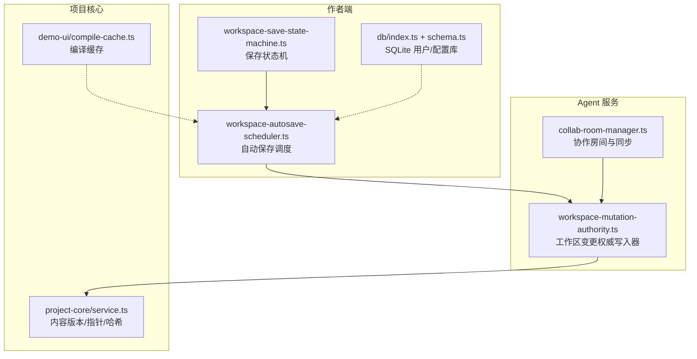
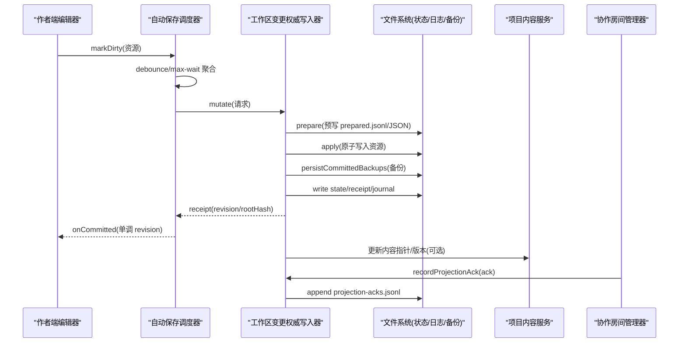
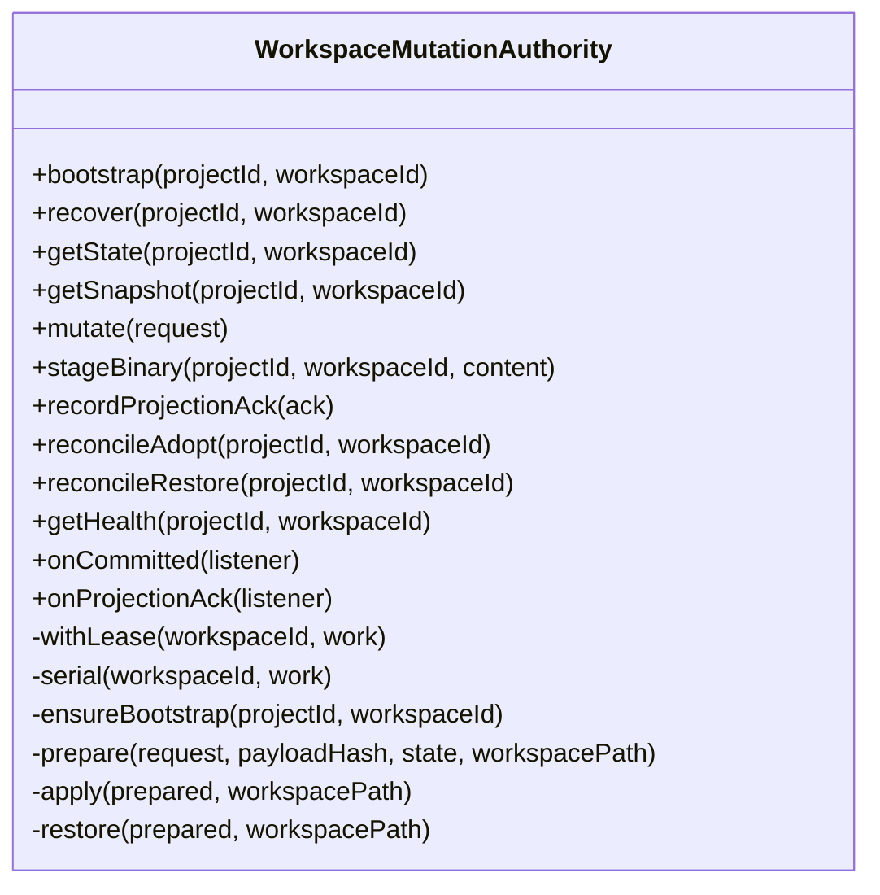
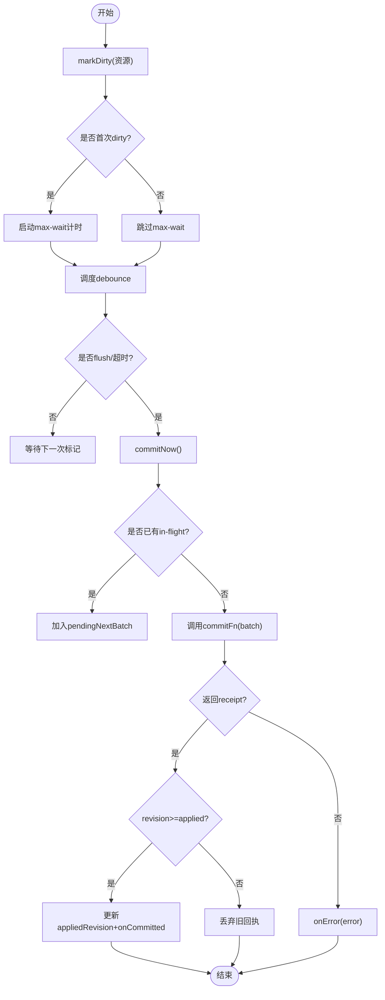
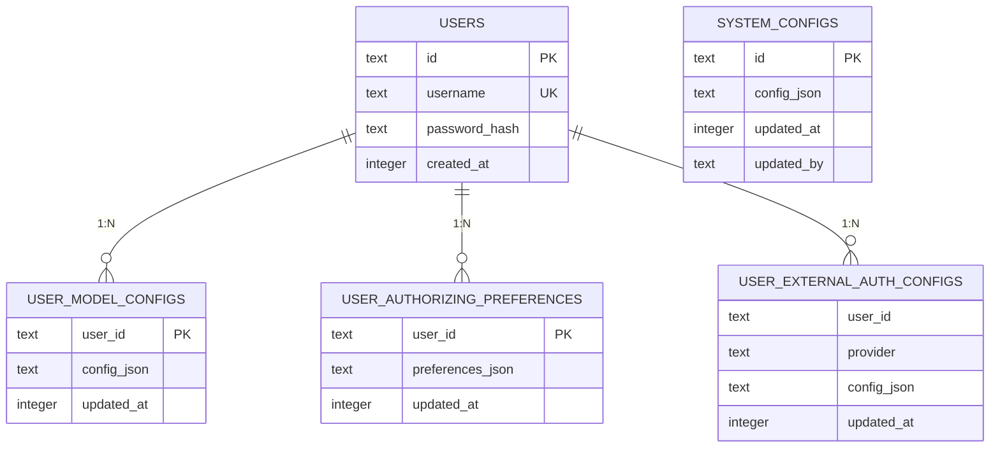
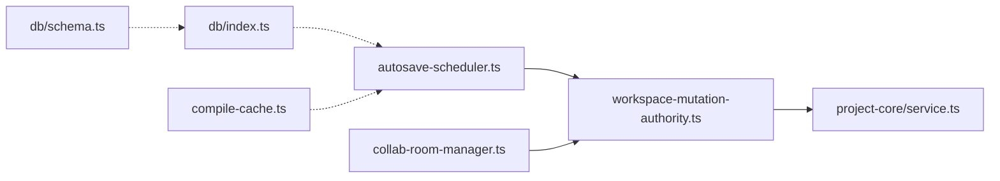

# 数据持久化

<cite>
**本文引用的文件**   
- [packages/agent-service/src/workspace/workspace-mutation-authority.ts](file://packages/agent-service/src/workspace/workspace-mutation-authority.ts)
- [packages/author-site/src/lib/db/index.ts](file://packages/author-site/src/lib/db/index.ts)
- [packages/author-site/src/lib/db/schema.ts](file://packages/author-site/src/lib/db/schema.ts)
- [packages/author-site/src/lib/workspace-autosave-scheduler.ts](file://packages/author-site/src/lib/workspace-autosave-scheduler.ts)
- [packages/project-core/src/service.ts](file://packages/project-core/src/service.ts)
- [packages/demo-ui/src/compile-cache.ts](file://packages/demo-ui/src/compile-cache.ts)
- [packages/agent-service/tests/unit/workspace-mutation-authority.test.ts](file://packages/agent-service/tests/unit/workspace-mutation-authority.test.ts)
- [packages/agent-service/src/collab/collab-room-manager.ts](file://packages/agent-service/src/collab/collab-room-manager.ts)
- [packages/agent-service/tests/unit/collab-room-manager.test.ts](file://packages/agent-service/tests/unit/collab-room-manager.test.ts)
- [packages/author-site/src/lib/workspace-save-state-machine.ts](file://packages/author-site/src/lib/workspace-save-state-machine.ts)
- [packages/author-site/src/lib/workspace-performance-sampling.ts](file://packages/author-site/src/lib/workspace-performance-sampling.ts)
- [OPS/CLI/src/commands/diagnostics.ts](file://OPS/CLI/src/commands/diagnostics.ts)
</cite>

## 目录
1. [引言](#引言)
2. [项目结构](#项目结构)
3. [核心组件](#核心组件)
4. [架构总览](#架构总览)
5. [详细组件分析](#详细组件分析)
6. [依赖关系分析](#依赖关系分析)
7. [性能考量](#性能考量)
8. [故障排查指南](#故障排查指南)
9. [结论](#结论)
10. [附录](#附录)

## 引言
本文件面向 Workbench 平台的数据持久化层，系统性阐述以下方面：
- Repository 模式与抽象接口设计（以 WorkspaceMutationAuthority 为核心）
- 事务管理与 ACID 保证、错误恢复策略
- 并发控制方案（进程级锁、乐观锁、悲观锁的使用场景）
- 数据缓存策略（内存缓存、分布式缓存、失效机制）
- 数据同步机制（双向同步、冲突检测与合并）
- 数据完整性检查（一致性验证与修复工具）
- 持久化性能优化建议（批量操作、连接池配置、查询优化）

## 项目结构
Workbench 的持久化相关代码分布在多个包中：
- agent-service：工作区变更权威写入器（WorkspaceMutationAuthority），负责幂等提交、预写日志、原子落盘、备份与恢复、健康检查与事件总线。
- author-site：前端侧自动保存调度器（WorkspaceAutosaveScheduler）、SQLite 用户与系统配置数据库（db/index.ts, db/schema.ts）。
- project-core：项目内容版本与指针管理、资源哈希与快照、元数据持久化。
- demo-ui：编译结果内存缓存及失效策略。
- collab：协作消息处理与同步协议。
- OPS CLI：诊断与只读查询能力。

图表来源
- [packages/agent-service/src/workspace/workspace-mutation-authority.ts:1-120](file://packages/agent-service/src/workspace/workspace-mutation-authority.ts#L1-L120)
- [packages/author-site/src/lib/workspace-autosave-scheduler.ts:1-120](file://packages/author-site/src/lib/workspace-autosave-scheduler.ts#L1-L120)
- [packages/author-site/src/lib/db/index.ts:1-33](file://packages/author-site/src/lib/db/index.ts#L1-L33)
- [packages/author-site/src/lib/db/schema.ts:1-51](file://packages/author-site/src/lib/db/schema.ts#L1-L51)
- [packages/project-core/src/service.ts:4900-5100](file://packages/project-core/src/service.ts#L4900-L5100)
- [packages/demo-ui/src/compile-cache.ts:47-86](file://packages/demo-ui/src/compile-cache.ts#L47-L86)
- [packages/agent-service/src/collab/collab-room-manager.ts:297-332](file://packages/agent-service/src/collab/collab-room-manager.ts#L297-L332)

章节来源
- [packages/agent-service/src/workspace/workspace-mutation-authority.ts:1-120](file://packages/agent-service/src/workspace/workspace-mutation-authority.ts#L1-L120)
- [packages/author-site/src/lib/workspace-autosave-scheduler.ts:1-120](file://packages/author-site/src/lib/workspace-autosave-scheduler.ts#L1-L120)
- [packages/author-site/src/lib/db/index.ts:1-33](file://packages/author-site/src/lib/db/index.ts#L1-L33)
- [packages/author-site/src/lib/db/schema.ts:1-51](file://packages/author-site/src/lib/db/schema.ts#L1-L51)
- [packages/project-core/src/service.ts:4900-5100](file://packages/project-core/src/service.ts#L4900-L5100)
- [packages/demo-ui/src/compile-cache.ts:47-86](file://packages/demo-ui/src/compile-cache.ts#L47-L86)
- [packages/agent-service/src/collab/collab-room-manager.ts:297-332](file://packages/agent-service/src/collab/collab-room-manager.ts#L297-L332)

## 核心组件
- 工作区变更权威写入器（WorkspaceMutationAuthority）
  - 职责：唯一可持久化写入者；维护每工作区的有序队列；将状态与日志持久化到磁盘；提供幂等提交、预写日志、原子更新、回滚、备份与恢复、健康检查与事件订阅。
  - 关键能力：withLease 进程级独占锁；serial 单写串行化；prepare/apply/restore 三段式；receipt/journal/backups/projection-acks 多文件协同；外部漂移检测与 reconcile。
- 自动保存调度器（WorkspaceAutosaveScheduler）
  - 职责：前端侧批量合并 dirty 资源，debounce/max-wait 触发提交；in-flight barrier 避免并发提交；revision 单调 ack。
- SQLite 用户与系统配置库（db/index.ts, db/schema.ts）
  - 职责：初始化并暴露 better-sqlite3 实例；开启 WAL 与外键约束；DDL 建表。
- 项目内容版本与指针（project-core/service.ts）
  - 职责：资源版本、指针合并、头提交读取、blob 去重存储、内容哈希计算。
- 协作同步（collab-room-manager.ts）
  - 职责：Yjs 同步消息处理、awareness 广播、同步握手。
- 编译缓存（demo-ui/compile-cache.ts）
  - 职责：内存 LRU 风格缓存、按会话/页面维度失效。

章节来源
- [packages/agent-service/src/workspace/workspace-mutation-authority.ts:112-127](file://packages/agent-service/src/workspace/workspace-mutation-authority.ts#L112-L127)
- [packages/author-site/src/lib/workspace-autosave-scheduler.ts:39-69](file://packages/author-site/src/lib/workspace-autosave-scheduler.ts#L39-L69)
- [packages/author-site/src/lib/db/index.ts:10-24](file://packages/author-site/src/lib/db/index.ts#L10-L24)
- [packages/author-site/src/lib/db/schema.ts:3-51](file://packages/author-site/src/lib/db/schema.ts#L3-L51)
- [packages/project-core/src/service.ts:4965-5002](file://packages/project-core/src/service.ts#L4965-L5002)
- [packages/agent-service/src/collab/collab-room-manager.ts:297-332](file://packages/agent-service/src/collab/collab-room-manager.ts#L297-L332)
- [packages/demo-ui/src/compile-cache.ts:47-86](file://packages/demo-ui/src/compile-cache.ts#L47-L86)

## 架构总览
下图展示从前端编辑到后端权威写入、再到项目内容与协作同步的整体数据流。

图表来源
- [packages/author-site/src/lib/workspace-autosave-scheduler.ts:196-249](file://packages/author-site/src/lib/workspace-autosave-scheduler.ts#L196-L249)
- [packages/agent-service/src/workspace/workspace-mutation-authority.ts:468-637](file://packages/agent-service/src/workspace/workspace-mutation-authority.ts#L468-L637)
- [packages/agent-service/src/workspace/workspace-mutation-authority.ts:746-771](file://packages/agent-service/src/workspace/workspace-mutation-authority.ts#L746-L771)
- [packages/agent-service/src/workspace/workspace-mutation-authority.ts:380-451](file://packages/agent-service/src/workspace/workspace-mutation-authority.ts#L380-L451)
- [packages/project-core/src/service.ts:5004-5055](file://packages/project-core/src/service.ts#L5004-L5055)
- [packages/agent-service/src/collab/collab-room-manager.ts:320-332](file://packages/agent-service/src/collab/collab-room-manager.ts#L320-L332)

## 详细组件分析

### 组件一：工作区变更权威写入器（Repository 模式实现）
- 抽象接口与契约
  - 对外暴露方法：bootstrap、recover、getState、getSnapshot、mutate、stageBinary、recordProjectionAck、reconcileAdopt、reconcileRestore、getHealth、onCommitted/onProjectionAck 等。
  - 通过 Receipt/Journal/State/Backups/ProjectionAcks 等文件定义“提交证明”和“审计轨迹”，形成强一致的可回放仓库。
- 事务与 ACID
  - 原子性：使用原子写入（先写临时文件再 rename）确保状态、收据、日志、备份的一致性。
  - 一致性：提交前校验 baseRevision 与期望哈希；提交后校验 rootHash；外部漂移时拒绝或进入 reconcile。
  - 隔离性：withLease 基于文件锁实现进程级互斥；serial 保证同工作区串行执行。
  - 持久性：receipt 在 state 之后落盘，崩溃恢复时可重放 prepared 与 journal。
- 错误恢复
  - 启动时 recoverPreparedMutations/recoverPreparedReconciles 恢复未完成的操作；若实际根哈希不一致且存在恢复项则拒绝，需人工 reconcile。
  - 失败路径会 restore 资源快照、清理 prepared/staging、追加 rolled_back 记录。
- 并发控制
  - 乐观锁：baseRevision 与 expectedHash 双重校验，防止覆盖式写入。
  - 悲观锁：withLease 文件级独占锁，避免跨进程并发写同一工作区。
- 健康与观测
  - getHealth 暴露 ready、externalDrift、activeLease、preparedCount、conflictCount、receiptCount、journalEntries 等指标。
  - onCommitted/onProjectionAck 事件总线供其他模块消费。

图表来源
- [packages/agent-service/src/workspace/workspace-mutation-authority.ts:112-127](file://packages/agent-service/src/workspace/workspace-mutation-authority.ts#L112-L127)
- [packages/agent-service/src/workspace/workspace-mutation-authority.ts:468-637](file://packages/agent-service/src/workspace/workspace-mutation-authority.ts#L468-L637)
- [packages/agent-service/src/workspace/workspace-mutation-authority.ts:746-771](file://packages/agent-service/src/workspace/workspace-mutation-authority.ts#L746-L771)
- [packages/agent-service/src/workspace/workspace-mutation-authority.ts:920-944](file://packages/agent-service/src/workspace/workspace-mutation-authority.ts#L920-L944)

章节来源
- [packages/agent-service/src/workspace/workspace-mutation-authority.ts:112-127](file://packages/agent-service/src/workspace/workspace-mutation-authority.ts#L112-L127)
- [packages/agent-service/src/workspace/workspace-mutation-authority.ts:468-637](file://packages/agent-service/src/workspace/workspace-mutation-authority.ts#L468-L637)
- [packages/agent-service/src/workspace/workspace-mutation-authority.ts:746-771](file://packages/agent-service/src/workspace/workspace-mutation-authority.ts#L746-L771)
- [packages/agent-service/src/workspace/workspace-mutation-authority.ts:920-944](file://packages/agent-service/src/workspace/workspace-mutation-authority.ts#L920-L944)
- [packages/agent-service/tests/unit/workspace-mutation-authority.test.ts:377-429](file://packages/agent-service/tests/unit/workspace-mutation-authority.test.ts#L377-L429)

### 组件二：自动保存调度器（前端批处理与单调回执）
- 设计要点
  - 800ms debounce + 3000ms max-wait 双计时器，减少频繁提交。
  - in-flight barrier 保证同时仅一个提交任务。
  - 同一路径多次 dirty 仅保留最新内容，降低冗余。
  - 单调 ack：仅接受 revision >= appliedRevision 的回执，避免旧回执覆盖新状态。
- 与 Authority 集成
  - commitFn 通常封装 Authority.mutate；成功回调 onCommitted 驱动 UI 状态机。
  - 失败回调 onError 触发状态机进入 conflict 分支。

图表来源
- [packages/author-site/src/lib/workspace-autosave-scheduler.ts:75-93](file://packages/author-site/src/lib/workspace-autosave-scheduler.ts#L75-L93)
- [packages/author-site/src/lib/workspace-autosave-scheduler.ts:196-249](file://packages/author-site/src/lib/workspace-autosave-scheduler.ts#L196-L249)

章节来源
- [packages/author-site/src/lib/workspace-autosave-scheduler.ts:39-69](file://packages/author-site/src/lib/workspace-autosave-scheduler.ts#L39-L69)
- [packages/author-site/src/lib/workspace-autosave-scheduler.ts:196-249](file://packages/author-site/src/lib/workspace-autosave-scheduler.ts#L196-L249)

### 组件三：SQLite 用户与系统配置库
- 连接与初始化
  - 单例 Database 实例；WAL 模式提升并发读性能；开启外键约束。
  - 首次访问时执行 DDL 建表。
- 表结构
  - users、system_configs、user_model_configs、user_authoring_preferences、user_external_auth_configs 等。

图表来源
- [packages/author-site/src/lib/db/schema.ts:6-51](file://packages/author-site/src/lib/db/schema.ts#L6-L51)

章节来源
- [packages/author-site/src/lib/db/index.ts:10-24](file://packages/author-site/src/lib/db/index.ts#L10-L24)
- [packages/author-site/src/lib/db/schema.ts:3-51](file://packages/author-site/src/lib/db/schema.ts#L3-L51)

### 组件四：项目内容版本与指针（project-core）
- 资源版本与指针
  - 通过 resourcePointers 描述资源集合；mergePointers 合并当前与更新指针，去重排序。
- 头提交与内容状态
  - readHeadCommit 读取 headCommitId 指向的提交；createContentCommit 创建新版本并提交。
- 内容哈希与 Blob 去重
  - makeResourceContentHash 对 kind/resourceId/blobRefs/metadata 生成稳定哈希；writeBlob/readBlob 实现内容地址存储。

章节来源
- [packages/project-core/src/service.ts:4988-5002](file://packages/project-core/src/service.ts#L4988-L5002)
- [packages/project-core/src/service.ts:4981-4986](file://packages/project-core/src/service.ts#L4981-L4986)
- [packages/project-core/src/service.ts:5004-5055](file://packages/project-core/src/service.ts#L5004-L5055)
- [packages/project-core/src/service.ts:4965-4979](file://packages/project-core/src/service.ts#L4965-L4979)

### 组件五：协作同步（collab）
- 同步流程
  - 客户端与服务端通过 Yjs syncProtocol 进行增量同步；服务器广播 awareness 更新。
- 与 Authority 的关系
  - 非 collab actor 的 mutation 会先 flush 草稿；collab 直接走 Authority 提交；projection ack 由 Authority 记录并广播。

章节来源
- [packages/agent-service/src/collab/collab-room-manager.ts:297-332](file://packages/agent-service/src/collab/collab-room-manager.ts#L297-L332)
- [packages/agent-service/tests/unit/collab-room-manager.test.ts:134-169](file://packages/agent-service/tests/unit/collab-room-manager.test.ts#L134-L169)
- [packages/agent-service/src/workspace/workspace-mutation-authority.ts:468-507](file://packages/agent-service/src/workspace/workspace-mutation-authority.ts#L468-L507)

### 组件六：编译缓存（demo-ui）
- 策略
  - 内存 Map 缓存编译结果；超过容量删除最旧条目；支持按会话/页面维度失效；TTL 过期即失效。
- 适用场景
  - 本地预览阶段加速；不替代持久化，重启后丢失。

章节来源
- [packages/demo-ui/src/compile-cache.ts:47-86](file://packages/demo-ui/src/compile-cache.ts#L47-L86)

## 依赖关系分析
- 低耦合高内聚
  - Authority 通过文件契约（state/receipt/journal/backups/projection-acks）与其他模块解耦；事件总线松耦合通知。
- 直接依赖
  - autosave-scheduler 依赖 Authority.mutate；collab 依赖 Authority.recordProjectionAck；project-core 被 Authority 用于内容指针/版本。
- 潜在循环
  - 无直接循环依赖；Authority 与 project-core 通过函数调用而非模块导入耦合。

图表来源
- [packages/author-site/src/lib/workspace-autosave-scheduler.ts:196-249](file://packages/author-site/src/lib/workspace-autosave-scheduler.ts#L196-L249)
- [packages/agent-service/src/workspace/workspace-mutation-authority.ts:468-637](file://packages/agent-service/src/workspace/workspace-mutation-authority.ts#L468-L637)
- [packages/agent-service/src/collab/collab-room-manager.ts:320-332](file://packages/agent-service/src/collab/collab-room-manager.ts#L320-L332)
- [packages/project-core/src/service.ts:5004-5055](file://packages/project-core/src/service.ts#L5004-L5055)
- [packages/author-site/src/lib/db/index.ts:10-24](file://packages/author-site/src/lib/db/index.ts#L10-L24)
- [packages/author-site/src/lib/db/schema.ts:3-51](file://packages/author-site/src/lib/db/schema.ts#L3-L51)
- [packages/demo-ui/src/compile-cache.ts:47-86](file://packages/demo-ui/src/compile-cache.ts#L47-L86)

章节来源
- [packages/author-site/src/lib/workspace-autosave-scheduler.ts:196-249](file://packages/author-site/src/lib/workspace-autosave-scheduler.ts#L196-L249)
- [packages/agent-service/src/workspace/workspace-mutation-authority.ts:468-637](file://packages/agent-service/src/workspace/workspace-mutation-authority.ts#L468-L637)
- [packages/agent-service/src/collab/collab-room-manager.ts:320-332](file://packages/agent-service/src/collab/collab-room-manager.ts#L320-L332)
- [packages/project-core/src/service.ts:5004-5055](file://packages/project-core/src/service.ts#L5004-L5055)
- [packages/author-site/src/lib/db/index.ts:10-24](file://packages/author-site/src/lib/db/index.ts#L10-L24)
- [packages/author-site/src/lib/db/schema.ts:3-51](file://packages/author-site/src/lib/db/schema.ts#L3-L51)
- [packages/demo-ui/src/compile-cache.ts:47-86](file://packages/demo-ui/src/compile-cache.ts#L47-L86)

## 性能考量
- 批量与去抖
  - autosave-scheduler 的 debounce/max-wait 显著降低提交频率；同路径去重减少重复 IO。
- 连接池与并发
  - SQLite 使用 WAL 模式提升并发读；作者端为单进程，未显式连接池；如需扩展可考虑连接池与读写分离。
- 查询优化
  - 诊断 CLI 使用参数化查询与索引列过滤，避免全表扫描；建议对高频过滤字段建立索引。
- 对象存储与哈希
  - project-core 的 blob 去重减少重复存储；content hash 作为不可变标识，利于缓存与一致性校验。
- 监控与 SLO
  - workspace-performance-sampling 采集 queue-wait、commit-latency、remote-update-latency、draft-preview-latency、projection-latency、reconnect-convergence、canonical-lag 等指标，便于定位瓶颈。

章节来源
- [packages/author-site/src/lib/workspace-autosave-scheduler.ts:196-249](file://packages/author-site/src/lib/workspace-autosave-scheduler.ts#L196-L249)
- [packages/author-site/src/lib/db/index.ts:14-16](file://packages/author-site/src/lib/db/index.ts#L14-L16)
- [OPS/CLI/src/commands/diagnostics.ts:387-421](file://OPS/CLI/src/commands/diagnostics.ts#L387-L421)
- [packages/project-core/src/service.ts:4965-4979](file://packages/project-core/src/service.ts#L4965-L4979)
- [packages/author-site/src/lib/workspace-performance-sampling.ts:201-248](file://packages/author-site/src/lib/workspace-performance-sampling.ts#L201-L248)

## 故障排查指南
- 常见错误码与含义
  - WORKSPACE_RESOURCE_CONFLICT：baseRevision 或 expectedHash 不匹配，提示冲突。
  - WORKSPACE_MUTATION_ID_REUSED：mutationId 重用但负载不一致，拒绝提交。
  - WORKSPACE_EXTERNAL_DRIFT：磁盘实际 rootHash 与权威状态不一致，需 reconcile。
  - WORKSPACE_WRITE_LEASE_UNAVAILABLE：进程级锁不可用，说明有活跃写者。
- 健康检查
  - getHealth 暴露 ready、externalDrift、activeLease、preparedCount、conflictCount、receiptCount、journalEntries 等，可用于 preflight fail-closed。
- 恢复流程
  - recover 尝试恢复 prepared 与 reconcile-prepared；若实际与权威一致则补全 committed backups；否则抛出异常，需要 reconcileAdopt/reconcileRestore。
- 诊断与只读查询
  - OPS CLI 支持按项目/会话/工作区/操作/事件类型/时间范围过滤；返回 metrics 八项耗时统计，便于定位问题。

章节来源
- [packages/agent-service/src/workspace/workspace-mutation-authority.ts:675-708](file://packages/agent-service/src/workspace/workspace-mutation-authority.ts#L675-L708)
- [packages/agent-service/src/workspace/workspace-mutation-authority.ts:920-944](file://packages/agent-service/src/workspace/workspace-mutation-authority.ts#L920-L944)
- [packages/agent-service/tests/unit/workspace-mutation-authority.test.ts:399-429](file://packages/agent-service/tests/unit/workspace-mutation-authority.test.ts#L399-L429)
- [OPS/CLI/src/commands/diagnostics.ts:387-421](file://OPS/CLI/src/commands/diagnostics.ts#L387-L421)

## 结论
Workbench 的持久化层以 WorkspaceMutationAuthority 为核心，采用“预写日志 + 原子落盘 + 备份 + 健康检查”的组合，实现了强一致、可恢复、可观测的幂等提交模型。前端通过自动保存调度器实现高效批处理与单调回执，SQLite 承担用户与系统配置存储，project-core 提供内容版本与指针管理能力，collab 负责实时协作同步。整体设计兼顾了可靠性与性能，并通过完善的诊断与监控体系保障运维可观测性。

## 附录
- 保存状态机（前端）
  - 状态包括 editing、saving、autosaved、offline、conflict、canonical-stale；事件包括 SAVE_STARTED、SAVE_COMMITTED、SAVE_FAILED、DISCONNECT、CONFLICT_DETECTED、CONFLICT_RESOLVED、CANONICAL_STALE/CANONICAL_SYNCED、START_EDIT。
  - 该状态机驱动 UI 行为与重试/冲突解决流程。

章节来源
- [packages/author-site/src/lib/workspace-save-state-machine.ts:76-129](file://packages/author-site/src/lib/workspace-save-state-machine.ts#L76-L129)