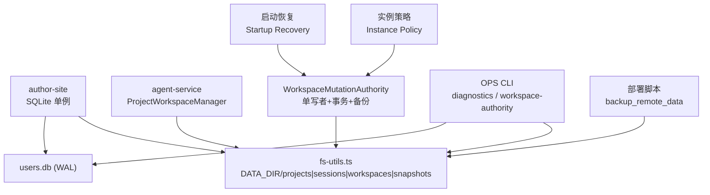
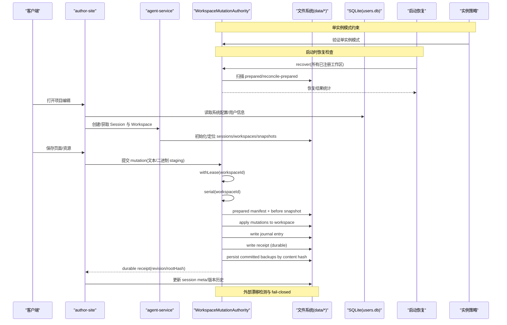
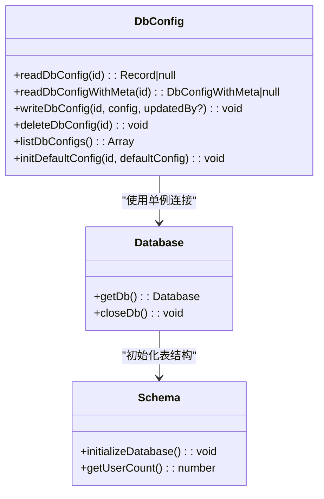
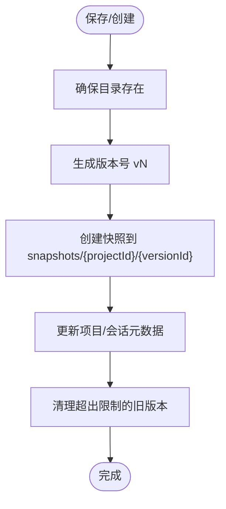
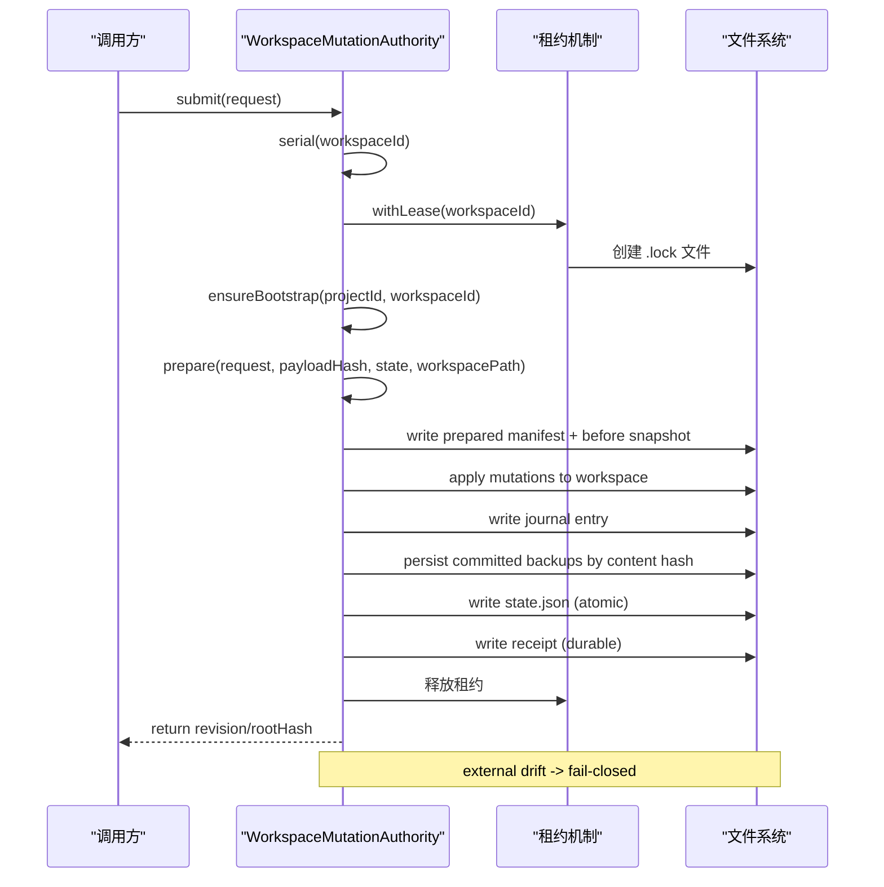
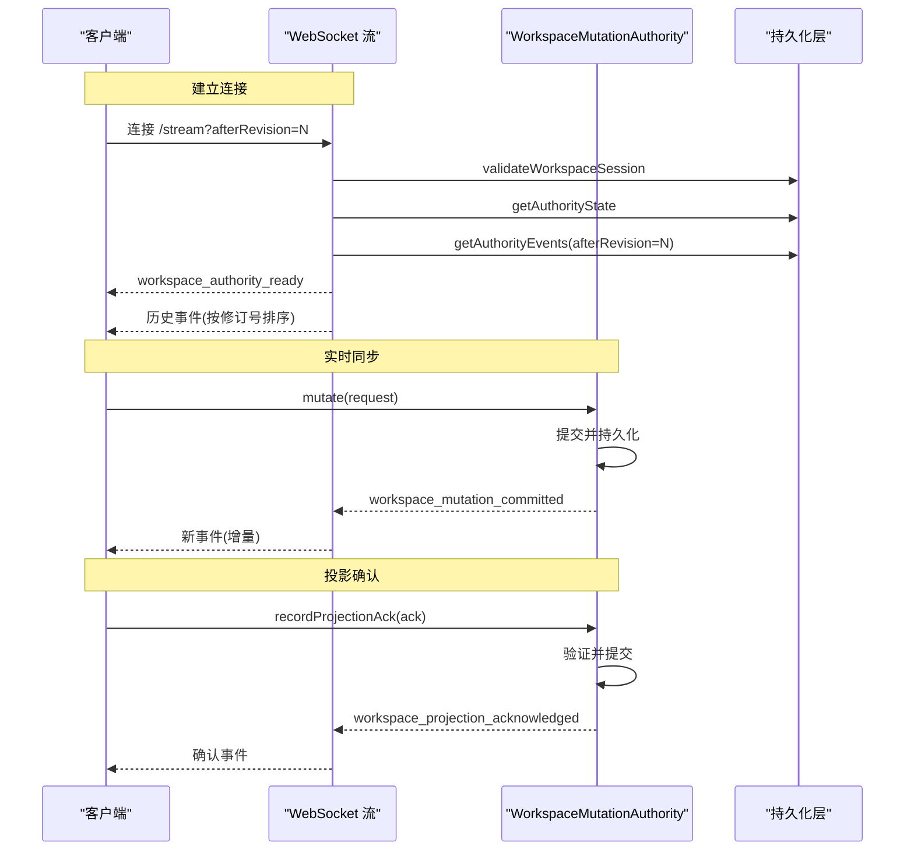
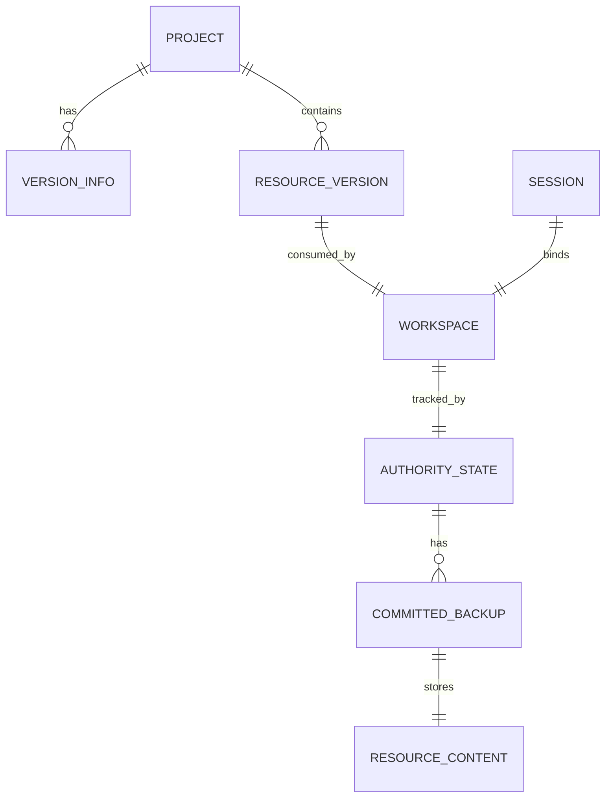
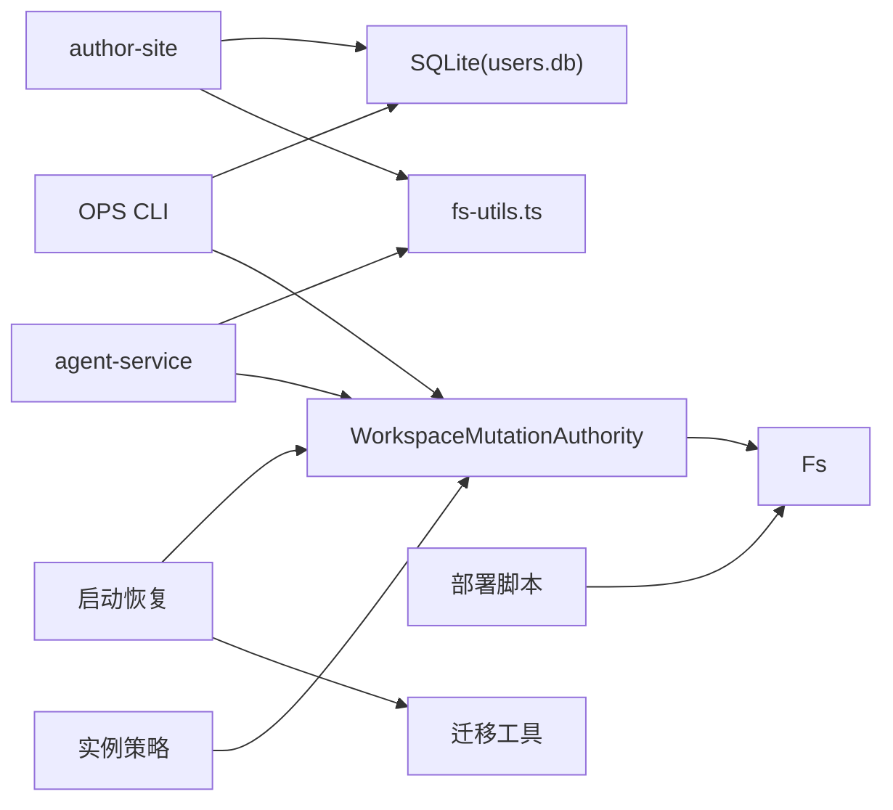

# 数据架构

<cite>
**本文引用的文件列表**
- [packages/author-site/src/lib/db/index.ts](file://packages/author-site/src/lib/db/index.ts)
- [packages/author-site/src/lib/db/schema.ts](file://packages/author-site/src/lib/db/schema.ts)
- [packages/author-site/src/lib/db-config.ts](file://packages/author-site/src/lib/db-config.ts)
- [packages/author-site/scripts/init-db.js](file://packages/author-site/scripts/init-db.js)
- [packages/author-site/src/lib/fs-utils.ts](file://packages/author-site/src/lib/fs-utils.ts)
- [packages/agent-service/src/workspace/project-workspace-manager.ts](file://packages/agent-service/src/workspace/project-workspace-manager.ts)
- [packages/agent-service/src/workspace/workspace-mutation-authority.ts](file://packages/agent-service/src/workspace/workspace-mutation-authority.ts)
- [packages/agent-service/src/workspace/workspace-authority-diagnostics.ts](file://packages/agent-service/src/workspace/workspace-authority-diagnostics.ts)
- [packages/agent-service/src/workspace/workspace-authority-startup-recovery.ts](file://packages/agent-service/src/workspace/workspace-authority-startup-recovery.ts)
- [packages/agent-service/src/workspace/workspace-authority-migration.ts](file://packages/agent-service/src/workspace/workspace-authority-migration.ts)
- [packages/agent-service/src/workspace/workspace-authority-instance-policy.ts](file://packages/agent-service/src/workspace/workspace-authority-instance-policy.ts)
- [packages/agent-service/src/routes/workspace-authority.ts](file://packages/agent-service/src/routes/workspace-authority.ts)
- [OPS/CLI/src/commands/diagnostics.ts](file://OPS/CLI/src/commands/diagnostics.ts)
- [OPS/CLI/src/commands/workspace-authority.ts](file://OPS/CLI/src/commands/workspace-authority.ts)
- [scripts/deploy-author-with-data.sh](file://scripts/deploy-author-with-data.sh)
- [data/README.md](file://data/README.md)
- [docs/项目文档/创作端/03-项目管理/技术/06_项目工作空间迁移方案.md](file://docs/项目文档/创作端/03-项目管理/技术/06_项目工作空间迁移方案.md)
- [docs/项目文档/创作端/03-项目管理/技术/04_版本管理.md](file://docs/项目文档/创作端/03-项目管理/技术/04_版本管理.md)
- [docs/项目文档/创作端/08-管理后台/技术/01_架构设计.md](file://docs/项目文档/创作端/08-管理后台/技术/01_架构设计.md)
</cite>

## 更新摘要
**变更内容**
- 新增 Workspace Mutation Authority 架构的完整文档，包括单写者事务模型、文件系统 ACID 保证、冲突解决策略和分布式同步模式
- 扩展了数据持久化机制章节，详细说明原子写入、预提交日志、幂等收据和一致性恢复
- 更新了并发控制与数据一致性保证部分，涵盖进程内序列化、租约机制和外部漂移检测
- 增强了备份与恢复策略，说明 committed backup 机制和 reconcile/restore 操作
- 新增分布式同步模式章节，描述事件订阅、投影确认和流式同步

## 目录
1. [引言](#引言)
2. [项目结构](#项目结构)
3. [核心组件](#核心组件)
4. [架构总览](#架构总览)
5. [详细组件分析](#详细组件分析)
6. [依赖关系分析](#依赖关系分析)
7. [性能考虑](#性能考虑)
8. [故障排查指南](#故障排查指南)
9. [结论](#结论)
10. [附录](#附录)

## 引言
本数据架构文档面向 Workbench 平台，系统性阐述数据存储策略、数据模型、持久化机制、备份与恢复、数据迁移、数据访问层与安全保护，以及性能优化建议。Workbench 采用"SQLite + 文件系统"的混合存储：SQLite 用于用户、系统配置等结构化元数据；文件系统用于项目、会话、工作区、快照、发布产物、审计日志等非结构化或半结构化数据。通过 Workspace Mutation Authority 提供单写者事务、ACID 保证、幂等提交、外部漂移检测与一致性保障，结合 WAL 模式提升并发读性能。

**更新** 新增了 Workspace Mutation Authority 的完整实现细节，包括文件系统级别的 ACID 事务保证、冲突解决策略和分布式同步模式。

## 项目结构
- 数据根目录 data 由环境变量 DATA_DIR 控制，默认位于仓库 data 目录。其下包含 projects、sessions、workspaces、snapshots、published、templates、knowledge、audit、logs、users.db* 等子目录与文件。
- SQLite 数据库文件 users.db 及其 WAL/SHM 文件存放于 data 目录，由 author-site 进程内单例连接并初始化表结构。
- 文件系统路径由 fs-utils 集中管理，统一解析 PROJECTS_DIR、SESSIONS_DIR、WORKSPACES_DIR、SNAPSHOTS_DIR 等。
- agent-service 中的 ProjectWorkspaceManager 负责项目与工作区的生命周期（创建、保存、版本历史、清理等）。
- Workspace Mutation Authority 作为 live Workspace 的唯一写入者，提供串行提交、prepared/receipt/journal、committed backup、reconcile/restore 等能力。



**图表来源**
- [packages/author-site/src/lib/db/index.ts:10-24](file://packages/author-site/src/lib/db/index.ts#L10-L24)
- [packages/author-site/src/lib/fs-utils.ts:44-101](file://packages/author-site/src/lib/fs-utils.ts#L44-L101)
- [packages/agent-service/src/workspace/project-workspace-manager.ts:28-38](file://packages/agent-service/src/workspace/project-workspace-manager.ts#L28-38)
- [packages/agent-service/src/workspace/workspace-mutation-authority.ts:112-127](file://packages/agent-service/src/workspace/workspace-mutation-authority.ts#L112-127)
- [packages/agent-service/src/workspace/workspace-authority-startup-recovery.ts:36-89](file://packages/agent-service/src/workspace/workspace-authority-startup-recovery.ts#L36-89)
- [packages/agent-service/src/workspace/workspace-authority-instance-policy.ts:13-31](file://packages/agent-service/src/workspace/workspace-authority-instance-policy.ts#L13-31)
- [OPS/CLI/src/commands/diagnostics.ts:387-421](file://OPS/CLI/src/commands/diagnostics.ts#L387-421)
- [scripts/deploy-author-with-data.sh:172-215](file://scripts/deploy-author-with-data.sh#L172-215)

**章节来源**
- [data/README.md:1-43](file://data/README.md#L1-L43)
- [packages/author-site/src/lib/fs-utils.ts:44-101](file://packages/author-site/src/lib/fs-utils.ts#L44-L101)
- [packages/author-site/src/lib/db/index.ts:10-24](file://packages/author-site/src/lib/db/index.ts#L10-L24)

## 核心组件
- SQLite 数据访问层
  - 单例连接、WAL 模式、外键开启、自动建表。
  - 提供 system_configs 的 CRUD 封装，供管理后台动态配置使用。
- 文件系统数据层
  - 统一路径解析与目录初始化。
  - 项目、会话、工作区、快照、发布产物、模板、知识、审计日志等按目录组织。
- 项目与工作区管理器
  - 基于文件系统的项目创建、会话保存、版本历史生成与清理。
- Workspace Mutation Authority
  - 单写者串行提交、prepared manifest、receipt 幂等、journal 审计、committed backup、external drift 检测、reconcile/restore。
  - 文件系统级 ACID 事务保证，支持崩溃恢复和一致性验证。
  - 进程内队列序列化、租约机制防止多实例竞争。
- OPS CLI 诊断与运维
  - 读取 SQLite 事件、查询 Workspace Authority health/preflight、执行 bootstrap/adopt/restore dry-run 与 apply。
- 部署与备份
  - 打包 data 目录及 legacy volume 进行远程备份。

**更新** 增强了 Workspace Mutation Authority 的描述，增加了文件系统级 ACID 事务保证、崩溃恢复和一致性验证等关键特性。

**章节来源**
- [packages/author-site/src/lib/db/index.ts:10-24](file://packages/author-site/src/lib/db/index.ts#L10-L24)
- [packages/author-site/src/lib/db/schema.ts:1-112](file://packages/author-site/src/lib/db/schema.ts#L1-L112)
- [packages/author-site/src/lib/db-config.ts:1-130](file://packages/author-site/src/lib/db-config.ts#L1-L130)
- [packages/author-site/src/lib/fs-utils.ts:44-101](file://packages/author-site/src/lib/fs-utils.ts#L44-L101)
- [packages/agent-service/src/workspace/project-workspace-manager.ts:166-200](file://packages/agent-service/src/workspace/project-workspace-manager.ts#L166-L200)
- [packages/agent-service/src/workspace/workspace-mutation-authority.ts:112-200](file://packages/agent-service/src/workspace/workspace-mutation-authority.ts#L112-L200)
- [OPS/CLI/src/commands/diagnostics.ts:387-421](file://OPS/CLI/src/commands/diagnostics.ts#L387-L421)
- [scripts/deploy-author-with-data.sh:172-215](file://scripts/deploy-author-with-data.sh#L172-215)

## 架构总览
Workbench 的数据架构围绕"SQLite 元数据 + 文件系统业务数据 + Workspace Authority 一致性"展开。author-site 通过 SQLite 管理用户与系统配置；agent-service 通过文件系统管理项目与会话；Workspace Mutation Authority 确保 live Workspace 的原子性、可恢复性与一致性。OPS CLI 提供只读诊断与运维命令，部署脚本负责 data 目录备份。

**更新** 新增了启动恢复和实例策略组件，增强了整体架构的健壮性和可运维性。



**图表来源**
- [packages/author-site/src/lib/db-config.ts:33-93](file://packages/author-site/src/lib/db-config.ts#L33-L93)
- [packages/agent-service/src/workspace/project-workspace-manager.ts:166-200](file://packages/agent-service/src/workspace/project-workspace-manager.ts#L166-L200)
- [packages/agent-service/src/workspace/workspace-mutation-authority.ts:112-200](file://packages/agent-service/src/workspace/workspace-mutation-authority.ts#L112-L200)
- [packages/agent-service/src/workspace/workspace-authority-startup-recovery.ts:36-89](file://packages/agent-service/src/workspace/workspace-authority-startup-recovery.ts#L36-89)
- [packages/agent-service/src/workspace/workspace-authority-instance-policy.ts:13-31](file://packages/agent-service/src/workspace/workspace-authority-instance-policy.ts#L13-31)

## 详细组件分析

### SQLite 数据库设计与访问层
- 表结构
  - users：用户主表，含唯一用户名与密码哈希。
  - system_configs：系统级动态配置，JSON 字段存储配置对象，支持 upsert。
  - user_model_configs、user_authoring_preferences、user_external_auth_configs：用户级配置与外部授权配置。
  - user_dingtalk_identities：钉钉身份映射，含复合唯一索引与用户索引。
  - password_reset_logs：密码重置审计记录，含用户与时间索引。
- 连接与初始化
  - 单例 getDb() 在首次调用时创建连接、设置 WAL 模式与外键约束，并执行 initializeDatabase() 建表。
  - 提供 closeDb() 关闭连接。
- 配置读写封装
  - readDbConfig/readDbConfigWithMeta/writeDbConfig/deleteDbConfig/listDbConfigs/initDefaultConfig 提供 system_configs 的完整 CRUD。
- 并发与一致性
  - WAL 模式提升并发读性能；外键约束保证引用完整性；upsert 避免重复插入。



**图表来源**
- [packages/author-site/src/lib/db/index.ts:10-32](file://packages/author-site/src/lib/db/index.ts#L10-L32)
- [packages/author-site/src/lib/db/schema.ts:1-112](file://packages/author-site/src/lib/db/schema.ts#L1-L112)
- [packages/author-site/src/lib/db-config.ts:1-130](file://packages/author-site/src/lib/db-config.ts#L1-L130)

**章节来源**
- [packages/author-site/src/lib/db/index.ts:10-32](file://packages/author-site/src/lib/db/index.ts#L10-L32)
- [packages/author-site/src/lib/db/schema.ts:1-112](file://packages/author-site/src/lib/db/schema.ts#L1-L112)
- [packages/author-site/src/lib/db-config.ts:1-130](file://packages/author-site/src/lib/db-config.ts#L1-L130)
- [packages/author-site/scripts/init-db.js:1-49](file://packages/author-site/scripts/init-db.js#L1-L49)

### 文件系统存储方案与数据模型
- 目录结构
  - projects：项目源数据、workspace、页面文件、元信息。
  - sessions：会话元数据（.session.json），支持新旧两种路径兼容。
  - workspaces：Agent 或编辑过程的工作区。
  - snapshots：项目或会话快照（版本历史）。
  - published：发布后的 viewer 数据。
  - templates：项目模板数据。
  - knowledge：知识库运行数据。
  - audit：审计记录（按日期分目录）。
  - logs：服务运行日志。
  - users.db*：SQLite 主库与 WAL/SHM。
- 路径解析与初始化
  - fs-utils 暴露 getDataDir/getProjectsDir/getSessionsDir/getWorkspacesDir/getSnapshotsDir 等函数，ensureDirsExist 确保目录存在。
  - getSessionPath/findSessionPath 兼容旧结构与新的 sessions/{userId}/{projectId}/{sessionId}/ 布局。
- 版本与快照
  - ProjectWorkspaceManager 实现 generateVersionId、saveEditSession、cleanupOldVersions、getVersionHistory 等，配合 fs-utils 完成版本快照与清理。
  - 版本管理文档明确保留最近 50 个版本，优先淘汰自动保存记录。



**图表来源**
- [packages/author-site/src/lib/fs-utils.ts:82-101](file://packages/author-site/src/lib/fs-utils.ts#L82-L101)
- [packages/agent-service/src/workspace/project-workspace-manager.ts:40-49](file://packages/agent-service/src/workspace/project-workspace-manager.ts#L40-L49)
- [docs/项目文档/创作端/03-项目管理/技术/04_版本管理.md:35-64](file://docs/项目文档/创作端/03-项目管理/技术/04_版本管理.md#L35-L64)

**章节来源**
- [data/README.md:18-35](file://data/README.md#L18-L35)
- [packages/author-site/src/lib/fs-utils.ts:44-200](file://packages/author-site/src/lib/fs-utils.ts#L44-L200)
- [packages/agent-service/src/workspace/project-workspace-manager.ts:166-200](file://packages/agent-service/src/workspace/project-workspace-manager.ts#L166-L200)
- [docs/项目文档/创作端/03-项目管理/技术/06_项目工作空间迁移方案.md:27-74](file://docs/项目文档/创作端/03-项目管理/技术/06_项目工作空间迁移方案.md#L27-L74)
- [docs/项目文档/创作端/03-项目管理/技术/04_版本管理.md:35-64](file://docs/项目文档/创作端/03-项目管理/技术/04_版本管理.md#L35-L64)

### Workspace Mutation Authority（单写者事务与一致性）
- 职责
  - 为激活的 live Workspace 提供唯一写入通道，维护 per-workspace 队列与状态。
  - 支持 prepare/apply/rollback、receipt 幂等、journal 审计、committed backup、external drift 检测、reconcile/restore。
  - 提供文件系统级 ACID 事务保证，确保崩溃恢复和数据一致性。
- 关键流程
  - bootstrap：初始化 authority state、resource hashes、mutation payloads。
  - submit：串行化提交，写入 prepared manifest、journal，成功后写入 receipt 与 committed backups。
  - reconcileRestore：丢弃外部漂移，恢复到上次提交的 rootHash，需验证备份完整性。
  - health/preflight：返回 ready、revision/rootHash、actualRootHash、externalDrift、queueDepth、activeLease、prepared/staging/receipt/journal/projectionAck 计数等。
- 并发与一致性
  - 进程内 Map 维护 queues、listeners、draftProviders，跨实例共享 DATA_DIR 下的 receipts/journal/state/backups。
  - 启动恢复屏障：扫描已注册 live Workspace，回滚无 receipt 的 prepared mutation，清理 stale lease 或不一致状态。
  - 租约机制：通过文件系统锁防止多实例竞争，fail-closed 策略确保安全性。
- 文件系统 ACID 保证
  - 原子写入：所有文件操作使用临时文件 + rename 保证原子性。
  - 预提交日志：prepared manifest 记录 before 状态，支持崩溃后恢复。
  - 幂等收据：receipt 文件提供提交证明，支持重试和重放。
  - 一致性验证：rootHash 计算所有资源哈希，检测外部修改。

**更新** 新增了文件系统 ACID 保证的详细实现，包括原子写入、预提交日志、幂等收据和一致性验证机制。



**图表来源**
- [packages/agent-service/src/workspace/workspace-mutation-authority.ts:112-200](file://packages/agent-service/src/workspace/workspace-mutation-authority.ts#L112-L200)
- [packages/agent-service/src/workspace/workspace-mutation-authority.ts:309-336](file://packages/agent-service/src/workspace/workspace-mutation-authority.ts#L309-L336)
- [packages/agent-service/src/workspace/workspace-mutation-authority.ts:1005-1028](file://packages/agent-service/src/workspace/workspace-mutation-authority.ts#L1005-L1028)
- [packages/agent-service/src/workspace/workspace-mutation-authority.ts:920-944](file://packages/agent-service/src/workspace/workspace-mutation-authority.ts#L920-L944)

**章节来源**
- [packages/agent-service/src/workspace/workspace-mutation-authority.ts:112-200](file://packages/agent-service/src/workspace/workspace-mutation-authority.ts#L112-L200)
- [packages/agent-service/src/workspace/workspace-mutation-authority.ts:309-336](file://packages/agent-service/src/workspace/workspace-mutation-authority.ts#L309-L336)
- [packages/agent-service/src/workspace/workspace-mutation-authority.ts:1005-1028](file://packages/agent-service/src/workspace/workspace-mutation-authority.ts#L1005-L1028)
- [packages/agent-service/src/workspace/workspace-mutation-authority.ts:920-944](file://packages/agent-service/src/workspace/workspace-mutation-authority.ts#L920-L944)

### 分布式同步模式
- 事件订阅机制
  - onCommitted：监听工作区变更事件，支持多个订阅者。
  - onProjectionAck：监听投影确认事件，跟踪客户端状态同步。
  - getCommittedEventsSince：从指定修订号开始获取已提交事件。
  - getProjectionAcks：获取投影确认记录，支持断点续传。
- 流式同步
  - WebSocket 流：实时推送工作区变更事件，支持增量同步。
  - 修订号追踪：客户端维护 lastAppliedRevision，服务端检测间隙并发送 gap 事件。
  - 缓冲机制：初始化阶段缓冲事件，连接建立后按顺序发送。
- 投影确认
  - recordProjectionAck：记录客户端投影确认，支持超时和冲突检测。
  - projectionLatencyMs：计算投影延迟，监控同步性能。
  - 冲突处理：当 ack.revision > state.revision 时抛出 WORKSPACE_RESOURCE_CONFLICT。

**新增** 完整的分布式同步模式文档，包括事件订阅、流式同步和投影确认机制。



**图表来源**
- [packages/agent-service/src/workspace/workspace-mutation-authority.ts:129-179](file://packages/agent-service/src/workspace/workspace-mutation-authority.ts#L129-L179)
- [packages/agent-service/src/workspace/workspace-mutation-authority.ts:380-451](file://packages/agent-service/src/workspace/workspace-mutation-authority.ts#L380-L451)
- [packages/agent-service/src/routes/workspace-authority.ts:124-193](file://packages/agent-service/src/routes/workspace-authority.ts#L124-L193)

**章节来源**
- [packages/agent-service/src/workspace/workspace-mutation-authority.ts:129-179](file://packages/agent-service/src/workspace/workspace-mutation-authority.ts#L129-L179)
- [packages/agent-service/src/workspace/workspace-mutation-authority.ts:380-451](file://packages/agent-service/src/workspace/workspace-mutation-authority.ts#L380-L451)
- [packages/agent-service/src/routes/workspace-authority.ts:124-193](file://packages/agent-service/src/routes/workspace-authority.ts#L124-L193)

### 数据备份与恢复策略
- 定期备份
  - 部署脚本 backup_remote_data 将 /opt/workbench/data 打包为 tar.gz，同时检查 legacy docker volume 并备份。
- 增量与灾难恢复
  - Workspace Authority 的 committed backup 以内容 hash 命名，支持按资源粒度恢复；reconcileRestore 在备份缺失时 fail-closed，保留外部内容。
  - 启动恢复屏障会回滚未提交 prepared mutation，清理 staging 与 stale lease，保证就绪态。
  - 启动恢复流程：discoverLiveWorkspaces 扫描所有 live 工作区，对每个工作区执行 recover 操作，统计恢复结果。
- 运维命令
  - OPS CLI 提供 workspace-authority-status、preflight、bootstrap、reconcile-adopt、reconcile-restore 等命令，支持 dry-run 与 --apply。
- 实例策略
  - 单实例模式强制：WORKSPACE_AUTHORITY_INSTANCE_MODE=single 且 WORKSPACE_AUTHORITY_REPLICA_COUNT=1。
  - 多实例不支持：需要持久的 fencing-token lease 才能启用多实例模式。

**更新** 新增了启动恢复流程和实例策略的详细说明，增强了灾难恢复和部署安全性的描述。

```mermaid
flowchart TD
Start(["备份入口"]) --> CheckEnv["检查 APP_DATA_DIR/.env.docker"]
CheckEnv --> TarData["tar -C dirname(app_data_dir) -czf stamp-bind-data.tar.gz data"]
TarData --> CheckVolume{"legacy volume 存在?"}
CheckVolume --> |是| TarVolume["tar -C volume_path . -> stamp-legacy-volume-data.tar.gz"]
CheckVolume --> |否| SkipVolume["跳过"]
TarVolume --> Sum["sha256sum *.tar.gz"]
SkipVolume --> Sum
Sum --> End(["备份完成"])
Note over Start,End: 启动恢复流程
RecoverStart(["服务启动"]) --> Discover["discoverLiveWorkspaces"]
Discover --> ForEach["遍历已注册工作区"]
ForEach --> Recover["authority.recover()"]
Recover --> Stats["统计恢复结果"]
Stats --> Ready["标记为 ready"]
```

**图表来源**
- [scripts/deploy-author-with-data.sh:172-215](file://scripts/deploy-author-with-data.sh#L172-215)
- [packages/agent-service/src/workspace/workspace-mutation-authority.ts:309-336](file://packages/agent-service/src/workspace/workspace-mutation-authority.ts#L309-L336)
- [packages/agent-service/src/workspace/workspace-authority-startup-recovery.ts:36-89](file://packages/agent-service/src/workspace/workspace-authority-startup-recovery.ts#L36-89)
- [packages/agent-service/src/workspace/workspace-authority-migration.ts:37-60](file://packages/agent-service/src/workspace/workspace-authority-migration.ts#L37-L60)
- [OPS/CLI/src/commands/workspace-authority.ts:500-523](file://OPS/CLI/src/commands/workspace-authority.ts#L500-L523)
- [packages/agent-service/src/workspace/workspace-authority-instance-policy.ts:13-31](file://packages/agent-service/src/workspace/workspace-authority-instance-policy.ts#L13-31)

**章节来源**
- [scripts/deploy-author-with-data.sh:172-215](file://scripts/deploy-author-with-data.sh#L172-215)
- [packages/agent-service/src/workspace/workspace-mutation-authority.ts:309-336](file://packages/agent-service/src/workspace/workspace-mutation-authority.ts#L309-L336)
- [packages/agent-service/src/workspace/workspace-authority-startup-recovery.ts:36-89](file://packages/agent-service/src/workspace/workspace-authority-startup-recovery.ts#L36-89)
- [packages/agent-service/src/workspace/workspace-authority-migration.ts:37-60](file://packages/agent-service/src/workspace/workspace-authority-migration.ts#L37-L60)
- [OPS/CLI/src/commands/workspace-authority.ts:500-523](file://OPS/CLI/src/commands/workspace-authority.ts#L500-L523)
- [packages/agent-service/src/workspace/workspace-authority-instance-policy.ts:13-31](file://packages/agent-service/src/workspace/workspace-authority-instance-policy.ts#L13-31)

### 数据迁移与版本管理
- 版本管理
  - 项目级 VersionInfo 与资源级内容图并存；资源版本记录不可变内容，项目提交记录影响范围。
  - 自动保存、命名版本、发布快照、恢复语义记录均绑定 Workspace revision/rootHash，确保可追溯。
- 迁移与演进
  - 工作空间迁移方案文档记录了 SessionMeta 扩展、版本快照、资源恢复、权限校验等落地情况。
  - 废弃整项目覆盖恢复入口，改为资源级恢复并通过 Authority receipt 进入当前 live Workspace。
- 迁移工具
  - migrateWorkspaceAuthorities：批量迁移工作区 Authority 状态，支持 would-bootstrap、bootstrapped、would-repair-backups、backups-repaired 等操作。
  - discoverLiveWorkspaces：递归扫描 workspaces 目录，识别所有 live 工作区。

**更新** 新增了迁移工具的详细说明，包括批量操作和发现机制。



**图表来源**
- [docs/项目文档/创作端/03-项目管理/技术/04_版本管理.md:67-155](file://docs/项目文档/创作端/03-项目管理/技术/04_版本管理.md#L67-L155)
- [docs/项目文档/创作端/03-项目管理/技术/06_项目工作空间迁移方案.md:27-74](file://docs/项目文档/创作端/03-项目管理/技术/06_项目工作空间迁移方案.md#L27-L74)
- [packages/agent-service/src/workspace/workspace-mutation-authority.ts:988-1028](file://packages/agent-service/src/workspace/workspace-mutation-authority.ts#L988-L1028)

**章节来源**
- [docs/项目文档/创作端/03-项目管理/技术/04_版本管理.md:35-155](file://docs/项目文档/创作端/03-项目管理/技术/04_版本管理.md#L35-L155)
- [docs/项目文档/创作端/03-项目管理/技术/06_项目工作空间迁移方案.md:27-74](file://docs/项目文档/创作端/03-项目管理/技术/06_项目工作空间迁移方案.md#L27-L74)
- [packages/agent-service/src/workspace/workspace-authority-migration.ts:69-139](file://packages/agent-service/src/workspace/workspace-authority-migration.ts#L69-L139)

### 数据访问层设计（Repository 模式与 ORM）
- 现状
  - 未引入 ORM，直接通过 better-sqlite3 原生 API 操作 users.db。
  - db-config.ts 对 system_configs 提供类 Repository 的 CRUD 封装，屏蔽 SQL 细节。
- 优化建议
  - 抽象统一的 DataStore 接口，逐步引入轻量 ORM 或 Query Builder，增强类型安全与可测试性。
  - 对高频查询建立索引（如 users.username、system_configs.updated_at、password_reset_logs.user_id/created_at）。
  - 引入缓存层（进程内 LRU 或 Redis）缓存热配置项，降低 SQLite 压力。

**章节来源**
- [packages/author-site/src/lib/db-config.ts:1-130](file://packages/author-site/src/lib/db-config.ts#L1-L130)
- [packages/author-site/src/lib/db/schema.ts:1-112](file://packages/author-site/src/lib/db/schema.ts#L1-L112)

### 数据安全保护
- 敏感信息加密
  - 外部授权凭证使用 AES-256-GCM 加密，密钥从环境变量派生，格式包含版本、IV、auth tag 与密文。
- 访问权限控制
  - 管理后台 Admin Secret 验证、Cookie 属性与中间件拦截；用户配置与外部授权受用户级隔离。
- 审计日志记录
  - Workspace Authority 全生命周期事件写入 JSONL spool，脱敏字段，支持诊断导出与合并。
  - audit 目录按日期归档审计记录。
  - 投影诊断：记录投影应用、失败、间隙检测等事件，支持性能监控和问题排查。

**更新** 新增了投影诊断的详细描述，包括投影延迟监控和错误追踪。

```mermaid
flowchart TD
Start(["写入外部授权凭证"]) --> Encrypt["AES-256-GCM 加密"]
Encrypt --> Store["写入 user_external_auth_configs.config_json"]
Store --> End(["完成"])
Note over Start,End: 投影诊断流程
ProjStart(["投影操作"]) --> Record["appendWorkspaceProjectionDiagnostic"]
Record --> Spool["写入 editor-diagnostics/agent-service.jsonl"]
Spool --> End(["完成"])
```

**图表来源**
- [packages/author-site/src/lib/external-auth.ts:44-89](file://packages/author-site/src/lib/external-auth.ts#L44-L89)
- [docs/项目文档/创作端/08-管理后台/技术/01_架构设计.md:297-328](file://docs/项目文档/创作端/08-管理后台/技术/01_架构设计.md#L297-L328)
- [packages/agent-service/src/workspace/workspace-authority-diagnostics.ts:9-59](file://packages/agent-service/src/workspace/workspace-authority-diagnostics.ts#L9-L59)

**章节来源**
- [packages/author-site/src/lib/external-auth.ts:44-89](file://packages/author-site/src/lib/external-auth.ts#L44-L89)
- [docs/项目文档/创作端/08-管理后台/技术/01_架构设计.md:297-328](file://docs/项目文档/创作端/08-管理后台/技术/01_架构设计.md#L297-L328)
- [packages/agent-service/src/workspace/workspace-authority-diagnostics.ts:9-59](file://packages/agent-service/src/workspace/workspace-authority-diagnostics.ts#L9-L59)

## 依赖关系分析
- author-site 依赖 SQLite 单例与 fs-utils 路径解析。
- agent-service 的 ProjectWorkspaceManager 依赖文件系统路径与环境变量。
- WorkspaceMutationAuthority 依赖文件系统持久化（state/journal/receipt/backups）与共享队列/监听器。
- OPS CLI 依赖 SQLite 与 Workspace Authority 健康接口，提供诊断与运维能力。
- 部署脚本依赖容器内 data 目录挂载与 legacy volume。
- 启动恢复模块依赖迁移工具和 Authority 实例。
- 实例策略模块提供部署前验证，确保单实例模式。

**更新** 新增了启动恢复和实例策略的依赖关系。



**图表来源**
- [packages/author-site/src/lib/db/index.ts:10-24](file://packages/author-site/src/lib/db/index.ts#L10-L24)
- [packages/author-site/src/lib/fs-utils.ts:44-101](file://packages/author-site/src/lib/fs-utils.ts#L44-L101)
- [packages/agent-service/src/workspace/project-workspace-manager.ts:28-38](file://packages/agent-service/src/workspace/project-workspace-manager.ts#L28-L38)
- [packages/agent-service/src/workspace/workspace-mutation-authority.ts:112-127](file://packages/agent-service/src/workspace/workspace-mutation-authority.ts#L112-L127)
- [packages/agent-service/src/workspace/workspace-authority-startup-recovery.ts:36-89](file://packages/agent-service/src/workspace/workspace-authority-startup-recovery.ts#L36-89)
- [packages/agent-service/src/workspace/workspace-authority-migration.ts:37-60](file://packages/agent-service/src/workspace/workspace-authority-migration.ts#L37-L60)
- [packages/agent-service/src/workspace/workspace-authority-instance-policy.ts:13-31](file://packages/agent-service/src/workspace/workspace-authority-instance-policy.ts#L13-31)
- [OPS/CLI/src/commands/diagnostics.ts:387-421](file://OPS/CLI/src/commands/diagnostics.ts#L387-L421)
- [scripts/deploy-author-with-data.sh:172-215](file://scripts/deploy-author-with-data.sh#L172-215)

**章节来源**
- [packages/author-site/src/lib/db/index.ts:10-24](file://packages/author-site/src/lib/db/index.ts#L10-L24)
- [packages/author-site/src/lib/fs-utils.ts:44-101](file://packages/author-site/src/lib/fs-utils.ts#L44-L101)
- [packages/agent-service/src/workspace/project-workspace-manager.ts:28-38](file://packages/agent-service/src/workspace/project-workspace-manager.ts#L28-L38)
- [packages/agent-service/src/workspace/workspace-mutation-authority.ts:112-127](file://packages/agent-service/src/workspace/workspace-mutation-authority.ts#L112-L127)
- [packages/agent-service/src/workspace/workspace-authority-startup-recovery.ts:36-89](file://packages/agent-service/src/workspace/workspace-authority-startup-recovery.ts#L36-89)
- [packages/agent-service/src/workspace/workspace-authority-migration.ts:37-60](file://packages/agent-service/src/workspace/workspace-authority-migration.ts#L37-L60)
- [packages/agent-service/src/workspace/workspace-authority-instance-policy.ts:13-31](file://packages/agent-service/src/workspace/workspace-authority-instance-policy.ts#L13-31)
- [OPS/CLI/src/commands/diagnostics.ts:387-421](file://OPS/CLI/src/commands/diagnostics.ts#L387-L421)
- [scripts/deploy-author-with-data.sh:172-215](file://scripts/deploy-author-with-data.sh#L172-215)

## 性能考虑
- SQLite 并发
  - 启用 WAL 模式提升读并发；谨慎使用长事务，避免写阻塞。
- 文件系统 I/O
  - 批量写入合并为单个 Authority mutation，减少磁盘抖动。
  - 版本快照与清理策略限制数量，避免磁盘膨胀。
  - 原子写入使用临时文件 + rename，减少锁竞争。
- 查询优化
  - 为常用查询列建立索引（如 users.username、system_configs.updated_at、password_reset_logs.user_id/created_at）。
  - 使用参数化查询与预编译语句，避免 SQL 注入与重复解析。
- 缓存策略
  - 对热配置项（system_configs）引入进程内缓存或分布式缓存，降低 SQLite 压力。
- Authority 队列
  - 监控 queueDepth 与 conflictCount，必要时扩容或限流。
  - 进程内队列序列化，避免多实例竞争。
- 流式同步
  - WebSocket 流支持增量同步，减少网络传输开销。
  - 投影确认机制跟踪客户端状态，支持断点续传。

**更新** 新增了文件系统 I/O 优化、Authority 队列管理和流式同步的性能考虑。

## 故障排查指南
- SQLite 诊断
  - OPS CLI diagnostics 支持按 project/session/workspace/editorSession/trace/operation/eventType/group/since 过滤，读取 users.db 并输出事件。
- Workspace Authority 诊断
  - health/preflight 命令输出 ready、revision/rootHash、externalDrift、queueDepth、activeLease、preparedCount、missingBackupCount 等指标。
  - 启动恢复状态：scannedWorkspaceCount、registeredWorkspaceCount、pendingTransactionCount、recoveredTransactionCount、rolledBackCount 等。
- 启动恢复
  - 服务启动前扫描 live Workspace，回滚 prepared mutation，清理 stale lease，失败则阻止 ready。
  - 恢复流程：discoverLiveWorkspaces → for each workspace → authority.recover() → 统计结果。
- 部署前置检查
  - 脚本 check-workspace-deploy-preflight.mjs 扫描 live Workspace 与 Authority 内部状态，阻断未注册、external drift、stale lease、prepared/reconcile-prepared、committed backup 缺口等问题。
- 实例策略验证
  - 启动时验证 WORKSPACE_AUTHORITY_INSTANCE_MODE=single 且 WORKSPACE_AUTHORITY_REPLICA_COUNT=1。

**更新** 新增了启动恢复和实例策略的故障排查指南。

**章节来源**
- [OPS/CLI/src/commands/diagnostics.ts:387-421](file://OPS/CLI/src/commands/diagnostics.ts#L387-L421)
- [OPS/CLI/src/commands/workspace-authority.ts:500-523](file://OPS/CLI/src/commands/workspace-authority.ts#L500-L523)
- [packages/agent-service/src/workspace/workspace-mutation-authority.ts:191-200](file://packages/agent-service/src/workspace/workspace-mutation-authority.ts#L191-L200)
- [packages/agent-service/src/workspace/workspace-authority-startup-recovery.ts:36-89](file://packages/agent-service/src/workspace/workspace-authority-startup-recovery.ts#L36-89)
- [packages/agent-service/src/workspace/workspace-authority-instance-policy.ts:13-31](file://packages/agent-service/src/workspace/workspace-authority-instance-policy.ts#L13-31)

## 结论
Workbench 的数据架构以 SQLite 与文件系统为核心，辅以 Workspace Mutation Authority 提供强一致性与可恢复性。通过 WAL 模式、prepared/receipt/journal、committed backup 与 reconcile/restore 机制，系统在多进程/多实例环境下仍能保持 live Workspace 的单写者与幂等提交。文件系统级 ACID 事务保证确保崩溃恢复和数据一致性，启动恢复流程提供自动修复能力，实例策略确保部署安全性。结合 OPS CLI 的诊断与部署前置检查，形成完整的运维闭环。未来可在数据访问层引入轻量 ORM 与缓存层，进一步提升可维护性与性能。

**更新** 强调了文件系统级 ACID 事务保证、启动恢复流程和实例策略的重要性。

## 附录
- 数据目录说明
  - data/README.md 提供了各子目录用途与排查建议，强调只读优先与隐私保护。
- 版本管理与迁移
  - 版本管理文档明确了自动保存、命名版本、发布快照、资源级历史与清理策略。
  - 工作空间迁移方案文档记录了 SessionMeta 扩展、版本快照、资源恢复、权限校验等落地情况。
- 迁移工具
  - migrateWorkspaceAuthorities 支持批量迁移工作区 Authority 状态。
  - discoverLiveWorkspaces 递归扫描 workspaces 目录，识别所有 live 工作区。

**更新** 新增了迁移工具的附录说明。

**章节来源**
- [data/README.md:1-43](file://data/README.md#L1-L43)
- [docs/项目文档/创作端/03-项目管理/技术/04_版本管理.md:35-155](file://docs/项目文档/创作端/03-项目管理/技术/04_版本管理.md#L35-L155)
- [docs/项目文档/创作端/03-项目管理/技术/06_项目工作空间迁移方案.md:27-74](file://docs/项目文档/创作端/03-项目管理/技术/06_项目工作空间迁移方案.md#L27-L74)
- [packages/agent-service/src/workspace/workspace-authority-migration.ts:69-139](file://packages/agent-service/src/workspace/workspace-authority-migration.ts#L69-L139)