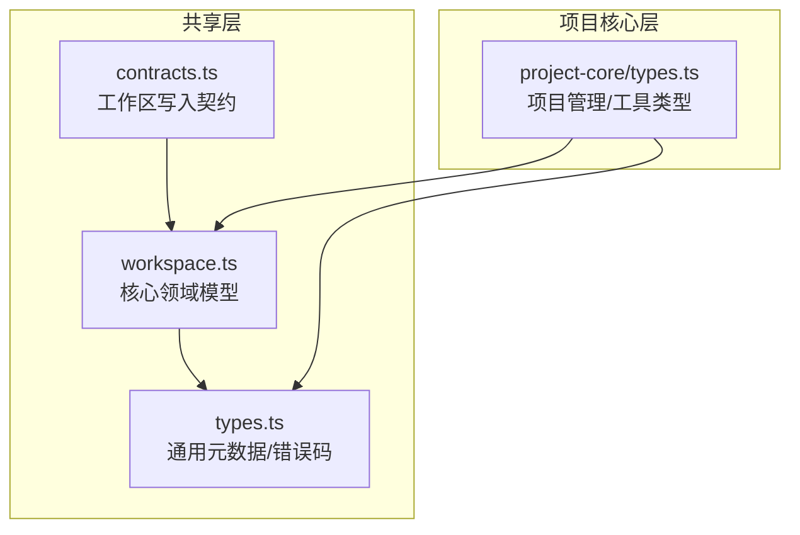
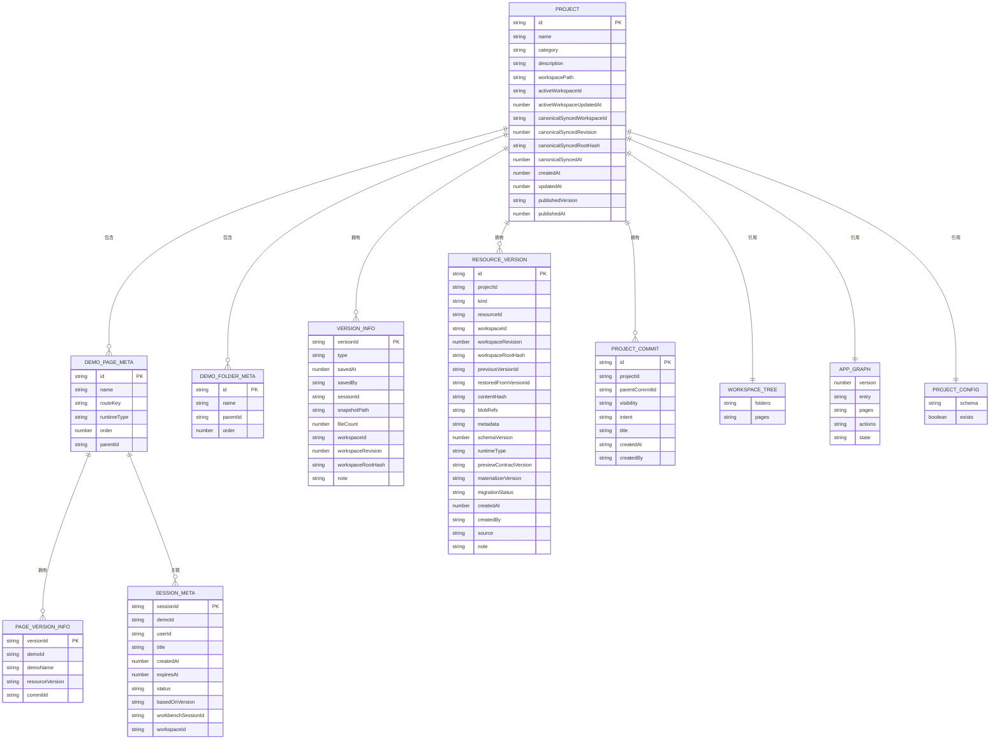
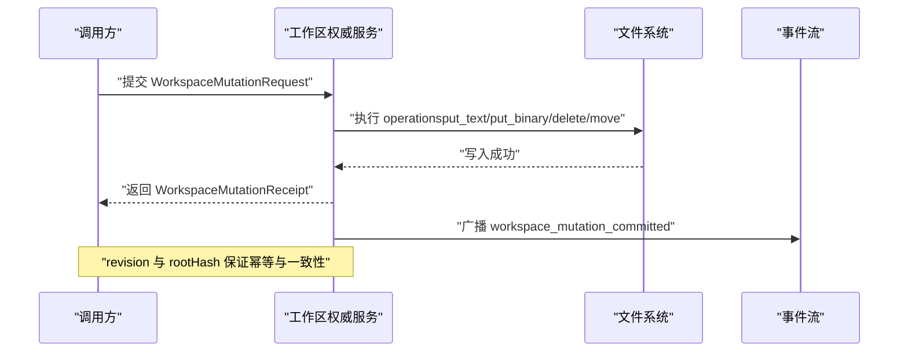
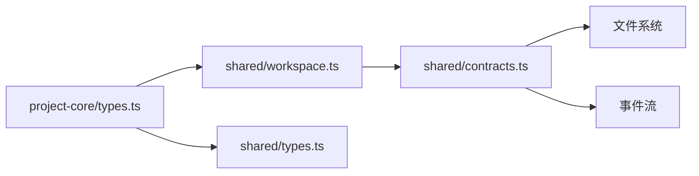

# 数据模型

<cite>
**本文引用的文件**
- [packages/shared/src/workspace.ts](file://packages/shared/src/workspace.ts)
- [packages/shared/src/types.ts](file://packages/shared/src/types.ts)
- [packages/shared/src/contracts.ts](file://packages/shared/src/contracts.ts)
- [packages/project-core/src/types.ts](file://packages/project-core/src/types.ts)
</cite>

## 目录
1. [简介](#简介)
2. [项目结构](#项目结构)
3. [核心组件](#核心组件)
4. [架构总览](#架构总览)
5. [详细组件分析](#详细组件分析)
6. [依赖关系分析](#依赖关系分析)
7. [性能考量](#性能考量)
8. [故障排查指南](#故障排查指南)
9. [结论](#结论)
10. [附录](#附录)

## 简介
本文件面向 Workbench 平台的数据模型，聚焦以下关键实体与契约：Project、Workspace、Session、Version、Page（DemoPageMeta）、ResourceVersion、ProjectCommit、AppGraph、ProjectConfig 等。文档从字段定义、业务含义、实体关系、验证规则、生命周期管理、序列化格式与版本兼容、演进策略以及使用示例与最佳实践等方面进行全面阐述，帮助读者快速理解并正确使用这些模型。

## 项目结构
Workbench 的数据模型主要分布在共享合约与领域类型中：
- packages/shared/src/workspace.ts：核心领域模型（Project、VersionInfo、PageVersionInfo、ResourceVersion、ProjectCommit、DemoPageMeta、DemoFolderMeta、WorkspaceTree、ProjectConfig、编辑与会话相关请求/响应等）
- packages/shared/src/types.ts：通用元数据与错误码（DemoMeta、SessionMeta、API 响应包装、错误码枚举与消息映射）
- packages/shared/src/contracts.ts：工作区权威写入契约（WorkspaceMutation* 系列），用于单写者一致性保障
- packages/project-core/src/types.ts：项目管理侧输入输出与工具型类型（如 ProjectAdminActor、校验结果、审计事件、导出包结构等）

图表来源
- [packages/shared/src/workspace.ts:1-526](file://packages/shared/src/workspace.ts#L1-L526)
- [packages/shared/src/types.ts:1-86](file://packages/shared/src/types.ts#L1-L86)
- [packages/shared/src/contracts.ts:1-202](file://packages/shared/src/contracts.ts#L1-L202)
- [packages/project-core/src/types.ts:1-673](file://packages/project-core/src/types.ts#L1-L673)

章节来源
- [packages/shared/src/workspace.ts:1-526](file://packages/shared/src/workspace.ts#L1-L526)
- [packages/shared/src/types.ts:1-86](file://packages/shared/src/types.ts#L1-L86)
- [packages/shared/src/contracts.ts:1-202](file://packages/shared/src/contracts.ts#L1-L202)
- [packages/project-core/src/types.ts:1-673](file://packages/project-core/src/types.ts#L1-L673)

## 核心组件
本节概述关键实体的字段结构与业务含义。

- Project（项目）
  - 标识与描述：id、name、category、description
  - 工作空间关联：workspacePath、activeWorkspaceId、activeWorkspaceUpdatedAt、canonicalSyncedWorkspaceId、canonicalSyncedRevision、canonicalSyncedRootHash、canonicalSyncedAt
  - 内容组织：demoPages、demoFolders、versions
  - 时间戳：createdAt、updatedAt
  - 发布状态：publishedVersion、publishedAt
  - 创作偏好：authoringPreferences、thumbnail
  - 依赖锁定：lockedDependencies
  - 业务含义：一个可被创建、编辑、发布和归档的完整作品集合；通过版本历史与资源版本实现可回溯与可恢复。

- Workspace（工作区）
  - 信息：path、customWorkspace、type、createdAt
  - 元信息：workingDir、customWorkspace、workspaceType、snapshotMode、snapshotBranch
  - 快照对比：CompareResult（staged/unstaged 变更）
  - 业务含义：用户或系统的工作副本，支持“git-repo”或“snapshot”模式，作为页面与资源的实际载体。

- Session（会话）
  - 元数据：sessionId、demoId、userId、title、createdAt、expiresAt、status、basedOnVersion、workbenchSessionId、workspaceId
  - 业务含义：对某个 Demo 页面的编辑会话，记录其生命周期与归属。

- Version（版本）
  - 项目级版本：VersionInfo（versionId、type、savedAt、savedBy、sessionId、snapshotPath、fileCount、workspaceId、workspaceRevision、workspaceRootHash、note）
  - 页面级版本：PageVersionInfo（继承 VersionInfo，增加 demoId、demoName、resourceVersion、commitId）
  - 业务含义：对某次保存/发布的不可变快照，支持按项目或页面维度查看与恢复。

- Page（页面/Demo）
  - 元数据：DemoPageMeta（id、name、routeKey、runtimeType、order、parentId）
  - 树结构：WorkspaceTree（folders、pages）
  - 业务含义：项目的可视化单元，支持文件夹分组与运行时类型切换。

- ResourceVersion（资源版本）
  - 标识与归属：id、projectId、kind、resourceId
  - 工作区上下文：workspaceId、workspaceRevision、workspaceRootHash
  - 版本链：previousVersionId、restoredFromVersionId
  - 内容与元数据：contentHash、blobRefs、metadata
  - 运行时信息：runtime.schemaVersion、runtime.runtimeType、runtime.previewContractVersion、runtime.materializerVersion、runtime.migrationStatus
  - 审计与来源：createdAt、createdBy、source、note
  - 业务含义：任意资源（page/knowledge_document/canvas/asset/project_config）的版本化对象，支撑细粒度回滚与溯源。

- ProjectCommit（提交）
  - 标识与父提交：id、parentCommitId
  - 可见性与意图：visibility、intent
  - 标题与变更：title、resourcePointers、changedResources
  - 审计上下文：audit.actorType、audit.sessionId、audit.workspaceId、audit.workspaceRevision、audit.workspaceRootHash、audit.bypassedValidation
  - 业务含义：一次原子性变更的语义化记录，串联资源版本与工作区修订。

- AppGraph（应用图）
  - 入口与页面：entry、pages
  - 动作与状态：actions、state
  - 业务含义：页面导航与交互的声明式描述，辅助预览与路由生成。

- ProjectConfig（项目配置）
  - schema：project.config.schema.json 内容
  - exists：是否存在项目级配置（由文件系统判定）
  - 业务含义：项目级共享配置，供多页面共享。

章节来源
- [packages/shared/src/workspace.ts:261-283](file://packages/shared/src/workspace.ts#L261-L283)
- [packages/shared/src/workspace.ts:1-35](file://packages/shared/src/workspace.ts#L1-L35)
- [packages/shared/src/types.ts:19-30](file://packages/shared/src/types.ts#L19-L30)
- [packages/shared/src/workspace.ts:52-76](file://packages/shared/src/workspace.ts#L52-L76)
- [packages/shared/src/workspace.ts:170-177](file://packages/shared/src/workspace.ts#L170-L177)
- [packages/shared/src/workspace.ts:92-116](file://packages/shared/src/workspace.ts#L92-L116)
- [packages/shared/src/workspace.ts:118-143](file://packages/shared/src/workspace.ts#L118-L143)
- [packages/shared/src/workspace.ts:194-200](file://packages/shared/src/workspace.ts#L194-L200)
- [packages/shared/src/workspace.ts:373-376](file://packages/shared/src/workspace.ts#L373-L376)

## 架构总览
下图展示核心实体之间的关系与数据流向。

图表来源
- [packages/shared/src/workspace.ts:261-283](file://packages/shared/src/workspace.ts#L261-L283)
- [packages/shared/src/workspace.ts:170-177](file://packages/shared/src/workspace.ts#L170-L177)
- [packages/shared/src/workspace.ts:230-235](file://packages/shared/src/workspace.ts#L230-L235)
- [packages/shared/src/workspace.ts:52-76](file://packages/shared/src/workspace.ts#L52-L76)
- [packages/shared/src/workspace.ts:92-116](file://packages/shared/src/workspace.ts#L92-L116)
- [packages/shared/src/workspace.ts:118-143](file://packages/shared/src/workspace.ts#L118-L143)
- [packages/shared/src/workspace.ts:241-244](file://packages/shared/src/workspace.ts#L241-L244)
- [packages/shared/src/workspace.ts:194-200](file://packages/shared/src/workspace.ts#L194-L200)
- [packages/shared/src/workspace.ts:373-376](file://packages/shared/src/workspace.ts#L373-L376)
- [packages/shared/src/types.ts:19-30](file://packages/shared/src/types.ts#L19-L30)

## 详细组件分析

### 实体关系与约束
- 一对一
  - Project ↔ WorkspaceTree：每个项目对应一份工作区树清单
  - Project ↔ ProjectConfig：项目级配置存在性由文件系统实时判定
- 一对多
  - Project → DemoPageMeta / DemoFolderMeta：项目包含多个页面与虚拟文件夹
  - Project → VersionInfo：项目版本历史
  - Project → ResourceVersion：资源版本集合
  - Project → ProjectCommit：提交历史
  - DemoPageMeta → PageVersionInfo：页面级版本历史
  - DemoPageMeta → SessionMeta：页面会话
- 多对多（通过中间实体建模）
  - ProjectCommit ↔ ResourceVersion：通过 changedResources 与 resourcePointers 建立关联
  - ProjectCommit ↔ WorkspaceRevision：通过 audit.workspaceRevision 与 rootHash 建立关联

章节来源
- [packages/shared/src/workspace.ts:261-283](file://packages/shared/src/workspace.ts#L261-L283)
- [packages/shared/src/workspace.ts:170-177](file://packages/shared/src/workspace.ts#L170-L177)
- [packages/shared/src/workspace.ts:52-76](file://packages/shared/src/workspace.ts#L52-L76)
- [packages/shared/src/workspace.ts:92-116](file://packages/shared/src/workspace.ts#L92-L116)
- [packages/shared/src/workspace.ts:118-143](file://packages/shared/src/workspace.ts#L118-L143)
- [packages/shared/src/workspace.ts:241-244](file://packages/shared/src/workspace.ts#L241-L244)
- [packages/shared/src/types.ts:19-30](file://packages/shared/src/types.ts#L19-L30)

### 数据验证规则
- 必填字段
  - Project：id、name、workspacePath、createdAt、updatedAt
  - DemoPageMeta：id、name、order、parentId
  - VersionInfo：versionId、savedAt、savedBy、sessionId、snapshotPath、fileCount
  - ResourceVersion：id、projectId、kind、resourceId、contentHash、blobRefs、metadata、runtime、createdAt、createdBy、source
  - ProjectCommit：id、projectId、visibility、intent、title、resourcePointers、changedResources、createdAt、createdBy、audit
  - SessionMeta：sessionId、demoId、createdAt、expiresAt、status、basedOnVersion
- 格式与范围
  - DemoPageMeta.id 以 “demo_” 前缀命名；DemoFolderMeta.id 以 “folder_” 前缀命名
  - DemoPageMeta.runtimeType 限定为枚举值
  - ProjectCommit.visibility 与 intent 限定为枚举值
  - ResourceVersion.kind 限定为枚举值
  - 路径规范化与受控资源白名单：isManagedWorkspaceResource 与 normalizeWorkspaceResourcePath 确保路径安全与可控
- 业务逻辑约束
  - 版本保留上限：MAX_VERSIONS_KEEP = 50
  - 文本写入大小限制：assertManagedWorkspaceTextWrite 限制文本内容不超过 2MB
  - 资源路径白名单：仅允许 demos/*、project.config.*、workspace-tree.json、.canvas-layout.json、knowledge/*、assets/* 等受控路径

章节来源
- [packages/shared/src/workspace.ts:254-256](file://packages/shared/src/workspace.ts#L254-L256)
- [packages/shared/src/workspace.ts:165-168](file://packages/shared/src/workspace.ts#L165-L168)
- [packages/shared/src/workspace.ts:122-123](file://packages/shared/src/workspace.ts#L122-L123)
- [packages/shared/src/workspace.ts:78-83](file://packages/shared/src/workspace.ts#L78-L83)
- [packages/shared/src/workspace.ts:516](file://packages/shared/src/workspace.ts#L516-L516)
- [packages/shared/src/contracts.ts:177-201](file://packages/shared/src/contracts.ts#L177-L201)

### 数据生命周期管理
- 创建
  - 项目：CreateProjectRequest（name、category、description、workspacePath）
  - 页面：CreateDemoPageRequest（name、parentId）
  - 文件夹：CreateDemoFolderRequest（name、parentId）
  - 版本：VersionInfo/PageVersionInfo 在保存时生成
  - 资源版本：ResourceVersion 在资源变更时生成
- 更新
  - 页面元数据：PatchDemoPageMetaRequest（name、order、parentId）
  - 页面文件：UpdateDemoPageFilesRequest（code、schema）
  - 文件夹元数据：PatchDemoFolderRequest（name、parentId、order）
  - 批量排序：ReorderDemoPagesRequest（pages/folders 列表）
  - 项目配置：UpdateProjectConfigRequest（schema）
- 删除
  - 页面/文件夹可通过元数据更新移除（例如将 parentId 置空或调整 order）
  - 资源删除通过 ResourcePointer.deleted 标记
- 归档
  - SessionMeta.status 支持 'editing' | 'saved' | 'discarded' | 'archived'
  - 版本历史最多保留 MAX_VERSIONS_KEEP 条，超出时进行清理

章节来源
- [packages/shared/src/workspace.ts:402-407](file://packages/shared/src/workspace.ts#L402-L407)
- [packages/shared/src/workspace.ts:312-315](file://packages/shared/src/workspace.ts#L312-L315)
- [packages/shared/src/workspace.ts:337-340](file://packages/shared/src/workspace.ts#L337-L340)
- [packages/shared/src/workspace.ts:328-332](file://packages/shared/src/workspace.ts#L328-L332)
- [packages/shared/src/workspace.ts:320-323](file://packages/shared/src/workspace.ts#L320-L323)
- [packages/shared/src/workspace.ts:345-349](file://packages/shared/src/workspace.ts#L345-L349)
- [packages/shared/src/workspace.ts:354-365](file://packages/shared/src/workspace.ts#L354-L365)
- [packages/shared/src/workspace.ts:381-383](file://packages/shared/src/workspace.ts#L381-L383)
- [packages/shared/src/workspace.ts:85-90](file://packages/shared/src/workspace.ts#L85-L90)
- [packages/shared/src/types.ts:19-30](file://packages/shared/src/types.ts#L19-L30)
- [packages/shared/src/workspace.ts:516](file://packages/shared/src/workspace.ts#L516-L516)

### 数据序列化与版本兼容
- JSON Schema
  - 页面级配置：config.schema.json（由 DemoPageDetail.schema 表示）
  - 项目级配置：project.config.schema.json（由 ProjectConfig.schema 表示）
- 运行时契约
  - ResourceVersion.runtime.schemaVersion、runtime.runtimeType、runtime.previewContractVersion、runtime.materializerVersion、runtime.migrationStatus 用于控制渲染与迁移行为
- 向后兼容
  - VersionInfo.type 可选，旧数据缺失时按普通命名版本兼容
  - DemoPageMeta.runtimeType 缺省为 high-fidelity-react
  - 三种版本轴类型（ProjectBaseVersion、WorkspaceRevision、CanonicalSyncedRevision）通过类型守卫避免混用

章节来源
- [packages/shared/src/workspace.ts:303-307](file://packages/shared/src/workspace.ts#L303-L307)
- [packages/shared/src/workspace.ts:373-376](file://packages/shared/src/workspace.ts#L373-L376)
- [packages/shared/src/workspace.ts:105-116](file://packages/shared/src/workspace.ts#L105-L116)
- [packages/shared/src/workspace.ts:50-54](file://packages/shared/src/workspace.ts#L50-L54)
- [packages/shared/src/workspace.ts:174](file://packages/shared/src/workspace.ts#L174-L174)
- [packages/shared/src/workspace.ts:523-525](file://packages/shared/src/workspace.ts#L523-L525)

### 工作区权威写入契约（单写者一致性）
- 操作类型
  - put_text：写入文本文件（含 expectedHash/expectedAbsent 条件）
  - put_binary：上传二进制到暂存区后引用（stagingId/hash/size）
  - delete_path：删除路径（expectedHash 条件）
  - move_path：移动路径（expectedHash/expectedTargetAbsent 条件）
- 请求与回执
  - WorkspaceMutationRequest：包含 mutationId、projectId、workspaceId、baseRevision、actor、reason、operations
  - WorkspaceMutationReceipt：返回 revision、rootHash、resources 变更明细与 committedAt
- 事件流
  - workspace_authority_ready：工作区就绪
  - workspace_mutation_committed：提交回执事件
  - workspace_projection_acknowledged：投影确认事件
  - workspace_revision_gap：修订号跳变告警

图表来源
- [packages/shared/src/contracts.ts:64-102](file://packages/shared/src/contracts.ts#L64-L102)
- [packages/shared/src/contracts.ts:104-131](file://packages/shared/src/contracts.ts#L104-L131)
- [packages/shared/src/contracts.ts:133-175](file://packages/shared/src/contracts.ts#L133-L175)

章节来源
- [packages/shared/src/contracts.ts:64-102](file://packages/shared/src/contracts.ts#L64-L102)
- [packages/shared/src/contracts.ts:104-131](file://packages/shared/src/contracts.ts#L104-L131)
- [packages/shared/src/contracts.ts:133-175](file://packages/shared/src/contracts.ts#L133-L175)

### 使用示例与最佳实践
- 创建项目
  - 使用 CreateProjectRequest，指定 name、category、description、workspacePath（可选）
- 打开编辑
  - 使用 OpenProjectEditRequest（username），获取 sessionId、workspaceId、workspaceScope、basedOnVersion
- 保存变更
  - 使用 SaveProjectChangesRequest（note），得到新版本号与保存时间
- 页面管理
  - 创建页面：CreateDemoPageRequest（name、parentId）
  - 更新页面元数据：PatchDemoPageMetaRequest（name、order、parentId）
  - 更新页面文件：UpdateDemoPageFilesRequest（code、schema）
  - 批量排序：ReorderDemoPagesRequest（pages/folders）
- 版本与恢复
  - 查看版本历史：VersionHistoryResponse/PageVersionHistoryResponse
  - 创建页面版本：CreatePageVersionRequest（sessionId、note）
  - 恢复页面版本：RestorePageVersionRequest（versionId、sessionId）→ RestorePageVersionResponse
- 项目配置
  - 更新项目配置：UpdateProjectConfigRequest（schema）
- 最佳实践
  - 始终携带 baseRevision 与 workspaceId，避免并发冲突
  - 利用 ResourceVersion.contentHash 与 blobRefs 做增量与去重
  - 遵循 isManagedWorkspaceResource 白名单，避免非法路径写入
  - 注意 MAX_VERSIONS_KEEP 限制，定期归档与清理
  - 使用 ProjectCommit 的 audit 上下文追踪变更来源与影响

章节来源
- [packages/shared/src/workspace.ts:402-407](file://packages/shared/src/workspace.ts#L402-L407)
- [packages/shared/src/workspace.ts:412-428](file://packages/shared/src/workspace.ts#L412-L428)
- [packages/shared/src/workspace.ts:433-444](file://packages/shared/src/workspace.ts#L433-L444)
- [packages/shared/src/workspace.ts:312-315](file://packages/shared/src/workspace.ts#L312-L315)
- [packages/shared/src/workspace.ts:328-332](file://packages/shared/src/workspace.ts#L328-L332)
- [packages/shared/src/workspace.ts:320-323](file://packages/shared/src/workspace.ts#L320-L323)
- [packages/shared/src/workspace.ts:354-365](file://packages/shared/src/workspace.ts#L354-L365)
- [packages/shared/src/workspace.ts:449-462](file://packages/shared/src/workspace.ts#L449-L462)
- [packages/shared/src/workspace.ts:464-482](file://packages/shared/src/workspace.ts#L464-L482)
- [packages/shared/src/workspace.ts:381-383](file://packages/shared/src/workspace.ts#L381-L383)
- [packages/shared/src/workspace.ts:516](file://packages/shared/src/workspace.ts#L516-L516)
- [packages/shared/src/contracts.ts:177-201](file://packages/shared/src/contracts.ts#L177-L201)

## 依赖关系分析
- 模块耦合
  - project-core/types.ts 依赖 shared/workspace.ts 与 shared/types.ts，提供项目管理侧的输入输出与工具类型
  - contracts.ts 定义跨进程/跨服务的写入契约，workspace.ts 消费该契约进行工作区操作
- 外部依赖点
  - 文件系统：workspacePath、snapshotPath、project.config.*、workspace-tree.json、.canvas-layout.json、knowledge/*、assets/*
  - 事件流：workspace_authority_ready、workspace_mutation_committed、workspace_projection_acknowledged、workspace_revision_gap

图表来源
- [packages/project-core/src/types.ts:1-673](file://packages/project-core/src/types.ts#L1-L673)
- [packages/shared/src/workspace.ts:1-526](file://packages/shared/src/workspace.ts#L1-L526)
- [packages/shared/src/types.ts:1-86](file://packages/shared/src/types.ts#L1-L86)
- [packages/shared/src/contracts.ts:1-202](file://packages/shared/src/contracts.ts#L1-L202)

章节来源
- [packages/project-core/src/types.ts:1-673](file://packages/project-core/src/types.ts#L1-L673)
- [packages/shared/src/workspace.ts:1-526](file://packages/shared/src/workspace.ts#L1-L526)
- [packages/shared/src/types.ts:1-86](file://packages/shared/src/types.ts#L1-L86)
- [packages/shared/src/contracts.ts:1-202](file://packages/shared/src/contracts.ts#L1-L202)

## 性能考量
- 版本历史裁剪：MAX_VERSIONS_KEEP = 50，避免无限增长
- 资源去重：ResourceVersion.blobRefs 与 contentHash 减少重复存储
- 文本写入限制：2MB 上限防止大对象阻塞
- 路径白名单：减少无效 IO 与安全扫描开销
- 事件驱动：基于工作区事件流异步通知，降低同步等待

[本节为通用指导，不直接分析具体文件]

## 故障排查指南
- 常见错误码
  - DEMO_NOT_FOUND、SESSION_NOT_FOUND、PROJECT_NOT_FOUND
  - INVALID_REQUEST、VALIDATION_ERROR
  - FILE_READ_ERROR、FILE_WRITE_ERROR
  - SESSION_EXPIRED、WORKSPACE_STALE
  - UNAUTHORIZED、FORBIDDEN、INTERNAL_ERROR
  - INVALID_FILE_TYPE、FILE_TOO_LARGE、UPLOAD_FAILED
- 定位建议
  - 检查 SessionMeta.expiresAt 与 status，确认会话是否过期或已归档
  - 核对 ResourceVersion.contentHash 与 blobRefs，确认资源完整性
  - 审查 ProjectCommit.audit 上下文，定位变更来源与影响范围
  - 使用 isManagedWorkspaceResource 与 normalizeWorkspaceResourcePath 校验路径合法性
  - 关注 workspace_revision_gap 事件，处理修订号不一致导致的冲突

章节来源
- [packages/shared/src/types.ts:48-85](file://packages/shared/src/types.ts#L48-L85)
- [packages/shared/src/types.ts:19-30](file://packages/shared/src/types.ts#L19-L30)
- [packages/shared/src/workspace.ts:105-116](file://packages/shared/src/workspace.ts#L105-L116)
- [packages/shared/src/workspace.ts:118-143](file://packages/shared/src/workspace.ts#L118-L143)
- [packages/shared/src/contracts.ts:177-201](file://packages/shared/src/contracts.ts#L177-L201)
- [packages/shared/src/contracts.ts:163-169](file://packages/shared/src/contracts.ts#L163-L169)

## 结论
Workbench 的数据模型围绕 Project、Workspace、Session、Version、Page、ResourceVersion、ProjectCommit 等核心实体构建，采用严格的契约与校验机制保障一致性与可追溯性。通过版本历史、资源版本与提交记录，平台实现了细粒度的变更管理与恢复能力。配合工作区权威写入契约与事件流，系统在并发与分布式场景下仍能提供强一致体验。建议在开发中严格遵循字段约束、路径白名单与版本上限策略，充分利用审计与校验能力，提升系统的稳定性与可维护性。

[本节为总结性内容，不直接分析具体文件]

## 附录
- 术语表
  - 工作区（Workspace）：用户或系统的工作副本，承载页面与资源
  - 版本（Version）：不可变的快照，支持项目级与页面级
  - 资源版本（ResourceVersion）：任意资源的版本化对象
  - 提交（ProjectCommit）：一次原子性变更的语义化记录
  - 会话（Session）：对某个 Demo 页面的编辑会话
- 参考路径
  - 核心领域模型：packages/shared/src/workspace.ts
  - 通用元数据与错误码：packages/shared/src/types.ts
  - 工作区写入契约：packages/shared/src/contracts.ts
  - 项目管理侧类型：packages/project-core/src/types.ts

[本节为补充说明，不直接分析具体文件]