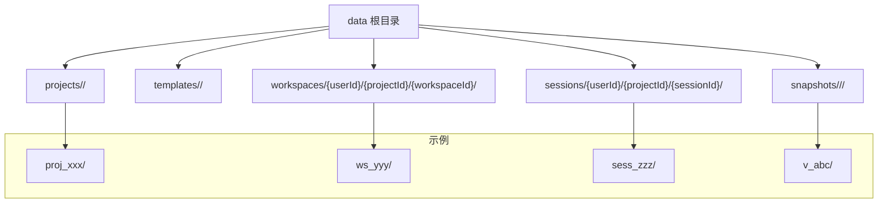
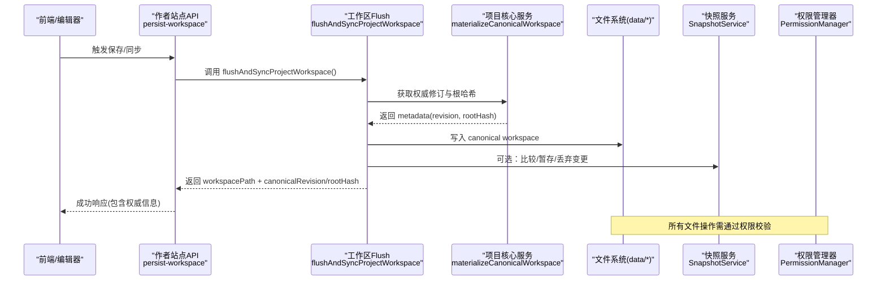
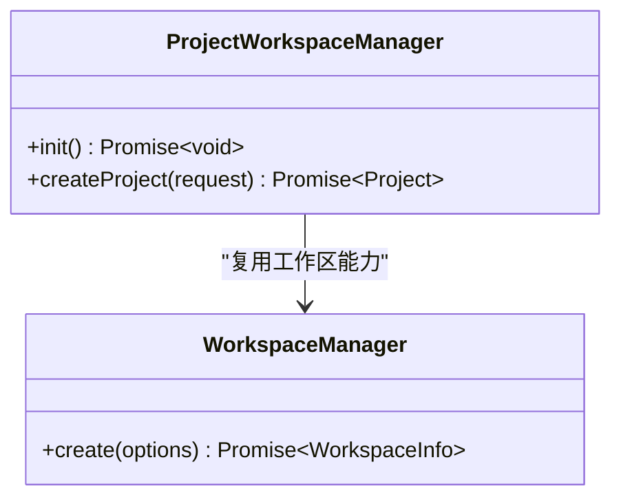
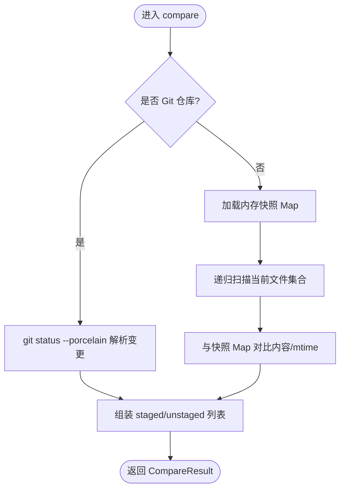
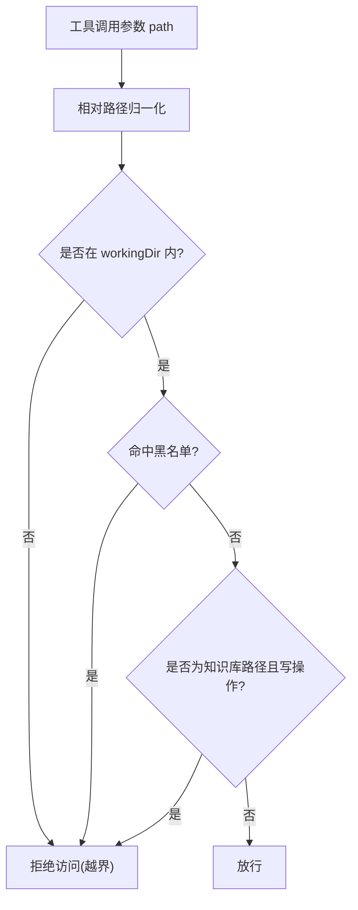
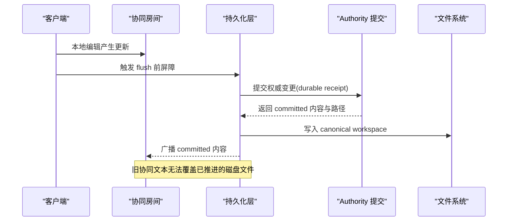
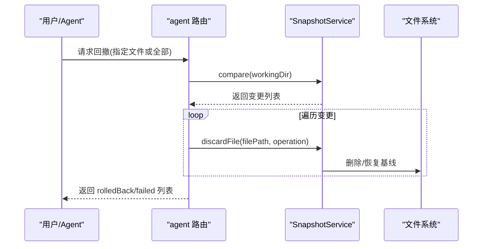
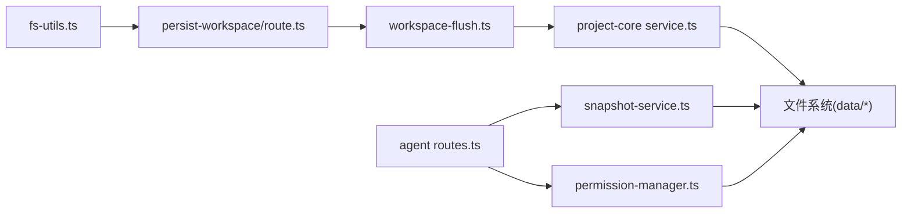

# 文件系统存储

<cite>
**本文引用的文件列表**
- [packages/author-site/src/lib/fs-utils.ts](file://packages/author-site/src/lib/fs-utils.ts)
- [packages/agent-service/src/session/snapshot-service.ts](file://packages/agent-service/src/session/snapshot-service.ts)
- [packages/agent-service/src/backends/managers/permission-manager.ts](file://packages/agent-service/src/backends/managers/permission-manager.ts)
- [packages/agent-service/tests/unit/permissions.test.ts](file://packages/agent-service/tests/unit/permissions.test.ts)
- [packages/agent-service/tests/unit/session-guard.test.ts](file://packages/agent-service/tests/unit/session-guard.test.ts)
- [packages/agent-service/src/workspace/project-workspace-manager.ts](file://packages/agent-service/src/workspace/project-workspace-manager.ts)
- [packages/agent-service/src/workspace/workspace-manager.ts](file://packages/agent-service/src/workspace/workspace-manager.ts)
- [packages/agent-service/src/routes/agent.ts](file://packages/agent-service/src/routes/agent.ts)
- [packages/author-site/src/app/api/sessions/[sessionId]/persist-workspace/route.ts](file://packages/author-site/src/app/api/sessions/[sessionId]/persist-workspace/route.ts)
- [packages/author-site/src/lib/workspace-flush.ts](file://packages/author-site/src/lib/workspace-flush.ts)
- [packages/project-core/src/service.ts](file://packages/project-core/src/service.ts)
- [packages/screenshot-service/src/utils/compile-cache.ts](file://packages/screenshot-service/src/utils/compile-cache.ts)
- [docs/项目文档/创作端/03-项目管理/技术/11_实时保存与协同编辑.md](file://docs/项目文档/创作端/03-项目管理/技术/11_实时保存与协同编辑.md)
</cite>

## 目录
1. [简介](#简介)
2. [项目结构](#项目结构)
3. [核心组件](#核心组件)
4. [架构总览](#架构总览)
5. [详细组件分析](#详细组件分析)
6. [依赖关系分析](#依赖关系分析)
7. [性能考虑](#性能考虑)
8. [故障排查指南](#故障排查指南)
9. [结论](#结论)
10. [附录](#附录)

## 简介
本文件面向 Workbench 平台的“基于文件系统的存储”子系统，系统性阐述以下方面：
- 项目目录结构与工作区组织方式
- 资源文件管理策略、命名规范与路径解析机制（含唯一性与冲突处理）
- 快照系统设计（增量快照、差异计算与回滚）
- 文件访问控制（权限验证、路径遍历防护与安全策略）
- 文件同步机制（实时同步、冲突解决与一致性保证）
- 存储优化策略（压缩、缓存与垃圾回收）
- 最佳实践与性能优化建议

## 项目结构
Workbench 将持久化数据统一存放在 data 目录下，并通过环境变量或默认路径进行配置。顶层目录包括 projects、templates、sessions、workspaces、snapshots 等，分别承载项目元数据、模板、会话、工作区与版本快照。

图表来源
- [packages/author-site/src/lib/fs-utils.ts:44-113](file://packages/author-site/src/lib/fs-utils.ts#L44-L113)

章节来源
- [packages/author-site/src/lib/fs-utils.ts:44-113](file://packages/author-site/src/lib/fs-utils.ts#L44-L113)

## 核心组件
- 文件系统工具与目录常量：定义 data 根目录与各子目录路径、目录初始化、项目/模板/会话/工作区/快照路径解析等。
- 快照服务：提供 Git 仓库模式与非 Git 目录模式的差异对比、暂存、丢弃与基线恢复能力。
- 权限管理器：对工具调用的路径进行白名单/黑名单校验，阻止越界访问与知识库写保护。
- 工作区管理器：负责临时/用户自定义工作区的创建、规范化与生命周期管理。
- 协同与持久化：工作区 flush、权威修订号与根哈希校验、冲突检测与拒绝旧覆盖。
- 项目核心服务：内容对象垃圾回收、版本压缩清理等。

章节来源
- [packages/author-site/src/lib/fs-utils.ts:44-113](file://packages/author-site/src/lib/fs-utils.ts#L44-L113)
- [packages/agent-service/src/session/snapshot-service.ts:1-342](file://packages/agent-service/src/session/snapshot-service.ts#L1-L342)
- [packages/agent-service/src/backends/managers/permission-manager.ts:1-200](file://packages/agent-service/src/backends/managers/permission-manager.ts#L1-L200)
- [packages/agent-service/src/workspace/workspace-manager.ts:1-52](file://packages/agent-service/src/workspace/workspace-manager.ts#L1-L52)
- [packages/author-site/src/lib/workspace-flush.ts:229-287](file://packages/author-site/src/lib/workspace-flush.ts#L229-L287)
- [packages/project-core/src/service.ts:2185-2230](file://packages/project-core/src/service.ts#L2185-L2230)

## 架构总览
下图展示了从前端保存到后端落盘、再到协同与版本化的整体流程，以及快照与权限控制的参与点。

图表来源
- [packages/author-site/src/app/api/sessions/[sessionId]/persist-workspace/route.ts:49-79](file://packages/author-site/src/app/api/sessions/[sessionId]/persist-workspace/route.ts#L49-L79)
- [packages/author-site/src/lib/workspace-flush.ts:229-287](file://packages/author-site/src/lib/workspace-flush.ts#L229-L287)
- [packages/agent-service/src/session/snapshot-service.ts:108-162](file://packages/agent-service/src/session/snapshot-service.ts#L108-L162)
- [packages/agent-service/src/backends/managers/permission-manager.ts:54-78](file://packages/agent-service/src/backends/managers/permission-manager.ts#L54-L78)

## 详细组件分析

### 目录结构与路径解析
- 根目录与子目录
  - data 根目录由环境变量 DATA_DIR 决定，默认位于仓库 data 目录。
  - 子目录：projects、templates、sessions、workspaces、snapshots。
- 路径解析
  - getProjectPath、getTemplatePath、getSessionPath、getSnapshotPath、getWorkspaceDir 等函数提供稳定路径构造。
  - findSessionPath 支持新旧两种 sessions 目录结构兼容查找。
  - ensureDirsExist 在启动时确保必要目录存在。
- 命名规范
  - 项目 ID：以时间戳前缀为主，如 proj_<timestamp>[_suffix]。
  - 模板 ID：tmpl_<timestamp>_<随机>。
  - 页面 ID：slug + 四位随机后缀，如 product-detail_a3f2。
  - 路由键：ASCII 字母数字与连字符，自动去重并截断。
- 唯一性与冲突处理
  - 页面 slug 生成后通过 makeUniqueRouteKey 保证不重复；若冲突则追加序号。
  - 页面 ID 使用随机后缀避免碰撞。
  - 模板 ID 使用时间戳+随机串降低冲突概率。

章节来源
- [packages/author-site/src/lib/fs-utils.ts:44-113](file://packages/author-site/src/lib/fs-utils.ts#L44-L113)
- [packages/author-site/src/lib/fs-utils.ts:132-204](file://packages/author-site/src/lib/fs-utils.ts#L132-L204)
- [packages/author-site/src/lib/fs-utils.ts:247-249](file://packages/author-site/src/lib/fs-utils.ts#L247-L249)
- [packages/author-site/src/lib/fs-utils.ts:473-513](file://packages/author-site/src/lib/fs-utils.ts#L473-L513)
- [packages/author-site/src/lib/fs-utils.ts:541-545](file://packages/author-site/src/lib/fs-utils.ts#L541-L545)

### 工作区组织方式
- 工作区按用户与项目维度隔离：workspaces/{userId}/{projectId}/{workspaceId}/。
- 项目工作空间管理器在项目下维护 workspace 目录，支持从外部路径复制初始工作区。
- 临时工作区用于预览/沙箱场景，由 WorkspaceManager 统一管理。

图表来源
- [packages/agent-service/src/workspace/project-workspace-manager.ts:159-200](file://packages/agent-service/src/workspace/project-workspace-manager.ts#L159-L200)
- [packages/agent-service/src/workspace/workspace-manager.ts:1-52](file://packages/agent-service/src/workspace/workspace-manager.ts#L1-L52)

章节来源
- [packages/agent-service/src/workspace/project-workspace-manager.ts:159-200](file://packages/agent-service/src/workspace/project-workspace-manager.ts#L159-L200)
- [packages/agent-service/src/workspace/workspace-manager.ts:1-52](file://packages/agent-service/src/workspace/workspace-manager.ts#L1-L52)

### 快照系统设计与实现
- 模式选择
  - 若工作区为 Git 仓库，采用 git status 进行差异计算；否则构建内存快照 Map 进行比对。
- 差异计算
  - compare 返回 staged/unstaged 变更列表，包含路径与操作类型(create/modify/delete)。
- 暂存与丢弃
  - stageAll/stageFile/unstageFile 针对 Git 仓库执行暂存/反暂存。
  - discardFile/resetFile 根据操作类型删除文件或恢复到基线内容。
- 基线恢复
  - getBaselineContent 从 Git HEAD 或内存快照中读取基线内容。

图表来源
- [packages/agent-service/src/session/snapshot-service.ts:108-162](file://packages/agent-service/src/session/snapshot-service.ts#L108-L162)
- [packages/agent-service/src/session/snapshot-service.ts:176-229](file://packages/agent-service/src/session/snapshot-service.ts#L176-L229)

章节来源
- [packages/agent-service/src/session/snapshot-service.ts:1-342](file://packages/agent-service/src/session/snapshot-service.ts#L1-L342)

### 文件访问控制与安全策略
- 路径权限校验
  - 对 readFile/readFileWithLines/writeFile/editFile/listFiles 等工具调用进行路径白名单/黑名单校验。
  - 禁止越界访问（..）、绝对路径逃逸、敏感目录（node_modules、packages 等）。
- 知识库写保护
  - knowledge 目录仅允许读取，禁止 AI 代理修改。
- 会话级路径守卫
  - validatePath/validatePaths/safeResolvePath 在工作区内校验路径合法性，防止路径遍历攻击。

图表来源
- [packages/agent-service/src/backends/managers/permission-manager.ts:54-78](file://packages/agent-service/src/backends/managers/permission-manager.ts#L54-L78)
- [packages/agent-service/tests/unit/permissions.test.ts:34-92](file://packages/agent-service/tests/unit/permissions.test.ts#L34-L92)
- [packages/agent-service/tests/unit/session-guard.test.ts:21-39](file://packages/agent-service/tests/unit/session-guard.test.ts#L21-L39)

章节来源
- [packages/agent-service/src/backends/managers/permission-manager.ts:1-200](file://packages/agent-service/src/backends/managers/permission-manager.ts#L1-L200)
- [packages/agent-service/tests/unit/permissions.test.ts:34-92](file://packages/agent-service/tests/unit/permissions.test.ts#L34-L92)
- [packages/agent-service/tests/unit/session-guard.test.ts:21-39](file://packages/agent-service/tests/unit/session-guard.test.ts#L21-L39)

### 文件同步机制与一致性保证
- 工作区 Flush 流程
  - flushAndSyncProjectWorkspace 先刷新当前工作区，再确保权威修订号与根哈希一致，最后物化 canonical workspace。
  - 若检测到 stale，尝试推进 base 后再重试；失败则抛出明确错误码（如 WORKSPACE_STALE）。
- 协同与持久化边界
  - 在 AI mutation 前会先 flush 目标资源的协同草稿，避免旧 hash 覆盖未落盘内容。
  - 提交后以 durable receipt 中的确切资源路径作为唯一写入事实，并广播 committed 内容给协同房间。
  - 即使外部写入通知缺失，flush 前也会拒绝旧协同文本覆盖新文件；冲突发生时保持 dirty，要求用户合并或刷新。

图表来源
- [packages/author-site/src/lib/workspace-flush.ts:229-287](file://packages/author-site/src/lib/workspace-flush.ts#L229-L287)
- [docs/项目文档/创作端/03-项目管理/技术/11_实时保存与协同编辑.md:159-161](file://docs/项目文档/创作端/03-项目管理/技术/11_实时保存与协同编辑.md#L159-L161)

章节来源
- [packages/author-site/src/lib/workspace-flush.ts:229-287](file://packages/author-site/src/lib/workspace-flush.ts#L229-L287)
- [packages/author-site/src/app/api/sessions/[sessionId]/persist-workspace/route.ts:49-79](file://packages/author-site/src/app/api/sessions/[sessionId]/persist-workspace/route.ts#L49-L79)
- [docs/项目文档/创作端/03-项目管理/技术/11_实时保存与协同编辑.md:159-161](file://docs/项目文档/创作端/03-项目管理/技术/11_实时保存与协同编辑.md#L159-L161)

### 回滚机制
- 单文件回滚
  - 通过 snapshotService.compare 获取变更，再调用 discardFile/resetFile 按操作类型恢复或删除。
- 全量回滚
  - 对全部 unstaged/staged 变更逐一执行 discard，返回成功与失败清单。

图表来源
- [packages/agent-service/src/routes/agent.ts:396-430](file://packages/agent-service/src/routes/agent.ts#L396-L430)
- [packages/agent-service/src/session/snapshot-service.ts:298-333](file://packages/agent-service/src/session/snapshot-service.ts#L298-L333)

章节来源
- [packages/agent-service/src/routes/agent.ts:396-430](file://packages/agent-service/src/routes/agent.ts#L396-L430)
- [packages/agent-service/src/session/snapshot-service.ts:298-333](file://packages/agent-service/src/session/snapshot-service.ts#L298-L333)

### 资源文件管理策略
- 工作区清单
  - 使用 workspace-tree.json 统一描述文件夹与页面元数据，替代旧的 .folders.json + .demo.json。
  - 自动迁移旧格式到新格式，并在读取时规范化 routeKey 保证唯一性。
- 页面发现与有效性
  - listDemoPages 基于文件系统 demos 目录与 workspace-tree.json 共同判定有效页面。
- 模板导出
  - saveProjectAsTemplate 将项目工作区快照复制到 templates 目录，并生成 template.json 与索引。

章节来源
- [packages/author-site/src/lib/fs-utils.ts:558-697](file://packages/author-site/src/lib/fs-utils.ts#L558-L697)
- [packages/author-site/src/lib/fs-utils.ts:763-800](file://packages/author-site/src/lib/fs-utils.ts#L763-L800)
- [packages/author-site/src/lib/fs-utils.ts:352-412](file://packages/author-site/src/lib/fs-utils.ts#L352-L412)

## 依赖关系分析
- 模块耦合
  - author-site 的 fs-utils 提供基础路径与目录管理，被多个上层功能引用。
  - agent-service 的 snapshot-service 与 permission-manager 独立于 UI，但被路由与工具链调用。
  - project-core 提供内容对象级别的垃圾回收与版本压缩，与 snapshots 目录协作。
- 外部依赖
  - Git 命令用于仓库模式下的差异与恢复。
  - 文件系统 API 用于读写与扫描。

图表来源
- [packages/author-site/src/lib/fs-utils.ts:44-113](file://packages/author-site/src/lib/fs-utils.ts#L44-L113)
- [packages/author-site/src/app/api/sessions/[sessionId]/persist-workspace/route.ts:49-79](file://packages/author-site/src/app/api/sessions/[sessionId]/persist-workspace/route.ts#L49-L79)
- [packages/author-site/src/lib/workspace-flush.ts:229-287](file://packages/author-site/src/lib/workspace-flush.ts#L229-L287)
- [packages/project-core/src/service.ts:2185-2230](file://packages/project-core/src/service.ts#L2185-L2230)
- [packages/agent-service/src/routes/agent.ts:396-430](file://packages/agent-service/src/routes/agent.ts#L396-L430)
- [packages/agent-service/src/session/snapshot-service.ts:108-162](file://packages/agent-service/src/session/snapshot-service.ts#L108-L162)
- [packages/agent-service/src/backends/managers/permission-manager.ts:54-78](file://packages/agent-service/src/backends/managers/permission-manager.ts#L54-L78)

章节来源
- [packages/author-site/src/lib/fs-utils.ts:44-113](file://packages/author-site/src/lib/fs-utils.ts#L44-L113)
- [packages/author-site/src/app/api/sessions/[sessionId]/persist-workspace/route.ts:49-79](file://packages/author-site/src/app/api/sessions/[sessionId]/persist-workspace/route.ts#L49-L79)
- [packages/author-site/src/lib/workspace-flush.ts:229-287](file://packages/author-site/src/lib/workspace-flush.ts#L229-L287)
- [packages/project-core/src/service.ts:2185-2230](file://packages/project-core/src/service.ts#L2185-L2230)
- [packages/agent-service/src/routes/agent.ts:396-430](file://packages/agent-service/src/routes/agent.ts#L396-L430)
- [packages/agent-service/src/session/snapshot-service.ts:108-162](file://packages/agent-service/src/session/snapshot-service.ts#L108-L162)
- [packages/agent-service/src/backends/managers/permission-manager.ts:54-78](file://packages/agent-service/src/backends/managers/permission-manager.ts#L54-L78)

## 性能考虑
- 快照差异计算
  - Git 模式直接调用 git status，避免全量扫描；非 Git 模式采用内存快照 Map 减少 I/O。
  - 扫描时跳过 node_modules、隐藏目录与工作区配置文件，降低开销。
- 编译缓存
  - 截图服务使用 LRU 内存缓存编译结果，按代码哈希与作用域区分，提升重复编译性能。
- 版本压缩与垃圾回收
  - 项目核心服务定期压缩版本列表，移除过期自动检查点，删除对应快照目录。
  - 内容对象垃圾回收扫描 blobs 目录，依据资源版本引用集剔除不可达 blob。

章节来源
- [packages/agent-service/src/session/snapshot-service.ts:61-106](file://packages/agent-service/src/session/snapshot-service.ts#L61-L106)
- [packages/screenshot-service/src/utils/compile-cache.ts:1-69](file://packages/screenshot-service/src/utils/compile-cache.ts#L1-L69)
- [packages/project-core/src/service.ts:2185-2230](file://packages/project-core/src/service.ts#L2185-L2230)
- [packages/project-core/src/service.ts:5714-5732](file://packages/project-core/src/service.ts#L5714-L5732)

## 故障排查指南
- 常见问题定位
  - 路径越界访问：检查 isPathAllowed 与 session guard 的校验逻辑，确认 workingDir 与目标路径。
  - 知识库写保护：确认 writeFile/editFile 的目标路径不在 knowledge 目录。
  - 同步冲突：关注 WORKSPACE_STALE 错误码，检查权威修订号与根哈希是否变化。
  - 快照丢失：手动删除 snapshots 目录会导致版本不可恢复，需在恢复前校验完整性。
- 日志与诊断
  - 快照服务与权限管理器均输出调试与错误日志，便于定位问题。
  - 会话持久化接口返回明确的错误码与状态码，辅助前端提示与重试。

章节来源
- [packages/agent-service/tests/unit/permissions.test.ts:34-92](file://packages/agent-service/tests/unit/permissions.test.ts#L34-L92)
- [packages/agent-service/tests/unit/session-guard.test.ts:21-39](file://packages/agent-service/tests/unit/session-guard.test.ts#L21-L39)
- [packages/author-site/src/app/api/sessions/[sessionId]/persist-workspace/route.ts:49-79](file://packages/author-site/src/app/api/sessions/[sessionId]/persist-workspace/route.ts#L49-L79)
- [docs/项目文档/创作端/03-项目管理/技术/11_实时保存与协同编辑.md:159-161](file://docs/项目文档/创作端/03-项目管理/技术/11_实时保存与协同编辑.md#L159-L161)

## 结论
Workbench 的文件系统存储方案以清晰的目录分层、严格的权限控制、健壮的快照与回滚机制、以及强一致性的工作区同步为核心，兼顾了可维护性与扩展性。配合编译缓存与垃圾回收，系统在大规模项目与高并发场景下仍能提供良好性能与稳定性。

## 附录
- 最佳实践
  - 使用 generatePageSlug/generateRouteKey 生成安全且唯一的页面标识，避免冲突。
  - 在 AI 工具调用前后利用权限管理器与快照服务进行安全与可回滚保障。
  - 定期运行垃圾回收与版本压缩，控制磁盘占用。
  - 遇到同步冲突时，优先查看权威修订号与根哈希，必要时让用户合并或刷新。

[本节为通用指导，无需具体文件来源]