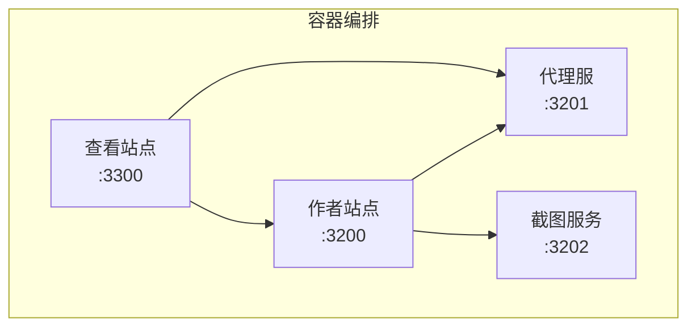
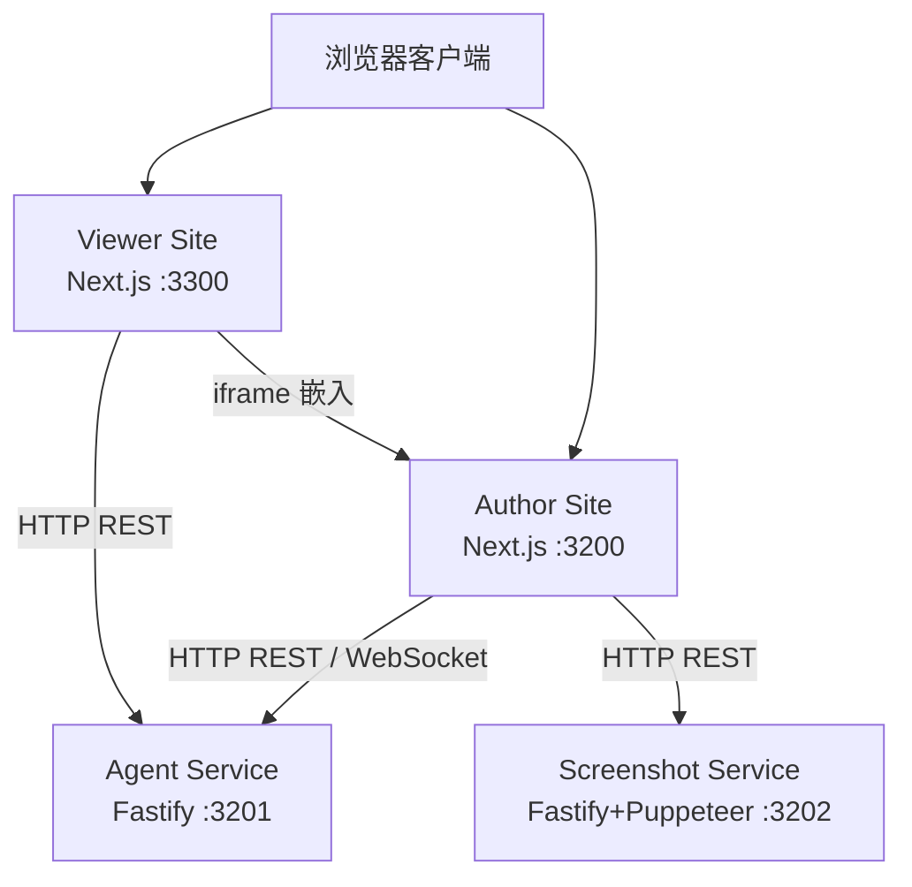
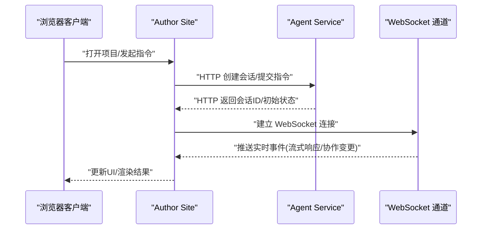
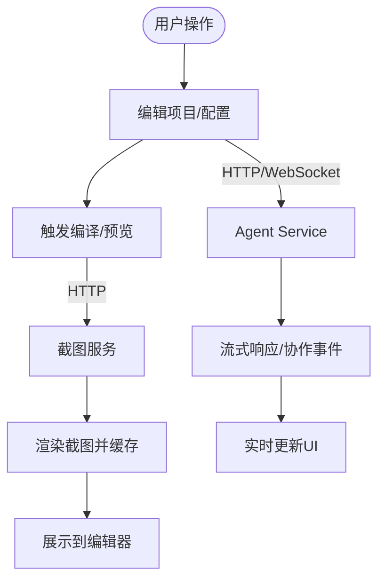
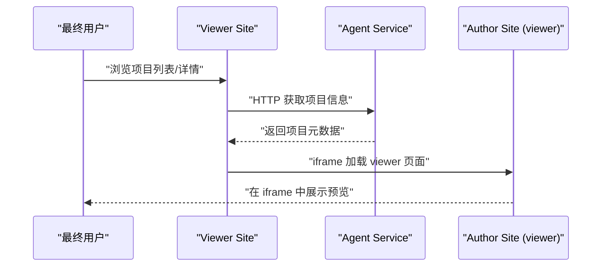
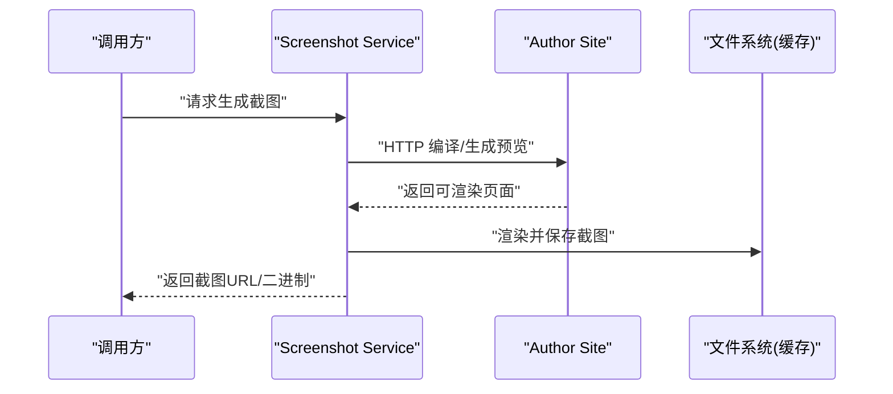
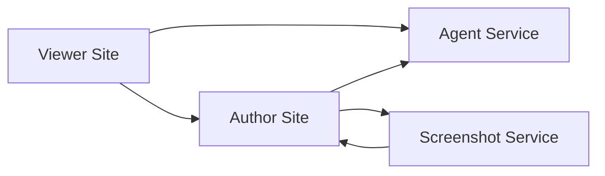

# 整体架构

<cite>
**本文引用的文件**   
- [docker-compose.yml](file://docker-compose.yml)
- [package.json](file://package.json)
- [packages/agent-service/package.json](file://packages/agent-service/package.json)
- [packages/author-site/package.json](file://packages/author-site/package.json)
- [packages/viewer-site/package.json](file://packages/viewer-site/package.json)
- [packages/screenshot-service/package.json](file://packages/screenshot-service/package.json)
- [docs/项目文档/独立Agent服务层/03-核心模块设计.md](file://docs/项目文档/独立Agent服务层/03-核心模块设计.md)
- [docs/项目文档/创作端/README.md](file://docs/项目文档/创作端/README.md)
- [docs/项目文档/创作端/07-嵌入API/INDEX.md](file://docs/项目文档/创作端/07-嵌入API/INDEX.md)
- [docs/项目文档/创作端/07-嵌入API/嵌入API_需求文档.md](file://docs/项目文档/创作端/07-嵌入API/嵌入API_需求文档.md)
- [docs/项目文档/使用端/03-部署与嵌入/技术/01_部署与CORS配置.md](file://docs/项目文档/使用端/03-部署与嵌入/技术/01_部署与CORS配置.md)
- [scripts/docker-orbstack-verify.sh](file://scripts/docker-orbstack-verify.sh)
</cite>

## 目录
1. [简介](#简介)
2. [项目结构](#项目结构)
3. [核心组件](#核心组件)
4. [架构总览](#架构总览)
5. [详细组件分析](#详细组件分析)
6. [依赖关系分析](#依赖关系分析)
7. [性能考量](#性能考量)
8. [故障排查指南](#故障排查指南)
9. [结论](#结论)
10. [附录](#附录)

## 简介
本文件为 Workbench 平台的整体架构文档，聚焦于微服务架构的整体设计与四个核心服务的职责划分：Agent Service（AI代理与项目管理）、Author Site（创作端应用）、Viewer Site（使用端展示）与 Screenshot Service（截图生成）。文档涵盖服务间通信协议（HTTP REST API、WebSocket 实时通信与 iframe 嵌入协议）、数据流向图、技术栈选型理由、系统上下文图与组件交互图、部署拓扑、网络配置与服务发现机制等。

## 项目结构
Workbench 采用 monorepo 组织方式，通过 pnpm workspace 管理多包。根脚本提供统一开发、构建与测试入口；Docker Compose 编排四个核心服务，并定义端口映射、环境变量、卷挂载与健康检查。

图表来源
- [docker-compose.yml:1-140](file://docker-compose.yml#L1-L140)

章节来源
- [package.json:1-101](file://package.json#L1-L101)
- [docker-compose.yml:1-140](file://docker-compose.yml#L1-L140)

## 核心组件
- Agent Service（代理服务）
  - 职责：提供 AI 代理能力、项目管理、会话与协作、WebSocket 事件路由、对外 HTTP/WebSocket 接口。
  - 关键特性：Fastify + CORS + Rate Limit + WebSocket；支持后端 Provider 管理、子代理、Web 读取/搜索、内部 Token 鉴权。
- Author Site（创作端）
  - 职责：项目编辑、预览、知识库、嵌入 API、管理后台、SQLite 持久化、JWT 鉴权。
  - 关键特性：Next.js 应用；与 Agent Service 通过 HTTP/WebSocket 交互；向截图服务暴露编译接口。
- Viewer Site（使用端）
  - 职责：项目列表与详情展示、以 iframe 嵌入 Author Site 的 viewer 页面进行预览。
  - 关键特性：Next.js 静态/服务端渲染；只读访问，调用 Agent Service 获取元数据。
- Screenshot Service（截图服务）
  - 职责：接收截图请求，调用 Author Site 编译，使用 Puppeteer 渲染并缓存截图。
  - 关键特性：Fastify + Puppeteer Core；可选 profile 启动；健康检查。

章节来源
- [docs/项目文档/独立Agent服务层/03-核心模块设计.md:266-310](file://docs/项目文档/独立Agent服务层/03-核心模块设计.md#L266-L310)
- [docs/项目文档/创作端/README.md:211-262](file://docs/项目文档/创作端/README.md#L211-L262)
- [packages/agent-service/package.json:1-53](file://packages/agent-service/package.json#L1-L53)
- [packages/author-site/package.json:1-127](file://packages/author-site/package.json#L1-L127)
- [packages/viewer-site/package.json:1-62](file://packages/viewer-site/package.json#L1-L62)
- [packages/screenshot-service/package.json:1-39](file://packages/screenshot-service/package.json#L1-L39)

## 架构总览
系统由四个服务组成，围绕“用户请求 → AI 处理 → 结果返回”的主流程展开。浏览器客户端通过不同路径进入 Author Site 或 Viewer Site，二者再与 Agent Service 和 Screenshot Service 协同完成工作流。

图表来源
- [docker-compose.yml:1-140](file://docker-compose.yml#L1-L140)
- [docs/项目文档/独立Agent服务层/03-核心模块设计.md:266-310](file://docs/项目文档/独立Agent服务层/03-核心模块设计.md#L266-L310)
- [docs/项目文档/使用端/03-部署与嵌入/技术/01_部署与CORS配置.md:25-45](file://docs/项目文档/使用端/03-部署与嵌入/技术/01_部署与CORS配置.md#L25-L45)

## 详细组件分析

### Agent Service（AI代理与项目管理）
- 职责边界
  - 提供 AI 对话与代码变更能力，管理项目与版本，维护会话状态与协作数据。
  - 暴露 HTTP REST 与 WebSocket 接口，供 Author Site 与 Viewer Site 调用。
- 关键实现要点
  - 服务入口初始化 Fastify，注册 CORS、速率限制、WebSocket 路由，暴露 /health。
  - 错误响应遵循统一结构，便于上层消费。
  - 与 Author Site 协作：推送模型配置、提供编译接口给截图服务。
- 通信协议
  - HTTP REST：项目列表/详情、版本、配置等。
  - WebSocket：实时事件（如会话消息、协作变更）。
- 外部依赖
  - Pi Agent 生态、Yjs 协作协议、日志与限流插件。

图表来源
- [docs/项目文档/独立Agent服务层/03-核心模块设计.md:266-310](file://docs/项目文档/独立Agent服务层/03-核心模块设计.md#L266-L310)
- [packages/agent-service/package.json:1-53](file://packages/agent-service/package.json#L1-L53)

章节来源
- [docs/项目文档/独立Agent服务层/03-核心模块设计.md:266-310](file://docs/项目文档/独立Agent服务层/03-核心模块设计.md#L266-L310)
- [packages/agent-service/package.json:1-53](file://packages/agent-service/package.json#L1-L53)

### Author Site（创作端应用）
- 职责边界
  - 提供项目编辑、预览、知识库、嵌入 API、管理后台等功能。
  - 作为前端主入口，协调与 Agent Service 和 Screenshot Service 的交互。
- 关键实现要点
  - Next.js 应用，内置 SQLite 存储（本地/容器共享卷），JWT 鉴权。
  - 暴露嵌入 API（Demo/项目级），支持 iframe 双向通信（postMessage）。
  - 向截图服务提供编译接口，用于生成预览截图。
- 通信协议
  - HTTP REST：与 Agent Service 的项目/版本/配置接口。
  - WebSocket：与 Agent Service 的实时协作与流式响应。
  - iframe 嵌入：与父页面 postMessage 通信。

图表来源
- [docs/项目文档/创作端/README.md:211-262](file://docs/项目文档/创作端/README.md#L211-L262)
- [docs/项目文档/创作端/07-嵌入API/嵌入API_需求文档.md:1-200](file://docs/项目文档/创作端/07-嵌入API/嵌入API_需求文档.md#L1-L200)
- [docker-compose.yml:1-140](file://docker-compose.yml#L1-L140)

章节来源
- [docs/项目文档/创作端/README.md:211-262](file://docs/项目文档/创作端/README.md#L211-L262)
- [docs/项目文档/创作端/07-嵌入API/INDEX.md:1-60](file://docs/项目文档/创作端/07-嵌入API/INDEX.md#L1-L60)
- [docs/项目文档/创作端/07-嵌入API/嵌入API_需求文档.md:1-200](file://docs/项目文档/创作端/07-嵌入API/嵌入API_需求文档.md#L1-L200)
- [packages/author-site/package.json:1-127](file://packages/author-site/package.json#L1-L127)

### Viewer Site（使用端展示）
- 职责边界
  - 面向最终用户的展示端，提供项目列表与详情，并以 iframe 嵌入 Author Site 的 viewer 页面进行预览。
- 关键实现要点
  - Next.js 应用，只读访问，从 Agent Service 拉取项目元数据。
  - 通过 iframe 直接嵌入 Author Site 的 viewer 端点，避免重复渲染逻辑。
- 通信协议
  - HTTP REST：与 Agent Service 的项目列表/详情接口。
  - iframe 嵌入：与 Author Site 的 viewer 页面进行内容展示。

图表来源
- [docs/项目文档/使用端/03-部署与嵌入/技术/01_部署与CORS配置.md:25-45](file://docs/项目文档/使用端/03-部署与嵌入/技术/01_部署与CORS配置.md#L25-L45)
- [docker-compose.yml:1-140](file://docker-compose.yml#L1-L140)

章节来源
- [docs/项目文档/使用端/03-部署与嵌入/技术/01_部署与CORS配置.md:25-45](file://docs/项目文档/使用端/03-部署与嵌入/技术/01_部署与CORS配置.md#L25-L45)
- [packages/viewer-site/package.json:1-62](file://packages/viewer-site/package.json#L1-L62)

### Screenshot Service（截图生成）
- 职责边界
  - 接收截图请求，调用 Author Site 的编译接口，使用 Puppeteer 渲染页面并缓存截图。
- 关键实现要点
  - Fastify + Puppeteer Core，可选 Docker profile 启动。
  - 健康检查接口，便于编排器探测服务可用性。
- 通信协议
  - HTTP REST：与 Author Site 的编译接口；对外暴露截图生成接口。

图表来源
- [docker-compose.yml:88-121](file://docker-compose.yml#L88-L121)
- [packages/screenshot-service/package.json:1-39](file://packages/screenshot-service/package.json#L1-L39)

章节来源
- [packages/screenshot-service/package.json:1-39](file://packages/screenshot-service/package.json#L1-L39)
- [docker-compose.yml:88-121](file://docker-compose.yml#L88-L121)

## 依赖关系分析
- 服务耦合
  - Author Site 强依赖 Agent Service（HTTP/WebSocket）与 Screenshot Service（HTTP）。
  - Viewer Site 弱依赖 Agent Service（仅元数据）与 Author Site（iframe 嵌入）。
  - Screenshot Service 依赖 Author Site 的编译接口。
- 外部依赖
  - 数据库：Author Site 使用 SQLite（容器卷共享）。
  - 浏览器渲染：Screenshot Service 使用 Puppeteer Core。
  - 运行时：Node.js 20+，Next.js 14，Fastify 4。

图表来源
- [docker-compose.yml:1-140](file://docker-compose.yml#L1-L140)
- [packages/author-site/package.json:1-127](file://packages/author-site/package.json#L1-L127)
- [packages/agent-service/package.json:1-53](file://packages/agent-service/package.json#L1-L53)
- [packages/viewer-site/package.json:1-62](file://packages/viewer-site/package.json#L1-L62)
- [packages/screenshot-service/package.json:1-39](file://packages/screenshot-service/package.json#L1-L39)

章节来源
- [docker-compose.yml:1-140](file://docker-compose.yml#L1-L140)
- [packages/author-site/package.json:1-127](file://packages/author-site/package.json#L1-L127)
- [packages/agent-service/package.json:1-53](file://packages/agent-service/package.json#L1-L53)
- [packages/viewer-site/package.json:1-62](file://packages/viewer-site/package.json#L1-L62)
- [packages/screenshot-service/package.json:1-39](file://packages/screenshot-service/package.json#L1-L39)

## 性能考量
- 并发与资源
  - 各服务在 docker-compose 中设置了 CPU、内存与进程数上限，避免资源争用。
  - Screenshot Service 具备更高的内存与共享内存配置，满足浏览器渲染需求。
- 缓存策略
  - 截图服务对渲染结果进行缓存，减少重复渲染开销。
  - 嵌入 API 的 iframe 内容建议启用浏览器缓存（参考需求文档中的缓存控制头）。
- 超时与限流
  - Agent Service 支持 Web 读取/搜索超时与缓存 TTL，防止外部依赖拖慢整体链路。
  - 速率限制插件保护后端免受突发流量冲击。

[本节为通用指导，不直接分析具体文件]

## 故障排查指南
- 健康检查
  - 使用验证脚本检查各服务健康状态，包括 JSON 状态码与 HTTP 状态码。
- 常见问题定位
  - 若截图服务不可用，确认其 profile 是否启用、Chromium 路径与环境变量是否正确。
  - 若 Author Site 无法连接 Agent Service，检查 CORS 配置与内部 Token。
  - 若 Viewer Site 无法加载 iframe，检查跨域与同源策略。

章节来源
- [scripts/docker-orbstack-verify.sh:62-91](file://scripts/docker-orbstack-verify.sh#L62-L91)
- [docker-compose.yml:1-140](file://docker-compose.yml#L1-L140)

## 结论
Workbench 平台采用清晰的微服务分层与职责划分，结合 Next.js 与 Fastify 的技术栈，实现了高效的创作、预览与截图能力。通过 HTTP REST、WebSocket 与 iframe 嵌入协议的组合，系统在可扩展性与用户体验之间取得良好平衡。合理的资源限制与健康检查机制保障了系统的稳定性与可运维性。

[本节为总结性内容，不直接分析具体文件]

## 附录

### 技术栈选型理由
- Next.js
  - 优势：成熟的 SSR/SSG 能力、丰富的生态、良好的开发体验，适合快速构建 Author/Viewer 站点。
- Fastify
  - 优势：高性能 HTTP 框架，插件生态完善（CORS、Rate Limit、WebSocket），适合 Agent/Screenshot 服务。
- SQLite
  - 优势：轻量、零配置、易于容器化与数据卷共享，适合小型项目与本地开发。
- Puppeteer Core
  - 优势：无头浏览器自动化，适合截图与渲染任务，配合缓存提升性能。

[本节为通用说明，不直接分析具体文件]

### 部署拓扑与网络配置
- 端口映射
  - Author Site: 3200
  - Agent Service: 3201
  - Screenshot Service: 3202
  - Viewer Site: 3300
- 环境变量
  - NEXT_PUBLIC_* 系列用于前端注入的服务地址与模型配置。
  - INTERNAL_API_TOKEN 用于内部服务鉴权。
  - CORS_ORIGINS 控制跨域白名单。
- 服务发现
  - 开发环境通过 Docker Compose 内部 DNS 解析服务名（如 agent-service、screenshot-service）。
  - 生产环境建议使用反向代理或服务网格进行服务发现与负载均衡。

章节来源
- [docker-compose.yml:1-140](file://docker-compose.yml#L1-L140)
- [docs/项目文档/使用端/03-部署与嵌入/技术/01_部署与CORS配置.md:25-45](file://docs/项目文档/使用端/03-部署与嵌入/技术/01_部署与CORS配置.md#L25-L45)