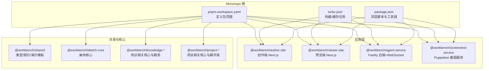
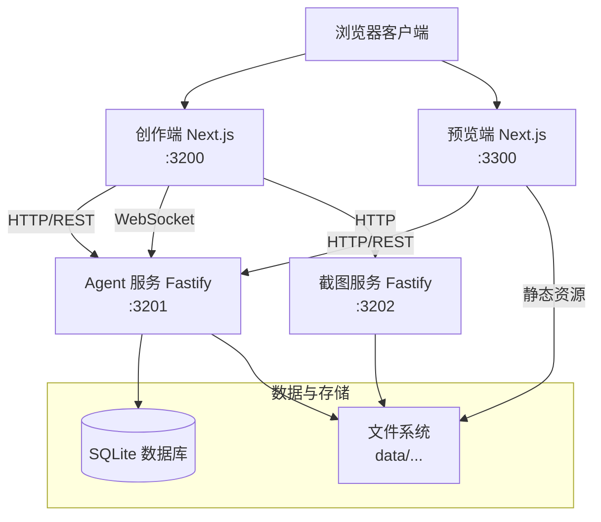
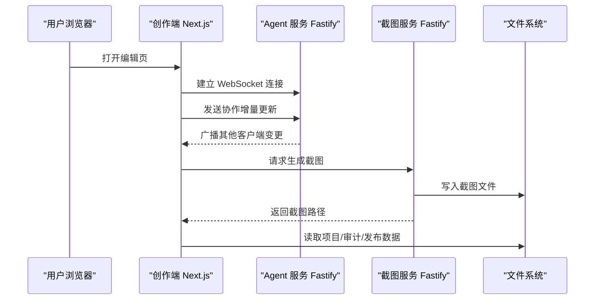
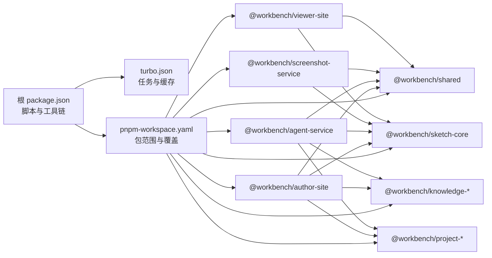
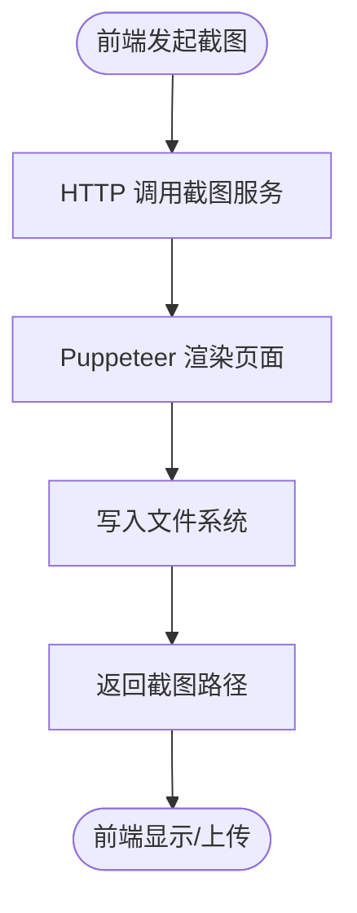
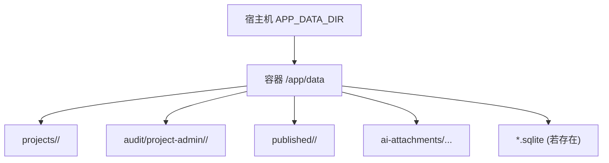
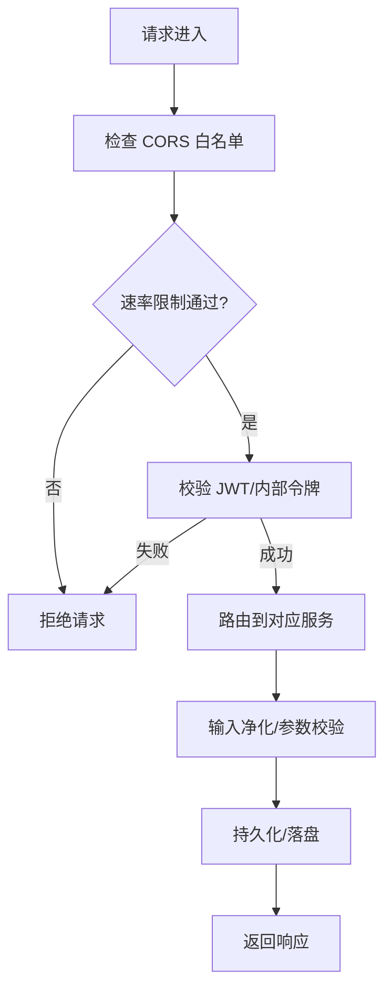
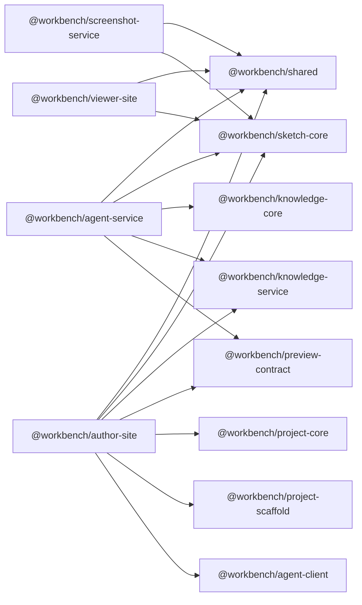

# 架构设计

<cite>
**本文引用的文件**   
- [package.json](file://package.json)
- [pnpm-workspace.yaml](file://pnpm-workspace.yaml)
- [turbo.json](file://turbo.json)
- [docker-compose.yml](file://docker-compose.yml)
- [packages/agent-service/package.json](file://packages/agent-service/package.json)
- [packages/author-site/package.json](file://packages/author-site/package.json)
- [packages/viewer-site/package.json](file://packages/viewer-site/package.json)
- [packages/screenshot-service/package.json](file://packages/screenshot-service/package.json)
- [packages/shared/package.json](file://packages/shared/package.json)
</cite>

## 目录
1. [引言](#引言)
2. [项目结构](#项目结构)
3. [核心组件](#核心组件)
4. [架构总览](#架构总览)
5. [详细组件分析](#详细组件分析)
6. [依赖关系分析](#依赖关系分析)
7. [性能考虑](#性能考虑)
8. [故障排查指南](#故障排查指南)
9. [结论](#结论)
10. [附录](#附录)

## 引言
本架构设计文档面向 Workbench 平台，系统性阐述微服务边界、通信协议与数据流；说明 Monorepo 包组织、共享策略与构建缓存；解释前后端分离（Next.js + Fastify）与 WebSocket 实时协作；描述数据持久化方案（SQLite 与文件系统）；给出安全架构（认证授权、API 访问控制、数据安全）；并提供系统上下文图与组件交互图，帮助读者快速理解整体设计与扩展路径。

## 项目结构
Workbench 采用 pnpm Monorepo 管理多包工程，包含前端站点、后端服务、截图服务以及多个共享核心库。顶层脚本通过 pnpm filter 与 turbo 任务编排开发、构建与测试流程。

图表来源
- [pnpm-workspace.yaml:1-15](file://pnpm-workspace.yaml#L1-L15)
- [turbo.json:1-20](file://turbo.json#L1-L20)
- [package.json:1-101](file://package.json#L1-L101)

章节来源
- [package.json:1-101](file://package.json#L1-L101)
- [pnpm-workspace.yaml:1-15](file://pnpm-workspace.yaml#L1-L15)
- [turbo.json:1-20](file://turbo.json#L1-L20)

## 核心组件
- 创作端 @workbench/author-site：基于 Next.js 的富编辑器与项目管理界面，集成 AI SDK、Yjs 协作、SQLite 本地数据库、JWT 鉴权等能力。
- 后端服务 @workbench/agent-service：基于 Fastify 提供 REST 与 WebSocket 接口，承载 Agent 编排、实时协作状态同步、与知识库/预览契约的集成。
- 截图服务 @workbench/screenshot-service：基于 Puppeteer 的无头浏览器截图服务，供创作端生成项目封面或预览图。
- 预览端 @workbench/viewer-site：只读渲染与展示页面，复用 sketch-core 与 shared 能力。
- 共享与核心：@workbench/shared 暴露类型与契约；@workbench/sketch-core 提供画布核心；knowledge-* 与 project-* 提供领域能力。

章节来源
- [packages/author-site/package.json:1-127](file://packages/author-site/package.json#L1-L127)
- [packages/agent-service/package.json:1-53](file://packages/agent-service/package.json#L1-L53)
- [packages/screenshot-service/package.json:1-39](file://packages/screenshot-service/package.json#L1-L39)
- [packages/viewer-site/package.json:1-62](file://packages/viewer-site/package.json#L1-L62)
- [packages/shared/package.json:1-21](file://packages/shared/package.json#L1-L21)

## 架构总览
Workbench 采用前后端分离的微服务架构：
- 前端：两个 Next.js 站点（创作端与预览端），通过环境变量注入后端地址与公开配置。
- 后端：Fastify 服务提供 HTTP API 与 WebSocket 通道，负责会话、Agent 调用、协作状态同步与外部服务协调。
- 截图服务：独立进程，按需提供截图。
- 数据：SQLite 用于轻量元数据与用户会话；文件系统用于项目资产、审计日志、发布产物等。

图表来源
- [docker-compose.yml:1-140](file://docker-compose.yml#L1-L140)

章节来源
- [docker-compose.yml:1-140](file://docker-compose.yml#L1-L140)

## 详细组件分析

### 微服务边界与职责
- 创作端（author-site）
  - 职责：编辑体验、项目生命周期管理、AI 对话入口、协作状态订阅、截图触发。
  - 技术栈：Next.js、React、Tailwind、Radix UI、CodeMirror/Tiptap、SWR、y-websocket/yjs、better-sqlite3、jose（JWT）。
  - 对外接口：HTTP 到 agent-service；WebSocket 到 agent-service；HTTP 到 screenshot-service。
- 后端服务（agent-service）
  - 职责：Agent 编排、会话管理、权限校验、协作状态广播、与 knowledge-service 和 preview-contract 集成。
  - 技术栈：Fastify、@fastify/websocket、yjs/y-protocols、pino 日志、undici 网络请求。
  - 对外接口：HTTP REST、WebSocket。
- 截图服务（screenshot-service）
  - 职责：接收渲染目标与参数，使用 Puppeteer 生成图片并落盘。
  - 技术栈：Fastify、puppeteer-core。
- 预览端（viewer-site）
  - 职责：只读渲染、展示项目产物。
  - 技术栈：Next.js、sketch-core、shared。

章节来源
- [packages/author-site/package.json:1-127](file://packages/author-site/package.json#L1-L127)
- [packages/agent-service/package.json:1-53](file://packages/agent-service/package.json#L1-L53)
- [packages/screenshot-service/package.json:1-39](file://packages/screenshot-service/package.json#L1-L39)
- [packages/viewer-site/package.json:1-62](file://packages/viewer-site/package.json#L1-L62)

### 通信协议与数据流向
- HTTP/REST：用于常规业务接口（项目、会话、配置、截图等）。
- WebSocket：用于实时协作与事件推送（如 Yjs 同步、操作广播）。
- 文件存储：以 data 目录为统一挂载点，各服务读写各自子目录（项目、审计、发布产物等）。

图表来源
- [docker-compose.yml:1-140](file://docker-compose.yml#L1-L140)
- [packages/agent-service/package.json:1-53](file://packages/agent-service/package.json#L1-L53)
- [packages/screenshot-service/package.json:1-39](file://packages/screenshot-service/package.json#L1-L39)

### Monorepo 结构与共享策略
- 包划分：应用层（author-site、viewer-site）、服务层（agent-service、screenshot-service）、共享与核心（shared、sketch-core、knowledge-*、project-*）。
- 依赖声明：通过 workspace:* 引用内部包，确保版本一致与内聚演进。
- 构建缓存：turbo 对 build/lint/clean 等任务进行缓存与并行执行，提升迭代效率。
- 构建产物：Next.js 输出 .next，TypeScript 输出 dist，避免污染源码。

图表来源
- [pnpm-workspace.yaml:1-15](file://pnpm-workspace.yaml#L1-L15)
- [turbo.json:1-20](file://turbo.json#L1-L20)
- [packages/author-site/package.json:1-127](file://packages/author-site/package.json#L1-L127)
- [packages/agent-service/package.json:1-53](file://packages/agent-service/package.json#L1-L53)
- [packages/screenshot-service/package.json:1-39](file://packages/screenshot-service/package.json#L1-L39)
- [packages/viewer-site/package.json:1-62](file://packages/viewer-site/package.json#L1-L62)
- [packages/shared/package.json:1-21](file://packages/shared/package.json#L1-L21)

章节来源
- [pnpm-workspace.yaml:1-15](file://pnpm-workspace.yaml#L1-L15)
- [turbo.json:1-20](file://turbo.json#L1-L20)
- [packages/author-site/package.json:1-127](file://packages/author-site/package.json#L1-L127)
- [packages/agent-service/package.json:1-53](file://packages/agent-service/package.json#L1-L53)
- [packages/screenshot-service/package.json:1-39](file://packages/screenshot-service/package.json#L1-L39)
- [packages/viewer-site/package.json:1-62](file://packages/viewer-site/package.json#L1-L62)
- [packages/shared/package.json:1-21](file://packages/shared/package.json#L1-L21)

### 前后端分离与实时通信
- 前后端分离：Next.js 站点通过环境变量注入后端地址与公开配置，实现解耦部署。
- 实时通信：WebSocket 用于协作与事件推送；Yjs 协议保障多端一致性。
- 截图链路：前端发起截图请求，截图服务渲染后落盘，返回可访问路径。

图表来源
- [packages/screenshot-service/package.json:1-39](file://packages/screenshot-service/package.json#L1-L39)
- [docker-compose.yml:1-140](file://docker-compose.yml#L1-L140)

章节来源
- [packages/author-site/package.json:1-127](file://packages/author-site/package.json#L1-L127)
- [packages/agent-service/package.json:1-53](file://packages/agent-service/package.json#L1-L53)
- [packages/screenshot-service/package.json:1-39](file://packages/screenshot-service/package.json#L1-L39)

### 数据持久化方案
- SQLite：用于轻量元数据与用户会话（由 author-site 引入 better-sqlite3）。
- 文件系统：统一挂载 data 目录，存放项目、审计日志、发布产物、截图等。
- 卷映射：docker-compose 将宿主 APP_DATA_DIR 映射至容器 /app/data，保证数据持久化。

图表来源
- [docker-compose.yml:1-140](file://docker-compose.yml#L1-L140)

章节来源
- [packages/author-site/package.json:1-127](file://packages/author-site/package.json#L1-L127)
- [docker-compose.yml:1-140](file://docker-compose.yml#L1-L140)

### 安全架构设计
- 认证与授权
  - JWT：author-site 使用 jose 处理令牌签发与校验。
  - Cookie 安全：USE_SECURE_COOKIE 控制是否启用安全 Cookie。
  - 内部令牌：INTERNAL_API_TOKEN 用于服务间可信调用。
- 访问控制
  - CORS：CORS_ORIGINS 限制跨域来源。
  - 速率限制：agent-service 引入 rate-limit 插件防止滥用。
- 数据安全
  - 最小权限：仅必要服务访问 data 目录。
  - 输入净化：前端使用 DOMPurify 等库降低 XSS 风险。
  - 敏感配置：通过环境变量注入，避免硬编码。

图表来源
- [packages/author-site/package.json:1-127](file://packages/author-site/package.json#L1-L127)
- [packages/agent-service/package.json:1-53](file://packages/agent-service/package.json#L1-L53)
- [docker-compose.yml:1-140](file://docker-compose.yml#L1-L140)

章节来源
- [packages/author-site/package.json:1-127](file://packages/author-site/package.json#L1-L127)
- [packages/agent-service/package.json:1-53](file://packages/agent-service/package.json#L1-L53)
- [docker-compose.yml:1-140](file://docker-compose.yml#L1-L140)

## 依赖关系分析
- 包内依赖
  - author-site 依赖 shared、sketch-core、knowledge-service、preview-contract、project-core、project-scaffold、agent-client 等。
  - agent-service 依赖 shared、sketch-core、knowledge-core、knowledge-service、preview-contract。
  - screenshot-service 依赖 shared、sketch-core。
  - viewer-site 依赖 shared、sketch-core。
- 运行时依赖
  - docker-compose 定义了服务端口、环境变量、卷挂载与启动顺序。

图表来源
- [packages/author-site/package.json:1-127](file://packages/author-site/package.json#L1-L127)
- [packages/agent-service/package.json:1-53](file://packages/agent-service/package.json#L1-L53)
- [packages/screenshot-service/package.json:1-39](file://packages/screenshot-service/package.json#L1-L39)
- [packages/viewer-site/package.json:1-62](file://packages/viewer-site/package.json#L1-L62)
- [packages/shared/package.json:1-21](file://packages/shared/package.json#L1-L21)

章节来源
- [packages/author-site/package.json:1-127](file://packages/author-site/package.json#L1-L127)
- [packages/agent-service/package.json:1-53](file://packages/agent-service/package.json#L1-L53)
- [packages/screenshot-service/package.json:1-39](file://packages/screenshot-service/package.json#L1-L39)
- [packages/viewer-site/package.json:1-62](file://packages/viewer-site/package.json#L1-L62)
- [packages/shared/package.json:1-21](file://packages/shared/package.json#L1-L21)

## 性能考虑
- 构建与缓存
  - turbo 对 build/lint 等任务启用缓存与并行执行，减少重复工作。
  - Next.js 输出 .next 目录作为构建产物，便于增量构建与缓存命中。
- 运行时资源
  - 截图服务使用 Puppeteer，需合理分配 CPU/内存与共享内存（shm_size）。
  - 服务资源限制：docker-compose 中设置 cpus/mem_limit/pids_limit，避免资源争用。
- 网络与并发
  - WebSocket 长连接适合高并发协作场景，注意服务端连接数与内存占用。
  - 使用 undici 等现代 HTTP 客户端提升网络吞吐。

章节来源
- [turbo.json:1-20](file://turbo.json#L1-L20)
- [docker-compose.yml:1-140](file://docker-compose.yml#L1-L140)
- [packages/agent-service/package.json:1-53](file://packages/agent-service/package.json#L1-L53)
- [packages/screenshot-service/package.json:1-39](file://packages/screenshot-service/package.json#L1-L39)

## 故障排查指南
- 服务健康检查
  - 截图服务提供 /health 端点，docker-compose 内置健康检查脚本定期探测。
- 常见问题定位
  - 端口冲突：确认 3200/3201/3202/3300 未被占用。
  - 环境变量缺失：检查 NEXT_PUBLIC_*、AGENT_SERVICE_URL、SCREENSHOT_SERVICE_URL、JWT_SECRET、INTERNAL_API_TOKEN 等。
  - 数据卷未挂载：确认 APP_DATA_DIR 指向有效目录且具备读写权限。
  - CORS 错误：核对 CORS_ORIGINS 是否包含前端域名。
  - 速率限制：观察 rate-limit 日志，必要时调整阈值。
- 诊断命令
  - 使用根脚本中的 check:* 系列命令进行类型检查与测试，快速发现回归问题。

章节来源
- [docker-compose.yml:1-140](file://docker-compose.yml#L1-L140)
- [package.json:1-101](file://package.json#L1-L101)

## 结论
Workbench 以 Monorepo 为基础，采用前后端分离与微服务架构，结合 WebSocket 实现实时协作，SQLite 与文件系统满足轻量与灵活的数据持久化需求。通过环境变量与内部令牌实现安全可控的服务间通信，配合 turbo 与 pnpm 的工作区能力，形成高效开发与稳定运行的工程体系。未来可在服务拆分、缓存策略、可观测性与弹性伸缩方面持续优化。

## 附录
- 关键环境变量参考（节选）
  - 通用：PORT、HOST、CORS_ORIGINS、DATA_DIR、INTERNAL_API_TOKEN
  - 创作端：NEXT_PUBLIC_AGENT_SERVICE_URL、NEXT_PUBLIC_SCREENSHOT_SERVICE_URL、JWT_SECRET、USE_SECURE_COOKIE
  - 后端：PI_AGENT_*、SCREENSHOT_SERVICE_URL、WORKSPACE_AUTHORITY_*
  - 截图：AUTHOR_SITE_URL、PUPPETEER_EXECUTABLE_PATH、PUPPETEER_DISABLE_SANDBOX

章节来源
- [docker-compose.yml:1-140](file://docker-compose.yml#L1-L140)