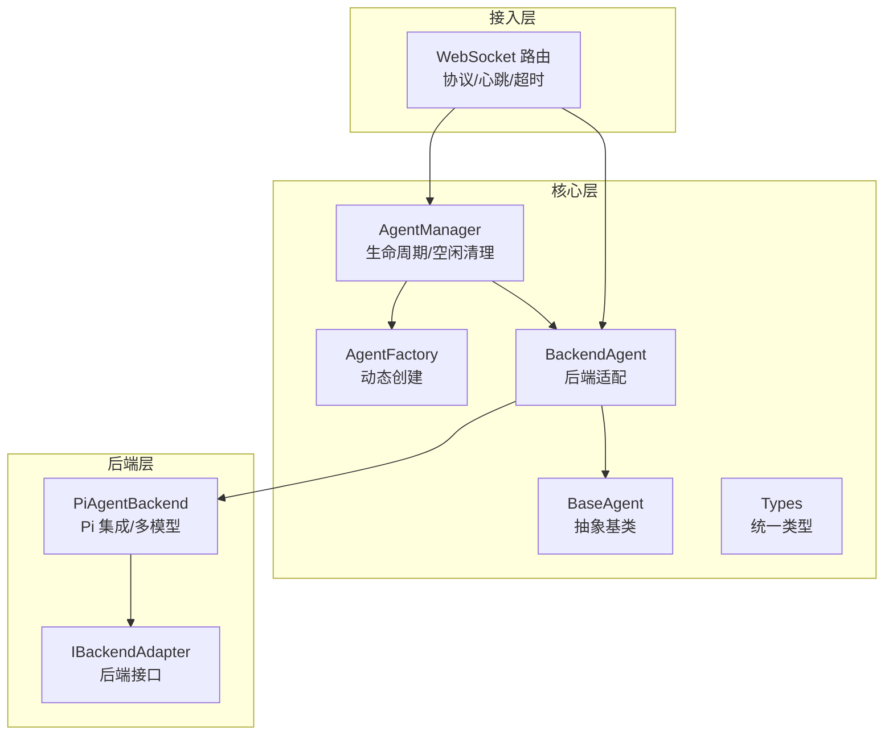
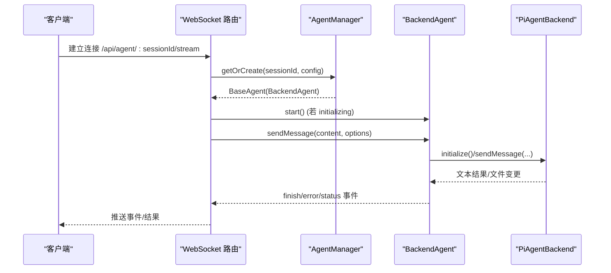
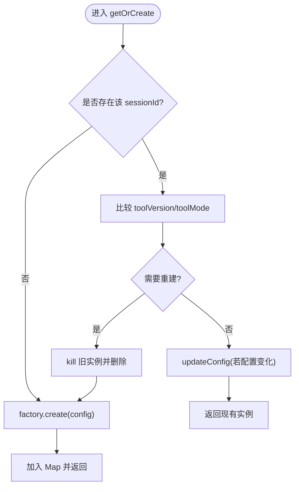
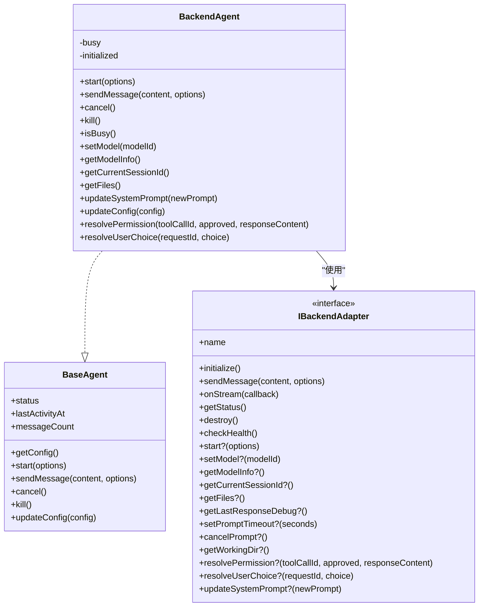
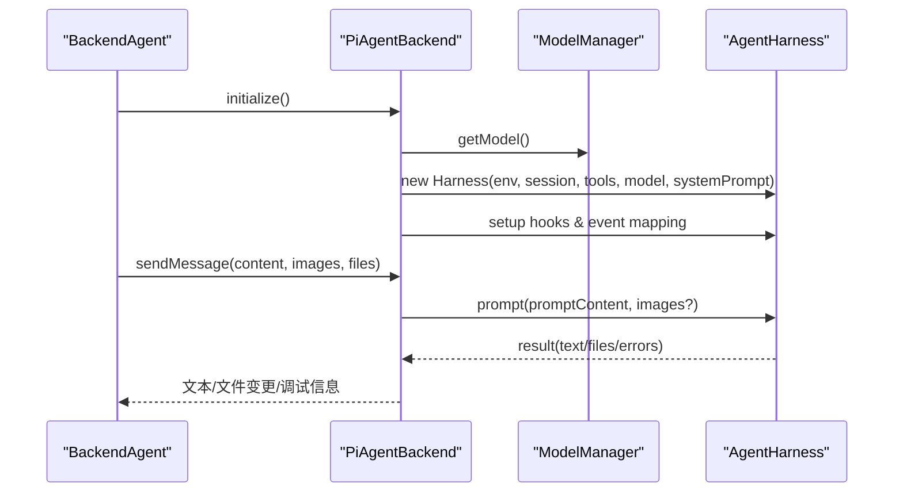
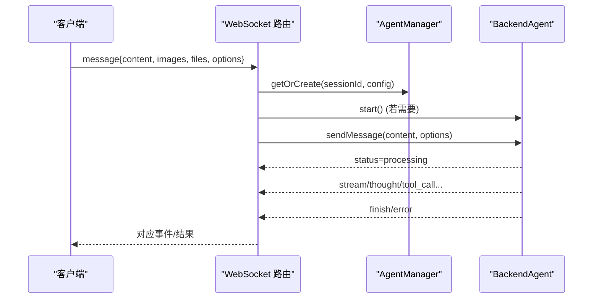
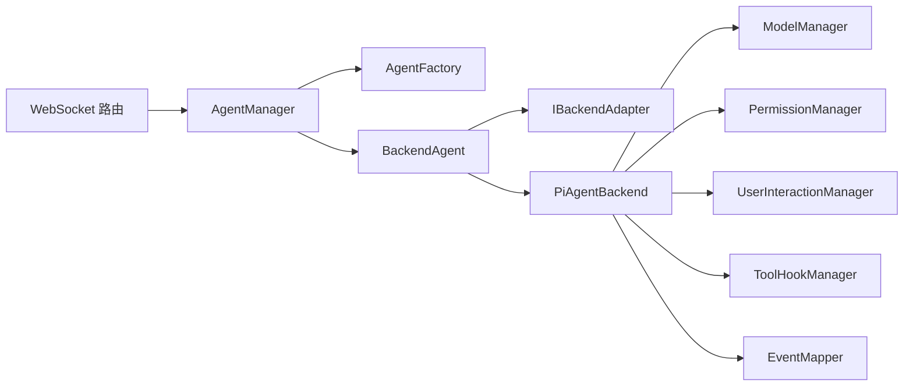

# Agent 服务

<cite>
**本文引用的文件**   
- [agent-manager.ts](file://packages/agent-service/src/core/agent-manager.ts)
- [agent-factory.ts](file://packages/agent-service/src/core/agent-factory.ts)
- [backend-agent.ts](file://packages/agent-service/src/core/backend-agent.ts)
- [agent.ts](file://packages/agent-service/src/core/agent.ts)
- [types.ts](file://packages/agent-service/src/core/types.ts)
- [base.ts](file://packages/agent-service/src/backends/base.ts)
- [pi-agent.ts](file://packages/agent-service/src/backends/pi-agent.ts)
- [websocket.ts](file://packages/agent-service/src/routes/websocket.ts)
</cite>

## 目录
1. [简介](#简介)
2. [项目结构](#项目结构)
3. [核心组件](#核心组件)
4. [架构总览](#架构总览)
5. [详细组件分析](#详细组件分析)
6. [依赖关系分析](#依赖关系分析)
7. [性能与资源管理](#性能与资源管理)
8. [故障排查指南](#故障排查指南)
9. [结论](#结论)
10. [附录：WebSocket 协议规范与扩展示例](#附录websocket-协议规范与扩展示例)

## 简介
本技术文档围绕 Agent 服务展开，系统性阐述 AI 代理管理器、抽象基类与后端代理的实现原理，以及 Pi Agent 后端的集成方式与多模型支持。重点覆盖以下主题：
- 代理生命周期管理与空闲清理机制
- 会话状态跟踪与工具版本控制
- BaseAgent 抽象类与 BackendAgent 后端代理的设计模式
- Pi Agent 后端的多模型支持与运行时配置更新
- 工厂模式与动态代理创建
- 工作目录隔离与权限/用户交互流程
- WebSocket 实时通信协议（消息格式、事件类型、错误处理）
- 自定义代理后端与功能扩展的实践路径

## 项目结构
Agent 服务采用分层与模块化组织：
- core：定义抽象接口、工厂与管理器，承载通用能力
- backends：后端适配器与具体实现（如 Pi Agent）
- routes：HTTP/WebSocket 路由与事件路由
- session/workspace/config：会话、工作区与配置支撑

图示来源
- [agent-manager.ts:1-232](file://packages/agent-service/src/core/agent-manager.ts#L1-L232)
- [agent-factory.ts:1-51](file://packages/agent-service/src/core/agent-factory.ts#L1-L51)
- [backend-agent.ts:1-238](file://packages/agent-service/src/core/backend-agent.ts#L1-L238)
- [agent.ts:1-137](file://packages/agent-service/src/core/agent.ts#L1-L137)
- [types.ts:1-325](file://packages/agent-service/src/core/types.ts#L1-L325)
- [base.ts:1-30](file://packages/agent-service/src/backends/base.ts#L1-L30)
- [pi-agent.ts:1-800](file://packages/agent-service/src/backends/pi-agent.ts#L1-L800)
- [websocket.ts:1-800](file://packages/agent-service/src/routes/websocket.ts#L1-L800)

章节来源
- [agent-manager.ts:1-232](file://packages/agent-service/src/core/agent-manager.ts#L1-L232)
- [agent-factory.ts:1-51](file://packages/agent-service/src/core/agent-factory.ts#L1-L51)
- [backend-agent.ts:1-238](file://packages/agent-service/src/core/backend-agent.ts#L1-L238)
- [agent.ts:1-137](file://packages/agent-service/src/core/agent.ts#L1-L137)
- [types.ts:1-325](file://packages/agent-service/src/core/types.ts#L1-L325)
- [base.ts:1-30](file://packages/agent-service/src/backends/base.ts#L1-L30)
- [pi-agent.ts:1-800](file://packages/agent-service/src/backends/pi-agent.ts#L1-L800)
- [websocket.ts:1-800](file://packages/agent-service/src/routes/websocket.ts#L1-L800)

## 核心组件
- AgentManager：维护会话级 Agent 实例，负责创建/销毁、发送消息、空闲清理、工具版本/模式变更重建策略等。
- AgentFactory：注册并动态创建指定类型的 Agent，当前默认类型为 pi-agent。
- BaseAgent：抽象基类，封装状态机、事件、统计信息与公共行为。
- BackendAgent：基于 IBackendAdapter 的后端适配层，屏蔽不同后端差异，提供 setModel/updateSystemPrompt/resolvePermission/resolveUserChoice 等扩展能力。
- PiAgentBackend：Pi 后端的具体实现，集成 ModelManager、PermissionManager、UserInteractionManager、ToolHookManager、EventMapper 等，支持多模型、图片理解、子 Agent、系统提示词注入等。
- WebSocket 路由：提供实时双向通信，处理消息收发、心跳、超时、取消、模型切换、权限/用户选择回传等。

章节来源
- [agent-manager.ts:1-232](file://packages/agent-service/src/core/agent-manager.ts#L1-L232)
- [agent-factory.ts:1-51](file://packages/agent-service/src/core/agent-factory.ts#L1-L51)
- [backend-agent.ts:1-238](file://packages/agent-service/src/core/backend-agent.ts#L1-L238)
- [agent.ts:1-137](file://packages/agent-service/src/core/agent.ts#L1-L137)
- [pi-agent.ts:1-800](file://packages/agent-service/src/backends/pi-agent.ts#L1-L800)
- [websocket.ts:1-800](file://packages/agent-service/src/routes/websocket.ts#L1-L800)

## 架构总览
整体数据与控制流如下：
- 客户端通过 WebSocket 连接 /api/agent/:sessionId/stream
- 服务端根据 sessionId 获取或创建 Agent，必要时初始化后端
- 将 Agent 事件绑定到 WebSocketEventRouter，向客户端推送 stream/thought/tool_call/finish/status 等事件
- 对长耗时请求提供显式超时与进度心跳；支持 cancel、set_model、get_models、permission_response、user_choice_response 等控制面操作

图示来源
- [websocket.ts:134-486](file://packages/agent-service/src/routes/websocket.ts#L134-L486)
- [agent-manager.ts:61-124](file://packages/agent-service/src/core/agent-manager.ts#L61-L124)
- [backend-agent.ts:49-111](file://packages/agent-service/src/core/backend-agent.ts#L49-L111)
- [pi-agent.ts:173-245](file://packages/agent-service/src/backends/pi-agent.ts#L173-L245)

## 详细组件分析

### AgentManager：生命周期与空闲清理
- 职责
  - 按 sessionId 缓存 BaseAgent 实例
  - 根据 toolVersion/toolMode 变化决定是否重建 Agent
  - 定时任务每分钟扫描空闲 Agent，超过阈值则 kill 并移除
  - 统一发送消息入口，自动处理 initializing 状态启动
- 关键逻辑
  - getOrCreate：比较现有 Agent 的 toolVersion/toolMode，若不一致且不在 processing，则 kill 并重建；否则仅 updateConfig
  - cleanupIdleAgents：遍历 Map，对比 lastActivityAtPub 与 timeoutMs，非 processing 时异步 kill 并删除
  - sendMessage：若为 BackendAgent 且 busy，返回 AGENT_BUSY；否则确保 start 后再调用 agent.sendMessage

图示来源
- [agent-manager.ts:61-124](file://packages/agent-service/src/core/agent-manager.ts#L61-L124)
- [agent-manager.ts:203-221](file://packages/agent-service/src/core/agent-manager.ts#L203-L221)

章节来源
- [agent-manager.ts:1-232](file://packages/agent-service/src/core/agent-manager.ts#L1-L232)

### AgentFactory：动态创建
- 职责
  - 维护 type -> creator 映射
  - create 时根据 type 查找 creator 并构造 BaseAgent
- 现状
  - 默认 type 固定为 pi-agent，未注册时会抛出未知类型错误
  - 提供 register/has/getRegisteredTypes 用于扩展

章节来源
- [agent-factory.ts:1-51](file://packages/agent-service/src/core/agent-factory.ts#L1-L51)

### BaseAgent 与 BackendAgent：抽象与适配
- BaseAgent
  - 暴露 status、lastActivityAt、messageCount、createdAt 等元信息
  - 定义 start/sendMessage/cancel/kill/updateConfig 抽象方法
  - 内置事件发射与 getInfo 序列化
- BackendAgent
  - 包装任意 IBackendAdapter，转发 onStream 事件
  - 管理 busy/initialized 状态，封装 start/initialize 兼容
  - 提供 setModel/getModelInfo/currentSessionId/getFiles/updateSystemPrompt/resolvePermission/resolveUserChoice 等扩展点
  - updateConfig 支持 workingDir/model/demoId/backendProviders/externalAuth 的运行时更新，并触发 config_updated 事件

图示来源
- [agent.ts:22-137](file://packages/agent-service/src/core/agent.ts#L22-L137)
- [backend-agent.ts:35-238](file://packages/agent-service/src/core/backend-agent.ts#L35-L238)
- [base.ts:5-29](file://packages/agent-service/src/backends/base.ts#L5-L29)

章节来源
- [agent.ts:1-137](file://packages/agent-service/src/core/agent.ts#L1-L137)
- [backend-agent.ts:1-238](file://packages/agent-service/src/core/backend-agent.ts#L1-L238)
- [base.ts:1-30](file://packages/agent-service/src/backends/base.ts#L1-L30)

### Pi Agent 后端：多模型支持与运行时能力
- 初始化流程
  - 加载依赖、创建执行环境 env、内存 SessionRepo/Session
  - 创建工作台工具集（含权限确认、计划审批、用户选择、子 Agent runner）
  - 从 ModelManager 获取模型，构建 AgentHarness，注册 Hook 与事件映射
- 多模型支持
  - 通过 ModelManager 获取主模型与视觉模型，支持 OpenAI 兼容 baseUrl 与鉴权头
  - 当模型不支持图像输入时，走 ImageDescriber 进行“先描述再提问”的降级方案
- 子 Agent
  - 可独立创建 Harness 与 Env，受超时控制，捕获文件变更摘要
- 系统提示词注入
  - 支持 v3.2 静态 system prompt 注入（L2+L4），不重建 Agent，保留历史消息
- 运行期配置更新
  - 支持 setModel/updateSystemPrompt/updateConfig 等运行时调整

图示来源
- [pi-agent.ts:173-245](file://packages/agent-service/src/backends/pi-agent.ts#L173-L245)
- [pi-agent.ts:614-758](file://packages/agent-service/src/backends/pi-agent.ts#L614-L758)
- [backend-agent.ts:49-111](file://packages/agent-service/src/core/backend-agent.ts#L49-L111)

章节来源
- [pi-agent.ts:1-800](file://packages/agent-service/src/backends/pi-agent.ts#L1-L800)
- [backend-agent.ts:1-238](file://packages/agent-service/src/core/backend-agent.ts#L1-L238)

### WebSocket 路由：协议与事件
- 连接与会话
  - GET /api/agent/:sessionId/stream
  - 心跳检测与超时关闭
- 客户端消息类型
  - message：发送对话内容，支持 images/files/options.timeout/stream/resumeSessionId/systemPrompt
  - resume：恢复会话，支持 resumeSessionId
  - cancel：取消当前处理
  - set_model/get_models：运行时切换/查询模型
  - ping：心跳
  - permission_response/user_choice_response：权限与用户选择回传
  - console_data：辅助日志通道
- 服务器事件
  - status/finish/error/stream/thought/tool_call/tool_call_update/plan/run_summary/models/pong 等
- 超时与进度
  - 显式超时上限在 MIN/MAX 范围内归一化
  - 每 25s 发送一次 processing 心跳，避免前端长时间无响应

图示来源
- [websocket.ts:134-486](file://packages/agent-service/src/routes/websocket.ts#L134-L486)
- [websocket.ts:489-800](file://packages/agent-service/src/routes/websocket.ts#L489-L800)

章节来源
- [websocket.ts:1-800](file://packages/agent-service/src/routes/websocket.ts#L1-L800)

## 依赖关系分析
- AgentManager 依赖 AgentFactory 与 BaseAgent/BackendAgent
- BackendAgent 依赖 IBackendAdapter 及其可选扩展能力
- PiAgentBackend 依赖 ModelManager、PermissionManager、UserInteractionManager、ToolHookManager、EventMapper 等内部管理器
- WebSocket 路由依赖 AgentManager、BackendAgent、SessionStore、WorkspaceManager、SnapshotService、ConsoleBuffer 等

图示来源
- [agent-manager.ts:1-232](file://packages/agent-service/src/core/agent-manager.ts#L1-L232)
- [agent-factory.ts:1-51](file://packages/agent-service/src/core/agent-factory.ts#L1-L51)
- [backend-agent.ts:1-238](file://packages/agent-service/src/core/backend-agent.ts#L1-L238)
- [pi-agent.ts:1-800](file://packages/agent-service/src/backends/pi-agent.ts#L1-L800)
- [websocket.ts:1-800](file://packages/agent-service/src/routes/websocket.ts#L1-L800)

章节来源
- [agent-manager.ts:1-232](file://packages/agent-service/src/core/agent-manager.ts#L1-L232)
- [agent-factory.ts:1-51](file://packages/agent-service/src/core/agent-factory.ts#L1-L51)
- [backend-agent.ts:1-238](file://packages/agent-service/src/core/backend-agent.ts#L1-L238)
- [pi-agent.ts:1-800](file://packages/agent-service/src/backends/pi-agent.ts#L1-L800)
- [websocket.ts:1-800](file://packages/agent-service/src/routes/websocket.ts#L1-L800)

## 性能与资源管理
- 空闲清理：AgentManager 每分钟扫描，清理超过阈值的空闲 Agent，避免内存泄漏
- 进程/环境回收：PiAgentBackend.destroy 会中止 Harness、清理子 Agent、释放执行环境
- 超时控制：WebSocket 层对消息设置最小/最大显式超时，并在处理期间周期性发送进度心跳
- 并发限制：BackendAgent.isBusy 防止同一会话并行处理，避免资源竞争
- 模型切换：支持运行时 setModel，无需重建 Agent，减少开销

[本节为通用指导，不涉及具体代码片段]

## 故障排查指南
- 常见问题定位
  - 消息为空或参数无效：检查 message.content 是否为空，JSON 是否合法
  - 会话不存在：确认 sessionId 是否正确，或先调用 resume
  - 模型不可用：检查 get_models/set_model 返回值与错误码
  - 权限/用户选择阻塞：确认 permission_response/user_choice_response 已正确回传
  - 超时：关注 MESSAGE_TIMEOUT 错误码与 progress heartbeat
- 日志与调试
  - 利用 getLastResponseDebug 与 runSummary 定位模型返回异常
  - 结合 ConsoleBuffer 查看控制台输出

章节来源
- [websocket.ts:182-206](file://packages/agent-service/src/routes/websocket.ts#L182-L206)
- [websocket.ts:346-468](file://packages/agent-service/src/routes/websocket.ts#L346-L468)
- [backend-agent.ts:97-111](file://packages/agent-service/src/core/backend-agent.ts#L97-L111)
- [pi-agent.ts:765-771](file://packages/agent-service/src/backends/pi-agent.ts#L765-L771)

## 结论
Agent 服务以清晰的抽象与适配层解耦了上层会话管理与底层模型实现，借助工厂模式与运行时配置更新，实现了灵活的多模型支持与可扩展的后端生态。WebSocket 协议提供了完整的实时交互能力，配合空闲清理与超时控制，保障了系统的稳定性与资源利用率。

[本节为总结性内容，不涉及具体代码片段]

## 附录：WebSocket 协议规范与扩展示例

### 协议要点
- 连接
  - GET /api/agent/:sessionId/stream
- 客户端消息（type）
  - message：发送对话内容，支持 images/files/options.timeout/stream/resumeSessionId/systemPrompt
  - resume：恢复会话，需 resumeSessionId
  - cancel：取消当前处理
  - set_model/get_models：运行时切换/查询模型
  - ping：心跳
  - permission_response/user_choice_response：权限与用户选择回传
  - console_data：辅助日志通道
- 服务器事件（type）
  - status/finish/error/stream/thought/tool_call/tool_call_update/plan/run_summary/models/pong 等
- 错误码
  - INVALID_PARAMS、SESSION_NOT_FOUND、AGENT_BUSY、MESSAGE_SEND_ERROR、MESSAGE_TIMEOUT、SET_MODEL_ERROR、GET_MODELS_ERROR 等

章节来源
- [websocket.ts:39-67](file://packages/agent-service/src/routes/websocket.ts#L39-L67)
- [websocket.ts:134-486](file://packages/agent-service/src/routes/websocket.ts#L134-L486)
- [websocket.ts:489-800](file://packages/agent-service/src/routes/websocket.ts#L489-L800)
- [types.ts:24-34](file://packages/agent-service/src/core/types.ts#L24-L34)

### 自定义代理后端扩展示例（步骤说明）
- 实现 IBackendAdapter
  - 至少实现 initialize/sendMessage/onStream/getStatus/destroy/checkHealth
  - 可选实现 setModel/getModelInfo/start/cancelPrompt/updateSystemPrompt 等扩展能力
- 注册到工厂
  - 通过 AgentFactory.register(type, creator) 注册新类型与创建函数
  - 在 getOrCreate 中传入相应 type 即可动态创建
- 对接 WebSocket
  - 保持与 BackendAgent 一致的语义：busy/ready/processing/error 状态流转
  - 通过 onStream 推送事件，供 WebSocketEventRouter 转发至客户端

章节来源
- [base.ts:5-29](file://packages/agent-service/src/backends/base.ts#L5-L29)
- [agent-factory.ts:13-41](file://packages/agent-service/src/core/agent-factory.ts#L13-L41)
- [backend-agent.ts:35-238](file://packages/agent-service/src/core/backend-agent.ts#L35-L238)