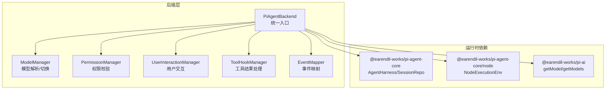
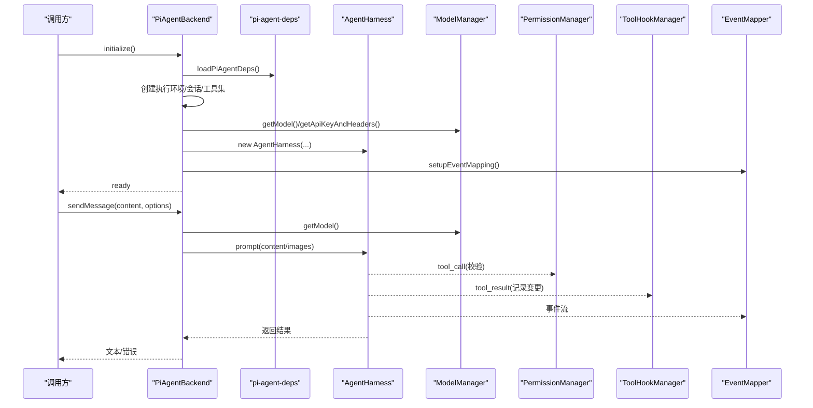
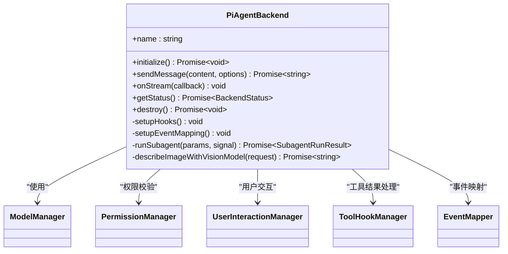
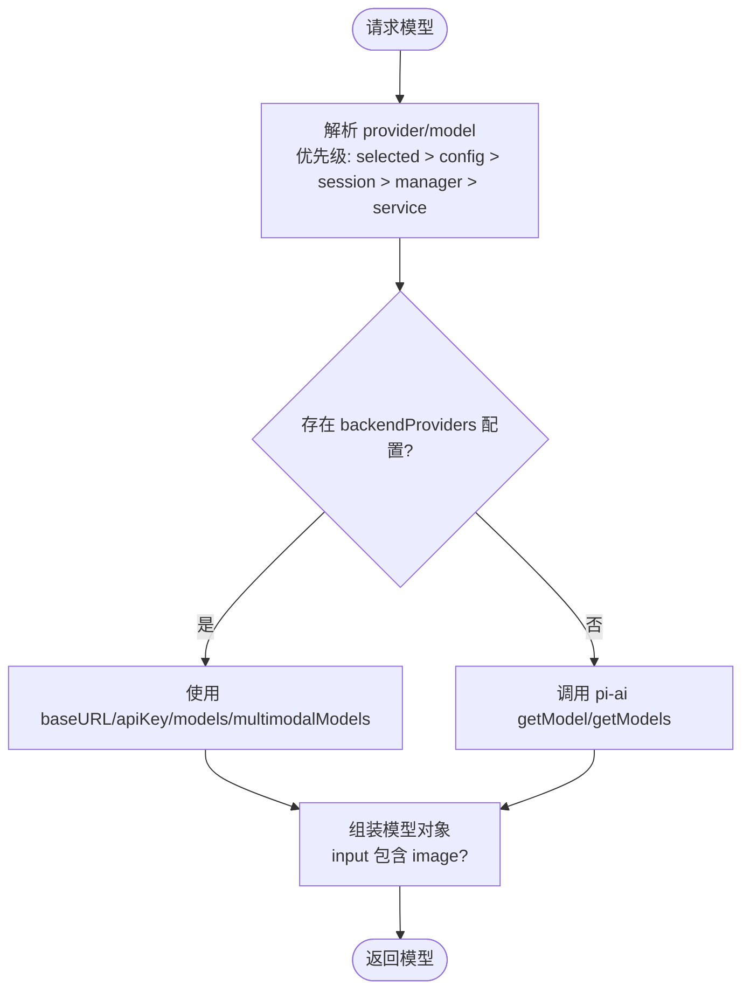
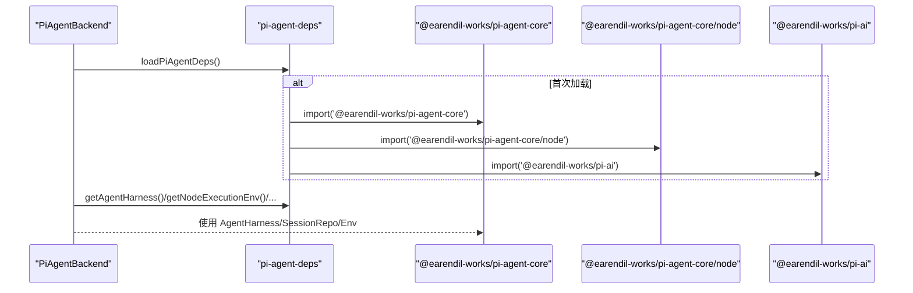
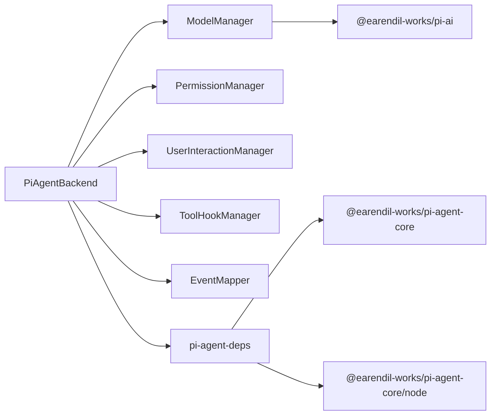

# Pi Agent 后端

<cite>
**本文引用的文件**   
- [packages/agent-service/src/backends/pi-agent.ts](file://packages/agent-service/src/backends/pi-agent.ts)
- [packages/agent-service/src/backends/base.ts](file://packages/agent-service/src/backends/base.ts)
- [packages/agent-service/src/backends/managers/model-manager.ts](file://packages/agent-service/src/backends/managers/model-manager.ts)
- [packages/agent-service/src/backends/managers/pi-agent-deps.ts](file://packages/agent-service/src/backends/managers/pi-agent-deps.ts)
</cite>

## 目录
1. [简介](#简介)
2. [项目结构](#项目结构)
3. [核心组件](#核心组件)
4. [架构总览](#架构总览)
5. [详细组件分析](#详细组件分析)
6. [依赖分析](#依赖分析)
7. [性能考虑](#性能考虑)
8. [故障排查指南](#故障排查指南)
9. [结论](#结论)
10. [附录：配置与示例](#附录配置与示例)

## 简介
本技术文档聚焦于 Pi Agent 后端的实现，围绕 PiAgentBackend 类展开，系统阐述其与 @earendil-works/pi-agent-core 的集成方式、多模型支持架构（含模型切换策略）、工具链管理与版本控制机制、工作空间隔离与资源分配策略、配置验证与参数传递机制，并提供可操作的配置示例路径。

## 项目结构
Pi Agent 后端位于 agent-service 包中，采用“协调者 + 专职管理器”的架构：PiAgentBackend 作为统一入口，负责初始化、事件映射、工具钩子、子 Agent 生命周期管理；具体职责下沉到 managers 下的独立管理器（如 ModelManager、PermissionManager、UserInteractionManager、ToolHookManager、EventMapper），并通过 pi-agent-deps 集中动态加载 @earendil-works/pi-agent-core 及其 Node 扩展与 @earendil-works/pi-ai。

图表来源 
- [packages/agent-service/src/backends/pi-agent.ts:1-120](file://packages/agent-service/src/backends/pi-agent.ts#L1-L120)
- [packages/agent-service/src/backends/managers/model-manager.ts:1-60](file://packages/agent-service/src/backends/managers/model-manager.ts#L1-L60)
- [packages/agent-service/src/backends/managers/pi-agent-deps.ts:1-48](file://packages/agent-service/src/backends/managers/pi-agent-deps.ts#L1-L48)

章节来源
- [packages/agent-service/src/backends/pi-agent.ts:112-152](file://packages/agent-service/src/backends/pi-agent.ts#L112-L152)
- [packages/agent-service/src/backends/managers/pi-agent-deps.ts:14-27](file://packages/agent-service/src/backends/managers/pi-agent-deps.ts#L14-L27)

## 核心组件
- PiAgentBackend：实现 IBackendAdapter，封装 Agent 生命周期、消息发送、流式事件、子 Agent 运行、图片描述、工具钩子与事件映射。
- ModelManager：负责模型解析、提供商选择、API Key 获取、多模态能力判定、模型列表聚合与切换。
- pi-agent-deps：集中动态导入 @earendil-works/pi-agent-core、@earendil-works/pi-agent-core/node 与 @earendil-works/pi-ai，避免 ESM/CJS 兼容问题并复用实例。
- base：定义 IBackendAdapter 接口与状态类型，为后端抽象提供契约。

章节来源
- [packages/agent-service/src/backends/base.ts:1-30](file://packages/agent-service/src/backends/base.ts#L1-L30)
- [packages/agent-service/src/backends/pi-agent.ts:112-152](file://packages/agent-service/src/backends/pi-agent.ts#L112-L152)
- [packages/agent-service/src/backends/managers/model-manager.ts:56-120](file://packages/agent-service/src/backends/managers/model-manager.ts#L56-L120)
- [packages/agent-service/src/backends/managers/pi-agent-deps.ts:14-27](file://packages/agent-service/src/backends/managers/pi-agent-deps.ts#L14-L27)

## 架构总览
PiAgentBackend 通过动态依赖加载器按需引入核心运行时，创建执行环境、会话仓库与 AgentHarness，注入工具集与资源（预装技能），并以回调形式提供模型信息与鉴权头。工具调用前后通过 Hook 进行权限校验与结果处理；所有 AgentHarness 事件经 EventMapper 转换为应用层 AgentEvent 推送给上层。

图表来源 
- [packages/agent-service/src/backends/pi-agent.ts:173-245](file://packages/agent-service/src/backends/pi-agent.ts#L173-L245)
- [packages/agent-service/src/backends/pi-agent.ts:374-407](file://packages/agent-service/src/backends/pi-agent.ts#L374-L407)
- [packages/agent-service/src/backends/pi-agent.ts:614-758](file://packages/agent-service/src/backends/pi-agent.ts#L614-L758)
- [packages/agent-service/src/backends/managers/model-manager.ts:122-159](file://packages/agent-service/src/backends/managers/model-manager.ts#L122-L159)
- [packages/agent-service/src/backends/managers/pi-agent-deps.ts:14-27](file://packages/agent-service/src/backends/managers/pi-agent-deps.ts#L14-L27)

## 详细组件分析

### PiAgentBackend 类
- 职责边界
  - 生命周期：initialize/destroy/status
  - 对话：sendMessage（支持图片与上传文件上下文）
  - 流式：onStream 注册事件回调
  - 子 Agent：runSubagent（受超时与信号控制，独立环境与会话）
  - 图片理解：describeImageWithVisionModel（非视觉模型时走描述管线）
  - 钩子与事件：tool_call/tool_result 拦截与 EventMapper 映射
- 关键流程
  - 初始化：动态加载依赖 → 创建 NodeExecutionEnv/InMemorySessionRepo → 构建工具集 → 获取模型与资源 → 构造 AgentHarness → 注册 Hook 与事件映射
  - 消息发送：合并上传文件上下文 → 判断模型是否支持图像 → 必要时触发图片描述 → 调用 harness.prompt → 提取文本或错误 → 生成 run_summary 事件
  - 子 Agent：创建独立 Env/Session/Harness，禁用 delegateTask/审批/用户选择，收集文件变更，统一超时与取消
- 错误处理
  - 初始化失败置 error 状态并抛出异常
  - 发送消息捕获异常，记录响应调试信息，必要时回退为“已完成修改 N 个文件”提示
  - 子 Agent 超时/中止统一包装为失败结果

图表来源 
- [packages/agent-service/src/backends/pi-agent.ts:112-152](file://packages/agent-service/src/backends/pi-agent.ts#L112-L152)
- [packages/agent-service/src/backends/pi-agent.ts:374-407](file://packages/agent-service/src/backends/pi-agent.ts#L374-L407)
- [packages/agent-service/src/backends/pi-agent.ts:429-612](file://packages/agent-service/src/backends/pi-agent.ts#L429-L612)
- [packages/agent-service/src/backends/pi-agent.ts:614-758](file://packages/agent-service/src/backends/pi-agent.ts#L614-L758)

章节来源
- [packages/agent-service/src/backends/pi-agent.ts:173-245](file://packages/agent-service/src/backends/pi-agent.ts#L173-L245)
- [packages/agent-service/src/backends/pi-agent.ts:374-407](file://packages/agent-service/src/backends/pi-agent.ts#L374-L407)
- [packages/agent-service/src/backends/pi-agent.ts:429-612](file://packages/agent-service/src/backends/pi-agent.ts#L429-L612)
- [packages/agent-service/src/backends/pi-agent.ts:614-758](file://packages/agent-service/src/backends/pi-agent.ts#L614-L758)

### 多模型支持与切换策略（ModelManager）
- 模型解析优先级
  - 会话级 activeModelId/backendProviders
  - 当前 AgentConfig.model（支持 provider/model 或仅 model）
  - 运行时 piAgent.provider/piAgent.model
  - 全局服务配置 serviceConfig.piAgent.*
- 提供商与密钥
  - 优先从 backendProviders 配置读取 baseURL/apiKey/models/multimodalModels
  - 其次回退至 config.piAgent 与 serviceConfig
  - getApiKeyAndHeaders 按 provider > model > config > 环境变量 > serviceConfig 顺序查找
- 多模态能力
  - 通过 multimodalModels 白名单或 input 字段标记支持 image
  - 非视觉模型收到图片时自动触发 describeImageWithVisionModel 将图片转为文本描述
- 模型列表聚合
  - 优先使用 backendProviders.models
  - 否则尝试 pi-ai 的 getModels(provider)
  - 最终 fallback 合成当前配置的 provider/model
- 模型切换
  - applyModelSwitch 更新 config.piAgent 与 selectedModel，后续 getModel 立即生效

图表来源 
- [packages/agent-service/src/backends/managers/model-manager.ts:92-159](file://packages/agent-service/src/backends/managers/model-manager.ts#L92-L159)
- [packages/agent-service/src/backends/managers/model-manager.ts:195-212](file://packages/agent-service/src/backends/managers/model-manager.ts#L195-L212)
- [packages/agent-service/src/backends/managers/model-manager.ts:214-295](file://packages/agent-service/src/backends/managers/model-manager.ts#L214-L295)
- [packages/agent-service/src/backends/managers/model-manager.ts:300-312](file://packages/agent-service/src/backends/managers/model-manager.ts#L300-L312)

章节来源
- [packages/agent-service/src/backends/managers/model-manager.ts:92-159](file://packages/agent-service/src/backends/managers/model-manager.ts#L92-L159)
- [packages/agent-service/src/backends/managers/model-manager.ts:195-212](file://packages/agent-service/src/backends/managers/model-manager.ts#L195-L212)
- [packages/agent-service/src/backends/managers/model-manager.ts:214-295](file://packages/agent-service/src/backends/managers/model-manager.ts#L214-L295)
- [packages/agent-service/src/backends/managers/model-manager.ts:300-312](file://packages/agent-service/src/backends/managers/model-manager.ts#L300-L312)

### 与 @earendil-works/pi-agent-core 的集成
- 动态依赖加载
  - 首次调用 loadPiAgentDeps 时动态 import 核心模块与 Node 扩展，缓存引用供后续复用
  - 暴露 getAgentHarness/getNodeExecutionEnv/getInMemorySessionRepo/getGetModel/getGetModels 访问器
- 运行时装配
  - 使用 NodeExecutionEnv 指定工作目录
  - 使用 InMemorySessionRepo 创建内存会话
  - 以 AgentHarness 驱动对话，传入 tools/resources/model/systemPrompt/getApiKeyAndHeaders/thinkingLevel

图表来源 
- [packages/agent-service/src/backends/managers/pi-agent-deps.ts:14-27](file://packages/agent-service/src/backends/managers/pi-agent-deps.ts#L14-L27)
- [packages/agent-service/src/backends/pi-agent.ts:173-245](file://packages/agent-service/src/backends/pi-agent.ts#L173-L245)

章节来源
- [packages/agent-service/src/backends/managers/pi-agent-deps.ts:14-27](file://packages/agent-service/src/backends/managers/pi-agent-deps.ts#L14-L27)
- [packages/agent-service/src/backends/pi-agent.ts:173-245](file://packages/agent-service/src/backends/pi-agent.ts#L173-L245)

### 工具链管理与版本控制
- 工具装配
  - createWorkbenchTools 根据配置注入工具集，主 Agent 可启用 delegateTask（子 Agent），子 Agent 默认关闭
  - 工具调用前由 PermissionManager.validateToolCall 进行权限校验
  - 工具结果由 ToolHookManager.handleToolResult 统一处理，采集文件变更与知识库读取追踪
- 版本控制
  - 通过 backendProviders.models 显式声明可用模型列表，配合 activeModelId 控制当前激活模型
  - 当未声明时回退到 pi-ai 的动态模型列表，保证向后兼容
  - 模型切换通过 applyModelSwitch 即时生效，无需重建 Agent

章节来源
- [packages/agent-service/src/backends/pi-agent.ts:197-208](file://packages/agent-service/src/backends/pi-agent.ts#L197-L208)
- [packages/agent-service/src/backends/pi-agent.ts:374-396](file://packages/agent-service/src/backends/pi-agent.ts#L374-L396)
- [packages/agent-service/src/backends/managers/model-manager.ts:214-295](file://packages/agent-service/src/backends/managers/model-manager.ts#L214-L295)
- [packages/agent-service/src/backends/managers/model-manager.ts:300-312](file://packages/agent-service/src/backends/managers/model-manager.ts#L300-L312)

### 工作空间隔离与资源分配
- 执行环境
  - 每个 AgentHarness 绑定独立的 NodeExecutionEnv，cwd 来自 config.workingDir 或进程 cwd
- 会话隔离
  - 使用 InMemorySessionRepo 为每个 AgentHarness 创建独立 Session，主/子 Agent 互不干扰
- 资源清理
  - destroy 与 finally 块确保 harness.abort、env.cleanup、unsub 释放，防止泄漏

章节来源
- [packages/agent-service/src/backends/pi-agent.ts:188-196](file://packages/agent-service/src/backends/pi-agent.ts#L188-L196)
- [packages/agent-service/src/backends/pi-agent.ts:447-452](file://packages/agent-service/src/backends/pi-agent.ts#L447-L452)
- [packages/agent-service/src/backends/pi-agent.ts:777-800](file://packages/agent-service/src/backends/pi-agent.ts#L777-L800)

### 配置验证与参数传递
- 配置来源与优先级
  - backendProviders（会话级）> config.piAgent > serviceConfig.piAgent
  - 模型 ID 支持 full id（provider/model）或仅 model
- 参数传递
  - sendMessage 支持 images/files 选项，files 会合并会话历史附件并在提示词中注入只读清单
  - onStream 设置事件回调，内部同步至各管理器与 EventMapper
- 健康检查与状态
  - getStatus 返回 idle/initializing/ready/busy/error
  - checkHealth 在接口契约中定义（由实现决定）

章节来源
- [packages/agent-service/src/backends/base.ts:1-30](file://packages/agent-service/src/backends/base.ts#L1-L30)
- [packages/agent-service/src/backends/pi-agent.ts:614-758](file://packages/agent-service/src/backends/pi-agent.ts#L614-L758)
- [packages/agent-service/src/backends/managers/model-manager.ts:92-120](file://packages/agent-service/src/backends/managers/model-manager.ts#L92-L120)

## 依赖分析
- 直接依赖
  - PiAgentBackend 依赖 ModelManager、PermissionManager、UserInteractionManager、ToolHookManager、EventMapper
  - ModelManager 依赖 backend-providers 管理器与 pi-ai 的 getModel/getModels
  - 所有运行时核心均通过 pi-agent-deps 动态加载
- 耦合与内聚
  - PiAgentBackend 作为协调者，职责清晰且高内聚；管理器解耦便于独立测试与演进
- 外部依赖
  - @earendil-works/pi-agent-core（AgentHarness/SessionRepo）
  - @earendil-works/pi-agent-core/node（NodeExecutionEnv）
  - @earendil-works/pi-ai（模型元数据）

图表来源 
- [packages/agent-service/src/backends/pi-agent.ts:112-152](file://packages/agent-service/src/backends/pi-agent.ts#L112-L152)
- [packages/agent-service/src/backends/managers/model-manager.ts:1-10](file://packages/agent-service/src/backends/managers/model-manager.ts#L1-L10)
- [packages/agent-service/src/backends/managers/pi-agent-deps.ts:14-27](file://packages/agent-service/src/backends/managers/pi-agent-deps.ts#L14-L27)

章节来源
- [packages/agent-service/src/backends/pi-agent.ts:112-152](file://packages/agent-service/src/backends/pi-agent.ts#L112-L152)
- [packages/agent-service/src/backends/managers/model-manager.ts:1-10](file://packages/agent-service/src/backends/managers/model-manager.ts#L1-L10)
- [packages/agent-service/src/backends/managers/pi-agent-deps.ts:14-27](file://packages/agent-service/src/backends/managers/pi-agent-deps.ts#L14-L27)

## 性能考虑
- 动态加载避免冷启动开销，仅在首次使用时加载核心模块
- 子 Agent 独立环境与会话，避免共享状态导致的锁竞争
- 图片描述在非视觉模型场景下额外一次 LLM 调用，建议合理配置多模态模型以减少二次成本
- 工具结果与事件映射尽量轻量，避免阻塞主流程

## 故障排查指南
- 初始化失败
  - 检查动态依赖是否成功加载（ESM/CJS 兼容性已通过动态 import 规避）
  - 确认 workingDir 存在且可写
- 无 API Key
  - 按优先级检查 backendProviders.apiKey > model.apiKey > config.piAgent.apiKey > 环境变量 > serviceConfig
- 非视觉模型上传图片报错
  - 确认已配置识图模型或开启图片描述能力
- 子 Agent 超时
  - 调整 subagentTimeout，关注日志中的 timeoutHit 标志
- 空响应
  - 查看 lastResponseDebug 与 run_summary，确认是否存在工具结果或文件变更

章节来源
- [packages/agent-service/src/backends/pi-agent.ts:240-245](file://packages/agent-service/src/backends/pi-agent.ts#L240-L245)
- [packages/agent-service/src/backends/pi-agent.ts:670-691](file://packages/agent-service/src/backends/pi-agent.ts#L670-L691)
- [packages/agent-service/src/backends/pi-agent.ts:747-758](file://packages/agent-service/src/backends/pi-agent.ts#L747-L758)
- [packages/agent-service/src/backends/managers/model-manager.ts:195-212](file://packages/agent-service/src/backends/managers/model-manager.ts#L195-L212)

## 结论
PiAgentBackend 以统一的适配器形态封装了与 @earendil-works/pi-agent-core 的深度集成，结合 ModelManager 的多模型解析与切换、完善的工具链钩子与事件映射、以及严格的工作空间与资源隔离，提供了稳定可扩展的后端能力。通过动态依赖加载与分层管理器设计，系统在可维护性与性能之间取得良好平衡。

## 附录：配置与示例
- 配置要点
  - 在 backendProviders 中声明 providers、models、activeModelId、multimodalModels
  - 在 config.piAgent 中提供 provider/model/baseUrl/apiKey 等回退值
  - 在 serviceConfig.piAgent 中提供全局默认值
- 示例路径（不含代码内容）
  - 模型配置参考：[docs/用户指南/模型配置指南.md](file://docs/用户指南/模型配置指南.md)
  - 代理配置说明：[docs/项目文档/创作端/03-项目管理/技术/05_代理配置.md](file://docs/项目文档/创作端/03-项目管理/技术/05_代理配置.md)
  - 独立 Agent 服务层设计：[docs/项目文档/独立Agent服务层/03-核心模块设计.md](file://docs/项目文档/独立Agent服务层/03-核心模块设计.md)
  - Docker 部署方案（含 Pi Agent 嵌入说明）：[docs/项目文档/创作端/06-基础设施/技术/03_Docker部署方案.md](file://docs/项目文档/创作端/06-基础设施/技术/03_Docker部署方案.md)