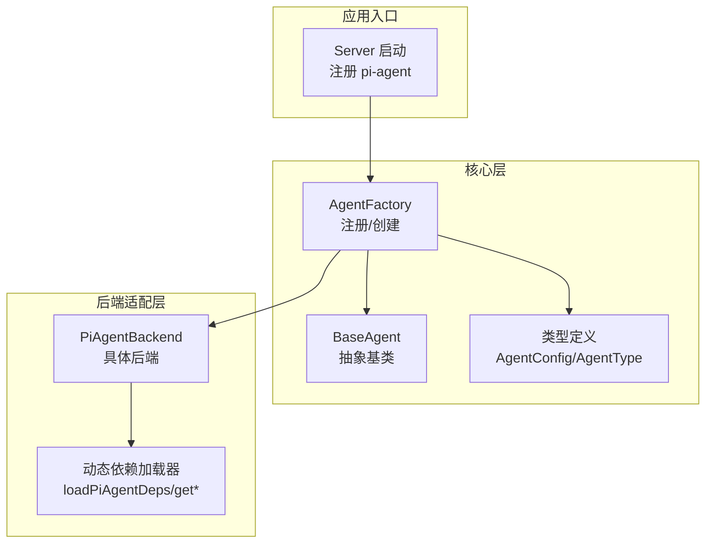
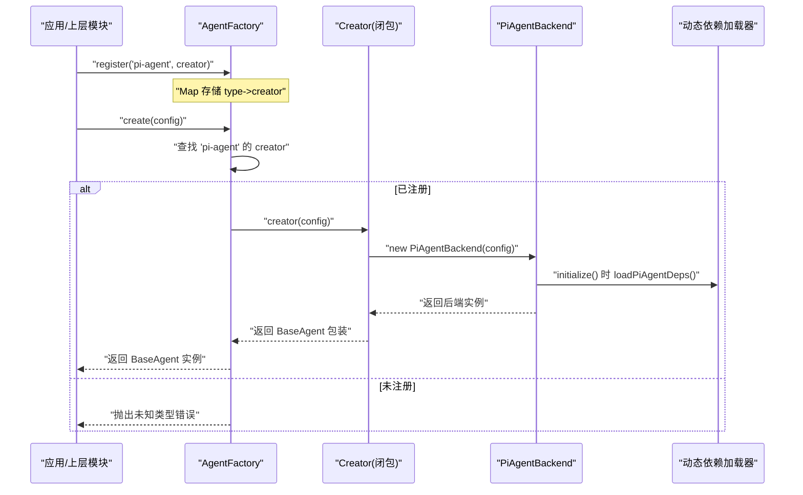
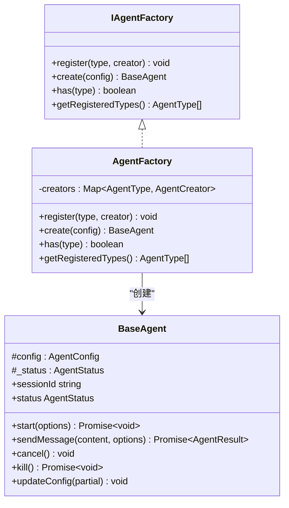
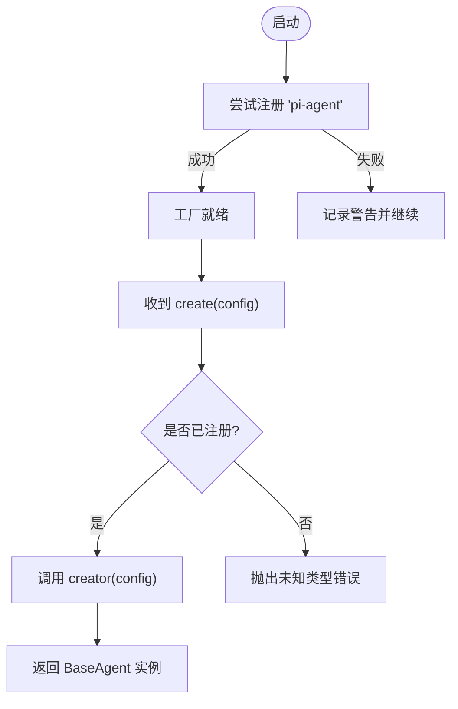
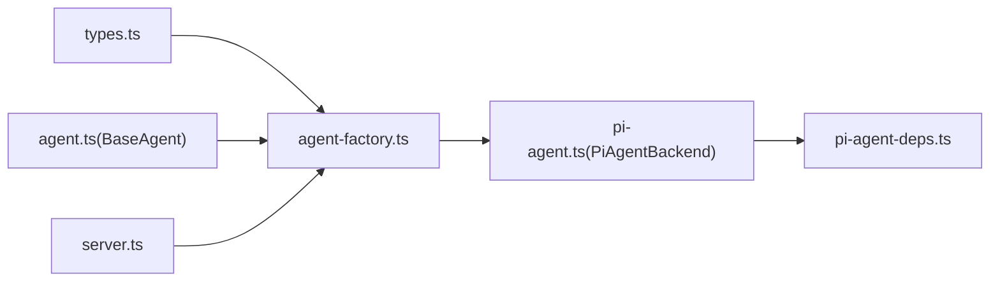

# 代理工厂

<cite>
**本文引用的文件**   
- [agent-factory.ts](file://packages/agent-service/src/core/agent-factory.ts)
- [types.ts](file://packages/agent-service/src/core/types.ts)
- [agent.ts](file://packages/agent-service/src/core/agent.ts)
- [server.ts](file://packages/agent-service/src/server.ts)
- [pi-agent-deps.ts](file://packages/agent-service/src/backends/managers/pi-agent-deps.ts)
- [pi-agent.ts](file://packages/agent-service/src/backends/pi-agent.ts)
</cite>

## 目录
1. [简介](#简介)
2. [项目结构](#项目结构)
3. [核心组件](#核心组件)
4. [架构总览](#架构总览)
5. [详细组件分析](#详细组件分析)
6. [依赖分析](#依赖分析)
7. [性能考虑](#性能考虑)
8. [故障排查指南](#故障排查指南)
9. [结论](#结论)
10. [附录：自定义代理开发示例](#附录自定义代理开发示例)

## 简介
本技术文档聚焦于“代理工厂”子系统，围绕 AgentFactory 类的设计模式、注册机制、动态创建与实例化流程、配置验证与默认值处理、插件扩展点以及依赖注入与配置管理进行系统化说明。同时提供面向实践的开发指引，帮助读者快速实现并注册自定义代理类型。

## 项目结构
与代理工厂相关的核心代码位于 agent-service 包中，关键文件包括：
- 工厂与基类：core/agent-factory.ts、core/agent.ts
- 类型定义：core/types.ts
- 后端适配器与具体实现：backends/pi-agent.ts、backends/managers/pi-agent-deps.ts
- 服务启动与注册入口：server.ts

图表来源
- [agent-factory.ts:13-41](file://packages/agent-service/src/core/agent-factory.ts#L13-L41)
- [agent.ts:22-112](file://packages/agent-service/src/core/agent.ts#L22-L112)
- [types.ts:10-65](file://packages/agent-service/src/core/types.ts#L10-L65)
- [pi-agent.ts:112-152](file://packages/agent-service/src/backends/pi-agent.ts#L112-L152)
- [pi-agent-deps.ts:14-27](file://packages/agent-service/src/backends/managers/pi-agent-deps.ts#L14-L27)
- [server.ts:68-82](file://packages/agent-service/src/server.ts#L68-L82)

章节来源
- [agent-factory.ts:13-41](file://packages/agent-service/src/core/agent-factory.ts#L13-L41)
- [agent.ts:22-112](file://packages/agent-service/src/core/agent.ts#L22-L112)
- [types.ts:10-65](file://packages/agent-service/src/core/types.ts#L10-L65)
- [pi-agent.ts:112-152](file://packages/agent-service/src/backends/pi-agent.ts#L112-L152)
- [pi-agent-deps.ts:14-27](file://packages/agent-service/src/backends/managers/pi-agent-deps.ts#L14-L27)
- [server.ts:68-82](file://packages/agent-service/src/server.ts#L68-L82)

## 核心组件
- AgentFactory：基于 Map 的轻量级工厂，维护“类型 -> 创建函数”的映射，提供 register/create/has/getRegisteredTypes 能力，并通过全局单例 getAgentFactory 暴露。
- BaseAgent：抽象基类，封装会话 ID、状态机、事件发射、生命周期方法（start/sendMessage/cancel/kill/updateConfig）等通用行为。
- 类型系统：AgentType 为联合字面量类型，当前仅包含 "pi-agent"；AgentConfig 描述代理运行所需的全部配置项，含模型、权限、工具模式、超时、外部认证等。
- PiAgentBackend：具体后端适配器，负责与底层 AgentHarness 交互、工具链集成、事件映射、图片理解、子代理管理等。
- 动态依赖加载器：按需加载 @earendil-works/pi-agent-core 与 @earendil-works/pi-ai，避免冷启动开销。
- Server 启动：在进程启动时尝试将 "pi-agent" 注册到工厂，若 ESM 依赖不可用则降级记录警告。

章节来源
- [agent-factory.ts:13-41](file://packages/agent-service/src/core/agent-factory.ts#L13-L41)
- [agent.ts:22-112](file://packages/agent-service/src/core/agent.ts#L22-L112)
- [types.ts:10-65](file://packages/agent-service/src/core/types.ts#L10-L65)
- [pi-agent.ts:112-152](file://packages/agent-service/src/backends/pi-agent.ts#L112-L152)
- [pi-agent-deps.ts:14-27](file://packages/agent-service/src/backends/managers/pi-agent-deps.ts#L14-L27)
- [server.ts:68-82](file://packages/agent-service/src/server.ts#L68-L82)

## 架构总览
下图展示了从服务启动到代理创建的完整调用链，以及工厂如何与后端适配器协作。

图表来源
- [agent-factory.ts:16-32](file://packages/agent-service/src/core/agent-factory.ts#L16-L32)
- [server.ts:68-82](file://packages/agent-service/src/server.ts#L68-L82)
- [pi-agent.ts:173-196](file://packages/agent-service/src/backends/pi-agent.ts#L173-L196)
- [pi-agent-deps.ts:14-27](file://packages/agent-service/src/backends/managers/pi-agent-deps.ts#L14-L27)

## 详细组件分析

### AgentFactory 设计与注册机制
- 设计模式
  - 简单工厂 + 注册表：通过 Map 维护类型到创建函数的映射，支持运行时扩展。
  - 单例访问：getAgentFactory 提供全局唯一工厂实例，便于跨模块共享注册表。
- 注册与创建
  - register(type, creator)：重复注册同类型会抛错，确保唯一性。
  - create(config)：根据固定类型 "pi-agent" 查找 creator 并调用，未找到则抛错。
  - has/getRegisteredTypes：用于诊断与自检。
- 可扩展性
  - 当前 create 内部硬编码了 "pi-agent"，如需多类型分发，可将 type 参数透传至 create 并在内部路由。

图表来源
- [agent-factory.ts:6-41](file://packages/agent-service/src/core/agent-factory.ts#L6-L41)
- [agent.ts:22-112](file://packages/agent-service/src/core/agent.ts#L22-L112)

章节来源
- [agent-factory.ts:13-41](file://packages/agent-service/src/core/agent-factory.ts#L13-L41)

### 代理类型的动态创建与实例化
- 注册阶段
  - server.ts 在启动时尝试将 "pi-agent" 注册到工厂，使用闭包将 config 传入 PiAgentBackend 构造器，并返回 BaseAgent 包装对象。
  - 若 ESM 依赖不可用，捕获异常并输出警告，保证服务可继续启动。
- 创建阶段
  - 调用 factory.create(config) 时，工厂按类型查找 creator 并执行，最终返回 BaseAgent 实例。
  - 后端初始化（如 PiAgentBackend.initialize）会在首次使用时按需加载重型依赖，降低冷启动成本。

图表来源
- [server.ts:68-82](file://packages/agent-service/src/server.ts#L68-L82)
- [agent-factory.ts:23-32](file://packages/agent-service/src/core/agent-factory.ts#L23-L32)

章节来源
- [server.ts:68-82](file://packages/agent-service/src/server.ts#L68-L82)
- [agent-factory.ts:23-32](file://packages/agent-service/src/core/agent-factory.ts#L23-L32)

### 代理配置的验证与默认值处理
- 配置结构
  - AgentConfig 定义了会话、工作目录、项目标识、模型、工具模式、超时、权限、后端提供者、外部认证、以及 piAgent 专属字段等。
  - PiAgentConfig 进一步细化 API Key、模型、提供商、基础地址、超时、子代理开关与思考级别等。
- 默认值策略
  - 部分字段在 PiAgentBackend 内部通过“配置优先，服务配置兜底”的方式合并（例如子代理开关与超时）。
  - 其他可选字段由调用方或上游服务填充，工厂本身不做校验与合并。
- 建议
  - 在工厂层增加统一的配置校验与默认值合并逻辑，提升健壮性与一致性。

章节来源
- [types.ts:40-65](file://packages/agent-service/src/core/types.ts#L40-L65)
- [pi-agent.ts:154-164](file://packages/agent-service/src/backends/pi-agent.ts#L154-L164)

### 插件系统与扩展点
- 扩展点
  - 工厂的 register 方法是主要扩展点，允许在运行时注册任意类型与对应的创建函数。
  - 后端适配器通过 IBackendAdapter 接口解耦，新增后端只需实现该接口并以 creator 形式注册。
- 当前内置
  - "pi-agent" 作为默认后端，在 server.ts 启动时完成注册。
- 扩展方式
  - 新建后端实现 IBackendAdapter，编写 creator 闭包，调用 factory.register("your-type", creator)。
  - 若需多类型分发，可在工厂 create 中根据传入 type 路由到不同 creator。

章节来源
- [agent-factory.ts:6-21](file://packages/agent-service/src/core/agent-factory.ts#L6-L21)
- [server.ts:68-82](file://packages/agent-service/src/server.ts#L68-L82)

### 依赖注入与配置管理
- 依赖注入
  - 工厂通过 creator 闭包注入后端实例，后端构造器接收 AgentConfig，形成松耦合的装配关系。
  - 后端内部通过管理器（模型、权限、用户交互、工具钩子、事件映射）组合能力，职责清晰。
- 配置管理
  - 配置来源于 AgentConfig，部分字段在 PiAgentBackend 内与服务级配置合并。
  - 动态依赖加载器集中管理重型库的懒加载，避免不必要的启动开销。

章节来源
- [agent-factory.ts:16-32](file://packages/agent-service/src/core/agent-factory.ts#L16-L32)
- [pi-agent.ts:138-152](file://packages/agent-service/src/backends/pi-agent.ts#L138-L152)
- [pi-agent-deps.ts:14-27](file://packages/agent-service/src/backends/managers/pi-agent-deps.ts#L14-L27)

## 依赖分析
- 直接依赖
  - AgentFactory 依赖 types.ts 中的 AgentConfig/AgentType 与 core/agent.ts 中的 BaseAgent。
  - server.ts 依赖工厂与 PiAgentBackend，并在启动时完成注册。
  - PiAgentBackend 依赖动态依赖加载器与多个管理器。
- 间接依赖
  - 通过 IBackendAdapter 抽象，后端与工厂解耦，新增后端无需改动工厂核心逻辑。
- 潜在风险
  - 当前 create 硬编码 "pi-agent"，不利于多类型分发；建议在后续版本引入 type 参数路由。
  - 全局单例工厂在多测试场景下需注意隔离，避免状态污染。

图表来源
- [agent-factory.ts:1-4](file://packages/agent-service/src/core/agent-factory.ts#L1-L4)
- [agent.ts:1-19](file://packages/agent-service/src/core/agent.ts#L1-L19)
- [server.ts:68-82](file://packages/agent-service/src/server.ts#L68-L82)
- [pi-agent.ts:1-44](file://packages/agent-service/src/backends/pi-agent.ts#L1-44)
- [pi-agent-deps.ts:1-27](file://packages/agent-service/src/backends/managers/pi-agent-deps.ts#L1-L27)

章节来源
- [agent-factory.ts:1-41](file://packages/agent-service/src/core/agent-factory.ts#L1-L41)
- [server.ts:68-82](file://packages/agent-service/src/server.ts#L68-L82)
- [pi-agent.ts:1-44](file://packages/agent-service/src/backends/pi-agent.ts#L1-44)
- [pi-agent-deps.ts:1-27](file://packages/agent-service/src/backends/managers/pi-agent-deps.ts#L1-L27)

## 性能考虑
- 延迟加载：后端在 initialize 时才加载重型依赖，减少冷启动时间。
- 单例工厂：避免重复创建工厂实例，降低内存占用。
- 建议优化：
  - 在工厂层缓存常用配置校验结果，避免重复解析。
  - 对大型配置进行浅拷贝与惰性求值，减少不必要的数据复制。

## 故障排查指南
- 常见错误
  - 重复注册：register 时若类型已存在，会抛出错误。检查是否在多处重复注册同一类型。
  - 未知类型：create 时若未找到对应 creator，会抛出错误。确认已在启动阶段完成注册。
  - ESM 依赖不可用：server.ts 捕获异常并记录警告，导致后端不可用。检查依赖安装与环境兼容性。
- 定位步骤
  - 使用 getRegisteredTypes 打印已注册类型，确认注册是否生效。
  - 在 create 前后添加日志，观察是否命中对应 creator。
  - 检查后端 initialize 是否成功加载动态依赖。

章节来源
- [agent-factory.ts:16-32](file://packages/agent-service/src/core/agent-factory.ts#L16-L32)
- [server.ts:68-82](file://packages/agent-service/src/server.ts#L68-L82)

## 结论
AgentFactory 以简洁的注册表模式实现了代理的动态创建与扩展，结合 BaseAgent 抽象与后端适配器，形成了清晰的解耦架构。通过全局单例与延迟加载，兼顾了易用性与性能。未来可在工厂层增强配置校验、类型路由与测试隔离，进一步提升系统的健壮性与可维护性。

## 附录：自定义代理开发示例
以下示例展示如何开发一个自定义代理类型并将其注册到工厂中。请根据实际业务替换占位符与实现细节。

- 步骤一：实现后端适配器
  - 新建文件 custom-backend.ts，实现 IBackendAdapter 接口（参考 PiAgentBackend 的实现风格），包含 initialize、sendMessage、onStream、getStatus、destroy 等方法。
  - 在构造函数中接收 AgentConfig，按需初始化资源。

- 步骤二：编写创建函数
  - 在 custom-backend.ts 中导出一个 creator 函数，签名符合 AgentCreator：(config: AgentConfig) => BaseAgent。
  - 在该函数中 new 你的后端实例，并按需包装为 BaseAgent 子类或直接返回后端（若遵循统一接口）。

- 步骤三：注册到工厂
  - 在服务启动处（如 server.ts 附近）调用 getAgentFactory().register("custom-agent", creator)。
  - 若依赖较重，可在 creator 内部或后端 initialize 中进行懒加载。

- 步骤四：使用工厂创建实例
  - 调用 getAgentFactory().create({ sessionId: "...", ... }) 获取 BaseAgent 实例。
  - 调用 start、sendMessage 等方法驱动代理运行。

- 注意事项
  - 避免重复注册：确保 "custom-agent" 只注册一次。
  - 配置校验：建议在 creator 或后端初始化中对必要字段进行校验与默认值合并。
  - 事件与日志：遵循 BaseAgent 的事件约定，便于上层统一消费。

章节来源
- [agent-factory.ts:6-21](file://packages/agent-service/src/core/agent-factory.ts#L6-L21)
- [server.ts:68-82](file://packages/agent-service/src/server.ts#L68-L82)
- [pi-agent.ts:112-152](file://packages/agent-service/src/backends/pi-agent.ts#L112-L152)