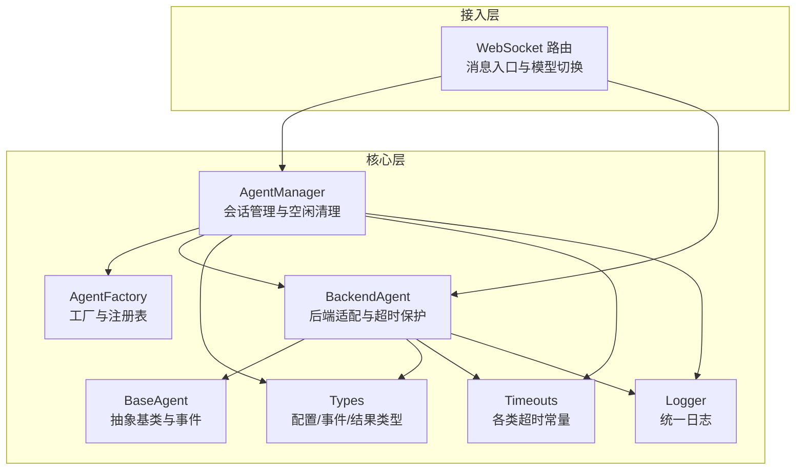
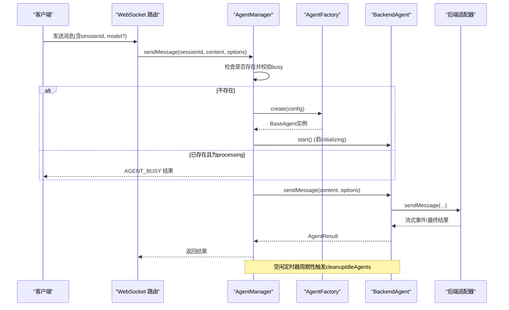
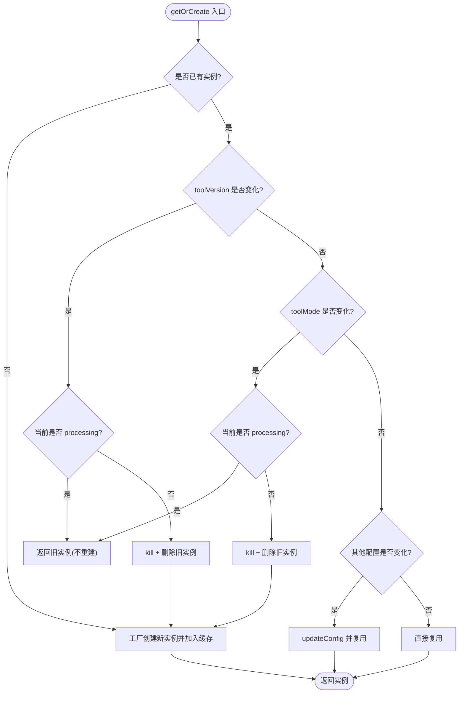
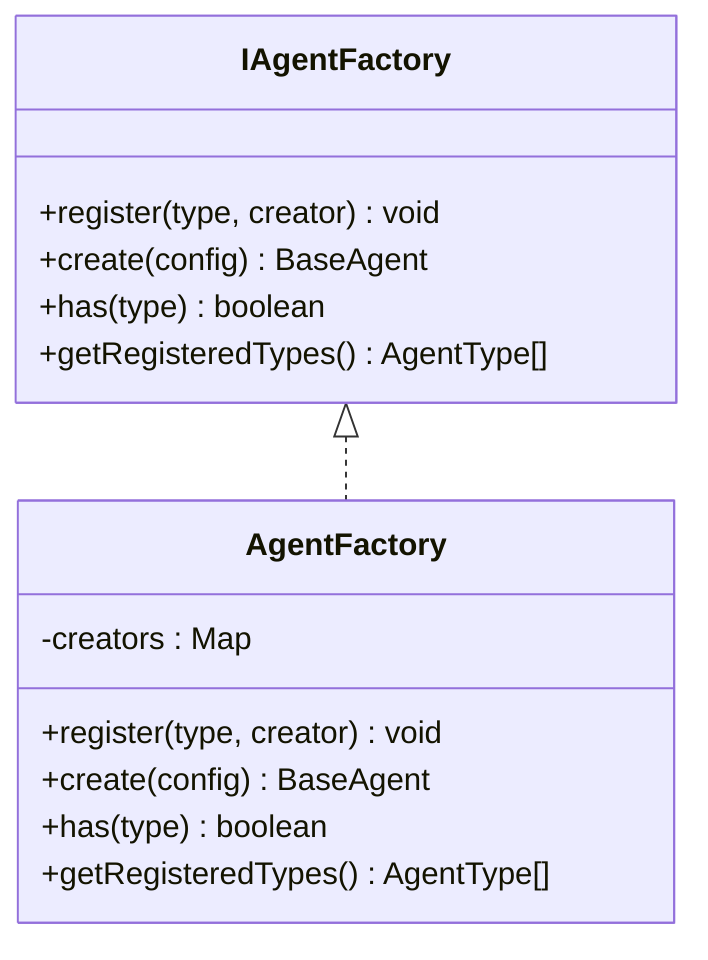
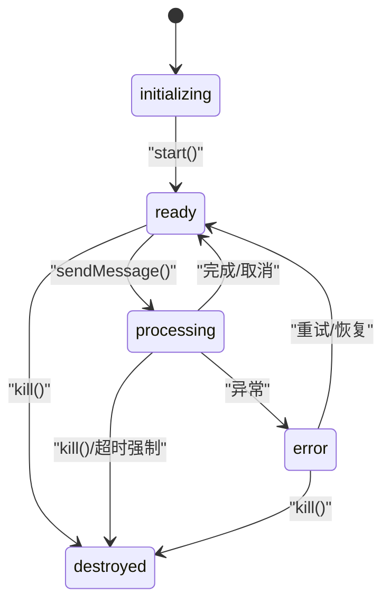
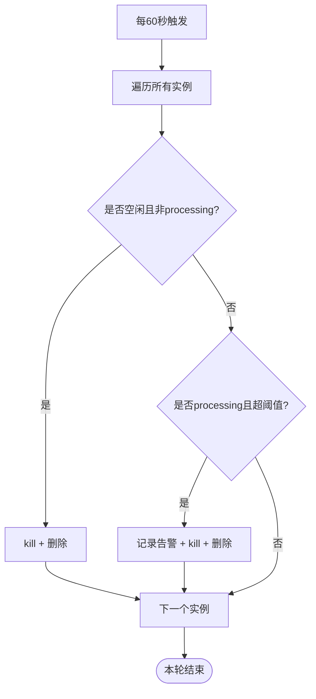
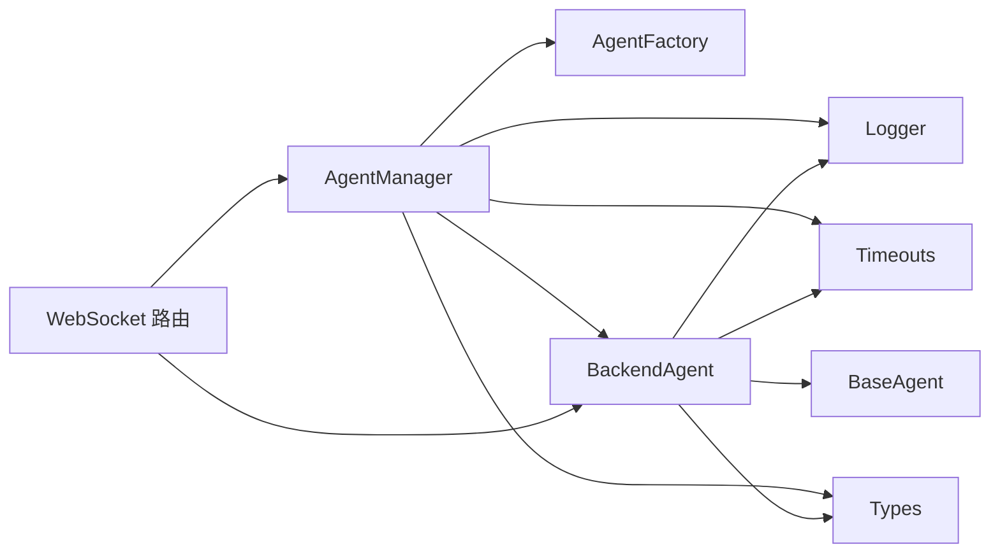

# 代理管理器

<cite>
**本文引用的文件列表**
- [agent-manager.ts](file://packages/agent-service/src/core/agent-manager.ts)
- [agent-factory.ts](file://packages/agent-service/src/core/agent-factory.ts)
- [agent.ts](file://packages/agent-service/src/core/agent.ts)
- [backend-agent.ts](file://packages/agent-service/src/core/backend-agent.ts)
- [types.ts](file://packages/agent-service/src/core/types.ts)
- [timeouts.ts](file://packages/agent-service/src/core/timeouts.ts)
- [logger.ts](file://packages/agent-service/src/utils/logger.ts)
- [websocket.ts](file://packages/agent-service/src/routes/websocket.ts)
- [agent-manager.test.ts](file://packages/agent-service/tests/unit/agent-manager.test.ts)
</cite>

## 目录
1. [简介](#简介)
2. [项目结构](#项目结构)
3. [核心组件](#核心组件)
4. [架构总览](#架构总览)
5. [详细组件分析](#详细组件分析)
6. [依赖关系分析](#依赖关系分析)
7. [性能与资源管理](#性能与资源管理)
8. [故障排查指南](#故障排查指南)
9. [结论](#结论)
10. [附录：使用示例路径](#附录使用示例路径)

## 简介
本技术文档聚焦于 AgentManager 类及其周边协作组件，系统性阐述以下能力：
- 代理生命周期管理：创建、启动、销毁、状态机演进
- 会话状态跟踪：基于 sessionId 的实例复用与元信息暴露
- 空闲清理机制：定时扫描、超时阈值、processing 兜底强制回收
- getOrCreate 方法：工具版本与配置变更检测、处理中保护
- 工厂模式与动态创建：AgentFactory 注册与实例化
- 忙状态检测与并发控制：BackendAgent.isBusy 与消息发送串行化
- 实际使用路径：通过 WebSocket 路由与测试用例展示正确用法

## 项目结构
围绕代理管理的核心代码位于 agent-service 包的 core 层，包含管理器、工厂、基础抽象、后端适配、类型与超时常量等。

图表来源
- [agent-manager.ts:44-247](file://packages/agent-service/src/core/agent-manager.ts#L44-L247)
- [agent-factory.ts:13-50](file://packages/agent-service/src/core/agent-factory.ts#L13-L50)
- [backend-agent.ts:36-287](file://packages/agent-service/src/core/backend-agent.ts#L36-L287)
- [agent.ts:22-137](file://packages/agent-service/src/core/agent.ts#L22-L137)
- [types.ts:10-54](file://packages/agent-service/src/core/types.ts#L10-L54)
- [timeouts.ts:1-9](file://packages/agent-service/src/core/timeouts.ts#L1-L9)
- [logger.ts:14-42](file://packages/agent-service/src/utils/logger.ts#L14-L42)
- [websocket.ts:285-321](file://packages/agent-service/src/routes/websocket.ts#L285-L321)

章节来源
- [agent-manager.ts:44-247](file://packages/agent-service/src/core/agent-manager.ts#L44-L247)
- [agent-factory.ts:13-50](file://packages/agent-service/src/core/agent-factory.ts#L13-L50)
- [backend-agent.ts:36-287](file://packages/agent-service/src/core/backend-agent.ts#L36-L287)
- [agent.ts:22-137](file://packages/agent-service/src/core/agent.ts#L22-L137)
- [types.ts:10-54](file://packages/agent-service/src/core/types.ts#L10-L54)
- [timeouts.ts:1-9](file://packages/agent-service/src/core/timeouts.ts#L1-L9)
- [logger.ts:14-42](file://packages/agent-service/src/utils/logger.ts#L14-L42)
- [websocket.ts:285-321](file://packages/agent-service/src/routes/websocket.ts#L285-L321)

## 核心组件
- AgentManager：按 sessionId 维护 BaseAgent 实例，负责 getOrCreate、销毁、空闲清理、发送消息、统计与列表。
- AgentFactory：以工厂模式集中创建具体 Agent 实例，支持类型注册与全局单例访问。
- BaseAgent：定义 Agent 抽象接口（start/sendMessage/cancel/kill/updateConfig）、状态机、事件与元信息。
- BackendAgent：实现 BaseAgent，封装后端适配器，提供忙状态、无进展/绝对超时、取消与模型切换等能力。
- Types：统一的配置、事件、错误码与结果结构。
- Timeouts：可配置的三类超时常量（无进展、processing 兜底、绝对上限）。
- Logger：统一结构化日志输出。

章节来源
- [agent-manager.ts:44-247](file://packages/agent-service/src/core/agent-manager.ts#L44-L247)
- [agent-factory.ts:13-50](file://packages/agent-service/src/core/agent-factory.ts#L13-L50)
- [agent.ts:22-137](file://packages/agent-service/src/core/agent.ts#L22-L137)
- [backend-agent.ts:36-287](file://packages/agent-service/src/core/backend-agent.ts#L36-L287)
- [types.ts:10-54](file://packages/agent-service/src/core/types.ts#L10-L54)
- [timeouts.ts:1-9](file://packages/agent-service/src/core/timeouts.ts#L1-L9)
- [logger.ts:14-42](file://packages/agent-service/src/utils/logger.ts#L14-L42)

## 架构总览
下图展示了从请求到代理执行的关键交互流程，包括忙状态拦截、自动启动、超时保护与空闲回收。

图表来源
- [websocket.ts:285-321](file://packages/agent-service/src/routes/websocket.ts#L285-L321)
- [agent-manager.ts:165-184](file://packages/agent-service/src/core/agent-manager.ts#L165-L184)
- [agent-factory.ts:23-32](file://packages/agent-service/src/core/agent-factory.ts#L23-L32)
- [backend-agent.ts:62-160](file://packages/agent-service/src/core/backend-agent.ts#L62-L160)

## 详细组件分析

### AgentManager：会话与生命周期中枢
- 职责
  - 按 sessionId 缓存 BaseAgent 实例，提供 get/getHas/count/list 等查询能力
  - getOrCreate：在工具版本或工具模式变化时重建；否则更新配置并复用
  - destroy/destroyAll：优雅销毁所有实例并停止空闲检查
  - sendMessage：忙状态拦截、按需启动、转发至底层 Agent
  - cleanupIdleAgents：每 60 秒扫描一次，清理空闲与“卡死”的 processing 实例
- 关键行为
  - 默认空闲超时：2 小时（可通过构造参数覆盖）
  - 空闲检查间隔：60 秒，定时器 unref 避免阻塞进程退出
  - processing 兜底：超过 PROCESSING_MAX_TIMEOUT_MS 强制 kill
  - 配置变更检测：workingDir/demoId/toolMode/backendProviders 变化时调用 updateConfig

图表来源
- [agent-manager.ts:62-125](file://packages/agent-service/src/core/agent-manager.ts#L62-L125)
- [agent-manager.ts:127-137](file://packages/agent-service/src/core/agent-manager.ts#L127-L137)

章节来源
- [agent-manager.ts:44-247](file://packages/agent-service/src/core/agent-manager.ts#L44-L247)
- [agent-manager.test.ts:49-75](file://packages/agent-service/tests/unit/agent-manager.test.ts#L49-L75)

### AgentFactory：工厂模式与动态创建
- 职责
  - 维护 type -> creator 映射，支持 register/create/has/getRegisteredTypes
  - 提供全局单例 getAgentFactory
- 行为
  - 当前默认 type 为固定值，create 时根据注册表选择 creator
  - 未注册则抛出异常，便于扩展不同 Agent 类型

图表来源
- [agent-factory.ts:6-41](file://packages/agent-service/src/core/agent-factory.ts#L6-L41)

章节来源
- [agent-factory.ts:13-50](file://packages/agent-service/src/core/agent-factory.ts#L13-L50)

### BaseAgent 与 BackendAgent：状态机、超时与并发控制
- BaseAgent
  - 抽象接口：start/sendMessage/cancel/kill/updateConfig
  - 状态机：initializing -> ready -> processing -> error/ready/destroyed
  - 事件：status/stream/thought/tool_call/tool_call_update/finish/error/permission_request/user_choice_request/config_updated
  - 元信息：createdAt/lastActivityAt/messageCount/workingDir
- BackendAgent
  - busy 标志：sendMessage 期间置 true，完成后置 false；isBusy 用于并发控制
  - 超时保护：
    - 无进展超时：INACTIVITY_TIMEOUT_MS，连续无 stream/tool_call/tool_call_update 则 cancel
    - 绝对超时：ABSOLUTE_TIMEOUT_MS，无论是否有进展均 cancel
    - 兜底清理：PROCESSING_MAX_TIMEOUT_MS，由 AgentManager 定期强制 kill
  - 模型切换：setModel/getModelInfo（需后端支持）
  - 配置更新：updateConfig 仅更新运行时可变字段，并广播 config_updated 事件

图表来源
- [agent.ts:22-137](file://packages/agent-service/src/core/agent.ts#L22-L137)
- [backend-agent.ts:50-173](file://packages/agent-service/src/core/backend-agent.ts#L50-L173)
- [timeouts.ts:1-9](file://packages/agent-service/src/core/timeouts.ts#L1-L9)

章节来源
- [agent.ts:22-137](file://packages/agent-service/src/core/agent.ts#L22-L137)
- [backend-agent.ts:36-287](file://packages/agent-service/src/core/backend-agent.ts#L36-L287)
- [timeouts.ts:1-9](file://packages/agent-service/src/core/timeouts.ts#L1-L9)

### 空闲清理与超时策略
- 空闲清理
  - 周期：60 秒
  - 条件：距 lastActivityAt 超过 idleTimeoutMs 且非 processing
  - 动作：异步 kill 并从缓存删除
- processing 兜底
  - 条件：status=processing 且持续时间 > PROCESSING_MAX_TIMEOUT_MS
  - 动作：记录告警日志，异步 kill 并删除
- 环境变量
  - INACTIVITY_TIMEOUT_MS：无进展自动取消
  - ABSOLUTE_TIMEOUT_MS：绝对上限
  - PROCESSING_MAX_TIMEOUT_MS：processing 强制回收阈值

图表来源
- [agent-manager.ts:54-60](file://packages/agent-service/src/core/agent-manager.ts#L54-L60)
- [agent-manager.ts:204-237](file://packages/agent-service/src/core/agent-manager.ts#L204-L237)
- [timeouts.ts:1-9](file://packages/agent-service/src/core/timeouts.ts#L1-L9)

章节来源
- [agent-manager.ts:54-60](file://packages/agent-service/src/core/agent-manager.ts#L54-L60)
- [agent-manager.ts:204-237](file://packages/agent-service/src/core/agent-manager.ts#L204-L237)
- [timeouts.ts:1-9](file://packages/agent-service/src/core/timeouts.ts#L1-L9)

### 忙状态检测与并发控制
- 检测点
  - AgentManager.sendMessage：若 BackendAgent.isBusy() 为真，直接返回 AGENT_BUSY 结果
  - WebSocket 路由：同样在发送前检查 isBusy，并在事件通道中记录 finish 与 status
- 效果
  - 防止重入与重复排队
  - 前端可立即获知“上一轮仍在运行”，避免误判为无响应

章节来源
- [agent-manager.ts:165-184](file://packages/agent-service/src/core/agent-manager.ts#L165-L184)
- [websocket.ts:285-321](file://packages/agent-service/src/routes/websocket.ts#L285-L321)

### 工具版本与配置变更检测
- toolVersion 变化
  - 若实例处于 processing：保留当前实例，待下一轮再重建
  - 否则：kill 旧实例，删除缓存，后续 getOrCreate 将创建新实例
- toolMode 变化
  - 与 toolVersion 相同的处理逻辑
- 其他配置变化
  - workingDir/demoId/toolMode/backendProviders 任一变化：调用 updateConfig 进行热更新，无需重建

章节来源
- [agent-manager.ts:62-125](file://packages/agent-service/src/core/agent-manager.ts#L62-L125)
- [agent-manager.ts:127-137](file://packages/agent-service/src/core/agent-manager.ts#L127-L137)
- [agent-manager.test.ts:49-75](file://packages/agent-service/tests/unit/agent-manager.test.ts#L49-L75)

## 依赖关系分析
- AgentManager 依赖
  - AgentFactory：创建新实例
  - BaseAgent/BackendAgent：实例操作与状态
  - Timeouts：processing 兜底阈值
  - Logger：记录版本/模式变更、清理与异常
- BackendAgent 依赖
  - BaseAgent：继承状态机与事件
  - IBackendAdapter：实际 AI 后端通信
  - Timeouts：无进展与绝对超时
  - Logger：记录配置更新与调试信息
- 外部集成
  - WebSocket 路由：作为消息入口，驱动 getOrCreate 与 sendMessage

图表来源
- [agent-manager.ts:44-247](file://packages/agent-service/src/core/agent-manager.ts#L44-L247)
- [agent-factory.ts:13-50](file://packages/agent-service/src/core/agent-factory.ts#L13-L50)
- [backend-agent.ts:36-287](file://packages/agent-service/src/core/backend-agent.ts#L36-L287)
- [agent.ts:22-137](file://packages/agent-service/src/core/agent.ts#L22-L137)
- [types.ts:10-54](file://packages/agent-service/src/core/types.ts#L10-L54)
- [timeouts.ts:1-9](file://packages/agent-service/src/core/timeouts.ts#L1-L9)
- [logger.ts:14-42](file://packages/agent-service/src/utils/logger.ts#L14-L42)
- [websocket.ts:285-321](file://packages/agent-service/src/routes/websocket.ts#L285-L321)

章节来源
- [agent-manager.ts:44-247](file://packages/agent-service/src/core/agent-manager.ts#L44-L247)
- [agent-factory.ts:13-50](file://packages/agent-service/src/core/agent-factory.ts#L13-L50)
- [backend-agent.ts:36-287](file://packages/agent-service/src/core/backend-agent.ts#L36-L287)
- [agent.ts:22-137](file://packages/agent-service/src/core/agent.ts#L22-L137)
- [types.ts:10-54](file://packages/agent-service/src/core/types.ts#L10-L54)
- [timeouts.ts:1-9](file://packages/agent-service/src/core/timeouts.ts#L1-L9)
- [logger.ts:14-42](file://packages/agent-service/src/utils/logger.ts#L14-L42)
- [websocket.ts:285-321](file://packages/agent-service/src/routes/websocket.ts#L285-L321)

## 性能与资源管理
- 内存与句柄
  - 空闲清理每 60 秒执行一次，避免长时间占用
  - 定时器使用 unref，确保进程可正常退出
- 并发控制
  - isBusy 快速失败，避免重复请求堆积
- 超时保护
  - 三层超时协同：无进展、绝对上限、processing 兜底，降低长尾风险
- 建议
  - 合理设置环境变量以匹配业务 SLA
  - 监控清理计数与 processing 强制 kill 次数，评估阈值是否合适

[本节为通用指导，不直接分析具体文件]

## 故障排查指南
- 现象：对话无响应，后续消息返回 AGENT_BUSY
  - 可能原因：后端长时间无进展或陷入无限思考
  - 定位要点：
    - 查看 BackendAgent 的无进展与绝对超时是否触发
    - 检查 AgentManager 的 processing 兜底是否生效
- 现象：切换工具版本后仍使用旧实例
  - 可能原因：当前实例处于 processing，按策略延迟到下一轮重建
  - 验证方式：等待当前任务完成后再发起新请求
- 现象：频繁出现“卡死”实例
  - 调整建议：适当降低 PROCESSING_MAX_TIMEOUT_MS 或 INACTIVITY_TIMEOUT_MS
- 日志关键字
  - “Agent tool version changed...”、“Agent stuck in processing state, force killing”、“Failed to cleanly kill...”

章节来源
- [agent-manager.ts:71-86](file://packages/agent-service/src/core/agent-manager.ts#L71-L86)
- [agent-manager.ts:220-233](file://packages/agent-service/src/core/agent-manager.ts#L220-L233)
- [backend-agent.ts:70-97](file://packages/agent-service/src/core/backend-agent.ts#L70-L97)
- [logger.ts:14-42](file://packages/agent-service/src/utils/logger.ts#L14-L42)

## 结论
AgentManager 通过工厂模式、状态机与多层超时保护，实现了高可用的代理生命周期管理。其 getOrCreate 在保障一致性的前提下最大化复用，配合空闲清理与 processing 兜底，有效抑制资源泄漏与长尾问题。结合忙状态检测与 WebSocket 路由的集成，系统具备良好的并发控制与可观测性。

[本节为总结性内容，不直接分析具体文件]

## 附录：使用示例路径
- 获取或创建代理实例（含工具版本与模式变更）
  - [agent-manager.ts:62-125](file://packages/agent-service/src/core/agent-manager.ts#L62-L125)
  - [agent-manager.test.ts:49-75](file://packages/agent-service/tests/unit/agent-manager.test.ts#L49-L75)
- 发送消息与忙状态拦截
  - [agent-manager.ts:165-184](file://packages/agent-service/src/core/agent-manager.ts#L165-L184)
  - [websocket.ts:285-321](file://packages/agent-service/src/routes/websocket.ts#L285-L321)
- 工厂创建与注册
  - [agent-factory.ts:13-50](file://packages/agent-service/src/core/agent-factory.ts#L13-L50)
- 空闲清理与超时
  - [agent-manager.ts:54-60](file://packages/agent-service/src/core/agent-manager.ts#L54-L60)
  - [agent-manager.ts:204-237](file://packages/agent-service/src/core/agent-manager.ts#L204-L237)
  - [timeouts.ts:1-9](file://packages/agent-service/src/core/timeouts.ts#L1-L9)
- 配置热更新
  - [agent-manager.ts:127-137](file://packages/agent-service/src/core/agent-manager.ts#L127-L137)
  - [backend-agent.ts:221-266](file://packages/agent-service/src/core/backend-agent.ts#L221-L266)