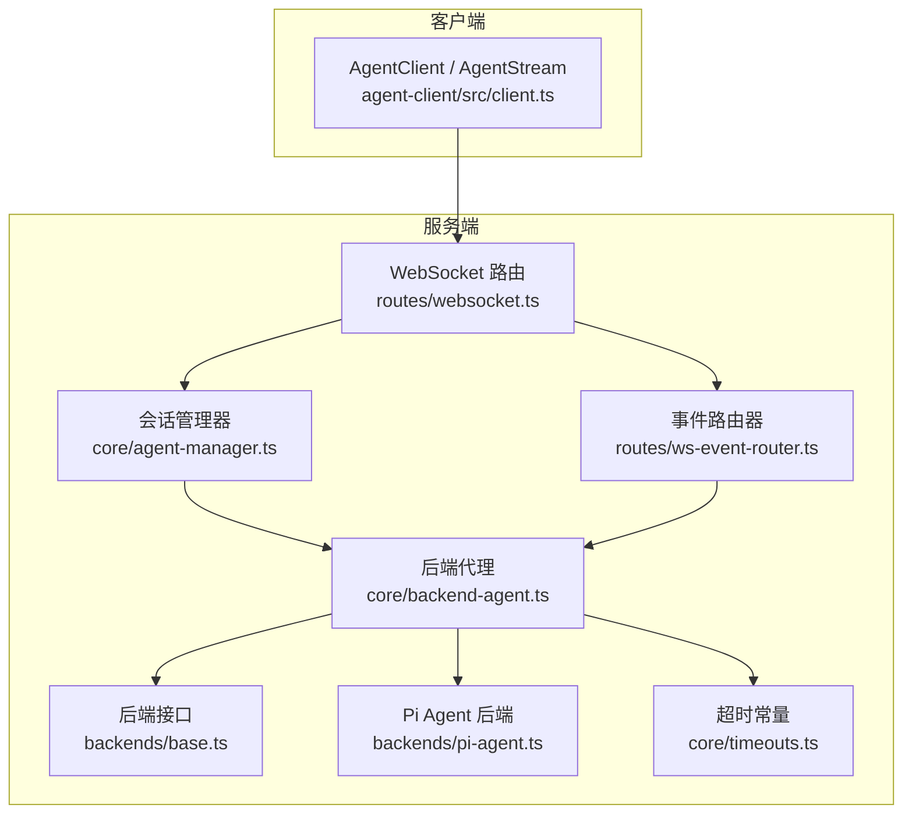
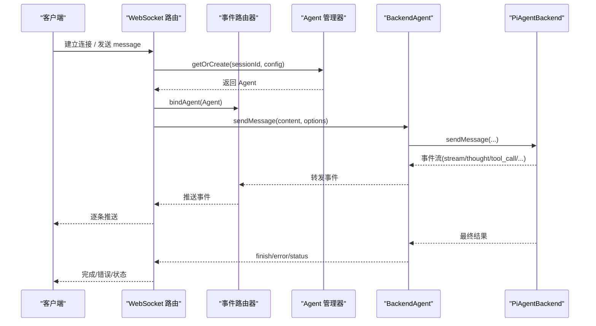
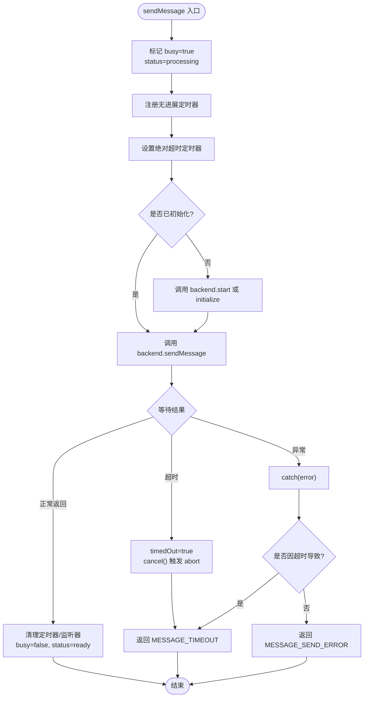
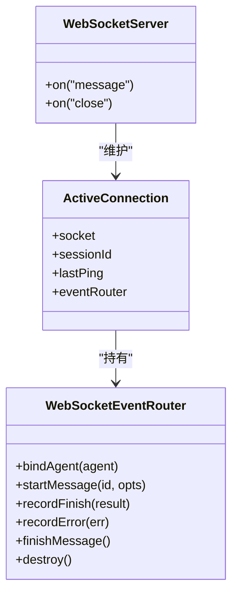
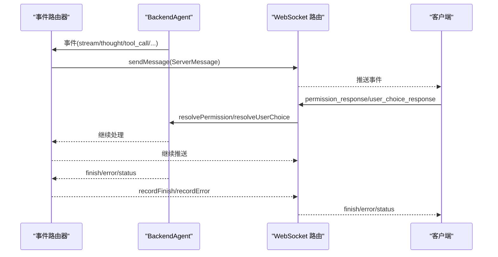
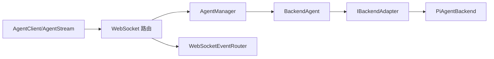

# 后端代理

<cite>
**本文引用的文件**   
- [packages/agent-service/src/core/backend-agent.ts](file://packages/agent-service/src/core/backend-agent.ts)
- [packages/agent-service/src/core/agent.ts](file://packages/agent-service/src/core/agent.ts)
- [packages/agent-service/src/core/agent-manager.ts](file://packages/agent-service/src/core/agent-manager.ts)
- [packages/agent-service/src/backends/base.ts](file://packages/agent-service/src/backends/base.ts)
- [packages/agent-service/src/backends/pi-agent.ts](file://packages/agent-service/src/backends/pi-agent.ts)
- [packages/agent-service/src/routes/websocket.ts](file://packages/agent-service/src/routes/websocket.ts)
- [packages/agent-service/src/routes/ws-event-router.ts](file://packages/agent-service/src/routes/ws-event-router.ts)
- [packages/agent-service/src/core/timeouts.ts](file://packages/agent-service/src/core/timeouts.ts)
- [packages/agent-client/src/client.ts](file://packages/agent-client/src/client.ts)
</cite>

## 目录
1. [简介](#简介)
2. [项目结构](#项目结构)
3. [核心组件](#核心组件)
4. [架构总览](#架构总览)
5. [详细组件分析](#详细组件分析)
6. [依赖关系分析](#依赖关系分析)
7. [性能与可扩展性](#性能与可扩展性)
8. [故障排查指南](#故障排查指南)
9. [结论](#结论)
10. [附录：扩展指南](#附录扩展指南)

## 简介
本技术文档聚焦于后端代理体系，围绕 BackendAgent 类的设计原理、进程间通信与子进程管理、WebSocket 连接建立与维护（心跳、重连）、消息路由与响应处理（含异步事件与超时控制）、进程监控与健康检查、错误传播与异常处理策略进行深入解析。同时提供面向扩展的实践指导，帮助读者在现有架构上接入新的通信协议或进程管理模式。

## 项目结构
后端代理相关代码主要分布在 agent-service 包中，客户端 SDK 位于 agent-client 包。关键路径如下：
- 核心抽象与实现：core/agent.ts、core/backend-agent.ts、core/agent-manager.ts、core/timeouts.ts
- 后端适配器与具体实现：backends/base.ts、backends/pi-agent.ts
- WebSocket 服务与事件路由：routes/websocket.ts、routes/ws-event-router.ts
- 客户端 SDK：agent-client/src/client.ts

图表来源
- [packages/agent-service/src/routes/websocket.ts:134-180](file://packages/agent-service/src/routes/websocket.ts#L134-L180)
- [packages/agent-service/src/routes/ws-event-router.ts:113-147](file://packages/agent-service/src/routes/ws-event-router.ts#L113-L147)
- [packages/agent-service/src/core/agent-manager.ts:44-125](file://packages/agent-service/src/core/agent-manager.ts#L44-L125)
- [packages/agent-service/src/core/backend-agent.ts:36-60](file://packages/agent-service/src/core/backend-agent.ts#L36-L60)
- [packages/agent-service/src/backends/base.ts:5-29](file://packages/agent-service/src/backends/base.ts#L5-L29)
- [packages/agent-service/src/backends/pi-agent.ts:112-152](file://packages/agent-service/src/backends/pi-agent.ts#L112-L152)
- [packages/agent-service/src/core/timeouts.ts:1-9](file://packages/agent-service/src/core/timeouts.ts#L1-L9)
- [packages/agent-client/src/client.ts:200-204](file://packages/agent-client/src/client.ts#L200-L204)

章节来源
- [packages/agent-service/src/routes/websocket.ts:134-180](file://packages/agent-service/src/routes/websocket.ts#L134-L180)
- [packages/agent-service/src/routes/ws-event-router.ts:113-147](file://packages/agent-service/src/routes/ws-event-router.ts#L113-L147)
- [packages/agent-service/src/core/agent-manager.ts:44-125](file://packages/agent-service/src/core/agent-manager.ts#L44-L125)
- [packages/agent-service/src/core/backend-agent.ts:36-60](file://packages/agent-service/src/core/backend-agent.ts#L36-L60)
- [packages/agent-service/src/backends/base.ts:5-29](file://packages/agent-service/src/backends/base.ts#L5-L29)
- [packages/agent-service/src/backends/pi-agent.ts:112-152](file://packages/agent-service/src/backends/pi-agent.ts#L112-L152)
- [packages/agent-service/src/core/timeouts.ts:1-9](file://packages/agent-service/src/core/timeouts.ts#L1-L9)
- [packages/agent-client/src/client.ts:200-204](file://packages/agent-client/src/client.ts#L200-L204)

## 核心组件
- BaseAgent：定义统一生命周期与事件模型，封装状态机、活动计时器与通用事件发射。
- BackendAgent：将底层 IBackendAdapter 适配为 Agent 行为，负责启动、发送消息、取消、超时控制、配置更新、权限与用户选择交互等。
- AgentManager：按 sessionId 维护 Agent 实例，支持懒创建、版本/模式变更重建、空闲清理、并发保护（忙闲态）。
- IBackendAdapter/PiAgentBackend：后端抽象与默认实现，封装模型调用、工具链、子 Agent、事件映射、资源清理等。
- WebSocket 路由与事件路由器：承载长连接、心跳检测、消息分发、事件转发、运行日志记录。
- 客户端 SDK：提供 HTTP 与 WebSocket 两种通道，内置重连与基础事件封装。

章节来源
- [packages/agent-service/src/core/agent.ts:22-112](file://packages/agent-service/src/core/agent.ts#L22-L112)
- [packages/agent-service/src/core/backend-agent.ts:36-60](file://packages/agent-service/src/core/backend-agent.ts#L36-L60)
- [packages/agent-service/src/core/agent-manager.ts:44-125](file://packages/agent-service/src/core/agent-manager.ts#L44-L125)
- [packages/agent-service/src/backends/base.ts:5-29](file://packages/agent-service/src/backends/base.ts#L5-L29)
- [packages/agent-service/src/backends/pi-agent.ts:112-152](file://packages/agent-service/src/backends/pi-agent.ts#L112-L152)
- [packages/agent-service/src/routes/websocket.ts:134-180](file://packages/agent-service/src/routes/websocket.ts#L134-L180)
- [packages/agent-service/src/routes/ws-event-router.ts:113-147](file://packages/agent-service/src/routes/ws-event-router.ts#L113-L147)
- [packages/agent-client/src/client.ts:200-204](file://packages/agent-client/src/client.ts#L200-L204)

## 架构总览
后端代理采用“会话级 Agent + 可插拔后端”的架构。上层通过 WebSocket 暴露实时流式能力，内部由事件路由器将后端事件透传到前端；AgentManager 负责会话生命周期与资源回收；BackendAgent 作为统一门面，屏蔽不同后端的差异；PiAgentBackend 是默认实现，基于 AgentHarness 驱动模型与工具生态，并支持子 Agent 执行。

图表来源
- [packages/agent-service/src/routes/websocket.ts:208-486](file://packages/agent-service/src/routes/websocket.ts#L208-L486)
- [packages/agent-service/src/routes/ws-event-router.ts:197-321](file://packages/agent-service/src/routes/ws-event-router.ts#L197-L321)
- [packages/agent-service/src/core/agent-manager.ts:165-184](file://packages/agent-service/src/core/agent-manager.ts#L165-L184)
- [packages/agent-service/src/core/backend-agent.ts:62-205](file://packages/agent-service/src/core/backend-agent.ts#L62-L205)
- [packages/agent-service/src/backends/pi-agent.ts:614-758](file://packages/agent-service/src/backends/pi-agent.ts#L614-L758)

## 详细组件分析

### BackendAgent 设计要点
- 初始化与启动：优先使用后端 start()，否则回退到 initialize()，确保幂等。
- 消息发送与超时：
  - 无进展超时：监听 stream/tool_call/tool_call_update 事件重置定时器，超过阈值触发 cancel。
  - 绝对超时：固定上限，无论是否有进展均触发 cancel。
  - 显式超时：由上层传入，结合 Promise.race 与 cancel 协同。
- 状态与忙闲：busy 标志与 status 同步，cancel 具备幂等守卫，避免重复取消。
- 配置热更新：支持 workingDir/model/demoId/backendProviders/externalAuth 等字段变更，必要时通知后端 updateConfig。
- 交互回调：resolvePermission/resolveUserChoice 透传至后端，支撑权限确认与需求选择。

图表来源
- [packages/agent-service/src/core/backend-agent.ts:62-205](file://packages/agent-service/src/core/backend-agent.ts#L62-L205)
- [packages/agent-service/src/core/timeouts.ts:1-9](file://packages/agent-service/src/core/timeouts.ts#L1-L9)

章节来源
- [packages/agent-service/src/core/backend-agent.ts:36-60](file://packages/agent-service/src/core/backend-agent.ts#L36-L60)
- [packages/agent-service/src/core/backend-agent.ts:62-205](file://packages/agent-service/src/core/backend-agent.ts#L62-L205)
- [packages/agent-service/src/core/timeouts.ts:1-9](file://packages/agent-service/src/core/timeouts.ts#L1-L9)

### WebSocket 连接建立与维护
- 连接建立：Fastify 注册 /api/agent/:sessionId/stream 的 WebSocket 端点，为每个连接分配 connectionId，绑定事件路由器。
- 心跳机制：周期性遍历 connections，若 lastPing 超过 HEARTBEAT_TIMEOUT 则主动关闭并清理。
- 消息路由：对 client 消息进行类型分发（message/resume/cancel/set_model/get_models/ping/permission_response/user_choice_response），并在需要时创建或恢复 Agent。
- 进度心跳：在处理期间定时推送 status=processing，保障前端感知活跃。
- 连接池：connections Map 以 connectionId 为键存储 ActiveConnection，包含 socket、sessionId、lastPing、eventRouter。

图表来源
- [packages/agent-service/src/routes/websocket.ts:134-180](file://packages/agent-service/src/routes/websocket.ts#L134-L180)
- [packages/agent-service/src/routes/websocket.ts:781-819](file://packages/agent-service/src/routes/websocket.ts#L781-L819)
- [packages/agent-service/src/routes/ws-event-router.ts:113-147](file://packages/agent-service/src/routes/ws-event-router.ts#L113-L147)

章节来源
- [packages/agent-service/src/routes/websocket.ts:134-180](file://packages/agent-service/src/routes/websocket.ts#L134-L180)
- [packages/agent-service/src/routes/websocket.ts:781-819](file://packages/agent-service/src/routes/websocket.ts#L781-L819)
- [packages/agent-service/src/routes/ws-event-router.ts:113-147](file://packages/agent-service/src/routes/ws-event-router.ts#L113-L147)

### 消息路由与响应处理
- 事件转发：WebSocketEventRouter 订阅 Agent 事件，按类型转换为 ServerMessage 并通过 sendMessage 下发。
- 请求-响应闭环：
  - 开始：startMessage 记录上下文，可选写入运行日志。
  - 进行中：stream/thought/tool_call/tool_call_update/plan/error/status/permission_request/user_choice_request 实时推送。
  - 结束：recordFinish 记录结果，finishMessage 清理状态。
- 取消与竞态：isCancelled 用于忽略后续事件；显式超时与 cancel 配合，保证不泄露资源。

图表来源
- [packages/agent-service/src/routes/ws-event-router.ts:197-321](file://packages/agent-service/src/routes/ws-event-router.ts#L197-L321)
- [packages/agent-service/src/routes/websocket.ts:723-797](file://packages/agent-service/src/routes/websocket.ts#L723-L797)

章节来源
- [packages/agent-service/src/routes/ws-event-router.ts:197-321](file://packages/agent-service/src/routes/ws-event-router.ts#L197-L321)
- [packages/agent-service/src/routes/websocket.ts:723-797](file://packages/agent-service/src/routes/websocket.ts#L723-L797)

### 进程监控与健康检查
- 空闲清理：AgentManager 定时扫描，根据 lastActivityAt 与 PROCESSING_MAX_TIMEOUT_MS 强制 kill 卡住的 Agent。
- 健康检查：IBackendAdapter 暴露 checkHealth()，可用于外部探针或运维面板。
- 心跳保活：WebSocket 层定期清理长时间无 ping 的连接，防止僵尸连接占用资源。

章节来源
- [packages/agent-service/src/core/agent-manager.ts:204-237](file://packages/agent-service/src/core/agent-manager.ts#L204-L237)
- [packages/agent-service/src/backends/base.ts:12](file://packages/agent-service/src/backends/base.ts#L12)
- [packages/agent-service/src/routes/websocket.ts:122-132](file://packages/agent-service/src/routes/websocket.ts#L122-L132)

### 错误传播与异常处理策略
- 超时错误：MESSAGE_TIMEOUT 明确标识，retryable=true，便于前端重试或降级。
- 发送错误：MESSAGE_SEND_ERROR 携带错误信息，附带调试元数据（如空响应摘要）。
- 运行时异常：catch 块统一记录日志并返回结构化错误；finally 确保清理定时器与监听器。
- 上游错误：PiAgentBackend 在 extractAssistantErrorMessage 失败时抛出异常，由上层捕获并转化为错误事件。

章节来源
- [packages/agent-service/src/core/backend-agent.ts:164-205](file://packages/agent-service/src/core/backend-agent.ts#L164-L205)
- [packages/agent-service/src/backends/pi-agent.ts:721-758](file://packages/agent-service/src/backends/pi-agent.ts#L721-L758)

### 子进程管理与子 Agent
- PiAgentBackend 支持子 Agent 执行：runSubagent 方法创建独立环境、会话与 Harness，限制工具集，采集文件变更，受超时与 AbortSignal 控制。
- 资源隔离：子 Agent 拥有独立的 env/session/harness，完成后统一清理，避免泄漏。
- 主从协作：主 Agent 通过工具钩子拦截权限校验与结果处理，子 Agent 的结果合并入主流程。

章节来源
- [packages/agent-service/src/backends/pi-agent.ts:429-612](file://packages/agent-service/src/backends/pi-agent.ts#L429-L612)

## 依赖关系分析
- BackendAgent 依赖 IBackendAdapter 抽象，默认实现为 PiAgentBackend。
- AgentManager 依赖 AgentFactory 创建具体 Agent，并对 BackendAgent 做忙闲态保护。
- WebSocket 路由依赖 AgentManager 获取/创建 Agent，依赖 WebSocketEventRouter 转发事件。
- 客户端 SDK 通过 HTTP 与 WebSocket 两种方式与服务端交互。

图表来源
- [packages/agent-service/src/backends/base.ts:5-29](file://packages/agent-service/src/backends/base.ts#L5-L29)
- [packages/agent-service/src/backends/pi-agent.ts:112-152](file://packages/agent-service/src/backends/pi-agent.ts#L112-L152)
- [packages/agent-service/src/core/backend-agent.ts:36-60](file://packages/agent-service/src/core/backend-agent.ts#L36-L60)
- [packages/agent-service/src/core/agent-manager.ts:44-125](file://packages/agent-service/src/core/agent-manager.ts#L44-L125)
- [packages/agent-service/src/routes/websocket.ts:134-180](file://packages/agent-service/src/routes/websocket.ts#L134-L180)
- [packages/agent-service/src/routes/ws-event-router.ts:113-147](file://packages/agent-service/src/routes/ws-event-router.ts#L113-L147)
- [packages/agent-client/src/client.ts:200-204](file://packages/agent-client/src/client.ts#L200-L204)

章节来源
- [packages/agent-service/src/backends/base.ts:5-29](file://packages/agent-service/src/backends/base.ts#L5-L29)
- [packages/agent-service/src/backends/pi-agent.ts:112-152](file://packages/agent-service/src/backends/pi-agent.ts#L112-L152)
- [packages/agent-service/src/core/backend-agent.ts:36-60](file://packages/agent-service/src/core/backend-agent.ts#L36-L60)
- [packages/agent-service/src/core/agent-manager.ts:44-125](file://packages/agent-service/src/core/agent-manager.ts#L44-L125)
- [packages/agent-service/src/routes/websocket.ts:134-180](file://packages/agent-service/src/routes/websocket.ts#L134-L180)
- [packages/agent-service/src/routes/ws-event-router.ts:113-147](file://packages/agent-service/src/routes/ws-event-router.ts#L113-L147)
- [packages/agent-client/src/client.ts:200-204](file://packages/agent-client/src/client.ts#L200-L204)

## 性能与可扩展性
- 事件驱动与低开销：后端事件经 EventMapper 映射后直接转发，减少中间层拷贝与序列化成本。
- 超时分层：无进展、绝对、显式三层超时组合，兼顾用户体验与系统稳定性。
- 资源回收：空闲清理与 processing 兜底超时，避免内存与句柄泄漏。
- 可扩展点：
  - 新增后端：实现 IBackendAdapter，注册到工厂或直接注入 BackendAgent。
  - 新协议接入：在 WebSocketEventRouter 中扩展 ServerMessage 类型与分发逻辑。
  - 子进程模式：参考 runSubagent 的隔离与清理策略，封装新的执行环境。

[本节为通用建议，无需源码引用]

## 故障排查指南
- 连接断开：检查心跳间隔与超时配置，确认客户端是否持续发送 ping。
- 消息未到达：查看事件路由器是否处于 isCancelled 状态，确认 startMessage/finishMessage 配对。
- 处理超时：核对 INACTIVITY_TIMEOUT_MS、ABSOLUTE_TIMEOUT_MS 与显式 timeout 参数，定位卡住环节。
- 权限/选择阻塞：确认 permission_response/user_choice_response 是否正确回传，以及 resolvePermission/resolveUserChoice 是否被调用。
- 资源泄漏：观察 AgentManager 的 cleanupIdleAgents 是否生效，确认 destroyAll/closeAllConnections 在退出时调用。

章节来源
- [packages/agent-service/src/routes/websocket.ts:122-132](file://packages/agent-service/src/routes/websocket.ts#L122-L132)
- [packages/agent-service/src/routes/ws-event-router.ts:163-173](file://packages/agent-service/src/routes/ws-event-router.ts#L163-L173)
- [packages/agent-service/src/core/timeouts.ts:1-9](file://packages/agent-service/src/core/timeouts.ts#L1-L9)
- [packages/agent-service/src/routes/websocket.ts:723-797](file://packages/agent-service/src/routes/websocket.ts#L723-L797)
- [packages/agent-service/src/core/agent-manager.ts:204-237](file://packages/agent-service/src/core/agent-manager.ts#L204-L237)

## 结论
BackendAgent 以简洁稳定的门面封装了复杂的事件流、超时控制与交互回调，配合 AgentManager 的会话治理与 WebSocket 路由的实时转发，形成高可用、可扩展的后端代理体系。通过 IBackendAdapter 抽象与 PiAgentBackend 默认实现，系统既保证了开箱即用，又为自定义后端与新协议接入提供了清晰扩展点。

[本节为总结，无需源码引用]

## 附录：扩展指南

### 接入新的后端实现
- 步骤
  - 实现 IBackendAdapter 接口，至少提供 initialize/sendMessage/onStream/destroy/checkHealth。
  - 在 BackendWithModelSupport 扩展处按需实现 setModel/getModelInfo/start 等可选能力。
  - 在 AgentFactory 中注册新后端类型，或在路由层直接注入。
- 关键点
  - onStream 必须将后端事件以 AgentEvent 形式回调给上层。
  - sendMessage 需遵循错误语义，返回字符串内容或抛错。
  - destroy 需释放所有资源，包括子进程/子 Agent。

章节来源
- [packages/agent-service/src/backends/base.ts:5-29](file://packages/agent-service/src/backends/base.ts#L5-L29)
- [packages/agent-service/src/core/backend-agent.ts:8-34](file://packages/agent-service/src/core/backend-agent.ts#L8-L34)

### 新增 WebSocket 消息类型
- 步骤
  - 在 ServerMessage 联合类型中添加新 type 字段。
  - 在 handleEvent 分支中增加对应转发逻辑。
  - 在 websocket.ts 的客户端消息 switch 中增加解析与处理分支。
- 关键点
  - 保持幂等与健壮性，对无效参数返回 INVALID_PARAMS。
  - 注意与事件路由器的 activeMessage 生命周期对齐。

章节来源
- [packages/agent-service/src/routes/ws-event-router.ts:22-104](file://packages/agent-service/src/routes/ws-event-router.ts#L22-L104)
- [packages/agent-service/src/routes/ws-event-router.ts:197-321](file://packages/agent-service/src/routes/ws-event-router.ts#L197-L321)
- [packages/agent-service/src/routes/websocket.ts:208-486](file://packages/agent-service/src/routes/websocket.ts#L208-L486)

### 引入新的进程管理模式
- 思路
  - 参考 PiAgentBackend.runSubagent 的隔离策略：独立 env/session/harness、AbortController 与超时控制。
  - 在工具钩子中复用 PermissionManager/UserInteractionManager 的能力。
  - 在 finally 中确保清理所有句柄与环境。
- 关键点
  - 子进程结果需合并到主流程的文件变更与统计。
  - 对外暴露统一的错误语义与调试信息。

章节来源
- [packages/agent-service/src/backends/pi-agent.ts:429-612](file://packages/agent-service/src/backends/pi-agent.ts#L429-L612)