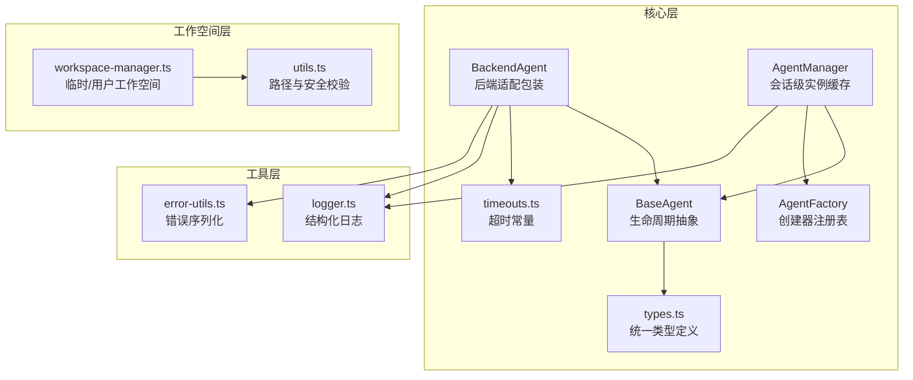
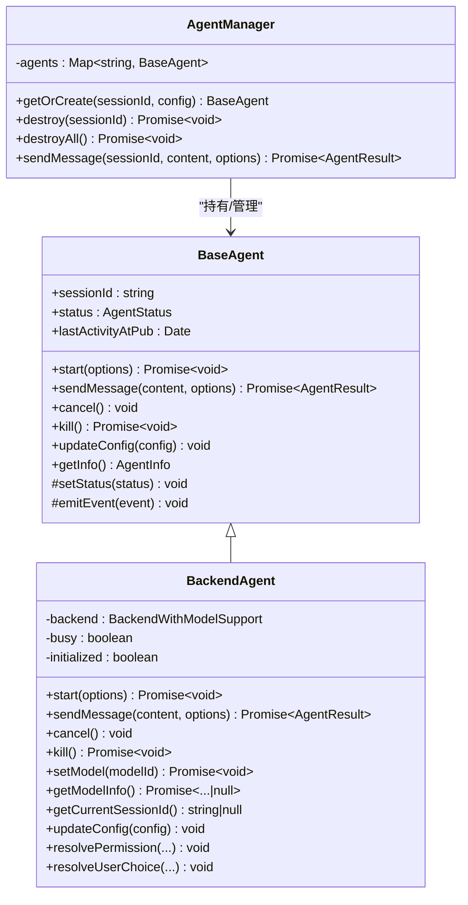
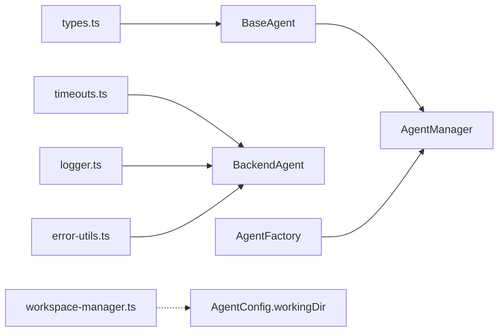
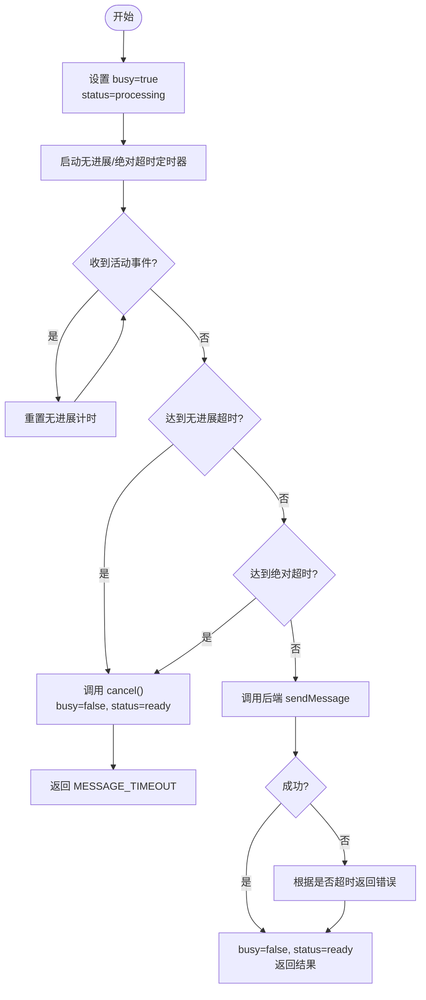

# 基础代理类

<cite>
**本文引用的文件**
- [packages/agent-service/src/core/agent.ts](file://packages/agent-service/src/core/agent.ts)
- [packages/agent-service/src/core/backend-agent.ts](file://packages/agent-service/src/core/backend-agent.ts)
- [packages/agent-service/src/core/types.ts](file://packages/agent-service/src/core/types.ts)
- [packages/agent-service/src/core/timeouts.ts](file://packages/agent-service/src/core/timeouts.ts)
- [packages/agent-service/src/utils/logger.ts](file://packages/agent-service/src/utils/logger.ts)
- [packages/agent-service/src/utils/error-utils.ts](file://packages/agent-service/src/utils/error-utils.ts)
- [packages/agent-service/src/workspace/workspace-manager.ts](file://packages/agent-service/src/workspace/workspace-manager.ts)
- [packages/agent-service/src/workspace/utils.ts](file://packages/agent-service/src/workspace/utils.ts)
- [packages/agent-service/src/core/agent-manager.ts](file://packages/agent-service/src/core/agent-manager.ts)
- [packages/agent-service/tests/unit/agent-manager.test.ts](file://packages/agent-service/tests/unit/agent-manager.test.ts)
- [packages/agent-service/tests/unit/backend-agent-inactivity-timeout.test.ts](file://packages/agent-service/tests/unit/backend-agent-inactivity-timeout.test.ts)
</cite>

## 目录
1. [简介](#简介)
2. [项目结构](#项目结构)
3. [核心组件](#核心组件)
4. [架构总览](#架构总览)
5. [详细组件分析](#详细组件分析)
6. [依赖关系分析](#依赖关系分析)
7. [性能与超时策略](#性能与超时策略)
8. [工作目录隔离与资源管理](#工作目录隔离与资源管理)
9. [日志与错误处理](#日志与错误处理)
10. [自定义代理实现指南](#自定义代理实现指南)
11. [故障排查](#故障排查)
12. [结论](#结论)

## 简介
本技术文档聚焦于基础代理类 BaseAgent 的设计模式、核心接口定义以及生命周期方法（start、kill、sendMessage）的实现规范。同时，系统阐述代理状态管理机制（初始化、处理中、空闲）、工作目录隔离与资源管理策略、统一的日志记录与错误处理机制，并提供基于 BaseAgent 的自定义代理实现示例路径，帮助读者快速集成特定 AI 模型或后端适配器。

## 项目结构
围绕 Agent 服务核心模块，关键代码位于 packages/agent-service/src/core 下，包含抽象基类、具体后端包装、类型定义、工厂与管理器；配套工具在 utils 与 workspace 目录下。



图表来源
- [packages/agent-service/src/core/agent.ts:22-112](file://packages/agent-service/src/core/agent.ts#L22-L112)
- [packages/agent-service/src/core/backend-agent.ts:36-287](file://packages/agent-service/src/core/backend-agent.ts#L36-L287)
- [packages/agent-service/src/core/types.ts:17-35](file://packages/agent-service/src/core/types.ts#L17-L35)
- [packages/agent-service/src/core/timeouts.ts:1-9](file://packages/agent-service/src/core/timeouts.ts#L1-L9)
- [packages/agent-service/src/utils/logger.ts:14-41](file://packages/agent-service/src/utils/logger.ts#L14-L41)
- [packages/agent-service/src/utils/error-utils.ts:62-133](file://packages/agent-service/src/utils/error-utils.ts#L62-L133)
- [packages/agent-service/src/workspace/workspace-manager.ts:84-143](file://packages/agent-service/src/workspace/workspace-manager.ts#L84-L143)
- [packages/agent-service/src/workspace/utils.ts:1-48](file://packages/agent-service/src/workspace/utils.ts#L1-L48)

章节来源
- [packages/agent-service/src/core/agent.ts:22-112](file://packages/agent-service/src/core/agent.ts#L22-L112)
- [packages/agent-service/src/core/backend-agent.ts:36-287](file://packages/agent-service/src/core/backend-agent.ts#L36-L287)
- [packages/agent-service/src/core/types.ts:17-35](file://packages/agent-service/src/core/types.ts#L17-L35)
- [packages/agent-service/src/core/timeouts.ts:1-9](file://packages/agent-service/src/core/timeouts.ts#L1-L9)
- [packages/agent-service/src/utils/logger.ts:14-41](file://packages/agent-service/src/utils/logger.ts#L14-L41)
- [packages/agent-service/src/utils/error-utils.ts:62-133](file://packages/agent-service/src/utils/error-utils.ts#L62-L133)
- [packages/agent-service/src/workspace/workspace-manager.ts:84-143](file://packages/agent-service/src/workspace/workspace-manager.ts#L84-L143)
- [packages/agent-service/src/workspace/utils.ts:1-48](file://packages/agent-service/src/workspace/utils.ts#L1-L48)

## 核心组件
- BaseAgent：提供事件驱动的生命周期抽象，维护会话标识、状态、活动时间和消息计数，并暴露标准接口 start、sendMessage、cancel、kill、updateConfig 等。
- BackendAgent：对 IBackendAdapter 进行包装，实现 BaseAgent 的语义化行为，包括启动、发送消息、取消、销毁、模型切换、配置更新、权限与用户选择回调等。
- types.ts：集中定义 AgentStatus、ErrorCode、AgentConfig、AgentResult、各类事件与结果元数据等类型契约。
- timeouts.ts：集中定义无进展超时、绝对超时与 processing 兜底超时常量，支持环境变量覆盖。
- logger.ts / error-utils.ts：提供结构化日志与安全的错误序列化能力，避免敏感信息泄露。
- workspace-manager.ts / utils.ts：负责工作空间的创建、清理、临时目录判定与路径规范化，保障工作目录隔离。

章节来源
- [packages/agent-service/src/core/agent.ts:22-112](file://packages/agent-service/src/core/agent.ts#L22-L112)
- [packages/agent-service/src/core/backend-agent.ts:36-287](file://packages/agent-service/src/core/backend-agent.ts#L36-L287)
- [packages/agent-service/src/core/types.ts:17-35](file://packages/agent-service/src/core/types.ts#L17-L35)
- [packages/agent-service/src/core/timeouts.ts:1-9](file://packages/agent-service/src/core/timeouts.ts#L1-L9)
- [packages/agent-service/src/utils/logger.ts:14-41](file://packages/agent-service/src/utils/logger.ts#L14-L41)
- [packages/agent-service/src/utils/error-utils.ts:62-133](file://packages/agent-service/src/utils/error-utils.ts#L62-L133)
- [packages/agent-service/src/workspace/workspace-manager.ts:84-143](file://packages/agent-service/src/workspace/workspace-manager.ts#L84-L143)
- [packages/agent-service/src/workspace/utils.ts:1-48](file://packages/agent-service/src/workspace/utils.ts#L1-L48)

## 架构总览
BaseAgent 作为抽象基类，定义了所有代理必须遵循的生命周期与事件契约；BackendAgent 在其之上封装后端适配器，补齐业务细节（如超时保护、忙闲状态、模型切换、配置热更新）。AgentManager 以 sessionId 为键缓存 Agent 实例，并在需要时自动触发 start。



图表来源
- [packages/agent-service/src/core/agent.ts:22-112](file://packages/agent-service/src/core/agent.ts#L22-L112)
- [packages/agent-service/src/core/backend-agent.ts:36-287](file://packages/agent-service/src/core/backend-agent.ts#L36-L287)
- [packages/agent-service/src/core/agent-manager.ts:44-198](file://packages/agent-service/src/core/agent-manager.ts#L44-L198)

## 详细组件分析

### BaseAgent 抽象类
- 设计要点
  - 继承 EventEmitter，提供强类型事件 on/off 与 emitEvent 辅助方法。
  - 维护 _status、createdAt、lastActivityAt、messageCount 等元信息，并通过 setStatus 统一变更状态与更新时间戳，同时广播 status 事件。
  - 抽象接口强制子类实现 start、sendMessage、cancel、kill、updateConfig，保证生命周期一致性。
  - getInfo 输出对外可见的摘要信息，便于监控与诊断。
- 状态机
  - 初始状态 initializing，进入 ready 后接受消息；处理中为 processing；异常为 error；销毁为 destroyed。
- 事件体系
  - stream、thought、tool_call、tool_call_update、plan、error、finish、status、permission_request、user_choice_request、config_updated 等。

章节来源
- [packages/agent-service/src/core/agent.ts:22-112](file://packages/agent-service/src/core/agent.ts#L22-L112)
- [packages/agent-service/src/core/types.ts:167-325](file://packages/agent-service/src/core/types.ts#L167-L325)

### BackendAgent 实现
- 启动与初始化
  - start 优先调用后端 start（若存在），否则回退到 initialize，完成后置 ready。
- 发送消息流程
  - 设置 busy=true、messageCount++、status=processing。
  - 启动“无进展超时”和“绝对超时”定时器；监听 stream/tool_call/tool_call_update 重置无进展计时。
  - 调用后端 sendMessage，成功后返回内容、文件变更与空响应调试信息；失败则根据是否超时返回不同错误码。
  - finally 中清理定时器与事件监听器，确保资源释放。
- 取消与销毁
  - cancel 调用后端 cancelPrompt（若支持），并将 busy=false、status=ready。
  - kill 调用后端 destroy，重置 initialized=false，status=destroyed。
- 模型与配置
  - setModel/getModelInfo 透传后端能力；updateConfig 检测 workingDir/model/demoId/backendProviders/externalAuth 变化，必要时通知后端并广播 config_updated。
- 权限与用户选择
  - resolvePermission/resolveUserChoice 将前端决策转发至后端。

```mermaid
sequenceDiagram
participant Client as "调用方"
participant Manager as "AgentManager"
participant Agent as "BackendAgent"
participant Backend as "IBackendAdapter"
Client->>Manager : "sendMessage(sessionId, content, options)"
Manager->>Manager : "检查是否存在/版本差异"
alt "未初始化"
Manager->>Agent : "start()"
Agent->>Backend : "start()/initialize()"
Agent-->>Manager : "ready"
end
Manager->>Agent : "sendMessage(content, options)"
Agent->>Agent : "busy=true; status=processing"
Agent->>Agent : "启动无进展/绝对超时定时器"
Agent->>Backend : "sendMessage(...)"
Backend-->>Agent : "结果/流式事件"
Agent->>Agent : "busy=false; status=ready"
Agent-->>Manager : "AgentResult"
Manager-->>Client : "返回结果"
```

图表来源
- [packages/agent-service/src/core/agent-manager.ts:165-184](file://packages/agent-service/src/core/agent-manager.ts#L165-L184)
- [packages/agent-service/src/core/backend-agent.ts:50-160](file://packages/agent-service/src/core/backend-agent.ts#L50-L160)

章节来源
- [packages/agent-service/src/core/backend-agent.ts:36-287](file://packages/agent-service/src/core/backend-agent.ts#L36-L287)
- [packages/agent-service/src/core/agent-manager.ts:165-184](file://packages/agent-service/src/core/agent-manager.ts#L165-L184)

### 类型与事件契约
- AgentStatus：initializing、ready、processing、error、destroyed。
- ErrorCode：涵盖参数无效、会话不存在、后端不可用、消息发送错误、超时、权限拒绝、限流、内部错误等。
- AgentConfig：包含 sessionId、workingDir、model、toolVersion、permissions、backendProviders、外部认证、Pi Agent 专属配置等。
- AgentResult：统一承载 success/content/files/error/metadata。
- 事件：stream/thought/tool_call/tool_call_update/plan/error/finish/status/permission_request/user_choice_request/config_updated。

章节来源
- [packages/agent-service/src/core/types.ts:17-35](file://packages/agent-service/src/core/types.ts#L17-L35)
- [packages/agent-service/src/core/types.ts:40-161](file://packages/agent-service/src/core/types.ts#L40-L161)
- [packages/agent-service/src/core/types.ts:167-325](file://packages/agent-service/src/core/types.ts#L167-L325)

## 依赖关系分析
- BaseAgent 依赖 types.ts 中的全部类型与事件定义。
- BackendAgent 依赖 BaseAgent、后端适配器接口、日志与错误工具、超时常量。
- AgentManager 依赖 BaseAgent、AgentFactory、日志，负责实例缓存与生命周期编排。
- Workspace 相关模块独立于 Core，通过 AgentConfig.workingDir 间接关联。



图表来源
- [packages/agent-service/src/core/types.ts:17-35](file://packages/agent-service/src/core/types.ts#L17-L35)
- [packages/agent-service/src/core/timeouts.ts:1-9](file://packages/agent-service/src/core/timeouts.ts#L1-L9)
- [packages/agent-service/src/utils/logger.ts:14-41](file://packages/agent-service/src/utils/logger.ts#L14-L41)
- [packages/agent-service/src/utils/error-utils.ts:62-133](file://packages/agent-service/src/utils/error-utils.ts#L62-L133)
- [packages/agent-service/src/core/agent.ts:22-112](file://packages/agent-service/src/core/agent.ts#L22-L112)
- [packages/agent-service/src/core/backend-agent.ts:36-287](file://packages/agent-service/src/core/backend-agent.ts#L36-L287)
- [packages/agent-service/src/core/agent-manager.ts:44-198](file://packages/agent-service/src/core/agent-manager.ts#L44-L198)
- [packages/agent-service/src/workspace/workspace-manager.ts:84-143](file://packages/agent-service/src/workspace/workspace-manager.ts#L84-L143)

章节来源
- [packages/agent-service/src/core/agent.ts:22-112](file://packages/agent-service/src/core/agent.ts#L22-L112)
- [packages/agent-service/src/core/backend-agent.ts:36-287](file://packages/agent-service/src/core/backend-agent.ts#L36-L287)
- [packages/agent-service/src/core/agent-manager.ts:44-198](file://packages/agent-service/src/core/agent-manager.ts#L44-L198)
- [packages/agent-service/src/workspace/workspace-manager.ts:84-143](file://packages/agent-service/src/workspace/workspace-manager.ts#L84-L143)

## 性能与超时策略
- 无进展超时：当连续 N 毫秒未收到 stream/tool_call/tool_call_update 事件，自动触发 cancel，防止卡死。
- 绝对超时：无论是否有进展，超过上限一律 abort，避免长时间占用资源。
- processing 兜底超时：AgentManager 定期扫描处于 processing 状态的 Agent，超过阈值则强制 kill，防止僵尸进程。
- 可配置性：上述超时均支持环境变量覆盖，便于按部署环境调优。



图表来源
- [packages/agent-service/src/core/backend-agent.ts:62-160](file://packages/agent-service/src/core/backend-agent.ts#L62-L160)
- [packages/agent-service/src/core/timeouts.ts:1-9](file://packages/agent-service/src/core/timeouts.ts#L1-L9)
- [packages/agent-service/src/core/agent-manager.ts:54-77](file://packages/agent-service/src/core/agent-manager.ts#L54-L77)

章节来源
- [packages/agent-service/src/core/backend-agent.ts:62-160](file://packages/agent-service/src/core/backend-agent.ts#L62-L160)
- [packages/agent-service/src/core/timeouts.ts:1-9](file://packages/agent-service/src/core/timeouts.ts#L1-L9)
- [packages/agent-service/src/core/agent-manager.ts:54-77](file://packages/agent-service/src/core/agent-manager.ts#L54-L77)
- [packages/agent-service/tests/unit/backend-agent-inactivity-timeout.test.ts:55-81](file://packages/agent-service/tests/unit/backend-agent-inactivity-timeout.test.ts#L55-L81)

## 工作目录隔离与资源管理
- 工作目录来源
  - AgentConfig.workingDir 指定工作目录；未指定时由 WorkspaceManager 创建临时目录。
- 临时工作空间
  - 通过 isTemporaryWorkspace 判断是否在临时基目录下；cleanup/cleanupAllTempWorkspaces 负责递归删除。
- 路径安全
  - normalizeWorkspacePath 规范化路径；getDisplayName 提取友好名称；getLastDirectoryName 获取末级目录名。
- 资源回收
  - Agent.kill 调用后端 destroy，并置 destroyed；AgentManager.destroyAll 并发销毁所有实例并清空缓存。

章节来源
- [packages/agent-service/src/workspace/workspace-manager.ts:84-143](file://packages/agent-service/src/workspace/workspace-manager.ts#L84-L143)
- [packages/agent-service/src/workspace/utils.ts:1-48](file://packages/agent-service/src/workspace/utils.ts#L1-L48)
- [packages/agent-service/src/core/backend-agent.ts:168-173](file://packages/agent-service/src/core/backend-agent.ts#L168-L173)
- [packages/agent-service/src/core/agent-manager.ts:155-163](file://packages/agent-service/src/core/agent-manager.ts#L155-L163)

## 日志与错误处理
- 日志
  - 使用 pino 创建全局 logger，支持 level 与 pretty 传输；在关键路径（如 workingDir 变更、模型切换、错误）记录结构化日志。
- 错误处理
  - getErrorMessage 从多种对象形态中提取可读消息；serializeErrorForLog 仅拷贝白名单字段并截断超长字符串，避免泄露敏感信息。
- 统一错误码
  - 通过 ErrorCode 枚举统一返回错误分类，上层可按 retryable 决定是否重试。

章节来源
- [packages/agent-service/src/utils/logger.ts:14-41](file://packages/agent-service/src/utils/logger.ts#L14-L41)
- [packages/agent-service/src/utils/error-utils.ts:62-133](file://packages/agent-service/src/utils/error-utils.ts#L62-L133)
- [packages/agent-service/src/core/types.ts:24-34](file://packages/agent-service/src/core/types.ts#L24-L34)

## 自定义代理实现指南
以下给出一个最小化的自定义代理实现步骤与参考路径，展示如何继承 BaseAgent 并对接特定 AI 模型或后端：

- 步骤概览
  - 新建自定义代理类，继承 BaseAgent。
  - 实现必需抽象方法：start、sendMessage、cancel、kill、updateConfig。
  - 在 sendMessage 中遵循 BaseAgent 的状态与事件约定：设置 busy/processing、发射必要事件、最终返回 AgentResult。
  - 如需模型切换/配置热更新，实现 setModel/getModelInfo/updateConfig 等可选能力。
  - 使用 AgentManager.getOrCreate 获取或创建实例，并通过 sendMessage 发起请求。

- 参考实现路径
  - 基类与事件契约：[packages/agent-service/src/core/agent.ts:22-112](file://packages/agent-service/src/core/agent.ts#L22-L112)、[packages/agent-service/src/core/types.ts:167-325](file://packages/agent-service/src/core/types.ts#L167-L325)
  - 参考后端包装实现：[packages/agent-service/src/core/backend-agent.ts:36-287](file://packages/agent-service/src/core/backend-agent.ts#L36-L287)
  - 单元测试中的 FakeAgent 示例（演示最小实现）：[packages/agent-service/tests/unit/agent-manager.test.ts:6-33](file://packages/agent-service/tests/unit/agent-manager.test.ts#L6-L33)
  - 管理器调用入口（含自动 start）：[packages/agent-service/src/core/agent-manager.ts:165-184](file://packages/agent-service/src/core/agent-manager.ts#L165-L184)

- 最佳实践
  - 严格遵循状态转换：initializing → ready → processing → ready/error/destroyed。
  - 在 sendMessage 中使用 try/finally 确保定时器和监听器清理。
  - 通过 emitEvent 广播事件，保持与 WebSocket 路由层的兼容性。
  - 利用 updateConfig 实现运行时配置热更新，并广播 config_updated。

章节来源
- [packages/agent-service/src/core/agent.ts:22-112](file://packages/agent-service/src/core/agent.ts#L22-L112)
- [packages/agent-service/src/core/backend-agent.ts:36-287](file://packages/agent-service/src/core/backend-agent.ts#L36-L287)
- [packages/agent-service/tests/unit/agent-manager.test.ts:6-33](file://packages/agent-service/tests/unit/agent-manager.test.ts#L6-L33)
- [packages/agent-service/src/core/agent-manager.ts:165-184](file://packages/agent-service/src/core/agent-manager.ts#L165-L184)

## 故障排查
- 常见问题
  - 消息无进展导致超时：检查后端是否正确持续发出 stream/tool_call/tool_call_update 事件；确认 INACTIVITY_TIMEOUT_MS 配置。
  - 处理中卡死：AgentManager 的 processing 兜底超时会在一定时间后 kill 该实例，观察日志定位阻塞点。
  - 工作目录权限问题：确认 workingDir 指向合法路径，且非受保护的 live 工作区；必要时使用 WorkspaceManager 创建临时目录。
  - 错误信息过长：错误序列化已做截断与白名单过滤，可在日志中查看 truncated 标记。
- 定位建议
  - 关注 status 事件与 lastActivityAt 变化，结合日志中的 workingDir、model、toolVersion 等信息。
  - 对于超时场景，区分 MESSAGE_TIMEOUT 与 MESSAGE_SEND_ERROR，前者通常可通过重试或换模型缓解。

章节来源
- [packages/agent-service/src/core/backend-agent.ts:62-160](file://packages/agent-service/src/core/backend-agent.ts#L62-L160)
- [packages/agent-service/src/core/agent-manager.ts:54-77](file://packages/agent-service/src/core/agent-manager.ts#L54-L77)
- [packages/agent-service/src/workspace/workspace-manager.ts:84-143](file://packages/agent-service/src/workspace/workspace-manager.ts#L84-L143)
- [packages/agent-service/src/utils/error-utils.ts:62-133](file://packages/agent-service/src/utils/error-utils.ts#L62-L133)

## 结论
BaseAgent 提供了稳定、可扩展的代理抽象与事件契约，配合 BackendAgent 的后端适配与超时保护，形成了高内聚、低耦合的 Agent 运行框架。通过 AgentManager 的会话级管理与工作空间隔离，系统在可靠性、可观测性与安全性方面具备良好基础。开发者可基于此快速集成新的 AI 模型或后端，同时复用统一的日志、错误与资源管理能力。