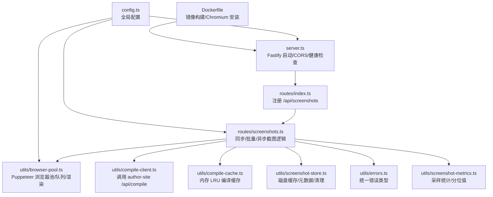
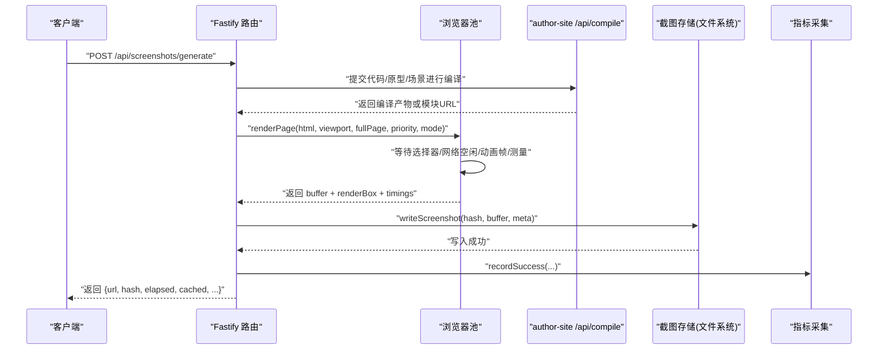
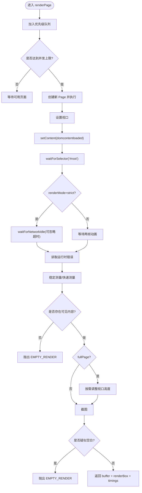
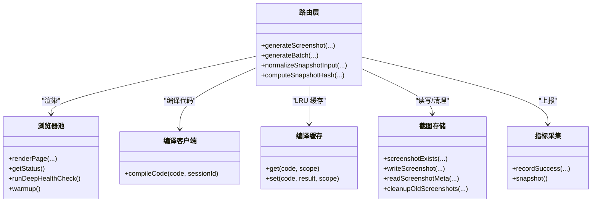
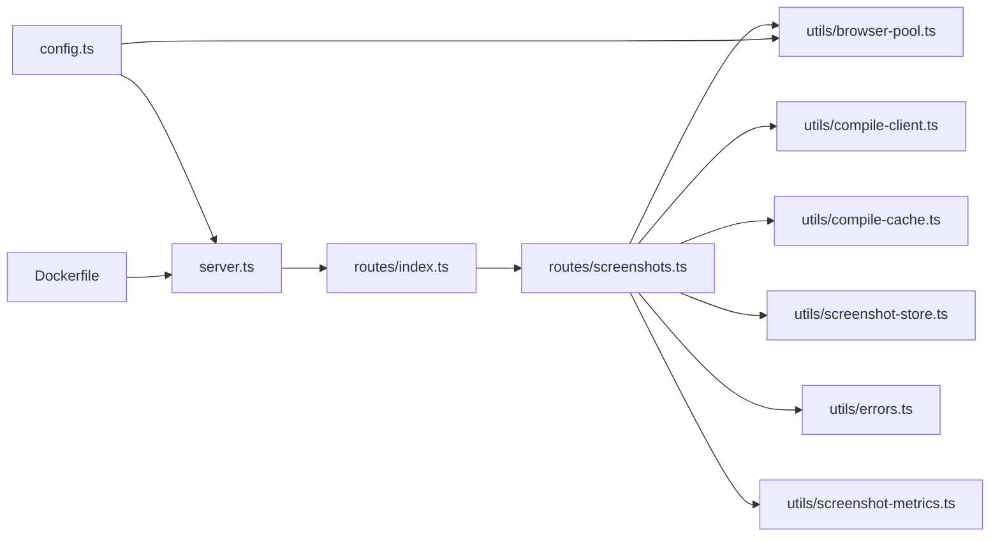

# 截图服务

<cite>
**本文引用的文件**   
- [packages/screenshot-service/src/server.ts](file://packages/screenshot-service/src/server.ts)
- [packages/screenshot-service/src/config.ts](file://packages/screenshot-service/src/config.ts)
- [packages/screenshot-service/src/routes/index.ts](file://packages/screenshot-service/src/routes/index.ts)
- [packages/screenshot-service/src/routes/screenshots.ts](file://packages/screenshot-service/src/routes/screenshots.ts)
- [packages/screenshot-service/src/utils/browser-pool.ts](file://packages/screenshot-service/src/utils/browser-pool.ts)
- [packages/screenshot-service/src/utils/compile-client.ts](file://packages/screenshot-service/src/utils/compile-client.ts)
- [packages/screenshot-service/src/utils/compile-cache.ts](file://packages/screenshot-service/src/utils/compile-cache.ts)
- [packages/screenshot-service/src/utils/screenshot-store.ts](file://packages/screenshot-service/src/utils/screenshot-store.ts)
- [packages/screenshot-service/src/utils/errors.ts](file://packages/screenshot-service/src/utils/errors.ts)
- [packages/screenshot-service/src/utils/screenshot-metrics.ts](file://packages/screenshot-service/src/utils/screenshot-metrics.ts)
- [docker/screenshot-service/Dockerfile](file://docker/screenshot-service/Dockerfile)
</cite>

## 目录
1. [简介](#简介)
2. [项目结构](#项目结构)
3. [核心组件](#核心组件)
4. [架构总览](#架构总览)
5. [详细组件分析](#详细组件分析)
6. [依赖关系分析](#依赖关系分析)
7. [性能与调优](#性能与调优)
8. [API 接口规范](#api-接口规范)
9. [配置选项](#配置选项)
10. [监控指标](#监控指标)
11. [使用示例](#使用示例)
12. [故障排除指南](#故障排除指南)
13. [结论](#结论)

## 简介
本技术文档面向基于 Puppeteer 的浏览器自动化截图服务，覆盖页面渲染、视口控制、异步任务处理、任务队列、缓存策略（内存与持久化）、API 接口规范、配置与性能调优、监控指标以及实际使用与排障。该服务通过 Fastify 暴露 HTTP API，调用 author-site 编译接口生成预览 HTML，再利用 puppeteer-core 驱动 Chromium 进行渲染与截图，并将结果落盘为带哈希的文件，同时维护元数据与历史版本。

## 项目结构
截图服务位于 packages/screenshot-service，采用分层组织：入口与服务注册、路由层、工具层（浏览器池、编译客户端、缓存、存储、错误与指标）。Docker 构建脚本将产物打包并安装运行时依赖。

图示来源
- [packages/screenshot-service/src/server.ts:1-110](file://packages/screenshot-service/src/server.ts#L1-L110)
- [packages/screenshot-service/src/routes/index.ts:1-7](file://packages/screenshot-service/src/routes/index.ts#L1-L7)
- [packages/screenshot-service/src/routes/screenshots.ts:1-800](file://packages/screenshot-service/src/routes/screenshots.ts#L1-L800)
- [packages/screenshot-service/src/utils/browser-pool.ts:1-800](file://packages/screenshot-service/src/utils/browser-pool.ts#L1-L800)
- [packages/screenshot-service/src/utils/compile-client.ts:1-78](file://packages/screenshot-service/src/utils/compile-client.ts#L1-L78)
- [packages/screenshot-service/src/utils/compile-cache.ts:1-70](file://packages/screenshot-service/src/utils/compile-cache.ts#L1-L70)
- [packages/screenshot-service/src/utils/screenshot-store.ts:1-328](file://packages/screenshot-service/src/utils/screenshot-store.ts#L1-L328)
- [packages/screenshot-service/src/utils/errors.ts:1-39](file://packages/screenshot-service/src/utils/errors.ts#L1-L39)
- [packages/screenshot-service/src/utils/screenshot-metrics.ts:1-159](file://packages/screenshot-service/src/utils/screenshot-metrics.ts#L1-L159)
- [docker/screenshot-service/Dockerfile:1-56](file://docker/screenshot-service/Dockerfile#L1-L56)

章节来源
- [packages/screenshot-service/src/server.ts:1-110](file://packages/screenshot-service/src/server.ts#L1-L110)
- [packages/screenshot-service/src/config.ts:1-52](file://packages/screenshot-service/src/config.ts#L1-L52)
- [docker/screenshot-service/Dockerfile:1-56](file://docker/screenshot-service/Dockerfile#L1-L56)

## 核心组件
- 服务入口与健康检查：初始化 Fastify、CORS、注册路由、提供 /health 深度健康检查与预热能力。
- 路由层：实现单页与批量截图、优先级调度、并发控制、去重与缓存命中、失败重试与状态轮询。
- 浏览器池：管理 Chromium 生命周期、任务队列、并发上限、渲染阶段计时、空内容检测与超时控制。
- 编译客户端：向 author-site 发起代码编译请求，返回可嵌入的 HTML 片段或模块 URL。
- 编译缓存：进程内 LRU 缓存，按会话作用域隔离，减少重复编译开销。
- 截图存储：基于哈希的文件命名、变体支持（strict/fast）、元数据与历史版本管理、旧文件清理。
- 错误体系：统一错误码与消息提取，便于上层分类与重试策略。
- 指标采集：窗口滑动采样、分位值统计、按优先级/尺寸/变体聚合。

章节来源
- [packages/screenshot-service/src/server.ts:1-110](file://packages/screenshot-service/src/server.ts#L1-L110)
- [packages/screenshot-service/src/routes/screenshots.ts:1-800](file://packages/screenshot-service/src/routes/screenshots.ts#L1-L800)
- [packages/screenshot-service/src/utils/browser-pool.ts:1-800](file://packages/screenshot-service/src/utils/browser-pool.ts#L1-L800)
- [packages/screenshot-service/src/utils/compile-client.ts:1-78](file://packages/screenshot-service/src/utils/compile-client.ts#L1-L78)
- [packages/screenshot-service/src/utils/compile-cache.ts:1-70](file://packages/screenshot-service/src/utils/compile-cache.ts#L1-L70)
- [packages/screenshot-service/src/utils/screenshot-store.ts:1-328](file://packages/screenshot-service/src/utils/screenshot-store.ts#L1-L328)
- [packages/screenshot-service/src/utils/errors.ts:1-39](file://packages/screenshot-service/src/utils/errors.ts#L1-L39)
- [packages/screenshot-service/src/utils/screenshot-metrics.ts:1-159](file://packages/screenshot-service/src/utils/screenshot-metrics.ts#L1-L159)

## 架构总览
下图展示从请求到截图落盘的端到端流程，包括编译、渲染、缓存与持久化。

图示来源
- [packages/screenshot-service/src/routes/screenshots.ts:576-800](file://packages/screenshot-service/src/routes/screenshots.ts#L576-L800)
- [packages/screenshot-service/src/utils/browser-pool.ts:315-507](file://packages/screenshot-service/src/utils/browser-pool.ts#L315-L507)
- [packages/screenshot-service/src/utils/compile-client.ts:34-78](file://packages/screenshot-service/src/utils/compile-client.ts#L34-L78)
- [packages/screenshot-service/src/utils/screenshot-store.ts:123-157](file://packages/screenshot-service/src/utils/screenshot-store.ts#L123-L157)
- [packages/screenshot-service/src/utils/screenshot-metrics.ts:84-151](file://packages/screenshot-service/src/utils/screenshot-metrics.ts#L84-L151)

## 详细组件分析

### 浏览器池与渲染管线
- 浏览器生命周期：懒加载、连接断开恢复、优雅关闭；支持自定义 executablePath 与沙箱参数。
- 任务队列：按优先级 active > visible > nearby > thumbnail > background 排序，同优先级按入队顺序执行；受 maxConcurrentPages 限制。
- 渲染步骤：设置视口 -> 注入 HTML -> 等待 #root -> 严格模式等待网络空闲或快速模式等待两帧 -> 读取运行时错误 -> 稳定测量 -> 可选全页高度调整 -> 截图。
- 空内容检测：根据渲染区域与输出字节阈值判断空白截图，抛出 EMPTY_RENDER。
- 超时控制：队列排队超时、单次渲染任务超时、选择器等待超时。
- 阶段计时：记录 browser/pageCreate/setViewport/setContent/waitForSelector/waitForNetworkIdle/animationFrame/runtimeErrorCheck/measurement/viewportResize/screenshot 各阶段耗时。

图示来源
- [packages/screenshot-service/src/utils/browser-pool.ts:227-366](file://packages/screenshot-service/src/utils/browser-pool.ts#L227-L366)
- [packages/screenshot-service/src/utils/browser-pool.ts:368-507](file://packages/screenshot-service/src/utils/browser-pool.ts#L368-L507)
- [packages/screenshot-service/src/utils/browser-pool.ts:582-646](file://packages/screenshot-service/src/utils/browser-pool.ts#L582-L646)
- [packages/screenshot-service/src/utils/browser-pool.ts:648-745](file://packages/screenshot-service/src/utils/browser-pool.ts#L648-L745)

章节来源
- [packages/screenshot-service/src/utils/browser-pool.ts:1-800](file://packages/screenshot-service/src/utils/browser-pool.ts#L1-L800)

### 截图生成器核心逻辑
- 输入归一化：支持 high-fidelity-react、prototype-html-css、sketch-scene 三种运行时类型，统一转换为 PageSnapshotInput。
- 缓存键计算：对代码/原型/场景、配置、尺寸、fullPage、快照版本、会话作用域等参与哈希，确保不同上下文互不影响。
- 缓存命中：优先命中磁盘截图缓存；若命中且非空白则直接返回；否则进入“进行中”去重，避免同一请求重复渲染。
- 编译与 HTML 组装：React 类型走编译客户端并复用编译缓存；原型/场景类型直接拼装预览文档。
- 渲染与落盘：调用浏览器池渲染，成功后写入磁盘并更新元数据，后台清理旧文件。
- 指标上报：记录总耗时、编译/渲染/写入耗时、队列等待、阶段耗时、缓存命中率等。

图示来源
- [packages/screenshot-service/src/routes/screenshots.ts:476-574](file://packages/screenshot-service/src/routes/screenshots.ts#L476-L574)
- [packages/screenshot-service/src/routes/screenshots.ts:576-800](file://packages/screenshot-service/src/routes/screenshots.ts#L576-L800)
- [packages/screenshot-service/src/utils/browser-pool.ts:126-366](file://packages/screenshot-service/src/utils/browser-pool.ts#L126-L366)
- [packages/screenshot-service/src/utils/compile-client.ts:34-78](file://packages/screenshot-service/src/utils/compile-client.ts#L34-L78)
- [packages/screenshot-service/src/utils/compile-cache.ts:10-70](file://packages/screenshot-service/src/utils/compile-cache.ts#L10-L70)
- [packages/screenshot-service/src/utils/screenshot-store.ts:26-46](file://packages/screenshot-service/src/utils/screenshot-store.ts#L26-L46)
- [packages/screenshot-service/src/utils/screenshot-store.ts:123-157](file://packages/screenshot-service/src/utils/screenshot-store.ts#L123-L157)
- [packages/screenshot-service/src/utils/screenshot-metrics.ts:84-151](file://packages/screenshot-service/src/utils/screenshot-metrics.ts#L84-L151)

章节来源
- [packages/screenshot-service/src/routes/screenshots.ts:1-800](file://packages/screenshot-service/src/routes/screenshots.ts#L1-L800)
- [packages/screenshot-service/src/utils/compile-client.ts:1-78](file://packages/screenshot-service/src/utils/compile-client.ts#L1-L78)
- [packages/screenshot-service/src/utils/compile-cache.ts:1-70](file://packages/screenshot-service/src/utils/compile-cache.ts#L1-L70)
- [packages/screenshot-service/src/utils/screenshot-store.ts:1-328](file://packages/screenshot-service/src/utils/screenshot-store.ts#L1-L328)
- [packages/screenshot-service/src/utils/screenshot-metrics.ts:1-159](file://packages/screenshot-service/src/utils/screenshot-metrics.ts#L1-L159)

### 任务队列与并发控制
- 优先级权重：active(0) < visible(1) < nearby(2) < thumbnail(3) < background(4)。
- 并发上限：maxConcurrentPages 控制同时活跃的 Page 数量。
- 超时策略：队列排队超时与任务渲染超时分别由配置项控制。
- 失败处理：任务异常会记录 lastError 并拒绝 Promise；关闭时清空队列并拒绝所有待处理任务。

章节来源
- [packages/screenshot-service/src/utils/browser-pool.ts:88-94](file://packages/screenshot-service/src/utils/browser-pool.ts#L88-L94)
- [packages/screenshot-service/src/utils/browser-pool.ts:227-295](file://packages/screenshot-service/src/utils/browser-pool.ts#L227-L295)
- [packages/screenshot-service/src/utils/browser-pool.ts:790-800](file://packages/screenshot-service/src/utils/browser-pool.ts#L790-L800)

### 缓存策略设计
- 内存缓存（编译）：按代码与作用域哈希，LRU 淘汰，最大条目数可配。
- 磁盘缓存（截图）：以哈希命名的 PNG 文件，strict 为主版本，fast 为变体；meta.json 记录当前哈希、历史列表、渲染框与变体信息；写入采用临时文件+rename 保证原子性；后台清理过期文件。
- 去重机制：相同请求在内存中合并，避免重复渲染。

章节来源
- [packages/screenshot-service/src/utils/compile-cache.ts:10-70](file://packages/screenshot-service/src/utils/compile-cache.ts#L10-L70)
- [packages/screenshot-service/src/utils/screenshot-store.ts:26-46](file://packages/screenshot-service/src/utils/screenshot-store.ts#L26-L46)
- [packages/screenshot-service/src/utils/screenshot-store.ts:123-157](file://packages/screenshot-service/src/utils/screenshot-store.ts#L123-L157)
- [packages/screenshot-service/src/utils/screenshot-store.ts:286-328](file://packages/screenshot-service/src/utils/screenshot-store.ts#L286-L328)
- [packages/screenshot-service/src/routes/screenshots.ts:601-696](file://packages/screenshot-service/src/routes/screenshots.ts#L601-L696)

### 错误处理与重试
- 错误类型：编译错误、运行时错误、浏览器启动错误、渲染超时、空渲染、选择器超时、队列超时、写入错误等。
- 错误传播：路由层捕获并包装为统一错误码，供上层重试或降级。
- 重试建议：针对 QUEUE_TIMEOUT 与 RENDER_TIMEOUT 可结合指数退避与幂等键重试；COMPILE_ERROR 需修正输入或上游编译服务。

章节来源
- [packages/screenshot-service/src/utils/errors.ts:1-39](file://packages/screenshot-service/src/utils/errors.ts#L1-L39)
- [packages/screenshot-service/src/utils/browser-pool.ts:153-195](file://packages/screenshot-service/src/utils/browser-pool.ts#L153-L195)
- [packages/screenshot-service/src/utils/browser-pool.ts:339-366](file://packages/screenshot-service/src/utils/browser-pool.ts#L339-L366)
- [packages/screenshot-service/src/utils/browser-pool.ts:497-507](file://packages/screenshot-service/src/utils/browser-pool.ts#L497-L507)

## 依赖关系分析
- 外部依赖：puppeteer-core、fastify、@fastify/cors、pino/pino-pretty、dotenv。
- 内部依赖：共享包与 sketch-core 用于构建预览文档与解析场景。
- 运行时依赖：Docker 镜像预装 Chromium，并通过环境变量指定可执行路径。

图示来源
- [packages/screenshot-service/src/server.ts:1-110](file://packages/screenshot-service/src/server.ts#L1-L110)
- [packages/screenshot-service/src/routes/index.ts:1-7](file://packages/screenshot-service/src/routes/index.ts#L1-L7)
- [packages/screenshot-service/src/routes/screenshots.ts:1-800](file://packages/screenshot-service/src/routes/screenshots.ts#L1-L800)
- [packages/screenshot-service/src/utils/browser-pool.ts:1-800](file://packages/screenshot-service/src/utils/browser-pool.ts#L1-L800)
- [packages/screenshot-service/src/utils/compile-client.ts:1-78](file://packages/screenshot-service/src/utils/compile-client.ts#L1-L78)
- [packages/screenshot-service/src/utils/compile-cache.ts:1-70](file://packages/screenshot-service/src/utils/compile-cache.ts#L1-L70)
- [packages/screenshot-service/src/utils/screenshot-store.ts:1-328](file://packages/screenshot-service/src/utils/screenshot-store.ts#L1-L328)
- [packages/screenshot-service/src/utils/errors.ts:1-39](file://packages/screenshot-service/src/utils/errors.ts#L1-L39)
- [packages/screenshot-service/src/utils/screenshot-metrics.ts:1-159](file://packages/screenshot-service/src/utils/screenshot-metrics.ts#L1-L159)
- [docker/screenshot-service/Dockerfile:1-56](file://docker/screenshot-service/Dockerfile#L1-L56)

章节来源
- [packages/screenshot-service/package.json:1-39](file://packages/screenshot-service/package.json#L1-L39)
- [docker/screenshot-service/Dockerfile:1-56](file://docker/screenshot-service/Dockerfile#L1-L56)

## 性能与调优
- 并发与队列
  - 调整 maxConcurrentPages 平衡吞吐与资源占用。
  - 合理设置 screenshotQueueTimeout 与 screenshotTaskTimeout，避免长尾阻塞。
- 渲染模式
  - strict 模式更稳健但包含网络空闲等待；fast 模式仅等待两帧，适合低延迟场景。
- 视口与全页
  - 默认视口 375x812；fullPage 开启时需测量 body/document 高度并可能二次设置视口。
- 缓存命中
  - 提高 compileCacheMaxEntries 提升编译缓存命中率；确保输入差异（代码/配置/尺寸/会话）正确参与哈希。
- 预热与健康检查
  - 启用 screenshotWarmup 在服务启动时预热浏览器；/health?deep=1 触发一次完整渲染自检。

章节来源
- [packages/screenshot-service/src/config.ts:1-52](file://packages/screenshot-service/src/config.ts#L1-L52)
- [packages/screenshot-service/src/server.ts:89-103](file://packages/screenshot-service/src/server.ts#L89-L103)
- [packages/screenshot-service/src/utils/browser-pool.ts:315-507](file://packages/screenshot-service/src/utils/browser-pool.ts#L315-L507)

## API 接口规范
- 基础路径：/api/screenshots
- 健康检查
  - GET /health
  - 查询参数：deep=1 触发深度健康检查
  - 响应字段：status、timestamp、uptime、browser、queue、cache、metrics、lastError、deepCheck
- 生成截图（同步）
  - POST /api/screenshots/generate
  - 请求体字段：projectId、pageId、runtimeType/code/prototypeHtml/prototypeCss/sketchScene 等、width、height、fullPage、sessionId、priority、renderMode、measuredHeight、force
  - 响应字段：url、assetUrl、hash、elapsed、cached、requestId、queueWaitMs、timings、renderBox、cache、variant、quality
- 批量生成
  - POST /api/screenshots/batch
  - 请求体：projectId、pages[]、sessionId
  - 返回 batchId，后续通过轮询获取进度与结果
- 轮询批次状态
  - GET /api/screenshots/batch/:batchId
  - 响应：total、completed、failed、cached、status、priorityStats、metrics、errorsByCode、retryAfterMs
- 下载截图
  - GET /api/screenshots/file/:projectId/:pageId
  - 查询参数：hash、variant
  - 返回 PNG 图片流

注意：上述接口定义基于路由实现中的请求/响应结构与常量枚举，具体字段以路由实现为准。

章节来源
- [packages/screenshot-service/src/server.ts:44-71](file://packages/screenshot-service/src/server.ts#L44-L71)
- [packages/screenshot-service/src/routes/screenshots.ts:45-180](file://packages/screenshot-service/src/routes/screenshots.ts#L45-L180)
- [packages/screenshot-service/src/routes/screenshots.ts:247-260](file://packages/screenshot-service/src/routes/screenshots.ts#L247-L260)
- [packages/screenshot-service/src/routes/screenshots.ts:181-196](file://packages/screenshot-service/src/routes/screenshots.ts#L181-L196)
- [packages/screenshot-service/src/routes/screenshots.ts:435-449](file://packages/screenshot-service/src/routes/screenshots.ts#L435-L449)

## 配置选项
- 服务与日志
  - PORT、HOST、LOG_LEVEL
- 站点与 CDN
  - AUTHOR_SITE_URL、CDN_BASE_URL、PREVIEW_RUNTIME_SOURCE
- 数据目录
  - DATA_DIR（默认 data/screenshots）
- Puppeteer
  - PUPPETEER_EXECUTABLE_PATH、PUPPETEER_DISABLE_SANDBOX
- 视口与并发
  - viewport.width/height、maxConcurrentPages
- 超时与批处理
  - SCREENSHOT_QUEUE_TIMEOUT_MS、SCREENSHOT_TASK_TIMEOUT_MS、SCREENSHOT_BATCH_TTL_MS
- 健康与预热
  - SCREENSHOT_DEEP_HEALTH、SCREENSHOT_WARMUP
- 等待策略
  - waitForSelector、waitForNetworkIdleTimeout
- 缓存与版本
  - compileCacheMaxEntries、snapshotVersion、maxHistoryFiles

章节来源
- [packages/screenshot-service/src/config.ts:1-52](file://packages/screenshot-service/src/config.ts#L1-L52)

## 监控指标
- 健康检查 /health 返回 metrics 快照，包含：
  - 样本窗口大小、样本数、缓存命中率、按优先级/变体/尺寸分布
  - 错误计数 byCode
  - 总耗时/编译/渲染/写入/队列等待的分位值（p50/p90/p99/avg/max）
  - 渲染阶段累计耗时（browser/pageCreate/setViewport/setContent/waitForSelector/waitForNetworkIdle/animationFrame/runtimeErrorCheck/measurement/viewportResize/screenshot）
- 指标采集窗口固定长度，超出自动裁剪。

章节来源
- [packages/screenshot-service/src/server.ts:67-68](file://packages/screenshot-service/src/server.ts#L67-L68)
- [packages/screenshot-service/src/utils/screenshot-metrics.ts:84-151](file://packages/screenshot-service/src/utils/screenshot-metrics.ts#L84-L151)

## 使用示例
- 本地运行
  - 安装依赖后执行开发命令，服务监听默认端口 3202。
- Docker 部署
  - 使用提供的 Dockerfile 构建镜像，预装 Chromium 并暴露 3202 端口；HEALTHCHECK 指向 /health。
- 典型调用
  - 同步生成：POST /api/screenshots/generate，传入 projectId、pageId、runtimeType 与对应内容，返回 url 与 assetUrl。
  - 批量生成：POST /api/screenshots/batch，随后轮询 GET /api/screenshots/batch/:batchId 直至 status=completed。
  - 下载：GET /api/screenshots/file/:projectId/:pageId?hash=...&variant=strict|fast。

章节来源
- [packages/screenshot-service/package.json:6-15](file://packages/screenshot-service/package.json#L6-L15)
- [docker/screenshot-service/Dockerfile:48-56](file://docker/screenshot-service/Dockerfile#L48-L56)
- [packages/screenshot-service/src/routes/screenshots.ts:247-260](file://packages/screenshot-service/src/routes/screenshots.ts#L247-L260)

## 故障排除指南
- 浏览器无法启动
  - 现象：BROWSER_LAUNCH_ERROR
  - 排查：确认 PUPPETEER_EXECUTABLE_PATH 指向有效 Chrome/Chromium；Docker 环境已安装 chromium；必要时启用 PUPPETEER_DISABLE_SANDBOX=true。
- 渲染超时
  - 现象：RENDER_TIMEOUT/SELECTOR_TIMEOUT
  - 排查：增大 screenshotTaskTimeout/SCREENSHOT_QUEUE_TIMEOUT_MS；检查 waitForSelector 目标元素是否存在；复杂页面考虑 fast 模式。
- 空渲染
  - 现象：EMPTY_RENDER
  - 排查：确认页面存在可见内容；检查运行时错误；查看 renderBox 与输出字节阈值。
- 编译失败
  - 现象：COMPILE_ERROR
  - 排查：校验 code/prototypeHtml/sketchScene 输入；检查 author-site 编译接口可用性；关注返回的错误详情。
- 写入失败
  - 现象：SCREENSHOT_WRITE_ERROR
  - 排查：检查 DATA_DIR 权限与磁盘空间；确认文件系统可写。
- 健康检查
  - 使用 /health 与 /health?deep=1 观察浏览器状态、队列与最近错误；必要时重启服务或调整并发与超时。

章节来源
- [packages/screenshot-service/src/utils/errors.ts:1-39](file://packages/screenshot-service/src/utils/errors.ts#L1-L39)
- [packages/screenshot-service/src/utils/browser-pool.ts:153-195](file://packages/screenshot-service/src/utils/browser-pool.ts#L153-L195)
- [packages/screenshot-service/src/utils/browser-pool.ts:339-366](file://packages/screenshot-service/src/utils/browser-pool.ts#L339-L366)
- [packages/screenshot-service/src/utils/browser-pool.ts:497-507](file://packages/screenshot-service/src/utils/browser-pool.ts#L497-L507)
- [packages/screenshot-service/src/server.ts:44-71](file://packages/screenshot-service/src/server.ts#L44-L71)

## 结论
该截图服务以 Fastify 为入口，结合 puppeteer-core 完成高可靠页面渲染与截图，具备优先级队列、并发控制、多阶段计时与健壮的错误处理。通过编译缓存与磁盘哈希缓存显著降低重复成本，并提供完善的健康检查与指标观测。生产部署建议合理配置并发与超时、启用预热与深度健康检查，并结合业务特征选择合适的渲染模式与视口尺寸。