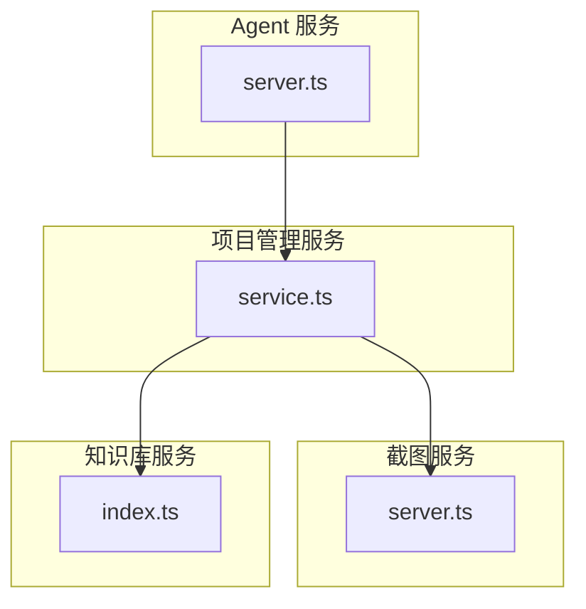
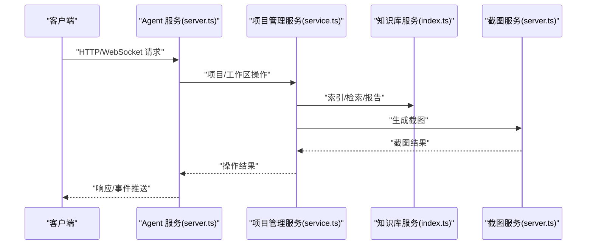
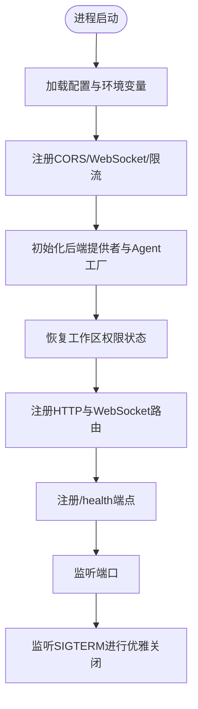
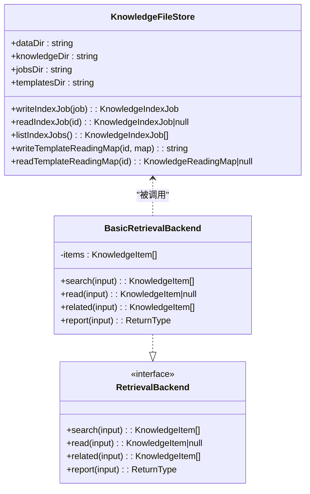
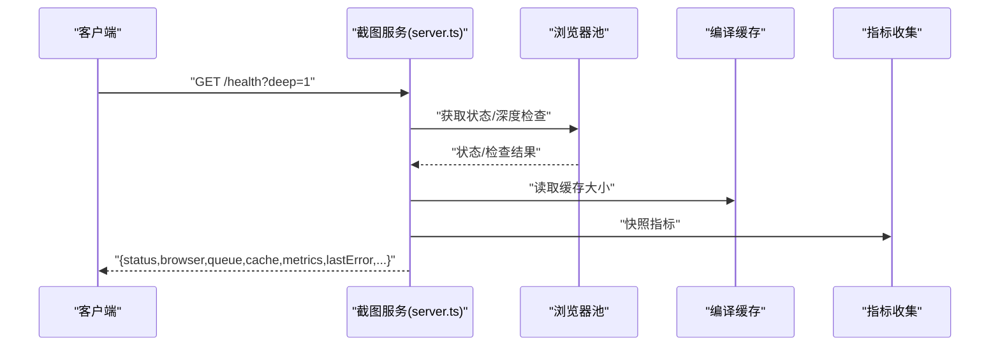
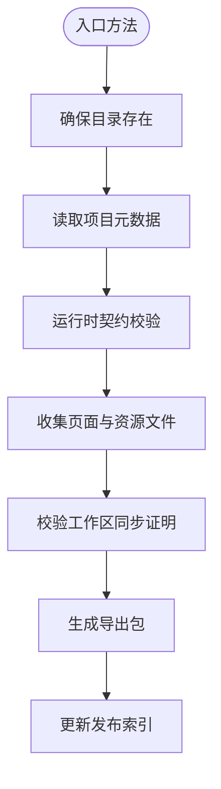
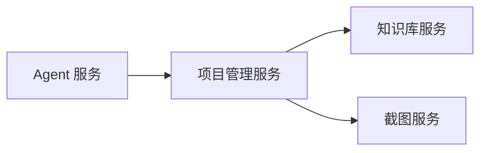

# 核心服务

<cite>
**本文引用的文件**   
- [packages/agent-service/src/server.ts](file://packages/agent-service/src/server.ts)
- [packages/screenshot-service/src/server.ts](file://packages/screenshot-service/src/server.ts)
- [packages/knowledge-service/src/index.ts](file://packages/knowledge-service/src/index.ts)
- [packages/project-core/src/service.ts](file://packages/project-core/src/service.ts)
</cite>

## 目录
1. [简介](#简介)
2. [项目结构](#项目结构)
3. [核心组件](#核心组件)
4. [架构总览](#架构总览)
5. [详细组件分析](#详细组件分析)
6. [依赖分析](#依赖分析)
7. [性能考虑](#性能考虑)
8. [故障排查指南](#故障排查指南)
9. [结论](#结论)
10. [附录](#附录)

## 简介
本技术文档聚焦 Workbench 的核心服务，围绕以下能力展开：
- Agent 服务：AI 代理管理、会话处理与 WebSocket 实时通信机制
- 知识库服务：文档管理、搜索索引与版本控制（基于文件存储）
- 截图服务：Puppeteer 集成、异步任务队列与缓存策略
- 项目管理服务：CRUD 操作、工作区管理与权限控制
- 服务间通信协议、错误处理机制与监控指标
- 扩展点与配置项说明，帮助开发者理解内部实现与集成方式

## 项目结构
Workbench 采用多包 monorepo 组织，核心服务位于 packages 下：
- agent-service：提供 AI 代理生命周期管理、路由与 WebSocket 支持
- knowledge-service：提供知识检索后端与模板阅读地图生成、索引作业管理
- screenshot-service：提供浏览器池、截图任务与编译缓存等能力
- project-core：提供项目管理、工作区、发布、审计等核心业务逻辑

图表来源
- [packages/agent-service/src/server.ts:1-117](file://packages/agent-service/src/server.ts#L1-L117)
- [packages/screenshot-service/src/server.ts:1-110](file://packages/screenshot-service/src/server.ts#L1-L110)
- [packages/knowledge-service/src/index.ts:1-543](file://packages/knowledge-service/src/index.ts#L1-L543)
- [packages/project-core/src/service.ts:1-800](file://packages/project-core/src/service.ts#L1-L800)

章节来源
- [packages/agent-service/src/server.ts:1-117](file://packages/agent-service/src/server.ts#L1-L117)
- [packages/screenshot-service/src/server.ts:1-110](file://packages/screenshot-service/src/server.ts#L1-L110)
- [packages/knowledge-service/src/index.ts:1-543](file://packages/knowledge-service/src/index.ts#L1-L543)
- [packages/project-core/src/service.ts:1-800](file://packages/project-core/src/service.ts#L1-L800)

## 核心组件
- Agent 服务
  - 启动 Fastify 服务器，注册 CORS、WebSocket、限流插件
  - 初始化后端提供者与 Agent 工厂，注册 pi-agent 后端
  - 启动时恢复工作区权限状态，注册路由与健康检查
  - 优雅关闭：销毁所有 Agent、清理会话存储、关闭服务
- 截图服务
  - 启动 Fastify 服务器，注册 CORS 与路由
  - 健康检查返回浏览器池状态、队列、缓存与指标快照
  - 支持深度健康检查与预热
- 知识库服务
  - KnowledgeFileStore：索引作业读写、模板阅读地图持久化
  - BasicRetrievalBackend：基于内存的检索后端，支持搜索、读取、相关项与报告
  - 模板索引流程：创建作业、执行扫描、生成阅读地图、可选增强摘要
- 项目管理服务
  - ProjectAdminService：项目与工作区目录管理、权限校验、导出打包、运行时校验、发布产物维护
  - 与外部服务集成：Agent 服务、截图服务、预览契约与 Sketch 核心

章节来源
- [packages/agent-service/src/server.ts:1-117](file://packages/agent-service/src/server.ts#L1-L117)
- [packages/screenshot-service/src/server.ts:1-110](file://packages/screenshot-service/src/server.ts#L1-L110)
- [packages/knowledge-service/src/index.ts:1-543](file://packages/knowledge-service/src/index.ts#L1-L543)
- [packages/project-core/src/service.ts:1-800](file://packages/project-core/src/service.ts#L1-L800)

## 架构总览
整体交互关系如下：
- 调用方通过 HTTP/WebSocket 访问 Agent 服务
- Agent 服务负责会话与代理编排，必要时调用项目管理服务
- 项目管理服务协调知识库服务（索引与检索）、截图服务（页面截图）
- 各服务暴露 /health 端点用于健康检查与指标采集

图表来源
- [packages/agent-service/src/server.ts:1-117](file://packages/agent-service/src/server.ts#L1-L117)
- [packages/project-core/src/service.ts:1-800](file://packages/project-core/src/service.ts#L1-L800)
- [packages/knowledge-service/src/index.ts:1-543](file://packages/knowledge-service/src/index.ts#L1-L543)
- [packages/screenshot-service/src/server.ts:1-110](file://packages/screenshot-service/src/server.ts#L1-L110)

## 详细组件分析

### Agent 服务
- 启动与配置
  - 加载环境变量与日志配置
  - 注册 CORS、WebSocket、限流插件
  - 初始化后端提供者与 Agent 工厂，动态注册 pi-agent 后端
  - 启动时恢复工作区权限状态并注册路由
- 健康检查
  - 返回运行时长、Agent 数量、工作区权限恢复状态
- 优雅关闭
  - 监听 SIGTERM，销毁所有 Agent、清理会话存储、关闭服务

图表来源
- [packages/agent-service/src/server.ts:1-117](file://packages/agent-service/src/server.ts#L1-L117)

章节来源
- [packages/agent-service/src/server.ts:1-117](file://packages/agent-service/src/server.ts#L1-L117)

### 知识库服务
- 数据模型与接口
  - KnowledgeFileStore：索引作业与模板阅读地图的文件级存储
  - RetrievalBackend：定义 search/read/related/report 接口
  - BasicRetrievalBackend：内存实现，按查询分词、评分排序、权限过滤
- 模板索引流程
  - 创建索引作业 -> 标记运行中 -> 扫描工作区生成阅读地图 -> 持久化 -> 更新作业状态为就绪或失败
  - 可选增强：使用组织者对条目进行摘要增强
- 搜索与报告
  - 支持按源类型、标签过滤；中文双字切分与基础评分
  - 报告构建聚合搜索结果与缺失/风险提示

图表来源
- [packages/knowledge-service/src/index.ts:1-543](file://packages/knowledge-service/src/index.ts#L1-L543)

章节来源
- [packages/knowledge-service/src/index.ts:1-543](file://packages/knowledge-service/src/index.ts#L1-L543)

### 截图服务
- 启动与配置
  - 加载配置与日志，注册 CORS 与路由
- 健康检查
  - 返回浏览器池状态、队列长度、编译缓存大小、指标快照与最近错误
  - 支持深度健康检查（可参数触发）
- 预热
  - 启动后可选择预热浏览器，降低首屏延迟

图表来源
- [packages/screenshot-service/src/server.ts:1-110](file://packages/screenshot-service/src/server.ts#L1-L110)

章节来源
- [packages/screenshot-service/src/server.ts:1-110](file://packages/screenshot-service/src/server.ts#L1-L110)

### 项目管理服务
- 目录与权限
  - 统一数据目录与子目录规划（projects、workspaces、snapshots、published、sessions、audit 等）
  - 默认 Actor 与角色判断，限制只读模式
- CRUD 与导出
  - 列出/获取项目详情，包含页面、文件夹、版本历史、配置 Schema/Values
  - 导出项目包前进行运行时契约校验，收集页面文件与资源
  - 维护发布产物索引
- 工作区同步证明
  - 要求 canonical workspace 已同步到当前 live revision，否则阻止敏感操作
- 外部服务集成
  - 通过配置获取 Agent 服务与截图服务地址，在需要时发起调用

图表来源
- [packages/project-core/src/service.ts:1-800](file://packages/project-core/src/service.ts#L1-L800)

章节来源
- [packages/project-core/src/service.ts:1-800](file://packages/project-core/src/service.ts#L1-L800)

## 依赖分析
- 服务耦合
  - Agent 服务依赖项目管理服务进行工作区与项目操作
  - 项目管理服务依赖知识库服务进行索引与检索，依赖截图服务进行截图生成
  - 截图服务相对独立，主要依赖浏览器池与缓存
- 外部依赖
  - Fastify、CORS、WebSocket、限流插件
  - 文件系统与 JSON 序列化
  - 预览契约与 Sketch 核心（项目管理服务）

图表来源
- [packages/agent-service/src/server.ts:1-117](file://packages/agent-service/src/server.ts#L1-L117)
- [packages/project-core/src/service.ts:1-800](file://packages/project-core/src/service.ts#L1-L800)
- [packages/knowledge-service/src/index.ts:1-543](file://packages/knowledge-service/src/index.ts#L1-L543)
- [packages/screenshot-service/src/server.ts:1-110](file://packages/screenshot-service/src/server.ts#L1-L110)

章节来源
- [packages/agent-service/src/server.ts:1-117](file://packages/agent-service/src/server.ts#L1-L117)
- [packages/project-core/src/service.ts:1-800](file://packages/project-core/src/service.ts#L1-L800)
- [packages/knowledge-service/src/index.ts:1-543](file://packages/knowledge-service/src/index.ts#L1-L543)
- [packages/screenshot-service/src/server.ts:1-110](file://packages/screenshot-service/src/server.ts#L1-L110)

## 性能考虑
- Agent 服务
  - 合理设置限流阈值与时间窗口，避免过载
  - 按需启用 pi-agent 后端，失败时降级继续启动
- 知识库服务
  - 索引作业采用文件持久化，建议批量处理与幂等写入
  - 搜索评分基于字符串匹配，适合中小规模数据集；大规模场景可引入倒排索引
- 截图服务
  - 浏览器池复用与预热可降低首屏延迟
  - 编译缓存减少重复构建开销
  - 指标快照便于容量规划与告警

[本节为通用指导，不直接分析具体文件]

## 故障排查指南
- 健康检查
  - Agent 服务：/health 返回 status、uptime、agents、workspaceAuthorityRecovery
  - 截图服务：/health 返回 browser、queue、cache、metrics、lastError，支持 deep 检查
- 常见错误
  - 工作区未同步：项目管理服务在导出等操作时会拒绝并返回 WORKSPACE_STALE
  - 索引作业不存在：知识库服务在执行模板索引时报 INDEX_JOB_NOT_FOUND
  - 权限不足：项目管理服务根据 Actor 角色与允许的项目 ID 进行鉴权

章节来源
- [packages/agent-service/src/server.ts:89-99](file://packages/agent-service/src/server.ts#L89-L99)
- [packages/screenshot-service/src/server.ts:44-71](file://packages/screenshot-service/src/server.ts#L44-L71)
- [packages/project-core/src/service.ts:702-723](file://packages/project-core/src/service.ts#L702-L723)
- [packages/knowledge-service/src/index.ts:229-271](file://packages/knowledge-service/src/index.ts#L229-L271)

## 结论
Workbench 核心服务以模块化与可扩展设计为基础：
- Agent 服务提供统一的代理编排与实时通信入口
- 知识库服务以文件存储为核心，提供轻量但实用的索引与检索能力
- 截图服务通过浏览器池与缓存提升稳定性与性能
- 项目管理服务整合多服务协作，保障数据一致性与权限控制
通过清晰的接口与扩展点，开发者可在现有基础上快速集成与定制。

[本节为总结性内容，不直接分析具体文件]

## 附录

### API 接口规范（健康检查）
- Agent 服务
  - GET /health
    - 响应字段：status、timestamp、uptime、agents、workspaceAuthorityRecovery
- 截图服务
  - GET /health
    - 查询参数：deep（可选，值为 "1" 时执行深度检查）
    - 响应字段：status、timestamp、uptime、browser、queue、cache、metrics、lastError、deepCheck（条件）

章节来源
- [packages/agent-service/src/server.ts:89-99](file://packages/agent-service/src/server.ts#L89-L99)
- [packages/screenshot-service/src/server.ts:44-71](file://packages/screenshot-service/src/server.ts#L44-L71)

### 配置选项（节选）
- Agent 服务
  - CORS_ORIGINS：逗号分隔的允许来源列表
  - logLevel：日志级别
  - rateLimit.max、rateLimit.windowMs：限流配置
  - port、host：监听地址
- 截图服务
  - CORS_ORIGINS：同上
  - logLevel：日志级别
  - port、host：监听地址
  - screenshotDeepHealth：是否默认开启深度健康检查
  - screenshotWarmup：是否启动后预热浏览器

章节来源
- [packages/agent-service/src/server.ts:46-66](file://packages/agent-service/src/server.ts#L46-L66)
- [packages/agent-service/src/server.ts:109-110](file://packages/agent-service/src/server.ts#L109-L110)
- [packages/screenshot-service/src/server.ts:26-40](file://packages/screenshot-service/src/server.ts#L26-L40)
- [packages/screenshot-service/src/server.ts:84-103](file://packages/screenshot-service/src/server.ts#L84-L103)

### 扩展点
- Agent 服务
  - 后端提供者：getBackendProvidersManager().initialize() 初始化，factory.register 注册新后端
  - 路由扩展：registerRoutes 挂载新的 HTTP/WebSocket 路由
- 知识库服务
  - 自定义检索后端：实现 RetrievalBackend 接口替换 BasicRetrievalBackend
  - 模板增强：KnowledgeOrganizer.summarize 注入摘要增强逻辑
- 截图服务
  - 浏览器池与缓存：通过 getBrowserPool/getCompileCache 接入自定义策略
  - 指标收集：getScreenshotMetrics 扩展监控维度

章节来源
- [packages/agent-service/src/server.ts:30-82](file://packages/agent-service/src/server.ts#L30-L82)
- [packages/knowledge-service/src/index.ts:85-90](file://packages/knowledge-service/src/index.ts#L85-L90)
- [packages/knowledge-service/src/index.ts:290-318](file://packages/knowledge-service/src/index.ts#L290-L318)
- [packages/screenshot-service/src/server.ts:44-71](file://packages/screenshot-service/src/server.ts#L44-L71)