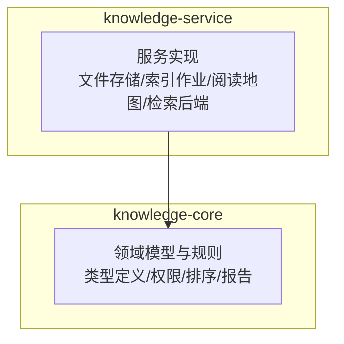
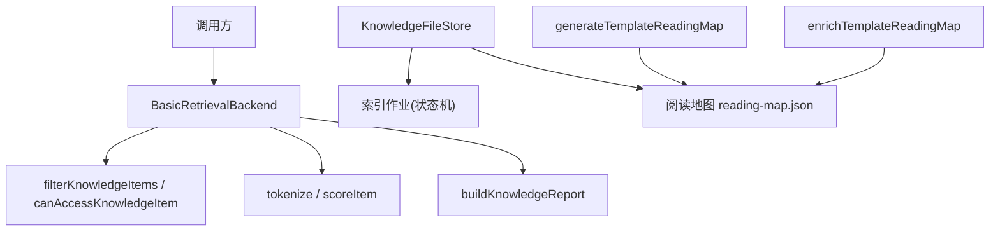
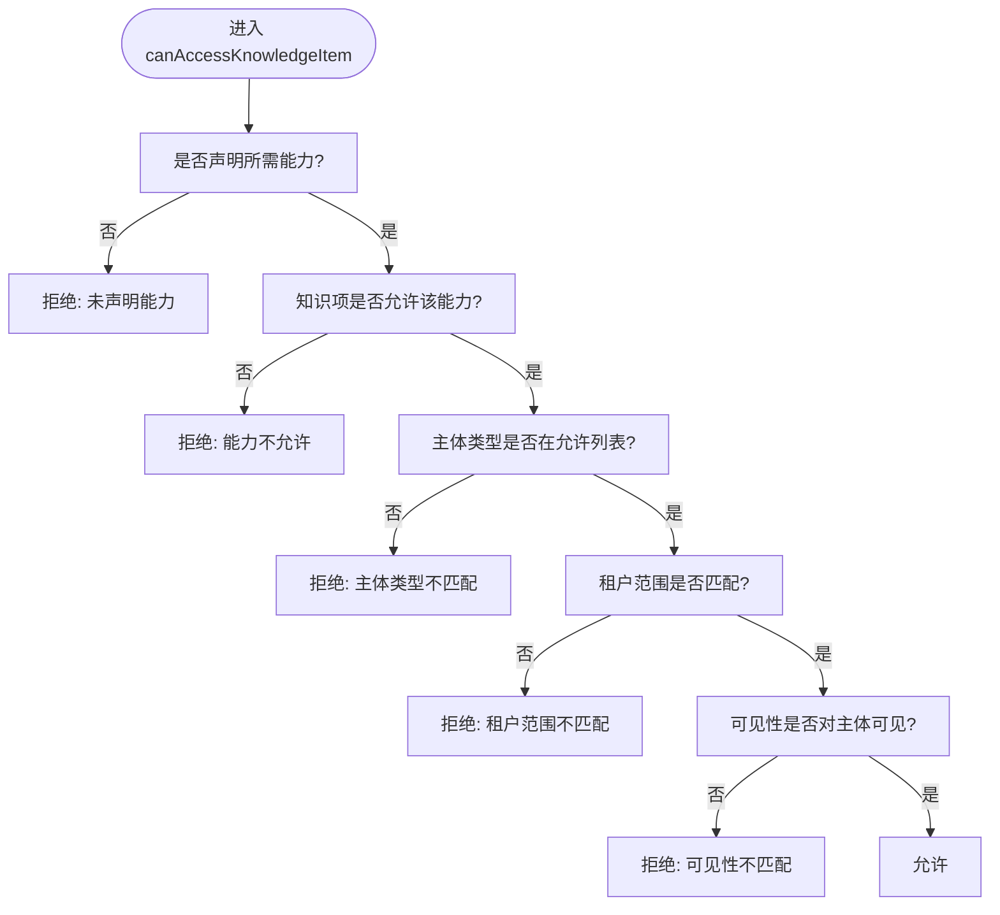
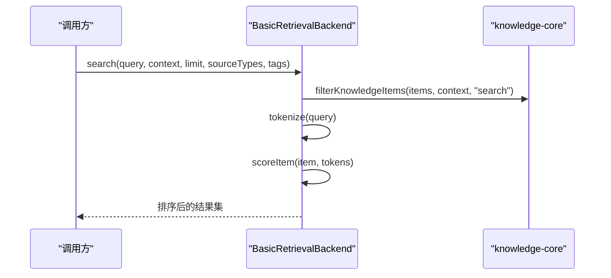
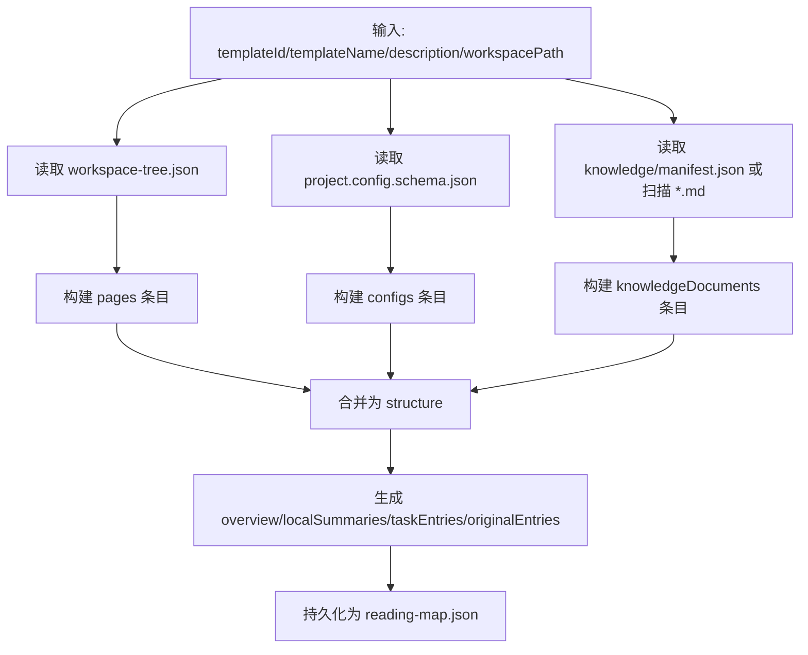
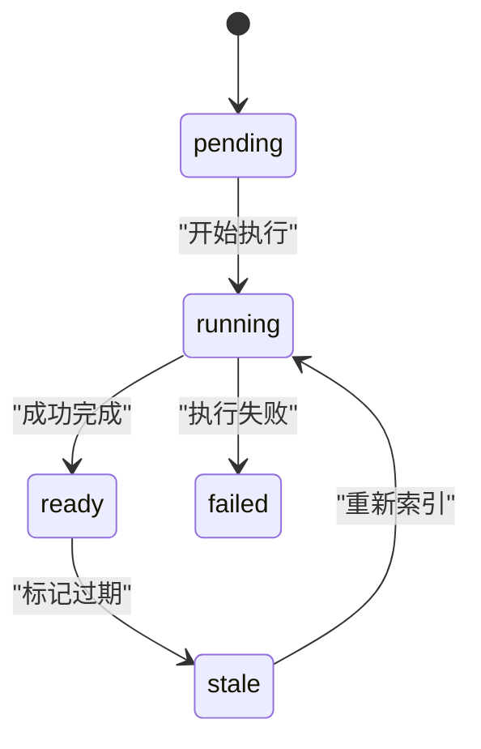
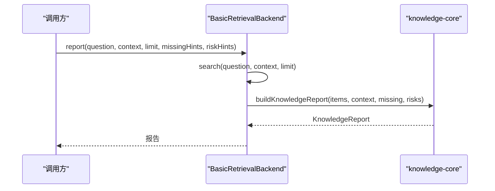
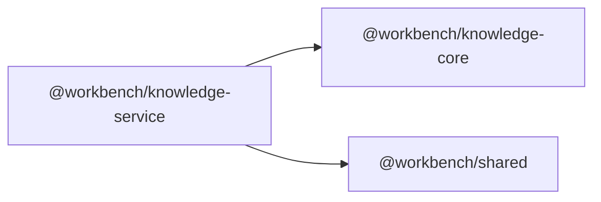

# 知识库服务

<cite>
**本文引用的文件**   
- [packages/knowledge-service/src/index.ts](file://packages/knowledge-service/src/index.ts)
- [packages/knowledge-core/src/index.ts](file://packages/knowledge-core/src/index.ts)
- [packages/knowledge-service/package.json](file://packages/knowledge-service/package.json)
- [packages/knowledge-core/package.json](file://packages/knowledge-core/package.json)
- [packages/knowledge-service/src/__tests__/service.test.ts](file://packages/knowledge-service/src/__tests__/service.test.ts)
- [packages/knowledge-core/src/__tests__/domain.test.ts](file://packages/knowledge-core/src/__tests__/domain.test.ts)
</cite>

## 目录
1. [简介](#简介)
2. [项目结构](#项目结构)
3. [核心组件](#核心组件)
4. [架构总览](#架构总览)
5. [详细组件分析](#详细组件分析)
6. [依赖关系分析](#依赖关系分析)
7. [性能考量](#性能考量)
8. [故障排查指南](#故障排查指南)
9. [结论](#结论)
10. [附录：API 规范与使用示例](#附录api-规范与使用示例)

## 简介
本技术文档面向“知识库服务”，围绕知识文档的上传、解析、索引与检索，系统性地阐述以下能力：
- 阅读地图（Reading Map）的概念与实现原理
- 文档结构的自动分析与任务化引导
- 基础搜索引擎与全文检索算法
- 权限控制与可信等级排序
- 报告生成与来源可追溯
- 版本控制与审计日志现状说明
- API 接口规范与集成示例

该服务当前以本地文件系统为存储后端，提供模板/项目的知识索引与检索能力，并通过领域模型统一表达知识项、访问上下文、权限与可信度。

## 项目结构
仓库中与知识库相关的核心代码位于两个包：
- knowledge-core：领域模型、权限判定、排序与报告构建等通用逻辑
- knowledge-service：基于文件系统的索引作业、阅读地图生成、基础检索后端与增强流程

图表来源
- [packages/knowledge-core/src/index.ts](file://packages/knowledge-core/src/index.ts)
- [packages/knowledge-service/src/index.ts](file://packages/knowledge-service/src/index.ts)

章节来源
- [packages/knowledge-service/src/index.ts](file://packages/knowledge-service/src/index.ts)
- [packages/knowledge-core/src/index.ts](file://packages/knowledge-core/src/index.ts)

## 核心组件
- 领域模型与权限
  - 知识项 KnowledgeItem：包含来源类型、种类、标题、摘要、标签、关键词、关系、可信等级、可见性、权限、版本、更新时间、读取路径等
  - 访问上下文 AccessContext：主体类型、主体标识、租户范围、访问面、目的、能力集合
  - 权限判定 canAccessKnowledgeItem：按能力、主体类型、可见性、租户范围进行综合校验
  - 排序 compareKnowledgeItemsByAuthority：按可信等级、来源类型、最小可见性、更新时间排序
  - 过滤 filterKnowledgeItems：在给定上下文中过滤并排序
  - 报告 buildKnowledgeReport：聚合可用资料、来源、可信等级、原文建议、缺失与风险
- 服务层
  - KnowledgeFileStore：基于本地文件的索引作业与阅读地图持久化
  - BasicRetrievalBackend：内存中的检索后端，支持搜索、读取、相关项与报告
  - 索引作业：创建、运行、标记过期、增强摘要
  - 阅读地图：从工作区自动扫描页面、配置与知识文档，生成结构化导航与任务入口

章节来源
- [packages/knowledge-core/src/index.ts](file://packages/knowledge-core/src/index.ts)
- [packages/knowledge-service/src/index.ts](file://packages/knowledge-service/src/index.ts)

## 架构总览
下图展示服务与核心模块的关系以及关键数据流：

图表来源
- [packages/knowledge-service/src/index.ts](file://packages/knowledge-service/src/index.ts)
- [packages/knowledge-core/src/index.ts](file://packages/knowledge-core/src/index.ts)

## 详细组件分析

### 领域模型与权限子系统
- 类型体系
  - 来源类型：系统规则、当前项目、关联模板、模板库、会话
  - 知识种类：知识文档、页面、配置、资产、业务规则、设计规则、操作指南、索引产物、系统规则、模板摘要、会话上下文
  - 可信等级：硬约束、当前事实、默认参考、参考样例、AI 摘要
  - 可见性：系统内部、作者私有、项目代理、发布查看者、模板库、运维管理员
  - 能力：搜索、读摘要、读原文、相关项、报告、管理索引作业
  - 访问面与目的：编辑辅助、只读问答、模板推荐、项目诊断、索引生成、运维调试
- 权限判定流程
  - 检查请求能力是否被声明
  - 检查知识项是否允许该能力
  - 检查主体类型是否在允许列表中
  - 检查租户范围（项目或模板）
  - 检查可见性是否与主体类型匹配
- 排序策略
  - 优先高可信等级
  - 其次优先更贴近当前上下文（如当前项目优于模板库）
  - 再次按最小可见性级别排序
  - 最后按更新时间倒序

图表来源
- [packages/knowledge-core/src/index.ts](file://packages/knowledge-core/src/index.ts)

章节来源
- [packages/knowledge-core/src/index.ts](file://packages/knowledge-core/src/index.ts)

### 检索后端与全文检索
- 搜索流程
  - 将查询分词（英文字母数字下划线连字符保留；中文采用双字滑动窗口）
  - 过滤：按来源类型、标签、能力与可见性筛选
  - 评分：在标题、摘要、标签、关键词、内容片段中统计命中次数
  - 排序：先按评分降序，再按权威排序（可信等级、来源类型、可见性、更新时间）
  - 截断：返回前 N 条结果
- 读取与相关项
  - 读取：根据能力选择返回摘要或原文路径
  - 相关项：基于显式关系与反向关系收集候选，再按权限过滤

图表来源
- [packages/knowledge-service/src/index.ts](file://packages/knowledge-service/src/index.ts)
- [packages/knowledge-core/src/index.ts](file://packages/knowledge-core/src/index.ts)

章节来源
- [packages/knowledge-service/src/index.ts](file://packages/knowledge-service/src/index.ts)

### 阅读地图（Reading Map）与自动分析
- 概念
  - 阅读地图是对模板/项目结构的可视化导航，包括页面、配置、知识文档与资产的清单与摘要
  - 同时提供任务化入口（如修改页面、修改配置、排查异常），推荐相关路径
- 自动生成
  - 从 workspace-tree.json 提取页面
  - 从 project.config.schema.json 提取配置项
  - 从 knowledge/manifest.json 或 knowledge/*.md 扫描知识文档
  - 生成 overview、structure、localSummaries、taskEntries、originalEntries
- 持久化与增强
  - 写入 dataDir/knowledge/templates/{templateId}/reading-map.json
  - 支持异步整理器增强 localSummaries，并回写至阅读地图

图表来源
- [packages/knowledge-service/src/index.ts](file://packages/knowledge-service/src/index.ts)

章节来源
- [packages/knowledge-service/src/index.ts](file://packages/knowledge-service/src/index.ts)

### 索引作业与版本控制
- 作业生命周期
  - pending：待处理
  - running：执行中
  - ready：完成且可用
  - failed：失败
  - partial：部分完成（预留）
  - stale：过期（需重新索引）
- 作业管理
  - 创建作业：记录目标类型、ID、标题、描述、工作区路径
  - 运行作业：更新状态为 running，生成阅读地图，完成后置为 ready，记录阅读地图路径与条目数
  - 标记过期：当模板元数据或工作区变更时，将最近作业标记为 stale
- 版本控制
  - 知识项包含 version 字段，用于表示版本演进
  - 作业记录 updatedAt 时间戳，便于追踪最新状态

图表来源
- [packages/knowledge-service/src/index.ts](file://packages/knowledge-service/src/index.ts)
- [packages/knowledge-core/src/index.ts](file://packages/knowledge-core/src/index.ts)

章节来源
- [packages/knowledge-service/src/index.ts](file://packages/knowledge-service/src/index.ts)
- [packages/knowledge-core/src/index.ts](file://packages/knowledge-core/src/index.ts)

### 报告生成与来源可追溯
- 报告结构
  - 问题、创建时间、上下文键（用于缓存）
  - 摘要、材料清单（含可信等级、来源类型、读取路径）
  - 来源列表、可信等级集合、作用域
  - 推荐原文路径、缺失信息、风险提示
- 权限与可信度
  - 仅纳入当前主体可见的资料
  - 输出材料的可信等级与来源类型，便于下游决策

图表来源
- [packages/knowledge-service/src/index.ts](file://packages/knowledge-service/src/index.ts)
- [packages/knowledge-core/src/index.ts](file://packages/knowledge-core/src/index.ts)

章节来源
- [packages/knowledge-service/src/index.ts](file://packages/knowledge-service/src/index.ts)
- [packages/knowledge-core/src/index.ts](file://packages/knowledge-core/src/index.ts)

### 实体关系与知识图谱（现状与建议）
- 现状
  - 知识项包含 relations 字段，支持显式关系（type、targetId、description）
  - 相关项检索会考虑正向与反向关系
- 建议
  - 可扩展为图数据库或邻接表存储，支持批量关系抽取与可视化
  - 结合 LLM 进行实体识别与关系抽取，沉淀为结构化关系

章节来源
- [packages/knowledge-core/src/index.ts](file://packages/knowledge-core/src/index.ts)
- [packages/knowledge-service/src/index.ts](file://packages/knowledge-service/src/index.ts)

## 依赖关系分析
- 包依赖
  - knowledge-service 依赖 knowledge-core 与 shared
  - knowledge-core 无运行时依赖，仅提供类型与函数
- 模块耦合
  - service 层通过 core 提供的权限、排序、报告函数实现检索与报告
  - 阅读地图生成与持久化由 service 层负责，core 层提供数据结构定义

图表来源
- [packages/knowledge-service/package.json](file://packages/knowledge-service/package.json)
- [packages/knowledge-core/package.json](file://packages/knowledge-core/package.json)

章节来源
- [packages/knowledge-service/package.json](file://packages/knowledge-service/package.json)
- [packages/knowledge-core/package.json](file://packages/knowledge-core/package.json)

## 性能考量
- 分词与评分
  - 中文双字滑动窗口可能带来 O(n) 额外开销，建议在大数据量场景引入倒排索引或外部搜索引擎
- 排序复杂度
  - 排序为 O(m log m)，m 为候选集大小；可通过分页与预过滤降低 m
- 文件 IO
  - 索引作业涉及大量 JSON 读写，建议批量化与并发控制
- 缓存
  - 报告缓存键包含完整上下文，避免跨权限复用；可在上层增加 LRU 缓存

[本节为通用指导，无需源码引用]

## 故障排查指南
- 索引作业失败
  - 检查工作区路径是否存在、workspace-tree.json 与 project.config.schema.json 是否合法
  - 查看作业 error 字段与 statusReason
- 权限拒绝
  - 确认 capabilities 是否包含所需能力
  - 检查 principalType 与 visibility 是否匹配
  - 验证 tenantScope 与 sourceId 是否一致
- 搜索结果为空
  - 检查 queryTokens 是否为空或过于严格
  - 确认 tags 与 sourceTypes 过滤条件
  - 核对 item.tags、item.keywords、contentSnippet 是否填充

章节来源
- [packages/knowledge-service/src/index.ts](file://packages/knowledge-service/src/index.ts)
- [packages/knowledge-core/src/index.ts](file://packages/knowledge-core/src/index.ts)

## 结论
知识库服务通过清晰的领域模型与权限体系，实现了模板/项目的知识索引、阅读地图生成与基础检索。其优势在于：
- 统一的权限与可信度模型，确保结果安全与可靠
- 阅读地图自动化生成，提升导航效率
- 作业化索引流程，支持增量与过期重算
未来可引入外部搜索引擎、图数据库与 AI 增强，进一步提升检索质量与知识发现能力。

[本节为总结，无需源码引用]

## 附录：API 规范与使用示例

### 接口概览
- 索引作业
  - 创建模板索引作业：传入模板 ID、名称、描述与工作区路径
  - 运行模板索引作业：根据作业 ID 执行，产出阅读地图
  - 标记模板知识过期：将最近作业标记为 stale
- 检索
  - 搜索：query、context、limit、sourceTypes、tags
  - 读取：itemId、context、original（是否返回原文路径）
  - 相关项：itemId、context、limit
- 报告
  - 报告：question、context、limit、missingHints、riskHints

章节来源
- [packages/knowledge-service/src/index.ts](file://packages/knowledge-service/src/index.ts)

### 使用示例（来自测试）
- 为模板创建 pending 索引任务并生成基础阅读地图
  - 参考用例路径：[packages/knowledge-service/src/__tests__/service.test.ts](file://packages/knowledge-service/src/__tests__/service.test.ts)
- 权限过滤与相关项不泄露不可见条目
  - 参考用例路径：[packages/knowledge-service/src/__tests__/service.test.ts](file://packages/knowledge-service/src/__tests__/service.test.ts)
- 报告只引用当前主体可见资料并记录不可确认信息
  - 参考用例路径：[packages/knowledge-service/src/__tests__/service.test.ts](file://packages/knowledge-service/src/__tests__/service.test.ts)
- 模板更新后把 ready 任务标记为 stale
  - 参考用例路径：[packages/knowledge-service/src/__tests__/service.test.ts](file://packages/knowledge-service/src/__tests__/service.test.ts)
- 直接生成阅读地图用于基础兜底
  - 参考用例路径：[packages/knowledge-service/src/__tests__/service.test.ts](file://packages/knowledge-service/src/__tests__/service.test.ts)
- 通过异步整理器增强阅读地图摘要
  - 参考用例路径：[packages/knowledge-service/src/__tests__/service.test.ts](file://packages/knowledge-service/src/__tests__/service.test.ts)
- 领域规则：按访问上下文过滤、排序、报告结构与缓存键、旧来源映射
  - 参考用例路径：[packages/knowledge-core/src/__tests__/domain.test.ts](file://packages/knowledge-core/src/__tests__/domain.test.ts)

章节来源
- [packages/knowledge-service/src/__tests__/service.test.ts](file://packages/knowledge-service/src/__tests__/service.test.ts)
- [packages/knowledge-core/src/__tests__/domain.test.ts](file://packages/knowledge-core/src/__tests__/domain.test.ts)

### 最佳实践
- 明确 AccessContext 的 capabilities 与 surface/purpose，避免越权
- 合理设置 visibility 与 permissions.capabilities，遵循最小授权原则
- 在索引作业完成后，及时更新阅读地图并清理 stale 作业
- 对高频查询结果在上层做缓存，注意缓存键包含完整上下文

[本节为通用指导，无需源码引用]