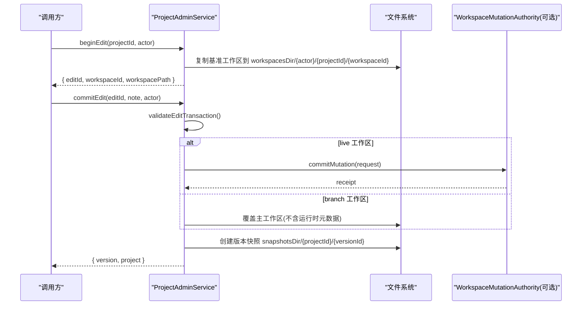
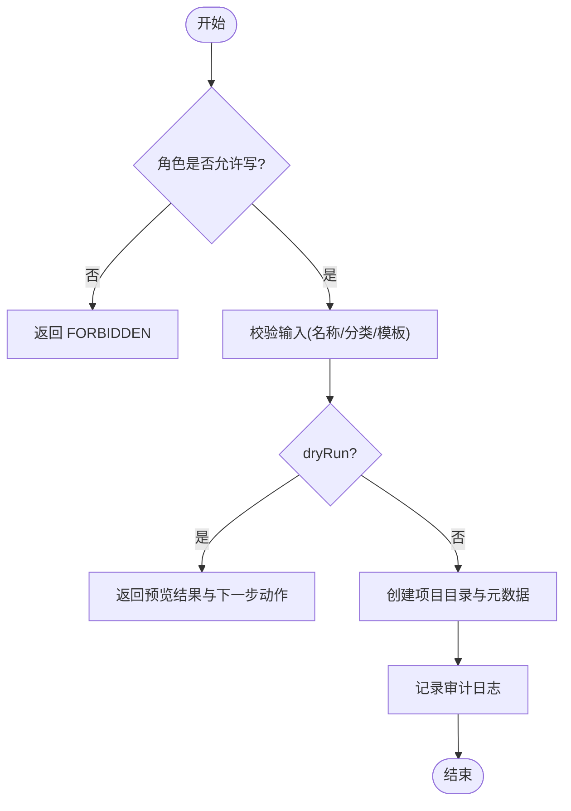
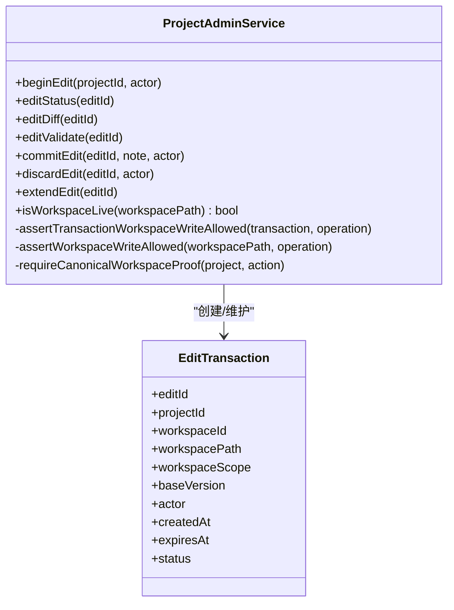
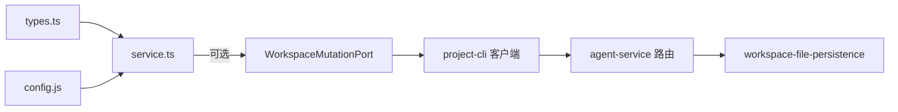

# ProjectAdminService 服务层

<cite>
**本文引用的文件列表**
- [service.ts](file://packages/project-core/src/service.ts)
- [types.ts](file://packages/project-core/src/types.ts)
- [config.js](file://packages/project-core/src/config.js)
- [workspace-authority-client.ts](file://packages/project-cli/src/workspace-authority-client.ts)
- [workspace-file-persistence.ts](file://packages/agent-service/src/collab/workspace-file-persistence.ts)
- [workspace-authority.ts](file://packages/agent-service/src/routes/workspace-authority.ts)
</cite>

## 目录
1. [简介](#简介)
2. [项目结构](#项目结构)
3. [核心组件](#核心组件)
4. [架构总览](#架构总览)
5. [详细组件分析](#详细组件分析)
6. [依赖关系分析](#依赖关系分析)
7. [性能考量](#性能考量)
8. [故障排查指南](#故障排查指南)
9. [结论](#结论)
10. [附录：API 方法参考](#附录api-方法参考)

## 简介
ProjectAdminService 是工作区与项目管理的服务层，负责项目的生命周期管理、工作区协调（基准/分支/Session）、权限控制与审计日志。它提供面向业务逻辑的 API，封装了文件系统操作、版本快照、模板管理、页面资源管理、发布制品、预览校验、资产上传与替换、可视化检查等能力，并通过可选的 Workspace Mutation Authority 实现 live 工作区的受控变更与同步。

## 项目结构
- 服务类位于 packages/project-core/src/service.ts，类型定义在 types.ts，配置读取在 config.js。
- 与外部协作通过 WorkspaceMutationPort 接口，CLI 侧客户端在 project-cli 中实现，Agent Service 提供 REST 路由与持久化。

```mermaid
graph TB
subgraph "ProjectCore"
S["ProjectAdminService<br/>service.ts"]
T["类型定义<br/>types.ts"]
C["配置读取<br/>config.js"]
end
subgraph "CLI 客户端"
WAC["WorkspaceAuthorityClient<br/>project-cli"]
end
subgraph "Agent Service"
R["REST 路由<br/>workspace-authority.ts"]
P["持久化/权威状态<br/>workspace-file-persistence.ts"]
end
S --> T
S --> C
S --> |"可选: workspaceAuthorityPort.commitMutation/getState"| WAC
WAC --> |"HTTP /api/workspace-authority/... |" R
R --> P
```

图表来源
- [service.ts:476-525](file://packages/project-core/src/service.ts#L476-L525)
- [types.ts:125-153](file://packages/project-core/src/types.ts#L125-L153)
- [workspace-authority-client.ts:78-120](file://packages/project-cli/src/workspace-authority-client.ts#L78-L120)
- [workspace-authority.ts:195-213](file://packages/agent-service/src/routes/workspace-authority.ts#L195-L213)
- [workspace-file-persistence.ts:202-248](file://packages/agent-service/src/collab/workspace-file-persistence.ts#L202-L248)

章节来源
- [service.ts:476-525](file://packages/project-core/src/service.ts#L476-L525)
- [types.ts:125-153](file://packages/project-core/src/types.ts#L125-L153)

## 核心组件
- 初始化与目录结构
  - 构造器根据配置或环境变量解析 dataDir、auditDir、maxBatchSize 等，并派生 projectsDir、workspacesDir、snapshotsDir、publishedDir、sessionsDir、internalDir 等子目录。
  - ensureDirs 保证所有必要目录存在。
- 默认 Actor 与权限
  - defaultActor 从环境注入 actor；canAccessProject/requireProjectAccess 基于 allowedProjectIds 进行资源级访问控制。
- 工作区范围与权威写入
  - isWorkspaceLive 判断工作区是否为 live；assertTransactionWorkspaceWriteAllowed/assertWorkspaceWriteAllowed 强制 live 工作区必须通过 WorkspaceMutationPort 提交变更。
- 编辑事务与工作区同步
  - beginEdit 创建 branch 工作区副本，记录 EditTransaction；commitEdit 合并差异到主工作区并生成版本快照；discardEdit 清理分支；editStatus/editDiff/editValidate 提供差异与校验。
- 模板与项目复制
  - createTemplateFromProject 将当前已同步的 live 工作区保存为模板；convertTemplateToProject 将模板转为项目；duplicateProject 基于临时模板快速复制。
- 发布与导出
  - exportProjectPackage 导出项目包（含页面、资源、知识文件、应用图），要求工作区已同步且运行契约校验通过；deleteProjectPreview/deleteProjectExecute 支持两步删除流程。
- 审计日志
  - audit 统一记录 L0-L4 级别事件，按日期归档 JSON 文件，包含 actor、tool、diffSummary、validation、error 等上下文。

章节来源
- [service.ts:492-521](file://packages/project-core/src/service.ts#L492-L521)
- [service.ts:632-641](file://packages/project-core/src/service.ts#L632-L641)
- [service.ts:6404-6420](file://packages/project-core/src/service.ts#L6404-L6420)
- [service.ts:527-530](file://packages/project-core/src/service.ts#L527-L530)
- [service.ts:5514-5548](file://packages/project-core/src/service.ts#L5514-L5548)
- [service.ts:1376-1437](file://packages/project-core/src/service.ts#L1376-L1437)
- [service.ts:1471-1559](file://packages/project-core/src/service.ts#L1471-L1559)
- [service.ts:1076-1128](file://packages/project-core/src/service.ts#L1076-L1128)
- [service.ts:1275-1321](file://packages/project-core/src/service.ts#L1275-L1321)
- [service.ts:725-814](file://packages/project-core/src/service.ts#L725-L814)
- [service.ts:972-1027](file://packages/project-core/src/service.ts#L972-L1027)
- [service.ts:6482-6515](file://packages/project-core/src/service.ts#L6482-L6515)

## 架构总览
ProjectAdminService 作为“项目与内容”的核心编排者，向上暴露统一的 CRUD 与管理工作流，向下通过文件系统持久化，并通过可选的 Workspace Mutation Authority 对 live 工作区进行受控变更与投影同步。



图表来源
- [service.ts:1376-1437](file://packages/project-core/src/service.ts#L1376-L1437)
- [service.ts:1471-1559](file://packages/project-core/src/service.ts#L1471-L1559)
- [service.ts:5514-5548](file://packages/project-core/src/service.ts#L5514-L5548)
- [service.ts:5673-5704](file://packages/project-core/src/service.ts#L5673-L5704)

## 详细组件分析

### 初始化与目录结构管理
- 构造参数
  - dataDir、auditDir、maxBatchSize、workspaceAuthorityPort 等可配置项。
- 目录约定
  - dataDir/projects：项目元数据与 workspace 根
  - dataDir/workspaces：分支/Session 工作区
  - dataDir/snapshots：版本快照
  - dataDir/published：发布制品与索引
  - dataDir/.project-admin/internal：edits/plans/locks 等内部数据
  - dataDir/audit：审计日志按日归档

章节来源
- [service.ts:492-521](file://packages/project-core/src/service.ts#L492-L521)

### 依赖注入机制
- 通过构造函数注入 ProjectAdminConfig，包括可选的 workspaceAuthorityPort（WorkspaceMutationPort）。
- 当需要写 live 工作区时，若未注入该端口则拒绝并返回错误码 WORKSPACE_AUTHORITY_REQUIRED。

章节来源
- [types.ts:125-153](file://packages/project-core/src/types.ts#L125-L153)
- [service.ts:5514-5548](file://packages/project-core/src/service.ts#L5514-L5548)

### 项目生命周期管理（CRUD）
- 创建项目
  - 支持 dryRun 预览；可选择 templateId 克隆模板工作区；生成项目元数据与初始 workspace-tree。
- 更新项目
  - 支持 name/category/description/authoringPreferences 增量更新；dryRun 仅计算 diff。
- 删除项目
  - 两步流程：deleteProjectPreview 生成计划与确认 token；deleteProjectExecute 管理员执行删除，同时清理发布制品。
- 查询项目
  - listProjects 返回摘要；getProject 返回详情、页面树、版本历史、配置 schema/values、锁定状态。
- 导出项目包
  - 校验运行契约；收集 pages/folders/versions/assets/knowledgeFiles/appGraph/baseVersion 及工作区同步证明。



图表来源
- [service.ts:816-899](file://packages/project-core/src/service.ts#L816-L899)
- [service.ts:901-940](file://packages/project-core/src/service.ts#L901-L940)
- [service.ts:972-1027](file://packages/project-core/src/service.ts#L972-L1027)
- [service.ts:643-700](file://packages/project-core/src/service.ts#L643-L700)
- [service.ts:725-814](file://packages/project-core/src/service.ts#L725-L814)

章节来源
- [service.ts:816-899](file://packages/project-core/src/service.ts#L816-L899)
- [service.ts:901-940](file://packages/project-core/src/service.ts#L901-L940)
- [service.ts:972-1027](file://packages/project-core/src/service.ts#L972-L1027)
- [service.ts:643-700](file://packages/project-core/src/service.ts#L643-L700)
- [service.ts:725-814](file://packages/project-core/src/service.ts#L725-L814)

### 工作区同步机制（基准/分支/Session）
- 工作区范围
  - live：生产态工作区，需通过 Authority 提交变更
  - branch：编辑分支，由 beginEdit 创建
  - snapshot-source：模板快照源
  - legacy：兼容旧格式
- 编辑事务
  - beginEdit：复制基准工作区到 workspacesDir/{actor}/{projectId}/{workspaceId}，写入 .workspace.json 标记 scope=branch、baseVersion、ownerUserId 等。
  - editStatus/editDiff：对比基准与分支差异，返回 changedFiles。
  - editValidate：结构+运行时双重校验，阻止阻塞问题提交。
  - commitEdit：校验通过后，将分支覆盖主工作区（排除运行时元数据），生成版本快照，更新项目元数据与 canonicalSyncedAt。
  - discardEdit：清理分支工作区并标记事务丢弃。
- 权威写入
  - assertTransactionWorkspaceWriteAllowed/assertWorkspaceWriteAllowed：当 scope=live 或未配置 authorityPort 时拒绝直接写盘，强制走 Authority。
  - requireCanonicalWorkspaceProof：导出/模板等操作要求 activeWorkspace 与 canonical 同步一致。



图表来源
- [service.ts:1376-1437](file://packages/project-core/src/service.ts#L1376-L1437)
- [service.ts:1439-1462](file://packages/project-core/src/service.ts#L1439-L1462)
- [service.ts:1464-1469](file://packages/project-core/src/service.ts#L1464-L1469)
- [service.ts:1471-1559](file://packages/project-core/src/service.ts#L1471-L1559)
- [service.ts:1561-1583](file://packages/project-core/src/service.ts#L1561-L1583)
- [service.ts:5514-5548](file://packages/project-core/src/service.ts#L5514-L5548)
- [service.ts:702-723](file://packages/project-core/src/service.ts#L702-L723)

章节来源
- [service.ts:1376-1437](file://packages/project-core/src/service.ts#L1376-L1437)
- [service.ts:1439-1462](file://packages/project-core/src/service.ts#L1439-L1462)
- [service.ts:1464-1469](file://packages/project-core/src/service.ts#L1464-L1469)
- [service.ts:1471-1559](file://packages/project-core/src/service.ts#L1471-L1559)
- [service.ts:1561-1583](file://packages/project-core/src/service.ts#L1561-L1583)
- [service.ts:5514-5548](file://packages/project-core/src/service.ts#L5514-L5548)
- [service.ts:702-723](file://packages/project-core/src/service.ts#L702-L723)

### 权限验证系统（角色控制、资源访问限制、操作审计）
- 角色与模式
  - role: admin | creator | readonly；mode 由 getProjectAdminMode 推导（cli/local/readonly）。
- 资源访问控制
  - canAccessProject/requireProjectAccess：基于 allowedProjectIds 白名单限制访问特定项目。
- 操作审计
  - audit：统一记录工具名、操作级别、成功与否、差异摘要、校验结果、错误信息；按日期归档 JSON。
- 锁与计划
  - isProjectLocked：项目锁定状态；createPlan/readPlan：两步操作的计划与确认 token。

章节来源
- [service.ts:632-641](file://packages/project-core/src/service.ts#L632-L641)
- [service.ts:6404-6420](file://packages/project-core/src/service.ts#L6404-L6420)
- [service.ts:6482-6515](file://packages/project-core/src/service.ts#L6482-L6515)
- [service.ts:6392-6402](file://packages/project-core/src/service.ts#L6392-L6402)
- [service.ts:6365-6390](file://packages/project-core/src/service.ts#L6365-L6390)

### 模板管理与健康检查
- 模板列表/详情：listTemplates/getTemplate
- 从项目创建模板：createTemplateFromProject（要求工作区已同步且运行契约校验通过）
- 模板元信息更新：updateTemplateMeta
- 模板健康检查：checkTemplateHealth（扫描模板元数据、workspace、页面数量一致性、运行契约）
- 删除模板：两步流程 deleteTemplatePreview/deleteTemplateExecute
- 模板转项目：convertTemplateToProject（创建后删除原模板）
- 模板推荐：recommendTemplate（关键词匹配打分）

章节来源
- [service.ts:1039-1068](file://packages/project-core/src/service.ts#L1039-L1068)
- [service.ts:1070-1074](file://packages/project-core/src/service.ts#L1070-L1074)
- [service.ts:1076-1128](file://packages/project-core/src/service.ts#L1076-L1128)
- [service.ts:1130-1160](file://packages/project-core/src/service.ts#L1130-L1160)
- [service.ts:1162-1233](file://packages/project-core/src/service.ts#L1162-L1233)
- [service.ts:1235-1273](file://packages/project-core/src/service.ts#L1235-L1273)
- [service.ts:1275-1321](file://packages/project-core/src/service.ts#L1275-L1321)
- [service.ts:1323-1359](file://packages/project-core/src/service.ts#L1323-L1359)

### 页面与资源版本管理
- 页面资源版本：createPageResourceVersion/pageFilesFromResourceVersion
- 知识文档版本：createKnowledgeResourceVersion/knowledgeContentFromResourceVersion
- 内容提交：createContentCommit（维护 headCommitId、materializationStatus、changedResources、审计上下文）
- 资源恢复：restore 相关输入类型定义（resource restore input）

章节来源
- [service.ts:5004-5055](file://packages/project-core/src/service.ts#L5004-L5055)
- [service.ts:5099-5159](file://packages/project-core/src/service.ts#L5099-L5159)
- [service.ts:5161-5191](file://packages/project-core/src/service.ts#L5161-L5191)
- [service.ts:5227-5285](file://packages/project-core/src/service.ts#L5227-L5285)
- [service.ts:5287-5294](file://packages/project-core/src/service.ts#L5287-L5294)

### 发布与导出
- 导出项目包：exportProjectPackage（校验运行契约、收集页面/资源/知识文件、appGraph、baseVersion、工作区同步证明）
- 删除发布制品：deletePublishedProjectArtifact（重建 published 索引）

章节来源
- [service.ts:725-814](file://packages/project-core/src/service.ts#L725-L814)
- [service.ts:596-604](file://packages/project-core/src/service.ts#L596-L604)

### 资产上传与替换
- 资产校验：validateAssetInput（MIME 白名单、大小限制、Base64 合法性）
- 注册表：read/write/upsert/remove 图片清单
- 路径安全：safeRelativeAssetPath（禁止绝对路径与越界）
- 引用替换：replaceReferences（遍历代码/样式/JSON/Markdown 中的引用）

章节来源
- [service.ts:6532-6569](file://packages/project-core/src/service.ts#L6532-L6569)
- [service.ts:6571-6643](file://packages/project-core/src/service.ts#L6571-L6643)
- [service.ts:6645-6675](file://packages/project-core/src/service.ts#L6645-L6675)
- [service.ts:6677-6693](file://packages/project-core/src/service.ts#L6677-L6693)

### 可视化检查与验证
- verifyWorkspace：统计页面数、运行时类型分布、项目配置是否存在、资产引用完整性、原型占位符检测、缺失引用、运行时问题
- 视觉报告：writeVisualCheckSvg 输出 SVG 概览

章节来源
- [service.ts:6695-6753](file://packages/project-core/src/service.ts#L6695-L6753)
- [service.ts:6877-6909](file://packages/project-core/src/service.ts#L6877-L6909)

## 依赖关系分析
- 内部依赖
  - types.ts：定义所有输入输出类型、Actor、Result、版本/提交/资源版本等模型
  - config.js：读取环境变量与默认值（dataDir、auditDir、maxBatchSize、mode、URLs 等）
- 外部协作
  - WorkspaceMutationPort：可选的 live 工作区写入通道
  - CLI 客户端：project-cli 的 workspace-authority-client 通过 HTTP 调用 agent-service 的 /api/workspace-authority 路由
  - Agent Service：routes/workspace-authority 暴露 snapshot/health/reconcile 等接口，workspace-file-persistence 负责权威状态持久化



图表来源
- [types.ts:125-153](file://packages/project-core/src/types.ts#L125-L153)
- [workspace-authority-client.ts:78-120](file://packages/project-cli/src/workspace-authority-client.ts#L78-L120)
- [workspace-authority.ts:195-213](file://packages/agent-service/src/routes/workspace-authority.ts#L195-L213)
- [workspace-file-persistence.ts:202-248](file://packages/agent-service/src/collab/workspace-file-persistence.ts#L202-L248)

章节来源
- [types.ts:125-153](file://packages/project-core/src/types.ts#L125-L153)
- [workspace-authority-client.ts:78-120](file://packages/project-cli/src/workspace-authority-client.ts#L78-L120)
- [workspace-authority.ts:195-213](file://packages/agent-service/src/routes/workspace-authority.ts#L195-L213)
- [workspace-file-persistence.ts:202-248](file://packages/agent-service/src/collab/workspace-file-persistence.ts#L202-L248)

## 性能考量
- 批量上限：maxBatchSize 控制批量操作规模，避免单次处理过大导致超时或内存压力。
- 版本压缩：compactProjectVersions 自动清理早期 auto_checkpoint 版本，保留最近 N 个版本，减少磁盘占用。
- 差异计算：diffWorkspaceFiles 采用全量比较，适合中小规模工作区；大仓库建议结合增量策略或缓存。
- 文件拷贝：copyWorkspaceWithoutRuntimeMetadata 过滤 node_modules/.next/.git 等目录，降低 I/O 开销。
- 发布索引：regeneratePublishedProjectsIndex 按需重建，避免频繁全量扫描。

[本节为通用指导，不直接分析具体文件]

## 故障排查指南
- 常见错误码
  - FORBIDDEN：无写权限或无权访问该项目
  - PROJECT_NOT_FOUND：项目不存在
  - TEMPLATE_NOT_FOUND：模板不存在
  - WORKSPACE_STALE：工作区尚未同步到 canonical，无法执行导出/模板保存等操作
  - VALIDATION_BLOCKED：运行契约校验失败，不能继续操作
  - EDIT_CONFLICT：提交冲突，基准版本不一致
  - EDIT_EXPIRED：编辑事务过期
  - PLAN_NOT_FOUND：计划不存在或 token 不匹配
  - CONFIRMATION_REQUIRED：需要二次确认
  - WORKSPACE_AUTHORITY_REQUIRED：live 工作区写入必须通过 Authority
- 定位步骤
  - 查看审计日志：data/audit/project-admin/YYYY-MM-DD/audit_*.json，关注 tool、level、ok、diffSummary、validation、error
  - 检查工作区同步：getProject 返回的 canonicalSynced* 字段，确保 activeWorkspace 与 canonical 一致
  - 检查编辑事务：editStatus 返回 transaction.status 与 changedFiles，确认是否 expired 或 no changes
  - 检查 Authority 可用性：CLI 客户端会抛出 WORKSPACE_AUTHORITY_NOT_READY/WORKSPACE_MUTATION_FAILED，确认 agent-service 路由可用

章节来源
- [service.ts:6482-6515](file://packages/project-core/src/service.ts#L6482-L6515)
- [service.ts:702-723](file://packages/project-core/src/service.ts#L702-L723)
- [service.ts:1471-1559](file://packages/project-core/src/service.ts#L1471-L1559)
- [service.ts:5514-5548](file://packages/project-core/src/service.ts#L5514-L5548)
- [workspace-authority-client.ts:90-120](file://packages/project-cli/src/workspace-authority-client.ts#L90-L120)

## 结论
ProjectAdminService 以清晰的职责边界与稳健的错误处理，提供了完整的项目与工作区管理能力。通过可选的 Workspace Mutation Authority，实现了 live 工作区的受控变更与跨服务同步；通过审计日志与校验体系，保障了操作的可追溯性与质量。建议在集成时遵循“先预览再执行”的两步流程，充分利用 diffSummary、validation、runtimeValidation 与 nextActions 提升用户体验与稳定性。

[本节为总结性内容，不直接分析具体文件]

## 附录：API 方法参考
以下列出 ProjectAdminService 的主要公共方法与其用途说明。签名与参数类型请参考 types.ts 与 service.ts 对应位置。

- 能力与角色
  - capabilities(actor): CapabilitySummary
  - defaultActor(): ProjectAdminActor
- 项目
  - listProjects(actor): ProjectSummary[]
  - getProject(projectId, actor): ProjectDetail
  - createProject(input, actor): DemoMeta
  - updateProject(input, actor): Project
  - duplicateProject(projectId, name?, category?, actor): DemoMeta
  - setProjectCover(projectId, thumbnail?, actor): Project
  - deleteProjectPreview(projectId, actor): PreviewPlan
  - deleteProjectExecute(planId, confirmToken, actor): { deleted: boolean; projectId: string }
  - exportProjectPackage(projectId, actor): ProjectPackageExport
- 模板
  - listTemplates(filter): ProjectTemplateMeta[]
  - getTemplate(templateId): ProjectTemplateMeta
  - createTemplateFromProject(projectId, input, actor): ProjectTemplateMeta
  - updateTemplateMeta(templateId, input, actor): ProjectTemplateMeta
  - checkTemplateHealth(templateId?): TemplateHealthReport
  - deleteTemplatePreview(templateId): PreviewPlan
  - deleteTemplateExecute(planId, confirmToken, actor): { deleted: boolean; templateId: string }
  - convertTemplateToProject(templateId, actor): DemoMeta
  - recommendTemplate(description): { templateId, reason, confidence, template? }
  - instantiateTemplate(templateId, name, categoryOrActor?, actor): DemoMeta
- 编辑事务与工作区
  - beginEdit(projectId, actor): EditTransaction
  - editStatus(editId): EditStatus
  - editDiff(editId): DiffSummary
  - editValidate(editId): ValidationResult
  - commitEdit(editId, note?, actor): { version, project }
  - discardEdit(editId, actor): { discarded: boolean }
  - extendEdit(editId): EditTransaction
  - isWorkspaceLive(workspacePath): boolean
  - getWorkspaceAuthorityPort(): WorkspaceMutationPort | undefined
- 页面与资源（部分）
  - listPages(editId): { pages, folders }
  - getPage(editId, pageId): PageDetail
  - 资源版本与恢复（见类型定义）

章节来源
- [service.ts:606-630](file://packages/project-core/src/service.ts#L606-L630)
- [service.ts:643-700](file://packages/project-core/src/service.ts#L643-L700)
- [service.ts:816-899](file://packages/project-core/src/service.ts#L816-L899)
- [service.ts:901-940](file://packages/project-core/src/service.ts#L901-L940)
- [service.ts:942-970](file://packages/project-core/src/service.ts#L942-L970)
- [service.ts:1029-1037](file://packages/project-core/src/service.ts#L1029-L1037)
- [service.ts:972-1027](file://packages/project-core/src/service.ts#L972-L1027)
- [service.ts:725-814](file://packages/project-core/src/service.ts#L725-L814)
- [service.ts:1039-1068](file://packages/project-core/src/service.ts#L1039-L1068)
- [service.ts:1070-1074](file://packages/project-core/src/service.ts#L1070-L1074)
- [service.ts:1076-1128](file://packages/project-core/src/service.ts#L1076-L1128)
- [service.ts:1130-1160](file://packages/project-core/src/service.ts#L1130-L1160)
- [service.ts:1162-1233](file://packages/project-core/src/service.ts#L1162-L1233)
- [service.ts:1235-1273](file://packages/project-core/src/service.ts#L1235-L1273)
- [service.ts:1275-1321](file://packages/project-core/src/service.ts#L1275-L1321)
- [service.ts:1323-1359](file://packages/project-core/src/service.ts#L1323-L1359)
- [service.ts:1361-1374](file://packages/project-core/src/service.ts#L1361-L1374)
- [service.ts:1376-1437](file://packages/project-core/src/service.ts#L1376-L1437)
- [service.ts:1439-1462](file://packages/project-core/src/service.ts#L1439-L1462)
- [service.ts:1464-1469](file://packages/project-core/src/service.ts#L1464-L1469)
- [service.ts:1471-1559](file://packages/project-core/src/service.ts#L1471-L1559)
- [service.ts:1561-1583](file://packages/project-core/src/service.ts#L1561-L1583)
- [service.ts:1585-1599](file://packages/project-core/src/service.ts#L1585-L1599)
- [types.ts:147-153](file://packages/project-core/src/types.ts#L147-L153)
- [types.ts:329-345](file://packages/project-core/src/types.ts#L329-L345)
- [types.ts:576-592](file://packages/project-core/src/types.ts#L576-L592)
- [types.ts:594-633](file://packages/project-core/src/types.ts#L594-L633)
- [types.ts:229-253](file://packages/project-core/src/types.ts#L229-L253)