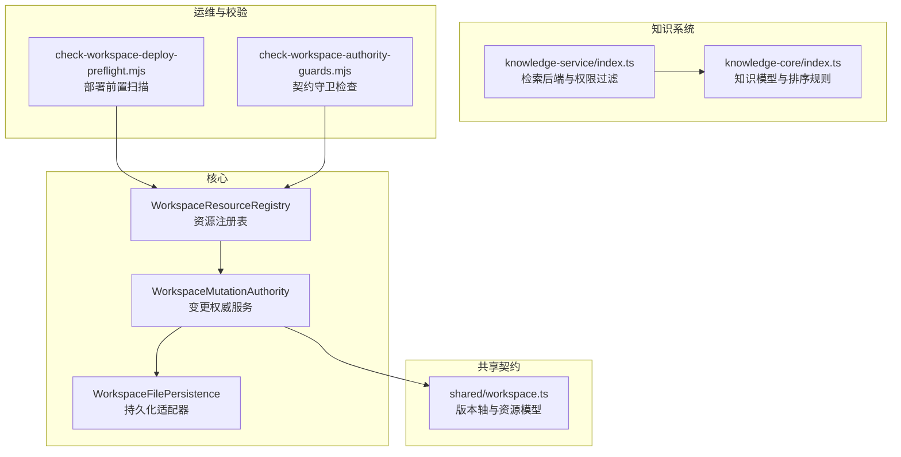
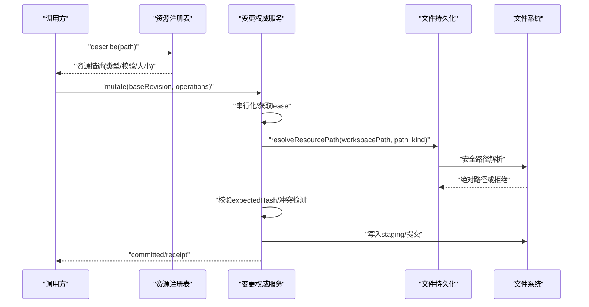
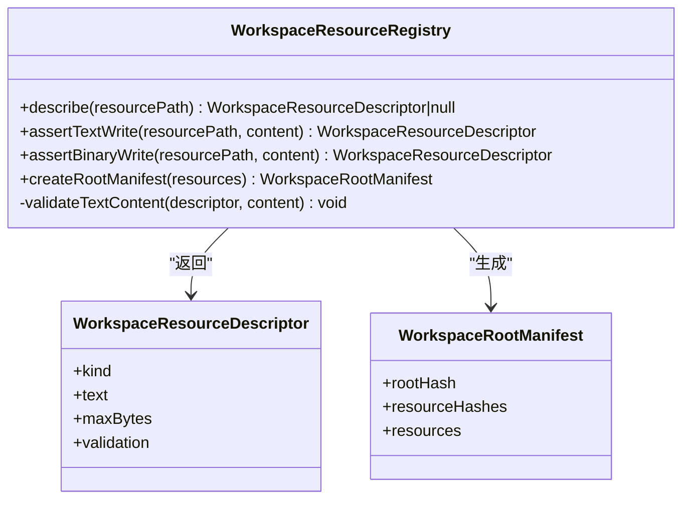
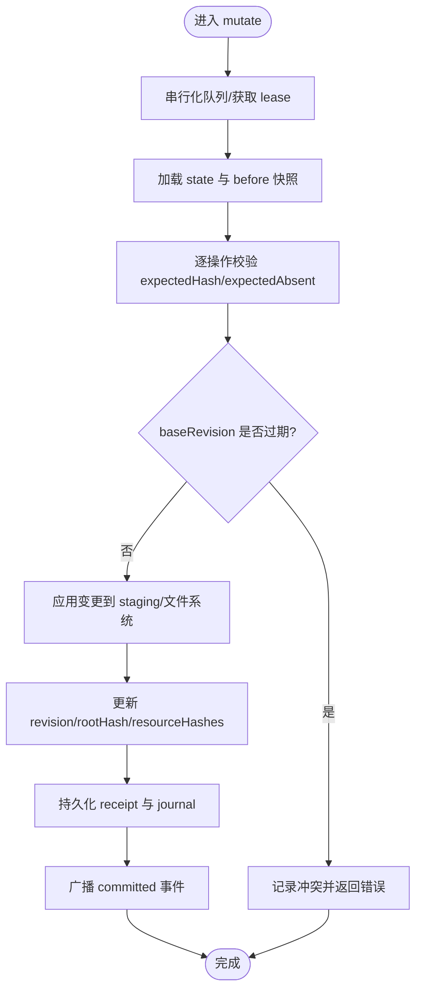
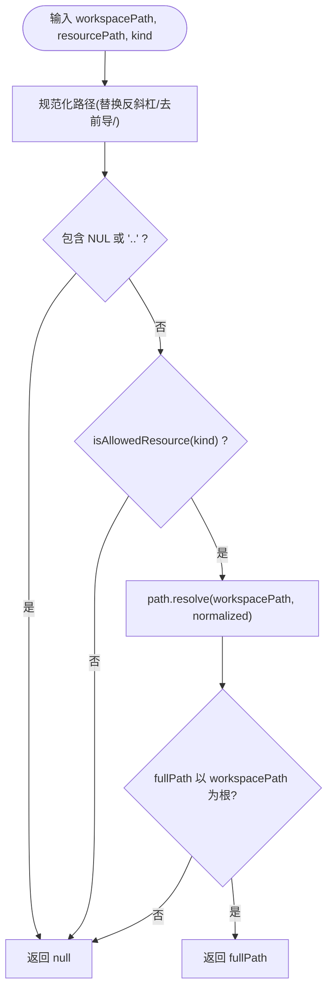
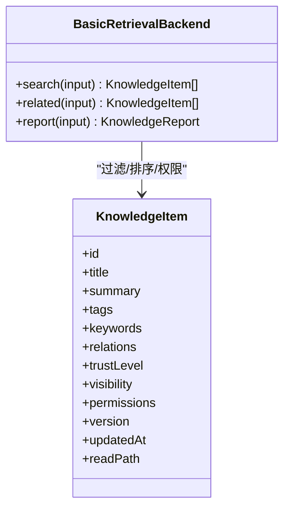
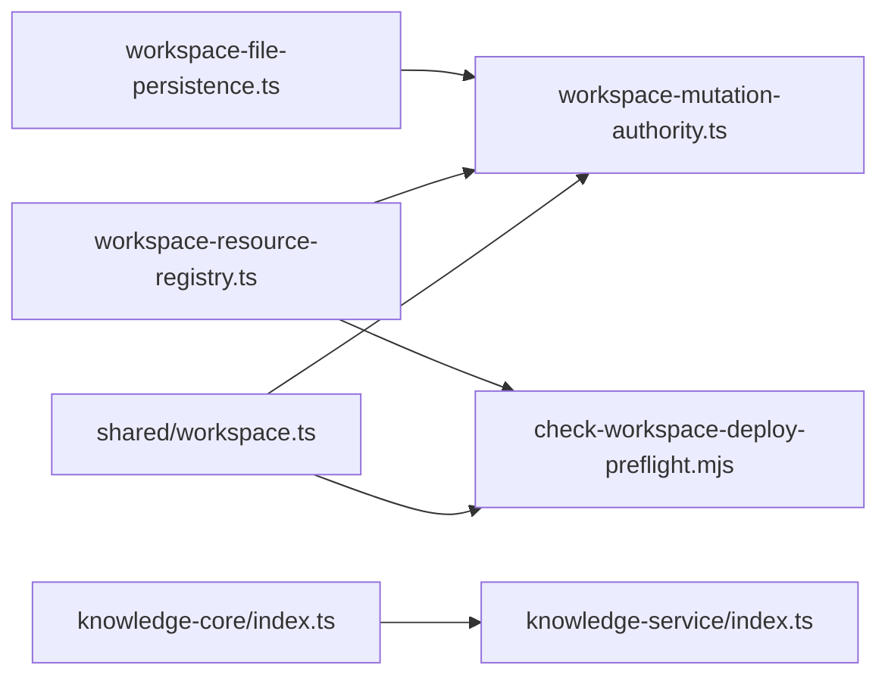

# 工作区资源注册表

<cite>
**本文引用的文件**
- [packages/project-core/src/workspace-resource-registry.ts](file://packages/project-core/src/workspace-resource-registry.ts)
- [packages/project-core/src/__tests__/workspace-resource-registry.test.ts](file://packages/project-core/src/__tests__/workspace-resource-registry.test.ts)
- [packages/agent-service/src/workspace/workspace-mutation-authority.ts](file://packages/agent-service/src/workspace/workspace-mutation-authority.ts)
- [packages/agent-service/src/collab/workspace-file-persistence.ts](file://packages/agent-service/src/collab/workspace-file-persistence.ts)
- [packages/shared/src/workspace.ts](file://packages/shared/src/workspace.ts)
- [packages/knowledge-core/src/index.ts](file://packages/knowledge-core/src/index.ts)
- [packages/knowledge-service/src/index.ts](file://packages/knowledge-service/src/index.ts)
- [scripts/check-workspace-deploy-preflight.mjs](file://scripts/check-workspace-deploy-preflight.mjs)
- [scripts/check-workspace-authority-guards.mjs](file://scripts/check-workspace-authority-guards.mjs)
</cite>

## 目录
1. [简介](#简介)
2. [项目结构](#项目结构)
3. [核心组件](#核心组件)
4. [架构总览](#架构总览)
5. [详细组件分析](#详细组件分析)
6. [依赖关系分析](#依赖关系分析)
7. [性能与一致性](#性能与一致性)
8. [故障排查指南](#故障排查指南)
9. [结论](#结论)
10. [附录：API 参考与使用示例](#附录api-参考与使用示例)

## 简介
本文件围绕“工作区资源注册表”进行系统化技术文档化，覆盖其架构设计、工作原理、资源分类体系、生命周期管理、路径解析与引用机制、元数据与索引、并发控制与锁策略，以及面向开发者的 API 参考与使用示例。目标是帮助开发者准确理解并安全地管理与操作工作区资源。

## 项目结构
工作区资源注册表位于项目核心包中，负责定义受管资源的类型、路径规范、内容校验与根清单生成；同时与变更权威服务（Mutation Authority）协作，实现并发控制、冲突检测与版本推进。知识资源在独立的知识核心与服务层提供检索与权限过滤能力。部署前检查脚本用于扫描工作区受管资源并计算根哈希，确保发布前一致性。

图表来源
- [packages/project-core/src/workspace-resource-registry.ts:1-141](file://packages/project-core/src/workspace-resource-registry.ts#L1-L141)
- [packages/agent-service/src/workspace/workspace-mutation-authority.ts:1-200](file://packages/agent-service/src/workspace/workspace-mutation-authority.ts#L1-L200)
- [packages/agent-service/src/collab/workspace-file-persistence.ts:281-298](file://packages/agent-service/src/collab/workspace-file-persistence.ts#L281-L298)
- [packages/shared/src/workspace.ts:500-526](file://packages/shared/src/workspace.ts#L500-L526)
- [packages/knowledge-core/src/index.ts:126-238](file://packages/knowledge-core/src/index.ts#L126-L238)
- [packages/knowledge-service/src/index.ts:139-165](file://packages/knowledge-service/src/index.ts#L139-L165)
- [scripts/check-workspace-deploy-preflight.mjs:36-99](file://scripts/check-workspace-deploy-preflight.mjs#L36-L99)
- [scripts/check-workspace-authority-guards.mjs:330-383](file://scripts/check-workspace-authority-guards.mjs#L330-L383)

章节来源
- [packages/project-core/src/workspace-resource-registry.ts:1-141](file://packages/project-core/src/workspace-resource-registry.ts#L1-L141)
- [packages/agent-service/src/workspace/workspace-mutation-authority.ts:1-200](file://packages/agent-service/src/workspace/workspace-mutation-authority.ts#L1-L200)
- [packages/agent-service/src/collab/workspace-file-persistence.ts:281-298](file://packages/agent-service/src/collab/workspace-file-persistence.ts#L281-L298)
- [packages/shared/src/workspace.ts:500-526](file://packages/shared/src/workspace.ts#L500-L526)
- [packages/knowledge-core/src/index.ts:126-238](file://packages/knowledge-core/src/index.ts#L126-L238)
- [packages/knowledge-service/src/index.ts:139-165](file://packages/knowledge-service/src/index.ts#L139-L165)
- [scripts/check-workspace-deploy-preflight.mjs:36-99](file://scripts/check-workspace-deploy-preflight.mjs#L36-L99)
- [scripts/check-workspace-authority-guards.mjs:330-383](file://scripts/check-workspace-authority-guards.mjs#L330-L383)

## 核心组件
- 资源注册表（WorkspaceResourceRegistry）
  - 职责：定义受管资源种类、路径规范化、文本/二进制写入断言、内容校验、根清单（root manifest）生成。
  - 关键点：路径安全校验、大小限制、JSON/Schema/Sketch 场景校验、按路径排序的确定性 rootHash。
- 变更权威服务（WorkspaceMutationAuthority）
  - 职责：单写者串行化、乐观锁（baseRevision）、冲突记录与恢复、快照与事件回放、外部漂移检测。
  - 关键点：每工作区队列、lease 持有、prepared 事务、journal 与 receipts、投影确认。
- 文件持久化适配（WorkspaceFilePersistence）
  - 职责：基于文件系统的路径解析、资源读取、状态与事件落盘。
  - 关键点：相对路径到绝对路径的安全转换、越界拒绝、允许资源白名单。
- 共享契约与版本轴（shared/workspace.ts）
  - 职责：定义 ProjectBaseVersion、WorkspaceRevision、CanonicalSyncedRevision 等不可混用的版本轴。
- 知识系统与检索（knowledge-core / knowledge-service）
  - 职责：知识条目模型、信任等级、可见性、标签与关键词、检索与权限过滤。

章节来源
- [packages/project-core/src/workspace-resource-registry.ts:1-141](file://packages/project-core/src/workspace-resource-registry.ts#L1-L141)
- [packages/agent-service/src/workspace/workspace-mutation-authority.ts:1-200](file://packages/agent-service/src/workspace/workspace-mutation-authority.ts#L1-L200)
- [packages/agent-service/src/collab/workspace-file-persistence.ts:281-298](file://packages/agent-service/src/collab/workspace-file-persistence.ts#L281-L298)
- [packages/shared/src/workspace.ts:500-526](file://packages/shared/src/workspace.ts#L500-L526)
- [packages/knowledge-core/src/index.ts:126-238](file://packages/knowledge-core/src/index.ts#L126-L238)
- [packages/knowledge-service/src/index.ts:139-165](file://packages/knowledge-service/src/index.ts#L139-L165)

## 架构总览
工作区资源注册表作为“受管资源”的策略中心，为所有活跃工作区的写入提供统一约束；变更权威服务保证并发安全与一致性；持久化适配将逻辑映射到磁盘；共享契约确保多进程/多实例间对版本轴的语义一致；知识系统提供可检索、可审计的知识资源能力。

图表来源
- [packages/project-core/src/workspace-resource-registry.ts:52-112](file://packages/project-core/src/workspace-resource-registry.ts#L52-L112)
- [packages/agent-service/src/workspace/workspace-mutation-authority.ts:187-200](file://packages/agent-service/src/workspace/workspace-mutation-authority.ts#L187-L200)
- [packages/agent-service/src/collab/workspace-file-persistence.ts:281-298](file://packages/agent-service/src/collab/workspace-file-persistence.ts#L281-L298)

## 详细组件分析

### 资源注册表（WorkspaceResourceRegistry）
- 资源发现与分类
  - 通过 describe(path) 根据路径模式匹配返回资源描述，包括 kind、text/binary、maxBytes、validation。
  - 支持页面代码、原型 HTML/CSS/Meta、页面 Schema、Sketch 场景与 Meta、项目 Schema/运行值、工作区树、画布布局、知识文档/清单、资产等。
- 路径解析与安全
  - normalizeWorkspaceResourcePath 统一斜杠、去除前导斜杠、拒绝空串、NUL 字符与 .. 越界。
- 内容校验
  - assertTextWrite/assertBinaryWrite 分别对文本与二进制做断言，包含大小限制与类型匹配。
  - validateTextContent 针对 JSON 对象、workspace-tree 结构、sketch-scene 文档进行强校验。
- 根清单生成
  - createRootManifest 遍历输入资源，逐项校验并计算 content hash，按路径排序后生成 resourceHashes 与 rootHash，保证顺序无关且内容敏感。

图表来源
- [packages/project-core/src/workspace-resource-registry.ts:21-37](file://packages/project-core/src/workspace-resource-registry.ts#L21-L37)
- [packages/project-core/src/workspace-resource-registry.ts:52-136](file://packages/project-core/src/workspace-resource-registry.ts#L52-L136)

章节来源
- [packages/project-core/src/workspace-resource-registry.ts:1-141](file://packages/project-core/src/workspace-resource-registry.ts#L1-L141)
- [packages/project-core/src/__tests__/workspace-resource-registry.test.ts:1-114](file://packages/project-core/src/__tests__/workspace-resource-registry.test.ts#L1-L114)

### 变更权威服务（WorkspaceMutationAuthority）
- 并发控制与串行化
  - 每个工作区维护一个 Promise 队列，确保同一工作区内的写操作串行执行。
  - withLease 持有 lease，避免多实例竞争。
- 乐观锁与冲突解决
  - mutate 接受 baseRevision，提交时校验当前 revision 是否变化；若 stale 则抛出 WORKSPACE_RESOURCE_CONFLICT。
  - recordMutationConflict 记录冲突日志，便于健康检查与恢复。
- 准备与恢复
  - prepared 事务持久化 before 快照，重启后可恢复未完成的变更。
  - getSnapshot 提供只读快照（排除二进制），用于对比与诊断。
- 外部漂移检测
  - getSnapshot 会比对实际资源哈希与期望 rootHash，不一致时报 WORKSPACE_EXTERNAL_DRIFT。

图表来源
- [packages/agent-service/src/workspace/workspace-mutation-authority.ts:675-708](file://packages/agent-service/src/workspace/workspace-mutation-authority.ts#L675-L708)
- [packages/agent-service/src/workspace/workspace-mutation-authority.ts:725-744](file://packages/agent-service/src/workspace/workspace-mutation-authority.ts#L725-L744)
- [packages/agent-service/src/workspace/workspace-mutation-authority.ts:216-238](file://packages/agent-service/src/workspace/workspace-mutation-authority.ts#L216-L238)

章节来源
- [packages/agent-service/src/workspace/workspace-mutation-authority.ts:1-200](file://packages/agent-service/src/workspace/workspace-mutation-authority.ts#L1-L200)
- [packages/agent-service/src/workspace/workspace-mutation-authority.ts:675-744](file://packages/agent-service/src/workspace/workspace-mutation-authority.ts#L675-L744)

### 文件持久化适配（WorkspaceFilePersistence）
- 路径解析
  - resolveResourcePath 将相对路径规范化为绝对路径，拒绝包含 NUL 与 .. 的路径，并校验是否在允许的 kind 白名单内。
  - 最终确保 fullpath 以 workspacePath 为根，防止越界访问。
- 资源读取
  - 读取资源内容并按 kind 区分文本/二进制，供快照与诊断使用。

图表来源
- [packages/agent-service/src/collab/workspace-file-persistence.ts:281-298](file://packages/agent-service/src/collab/workspace-file-persistence.ts#L281-L298)

章节来源
- [packages/agent-service/src/collab/workspace-file-persistence.ts:281-298](file://packages/agent-service/src/collab/workspace-file-persistence.ts#L281-L298)

### 知识资源与检索
- 知识模型
  - 定义知识条目、索引任务、阅读地图、报告等数据结构，包含信任等级、可见性、来源类型等。
- 检索与权限
  - BasicRetrievalBackend 支持按 query、tags、sourceTypes 过滤，按信任等级与来源优先级排序，并在 related/report 中遵循权限控制。

图表来源
- [packages/knowledge-core/src/index.ts:126-238](file://packages/knowledge-core/src/index.ts#L126-L238)
- [packages/knowledge-service/src/index.ts:139-165](file://packages/knowledge-service/src/index.ts#L139-L165)

章节来源
- [packages/knowledge-core/src/index.ts:126-238](file://packages/knowledge-core/src/index.ts#L126-L238)
- [packages/knowledge-service/src/index.ts:139-165](file://packages/knowledge-service/src/index.ts#L139-L165)

## 依赖关系分析
- 资源注册表依赖共享契约中的受管资源判定与路径工具，被变更权威服务与部署前置检查复用。
- 变更权威服务依赖持久化适配进行路径解析与读写，并通过共享契约的类型与错误码对外暴露稳定接口。
- 知识服务依赖知识核心定义的模型与排序规则，实现检索与权限过滤。
- 部署前置脚本通过 isManagedWorkspaceResource 与根哈希算法对工作区进行一致性扫描。

图表来源
- [packages/shared/src/workspace.ts:500-526](file://packages/shared/src/workspace.ts#L500-L526)
- [packages/project-core/src/workspace-resource-registry.ts:1-141](file://packages/project-core/src/workspace-resource-registry.ts#L1-L141)
- [packages/agent-service/src/workspace/workspace-mutation-authority.ts:1-200](file://packages/agent-service/src/workspace/workspace-mutation-authority.ts#L1-L200)
- [packages/agent-service/src/collab/workspace-file-persistence.ts:281-298](file://packages/agent-service/src/collab/workspace-file-persistence.ts#L281-L298)
- [packages/knowledge-core/src/index.ts:126-238](file://packages/knowledge-core/src/index.ts#L126-L238)
- [packages/knowledge-service/src/index.ts:139-165](file://packages/knowledge-service/src/index.ts#L139-L165)
- [scripts/check-workspace-deploy-preflight.mjs:36-99](file://scripts/check-workspace-deploy-preflight.mjs#L36-L99)

章节来源
- [packages/shared/src/workspace.ts:500-526](file://packages/shared/src/workspace.ts#L500-L526)
- [packages/project-core/src/workspace-resource-registry.ts:1-141](file://packages/project-core/src/workspace-resource-registry.ts#L1-L141)
- [packages/agent-service/src/workspace/workspace-mutation-authority.ts:1-200](file://packages/agent-service/src/workspace/workspace-mutation-authority.ts#L1-L200)
- [packages/agent-service/src/collab/workspace-file-persistence.ts:281-298](file://packages/agent-service/src/collab/workspace-file-persistence.ts#L281-L298)
- [packages/knowledge-core/src/index.ts:126-238](file://packages/knowledge-core/src/index.ts#L126-L238)
- [packages/knowledge-service/src/index.ts:139-165](file://packages/knowledge-service/src/index.ts#L139-L165)
- [scripts/check-workspace-deploy-preflight.mjs:36-99](file://scripts/check-workspace-deploy-preflight.mjs#L36-L99)

## 性能与一致性
- 根清单生成
  - 按路径排序确保输入顺序无关，content hash 保证内容敏感；适合快速比较与增量同步。
- 并发与锁
  - 每工作区串行队列 + lease 持有，避免多实例竞争；prepared 事务保障失败恢复。
- 冲突与漂移
  - 乐观锁 baseRevision 检测冲突；getSnapshot 对比 rootHash 检测外部漂移，提前阻断不一致写入。
- 知识检索
  - 内存过滤与排序，支持 tags、sourceTypes 与信任等级排序，适合在线问答与推荐。

[本节为通用指导，不直接分析具体文件]

## 故障排查指南
- 常见错误码
  - WORKSPACE_INVALID_OPERATION：路径非法、类型不匹配、内容校验失败、二进制非 Buffer 等。
  - WORKSPACE_RESOURCE_CONFLICT：baseRevision 过期，存在并发冲突。
  - WORKSPACE_EXTERNAL_DRIFT：实际 rootHash 与期望不一致，存在外部修改。
  - WORKSPACE_AUTHORITY_NOT_READY：权威服务尚未就绪。
- 定位步骤
  - 使用 getSnapshot 对比 state.rootHash 与实际资源哈希，定位漂移。
  - 查看 conflict 日志与 prepared 事务，判断是否未完成的事务导致阻塞。
  - 检查持久化适配的路径解析结果，确认是否因越界或白名单拒绝。
  - 使用部署前置脚本扫描受管资源，验证 rootHash 一致性。

章节来源
- [packages/agent-service/src/workspace/workspace-mutation-authority.ts:675-744](file://packages/agent-service/src/workspace/workspace-mutation-authority.ts#L675-L744)
- [packages/agent-service/src/workspace/workspace-mutation-authority.ts:216-238](file://packages/agent-service/src/workspace/workspace-mutation-authority.ts#L216-L238)
- [scripts/check-workspace-deploy-preflight.mjs:36-99](file://scripts/check-workspace-deploy-preflight.mjs#L36-L99)

## 结论
工作区资源注册表通过严格的资源分类、路径安全与内容校验，结合变更权威服务的串行化与乐观锁，实现了高可靠的工作区资源管理。知识系统提供可检索、可审计的知识资源能力。整体架构清晰、可扩展，适合在生产环境中稳定运行。

[本节为总结，不直接分析具体文件]

## 附录：API 参考与使用示例

### 资源注册表 API
- describe(resourcePath)
  - 作用：返回资源描述（类型、文本/二进制、最大字节、校验策略）。
  - 用法：在写入前校验路径与类型是否符合预期。
- assertTextWrite(resourcePath, content)
  - 作用：断言文本写入，校验大小与内容格式（JSON/Schema/Sketch）。
- assertBinaryWrite(resourcePath, content)
  - 作用：断言二进制写入，要求 Buffer 且非空、不超过上限。
- createRootManifest(resources)
  - 作用：生成根清单，包含 rootHash、resourceHashes 与 entries。
  - 注意：输入顺序不影响输出；任何未受管路径或类型不匹配将抛错。

章节来源
- [packages/project-core/src/workspace-resource-registry.ts:52-136](file://packages/project-core/src/workspace-resource-registry.ts#L52-L136)
- [packages/project-core/src/__tests__/workspace-resource-registry.test.ts:1-114](file://packages/project-core/src/__tests__/workspace-resource-registry.test.ts#L1-L114)

### 变更权威服务 API（HTTP/WebSocket）
- GET /api/workspace-authority/projects/:projectId/workspaces/:workspaceId/state
  - 作用：获取权威状态（revision、rootHash、resourceHashes）。
- GET /api/workspace-authority/projects/:projectId/workspaces/:workspaceId/resources/*
  - 作用：读取指定资源内容（文本/二进制）。
- GET /api/workspace-authority/projects/:projectId/workspaces/:workspaceId/events?afterRevision=...
  - 作用：拉取已提交的变更事件。
- GET /api/workspace-authority/projects/:projectId/workspaces/:workspaceId/projection-acks?afterRevision=...
  - 作用：拉取投影确认事件。
- WS /api/workspace-authority/projects/:projectId/workspaces/:workspaceId/stream?afterRevision=...
  - 作用：实时流式接收 committed 与 projection ack 事件。
- GET /api/workspace-authority/projects/:projectId/workspaces/:workspaceId/snapshot
  - 作用：获取只读快照（文本资源内容），用于对比与诊断。

章节来源
- [packages/agent-service/src/routes/workspace-authority.ts:1-200](file://packages/agent-service/src/routes/workspace-authority.ts#L1-L200)

### 路径解析与引用机制
- 相对路径处理
  - 通过 resolveResourcePath 将相对路径规范化为绝对路径，拒绝越界与非法字符。
- 绝对路径转换
  - 使用 path.resolve 拼接 workspacePath 与 normalized，再校验以 workspacePath 为根。
- 资源定位算法
  - 先白名单校验（kind），再进行路径安全校验，最后返回绝对路径供后续读写。

章节来源
- [packages/agent-service/src/collab/workspace-file-persistence.ts:281-298](file://packages/agent-service/src/collab/workspace-file-persistence.ts#L281-L298)

### 元数据管理与搜索索引
- 资源属性与标签
  - 知识条目包含 title、summary、tags、keywords、relations、trustLevel、visibility、permissions 等。
- 搜索索引
  - BasicRetrievalBackend 支持按 query、tags、sourceTypes 过滤，按信任等级与来源优先级排序。
- 权限控制
  - search/readSummary/related/report 均遵循 visibility 与 permissions 控制。

章节来源
- [packages/knowledge-core/src/index.ts:126-238](file://packages/knowledge-core/src/index.ts#L126-L238)
- [packages/knowledge-service/src/index.ts:139-165](file://packages/knowledge-service/src/index.ts#L139-L165)

### 并发控制与锁机制
- 串行化队列
  - 每工作区一个 Promise 队列，确保写操作串行。
- Lease 持有
  - withLease 持有 lease，避免多实例竞争。
- 乐观锁
  - baseRevision 校验，冲突时返回 WORKSPACE_RESOURCE_CONFLICT。
- 冲突记录与恢复
  - recordMutationConflict 记录冲突；prepared 事务支持恢复。

章节来源
- [packages/agent-service/src/workspace/workspace-mutation-authority.ts:112-127](file://packages/agent-service/src/workspace/workspace-mutation-authority.ts#L112-L127)
- [packages/agent-service/src/workspace/workspace-mutation-authority.ts:675-708](file://packages/agent-service/src/workspace/workspace-mutation-authority.ts#L675-L708)
- [packages/agent-service/src/workspace/workspace-mutation-authority.ts:725-744](file://packages/agent-service/src/workspace/workspace-mutation-authority.ts#L725-L744)

### 版本控制策略
- 版本轴
  - ProjectBaseVersion、WorkspaceRevision、CanonicalSyncedRevision 严格区分，禁止混用。
- 根哈希
  - createRootManifest 生成 rootHash，用于一致性校验与发布前扫描。
- 部署前置检查
  - check-workspace-deploy-preflight.mjs 扫描受管资源并计算 rootHash，确保发布前一致。

章节来源
- [packages/shared/src/workspace.ts:500-526](file://packages/shared/src/workspace.ts#L500-L526)
- [packages/project-core/src/workspace-resource-registry.ts:90-112](file://packages/project-core/src/workspace-resource-registry.ts#L90-L112)
- [scripts/check-workspace-deploy-preflight.mjs:36-99](file://scripts/check-workspace-deploy-preflight.mjs#L36-L99)

### 使用示例（概念流程）
- 创建资源
  - 使用 describe 确定资源类型与校验策略，调用 assertTextWrite/assertBinaryWrite 进行写入前校验。
- 提交变更
  - 构造 operations，携带 baseRevision 与 expectedHash，调用 mutate；如冲突则重试或提示用户。
- 监听事件
  - 订阅 stream 或轮询 events/projection-acks，同步最新 revision 与 rootHash。
- 生成根清单
  - 批量资源提交前，使用 createRootManifest 生成 rootHash，用于快照与一致性校验。

[本节为概念流程，不直接分析具体文件]