# 文件系统抽象层

<cite>
**本文引用的文件**   
- [packages/author-site/src/lib/fs-utils.ts](file://packages/author-site/src/lib/fs-utils.ts)
- [packages/agent-service/src/session/snapshot-service.ts](file://packages/agent-service/src/session/snapshot-service.ts)
- [packages/agent-service/src/backends/managers/permission-manager.ts](file://packages/agent-service/src/backends/managers/permission-manager.ts)
- [packages/agent-service/src/backends/pi-tools/permissions.ts](file://packages/agent-service/src/backends/pi-tools/permissions.ts)
- [packages/project-core/src/workspace-resource-registry.ts](file://packages/project-core/src/workspace-resource-registry.ts)
- [packages/author-site/src/lib/workspace-autosave-scheduler.ts](file://packages/author-site/src/lib/workspace-autosave-scheduler.ts)
- [packages/author-site/src/app/demo/[id]/edit/page.tsx](file://packages/author-site/src/app/demo/[id]/edit/page.tsx)
- [packages/agent-service/src/routes/agent.ts](file://packages/agent-service/src/routes/agent.ts)
- [packages/author-site/lib/parser.ts](file://packages/author-site/lib/parser.ts)
- [packages/project-scaffold/src/index.ts](file://packages/project-scaffold/src/index.ts)
</cite>

## 目录
1. [简介](#简介)
2. [项目结构](#项目结构)
3. [核心组件](#核心组件)
4. [架构总览](#架构总览)
5. [详细组件分析](#详细组件分析)
6. [依赖关系分析](#依赖关系分析)
7. [性能考量](#性能考量)
8. [故障排查指南](#故障排查指南)
9. [结论](#结论)
10. [附录：API 参考与最佳实践](#附录api-参考与最佳实践)

## 简介
本技术文档围绕“文件系统抽象层”展开，聚焦以下目标：
- 虚拟文件系统（VFS）的架构设计与实现原理：文件操作抽象、路径解析与权限控制。
- 快照系统机制：快照创建、差异计算、合并策略与回滚能力。
- 增删改查（CRUD）与批量操作、事务处理与错误恢复。
- 编码与解码：文本、二进制与 JSON 的处理规范。
- 监控与变更通知：增量同步、事件监听与性能优化。
- 压缩与存储优化：去重算法、压缩格式与存储空间管理。
- API 参考与最佳实践：帮助开发者在业务逻辑中正确使用该抽象层。

## 项目结构
本仓库采用多包（monorepo）组织，文件系统抽象相关的关键代码分布在 author-site、agent-service、project-core 等包中：
- author-site：工作区清单、页面元数据、自动保存调度器、混合格式解析器等。
- agent-service：快照服务、权限管理器、工具调用权限校验、Agent 路由中的撤销流程。
- project-core：工作区资源描述符与写入校验（文本/二进制/JSON）。
- project-scaffold：项目脚手架导出与打包（含 CRC 校验与 zip 构建）。

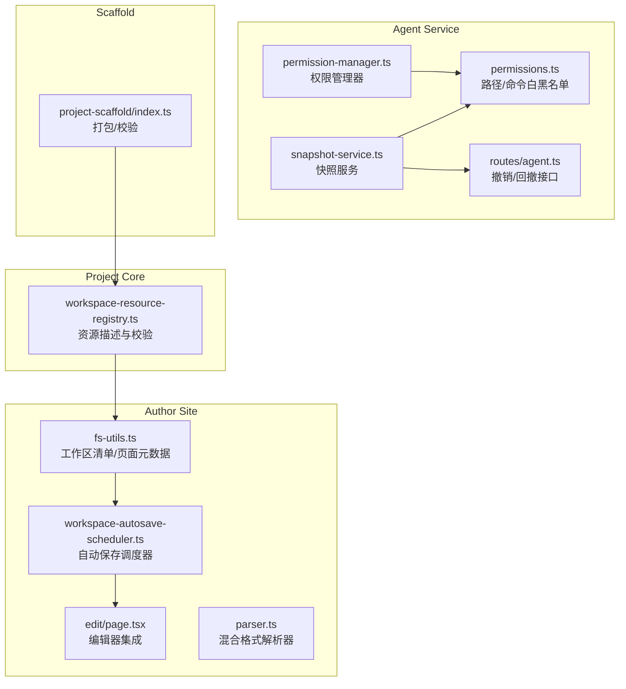

图表来源
- [packages/author-site/src/lib/fs-utils.ts:558-697](file://packages/author-site/src/lib/fs-utils.ts#L558-L697)
- [packages/author-site/src/lib/workspace-autosave-scheduler.ts:1-69](file://packages/author-site/src/lib/workspace-autosave-scheduler.ts#L1-L69)
- [packages/author-site/src/app/demo/[id]/edit/page.tsx:4716-4746](file://packages/author-site/src/app/demo/[id]/edit/page.tsx#L4716-L4746)
- [packages/agent-service/src/session/snapshot-service.ts:1-342](file://packages/agent-service/src/session/snapshot-service.ts#L1-L342)
- [packages/agent-service/src/backends/managers/permission-manager.ts:1-200](file://packages/agent-service/src/backends/managers/permission-manager.ts#L1-L200)
- [packages/agent-service/src/backends/pi-tools/permissions.ts:1-131](file://packages/agent-service/src/backends/pi-tools/permissions.ts#L1-L131)
- [packages/project-core/src/workspace-resource-registry.ts:63-88](file://packages/project-core/src/workspace-resource-registry.ts#L63-L88)
- [packages/project-scaffold/src/index.ts:860-927](file://packages/project-scaffold/src/index.ts#L860-L927)

章节来源
- [packages/author-site/src/lib/fs-utils.ts:558-697](file://packages/author-site/src/lib/fs-utils.ts#L558-L697)
- [packages/agent-service/src/session/snapshot-service.ts:1-342](file://packages/agent-service/src/session/snapshot-service.ts#L1-L342)
- [packages/agent-service/src/backends/managers/permission-manager.ts:1-200](file://packages/agent-service/src/backends/managers/permission-manager.ts#L1-L200)
- [packages/agent-service/src/backends/pi-tools/permissions.ts:1-131](file://packages/agent-service/src/backends/pi-tools/permissions.ts#L1-L131)
- [packages/project-core/src/workspace-resource-registry.ts:63-88](file://packages/project-core/src/workspace-resource-registry.ts#L63-L88)
- [packages/author-site/src/lib/workspace-autosave-scheduler.ts:1-69](file://packages/author-site/src/lib/workspace-autosave-scheduler.ts#L1-L69)
- [packages/author-site/src/app/demo/[id]/edit/page.tsx:4716-4746](file://packages/author-site/src/app/demo/[id]/edit/page.tsx#L4716-L4746)
- [packages/project-scaffold/src/index.ts:860-927](file://packages/project-scaffold/src/index.ts#L860-L927)

## 核心组件
- 工作区清单与页面元数据：通过 workspace-tree.json 统一管理文件夹与页面元数据，提供读取、写入、迁移与发现能力。
- 快照服务：支持 Git 仓库与非 Git 目录两种模式，提供初始化、对比、暂存/取消暂存、丢弃/重置文件等操作。
- 权限管理器：对工具调用的路径访问进行白名单/黑名单校验，并保护知识库目录不可写；支持异步审批流。
- 资源注册表：按路径模式识别资源类型（文本/二进制/JSON），并进行大小与内容校验。
- 自动保存调度器：基于 debounce 与 max-wait 的批处理提交，保证单 in-flight 与 revision 单调回执。
- 混合格式解析器：用于 Figma 导出的分隔符格式（CODE/SCHEMA）的解析、构建与修复。
- 脚手架打包：对条目进行 CRC 校验并生成 zip 包，便于导出与分发。

章节来源
- [packages/author-site/src/lib/fs-utils.ts:558-697](file://packages/author-site/src/lib/fs-utils.ts#L558-L697)
- [packages/agent-service/src/session/snapshot-service.ts:1-342](file://packages/agent-service/src/session/snapshot-service.ts#L1-L342)
- [packages/agent-service/src/backends/managers/permission-manager.ts:1-200](file://packages/agent-service/src/backends/managers/permission-manager.ts#L1-L200)
- [packages/agent-service/src/backends/pi-tools/permissions.ts:1-131](file://packages/agent-service/src/backends/pi-tools/permissions.ts#L1-L131)
- [packages/project-core/src/workspace-resource-registry.ts:63-88](file://packages/project-core/src/workspace-resource-registry.ts#L63-L88)
- [packages/author-site/src/lib/workspace-autosave-scheduler.ts:1-69](file://packages/author-site/src/lib/workspace-autosave-scheduler.ts#L1-L69)
- [packages/author-site/lib/parser.ts:1-169](file://packages/author-site/lib/parser.ts#L1-L169)
- [packages/project-scaffold/src/index.ts:860-927](file://packages/project-scaffold/src/index.ts#L860-L927)

## 架构总览
下图展示了从编辑器到后端的核心交互链路：编辑触发自动保存调度器，调度器将脏资源批量提交；后端通过权限管理器校验路径与命令，使用快照服务进行差异比较与回滚；同时工作区清单与资源注册表保障元数据一致性与内容合法性。

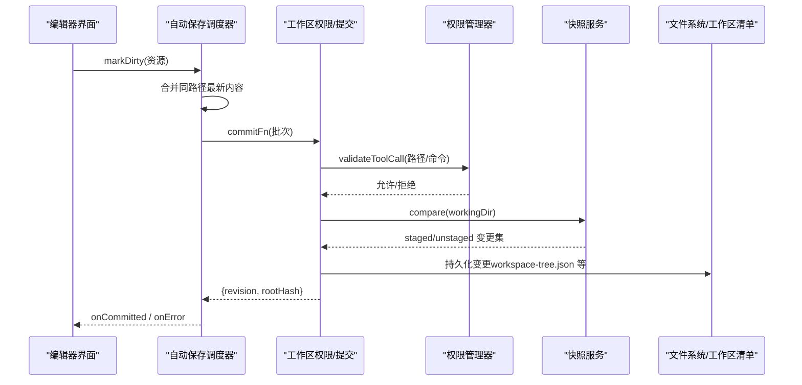

图表来源
- [packages/author-site/src/lib/workspace-autosave-scheduler.ts:1-69](file://packages/author-site/src/lib/workspace-autosave-scheduler.ts#L1-L69)
- [packages/author-site/src/app/demo/[id]/edit/page.tsx:4716-4746](file://packages/author-site/src/app/demo/[id]/edit/page.tsx#L4716-L4746)
- [packages/agent-service/src/backends/managers/permission-manager.ts:1-200](file://packages/agent-service/src/backends/managers/permission-manager.ts#L1-L200)
- [packages/agent-service/src/session/snapshot-service.ts:1-342](file://packages/agent-service/src/session/snapshot-service.ts#L1-L342)
- [packages/author-site/src/lib/fs-utils.ts:558-697](file://packages/author-site/src/lib/fs-utils.ts#L558-L697)

## 详细组件分析

### 工作区清单与页面元数据（fs-utils）
- 统一清单：以 workspace-tree.json 集中维护 folders 与 pages，替代旧版 .folders.json 与 demos/*/ .demo.json。
- 迁移与兼容：当清单不存在时，自动扫描旧结构并迁移为新清单；同时支持磁盘发现补充缺失页面。
- 路由键规范化：确保 routeKey 唯一且合法，必要时自动生成或修正。
- 页面有效性判定：根据 runtimeType 检查对应入口文件是否存在（index.tsx、prototype.html、sketch.scene.json）。

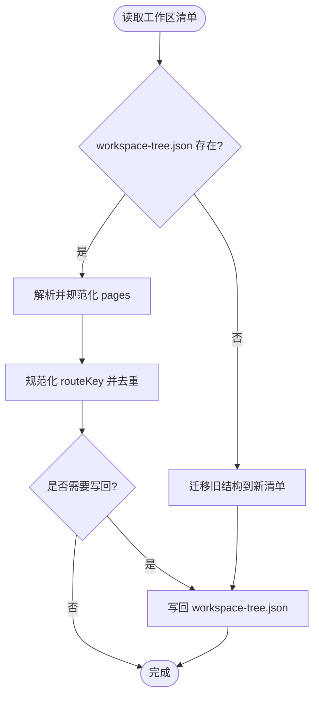

图表来源
- [packages/author-site/src/lib/fs-utils.ts:558-697](file://packages/author-site/src/lib/fs-utils.ts#L558-L697)
- [packages/author-site/src/lib/fs-utils.ts:763-800](file://packages/author-site/src/lib/fs-utils.ts#L763-L800)

章节来源
- [packages/author-site/src/lib/fs-utils.ts:558-697](file://packages/author-site/src/lib/fs-utils.ts#L558-L697)
- [packages/author-site/src/lib/fs-utils.ts:763-800](file://packages/author-site/src/lib/fs-utils.ts#L763-L800)

### 快照服务（SnapshotService）
- 初始化：检测是否为 Git 仓库；若是则记录分支信息，否则扫描目录建立内存快照。
- 差异比较：Git 模式下通过 git status --porcelain 获取 staged/unstaged；非 Git 模式通过内存快照与当前文件内容/mtime 对比。
- 暂存/取消暂存：仅对 Git 仓库生效，调用 git add/reset。
- 丢弃/重置：Git 模式用 checkout HEAD 或删除新建文件；非 Git 模式依据内存快照还原或删除。

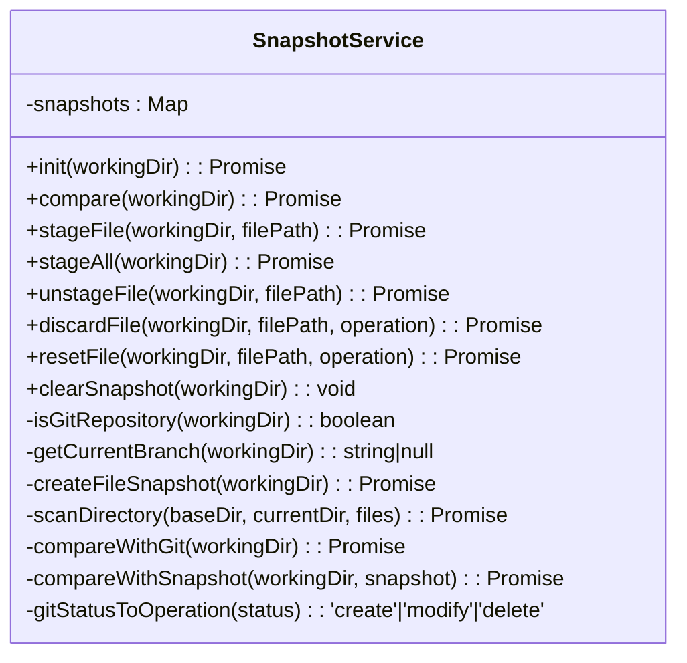

图表来源
- [packages/agent-service/src/session/snapshot-service.ts:1-342](file://packages/agent-service/src/session/snapshot-service.ts#L1-L342)

章节来源
- [packages/agent-service/src/session/snapshot-service.ts:1-342](file://packages/agent-service/src/session/snapshot-service.ts#L1-L342)

### 权限管理器与路径/命令策略
- 路径权限：基于 workingDir 做绝对路径归一化，结合白名单/黑名单 glob 匹配，阻止越界访问。
- 知识库写保护：禁止 AI 代理修改 knowledge 目录下的文件。
- 命令白名单：限制可执行命令集合，防止危险操作（如 rm、sudo、npm/npx 动态执行等）。
- 异步审批：deletePage 与计划审批通过事件回调等待用户确认，支持超时。

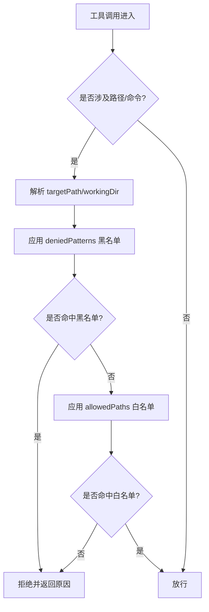

图表来源
- [packages/agent-service/src/backends/pi-tools/permissions.ts:1-131](file://packages/agent-service/src/backends/pi-tools/permissions.ts#L1-L131)
- [packages/agent-service/src/backends/managers/permission-manager.ts:1-200](file://packages/agent-service/src/backends/managers/permission-manager.ts#L1-L200)

章节来源
- [packages/agent-service/src/backends/pi-tools/permissions.ts:1-131](file://packages/agent-service/src/backends/pi-tools/permissions.ts#L1-L131)
- [packages/agent-service/src/backends/managers/permission-manager.ts:1-200](file://packages/agent-service/src/backends/managers/permission-manager.ts#L1-L200)

### 自动保存调度器（WorkspaceAutosaveScheduler）
- 批处理策略：800ms debounce 与 3000ms max-wait，确保高频编辑下仍稳定提交。
- 单 in-flight：同一时间最多一个 mutation 在执行，期间新 dirty 进入下一批。
- 单调回执：只接受 revision >= 已应用的回执，避免乱序覆盖。
- 错误处理：失败回调上报错误，成功回调更新状态并清理 pending。

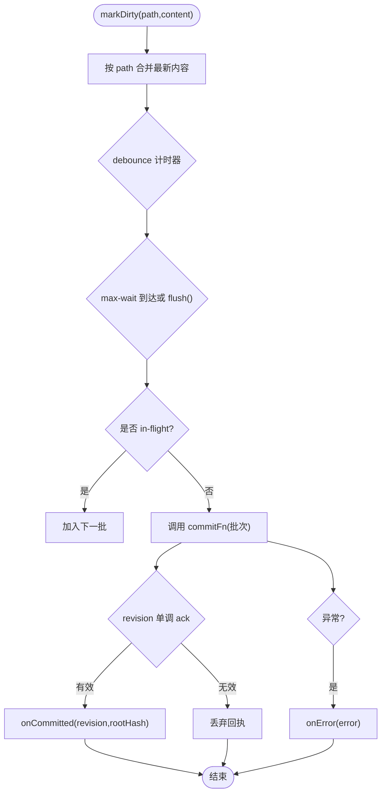

图表来源
- [packages/author-site/src/lib/workspace-autosave-scheduler.ts:1-69](file://packages/author-site/src/lib/workspace-autosave-scheduler.ts#L1-L69)
- [packages/author-site/src/lib/workspace-autosave-scheduler.ts:214-250](file://packages/author-site/src/lib/workspace-autosave-scheduler.ts#L214-L250)
- [packages/author-site/src/app/demo/[id]/edit/page.tsx:4716-4746](file://packages/author-site/src/app/demo/[id]/edit/page.tsx#L4716-L4746)

章节来源
- [packages/author-site/src/lib/workspace-autosave-scheduler.ts:1-69](file://packages/author-site/src/lib/workspace-autosave-scheduler.ts#L1-L69)
- [packages/author-site/src/lib/workspace-autosave-scheduler.ts:214-250](file://packages/author-site/src/lib/workspace-autosave-scheduler.ts#L214-L250)
- [packages/author-site/src/app/demo/[id]/edit/page.tsx:4716-4746](file://packages/author-site/src/app/demo/[id]/edit/page.tsx#L4716-L4746)

### 混合格式解析器（Figma 导出）
- 解析：识别 CODE/SCHEMA 分隔符与 END 标记，提取代码与 schema。
- 构建：将 code 与 schema 拼接为带分隔符的文本。
- 校验：验证分隔符存在性与顺序。
- 修复：尝试自动补全缺失分隔符并统一换行符。

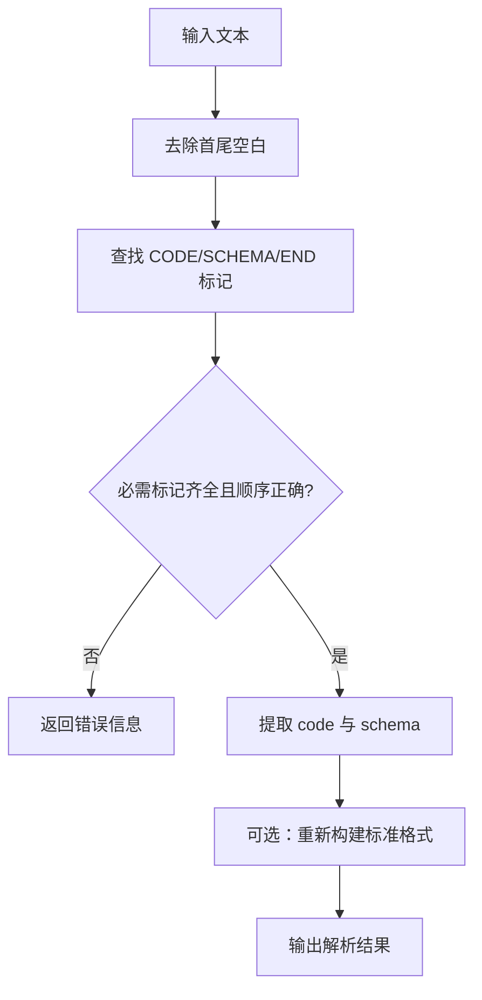

图表来源
- [packages/author-site/lib/parser.ts:1-169](file://packages/author-site/lib/parser.ts#L1-L169)

章节来源
- [packages/author-site/lib/parser.ts:1-169](file://packages/author-site/lib/parser.ts#L1-L169)

### 撤销/回撤流程（Agent 路由）
- 指定文件回撤：遍历目标文件列表，若存在于变更集中则调用 discardFile 恢复。
- 全量回撤：比较工作区变更集，逐个丢弃所有修改过的文件。
- 结果反馈：返回成功回撤与失败的文件列表。

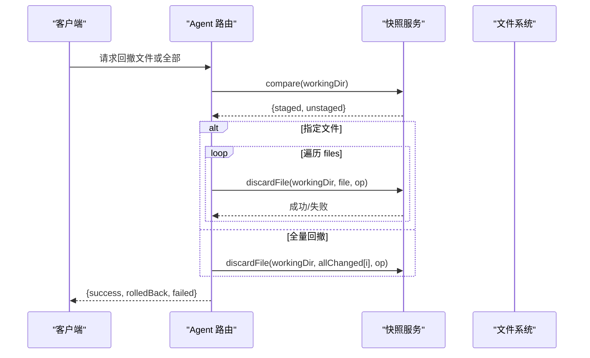

图表来源
- [packages/agent-service/src/routes/agent.ts:396-430](file://packages/agent-service/src/routes/agent.ts#L396-L430)
- [packages/agent-service/src/session/snapshot-service.ts:298-333](file://packages/agent-service/src/session/snapshot-service.ts#L298-L333)

章节来源
- [packages/agent-service/src/routes/agent.ts:396-430](file://packages/agent-service/src/routes/agent.ts#L396-L430)
- [packages/agent-service/src/session/snapshot-service.ts:298-333](file://packages/agent-service/src/session/snapshot-service.ts#L298-L333)

### 资源描述与写入校验（project-core）
- 资源识别：根据路径模式识别资源种类（如 workspace-tree、project-config、knowledge 文档、assets 等）。
- 文本写入校验：限定最大字节数与 JSON 对象格式。
- 二进制写入校验：要求非空且不超过上限。

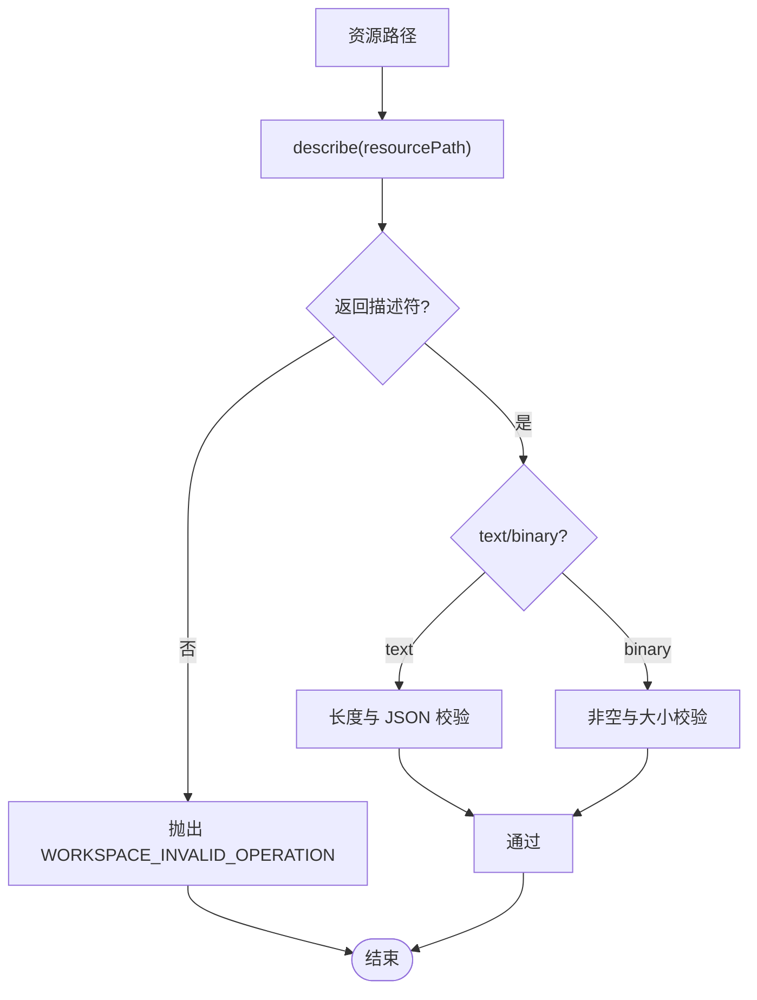

图表来源
- [packages/project-core/src/workspace-resource-registry.ts:63-88](file://packages/project-core/src/workspace-resource-registry.ts#L63-L88)

章节来源
- [packages/project-core/src/workspace-resource-registry.ts:63-88](file://packages/project-core/src/workspace-resource-registry.ts#L63-L88)

### 脚手架打包与校验（project-scaffold）
- 条目遍历：对每个条目计算 CRC 校验值，构造本地头、名称与数据块。
- 中央目录与结束：汇总条目后生成中央目录与结束记录，最终拼接为完整 zip。
- 导出封装：对外暴露导出函数，封装错误码与消息。

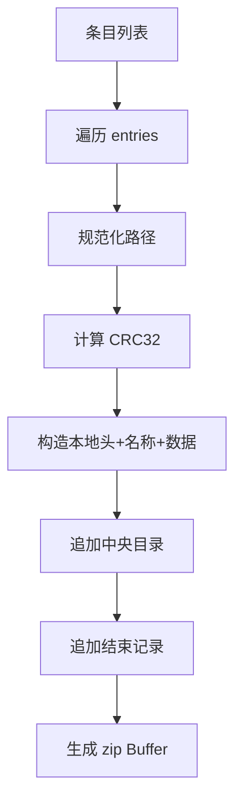

图表来源
- [packages/project-scaffold/src/index.ts:860-927](file://packages/project-scaffold/src/index.ts#L860-L927)

章节来源
- [packages/project-scaffold/src/index.ts:860-927](file://packages/project-scaffold/src/index.ts#L860-L927)

## 依赖关系分析
- fs-utils 依赖共享类型与工作区清单读写，负责页面元数据与目录树一致性。
- snapshot-service 依赖文件系统与子进程（git），提供差异与回滚能力。
- permission-manager 依赖 permissions 策略与事件回调，承担工具调用拦截与审批。
- workspace-autosave-scheduler 由编辑器集成，驱动批量提交与状态同步。
- workspace-resource-registry 提供资源描述与写入前校验，保障内容安全。
- project-scaffold 提供打包与校验能力，支撑项目导出。

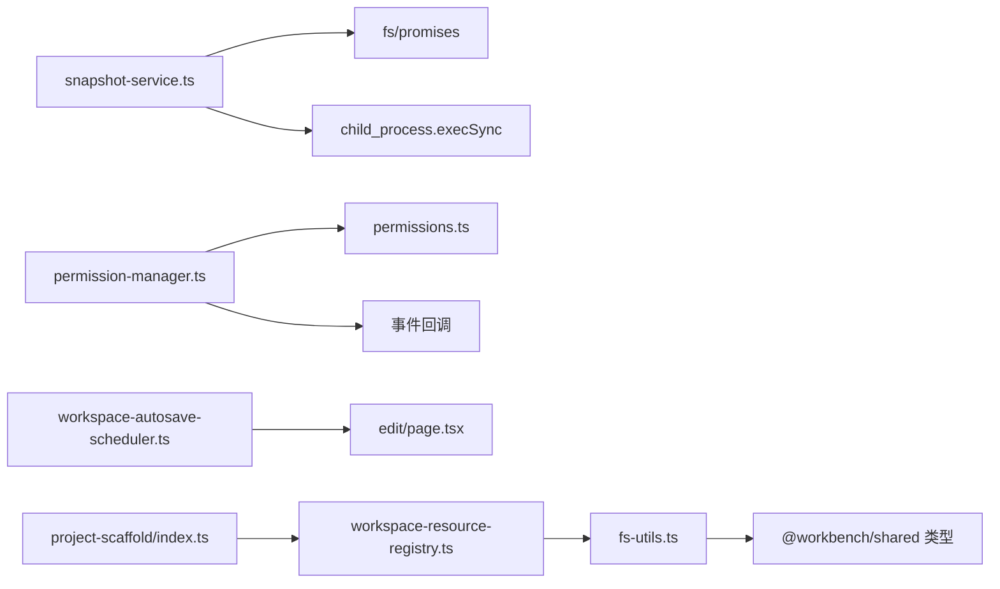

图表来源
- [packages/author-site/src/lib/fs-utils.ts:558-697](file://packages/author-site/src/lib/fs-utils.ts#L558-L697)
- [packages/agent-service/src/session/snapshot-service.ts:1-342](file://packages/agent-service/src/session/snapshot-service.ts#L1-L342)
- [packages/agent-service/src/backends/managers/permission-manager.ts:1-200](file://packages/agent-service/src/backends/managers/permission-manager.ts#L1-L200)
- [packages/agent-service/src/backends/pi-tools/permissions.ts:1-131](file://packages/agent-service/src/backends/pi-tools/permissions.ts#L1-L131)
- [packages/author-site/src/lib/workspace-autosave-scheduler.ts:1-69](file://packages/author-site/src/lib/workspace-autosave-scheduler.ts#L1-L69)
- [packages/author-site/src/app/demo/[id]/edit/page.tsx:4716-4746](file://packages/author-site/src/app/demo/[id]/edit/page.tsx#L4716-L4746)
- [packages/project-core/src/workspace-resource-registry.ts:63-88](file://packages/project-core/src/workspace-resource-registry.ts#L63-L88)
- [packages/project-scaffold/src/index.ts:860-927](file://packages/project-scaffold/src/index.ts#L860-L927)

章节来源
- [packages/author-site/src/lib/fs-utils.ts:558-697](file://packages/author-site/src/lib/fs-utils.ts#L558-L697)
- [packages/agent-service/src/session/snapshot-service.ts:1-342](file://packages/agent-service/src/session/snapshot-service.ts#L1-L342)
- [packages/agent-service/src/backends/managers/permission-manager.ts:1-200](file://packages/agent-service/src/backends/managers/permission-manager.ts#L1-L200)
- [packages/agent-service/src/backends/pi-tools/permissions.ts:1-131](file://packages/agent-service/src/backends/pi-tools/permissions.ts#L1-L131)
- [packages/author-site/src/lib/workspace-autosave-scheduler.ts:1-69](file://packages/author-site/src/lib/workspace-autosave-scheduler.ts#L1-L69)
- [packages/author-site/src/app/demo/[id]/edit/page.tsx:4716-4746](file://packages/author-site/src/app/demo/[id]/edit/page.tsx#L4716-L4746)
- [packages/project-core/src/workspace-resource-registry.ts:63-88](file://packages/project-core/src/workspace-resource-registry.ts#L63-L88)
- [packages/project-scaffold/src/index.ts:860-927](file://packages/project-scaffold/src/index.ts#L860-L927)

## 性能考量
- 自动保存调度器：通过 debounce 与 max-wait 降低频繁提交开销；单 in-flight 避免并发竞争；按路径合并减少重复写入。
- 快照差异：Git 模式利用 git status 高效获取变更；非 Git 模式采用内存快照与 mtime 对比，避免全量 diff。
- 资源校验：写入前快速判断类型与大小，尽早失败，减少无效 I/O。
- 打包导出：CRC 校验与分块构建提升完整性与可扩展性。

[本节为通用指导，不直接分析具体文件]

## 故障排查指南
- 权限拒绝：检查 isPathAllowed 的白名单/黑名单配置与 workingDir 是否正确；确认未命中 deniedPatterns。
- 知识库写保护：确认目标路径不在 knowledge 目录下，AI 代理仅可读不可写。
- 撤销失败：查看 snapshot-service 日志，确认 Git 命令执行是否成功；非 Git 模式需确保内存快照存在。
- 自动保存无回执：核对 revision 单调性，确保服务端返回的 revision 不小于已应用值。
- 打包校验失败：检查条目 CRC 与 zip 结构完整性。

章节来源
- [packages/agent-service/src/backends/pi-tools/permissions.ts:1-131](file://packages/agent-service/src/backends/pi-tools/permissions.ts#L1-L131)
- [packages/agent-service/src/backends/managers/permission-manager.ts:1-200](file://packages/agent-service/src/backends/managers/permission-manager.ts#L1-L200)
- [packages/agent-service/src/session/snapshot-service.ts:1-342](file://packages/agent-service/src/session/snapshot-service.ts#L1-L342)
- [packages/author-site/src/lib/workspace-autosave-scheduler.ts:214-250](file://packages/author-site/src/lib/workspace-autosave-scheduler.ts#L214-L250)
- [packages/project-scaffold/src/index.ts:860-927](file://packages/project-scaffold/src/index.ts#L860-L927)

## 结论
本文件系统抽象层通过工作区清单、快照服务、权限管理与资源校验等核心组件，提供了稳健的 VFS 能力。其设计兼顾安全性（路径/命令白黑名单）、可靠性（快照与回滚）、性能（批处理与增量差异）与易用性（统一清单与解析器）。建议在业务逻辑中优先使用该抽象层提供的 API，遵循权限与资源校验规则，以获得一致且安全的文件操作体验。

[本节为总结，不直接分析具体文件]

## 附录：API 参考与最佳实践

### 工作区清单与页面元数据（fs-utils）
- 关键能力
  - 读取/写入工作区清单（workspace-tree.json）
  - 迁移旧结构到新清单
  - 页面元数据读取/写入与路由键规范化
  - 页面有效性发现与排序
- 建议
  - 始终通过 writeDemoPageMeta 写入，避免手动拼装清单导致不一致。
  - 新增页面后及时更新清单，或使用 listDemoPages 的磁盘发现补齐。

章节来源
- [packages/author-site/src/lib/fs-utils.ts:558-697](file://packages/author-site/src/lib/fs-utils.ts#L558-L697)
- [packages/author-site/src/lib/fs-utils.ts:763-800](file://packages/author-site/src/lib/fs-utils.ts#L763-L800)

### 快照服务（SnapshotService）
- 关键能力
  - init/compare/stage/unstage/discard/reset/clear
- 建议
  - 在 Git 仓库中使用 Git 模式以获得更准确的变更集。
  - 非 Git 模式需在首次使用前调用 createFileSnapshot。

章节来源
- [packages/agent-service/src/session/snapshot-service.ts:1-342](file://packages/agent-service/src/session/snapshot-service.ts#L1-L342)

### 权限管理器与策略（PermissionManager & permissions）
- 关键能力
  - validateToolCall（路径/命令校验）
  - requestPermission/requestPlanApproval（异步审批）
  - DEFAULT_WORKSPACE_PERMISSIONS（默认策略）
- 建议
  - 自定义策略时谨慎扩大 allowedPaths，避免绕过黑名单。
  - 对敏感操作启用审批流程，设置合理超时。

章节来源
- [packages/agent-service/src/backends/managers/permission-manager.ts:1-200](file://packages/agent-service/src/backends/managers/permission-manager.ts#L1-L200)
- [packages/agent-service/src/backends/pi-tools/permissions.ts:1-131](file://packages/agent-service/src/backends/pi-tools/permissions.ts#L1-L131)

### 自动保存调度器（WorkspaceAutosaveScheduler）
- 关键能力
  - markDirty/flush/dispose
  - onCommitted/onError
  - setAppliedRevision/getAppliedRevision/isInFlight/hasDirty
- 建议
  - 合理设置 debounceMs 与 maxWaitMs，平衡响应性与吞吐。
  - 确保 commitFn 内部幂等，避免重复提交副作用。

章节来源
- [packages/author-site/src/lib/workspace-autosave-scheduler.ts:1-69](file://packages/author-site/src/lib/workspace-autosave-scheduler.ts#L1-L69)
- [packages/author-site/src/lib/workspace-autosave-scheduler.ts:214-250](file://packages/author-site/src/lib/workspace-autosave-scheduler.ts#L214-L250)
- [packages/author-site/src/app/demo/[id]/edit/page.tsx:4716-4746](file://packages/author-site/src/app/demo/[id]/edit/page.tsx#L4716-L4746)

### 混合格式解析器（parser）
- 关键能力
  - parseFigmaText/buildFigmaText/isValidFigmaFormat/fixFigmaTextFormat
- 建议
  - 导入前先用 isValidFigmaFormat 校验，必要时调用 fixFigmaTextFormat 修复。

章节来源
- [packages/author-site/lib/parser.ts:1-169](file://packages/author-site/lib/parser.ts#L1-L169)

### 资源描述与写入校验（workspace-resource-registry）
- 关键能力
  - describe/assertTextWrite/assertBinaryWrite
- 建议
  - 写入前务必调用 assert* 方法，提前捕获非法操作。

章节来源
- [packages/project-core/src/workspace-resource-registry.ts:63-88](file://packages/project-core/src/workspace-resource-registry.ts#L63-L88)

### 脚手架打包（project-scaffold）
- 关键能力
  - 条目遍历/CRC 校验/zip 构建
- 建议
  - 大文件导出时注意内存占用，分批处理条目。

章节来源
- [packages/project-scaffold/src/index.ts:860-927](file://packages/project-scaffold/src/index.ts#L860-L927)