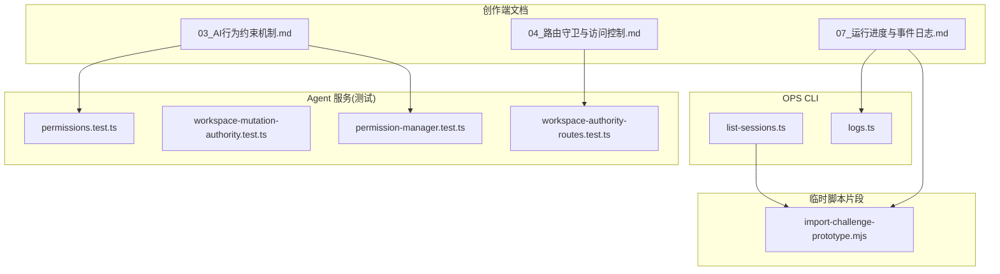
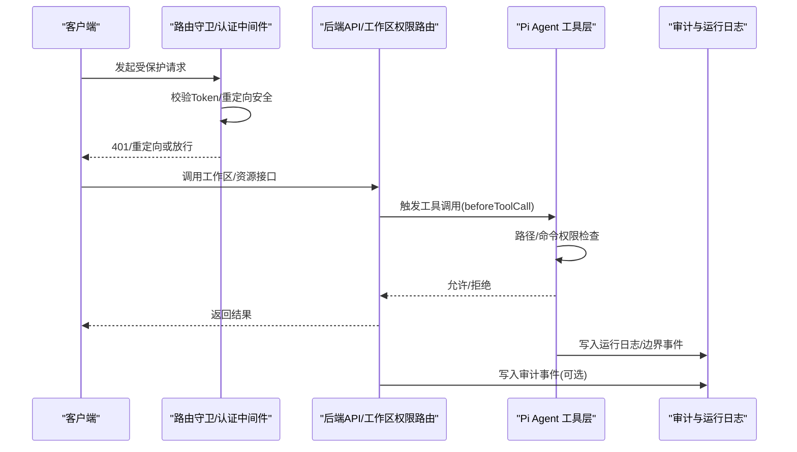
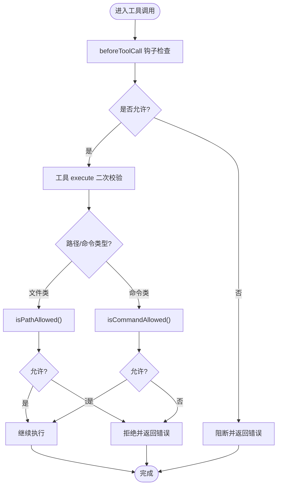
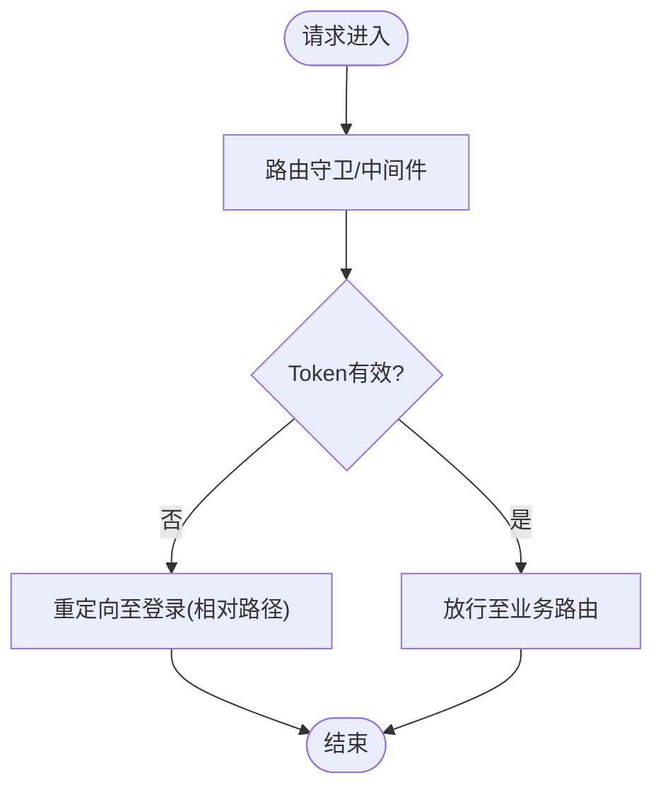
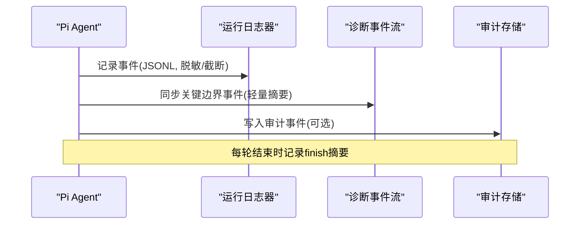
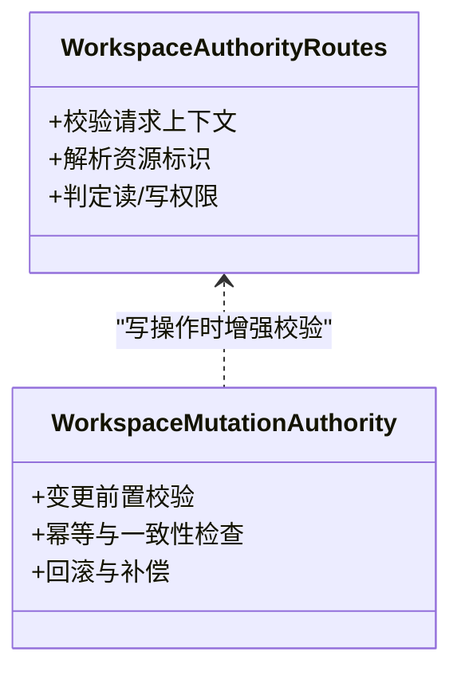
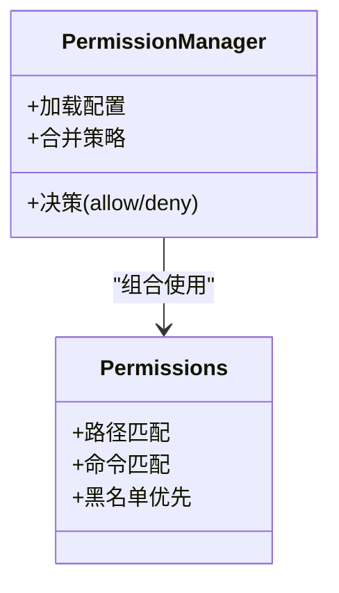
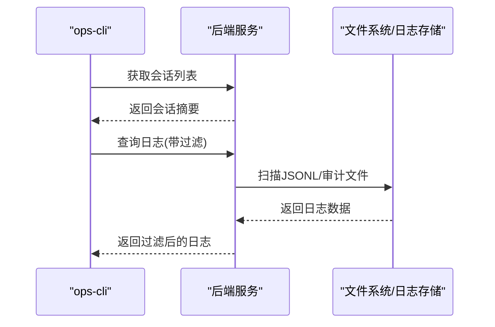
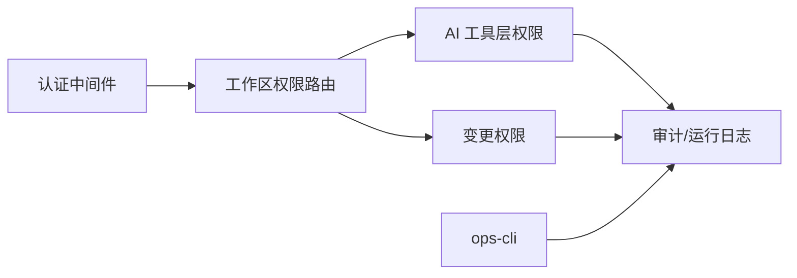

# 权限与审计系统

<cite>
**本文引用的文件**   
- [03_AI行为约束机制.md](file://docs/项目文档/创作端/05-AI对话/技术/03_AI行为约束机制.md)
- [04_路由守卫与访问控制.md](file://docs/项目文档/创作端/01-用户鉴权/技术/04_路由守卫与访问控制.md)
- [07_运行进度与事件日志.md](file://docs/项目文档/创作端/05-AI对话/技术/07_运行进度与事件日志.md)
- [workspace-authority-routes.test.ts](file://packages/agent-service/tests/unit/workspace-authority-routes.test.ts)
- [workspace-mutation-authority.test.ts](file://packages/agent-service/tests/unit/workspace-mutation-authority.test.ts)
- [permissions.test.ts](file://packages/agent-service/tests/unit/permissions.test.ts)
- [permission-manager.test.ts](file://packages/agent-service/tests/unit/permission-manager.test.ts)
- [list-sessions.ts](file://OPS/CLI/src/commands/list-sessions.ts)
- [logs.ts](file://OPS/CLI/src/commands/logs.ts)
- [import-challenge-prototype.mjs](file://tmp/pdfs/import-challenge-prototype.mjs)
</cite>

## 目录
1. [简介](#简介)
2. [项目结构](#项目结构)
3. [核心组件](#核心组件)
4. [架构总览](#架构总览)
5. [详细组件分析](#详细组件分析)
6. [依赖关系分析](#依赖关系分析)
7. [性能考虑](#性能考虑)
8. [故障排查指南](#故障排查指南)
9. [结论](#结论)
10. [附录：API 参考](#附录api-参考)

## 简介
本技术文档围绕“权限与审计系统”的设计与实现，聚焦以下目标：
- 基于角色的访问控制（RBAC）与资源级、操作级权限模型
- 用户角色体系（管理员、编辑者、查看者与自定义角色）的权限定义与继承
- 资源访问控制（项目级、工作区级、文件级）的验证逻辑
- 审计日志系统（操作记录、时间戳、用户信息、上下文）的采集与管理
- 安全策略（输入校验、路径遍历防护、敏感信息保护）
- 权限缓存与性能优化（预加载、缓存策略、并发控制）
- 权限配置与审计查询 API 参考

说明：仓库中未提供显式的 RBAC 角色表或用户-角色映射代码。本文在“角色与权限模型”部分给出概念性设计与落地建议，并在“架构与实现”部分严格依据现有源码与测试进行描述。

## 项目结构
从仓库可见，权限与审计相关能力分布在如下位置：
- 创作端文档：AI 行为约束、路由守卫与访问控制、运行进度与事件日志
- agent-service 单元测试：工作区权限路由、变更权限、通用权限与权限管理器
- OPS CLI：会话列表、日志查询等运维能力
- 临时 PDF 脚本片段：包含审计列表与详情查询的实现片段

图表来源
- [03_AI行为约束机制.md](file://docs/项目文档/创作端/05-AI对话/技术/03_AI行为约束机制.md)
- [04_路由守卫与访问控制.md](file://docs/项目文档/创作端/01-用户鉴权/技术/04_路由守卫与访问控制.md)
- [07_运行进度与事件日志.md](file://docs/项目文档/创作端/05-AI对话/技术/07_运行进度与事件日志.md)
- [workspace-authority-routes.test.ts](file://packages/agent-service/tests/unit/workspace-authority-routes.test.ts)
- [workspace-mutation-authority.test.ts](file://packages/agent-service/tests/unit/workspace-mutation-authority.test.ts)
- [permissions.test.ts](file://packages/agent-service/tests/unit/permissions.test.ts)
- [permission-manager.test.ts](file://packages/agent-service/tests/unit/permission-manager.test.ts)
- [list-sessions.ts](file://OPS/CLI/src/commands/list-sessions.ts)
- [logs.ts](file://OPS/CLI/src/commands/logs.ts)
- [import-challenge-prototype.mjs](file://tmp/pdfs/import-challenge-prototype.mjs)

章节来源
- [03_AI行为约束机制.md](file://docs/项目文档/创作端/05-AI对话/技术/03_AI行为约束机制.md)
- [04_路由守卫与访问控制.md](file://docs/项目文档/创作端/01-用户鉴权/技术/04_路由守卫与访问控制.md)
- [07_运行进度与事件日志.md](file://docs/项目文档/创作端/05-AI对话/技术/07_运行进度与事件日志.md)
- [workspace-authority-routes.test.ts](file://packages/agent-service/tests/unit/workspace-authority-routes.test.ts)
- [workspace-mutation-authority.test.ts](file://packages/agent-service/tests/unit/workspace-mutation-authority.test.ts)
- [permissions.test.ts](file://packages/agent-service/tests/unit/permissions.test.ts)
- [permission-manager.test.ts](file://packages/agent-service/tests/unit/permission-manager.test.ts)
- [list-sessions.ts](file://OPS/CLI/src/commands/list-sessions.ts)
- [logs.ts](file://OPS/CLI/src/commands/logs.ts)
- [import-challenge-prototype.mjs](file://tmp/pdfs/import-challenge-prototype.mjs)

## 核心组件
- AI 工具层权限检查
  - 通过 PermissionConfig 接口管理路径白名单/黑名单与命令白名单/黑名单
  - 在 beforeToolCall 钩子与工具执行层双重校验，失败返回错误结果
- 路由守卫与访问控制
  - 前端中间件对受保护路由进行 Token 校验与重定向处理
  - Cookie 安全设置与边缘计算优化
- 审计日志
  - Agent 运行日志按 sessionId/messageId 落盘为 JSONL，并对敏感字段脱敏
  - 关键边界事件同步到结构化诊断事件流
  - 审计事件持久化与查询（列表/详情）

章节来源
- [03_AI行为约束机制.md](file://docs/项目文档/创作端/05-AI对话/技术/03_AI行为约束机制.md)
- [04_路由守卫与访问控制.md](file://docs/项目文档/创作端/01-用户鉴权/技术/04_路由守卫与访问控制.md)
- [07_运行进度与事件日志.md](file://docs/项目文档/创作端/05-AI对话/技术/07_运行进度与事件日志.md)

## 架构总览
下图展示了从请求进入、权限校验、工具执行到审计记录的端到端流程。

图表来源
- [04_路由守卫与访问控制.md](file://docs/项目文档/创作端/01-用户鉴权/技术/04_路由守卫与访问控制.md)
- [03_AI行为约束机制.md](file://docs/项目文档/创作端/05-AI对话/技术/03_AI行为约束机制.md)
- [07_运行进度与事件日志.md](file://docs/项目文档/创作端/05-AI对话/技术/07_运行进度与事件日志.md)

## 详细组件分析

### 组件A：AI 工具层权限检查（路径与命令）
- 设计要点
  - 使用 PermissionConfig 维护 allowedPaths/deniedPatterns/allowedCommands/deniedCommands
  - 黑名单优先于白名单；路径必须在 workingDir 内（防目录穿越）
  - 两层检查：beforeToolCall 钩子 + 工具 execute 内部再次校验
- 典型流程
  - 读取/写入/列举文件：isPathAllowed()
  - Bash 命令：isCommandAllowed()
  - 委派任务：live Workspace 下检查 .workspace.json 并拒绝特定 scope

图表来源
- [03_AI行为约束机制.md](file://docs/项目文档/创作端/05-AI对话/技术/03_AI行为约束机制.md)

章节来源
- [03_AI行为约束机制.md](file://docs/项目文档/创作端/05-AI对话/技术/03_AI行为约束机制.md)

### 组件B：路由守卫与访问控制（认证与中间件）
- 关键点
  - 登录过期统一错误码与提示
  - 防止开放重定向（仅接受相对路径）
  - Cookie 安全属性（httpOnly、sameSite、secure）
  - 中间件快速验证、最小拦截范围、边缘节点执行
  - 页面缓存策略区分公开/受保护页面

图表来源
- [04_路由守卫与访问控制.md](file://docs/项目文档/创作端/01-用户鉴权/技术/04_路由守卫与访问控制.md)

章节来源
- [04_路由守卫与访问控制.md](file://docs/项目文档/创作端/01-用户鉴权/技术/04_路由守卫与访问控制.md)

### 组件C：审计日志与运行事件
- 存储格式
  - data/agent-run-logs/<sessionId>/<messageId>.jsonl，每行一条 JSON
  - 包含时间、级别、来源、事件类型、标题、摘要、关联工具调用 ID、脱敏 payload
- 脱敏与截断
  - 对 key、token、authorization、password、secret 等敏感字段脱敏
  - 长文本截断，避免完整大段内容写入日志
- 关键边界事件
  - finish 摘要包含最终回复长度、累计流式输出长度、工具结果数量、子 Agent 结果数量、文件结果数量、Authority receipt 资源数量或路径摘要、后端错误或空回复调试信息
- 审计事件持久化与查询
  - 提供 auditList(auditId)/auditGet(auditId) 能力（见临时脚本片段）

图表来源
- [07_运行进度与事件日志.md](file://docs/项目文档/创作端/05-AI对话/技术/07_运行进度与事件日志.md)
- [import-challenge-prototype.mjs](file://tmp/pdfs/import-challenge-prototype.mjs)

章节来源
- [07_运行进度与事件日志.md](file://docs/项目文档/创作端/05-AI对话/技术/07_运行进度与事件日志.md)
- [import-challenge-prototype.mjs](file://tmp/pdfs/import-challenge-prototype.mjs)

### 组件D：工作区权限与变更权限（服务端）
- 工作区权限路由与实例策略
  - 通过 workspace-authority 相关路由与策略进行访问控制
  - 单元测试覆盖路由与策略行为
- 工作区变更权限
  - 针对写操作的额外校验与限制
  - 单元测试覆盖变更场景

图表来源
- [workspace-authority-routes.test.ts](file://packages/agent-service/tests/unit/workspace-authority-routes.test.ts)
- [workspace-mutation-authority.test.ts](file://packages/agent-service/tests/unit/workspace-mutation-authority.test.ts)

章节来源
- [workspace-authority-routes.test.ts](file://packages/agent-service/tests/unit/workspace-authority-routes.test.ts)
- [workspace-mutation-authority.test.ts](file://packages/agent-service/tests/unit/workspace-mutation-authority.test.ts)

### 组件E：通用权限与权限管理器（服务端）
- 通用权限判断
  - 单元测试覆盖路径/命令/模式匹配等基础规则
- 权限管理器
  - 集中管理权限配置、合并与生效策略
  - 单元测试覆盖配置加载与决策流程

图表来源
- [permissions.test.ts](file://packages/agent-service/tests/unit/permissions.test.ts)
- [permission-manager.test.ts](file://packages/agent-service/tests/unit/permission-manager.test.ts)

章节来源
- [permissions.test.ts](file://packages/agent-service/tests/unit/permissions.test.ts)
- [permission-manager.test.ts](file://packages/agent-service/tests/unit/permission-manager.test.ts)

### 组件F：运维与审计查询（CLI）
- 会话列表
  - 列出会话摘要、状态、消息数、最后活跃时间
  - 支持 JSON 输出与错误提示
- 日志查询
  - 支持按级别、模式、会话ID过滤
  - 展示来源、总行数、筛选后行数与日志条目

图表来源
- [list-sessions.ts](file://OPS/CLI/src/commands/list-sessions.ts)
- [logs.ts](file://OPS/CLI/src/commands/logs.ts)

章节来源
- [list-sessions.ts](file://OPS/CLI/src/commands/list-sessions.ts)
- [logs.ts](file://OPS/CLI/src/commands/logs.ts)

## 依赖关系分析
- 模块耦合
  - 路由守卫与认证中间件为入口层，决定后续权限校验是否执行
  - 工作区权限路由与变更权限在服务端形成读写分离的校验链
  - AI 工具层权限检查作为细粒度操作级控制点
  - 审计与运行日志贯穿全流程，用于事后追溯
- 外部依赖
  - 文件系统（JSONL 日志、审计事件）
  - 中间件/边缘计算（Next.js 中间件）
  - CLI 工具（ops-cli）

图表来源
- [04_路由守卫与访问控制.md](file://docs/项目文档/创作端/01-用户鉴权/技术/04_路由守卫与访问控制.md)
- [workspace-authority-routes.test.ts](file://packages/agent-service/tests/unit/workspace-authority-routes.test.ts)
- [workspace-mutation-authority.test.ts](file://packages/agent-service/tests/unit/workspace-mutation-authority.test.ts)
- [03_AI行为约束机制.md](file://docs/项目文档/创作端/05-AI对话/技术/03_AI行为约束机制.md)
- [07_运行进度与事件日志.md](file://docs/项目文档/创作端/05-AI对话/技术/07_运行进度与事件日志.md)
- [list-sessions.ts](file://OPS/CLI/src/commands/list-sessions.ts)
- [logs.ts](file://OPS/CLI/src/commands/logs.ts)

## 性能考虑
- 中间件快速验证
  - Token 验证无需数据库查询，耗时低
  - 最小拦截范围，排除静态资源
  - 边缘节点执行降低延迟
- 缓存策略
  - 认证页面不缓存
  - 受保护页面不缓存
  - 公开页面可缓存
- 权限预加载与并发
  - 建议在会话初始化阶段预加载用户角色与资源权限集合
  - 使用内存缓存+失效策略（如 TTL 或事件驱动失效）
  - 并发访问采用锁或队列避免重复计算

[本节为通用指导，不涉及具体文件分析]

## 故障排查指南
- 常见问题
  - 登录过期：统一错误码与提示，检查 Cookie 安全属性与重定向参数
  - 权限被拒：确认黑名单优先策略、路径是否在 workingDir、命令是否在白名单
  - 审计缺失：检查 JSONL 写入是否成功、敏感字段脱敏是否导致匹配失败
- 定位手段
  - 使用 ops-cli 会话列表与日志查询命令定位问题
  - 查看 agent-run-logs 中的 finish 摘要与错误信息
  - 结合工作区权限路由与变更权限的单元测试用例复现

章节来源
- [04_路由守卫与访问控制.md](file://docs/项目文档/创作端/01-用户鉴权/技术/04_路由守卫与访问控制.md)
- [03_AI行为约束机制.md](file://docs/项目文档/创作端/05-AI对话/技术/03_AI行为约束机制.md)
- [07_运行进度与事件日志.md](file://docs/项目文档/创作端/05-AI对话/技术/07_运行进度与事件日志.md)
- [list-sessions.ts](file://OPS/CLI/src/commands/list-sessions.ts)
- [logs.ts](file://OPS/CLI/src/commands/logs.ts)

## 结论
- 权限体系由“认证中间件 + 工作区权限路由 + AI 工具层细粒度检查”构成，覆盖资源级与操作级控制
- 审计与运行日志贯穿全流程，具备脱敏与截断能力，并提供 CLI 查询入口
- 安全策略强调黑名单优先、路径穿越防护与敏感信息保护
- 性能方面建议引入权限预加载与缓存策略，并结合边缘计算优化响应时延

[本节为总结，不涉及具体文件分析]

## 附录：API 参考

### 权限配置（PermissionConfig）
- 字段
  - allowedPaths：路径白名单（glob 模式）
  - deniedPatterns：路径黑名单（glob 模式）
  - allowedCommands：命令白名单
  - deniedCommands：命令黑名单
- 默认策略
  - DEFAULT_WORKSPACE_PERMISSIONS 提供开箱即用的路径与命令策略
- 传递方式
  - 通过 AgentConfig.permissions 传入，未提供时使用默认值

章节来源
- [03_AI行为约束机制.md](file://docs/项目文档/创作端/05-AI对话/技术/03_AI行为约束机制.md)

### 审计查询（CLI）
- 会话列表
  - 功能：列出会话摘要、状态、消息数、最后活跃时间
  - 输出：支持 JSON 模式与彩色终端输出
- 日志查询
  - 功能：按级别、模式、会话ID过滤日志
  - 输出：来源、总行数、筛选后行数、日志条目

章节来源
- [list-sessions.ts](file://OPS/CLI/src/commands/list-sessions.ts)
- [logs.ts](file://OPS/CLI/src/commands/logs.ts)

### 审计事件（持久化与查询）
- 持久化
  - 审计事件以 JSON 文件形式按日期组织
- 查询
  - auditList(projectId?)：按项目过滤并倒序排列
  - auditGet(auditId)：根据审计ID获取详情

章节来源
- [import-challenge-prototype.mjs](file://tmp/pdfs/import-challenge-prototype.mjs)