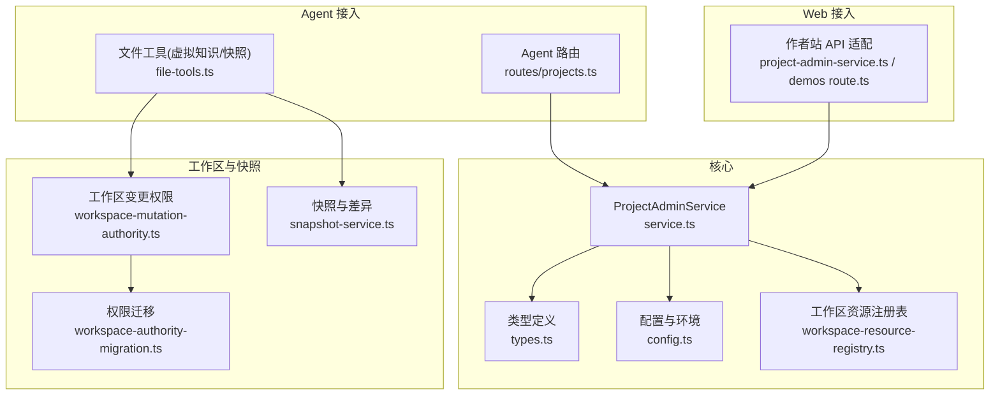
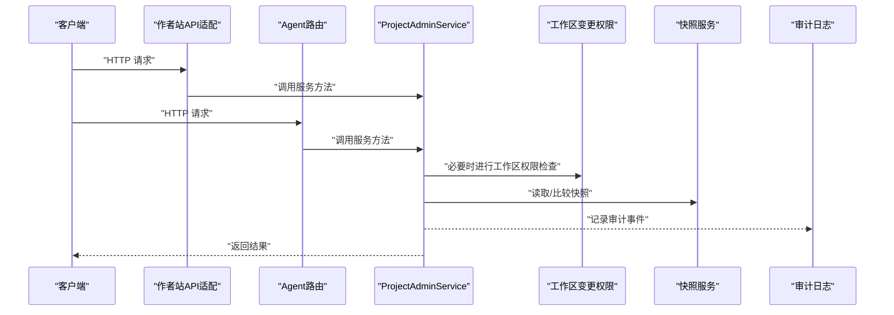
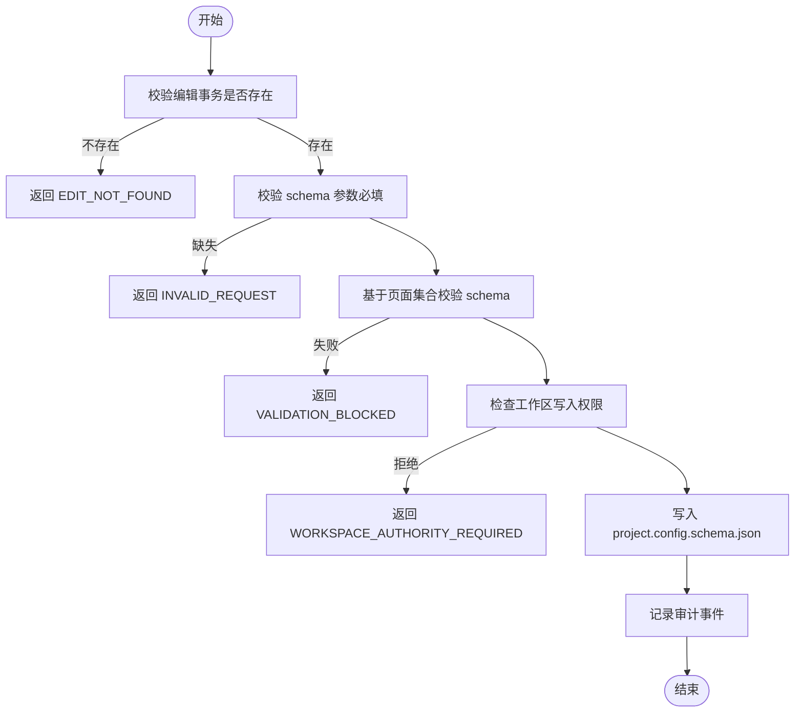
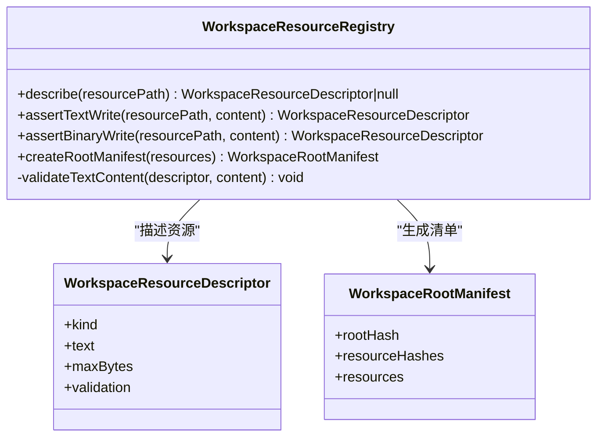
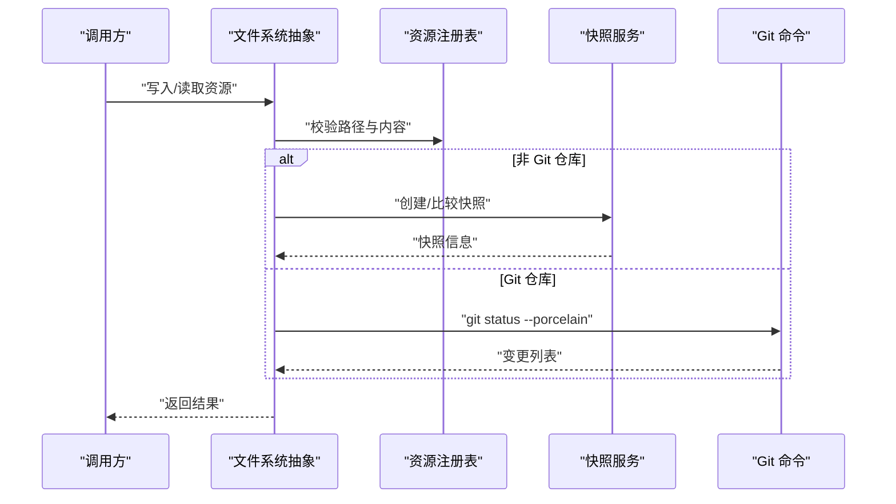
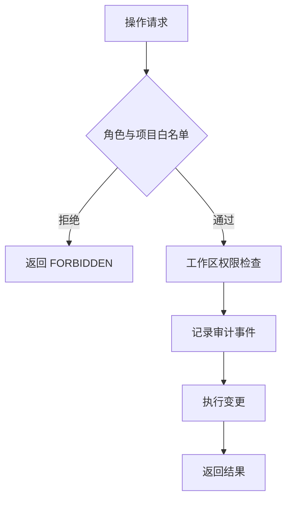
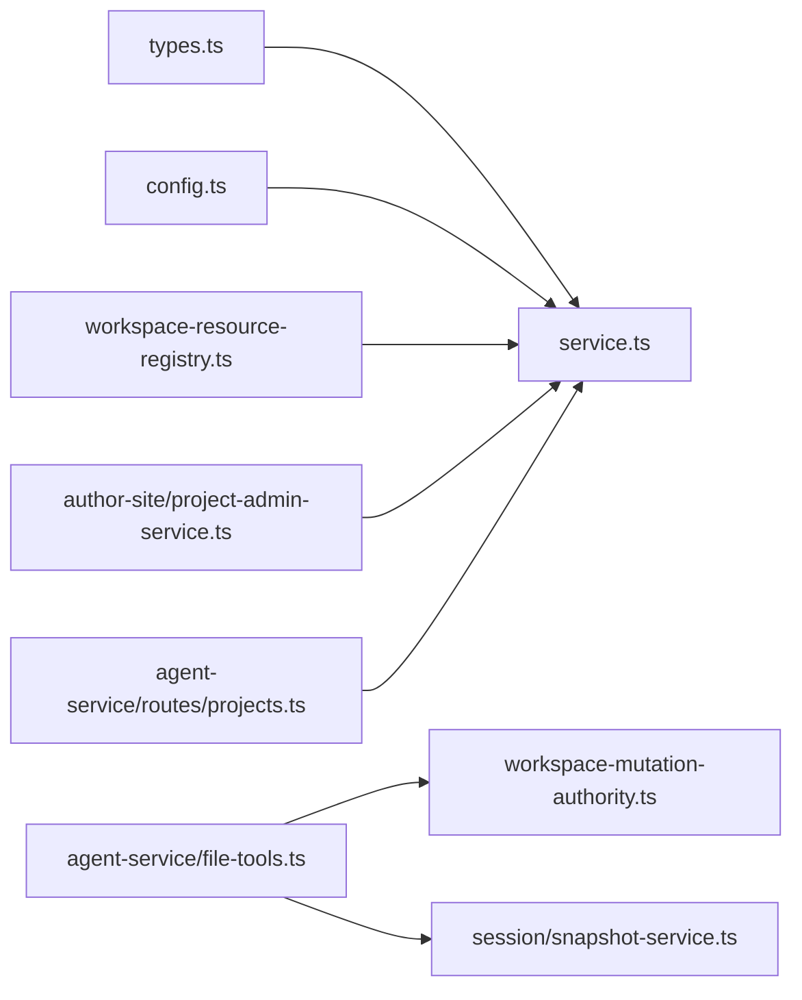

# 项目管理核心

<cite>
**本文引用的文件列表**
- [packages/project-core/src/service.ts](file://packages/project-core/src/service.ts)
- [packages/project-core/src/workspace-resource-registry.ts](file://packages/project-core/src/workspace-resource-registry.ts)
- [packages/project-core/src/types.ts](file://packages/project-core/src/types.ts)
- [packages/project-core/src/config.ts](file://packages/project-core/src/config.ts)
- [packages/project-core/src/index.ts](file://packages/project-core/src/index.ts)
- [packages/agent-service/src/routes/projects.ts](file://packages/agent-service/src/routes/projects.ts)
- [packages/author-site/src/lib/project-admin-service.ts](file://packages/author-site/src/lib/project-admin-service.ts)
- [packages/author-site/src/app/api/demos/route.ts](file://packages/author-site/src/app/api/demos/route.ts)
- [packages/author-site/src/app/api/demos/[id]/route.ts](file://packages/author-site/src/app/api/demos/[id]/route.ts)
- [packages/agent-service/src/session/snapshot-service.ts](file://packages/agent-service/src/session/snapshot-service.ts)
- [packages/agent-service/src/workspace/workspace-mutation-authority.ts](file://packages/agent-service/src/workspace/workspace-mutation-authority.ts)
- [packages/agent-service/src/workspace/workspace-authority-migration.ts](file://packages/agent-service/src/workspace/workspace-authority-migration.ts)
- [packages/agent-service/src/backends/pi-tools/file-tools.ts](file://packages/agent-service/src/backends/pi-tools/file-tools.ts)
- [data/audit/project-admin/2026-07-03/audit_1783068457408_7w9032.json](file://data/audit/project-admin/2026-07-03/audit_1783068457408_7w9032.json)
- [data/audit/project-admin/2026-07-01/audit_1782898032726_avlcpe.json](file://data/audit/project-admin/2026-07-01/audit_1782898032726_avlcpe.json)
- [data/audit/project-admin/2026-07-03/audit_1783072744131_1rnalq.json](file://data/audit/project-admin/2026-07-03/audit_1783072744131_1rnalq.json)
- [data/audit/project-admin/2026-07-03/audit_1783073004688_79iqhz.json](file://data/audit/project-admin/2026-07-03/audit_1783073004688_79iqhz.json)
</cite>

## 目录
1. [简介](#简介)
2. [项目结构](#项目结构)
3. [核心组件](#核心组件)
4. [架构总览](#架构总览)
5. [详细组件分析](#详细组件分析)
6. [依赖关系分析](#依赖关系分析)
7. [性能考量](#性能考量)
8. [故障排查指南](#故障排查指南)
9. [结论](#结论)
10. [附录：API 参考与使用示例](#附录api-参考与使用示例)

## 简介
本技术文档聚焦于“项目管理核心”，围绕 ProjectAdminService 的设计模式与核心能力展开，覆盖项目 CRUD、工作区管理、文件系统抽象层（虚拟文件系统、快照系统、差异计算）、资源注册表（发现、依赖、版本控制）、Schema 驱动的配置机制与校验、权限控制、审计日志与数据迁移。同时提供完整的 API 参考与集成示例，帮助开发者在业务逻辑中正确使用项目管理核心。

## 项目结构
本项目采用多包 monorepo 组织方式，项目管理核心位于 packages/project-core，对外暴露统一的服务类与类型定义；上层通过 author-site（Next.js）和 agent-service（Fastify）分别提供 Web 与 Agent 服务访问入口；CLI 工具通过 project-cli 调用 core 完成本地操作；快照与差异计算由 agent-service 中的 SnapshotService 实现；工作区变更权限与迁移由 workspace-mutation-authority 与 migration 模块负责。

图表来源
- [packages/project-core/src/service.ts:477-530](file://packages/project-core/src/service.ts#L477-L530)
- [packages/project-core/src/workspace-resource-registry.ts:52-112](file://packages/project-core/src/workspace-resource-registry.ts#L52-L112)
- [packages/author-site/src/lib/project-admin-service.ts:1-56](file://packages/author-site/src/lib/project-admin-service.ts#L1-L56)
- [packages/agent-service/src/routes/projects.ts:13-49](file://packages/agent-service/src/routes/projects.ts#L13-L49)
- [packages/agent-service/src/session/snapshot-service.ts:14-37](file://packages/agent-service/src/session/snapshot-service.ts#L14-L37)
- [packages/agent-service/src/workspace/workspace-mutation-authority.ts:710-877](file://packages/agent-service/src/workspace/workspace-mutation-authority.ts#L710-L877)
- [packages/agent-service/src/workspace/workspace-authority-migration.ts:1-35](file://packages/agent-service/src/workspace/workspace-authority-migration.ts#L1-L35)

章节来源
- [packages/project-core/src/index.ts:1-15](file://packages/project-core/src/index.ts#L1-L15)
- [packages/project-core/src/service.ts:477-530](file://packages/project-core/src/service.ts#L477-L530)
- [packages/project-core/src/workspace-resource-registry.ts:52-112](file://packages/project-core/src/workspace-resource-registry.ts#L52-L112)
- [packages/author-site/src/lib/project-admin-service.ts:1-56](file://packages/author-site/src/lib/project-admin-service.ts#L1-L56)
- [packages/agent-service/src/routes/projects.ts:13-49](file://packages/agent-service/src/routes/projects.ts#L13-L49)
- [packages/agent-service/src/session/snapshot-service.ts:14-37](file://packages/agent-service/src/session/snapshot-service.ts#L14-L37)
- [packages/agent-service/src/workspace/workspace-mutation-authority.ts:710-877](file://packages/agent-service/src/workspace/workspace-mutation-authority.ts#L710-L877)
- [packages/agent-service/src/workspace/workspace-authority-migration.ts:1-35](file://packages/agent-service/src/workspace/workspace-authority-migration.ts#L1-L35)

## 核心组件
- ProjectAdminService：项目管理主服务，封装项目生命周期、页面/文件夹管理、资产、预览、发布、配置 Schema、审计、事务与权限等。
- WorkspaceResourceRegistry：工作区资源注册表，集中管理可写入资源的类型、路径规范、大小限制与内容校验，并生成根清单与哈希。
- 配置与环境：从环境变量解析数据目录、审计目录、批处理大小、角色与允许的项目范围等。
- 类型定义：统一的输入输出类型、错误码、审计事件、版本历史、预览计划等。

章节来源
- [packages/project-core/src/service.ts:477-530](file://packages/project-core/src/service.ts#L477-L530)
- [packages/project-core/src/workspace-resource-registry.ts:52-112](file://packages/project-core/src/workspace-resource-registry.ts#L52-L112)
- [packages/project-core/src/config.ts:32-71](file://packages/project-core/src/config.ts#L32-L71)
- [packages/project-core/src/types.ts:113-153](file://packages/project-core/src/types.ts#L113-L153)

## 架构总览
下图展示了从 Web/Agent 到核心的调用链，以及工作区权限、快照与审计的协作关系。

图表来源
- [packages/author-site/src/lib/project-admin-service.ts:1-56](file://packages/author-site/src/lib/project-admin-service.ts#L1-L56)
- [packages/agent-service/src/routes/projects.ts:13-49](file://packages/agent-service/src/routes/projects.ts#L13-L49)
- [packages/project-core/src/service.ts:477-530](file://packages/project-core/src/service.ts#L477-L530)
- [packages/agent-service/src/workspace/workspace-mutation-authority.ts:710-877](file://packages/agent-service/src/workspace/workspace-mutation-authority.ts#L710-L877)
- [packages/agent-service/src/session/snapshot-service.ts:108-122](file://packages/agent-service/src/session/snapshot-service.ts#L108-L122)

## 详细组件分析

### ProjectAdminService 设计与核心功能
- 设计模式
  - 门面模式：对外暴露统一的服务接口，隐藏底层文件系统、模板、预览、发布、审计等细节。
  - 策略模式：根据 actor 角色与工作区状态决定读写权限与行为。
  - 工厂模式：创建项目、页面、版本、预览计划等对象。
  - 命令模式：编辑事务（EditTransaction）将一组变更包装为可提交/回滚的操作单元。
- 关键职责
  - 项目 CRUD：创建、更新、删除、详情查询、导出包。
  - 页面与文件夹管理：增删改查、运行时切换、原型页支持。
  - 工作区管理：工作区元数据、树结构、资源清单、根哈希。
  - 配置 Schema：设置/删除项目级配置 Schema，基于页面集合进行校验。
  - 资产与预览：上传/替换资产、预览计划与执行。
  - 发布与版本：版本历史、发布状态、制品索引。
  - 权限与审计：actor 角色、项目白名单、审计事件落盘。
  - 事务与幂等：编辑事务、确认令牌、dryRun 与 diffSummary。
- 典型流程（以设置项目级配置 Schema 为例）
  - 校验编辑事务存在 → 校验 schema 必填 → 基于页面集合校验 schema → 权限检查 → 写入文件 → 生成审计事件 → 返回结果。

图表来源
- [packages/project-core/src/service.ts:3555-3602](file://packages/project-core/src/service.ts#L3555-L3602)

章节来源
- [packages/project-core/src/service.ts:477-530](file://packages/project-core/src/service.ts#L477-L530)
- [packages/project-core/src/service.ts:3555-3602](file://packages/project-core/src/service.ts#L3555-L3602)

### 工作区资源注册表（WorkspaceResourceRegistry）
- 资源发现
  - 通过路径规则匹配资源类型（如页面代码、原型 HTML/CSS、Sketch 场景、项目 Schema、工作区树、知识文档、资产等）。
- 依赖管理与约束
  - 文本/二进制区分、最大字节限制、JSON 对象或特定结构校验（如 workspace-tree、sketch-scene）。
- 版本控制
  - 对每个资源计算内容哈希，生成资源清单与根哈希，用于一致性校验与增量同步。
- 安全路径规范化
  - 拒绝越界路径（包含 ..、空路径、NUL 字符），统一斜杠分隔。

图表来源
- [packages/project-core/src/workspace-resource-registry.ts:52-112](file://packages/project-core/src/workspace-resource-registry.ts#L52-L112)

章节来源
- [packages/project-core/src/workspace-resource-registry.ts:41-141](file://packages/project-core/src/workspace-resource-registry.ts#L41-L141)

### 文件系统抽象层（虚拟文件系统、快照系统、差异计算）
- 虚拟文件系统
  - 通过工作区资源注册表统一约束可写资源路径与内容格式，屏蔽具体存储实现。
- 快照系统
  - 自动检测 Git 仓库与非 Git 目录：Git 模式下使用 git status 获取变更；非 Git 模式扫描文件内容与 mtime 构建内存快照。
- 差异计算
  - compare() 返回 staged/unstaged 变更列表；discard/reset 支持撤销创建/修改/删除。
- 与 Agent 集成
  - 文件工具在读取时优先尝试虚拟知识文件，否则走 live 工作区权限与快照。

图表来源
- [packages/agent-service/src/session/snapshot-service.ts:14-37](file://packages/agent-service/src/session/snapshot-service.ts#L14-L37)
- [packages/agent-service/src/session/snapshot-service.ts:108-122](file://packages/agent-service/src/session/snapshot-service.ts#L108-L122)
- [packages/agent-service/src/backends/pi-tools/file-tools.ts:40-71](file://packages/agent-service/src/backends/pi-tools/file-tools.ts#L40-L71)
- [packages/project-core/src/workspace-resource-registry.ts:90-112](file://packages/project-core/src/workspace-resource-registry.ts#L90-L112)

章节来源
- [packages/agent-service/src/session/snapshot-service.ts:14-37](file://packages/agent-service/src/session/snapshot-service.ts#L14-L37)
- [packages/agent-service/src/session/snapshot-service.ts:108-122](file://packages/agent-service/src/session/snapshot-service.ts#L108-L122)
- [packages/agent-service/src/backends/pi-tools/file-tools.ts:40-71](file://packages/agent-service/src/backends/pi-tools/file-tools.ts#L40-L71)
- [packages/project-core/src/workspace-resource-registry.ts:90-112](file://packages/project-core/src/workspace-resource-registry.ts#L90-L112)

### 项目配置的 Schema 驱动机制与验证规则
- Schema 文件位置：project.config.schema.json（项目级），页面级 config.schema.json。
- 设置流程：
  - 校验编辑事务 → 校验 schema 必填 → 基于页面集合运行校验 → 权限检查 → 写入文件 → 审计记录。
- 验证规则：
  - JSON 对象结构校验、页面引用完整性、运行时契约兼容性与编译阶段问题收集。
- 合并与演进：
  - 新增字段采用默认值，移除字段清理旧值，类型不兼容时使用新默认值，__order 始终来自当前 Schema。

章节来源
- [packages/project-core/src/service.ts:3555-3602](file://packages/project-core/src/service.ts#L3555-L3602)
- [packages/author-site/src/lib/config-merge.ts:29-61](file://packages/author-site/src/lib/config-merge.ts#L29-L61)

### 权限控制、审计日志与数据迁移
- 权限控制
  - 基于 actor 角色（admin/creator/readonly）与 allowedProjectIds 白名单；工作区写入需通过 WorkspaceMutationAuthority 的串行化队列与期望哈希校验。
- 审计日志
  - 所有关键操作记录审计事件，包含时间戳、操作者、级别、工具名、项目/资源 ID、diff 摘要、校验结果与错误信息。
- 数据迁移
  - 工作区权限迁移工具支持引导、修复备份、批量应用等操作，输出迁移项与问题清单。

图表来源
- [packages/agent-service/src/workspace/workspace-mutation-authority.ts:710-877](file://packages/agent-service/src/workspace/workspace-mutation-authority.ts#L710-L877)
- [data/audit/project-admin/2026-07-03/audit_1783068457408_7w9032.json:1-24](file://data/audit/project-admin/2026-07-03/audit_1783068457408_7w9032.json#L1-L24)
- [packages/agent-service/src/workspace/workspace-authority-migration.ts:1-35](file://packages/agent-service/src/workspace/workspace-authority-migration.ts#L1-L35)

章节来源
- [packages/agent-service/src/workspace/workspace-mutation-authority.ts:710-877](file://packages/agent-service/src/workspace/workspace-mutation-authority.ts#L710-L877)
- [data/audit/project-admin/2026-07-03/audit_1783068457408_7w9032.json:1-24](file://data/audit/project-admin/2026-07-03/audit_1783068457408_7w9032.json#L1-L24)
- [data/audit/project-admin/2026-07-01/audit_1782898032726_avlcpe.json:1-24](file://data/audit/project-admin/2026-07-01/audit_1782898032726_avlcpe.json#L1-L24)
- [data/audit/project-admin/2026-07-03/audit_1783072744131_1rnalq.json:1-24](file://data/audit/project-admin/2026-07-03/audit_1783072744131_1rnalq.json#L1-L24)
- [data/audit/project-admin/2026-07-03/audit_1783073004688_79iqhz.json:1-24](file://data/audit/project-admin/2026-07-03/audit_1783073004688_79iqhz.json#L1-L24)
- [packages/agent-service/src/workspace/workspace-authority-migration.ts:1-35](file://packages/agent-service/src/workspace/workspace-authority-migration.ts#L1-L35)

## 依赖关系分析
- 核心依赖
  - ProjectAdminService 依赖 types.ts 的类型定义与 config.ts 的环境解析。
  - WorkspaceResourceRegistry 依赖 sketch-core 的 Sketch 场景校验。
- 上层集成
  - author-site 通过 project-admin-service.ts 将 Next.js API 映射到 ProjectAdminService。
  - agent-service 通过 routes/projects.ts 暴露项目管理 HTTP 接口，并通过 file-tools.ts 与快照/权限模块协作。
- 外部服务
  - 截图服务、Agent 服务 URL 通过环境变量注入。

图表来源
- [packages/project-core/src/types.ts:113-153](file://packages/project-core/src/types.ts#L113-L153)
- [packages/project-core/src/config.ts:32-71](file://packages/project-core/src/config.ts#L32-L71)
- [packages/project-core/src/service.ts:477-530](file://packages/project-core/src/service.ts#L477-L530)
- [packages/author-site/src/lib/project-admin-service.ts:1-56](file://packages/author-site/src/lib/project-admin-service.ts#L1-L56)
- [packages/agent-service/src/routes/projects.ts:13-49](file://packages/agent-service/src/routes/projects.ts#L13-L49)
- [packages/agent-service/src/backends/pi-tools/file-tools.ts:40-71](file://packages/agent-service/src/backends/pi-tools/file-tools.ts#L40-L71)
- [packages/agent-service/src/workspace/workspace-mutation-authority.ts:710-877](file://packages/agent-service/src/workspace/workspace-mutation-authority.ts#L710-L877)
- [packages/agent-service/src/session/snapshot-service.ts:108-122](file://packages/agent-service/src/session/snapshot-service.ts#L108-L122)

章节来源
- [packages/project-core/src/index.ts:1-15](file://packages/project-core/src/index.ts#L1-L15)
- [packages/project-core/src/service.ts:477-530](file://packages/project-core/src/service.ts#L477-L530)
- [packages/author-site/src/lib/project-admin-service.ts:1-56](file://packages/author-site/src/lib/project-admin-service.ts#L1-L56)
- [packages/agent-service/src/routes/projects.ts:13-49](file://packages/agent-service/src/routes/projects.ts#L13-L49)

## 性能考量
- 批量大小：通过 maxBatchSize 控制批量操作的规模，避免单次过大导致内存与 I/O 压力。
- 资源大小限制：文本资源上限 2MB，二进制资源上限 20MB，防止大文件拖慢清单生成与传输。
- 快照与差异：Git 模式直接利用 git status，减少全量扫描；非 Git 模式按需扫描与缓存 mtime，降低重复 IO。
- 并发与串行化：工作区变更通过队列串行化，避免竞态条件与不一致状态。

[本节为通用指导，无需源码引用]

## 故障排查指南
- 常见错误码
  - INVALID_REQUEST：参数缺失或类型不符。
  - VALIDATION_BLOCKED：Schema 或运行时校验失败。
  - PROJECT_NOT_FOUND：项目不存在。
  - FORBIDDEN：无权限访问。
  - WORKSPACE_AUTHORITY_REQUIRED：工作区写入被拒绝。
  - FILE_READ_ERROR/WRITE_ERROR：文件系统异常。
- 定位步骤
  - 查看审计日志文件，确认操作者、工具、diff 摘要与校验结果。
  - 检查工作区权限与期望哈希是否匹配。
  - 核对资源路径是否被注册表接受，内容是否符合类型与大小限制。
  - 对于快照差异问题，确认是否为 Git 仓库及 git status 输出。

章节来源
- [packages/author-site/src/lib/project-admin-service.ts:14-34](file://packages/author-site/src/lib/project-admin-service.ts#L14-L34)
- [data/audit/project-admin/2026-07-03/audit_1783068457408_7w9032.json:1-24](file://data/audit/project-admin/2026-07-03/audit_1783068457408_7w9032.json#L1-L24)
- [packages/agent-service/src/session/snapshot-service.ts:108-122](file://packages/agent-service/src/session/snapshot-service.ts#L108-L122)

## 结论
项目管理核心通过 ProjectAdminService 提供了统一、可扩展且强一致性的项目管理能力，结合工作区资源注册表、快照与差异计算、Schema 驱动的校验、严格的权限与审计机制，形成了稳定可靠的工程基座。上层通过 Web 与 Agent 两种接入方式，既满足人类开发者也满足自动化代理的使用需求。

[本节为总结性内容，无需源码引用]

## 附录：API 参考与使用示例

### 公共接口与方法签名（按类别）
- 项目
  - listProjects(actor?): ProjectAdminResult<ProjectSummary[]>
  - getProject(projectId, actor?): ProjectAdminResult<ProjectDetail>
  - createProject(input: CreateProjectInput, actor?): ProjectAdminResult<Project>
  - updateProject(input: UpdateProjectInput, actor?): ProjectAdminResult<Project>
  - deleteProjectPreview(projectId): ProjectAdminResult<PreviewPlan>
  - deleteProjectExecute(planId, confirmToken): ProjectAdminResult<void>
  - exportProjectPackage(projectId, actor?): ProjectAdminResult<ProjectPackageExport>
- 页面与文件夹
  - createPage(input: PageCreateInput, actor?): ProjectAdminResult<PageDetail>
  - updatePage(input: PageUpdateInput, actor?): ProjectAdminResult<PageDetail>
  - updatePrototype(input: PageUpdatePrototypeInput, actor?): ProjectAdminResult<PageDetail>
  - switchRuntime(input: PageSwitchRuntimeInput, actor?): ProjectAdminResult<PageDetail>
  - updateFolder(input: FolderUpdateInput, actor?): ProjectAdminResult<DemoFolderMeta>
- 配置
  - setProjectConfig(input: ConfigUpdateInput, actor?): ProjectAdminResult<{schema?: string; exists: boolean}>
  - deleteProjectConfig(editId, dryRun?, actor?): ProjectAdminResult<void>
- 资产
  - uploadAsset(input: AssetUploadInput, actor?): ProjectAdminResult<AssetSummary>
  - replaceAsset(input: AssetReplaceInput, actor?): ProjectAdminResult<AssetSummary>
- 预览与发布
  - previewPlan(...): ProjectAdminResult<PreviewPlan>
  - publishCommit(input: ProjectPublishCommitInput, actor?): ProjectAdminResult<PublishStatus>
- 版本与恢复
  - createVersion(input: ResourceVersionCreateInput, actor?): ProjectAdminResult<ResourceVersionDetail>
  - restoreResource(input: ResourceRestoreInput, actor?): ProjectAdminResult<PageRestoreResult>
- 审计与诊断
  - capabilities(actor?): ProjectAdminResult<CapabilitySummary>
  - verify(projectId, actor?): ProjectAdminResult<VerifySummary>
  - visualCheck(input: VisualCheckInput, actor?): ProjectAdminResult<VisualCheckResult>

说明
- 以上方法签名来源于 service.ts 与 types.ts 的导出与类型定义，实际调用可通过 CLI、Web API 或 Agent 路由触发。

章节来源
- [packages/project-core/src/service.ts:477-530](file://packages/project-core/src/service.ts#L477-L530)
- [packages/project-core/src/types.ts:113-153](file://packages/project-core/src/types.ts#L113-L153)

### Web API 示例（作者站）
- GET /api/projects
  - 响应：{ success: true, data: Project[] }
- POST /api/projects
  - 请求体：{ name: string, category?: string, templateId?: string }
  - 响应：{ success: true, data: Project }
- DELETE /api/projects/:id
  - 流程：先获取预览计划，再执行确认令牌提交。

章节来源
- [packages/author-site/src/app/api/demos/route.ts:1-44](file://packages/author-site/src/app/api/demos/route.ts#L1-L44)
- [packages/author-site/src/app/api/demos/[id]/route.ts:69-109](file://packages/author-site/src/app/api/demos/[id]/route.ts#L69-L109)
- [packages/author-site/src/lib/project-admin-service.ts:1-56](file://packages/author-site/src/lib/project-admin-service.ts#L1-L56)

### Agent API 示例（Fastify）
- GET /api/projects
  - 返回项目列表。
- POST /api/projects
  - 创建新项目，校验 name 必填。
- GET /api/projects/:id/versions
  - 获取版本历史。

章节来源
- [packages/agent-service/src/routes/projects.ts:13-49](file://packages/agent-service/src/routes/projects.ts#L13-L49)
- [packages/agent-service/src/routes/projects.ts:277-308](file://packages/agent-service/src/routes/projects.ts#L277-L308)

### 集成模式与最佳实践
- 在业务逻辑中使用 ProjectAdminService
  - 初始化服务实例，传入 dataDir 或审计目录等配置。
  - 通过 EditTransaction 包装一系列变更，确保原子性与可回滚。
  - 使用 dryRun 预演变更，结合 diffSummary 评估影响面。
  - 严格遵循资源注册表的约束，避免非法路径与超限内容。
- 权限与审计
  - 设置合理的 actor 角色与 allowedProjectIds。
  - 关注审计日志中的 validation 与 error 字段，快速定位问题。
- 快照与差异
  - 优先使用 Git 仓库以获得高效差异计算。
  - 在非 Git 环境下，合理使用快照的 discard/reset 能力进行回滚。

章节来源
- [packages/project-core/src/service.ts:3555-3602](file://packages/project-core/src/service.ts#L3555-L3602)
- [packages/project-core/src/workspace-resource-registry.ts:90-112](file://packages/project-core/src/workspace-resource-registry.ts#L90-L112)
- [packages/agent-service/src/session/snapshot-service.ts:108-122](file://packages/agent-service/src/session/snapshot-service.ts#L108-L122)