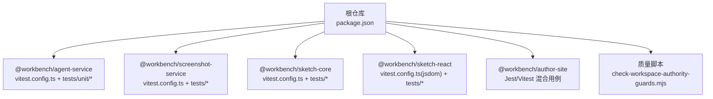
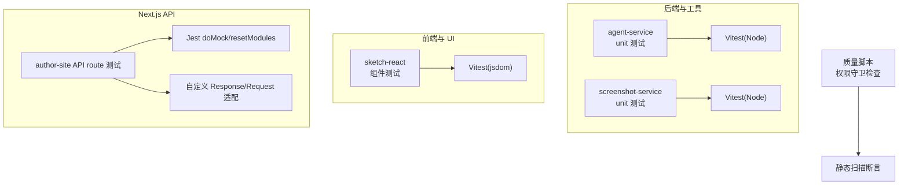
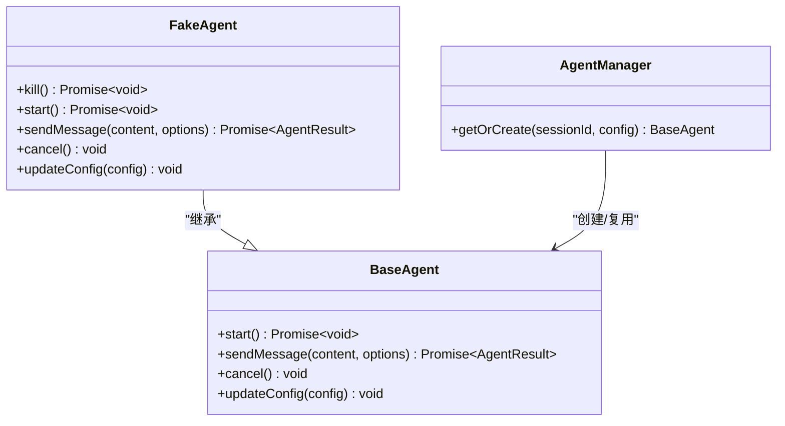
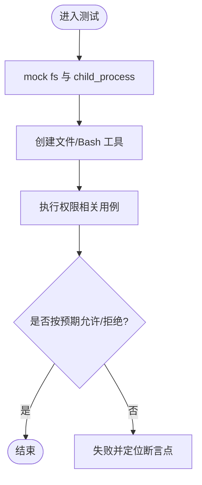
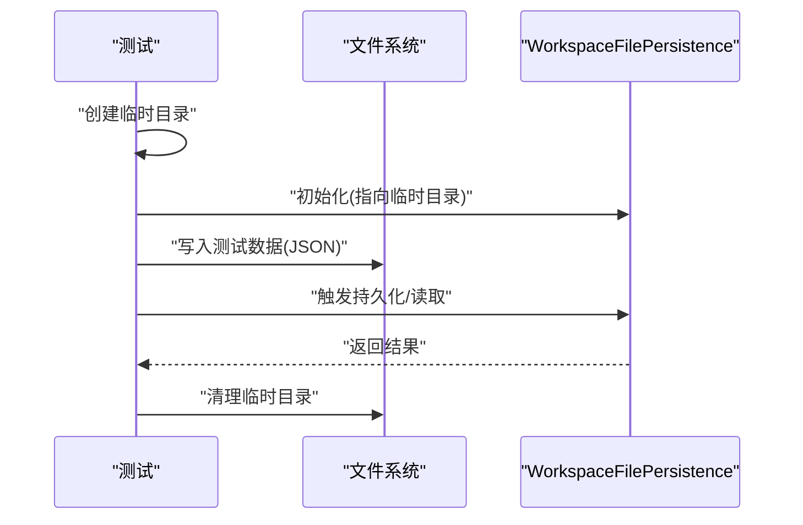
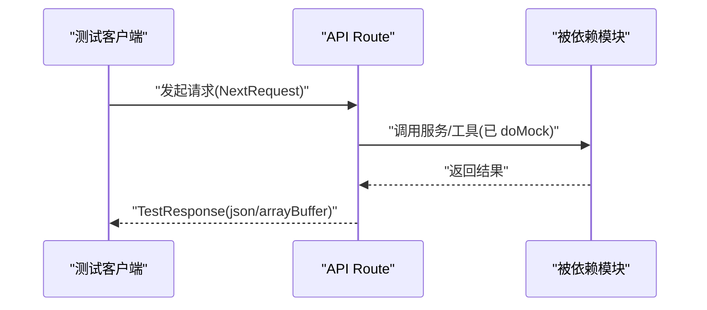
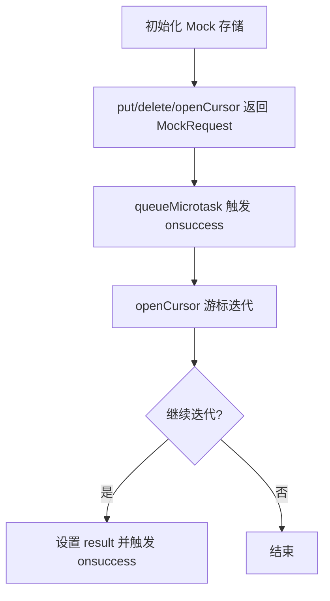
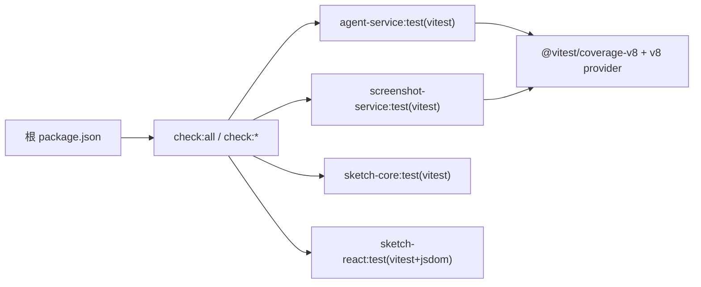

# 单元测试

<cite>
**本文引用的文件**
- [package.json](file://package.json)
- [packages/agent-service/package.json](file://packages/agent-service/package.json)
- [packages/agent-service/vitest.config.ts](file://packages/agent-service/vitest.config.ts)
- [packages/screenshot-service/vitest.config.ts](file://packages/screenshot-service/vitest.config.ts)
- [packages/sketch-core/vitest.config.ts](file://packages/sketch-core/vitest.config.ts)
- [packages/sketch-react/vitest.config.ts](file://packages/sketch-react/vitest.config.ts)
- [packages/agent-service/tests/unit/agent-manager.test.ts](file://packages/agent-service/tests/unit/agent-manager.test.ts)
- [packages/agent-service/tests/unit/file-tools-permissions.test.ts](file://packages/agent-service/tests/unit/file-tools-permissions.test.ts)
- [packages/agent-service/tests/unit/collab-persistence.test.ts](file://packages/agent-service/tests/unit/collab-persistence.test.ts)
- [packages/agent-service/src/session/snapshot-service.ts](file://packages/agent-service/src/session/snapshot-service.ts)
- [packages/author-site/src/lib/__tests__/workspace-offline-drafts.test.ts](file://packages/author-site/src/lib/__tests__/workspace-offline-drafts.test.ts)
- [packages/author-site/src/app/api/screenshots/ensure/route.test.ts](file://packages/author-site/src/app/api/screenshots/ensure/route.test.ts)
- [packages/author-site/src/app/api/workspace-authority/[projectId]/[workspaceId]/[...segments]/route.test.ts](file://packages/author-site/src/app/api/workspace-authority/[projectId]/[workspaceId]/[...segments]/route.test.ts)
- [scripts/check-workspace-authority-guards.mjs](file://scripts/check-workspace-authority-guards.mjs)
</cite>

## 目录
1. [简介](#简介)
2. [项目结构](#项目结构)
3. [核心组件](#核心组件)
4. [架构总览](#架构总览)
5. [详细组件分析](#详细组件分析)
6. [依赖分析](#依赖分析)
7. [性能考虑](#性能考虑)
8. [故障排查指南](#故障排查指南)
9. [结论](#结论)
10. [附录](#附录)

## 简介
本文件面向 Workbench 平台的单元测试实践，聚焦 Jest 与 Vitest 的配置与使用、测试组织方式、模拟对象创建与数据准备策略，并围绕核心业务模块（项目服务、Agent 管理、文件操作等）给出可落地的单测实现方法。同时提供覆盖率配置与报告生成、异步与错误处理、边界条件测试的最佳实践，以及调试技巧与具体用例路径指引。

## 项目结构
Workbench 采用多包工作区，各子包独立维护测试与运行脚本；根级 package.json 提供统一入口命令以驱动各包的类型检查与测试。

图表来源
- [package.json:1-101](file://package.json#L1-L101)
- [packages/agent-service/vitest.config.ts:1-31](file://packages/agent-service/vitest.config.ts#L1-L31)
- [packages/screenshot-service/vitest.config.ts:1-24](file://packages/screenshot-service/vitest.config.ts#L1-L24)
- [packages/sketch-core/vitest.config.ts:1-8](file://packages/sketch-core/vitest.config.ts#L1-L8)
- [packages/sketch-react/vitest.config.ts:1-8](file://packages/sketch-react/vitest.config.ts#L1-L8)
- [scripts/check-workspace-authority-guards.mjs:43-91](file://scripts/check-workspace-authority-guards.mjs#L43-L91)

章节来源
- [package.json:1-101](file://package.json#L1-L101)

## 核心组件
- 测试框架选择
  - 后端与工具类：Vitest（Node 环境），支持 v8 覆盖率、别名解析、超时与包含/排除规则。
  - React 组件：Vitest + jsdom 环境。
  - Next.js API Route 与浏览器 API：部分使用 Jest（doMock/resetModules）或自定义 Response/Request 适配。
- 运行与覆盖
  - 子包通过 vitest run / --coverage 执行；根脚本聚合各包 check:* 任务。
- 关键能力
  - 全局变量、超时、include/exclude、v8 提供者、HTML/text 报告输出、别名映射。

章节来源
- [packages/agent-service/package.json:1-53](file://packages/agent-service/package.json#L1-L53)
- [packages/agent-service/vitest.config.ts:1-31](file://packages/agent-service/vitest.config.ts#L1-L31)
- [packages/screenshot-service/vitest.config.ts:1-24](file://packages/screenshot-service/vitest.config.ts#L1-L24)
- [packages/sketch-core/vitest.config.ts:1-8](file://packages/sketch-core/vitest.config.ts#L1-L8)
- [packages/sketch-react/vitest.config.ts:1-8](file://packages/sketch-react/vitest.config.ts#L1-L8)
- [package.json:1-101](file://package.json#L1-L101)

## 架构总览
下图展示测试在仓库中的位置与职责划分：后端逻辑由 Vitest 驱动，React 组件在 jsdom 中运行，API 路由测试通过自定义请求/响应适配或 Jest 的模块替换完成。

图表来源
- [packages/agent-service/vitest.config.ts:1-31](file://packages/agent-service/vitest.config.ts#L1-L31)
- [packages/screenshot-service/vitest.config.ts:1-24](file://packages/screenshot-service/vitest.config.ts#L1-L24)
- [packages/sketch-react/vitest.config.ts:1-8](file://packages/sketch-react/vitest.config.ts#L1-L8)
- [packages/author-site/src/app/api/screenshots/ensure/route.test.ts:53-81](file://packages/author-site/src/app/api/screenshots/ensure/route.test.ts#L53-L81)
- [packages/author-site/src/app/api/workspace-authority/[projectId]/[workspaceId]/[...segments]/route.test.ts:22-47](file://packages/author-site/src/app/api/workspace-authority/[projectId]/[workspaceId]/[...segments]/route.test.ts#L22-L47)
- [scripts/check-workspace-authority-guards.mjs:43-91](file://scripts/check-workspace-authority-guards.mjs#L43-L91)

## 详细组件分析

### Agent 管理单元测试
- 目标
  - 验证 AgentManager 在 toolVersion 变化时的重建策略：空闲时重建，处理中时保持原实例。
- 关键点
  - 使用 vi.fn() 构造 FakeAgent，注入 kill/start/sendMessage 等行为。
  - 通过工厂函数集中创建与管理 FakeAgent 实例，便于断言生命周期。
- 建议扩展
  - 增加并发消息发送、取消流程、异常恢复等场景。
  - 对 AgentConfig 变更进行增量合并校验。

图表来源
- [packages/agent-service/tests/unit/agent-manager.test.ts:1-76](file://packages/agent-service/tests/unit/agent-manager.test.ts#L1-L76)

章节来源
- [packages/agent-service/tests/unit/agent-manager.test.ts:1-76](file://packages/agent-service/tests/unit/agent-manager.test.ts#L1-L76)

### 文件操作与权限测试
- 目标
  - 验证文件读写、列表、编辑、Bash 工具在权限控制下的行为。
- 关键点
  - 使用 vi.mock('fs') 与 vi.mock('child_process') 隔离系统调用。
  - 基于最小权限原则构造 mock，确保越权写入被拦截。
- 建议扩展
  - 覆盖路径穿越、符号链接、大文件、并发写等边界。
  - 结合快照服务（git stage/unstage/discard）做集成式断言。

图表来源
- [packages/agent-service/tests/unit/file-tools-permissions.test.ts:1-28](file://packages/agent-service/tests/unit/file-tools-permissions.test.ts#L1-L28)
- [packages/agent-service/src/session/snapshot-service.ts:270-300](file://packages/agent-service/src/session/snapshot-service.ts#L270-L300)

章节来源
- [packages/agent-service/tests/unit/file-tools-permissions.test.ts:1-28](file://packages/agent-service/tests/unit/file-tools-permissions.test.ts#L1-L28)
- [packages/agent-service/src/session/snapshot-service.ts:270-300](file://packages/agent-service/src/session/snapshot-service.ts#L270-L300)

### 协作持久化与临时目录
- 目标
  - 验证 WorkspaceFilePersistence 在真实文件系统上的读写与清理。
- 关键点
  - 使用 os.tmpdir 创建临时目录，beforeEach/afterEach 保证隔离与回收。
  - 通过 writeJson 辅助函数准备 JSON 数据，简化用例编写。
- 建议扩展
  - 加入并发写入、磁盘空间不足、权限不足等异常路径。

图表来源
- [packages/agent-service/tests/unit/collab-persistence.test.ts:1-14](file://packages/agent-service/tests/unit/collab-persistence.test.ts#L1-L14)

章节来源
- [packages/agent-service/tests/unit/collab-persistence.test.ts:1-14](file://packages/agent-service/tests/unit/collab-persistence.test.ts#L1-L14)

### Next.js API 路由测试（作者站点）
- 目标
  - 验证截图生成、资源版本、工作区权限等 API 的行为。
- 关键点
  - 使用自定义 TestResponse 模拟 Web Response，支持 json()/arrayBuffer()。
  - 通过 jest.doMock/jest.resetModules 动态替换模块依赖，避免副作用。
- 建议扩展
  - 增加网络错误、超时、鉴权失败的分支用例。
  - 引入请求体大小限制、非法参数等边界条件。

图表来源
- [packages/author-site/src/app/api/screenshots/ensure/route.test.ts:53-81](file://packages/author-site/src/app/api/screenshots/ensure/route.test.ts#L53-L81)
- [packages/author-site/src/app/api/workspace-authority/[projectId]/[workspaceId]/[...segments]/route.test.ts:22-47](file://packages/author-site/src/app/api/workspace-authority/[projectId]/[workspaceId]/[...segments]/route.test.ts#L22-L47)

章节来源
- [packages/author-site/src/app/api/screenshots/ensure/route.test.ts:53-81](file://packages/author-site/src/app/api/screenshots/ensure/route.test.ts#L53-L81)
- [packages/author-site/src/app/api/workspace-authority/[projectId]/[workspaceId]/[...segments]/route.test.ts:22-47](file://packages/author-site/src/app/api/workspace-authority/[projectId]/[workspaceId]/[...segments]/route.test.ts#L22-L47)

### IndexedDB 离线草稿测试（浏览器环境）
- 目标
  - 验证离线草稿在浏览器环境下的增删改查与游标遍历。
- 关键点
  - 构造 MockObjectStore 与 MockRequest，使用 queueMicrotask 模拟异步成功回调。
  - 模拟 openCursor 的逐条迭代，确保 onsuccess 时序正确。
- 建议扩展
  - 覆盖空集合、重复键、删除后游标状态等边界。

图表来源
- [packages/author-site/src/lib/__tests__/workspace-offline-drafts.test.ts:50-104](file://packages/author-site/src/lib/__tests__/workspace-offline-drafts.test.ts#L50-L104)

章节来源
- [packages/author-site/src/lib/__tests__/workspace-offline-drafts.test.ts:50-104](file://packages/author-site/src/lib/__tests__/workspace-offline-drafts.test.ts#L50-L104)

## 依赖分析
- 测试框架与运行时
  - agent-service、screenshot-service、sketch-core、sketch-react 均使用 Vitest；其中 sketch-react 启用 jsdom。
  - author-site 部分 API 测试使用 Jest 的 doMock/resetModules 与自定义 Response。
- 覆盖率
  - 使用 @vitest/coverage-v8 与 v8 provider，输出 text、text-summary、html 报告至 coverage 目录。
- 别名与路径
  - agent-service 为 preview-contract 的 runtime/compiler 定义别名，便于跨包引用。
- 根脚本聚合
  - 根 package.json 提供 check:* 命令，串联 typecheck 与 test，保障一致性。

图表来源
- [package.json:1-101](file://package.json#L1-L101)
- [packages/agent-service/package.json:1-53](file://packages/agent-service/package.json#L1-L53)
- [packages/agent-service/vitest.config.ts:1-31](file://packages/agent-service/vitest.config.ts#L1-L31)
- [packages/screenshot-service/vitest.config.ts:1-24](file://packages/screenshot-service/vitest.config.ts#L1-L24)
- [packages/sketch-core/vitest.config.ts:1-8](file://packages/sketch-core/vitest.config.ts#L1-L8)
- [packages/sketch-react/vitest.config.ts:1-8](file://packages/sketch-react/vitest.config.ts#L1-L8)

章节来源
- [package.json:1-101](file://package.json#L1-L101)
- [packages/agent-service/package.json:1-53](file://packages/agent-service/package.json#L1-L53)
- [packages/agent-service/vitest.config.ts:1-31](file://packages/agent-service/vitest.config.ts#L1-L31)
- [packages/screenshot-service/vitest.config.ts:1-24](file://packages/screenshot-service/vitest.config.ts#L1-L24)
- [packages/sketch-core/vitest.config.ts:1-8](file://packages/sketch-core/vitest.config.ts#L1-L8)
- [packages/sketch-react/vitest.config.ts:1-8](file://packages/sketch-react/vitest.config.ts#L1-L8)

## 性能考虑
- 并行与隔离
  - 使用临时目录与 beforeEach/afterEach 隔离 I/O，避免用例间污染。
- 耗时操作
  - 将慢速 I/O 与外部依赖 mock 掉，必要时使用 testTimeout 调整。
- 覆盖率开销
  - 仅对 src/**/*.ts 统计，排除 server.ts 与 d.ts，减少无关开销。

## 故障排查指南
- 常见现象
  - 异步未等待导致断言失败：确认 await 或 return Promise。
  - 模块替换失效：在 Jest 下使用 jest.resetModules/jest.clearAllMocks，并确保 doMock 在 require 之前。
  - 浏览器 API 缺失：在 jsdom 环境下补齐 Response/Request 或提供 polyfill。
- 定位技巧
  - 缩小范围：只运行单个测试文件/用例。
  - 打印中间态：在关键分支前后输出上下文信息。
  - 权限守卫检查：使用脚本校验测试是否遗漏必要断言。

章节来源
- [scripts/check-workspace-authority-guards.mjs:43-91](file://scripts/check-workspace-authority-guards.mjs#L43-L91)

## 结论
Workbench 的单元测试体系以 Vitest 为主，辅以 Jest 与浏览器环境适配，覆盖了后端逻辑、UI 组件与 API 路由。通过统一的根脚本与覆盖率配置，保证了跨包一致性与可观测性。建议在现有基础上持续完善异步、错误与边界用例，并结合自动化脚本提升质量基线。

## 附录

### 覆盖率配置与报告
- 提供者与报告格式
  - 使用 v8 provider，输出 text、text-summary、html 报告到 coverage 目录。
- 包含与排除
  - include: src/**/*.ts；exclude: *.d.ts、server.ts 等。
- 阈值设置
  - 可在 vitest.config.ts 的 coverage.thresholds 中配置行/分支/函数/语句阈值，未满足则失败。
- 查看报告
  - 打开 coverage/index.html 进行可视化分析。

章节来源
- [packages/agent-service/vitest.config.ts:1-31](file://packages/agent-service/vitest.config.ts#L1-L31)
- [packages/screenshot-service/vitest.config.ts:1-24](file://packages/screenshot-service/vitest.config.ts#L1-L24)

### 异步代码测试最佳实践
- 使用 async/await 包裹测试用例，确保 Promise 完成后再断言。
- 对微任务与定时器，使用 flushPromises、advanceTimersByTime 或 queueMicrotask 配合断言。
- 对事件流（如 IndexedDB），确保 onsuccess 回调在正确时机触发。

章节来源
- [packages/author-site/src/lib/__tests__/workspace-offline-drafts.test.ts:50-104](file://packages/author-site/src/lib/__tests__/workspace-offline-drafts.test.ts#L50-L104)

### 错误处理与边界条件测试
- 明确区分成功与失败路径，分别断言返回值与日志/副作用。
- 覆盖空输入、超长输入、非法字符、权限不足、磁盘满等边界。
- 对并发写入与竞态条件，使用多次重复与随机化输入增强稳健性。

章节来源
- [packages/agent-service/tests/unit/file-tools-permissions.test.ts:1-28](file://packages/agent-service/tests/unit/file-tools-permissions.test.ts#L1-L28)
- [packages/agent-service/src/session/snapshot-service.ts:270-300](file://packages/agent-service/src/session/snapshot-service.ts#L270-L300)

### 调试技巧
- 单测聚焦：只运行当前文件或 describe 块。
- 逐步缩小：注释掉非相关断言，定位失败分支。
- 打印上下文：在关键路径输出入参、中间结果与环境变量。
- 利用别名与临时目录：快速切换实现与数据源，加速排障。