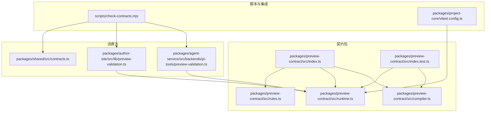
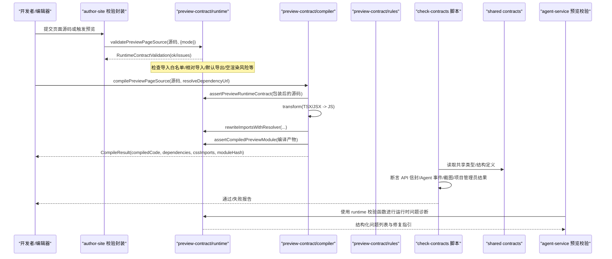
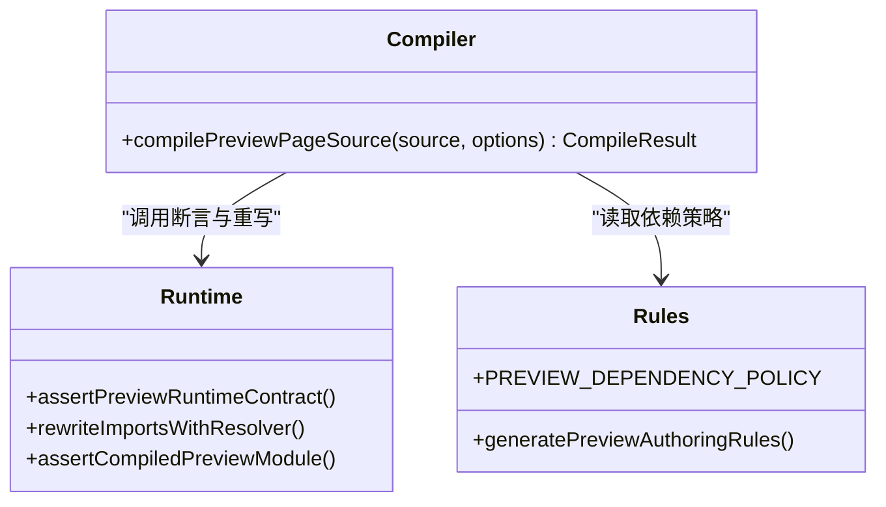
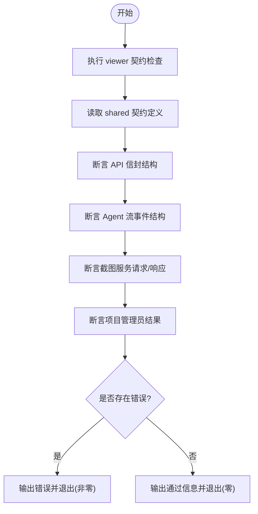
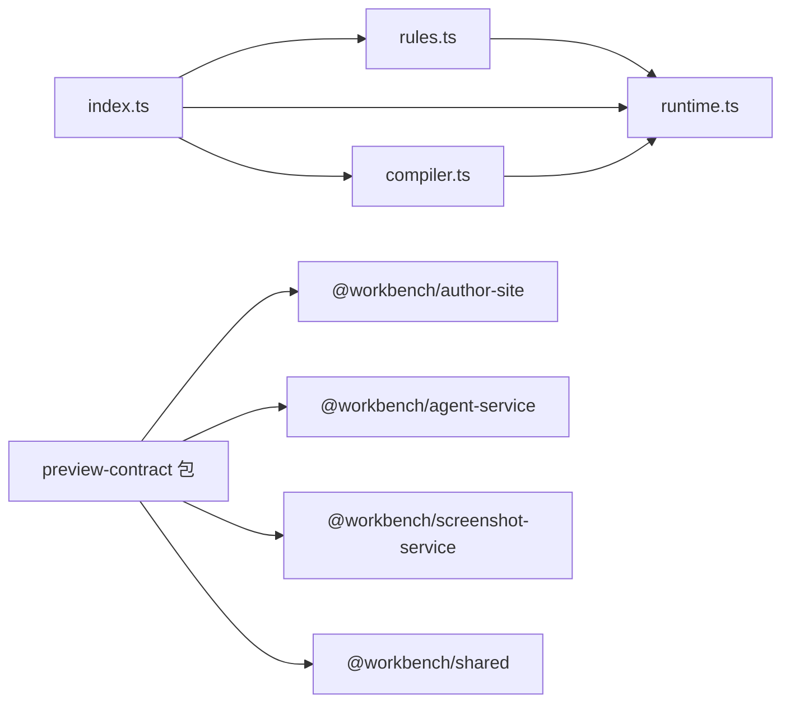

# 契约测试

<cite>
**本文引用的文件**   
- [packages/preview-contract/src/index.ts](file://packages/preview-contract/src/index.ts)
- [packages/preview-contract/src/rules.ts](file://packages/preview-contract/src/rules.ts)
- [packages/preview-contract/src/runtime.ts](file://packages/preview-contract/src/runtime.ts)
- [packages/preview-contract/src/compiler.ts](file://packages/preview-contract/src/compiler.ts)
- [packages/preview-contract/src/index.test.ts](file://packages/preview-contract/src/index.test.ts)
- [scripts/check-contracts.mjs](file://scripts/check-contracts.mjs)
- [packages/shared/src/contracts.ts](file://packages/shared/src/contracts.ts)
- [packages/project-core/vitest.config.ts](file://packages/project-core/vitest.config.ts)
- [packages/author-site/src/lib/preview-validation.ts](file://packages/author-site/src/lib/preview-validation.ts)
- [packages/agent-service/src/backends/pi-tools/preview-validation.ts](file://packages/agent-service/src/backends/pi-tools/preview-validation.ts)
</cite>

## 目录
1. [简介](#简介)
2. [项目结构](#项目结构)
3. [核心组件](#核心组件)
4. [架构总览](#架构总览)
5. [详细组件分析](#详细组件分析)
6. [依赖关系分析](#依赖关系分析)
7. [性能考量](#性能考量)
8. [故障排查指南](#故障排查指南)
9. [结论](#结论)
10. [附录](#附录)

## 简介
本文件面向 Workbench 平台的“契约测试”体系，聚焦于前后端接口一致性检查、预览运行时契约验证与版本兼容性保障。文档覆盖以下目标：
- TypeScript 类型定义同步与 API 契约校验
- 预览运行时契约的测试方法（组件接口、配置格式、渲染结果一致性）
- 共享类型定义的维护策略（变更影响分析与向后兼容保证）
- 在持续集成中的自动化检查流程与失败告警机制
- 最佳实践与问题排查指南

## 项目结构
围绕契约测试的关键代码集中在 preview-contract 包与脚本层，同时与 shared、project-core、author-site、agent-service 等模块协作，形成从源码到编译产物、再到运行时的全链路契约校验。



图示来源
- [packages/preview-contract/src/index.ts:1-4](file://packages/preview-contract/src/index.ts#L1-L4)
- [packages/preview-contract/src/rules.ts:1-37](file://packages/preview-contract/src/rules.ts#L1-L37)
- [packages/preview-contract/src/runtime.ts:1-500](file://packages/preview-contract/src/runtime.ts#L1-L500)
- [packages/preview-contract/src/compiler.ts:1-62](file://packages/preview-contract/src/compiler.ts#L1-L62)
- [packages/preview-contract/src/index.test.ts:1-194](file://packages/preview-contract/src/index.test.ts#L1-L194)
- [scripts/check-contracts.mjs:1-364](file://scripts/check-contracts.mjs#L1-L364)
- [packages/project-core/vitest.config.ts:1-12](file://packages/project-core/vitest.config.ts#L1-L12)
- [packages/author-site/src/lib/preview-validation.ts:1-39](file://packages/author-site/src/lib/preview-validation.ts#L1-L39)
- [packages/agent-service/src/backends/pi-tools/preview-validation.ts:1-39](file://packages/agent-service/src/backends/pi-tools/preview-validation.ts#L1-L39)
- [packages/shared/src/contracts.ts:1-202](file://packages/shared/src/contracts.ts#L1-L202)

章节来源
- [packages/preview-contract/src/index.ts:1-4](file://packages/preview-contract/src/index.ts#L1-L4)
- [packages/preview-contract/src/rules.ts:1-37](file://packages/preview-contract/src/rules.ts#L1-L37)
- [packages/preview-contract/src/runtime.ts:1-500](file://packages/preview-contract/src/runtime.ts#L1-L500)
- [packages/preview-contract/src/compiler.ts:1-62](file://packages/preview-contract/src/compiler.ts#L1-L62)
- [packages/preview-contract/src/index.test.ts:1-194](file://packages/preview-contract/src/index.test.ts#L1-L194)
- [scripts/check-contracts.mjs:1-364](file://scripts/check-contracts.mjs#L1-L364)
- [packages/project-core/vitest.config.ts:1-12](file://packages/project-core/vitest.config.ts#L1-L12)
- [packages/author-site/src/lib/preview-validation.ts:1-39](file://packages/author-site/src/lib/preview-validation.ts#L1-L39)
- [packages/agent-service/src/backends/pi-tools/preview-validation.ts:1-39](file://packages/agent-service/src/backends/pi-tools/preview-validation.ts#L1-L39)
- [packages/shared/src/contracts.ts:1-202](file://packages/shared/src/contracts.ts#L1-L202)

## 核心组件
- 规则与版本
  - 通过常量与策略表声明预览运行时契约版本与受控依赖白名单，并生成面向创作端的规则说明文本，用于约束页面源码与依赖范围。
- 运行时契约校验
  - 提供对“作者模式”和“编译后模式”的源码校验能力，包括导入白名单、禁止相对源码导入、默认导出检测、空渲染风险、重复顶层声明、多默认导出等。
- 编译与转换
  - 基于转换器将 TSX/JSX 转换为运行时可执行模块，重写依赖解析路径，并对编译产物进行二次预检，确保产物符合运行时契约。
- 端到端契约脚本
  - 统一入口脚本负责跨包契约断言，包含对共享 API 信封、Agent 流事件、截图服务请求/响应、项目管理员结果等结构的静态与动态校验。
- 消费方集成
  - 前端与 Agent 工具侧通过统一接口调用预览运行时校验，并将问题结构化输出，便于 UI 展示与自动修复建议。

章节来源
- [packages/preview-contract/src/rules.ts:1-37](file://packages/preview-contract/src/rules.ts#L1-L37)
- [packages/preview-contract/src/runtime.ts:1-500](file://packages/preview-contract/src/runtime.ts#L1-L500)
- [packages/preview-contract/src/compiler.ts:1-62](file://packages/preview-contract/src/compiler.ts#L1-L62)
- [scripts/check-contracts.mjs:1-364](file://scripts/check-contracts.mjs#L1-L364)
- [packages/author-site/src/lib/preview-validation.ts:1-39](file://packages/author-site/src/lib/preview-validation.ts#L1-L39)
- [packages/agent-service/src/backends/pi-tools/preview-validation.ts:1-39](file://packages/agent-service/src/backends/pi-tools/preview-validation.ts#L1-L39)

## 架构总览
下图展示了从源码到编译产物、再到运行时的契约校验链路，以及跨包的契约一致性检查。



图示来源
- [packages/preview-contract/src/runtime.ts:1-500](file://packages/preview-contract/src/runtime.ts#L1-L500)
- [packages/preview-contract/src/compiler.ts:1-62](file://packages/preview-contract/src/compiler.ts#L1-L62)
- [packages/preview-contract/src/rules.ts:1-37](file://packages/preview-contract/src/rules.ts#L1-L37)
- [scripts/check-contracts.mjs:1-364](file://scripts/check-contracts.mjs#L1-L364)
- [packages/shared/src/contracts.ts:1-202](file://packages/shared/src/contracts.ts#L1-L202)
- [packages/author-site/src/lib/preview-validation.ts:1-39](file://packages/author-site/src/lib/preview-validation.ts#L1-L39)
- [packages/agent-service/src/backends/pi-tools/preview-validation.ts:1-39](file://packages/agent-service/src/backends/pi-tools/preview-validation.ts#L1-L39)

## 详细组件分析

### 预览运行时契约（runtime）
- 职责
  - 定义运行时契约阶段、错误码与问题对象模型
  - 对作者模式与编译后模式的源码进行静态分析
  - 识别非法导入、重复绑定、多默认导出、空渲染风险等
- 关键能力
  - 源码包装与导入提取
  - 依赖白名单校验（含 lucide-react 图标存在性）
  - 默认导出与顶层绑定冲突检测
  - 编译产物预检（不执行用户代码）
- 复杂度与性能
  - 主要开销在于 AST 遍历与正则匹配；对单页源码规模较小，整体为线性时间复杂度
- 错误处理
  - 以结构化 issues 返回，区分 stage/code/severity/instruction，便于上层呈现与自动修复

```mermaid
flowchart TD
Start(["进入 validatePreviewPageSource"]) --> Wrap["包装源码<br/>wrapPreviewPageSource"]
Wrap --> Extract["提取导入声明<br/>extractImportDeclarations"]
Extract --> Loop{"遍历每个导入"}
Loop --> |type-only| Next["跳过类型导入"]
Loop --> |CSS| Next
Loop --> |react/jsx-runtime(authoring)| Issue1["AUTHORING_RUNTIME_IMPORT_UNSUPPORTED"]
Loop --> |非NPM包| Issue2["RELATIVE_IMPORT_UNSUPPORTED"]
Loop --> |未登记npm| Issue3["UNKNOWN_NPM_IMPORT"]
Loop --> |合法| Next
Next --> CheckDefault["检测默认导出/空渲染风险"]
CheckDefault --> TopLevel["检测顶层绑定冲突/多默认导出"]
TopLevel --> Result["返回 RuntimeContractValidation"]
```

图示来源
- [packages/preview-contract/src/runtime.ts:1-500](file://packages/preview-contract/src/runtime.ts#L1-L500)

章节来源
- [packages/preview-contract/src/runtime.ts:1-500](file://packages/preview-contract/src/runtime.ts#L1-L500)

### 编译与转换（compiler）
- 职责
  - 将 TSX/JSX 源码转换为可在预览运行时执行的模块
  - 重写依赖解析路径，收集 CSS 导入与依赖清单
  - 对编译产物再次进行运行时契约断言
- 关键能力
  - 使用转换器进行 TS/JSX 转换
  - 注入运行时依赖路径
  - 计算模块哈希，用于缓存与一致性比对
- 错误处理
  - 转换失败时抛出运行时契约错误，携带具体阶段与修复指令



图示来源
- [packages/preview-contract/src/compiler.ts:1-62](file://packages/preview-contract/src/compiler.ts#L1-L62)
- [packages/preview-contract/src/runtime.ts:1-500](file://packages/preview-contract/src/runtime.ts#L1-L500)
- [packages/preview-contract/src/rules.ts:1-37](file://packages/preview-contract/src/rules.ts#L1-L37)

章节来源
- [packages/preview-contract/src/compiler.ts:1-62](file://packages/preview-contract/src/compiler.ts#L1-L62)

### 规则与版本（rules）
- 职责
  - 声明预览运行时契约版本与受控依赖白名单
  - 生成面向创作端的规则文本，指导 AI 与开发者遵循高保真 React 页面规范
- 关键点
  - 版本字符串作为 SDK 依赖版本号，实现强一致绑定
  - 规则文本包含导入限制、渲染要求与 schema 使用约定

章节来源
- [packages/preview-contract/src/rules.ts:1-37](file://packages/preview-contract/src/rules.ts#L1-L37)

### 端到端契约脚本（check-contracts）
- 职责
  - 统一断言跨包契约一致性：共享 API 信封、Agent 流事件、截图服务请求/响应、项目管理员结果等
  - 调用 viewer 子契约检查脚本，汇总错误并退出状态码
- 关键能力
  - 读取源文件并进行 token 级存在性断言
  - 构造典型样例数据，校验响应结构与字段完整性
  - 输出警告与错误，失败时以非零退出码终止进程



图示来源
- [scripts/check-contracts.mjs:1-364](file://scripts/check-contracts.mjs#L1-L364)

章节来源
- [scripts/check-contracts.mjs:1-364](file://scripts/check-contracts.mjs#L1-L364)

### 共享类型与 Workspace 契约（shared）
- 职责
  - 定义工作区权威服务的持久化契约，包括变更操作、回执、事件流与资源路径规范化
- 关键点
  - 错误码枚举与类型守卫函数
  - 资源路径归一化与管理范围判定
  - 文本写入安全断言

章节来源
- [packages/shared/src/contracts.ts:1-202](file://packages/shared/src/contracts.ts#L1-L202)

### 消费方集成（author-site 与 agent-service）
- author-site
  - 封装 workspace 预览运行时校验，将问题映射到具体文件路径，便于 UI 展示
- agent-service
  - 使用 preview-contract 的运行时校验能力，结合工具链上下文给出修复建议与决策门限

章节来源
- [packages/author-site/src/lib/preview-validation.ts:1-39](file://packages/author-site/src/lib/preview-validation.ts#L1-L39)
- [packages/agent-service/src/backends/pi-tools/preview-validation.ts:1-39](file://packages/agent-service/src/backends/pi-tools/preview-validation.ts#L1-L39)

### 单元测试（preview-contract）
- 覆盖场景
  - 接受原始 JSX/TSX、阻止相对导入、阻止未登记 npm 依赖、阻止 authoring 手写 jsx-runtime、允许 compiled 模式、阻止 return null、自动包装裸 JSX、重复顶层声明与多默认导出检测、module preflight 不执行用户代码、生成创作规则等
- 作用
  - 保障运行时契约与编译器行为稳定，防止回归

章节来源
- [packages/preview-contract/src/index.test.ts:1-194](file://packages/preview-contract/src/index.test.ts#L1-L194)

## 依赖关系分析
- 内部依赖
  - compiler 依赖 runtime 与 rules
  - index 聚合导出 rules/runtime/compiler
  - project-core 的 vitest 配置将 @workbench/preview-contract 指向源码，便于测试期直接引用
- 外部依赖
  - 使用 TypeScript 与 Sucrase 进行语法分析与转换
  - 使用 lucide-react 作为图标库白名单之一
- 耦合与内聚
  - runtime 承担主要契约逻辑，内聚度高；compiler 仅做转换与重写，职责清晰；rules 纯配置与规则文本，低耦合



图示来源
- [packages/preview-contract/src/index.ts:1-4](file://packages/preview-contract/src/index.ts#L1-L4)
- [packages/preview-contract/src/rules.ts:1-37](file://packages/preview-contract/src/rules.ts#L1-L37)
- [packages/preview-contract/src/runtime.ts:1-500](file://packages/preview-contract/src/runtime.ts#L1-L500)
- [packages/preview-contract/src/compiler.ts:1-62](file://packages/preview-contract/src/compiler.ts#L1-L62)

章节来源
- [packages/preview-contract/src/index.ts:1-4](file://packages/preview-contract/src/index.ts#L1-L4)
- [packages/preview-contract/src/rules.ts:1-37](file://packages/preview-contract/src/rules.ts#L1-L37)
- [packages/preview-contract/src/runtime.ts:1-500](file://packages/preview-contract/src/runtime.ts#L1-L500)
- [packages/preview-contract/src/compiler.ts:1-62](file://packages/preview-contract/src/compiler.ts#L1-L62)
- [packages/project-core/vitest.config.ts:1-12](file://packages/project-core/vitest.config.ts#L1-L12)

## 性能考量
- 源码校验与编译转换均为单文件级别，AST 遍历与正则匹配开销可控
- 模块哈希可用于缓存与增量更新，避免重复渲染与网络传输
- 建议在批量任务中复用已构建的依赖解析器与缓存结果，减少重复计算

## 故障排查指南
- 常见错误与定位
  - UNKNOWN_NPM_IMPORT：检查依赖是否在白名单中，必要时扩展 PREVIEW_DEPENDENCY_POLICY
  - RELATIVE_IMPORT_UNSUPPORTED：页面需保持单文件，共享能力使用 @preview/sdk
  - AUTHORING_RUNTIME_IMPORT_UNSUPPORTED：不要手动导入 react/jsx-runtime，交由编译器处理
  - EMPTY_RENDER_RISK：默认组件不得返回 null，需显示可见 DOM
  - DUPLICATE_TOP_LEVEL_DECLARATION / MULTIPLE_DEFAULT_EXPORTS：修正重复声明或多默认导出
  - GENERATED_MODULE_BINDING_CONFLICT：编译产物与用户变量命名冲突，调整变量名
- 快速自检步骤
  - 运行 preview-contract 单元测试，确认用例全部通过
  - 运行 check-contracts 脚本，查看跨包契约是否一致
  - 在 author-site 或 agent-service 中调用运行时校验，根据 instruction 字段修复问题

章节来源
- [packages/preview-contract/src/index.test.ts:1-194](file://packages/preview-contract/src/index.test.ts#L1-L194)
- [scripts/check-contracts.mjs:1-364](file://scripts/check-contracts.mjs#L1-L364)
- [packages/preview-contract/src/runtime.ts:1-500](file://packages/preview-contract/src/runtime.ts#L1-L500)

## 结论
Workbench 的契约测试体系通过“规则+运行时校验+编译产物预检+端到端脚本”的组合，实现了从源码到运行时的全链路一致性保障。借助共享类型与版本化策略，系统能够在演进过程中维持向后兼容，并在 CI 中提供稳定的自动化检查与告警。

## 附录
- 持续集成集成方案（建议）
  - 在 PR 合并前执行 preview-contract 单元测试与 check-contracts 脚本
  - 将失败输出归档为工件，便于回溯与告警
  - 对关键契约变更引入人工评审与发布说明
- 最佳实践
  - 新增依赖必须同步更新白名单与规则文本
  - 对破坏性变更采用版本升级策略，并通过契约脚本强制校验
  - 在消费方封装统一的错误展示与修复指引