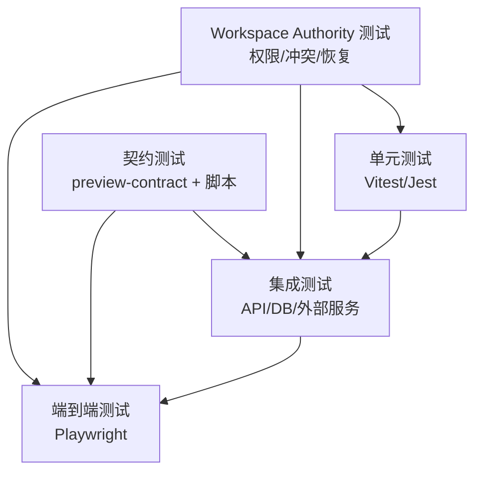
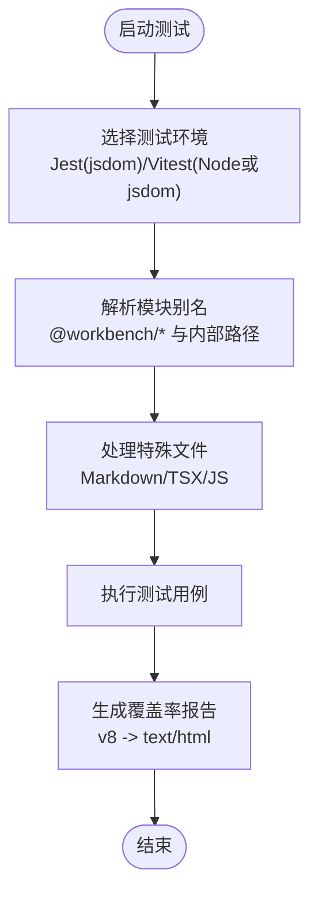
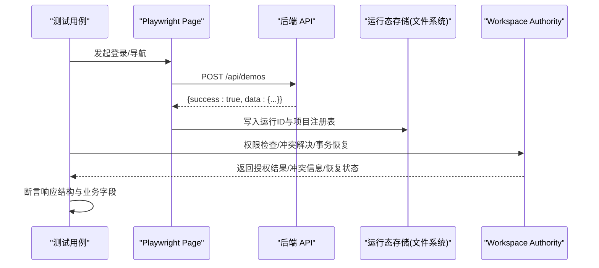
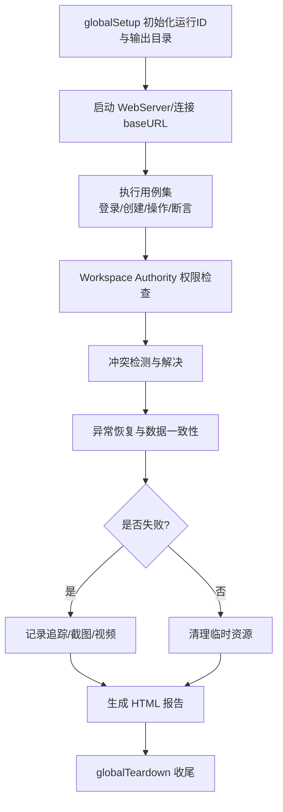
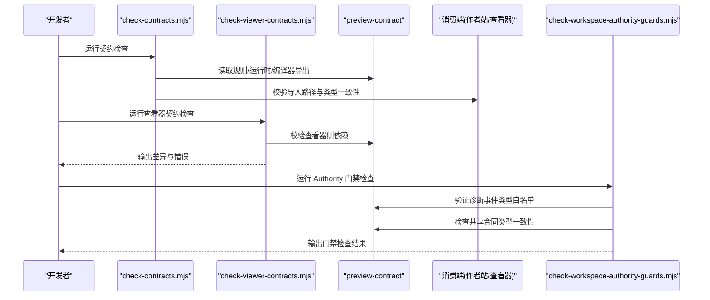
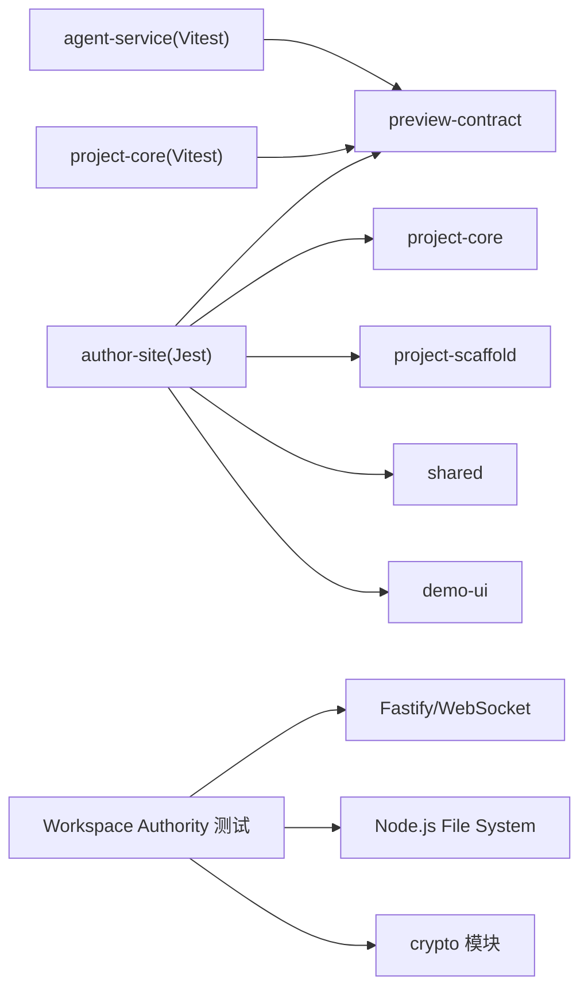

# 测试策略

<cite>
**本文引用的文件**   
- [package.json](file://package.json)
- [packages/author-site/jest.config.ts](file://packages/author-site/jest.config.ts)
- [packages/agent-service/vitest.config.ts](file://packages/agent-service/vitest.config.ts)
- [packages/project-core/vitest.config.ts](file://packages/project-core/vitest.config.ts)
- [packages/screenshot-service/vitest.config.ts](file://packages/screenshot-service/vitest.config.ts)
- [packages/sketch-core/vitest.config.ts](file://packages/sketch-core/vitest.config.ts)
- [packages/sketch-react/vitest.config.ts](file://packages/sketch-react/vitest.config.ts)
- [test/sketch-playground/playwright.config.ts](file://test/sketch-playground/playwright.config.ts)
- [test/创作端E2E回归测试/playwright.config.ts](file://test/创作端E2E回归测试/playwright.config.ts)
- [test/创作端E2E回归测试/global-setup.ts](file://test/创作端E2E回归测试/global-setup.ts)
- [test/创作端E2E回归测试/support/e2e-projects.ts](file://test/创作端E2E回归测试/support/e2e-projects.ts)
- [test/创作端E2E回归测试/workspace-mutation-authority.spec.ts](file://test/创作端E2E回归测试/workspace-mutation-authority.spec.ts)
- [packages/preview-contract/package.json](file://packages/preview-contract/package.json)
- [scripts/check-contracts.mjs](file://scripts/check-contracts.mjs)
- [scripts/check-viewer-contracts.mjs](file://scripts/check-viewer-contracts.mjs)
- [packages/agent-service/tests/unit/workspace-authority-startup-recovery.test.ts](file://packages/agent-service/tests/unit/workspace-authority-startup-recovery.test.ts)
- [packages/agent-service/tests/unit/workspace-authority-routes.test.ts](file://packages/agent-service/tests/unit/workspace-authority-routes.test.ts)
- [packages/agent-service/tests/unit/workspace-authority-migration.test.ts](file://packages/agent-service/tests/unit/workspace-authority-migration.test.ts)
- [scripts/check-workspace-authority-guards.mjs](file://scripts/check-workspace-authority-guards.mjs)
</cite>

## 更新摘要
**变更内容**   
- 新增 Workspace Authority 完整测试覆盖，包括权限操作、冲突解决和恢复场景的40+测试套件
- 扩展集成测试验证完整的变更工作流，涵盖多页面修改、并发编辑和外部漂移检测
- 增强契约测试确保共享契约的一致性，包括诊断事件类型和字段白名单校验
- 新增启动恢复、迁移工具和部署前检查的专项测试套件

## 目录
1. [简介](#简介)
2. [项目结构](#项目结构)
3. [核心组件](#核心组件)
4. [架构总览](#架构总览)
5. [详细组件分析](#详细组件分析)
6. [依赖分析](#依赖分析)
7. [性能考虑](#性能考虑)
8. [故障排查指南](#故障排查指南)
9. [结论](#结论)
10. [附录](#附录)

## 简介
本测试策略面向 Workbench 平台，覆盖单元测试、集成测试、端到端（E2E）测试与契约测试的完整体系。目标包括：
- 统一 Jest 与 Vitest 的测试框架配置与最佳实践
- 建立可复用的模拟对象与覆盖率报告机制
- 设计并实施 API 接口测试、数据库集成测试与外部服务模拟
- 基于 Playwright 构建 E2E 用户场景与视觉回归测试
- 实现前后端契约一致性检查与版本兼容性验证
- 提供测试数据管理、环境配置与持续集成流水线建议
- 总结测试最佳实践、性能测试方法与调试技巧

**更新** 新增 Workspace Authority 全面测试覆盖，包括权限控制、冲突解决、事务恢复等关键场景的40+测试套件，确保系统的一致性和可靠性。

## 项目结构
仓库采用多包工作区组织，测试相关配置分布在根脚本与各子包中：
- 根级脚本集中编排测试命令与 CI 流程
- 前端站点使用 Jest + jsdom 进行组件与逻辑测试
- 后端与核心库使用 Vitest 进行单元与集成测试
- E2E 用例集中在 test 目录下，按功能域划分
- Workspace Authority 专项测试覆盖权限、冲突、恢复等核心场景

```mermaid
graph TB
subgraph "根层"
Root["根 package.json<br/>测试脚本入口"]
Scripts["scripts/*<br/>契约检查/工具脚本"]
end
subgraph "前端"
AuthorSite["packages/author-site<br/>Jest 配置"]
end
subgraph "后端与核心"
AgentSvc["packages/agent-service<br/>Vitest 配置"]
ProjectCore["packages/project-core<br/>Vitest 配置"]
ScreenshotSvc["packages/screenshot-service<br/>Vitest 配置"]
SketchCore["packages/sketch-core<br/>Vitest 配置"]
SketchReact["packages/sketch-react<br/>Vitest 配置"]
PreviewContract["packages/preview-contract<br/>契约定义与测试"]
end
subgraph "Workspace Authority 测试"
AuthStartupRecovery["workspace-authority-startup-recovery.test.ts<br/>启动恢复测试"]
AuthRoutes["workspace-authority-routes.test.ts<br/>API路由测试"]
AuthMigration["workspace-authority-migration.test.ts<br/>迁移测试"]
end
subgraph "E2E"
E2EAuthor["test/创作端E2E回归测试<br/>Playwright 配置与用例"]
SketchPG["test/sketch-playground<br/>Playwright 配置与用例"]
AuthorityE2E["workspace-mutation-authority.spec.ts<br/>权限操作E2E测试"]
end
Root --> AuthorSite
Root --> AgentSvc
Root --> ProjectCore
Root --> ScreenshotSvc
Root --> SketchCore
Root --> SketchReact
Root --> PreviewContract
Root --> E2EAuthor
Root --> SketchPG
Root --> AuthStartupRecovery
Root --> AuthRoutes
Root --> AuthMigration
Scripts --> PreviewContract
Scripts --> AuthStartupRecovery
Scripts --> AuthRoutes
Scripts --> AuthMigration
```

**图表来源**
- [package.json:1-101](file://package.json#L1-L101)
- [packages/author-site/jest.config.ts:1-37](file://packages/author-site/jest.config.ts#L1-L37)
- [packages/agent-service/vitest.config.ts:1-32](file://packages/agent-service/vitest.config.ts#L1-L32)
- [packages/project-core/vitest.config.ts:1-13](file://packages/project-core/vitest.config.ts#L1-L13)
- [packages/screenshot-service/vitest.config.ts:1-24](file://packages/screenshot-service/vitest.config.ts#L1-L24)
- [packages/sketch-core/vitest.config.ts:1-8](file://packages/sketch-core/vitest.config.ts#L1-L8)
- [packages/sketch-react/vitest.config.ts:1-9](file://packages/sketch-react/vitest.config.ts#L1-L9)
- [test/创作端E2E回归测试/playwright.config.ts:1-45](file://test/创作端E2E回归测试/playwright.config.ts#L1-L45)
- [test/sketch-playground/playwright.config.ts:1-26](file://test/sketch-playground/playwright.config.ts#L1-L26)
- [packages/preview-contract/package.json:1-27](file://packages/preview-contract/package.json#L1-L27)
- [packages/agent-service/tests/unit/workspace-authority-startup-recovery.test.ts:1-152](file://packages/agent-service/tests/unit/workspace-authority-startup-recovery.test.ts#L1-L152)
- [packages/agent-service/tests/unit/workspace-authority-routes.test.ts:1-172](file://packages/agent-service/tests/unit/workspace-authority-routes.test.ts#L1-L172)
- [packages/agent-service/tests/unit/workspace-authority-migration.test.ts:1-52](file://packages/agent-service/tests/unit/workspace-authority-migration.test.ts#L1-L52)

章节来源
- [package.json:1-101](file://package.json#L1-L101)

## 核心组件
- 根级测试编排
  - 通过根 package.json 暴露统一的测试命令，如单包类型检查与测试、全量检查、E2E 运行等，便于在本地与 CI 中一致执行。
- 前端测试（Jest）
  - author-site 使用 Jest + Next.js 适配，启用 v8 覆盖率、jsdom 环境、模块别名映射与 MD 转换，支撑 React 组件与业务逻辑测试。
- 后端与核心库测试（Vitest）
  - agent-service、project-core、screenshot-service、sketch-core、sketch-react 均使用 Vitest，统一 include/exclude、超时、覆盖率与别名解析；部分包启用 jsdom 以支持 React 渲染测试。
- Workspace Authority 专项测试
  - 启动恢复测试验证 prepared mutation 回滚、stale lease 处理和孤立 state 防护
  - API 路由测试覆盖鉴权、状态查询、变更提交和投影确认
  - 迁移测试确保幂等性支持和 dry-run 模式正确性
- E2E 测试（Playwright）
  - 创作端 E2E 与 sketch-playground 分别维护独立配置，包含浏览器设备、重试、追踪、截图与视频收集、全局生命周期钩子与输出目录。
  - Workspace Authority E2E 测试覆盖权限操作、冲突解决、恢复场景和并发编辑。
- 契约测试
  - preview-contract 作为前后端共享契约包，配合根脚本进行一致性校验，确保编译器、运行时与规则在不同消费端保持一致。
  - Workspace Authority 诊断事件白名单和字段完整性校验。

**更新** 新增 Workspace Authority 完整测试覆盖，包括启动恢复、API路由、迁移工具等核心功能的40+测试套件，确保系统的一致性和可靠性。

章节来源
- [package.json:1-101](file://package.json#L1-L101)
- [packages/author-site/jest.config.ts:1-37](file://packages/author-site/jest.config.ts#L1-L37)
- [packages/agent-service/vitest.config.ts:1-32](file://packages/agent-service/vitest.config.ts#L1-L32)
- [packages/project-core/vitest.config.ts:1-13](file://packages/project-core/vitest.config.ts#L1-L13)
- [packages/screenshot-service/vitest.config.ts:1-24](file://packages/screenshot-service/vitest.config.ts#L1-L24)
- [packages/sketch-core/vitest.config.ts:1-8](file://packages/sketch-core/vitest.config.ts#L1-L8)
- [packages/sketch-react/vitest.config.ts:1-9](file://packages/sketch-react/vitest.config.ts#L1-L9)
- [test/创作端E2E回归测试/playwright.config.ts:1-45](file://test/创作端E2E回归测试/playwright.config.ts#L1-L45)
- [test/sketch-playground/playwright.config.ts:1-26](file://test/sketch-playground/playwright.config.ts#L1-L26)
- [packages/preview-contract/package.json:1-27](file://packages/preview-contract/package.json#L1-L27)
- [packages/agent-service/tests/unit/workspace-authority-startup-recovery.test.ts:1-152](file://packages/agent-service/tests/unit/workspace-authority-startup-recovery.test.ts#L1-L152)
- [packages/agent-service/tests/unit/workspace-authority-routes.test.ts:1-172](file://packages/agent-service/tests/unit/workspace-authority-routes.test.ts#L1-L172)
- [packages/agent-service/tests/unit/workspace-authority-migration.test.ts:1-52](file://packages/agent-service/tests/unit/workspace-authority-migration.test.ts#L1-L52)

## 架构总览
测试架构分层清晰：
- 单元测试：各包内 vitest/jest 快速反馈，聚焦函数/类/组件行为
- 集成测试：API 路由、数据库交互、外部服务模拟
- E2E 测试：真实浏览器自动化，覆盖关键用户路径
- 契约测试：跨包/跨端的一致性保障
- Workspace Authority 专项测试：权限控制、冲突解决、事务恢复等核心场景

**更新** 新增 Workspace Authority 专项测试层，覆盖权限操作、冲突解决、恢复场景等关键业务逻辑，形成完整的测试金字塔。

[此图为概念性架构图，不直接映射具体源码文件]

## 详细组件分析

### 单元测试框架配置（Jest 与 Vitest）
- Jest（author-site）
  - 使用 next-jest 注入 Next 环境
  - 启用 v8 覆盖率、jsdom 测试环境
  - 设置 setupFilesAfterEnv、模块别名映射、MD 转换与 node_modules 白名单
- Vitest（多个包）
  - 统一 globals、testTimeout、include/exclude
  - 覆盖率 provider 为 v8，输出 text/text-summary/html 到 coverage 目录
  - 针对 React 组件的包启用 jsdom 环境
  - 通过 resolve.alias 指向预览契约的 runtime/compiler 等导出

**图表来源**
- [packages/author-site/jest.config.ts:1-37](file://packages/author-site/jest.config.ts#L1-L37)
- [packages/agent-service/vitest.config.ts:1-32](file://packages/agent-service/vitest.config.ts#L1-L32)
- [packages/project-core/vitest.config.ts:1-13](file://packages/project-core/vitest.config.ts#L1-L13)
- [packages/screenshot-service/vitest.config.ts:1-24](file://packages/screenshot-service/vitest.config.ts#L1-L24)
- [packages/sketch-core/vitest.config.ts:1-8](file://packages/sketch-core/vitest.config.ts#L1-L8)
- [packages/sketch-react/vitest.config.ts:1-9](file://packages/sketch-react/vitest.config.ts#L1-L9)

章节来源
- [packages/author-site/jest.config.ts:1-37](file://packages/author-site/jest.config.ts#L1-L37)
- [packages/agent-service/vitest.config.ts:1-32](file://packages/agent-service/vitest.config.ts#L1-L32)
- [packages/project-core/vitest.config.ts:1-13](file://packages/project-core/vitest.config.ts#L1-L13)
- [packages/screenshot-service/vitest.config.ts:1-24](file://packages/screenshot-service/vitest.config.ts#L1-L24)
- [packages/sketch-core/vitest.config.ts:1-8](file://packages/sketch-core/vitest.config.ts#L1-L8)
- [packages/sketch-react/vitest.config.ts:1-9](file://packages/sketch-react/vitest.config.ts#L1-L9)

### 模拟对象创建与覆盖率报告
- 模拟对象
  - 使用 jest.doMock 动态替换模块依赖，构造 DB 读取、Agent 推送/拉取等行为的替身
  - 在 API 路由测试中自定义 Response 与 Request 对象，模拟网络层返回
- 覆盖率
  - 统一使用 v8 provider，输出文本与 HTML 报告至各自包的 coverage 目录
  - 通过 include/exclude 控制统计范围，避免对 server 入口或类型声明的误报

章节来源
- [packages/author-site/src/lib/__tests__/backend-providers-sync.test.ts:1-47](file://packages/author-site/src/lib/__tests__/backend-providers-sync.test.ts#L1-L47)
- [packages/author-site/src/app/api/projects/[projectId]/demo-pages/reorder/route.test.ts:77-122](file://packages/author-site/src/app/api/projects/[projectId]/demo-pages/reorder/route.test.ts#L77-L122)
- [packages/agent-service/vitest.config.ts:10-16](file://packages/agent-service/vitest.config.ts#L10-L16)
- [packages/screenshot-service/vitest.config.ts:10-16](file://packages/screenshot-service/vitest.config.ts#L10-L16)

### 集成测试设计与实施（API、数据库、外部服务）
- API 接口测试
  - 通过页面请求或自定义 Request/Response 对象调用 /api/demos 等接口，断言成功响应体结构与字段
- 数据库集成测试
  - 利用全局状态与注册表持久化项目元信息，保证用例间隔离与可追溯
- 外部服务模拟
  - 通过 doMock 将外部依赖替换为可控实现，确保测试稳定性与可重复性
- Workspace Authority 集成测试
  - 启动恢复测试验证 prepared mutation 回滚、stale lease 处理和孤立 state 防护
  - API 路由测试覆盖鉴权、状态查询、变更提交和投影确认
  - 迁移测试确保幂等性支持和 dry-run 模式正确性

**图表来源**
- [test/创作端E2E回归测试/support/e2e-projects.ts:55-151](file://test/创作端E2E回归测试/support/e2e-projects.ts#L55-L151)
- [test/创作端E2E回归测试/workspace-mutation-authority.spec.ts:48-83](file://test/创作端E2E回归测试/workspace-mutation-authority.spec.ts#L48-83)
- [packages/agent-service/tests/unit/workspace-authority-routes.test.ts:62-124](file://packages/agent-service/tests/unit/workspace-authority-routes.test.ts#L62-L124)

章节来源
- [test/创作端E2E回归测试/support/e2e-projects.ts:55-151](file://test/创作端E2E回归测试/support/e2e-projects.ts#L55-L151)
- [test/创作端E2E回归测试/workspace-mutation-authority.spec.ts:48-83](file://test/创作端E2E回归测试/workspace-mutation-authority.spec.ts#L48-83)
- [packages/agent-service/tests/unit/workspace-authority-routes.test.ts:62-124](file://packages/agent-service/tests/unit/workspace-authority-routes.test.ts#L62-L124)

### E2E 测试框架（Playwright）
- 配置要点
  - 指定 baseURL、浏览器设备、重试策略、追踪/截图/视频收集策略
  - 通过 globalSetup/globalTeardown 管理运行期状态与资源清理
  - 输出 artifacts 与 reports 到独立目录，便于归档与分析
- 用户场景测试
  - 基于 page.request 与 UI 操作组合，覆盖登录、项目创建、权限校验等关键路径
- 视觉回归测试
  - 结合截图与视频留存，在失败时自动捕获，辅助定位差异
- Workspace Authority E2E 测试
  - 权限操作测试：验证不同角色的访问控制和操作限制
  - 冲突解决测试：模拟并发编辑场景，验证冲突检测和解决机制
  - 恢复场景测试：模拟服务重启、网络中断等异常情况，验证数据恢复能力

**图表来源**
- [test/创作端E2E回归测试/playwright.config.ts:1-45](file://test/创作端E2E回归测试/playwright.config.ts#L1-L45)
- [test/创作端E2E回归测试/global-setup.ts:1-14](file://test/创作端E2E回归测试/global-setup.ts#L1-L14)
- [test/sketch-playground/playwright.config.ts:1-26](file://test/sketch-playground/playwright.config.ts#L1-L26)
- [test/创作端E2E回归测试/workspace-mutation-authority.spec.ts:282-800](file://test/创作端E2E回归测试/workspace-mutation-authority.spec.ts#L282-L800)

章节来源
- [test/创作端E2E回归测试/playwright.config.ts:1-45](file://test/创作端E2E回归测试/playwright.config.ts#L1-L45)
- [test/创作端E2E回归测试/global-setup.ts:1-14](file://test/创作端E2E回归测试/global-setup.ts#L1-L14)
- [test/sketch-playground/playwright.config.ts:1-26](file://test/sketch-playground/playwright.config.ts#L1-L26)
- [test/创作端E2E回归测试/workspace-mutation-authority.spec.ts:282-800](file://test/创作端E2E回归测试/workspace-mutation-authority.spec.ts#L282-L800)

### 契约测试（前后端接口一致性与版本兼容）
- 契约包
  - preview-contract 暴露 rules/runtime/compiler 等多入口，供前后端共同消费
- 一致性检查
  - 根脚本 check-contracts 与 check-viewer-contracts 用于校验消费端与契约包的一致性
- 版本兼容
  - 通过独立的 exports 与 typecheck/test 脚本，确保不同消费端的编译与运行兼容
- Workspace Authority 契约测试
  - 诊断事件类型白名单校验：确保所有 workspace.* 事件类型都在允许列表中
  - 诊断字段完整性校验：验证必需字段如 projectId、workspaceId、sessionId 等的存在性
  - 共享合同一致性：确保 WorkspaceMutationErrorCode、WorkspaceAuthorityStreamEvent 等类型在所有消费端保持一致

**图表来源**
- [packages/preview-contract/package.json:1-27](file://packages/preview-contract/package.json#L1-L27)
- [scripts/check-contracts.mjs:135-365](file://scripts/check-contracts.mjs#L135-L365)
- [scripts/check-viewer-contracts.mjs:136-176](file://scripts/check-viewer-contracts.mjs#L136-L176)
- [scripts/check-workspace-authority-guards.mjs:330-990](file://scripts/check-workspace-authority-guards.mjs#L330-L990)

章节来源
- [packages/preview-contract/package.json:1-27](file://packages/preview-contract/package.json#L1-L27)
- [scripts/check-contracts.mjs:135-365](file://scripts/check-contracts.mjs#L135-L365)
- [scripts/check-viewer-contracts.mjs:136-176](file://scripts/check-viewer-contracts.mjs#L136-L176)
- [scripts/check-workspace-authority-guards.mjs:330-990](file://scripts/check-workspace-authority-guards.mjs#L330-L990)

### 测试数据管理策略
- 运行态隔离
  - 每个 E2E 运行生成唯一 runId，并将项目注册表与运行状态持久化到 test-outputs 下，避免用例间污染
- 命名规范
  - 用例名规范化后作为项目名称前缀，便于回溯与检索
- 共享资源
  - 提供 getOrCreateSharedE2EProject 等工具，减少重复创建开销
- Workspace Authority 测试数据
  - 使用临时目录和文件系统模拟真实的 Workspace 状态
  - 预置 prepared mutation、receipt、lease 等状态用于恢复场景测试
  - 通过哈希值验证文件内容一致性

章节来源
- [test/创作端E2E回归测试/support/e2e-projects.ts:55-151](file://test/创作端E2E回归测试/support/e2e-projects.ts#L55-L151)
- [packages/agent-service/tests/unit/workspace-authority-startup-recovery.test.ts:15-34](file://packages/agent-service/tests/unit/workspace-authority-startup-recovery.test.ts#L15-L34)
- [packages/agent-service/tests/unit/workspace-authority-migration.test.ts:9-23](file://packages/agent-service/tests/unit/workspace-authority-migration.test.ts#L9-L23)

### 测试环境配置
- 环境变量
  - E2E_BASE_URL 控制 E2E 基地址，CI 环境下开启 forbidOnly 与重试
- 并行与资源
  - E2E 默认串行执行，降低并发导致的竞态问题
- 产物与报告
  - artifacts 与 test-reports 分离，便于上传与归档
- Workspace Authority 测试环境
  - 使用内存文件系统模拟磁盘操作
  - 配置临时数据目录避免污染真实环境
  - 设置合理的超时时间处理异步恢复操作

章节来源
- [test/创作端E2E回归测试/playwright.config.ts:1-45](file://test/创作端E2E回归测试/playwright.config.ts#L1-L45)
- [packages/agent-service/tests/unit/workspace-authority-startup-recovery.test.ts:15-34](file://packages/agent-service/tests/unit/workspace-authority-startup-recovery.test.ts#L15-L34)

### 持续集成流水线建议
- 阶段划分
  - 静态检查与类型校验 → 单元测试 → 契约检查 → 集成/E2E 测试 → 覆盖率上报
- 命令编排
  - 使用根脚本 check:all 串联各包类型检查与测试
  - 单独触发 E2E 套件，必要时分片执行以提升吞吐
- 产物归档
  - 保留 HTML 报告、追踪与视频，关联到变更提交
- Workspace Authority 专项测试
  - 在 CI 中优先执行 Authority 相关测试，确保核心功能稳定性
  - 并行执行不同类型的 Authority 测试套件提升效率

章节来源
- [package.json:28-48](file://package.json#L28-L48)
- [package.json:65-78](file://package.json#L65-L78)

## 依赖分析
- 包内依赖
  - author-site 通过 Jest 模块映射引用 project-core、project-scaffold、preview-contract、shared、demo-ui 等
  - agent-service 与 project-core 通过 Vitest alias 引用 preview-contract 的 runtime/compiler
- 外部依赖
  - Playwright 驱动浏览器自动化
  - V8 覆盖率采集器生成报告
- 潜在循环依赖
  - 通过明确的 exports 与别名解析规避循环引用风险
- Workspace Authority 测试依赖
  - 依赖 Fastify 和 WebSocket 进行 API 路由测试
  - 使用 Node.js 文件系统 API 模拟磁盘操作
  - 引入 crypto 模块生成测试数据和哈希值

**图表来源**
- [packages/author-site/jest.config.ts:13-27](file://packages/author-site/jest.config.ts#L13-L27)
- [packages/agent-service/vitest.config.ts:18-30](file://packages/agent-service/vitest.config.ts#L18-L30)
- [packages/project-core/vitest.config.ts:6-11](file://packages/project-core/vitest.config.ts#L6-L11)
- [packages/agent-service/tests/unit/workspace-authority-routes.test.ts:6-12](file://packages/agent-service/tests/unit/workspace-authority-routes.test.ts#L6-L12)

章节来源
- [packages/author-site/jest.config.ts:13-27](file://packages/author-site/jest.config.ts#L13-L27)
- [packages/agent-service/vitest.config.ts:18-30](file://packages/agent-service/vitest.config.ts#L18-L30)
- [packages/project-core/vitest.config.ts:6-11](file://packages/project-core/vitest.config.ts#L6-L11)
- [packages/agent-service/tests/unit/workspace-authority-routes.test.ts:6-12](file://packages/agent-service/tests/unit/workspace-authority-routes.test.ts#L6-L12)

## 性能考虑
- 测试执行
  - 合理拆分套件，避免长尾用例阻塞整体进度
  - 对 E2E 使用 retries 与 on-first-retry 追踪，减少偶发失败影响
- 覆盖率
  - 仅统计业务代码，排除 server 入口与类型声明，提升指标可信度
- 资源占用
  - 控制并行度与浏览器实例数量，平衡速度与稳定性
- Workspace Authority 测试优化
  - 使用内存文件系统替代真实磁盘 I/O 提升测试速度
  - 并行执行不同类型的 Authority 测试套件
  - 复用测试数据和状态减少重复准备开销

[本节为通用指导，不直接分析具体文件]

## 故障排查指南
- 常见问题
  - 模块解析失败：检查 Jest/Vitest 的 moduleNameMapper/resolve.alias 是否正确指向源码
  - 外部依赖不稳定：使用 doMock 替换网络/DB 依赖，固定返回值
  - E2E 不稳定：启用 trace/video，结合失败截图定位时序与网络问题
- Workspace Authority 测试故障排查
  - 启动恢复失败：检查 prepared mutation 文件和 receipt 一致性
  - Lease 冲突：验证锁文件清理和过期处理逻辑
  - 诊断事件缺失：确认事件类型在白名单中且字段完整
- 诊断步骤
  - 缩小范围：先跑最小用例集，逐步扩大
  - 日志增强：在关键断言处输出请求/响应摘要，便于比对
  - 环境隔离：确认 baseURL 与端口未被占用

章节来源
- [packages/author-site/src/lib/__tests__/backend-providers-sync.test.ts:1-47](file://packages/author-site/src/lib/__tests__/backend-providers-sync.test.ts#L1-L47)
- [test/创作端E2E回归测试/playwright.config.ts:27-32](file://test/创作端E2E回归测试/playwright.config.ts#L27-L32)
- [packages/agent-service/tests/unit/workspace-authority-startup-recovery.test.ts:36-151](file://packages/agent-service/tests/unit/workspace-authority-startup-recovery.test.ts#L36-L151)

## 结论
本测试策略围绕“快反馈、高可靠、强约束”的目标，构建了从单元到 E2E 的全链路质量保障体系。通过统一的框架配置、完善的模拟与覆盖率机制、严格的契约校验与稳定的 E2E 基础设施，Workbench 能够在快速迭代的同时保持高质量交付。

**更新** 新增的 Workspace Authority 全面测试覆盖显著提升了系统的可靠性和一致性保障。40+测试套件覆盖了权限控制、冲突解决、事务恢复等关键场景，确保了在多用户并发编辑、服务重启、网络异常等复杂场景下的数据一致性和系统稳定性。建议在后续演进中持续完善性能基准测试与可视化回归对比，进一步提升用户体验与系统健壮性。

## 附录
- 常用命令参考
  - 单包检查与测试：见根 package.json 中的 check:* 系列
  - 全量检查：check:all
  - E2E 运行：test:e2e 及其子命令
  - Workspace Authority 专项测试：单独执行 authority 相关测试套件
- 产物位置
  - 覆盖率：各包 coverage 目录
  - E2E 产物：test-outputs/artifacts 与 test-outputs/test-reports
- Workspace Authority 测试产物
  - 诊断日志：editor-diagnostics/agent-service.jsonl
  - 测试数据：临时目录下的 workspace-authority-* 文件夹
  - 恢复状态：workspace-authority 目录下的 leases、prepared、backups 等

章节来源
- [package.json:28-78](file://package.json#L28-L78)
- [packages/agent-service/tests/unit/workspace-authority-startup-recovery.test.ts:69-95](file://packages/agent-service/tests/unit/workspace-authority-startup-recovery.test.ts#L69-L95)