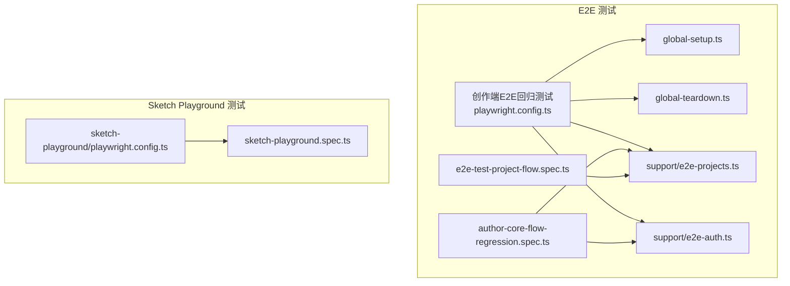
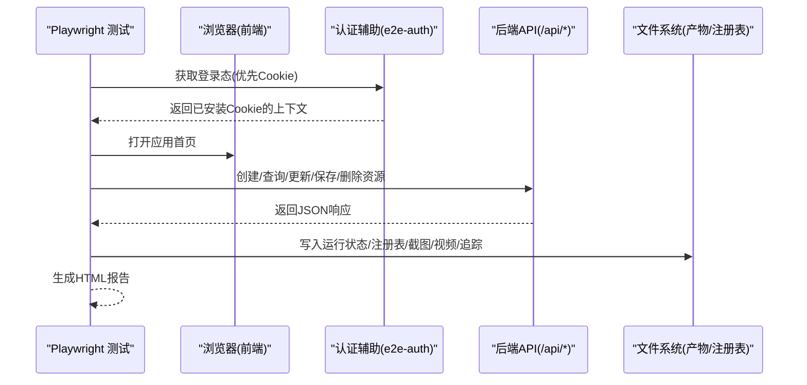
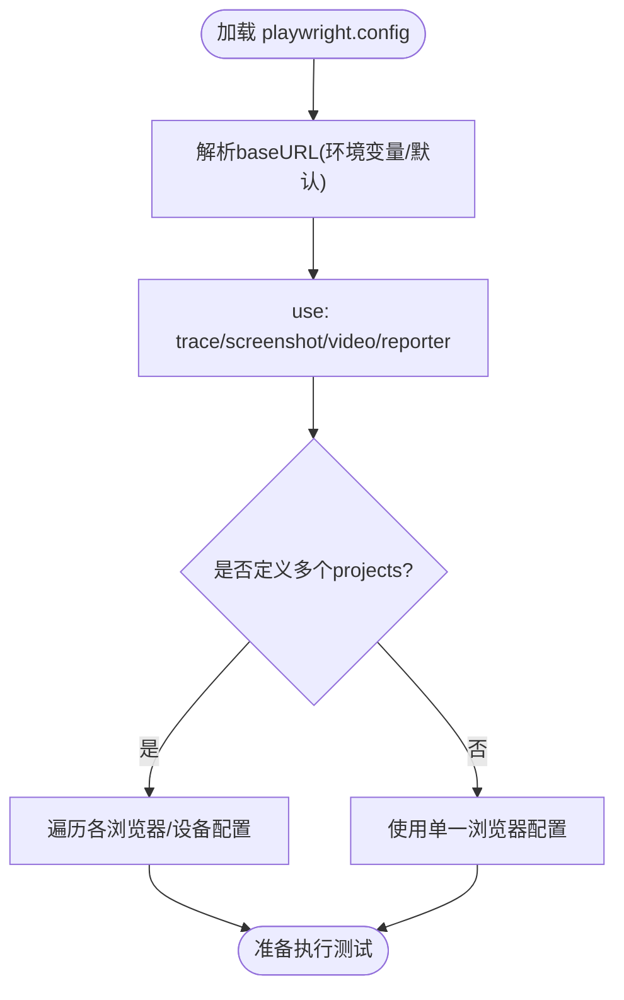
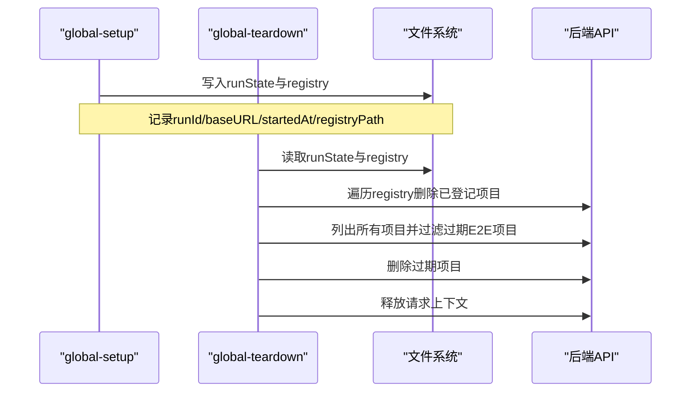
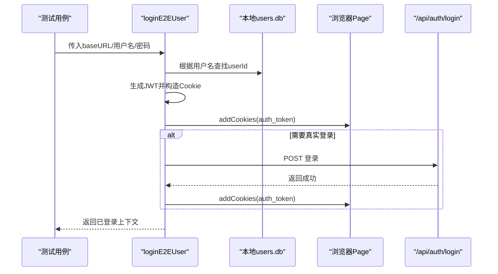
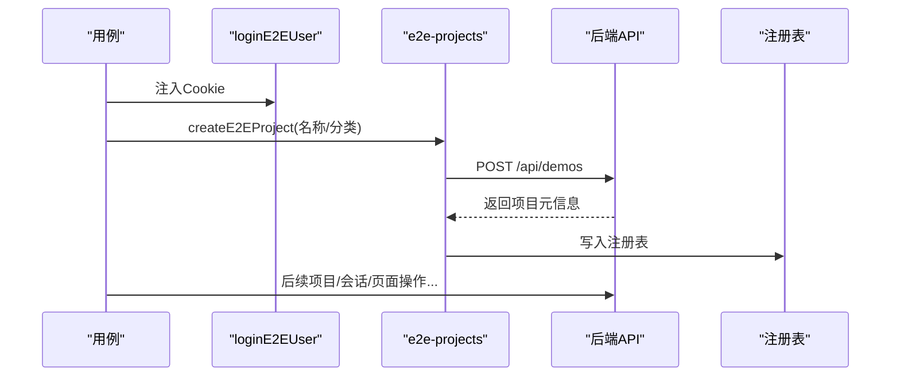
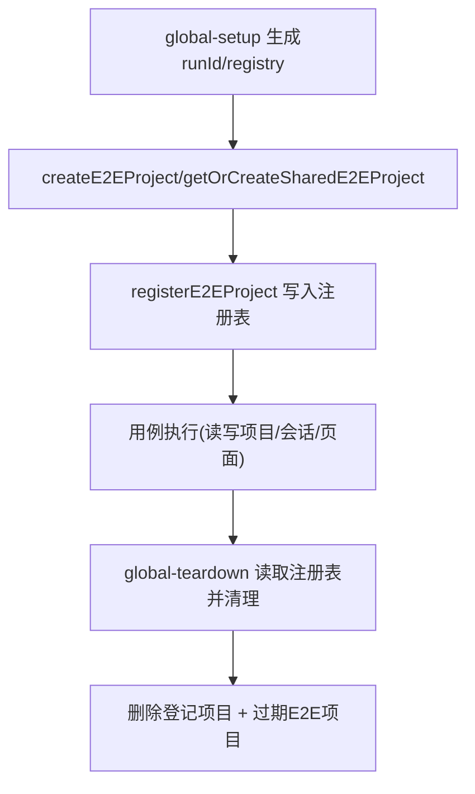
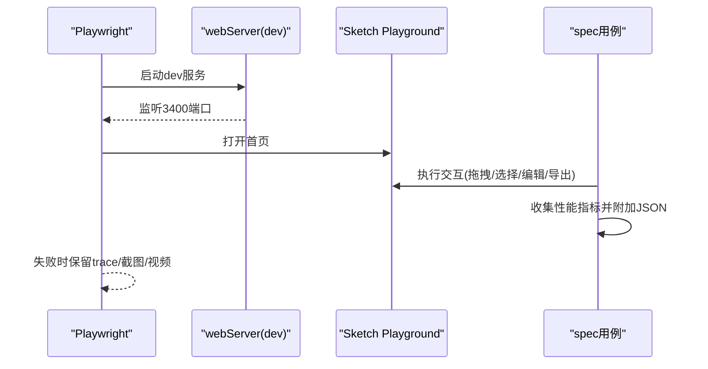
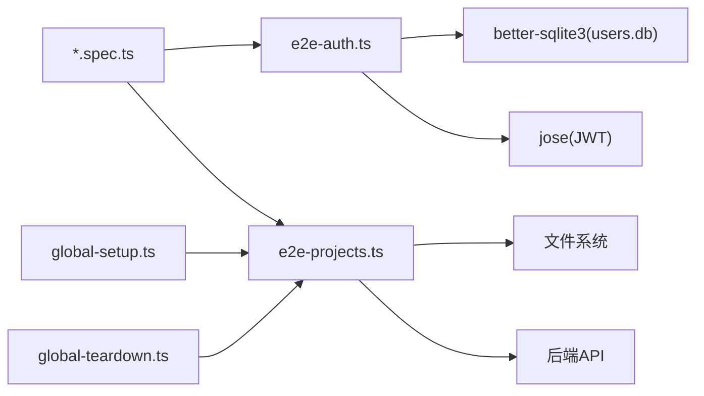

# 端到端测试

<cite>
**本文引用的文件**   
- [创作端E2E回归测试/playwright.config.ts](file://test/创作端E2E回归测试/playwright.config.ts)
- [创作端E2E回归测试/global-setup.ts](file://test/创作端E2E回归测试/global-setup.ts)
- [创作端E2E回归测试/global-teardown.ts](file://test/创作端E2E回归测试/global-teardown.ts)
- [创作端E2E回归测试/support/e2e-projects.ts](file://test/创作端E2E回归测试/support/e2e-projects.ts)
- [创作端E2E回归测试/support/e2e-auth.ts](file://test/创作端E2E回归测试/support/e2e-auth.ts)
- [创作端E2E回归测试/author-core-flow-regression.spec.ts](file://test/创作端E2E回归测试/author-core-flow-regression.spec.ts)
- [创作端E2E回归测试/e2e-test-project-flow.spec.ts](file://test/创作端E2E回归测试/e2e-test-project-flow.spec.ts)
- [sketch-playground/playwright.config.ts](file://test/sketch-playground/playwright.config.ts)
- [sketch-playground/sketch-playground.spec.ts](file://test/sketch-playground/sketch-playground.spec.ts)
</cite>

## 目录
1. [简介](#简介)
2. [项目结构](#项目结构)
3. [核心组件](#核心组件)
4. [架构总览](#架构总览)
5. [详细组件分析](#详细组件分析)
6. [依赖分析](#依赖分析)
7. [性能考虑](#性能考虑)
8. [故障排查指南](#故障排查指南)
9. [结论](#结论)
10. [附录](#附录)

## 简介
本文件面向 Workbench 平台的端到端（E2E）测试，聚焦于 Playwright 的配置与使用、用户场景覆盖、视觉回归策略、测试数据与环境治理、报告与重试机制以及调试实践。文档基于仓库中现有的 E2E 配置与用例进行系统化梳理，帮助读者快速理解并扩展测试能力。

## 项目结构
Workbench 的 E2E 测试主要位于 test 目录下，包含两个相对独立的测试套件：
- 创作端 E2E 回归测试：覆盖认证、项目管理、会话与页面编辑保存等核心流程，提供全局初始化与清理、截图/视频/追踪产物输出与 HTML 报告。
- Sketch Playground 测试：针对画布交互与导出能力的专项验证，内置本地开发服务器启动与单浏览器项目。

**图示来源** 
- [创作端E2E回归测试/playwright.config.ts:1-45](file://test/创作端E2E回归测试/playwright.config.ts#L1-L45)
- [创作端E2E回归测试/global-setup.ts:1-15](file://test/创作端E2E回归测试/global-setup.ts#L1-L15)
- [创作端E2E回归测试/global-teardown.ts:1-51](file://test/创作端E2E回归测试/global-teardown.ts#L1-L51)
- [创作端E2E回归测试/support/e2e-projects.ts:1-225](file://test/创作端E2E回归测试/support/e2e-projects.ts#L1-L225)
- [创作端E2E回归测试/support/e2e-auth.ts:1-152](file://test/创作端E2E回归测试/support/e2e-auth.ts#L1-L152)
- [创作端E2E回归测试/author-core-flow-regression.spec.ts:1-215](file://test/创作端E2E回归测试/author-core-flow-regression.spec.ts#L1-L215)
- [创作端E2E回归测试/e2e-test-project-flow.spec.ts:1-482](file://test/创作端E2E回归测试/e2e-test-project-flow.spec.ts#L1-L482)
- [sketch-playground/playwright.config.ts:1-26](file://test/sketch-playground/playwright.config.ts#L1-L26)
- [sketch-playground/sketch-playground.spec.ts:1-800](file://test/sketch-playground/sketch-playground.spec.ts#L1-L800)

**章节来源**
- [创作端E2E回归测试/playwright.config.ts:1-45](file://test/创作端E2E回归测试/playwright.config.ts#L1-L45)
- [sketch-playground/playwright.config.ts:1-26](file://test/sketch-playground/playwright.config.ts#L1-L26)

## 核心组件
- 运行期配置与产物管理
  - 统一 baseURL、超时、重试、并行度、Reporter、截图/视频/追踪策略、输出目录等。
- 全局生命周期
  - globalSetup：生成 runId、写入运行状态与注册表；globalTeardown：按注册表与过期策略清理测试项目。
- 认证支持
  - 优先通过注入 Cookie 的方式免登录进入应用；在必要时回退到 API 登录并安装 Cookie。
- 项目与数据治理
  - 统一的 E2E 项目分类标记、共享项目缓存、注册表持久化、列表/删除/过期判断等工具函数。
- 典型场景用例
  - 核心流程回归：新建项目、创建会话、写入页面代码与 Schema、保存版本、重新读取并校验。
  - 完整流程：从首页到新建、编辑、保存、删除的全链路操作，含日志与截图落盘。
- Sketch Playground 专项
  - 本地 dev server 自动拉起、拖拽/选择/撤销重做/右键菜单/导出等交互验证与性能基线采集。

**章节来源**
- [创作端E2E回归测试/playwright.config.ts:1-45](file://test/创作端E2E回归测试/playwright.config.ts#L1-L45)
- [创作端E2E回归测试/global-setup.ts:1-15](file://test/创作端E2E回归测试/global-setup.ts#L1-L15)
- [创作端E2E回归测试/global-teardown.ts:1-51](file://test/创作端E2E回归测试/global-teardown.ts#L1-L51)
- [创作端E2E回归测试/support/e2e-auth.ts:1-152](file://test/创作端E2E回归测试/support/e2e-auth.ts#L1-L152)
- [创作端E2E回归测试/support/e2e-projects.ts:1-225](file://test/创作端E2E回归测试/support/e2e-projects.ts#L1-L225)
- [创作端E2E回归测试/author-core-flow-regression.spec.ts:1-215](file://test/创作端E2E回归测试/author-core-flow-regression.spec.ts#L1-L215)
- [创作端E2E回归测试/e2e-test-project-flow.spec.ts:1-482](file://test/创作端E2E回归测试/e2e-test-project-flow.spec.ts#L1-L482)
- [sketch-playground/playwright.config.ts:1-26](file://test/sketch-playground/playwright.config.ts#L1-L26)
- [sketch-playground/sketch-playground.spec.ts:1-800](file://test/sketch-playground/sketch-playground.spec.ts#L1-L800)

## 架构总览
下图展示了 E2E 测试执行时的关键角色与交互：Playwright 驱动浏览器访问应用，通过认证模块完成登录态注入，调用后端 API 完成项目/会话/页面的增删改查，并在失败时产出截图、视频与追踪信息，最终由 Reporter 汇总报告。

**图示来源** 
- [创作端E2E回归测试/support/e2e-auth.ts:1-152](file://test/创作端E2E回归测试/support/e2e-auth.ts#L1-L152)
- [创作端E2E回归测试/support/e2e-projects.ts:1-225](file://test/创作端E2E回归测试/support/e2e-projects.ts#L1-L225)
- [创作端E2E回归测试/playwright.config.ts:1-45](file://test/创作端E2E回归测试/playwright.config.ts#L1-L45)

## 详细组件分析

### 运行配置与多浏览器/设备适配
- 基础配置
  - baseURL 通过环境变量覆盖，默认指向本地服务端口。
  - 全局超时、expect 超时、trace/screenshot/video 策略、reporter 与 workers 设置。
  - outputDir 集中存放 artifacts 与 reports。
- 多浏览器与设备
  - projects 数组可添加多个浏览器项目；当前示例仅启用 Desktop Chrome。
  - 可通过 devices 映射切换移动端/平板等设备规格。
- Sketch Playground 独立配置
  - 使用 webServer 自动拉起本地 dev 服务，便于隔离运行。

**图示来源** 
- [创作端E2E回归测试/playwright.config.ts:1-45](file://test/创作端E2E回归测试/playwright.config.ts#L1-L45)
- [sketch-playground/playwright.config.ts:1-26](file://test/sketch-playground/playwright.config.ts#L1-L26)

**章节来源**
- [创作端E2E回归测试/playwright.config.ts:1-45](file://test/创作端E2E回归测试/playwright.config.ts#L1-L45)
- [sketch-playground/playwright.config.ts:1-26](file://test/sketch-playground/playwright.config.ts#L1-L26)

### 全局初始化与清理
- 初始化(globalSetup)
  - 生成唯一 runId，写入运行状态与项目注册表，便于后续清理与追溯。
- 清理(globalTeardown)
  - 读取注册表，逐个删除本次运行登记的项目；同时扫描未登记但属于 E2E 分类且过期的项目，进行兜底清理。

**图示来源** 
- [创作端E2E回归测试/global-setup.ts:1-15](file://test/创作端E2E回归测试/global-setup.ts#L1-L15)
- [创作端E2E回归测试/global-teardown.ts:1-51](file://test/创作端E2E回归测试/global-teardown.ts#L1-L51)
- [创作端E2E回归测试/support/e2e-projects.ts:1-225](file://test/创作端E2E回归测试/support/e2e-projects.ts#L1-L225)

**章节来源**
- [创作端E2E回归测试/global-setup.ts:1-15](file://test/创作端E2E回归测试/global-setup.ts#L1-L15)
- [创作端E2E回归测试/global-teardown.ts:1-51](file://test/创作端E2E回归测试/global-teardown.ts#L1-L51)
- [创作端E2E回归测试/support/e2e-projects.ts:1-225](file://test/创作端E2E回归测试/support/e2e-projects.ts#L1-L225)

### 认证流程
- 优先模式：直接注入 auth_token Cookie，跳过登录页，提升稳定性与速度。
- 回退模式：当禁用 Cookie 注入或需要真实登录时，调用 /api/auth/login 并安装 Cookie。
- 健壮性：对登录页就绪进行轮询等待，并对非 JSON 响应进行容错处理。

**图示来源** 
- [创作端E2E回归测试/support/e2e-auth.ts:1-152](file://test/创作端E2E回归测试/support/e2e-auth.ts#L1-L152)

**章节来源**
- [创作端E2E回归测试/support/e2e-auth.ts:1-152](file://test/创作端E2E回归测试/support/e2e-auth.ts#L1-L152)

### 用户场景：认证与项目管理
- 认证
  - 通过 loginE2EUser 完成登录态注入，随后导航至首页并等待网络空闲。
- 项目管理
  - 使用 e2e-projects 工具创建项目、确保分类、注册到运行级清单，供 teardown 阶段清理。
  - 支持“共享项目”缓存，避免重复创建。

**图示来源** 
- [创作端E2E回归测试/support/e2e-auth.ts:1-152](file://test/创作端E2E回归测试/support/e2e-auth.ts#L1-L152)
- [创作端E2E回归测试/support/e2e-projects.ts:1-225](file://test/创作端E2E回归测试/support/e2e-projects.ts#L1-L225)
- [创作端E2E回归测试/author-core-flow-regression.spec.ts:1-215](file://test/创作端E2E回归测试/author-core-flow-regression.spec.ts#L1-L215)

**章节来源**
- [创作端E2E回归测试/support/e2e-auth.ts:1-152](file://test/创作端E2E回归测试/support/e2e-auth.ts#L1-L152)
- [创作端E2E回归测试/support/e2e-projects.ts:1-225](file://test/创作端E2E回归测试/support/e2e-projects.ts#L1-L225)
- [创作端E2E回归测试/author-core-flow-regression.spec.ts:1-215](file://test/创作端E2E回归测试/author-core-flow-regression.spec.ts#L1-L215)

### 用户场景：AI 对话交互
- 现状说明：在当前仓库的 E2E 用例中未发现明确的 AI 对话交互测试实现。若需补充，建议新增用例以模拟发送消息、等待流式响应、断言渲染结果与附件下载等步骤，并结合截图/视频/追踪进行定位。

[本节为概念性说明，不直接分析具体文件]

### 用户场景：预览功能测试
- 现状说明：当前 E2E 用例未包含专门的预览功能自动化断言。可在现有“核心流程回归”基础上，增加进入预览页、等待渲染完成、断言关键元素可见性与交互可用性的步骤，并可结合截图对比进行视觉回归。

[本节为概念性说明，不直接分析具体文件]

### 视觉回归测试
- 现状说明：当前 E2E 配置采用“失败时截图/保留视频/首次重试开启追踪”，并未启用自动化截图对比与差异分析。如需引入视觉回归，建议：
  - 使用 Playwright 的 expect.toMatchScreenshot 或第三方库进行像素级对比。
  - 将基准图纳入版本控制，CI 中比较 diff 并上传到报告。
  - 针对关键页面与复杂布局建立稳定的断言锚点，减少误报。

[本节为概念性说明，不直接分析具体文件]

### 测试数据管理与环境初始化
- 运行级状态
  - runId 与 registryPath 用于隔离每次运行的产物与清理范围。
- 项目注册与共享
  - registerE2EProject 记录本次运行创建的项目；getOrCreateSharedE2EProject 跨用例复用同一项目。
- 过期清理
  - isStaleE2EProject 基于创建时间与阈值判定，teardown 阶段批量清理残留。

**图示来源** 
- [创作端E2E回归测试/global-setup.ts:1-15](file://test/创作端E2E回归测试/global-setup.ts#L1-L15)
- [创作端E2E回归测试/global-teardown.ts:1-51](file://test/创作端E2E回归测试/global-teardown.ts#L1-L51)
- [创作端E2E回归测试/support/e2e-projects.ts:1-225](file://test/创作端E2E回归测试/support/e2e-projects.ts#L1-L225)

**章节来源**
- [创作端E2E回归测试/support/e2e-projects.ts:1-225](file://test/创作端E2E回归测试/support/e2e-projects.ts#L1-L225)

### Sketch Playground 专项测试
- 本地服务
  - webServer 自动拉起 @workbench/sketch-playground 的 dev 服务，复用已有进程，缩短启动时间。
- 交互与导出
  - 覆盖拖拽、多选、撤销/重做、右键菜单、导出选区、图片节点插入、文本内联编辑等。
- 性能基线
  - 通过构造大规模场景，测量选择、属性面板、拖拽、输入耗时，并以附件形式输出 JSON 基线。

**图示来源** 
- [sketch-playground/playwright.config.ts:1-26](file://test/sketch-playground/playwright.config.ts#L1-L26)
- [sketch-playground/sketch-playground.spec.ts:1-800](file://test/sketch-playground/sketch-playground.spec.ts#L1-L800)

**章节来源**
- [sketch-playground/playwright.config.ts:1-26](file://test/sketch-playground/playwright.config.ts#L1-L26)
- [sketch-playground/sketch-playground.spec.ts:1-800](file://test/sketch-playground/sketch-playground.spec.ts#L1-L800)

## 依赖分析
- 模块耦合
  - 用例层依赖 support 工具（认证、项目治理），support 依赖文件系统与后端 API。
  - global-setup/teardown 与 support 强耦合，负责运行级数据一致性。
- 外部依赖
  - Playwright（浏览器自动化、APIRequestContext、Reporter）。
  - better-sqlite3（本地用户信息查询，用于 Cookie 注入）。
  - jose（JWT 签名，用于生成 auth_token）。
- 潜在循环依赖
  - 当前未见循环引用；support 被多处用例复用，职责清晰。

**图示来源** 
- [创作端E2E回归测试/support/e2e-auth.ts:1-152](file://test/创作端E2E回归测试/support/e2e-auth.ts#L1-L152)
- [创作端E2E回归测试/support/e2e-projects.ts:1-225](file://test/创作端E2E回归测试/support/e2e-projects.ts#L1-L225)
- [创作端E2E回归测试/global-setup.ts:1-15](file://test/创作端E2E回归测试/global-setup.ts#L1-L15)
- [创作端E2E回归测试/global-teardown.ts:1-51](file://test/创作端E2E回归测试/global-teardown.ts#L1-L51)

**章节来源**
- [创作端E2E回归测试/support/e2e-auth.ts:1-152](file://test/创作端E2E回归测试/support/e2e-auth.ts#L1-L152)
- [创作端E2E回归测试/support/e2e-projects.ts:1-225](file://test/创作端E2E回归测试/support/e2e-projects.ts#L1-L225)

## 性能考虑
- 串行执行与重试
  - 当前配置关闭并行、限制 workers=1，降低并发竞争；CI 下启用重试以提升稳定性。
- 产物体积
  - 仅在失败时保留视频与截图，首次重试开启追踪，平衡诊断价值与存储成本。
- 本地服务复用
  - Sketch Playground 使用 reuseExistingServer，减少冷启动开销。
- 大数据量场景
  - 通过构造大场景进行性能基线采集，建议在 CI 中定期跑并归档结果，关注回归趋势。

[本节为通用指导，不直接分析具体文件]

## 故障排查指南
- 常见问题
  - 登录失败：检查 E2E_BASE_URL/E2E_USER/E2E_PASSWORD 是否正确；确认 users.db 存在且包含目标用户；必要时允许回退到真实登录流程。
  - 项目未清理：确认 global-teardown 正常执行；查看运行级注册表是否存在异常；手动清理过期 E2E 项目。
  - 产物缺失：检查 outputDir 权限；确认失败条件触发截图/视频/追踪策略。
- 定位手段
  - 使用 Trace Viewer 回放失败步骤；结合截图与视频快速定位 UI 问题。
  - 在关键路径打印结构化日志，配合 HTML 报告中的步骤信息。

**章节来源**
- [创作端E2E回归测试/playwright.config.ts:1-45](file://test/创作端E2E回归测试/playwright.config.ts#L1-L45)
- [创作端E2E回归测试/support/e2e-auth.ts:1-152](file://test/创作端E2E回归测试/support/e2e-auth.ts#L1-L152)
- [创作端E2E回归测试/global-teardown.ts:1-51](file://test/创作端E2E回归测试/global-teardown.ts#L1-L51)

## 结论
当前 E2E 体系围绕“认证—项目管理—会话/页面—保存/读取”的核心链路构建，具备完善的运行级数据治理与失败产物留存能力。未来可按需扩展 AI 对话与预览功能的端到端用例，并引入视觉回归与更丰富的设备矩阵，进一步提升质量保障面。

[本节为总结性内容，不直接分析具体文件]

## 附录
- 常用命令
  - 运行创作端 E2E：参考根脚本或包管理器命令（依据实际 package.json 配置）。
  - 运行 Sketch Playground E2E：使用其独立 playwright.config 所在目录执行。
- 环境变量
  - E2E_BASE_URL：指定被测应用地址。
  - E2E_USER/E2E_PASSWORD：登录凭据（用于回退登录模式）。
  - DATA_DIR：本地数据库路径（用于 Cookie 注入模式）。
  - JWT_SECRET：JWT 密钥（用于生成 auth_token）。

[本节为通用指引，不直接分析具体文件]