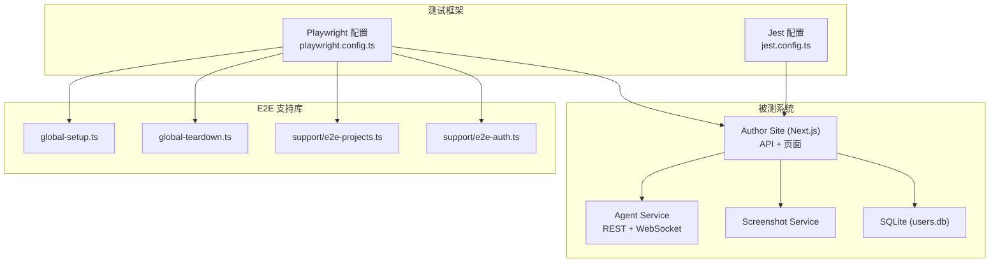
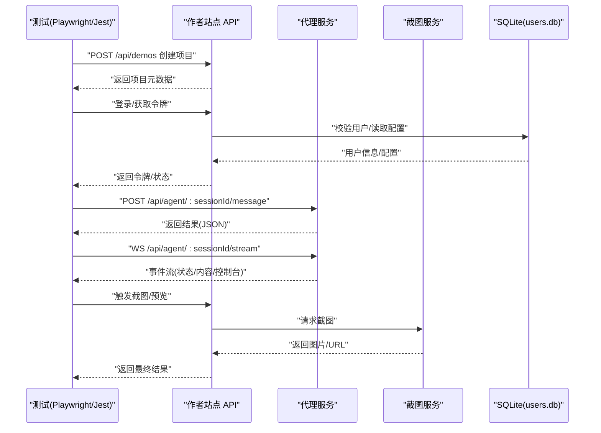
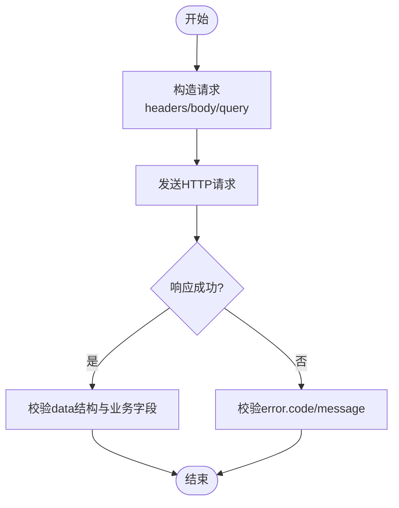
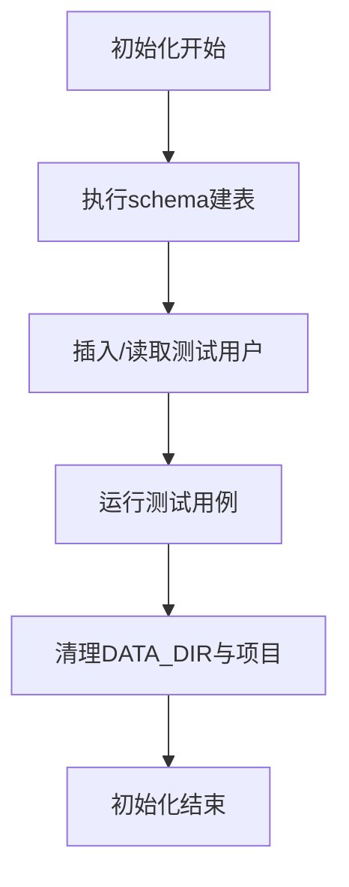
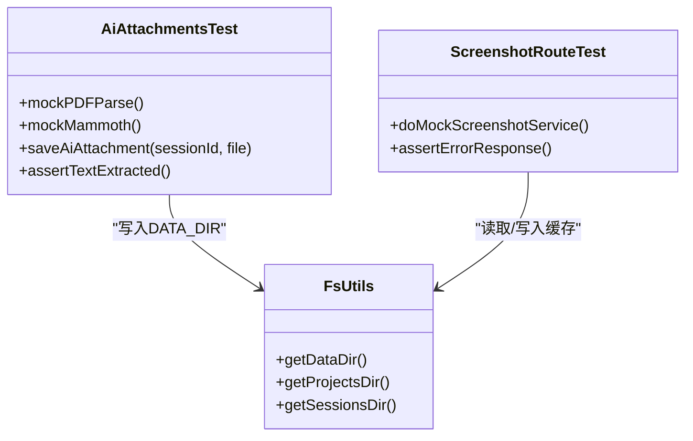
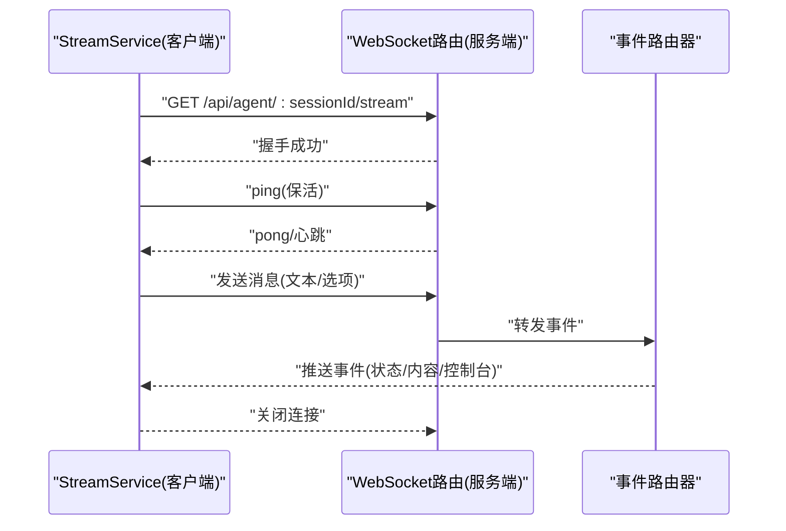
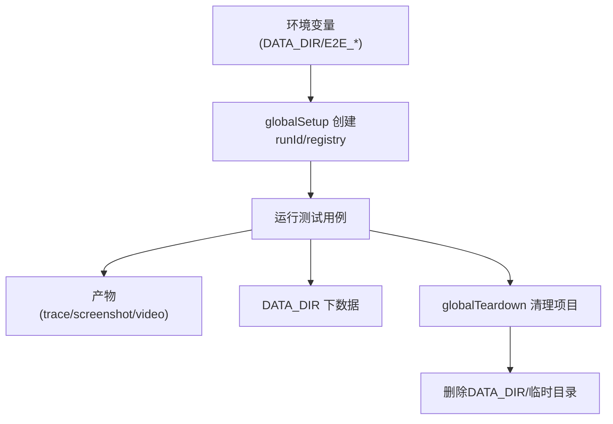
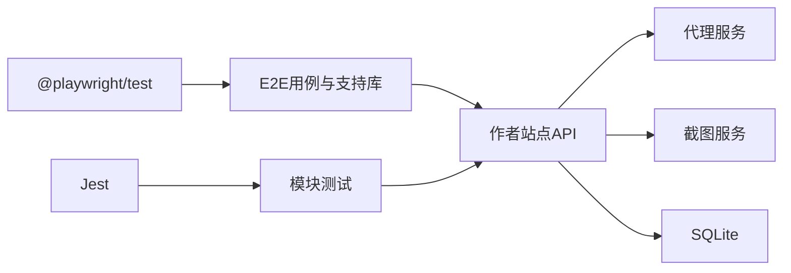

# 集成测试

<cite>
**本文引用的文件**   
- [创作端E2E回归测试/playwright.config.ts](file://test/创作端E2E回归测试/playwright.config.ts)
- [创作端E2E回归测试/global-setup.ts](file://test/创作端E2E回归测试/global-setup.ts)
- [创作端E2E回归测试/global-teardown.ts](file://test/创作端E2E回归测试/global-teardown.ts)
- [创作端E2E回归测试/support/e2e-projects.ts](file://test/创作端E2E回归测试/support/e2e-projects.ts)
- [创作端E2E回归测试/support/e2e-auth.ts](file://test/创作端E2E回归测试/support/e2e-auth.ts)
- [创作端E2E回归测试/e2e-test-project-flow.spec.ts](file://test/创作端E2E回归测试/e2e-test-project-flow.spec.ts)
- [packages/author-site/jest.config.ts](file://packages/author-site/jest.config.ts)
- [packages/author-site/src/lib/db/schema.ts](file://packages/author-site/src/lib/db/schema.ts)
- [packages/author-site/scripts/init-db.ts](file://packages/author-site/scripts/init-db.ts)
- [packages/author-site/src/lib/fs-utils.ts](file://packages/author-site/src/lib/fs-utils.ts)
- [packages/author-site/src/lib/__tests__/ai-attachments.test.ts](file://packages/author-site/src/lib/__tests__/ai-attachments.test.ts)
- [packages/author-site/src/app/api/workspace-authority/[projectId]/[workspaceId]/[...segments]/route.test.ts](file://packages/author-site/src/app/api/workspace-authority/[projectId]/[workspaceId]/[...segments]/route.test.ts)
- [packages/author-site/src/app/api/screenshots/file/[projectId]/[pageId]/route.test.ts](file://packages/author-site/src/app/api/screenshots/file/[projectId]/[pageId]/route.test.ts)
- [packages/agent-service/src/routes/websocket.ts](file://packages/agent-service/src/routes/websocket.ts)
- [packages/agent-service/tests/unit/ws-event-router.test.ts](file://packages/agent-service/tests/unit/ws-event-router.test.ts)
- [packages/author-site/src/components/ai-elements/chat/services/stream-service.ts](file://packages/author-site/src/components/ai-elements/chat/services/stream-service.ts)
- [scripts/check-contracts.mjs](file://scripts/check-contracts.mjs)
</cite>

## 目录
1. [简介](#简介)
2. [项目结构](#项目结构)
3. [核心组件](#核心组件)
4. [架构总览](#架构总览)
5. [详细组件分析](#详细组件分析)
6. [依赖分析](#依赖分析)
7. [性能考虑](#性能考虑)
8. [故障排查指南](#故障排查指南)
9. [结论](#结论)
10. [附录](#附录)

## 简介
本文件面向 Workbench 平台的集成测试，覆盖以下关键目标：
- API 接口测试：HTTP 请求模拟、响应验证与错误处理。
- 数据库集成测试：SQLite 环境搭建、数据准备与清理策略。
- 外部服务模拟：AI 模型服务、截图服务与文件系统操作的 Mock 实现。
- 微服务间通信测试：WebSocket 连接与消息传递验证。
- 测试环境配置、依赖服务启动与数据隔离策略。

## 项目结构
Workbench 的集成测试主要分布在以下位置：
- E2E 测试（Playwright）：位于 test/创作端E2E回归测试，负责端到端流程、登录、项目生命周期与清理。
- 单元测试（Jest）：位于 packages/author-site/src/lib/__tests__ 等，侧重模块级行为与外部依赖 Mock。
- 服务端路由测试：各 route.test.ts 文件用于 Next.js Route Handler 的单元/集成测试。
- Agent 服务 WebSocket 测试：位于 packages/agent-service/tests/unit，验证事件路由与心跳机制。

**图表来源** 
- [创作端E2E回归测试/playwright.config.ts:1-45](file://test/创作端E2E回归测试/playwright.config.ts#L1-L45)
- [packages/author-site/jest.config.ts:1-37](file://packages/author-site/jest.config.ts#L1-L37)
- [创作端E2E回归测试/global-setup.ts:1-14](file://test/创作端E2E回归测试/global-setup.ts#L1-L14)
- [创作端E2E回归测试/global-teardown.ts:1-50](file://test/创作端E2E回归测试/global-teardown.ts#L1-L50)
- [创作端E2E回归测试/support/e2e-projects.ts:1-225](file://test/创作端E2E回归测试/support/e2e-projects.ts#L1-L225)
- [创作端E2E回归测试/support/e2e-auth.ts:1-51](file://test/创作端E2E回归测试/support/e2e-auth.ts#L1-L51)

**章节来源**
- [创作端E2E回归测试/playwright.config.ts:1-45](file://test/创作端E2E回归测试/playwright.config.ts#L1-L45)
- [packages/author-site/jest.config.ts:1-37](file://packages/author-site/jest.config.ts#L1-L37)

## 核心组件
- Playwright E2E 配置与生命周期
  - baseURL、重试、报告与产物输出路径、浏览器设备矩阵。
  - globalSetup 创建运行态与注册表；globalTeardown 清理已注册与过期项目。
- E2E 项目注册与清理
  - 通过 /api/demos 管理项目元数据，按 runId 隔离，支持共享用例项目与过期清理。
- 认证辅助
  - 基于本地 users.db 读取用户 ID，结合 JWT 生成或登录流程注入会话。
- Jest 模块测试
  - 使用 jsdom 环境、模块映射与转换规则，便于对 Next.js 模块进行单测。
- 数据库初始化
  - SQLite schema 定义与脚本化初始化，确保测试前表结构存在。
- 文件系统与数据隔离
  - 通过 DATA_DIR 环境变量将数据落盘到临时目录，测试后统一清理。

**章节来源**
- [创作端E2E回归测试/playwright.config.ts:1-45](file://test/创作端E2E回归测试/playwright.config.ts#L1-L45)
- [创作端E2E回归测试/global-setup.ts:1-14](file://test/创作端E2E回归测试/global-setup.ts#L1-L14)
- [创作端E2E回归测试/global-teardown.ts:1-50](file://test/创作端E2E回归测试/global-teardown.ts#L1-L50)
- [创作端E2E回归测试/support/e2e-projects.ts:1-225](file://test/创作端E2E回归测试/support/e2e-projects.ts#L1-L225)
- [创作端E2E回归测试/support/e2e-auth.ts:1-51](file://test/创作端E2E回归测试/support/e2e-auth.ts#L1-L51)
- [packages/author-site/jest.config.ts:1-37](file://packages/author-site/jest.config.ts#L1-L37)
- [packages/author-site/src/lib/db/schema.ts:1-51](file://packages/author-site/src/lib/db/schema.ts#L1-L51)
- [packages/author-site/scripts/init-db.ts:1-10](file://packages/author-site/scripts/init-db.ts#L1-L10)
- [packages/author-site/src/lib/fs-utils.ts:44-80](file://packages/author-site/src/lib/fs-utils.ts#L44-L80)

## 架构总览
集成测试围绕“作者站点”、“代理服务”、“截图服务”和“SQLite 数据库”展开。E2E 通过 Playwright 驱动浏览器访问作者站点，调用后端 API，必要时直连代理服务的 REST/WebSocket 接口；Jest 在进程内加载模块并 Mock 外部依赖，验证业务逻辑与边界条件。

**图表来源** 
- [创作端E2E回归测试/support/e2e-projects.ts:130-225](file://test/创作端E2E回归测试/support/e2e-projects.ts#L130-L225)
- [packages/agent-service/src/routes/websocket.ts:134-183](file://packages/agent-service/src/routes/websocket.ts#L134-L183)
- [packages/author-site/src/components/ai-elements/chat/services/stream-service.ts:177-394](file://packages/author-site/src/components/ai-elements/chat/services/stream-service.ts#L177-L394)
- [packages/author-site/src/lib/db/schema.ts:1-51](file://packages/author-site/src/lib/db/schema.ts#L1-L51)

## 详细组件分析

### API 接口测试（HTTP 请求模拟、响应验证、错误处理）
- 请求构造与响应断言
  - 使用 Playwright 的 page.request 发起 HTTP 请求，解析统一信封格式 { success, data, error }，并对 success=false 分支进行错误码与消息断言。
  - 针对 Next.js Route Handler 的测试中，提供轻量 TestResponse 与 createRequest 工具，模拟 Request/Response 以直接调用路由处理器。
- 典型场景
  - 项目生命周期：创建、列表、更新分类、删除；全局 Teardown 会清理已注册与过期项目。
  - 截图文件路由：Mock 截图服务不可用，验证降级与错误返回。
  - 工作区权限路由：构造最小化请求对象，验证鉴权与参数校验。
- 契约校验
  - 脚本 check-contracts.mjs 校验 API 响应结构，确保 success/data/error 字段一致性。

**图表来源** 
- [创作端E2E回归测试/support/e2e-projects.ts:122-143](file://test/创作端E2E回归测试/support/e2e-projects.ts#L122-L143)
- [packages/author-site/src/app/api/screenshots/file/[projectId]/[pageId]/route.test.ts:72-87](file://packages/author-site/src/app/api/screenshots/file/[projectId]/[pageId]/route.test.ts#L72-L87)
- [packages/author-site/src/app/api/workspace-authority/[projectId]/[workspaceId]/[...segments]/route.test.ts:22-47](file://packages/author-site/src/app/api/workspace-authority/[projectId]/[workspaceId]/[...segments]/route.test.ts#L22-L47)
- [scripts/check-contracts.mjs:51-64](file://scripts/check-contracts.mjs#L51-L64)

**章节来源**
- [创作端E2E回归测试/support/e2e-projects.ts:122-225](file://test/创作端E2E回归测试/support/e2e-projects.ts#L122-L225)
- [packages/author-site/src/app/api/screenshots/file/[projectId]/[pageId]/route.test.ts:42-87](file://packages/author-site/src/app/api/screenshots/file/[projectId]/[pageId]/route.test.ts#L42-L87)
- [packages/author-site/src/app/api/workspace-authority/[projectId]/[workspaceId]/[...segments]/route.test.ts:22-47](file://packages/author-site/src/app/api/workspace-authority/[projectId]/[workspaceId]/[...segments]/route.test.ts#L22-L47)
- [scripts/check-contracts.mjs:51-64](file://scripts/check-contracts.mjs#L51-L64)

### 数据库集成测试（SQLite 环境、数据准备与清理）
- 环境搭建
  - 通过 initializeDatabase 创建必要表结构（users、system_configs、user_model_configs 等）。
  - 测试前可执行 init-db 脚本完成初始化。
- 数据准备
  - E2E 认证辅助从 users.db 读取用户 ID，配合 JWT 注入登录态。
- 数据隔离与清理
  - 使用 DATA_DIR 指向临时目录，避免污染真实数据；测试结束后由全局 Teardown 清理项目与资源。

**图表来源** 
- [packages/author-site/src/lib/db/schema.ts:1-51](file://packages/author-site/src/lib/db/schema.ts#L1-L51)
- [packages/author-site/scripts/init-db.ts:1-10](file://packages/author-site/scripts/init-db.ts#L1-L10)
- [创作端E2E回归测试/support/e2e-auth.ts:33-51](file://test/创作端E2E回归测试/support/e2e-auth.ts#L33-L51)
- [packages/author-site/src/lib/fs-utils.ts:44-80](file://packages/author-site/src/lib/fs-utils.ts#L44-L80)

**章节来源**
- [packages/author-site/src/lib/db/schema.ts:1-51](file://packages/author-site/src/lib/db/schema.ts#L1-L51)
- [packages/author-site/scripts/init-db.ts:1-10](file://packages/author-site/scripts/init-db.ts#L1-L10)
- [创作端E2E回归测试/support/e2e-auth.ts:33-51](file://test/创作端E2E回归测试/support/e2e-auth.ts#L33-L51)
- [packages/author-site/src/lib/fs-utils.ts:44-80](file://packages/author-site/src/lib/fs-utils.ts#L44-L80)

### 外部服务模拟（AI 模型服务、截图服务、文件系统）
- AI 附件与文档解析
  - 使用 jest.mock 对 pdf-parse、mammoth 等第三方库打桩，验证文本提取与预览长度限制。
  - 通过 DATA_DIR 控制存储路径，断言持久化文件存在性与内容片段。
- 截图服务
  - 在路由测试中 doMock 截图服务，使其抛出异常，验证失败路径与错误响应。
- 文件系统
  - 所有读写操作通过 fs-utils 提供的目录常量，测试时设置 DATA_DIR 指向临时目录，保证隔离。

**图表来源** 
- [packages/author-site/src/lib/__tests__/ai-attachments.test.ts:1-202](file://packages/author-site/src/lib/__tests__/ai-attachments.test.ts#L1-L202)
- [packages/author-site/src/app/api/screenshots/file/[projectId]/[pageId]/route.test.ts:72-87](file://packages/author-site/src/app/api/screenshots/file/[projectId]/[pageId]/route.test.ts#L72-L87)
- [packages/author-site/src/lib/fs-utils.ts:44-80](file://packages/author-site/src/lib/fs-utils.ts#L44-L80)

**章节来源**
- [packages/author-site/src/lib/__tests__/ai-attachments.test.ts:1-202](file://packages/author-site/src/lib/__tests__/ai-attachments.test.ts#L1-L202)
- [packages/author-site/src/app/api/screenshots/file/[projectId]/[pageId]/route.test.ts:72-87](file://packages/author-site/src/app/api/screenshots/file/[projectId]/[pageId]/route.test.ts#L72-L87)
- [packages/author-site/src/lib/fs-utils.ts:44-80](file://packages/author-site/src/lib/fs-utils.ts#L44-L80)

### 微服务间通信测试（WebSocket 连接与消息传递）
- 服务端
  - 注册 /api/agent/:sessionId/stream 的 WebSocket 路由，维护连接池、心跳检测与事件路由。
- 客户端
  - StreamService 封装连接建立、事件监听、保活 ping 与超时保护。
- 测试要点
  - 使用 unit 测试验证事件路由器行为与日志/诊断数据目录隔离。
  - 通过 e2e 或集成测试连接 WS，断言连接状态、消息类型与完成信号。

**图表来源** 
- [packages/agent-service/src/routes/websocket.ts:134-183](file://packages/agent-service/src/routes/websocket.ts#L134-L183)
- [packages/author-site/src/components/ai-elements/chat/services/stream-service.ts:177-394](file://packages/author-site/src/components/ai-elements/chat/services/stream-service.ts#L177-L394)
- [packages/agent-service/tests/unit/ws-event-router.test.ts:1-54](file://packages/agent-service/tests/unit/ws-event-router.test.ts#L1-L54)

**章节来源**
- [packages/agent-service/src/routes/websocket.ts:134-183](file://packages/agent-service/src/routes/websocket.ts#L134-L183)
- [packages/author-site/src/components/ai-elements/chat/services/stream-service.ts:177-394](file://packages/author-site/src/components/ai-elements/chat/services/stream-service.ts#L177-L394)
- [packages/agent-service/tests/unit/ws-event-router.test.ts:1-54](file://packages/agent-service/tests/unit/ws-event-router.test.ts#L1-L54)

### 测试环境与数据隔离策略
- 环境变量
  - E2E_BASE_URL：指定作者站点地址。
  - DATA_DIR：控制数据落盘根目录，测试前后自动清理。
  - PROJECTS_DIR/SESSIONS_DIR/WORKSPACES_DIR/SNAPSHOTS_DIR：细分目录，便于隔离。
- 运行态与注册表
  - globalSetup 生成 runId 与 registryPath，记录本次运行的项目清单。
  - globalTeardown 遍历注册表与全量项目列表，删除已注册与过期项目。
- 浏览器与产物
  - Playwright 配置开启 trace/screenshot/video 仅保留失败用例，减少 CI 体积。

**图表来源** 
- [创作端E2E回归测试/playwright.config.ts:1-45](file://test/创作端E2E回归测试/playwright.config.ts#L1-L45)
- [创作端E2E回归测试/global-setup.ts:1-14](file://test/创作端E2E回归测试/global-setup.ts#L1-L14)
- [创作端E2E回归测试/global-teardown.ts:1-50](file://test/创作端E2E回归测试/global-teardown.ts#L1-L50)
- [packages/author-site/src/lib/fs-utils.ts:44-80](file://packages/author-site/src/lib/fs-utils.ts#L44-L80)

**章节来源**
- [创作端E2E回归测试/playwright.config.ts:1-45](file://test/创作端E2E回归测试/playwright.config.ts#L1-L45)
- [创作端E2E回归测试/global-setup.ts:1-14](file://test/创作端E2E回归测试/global-setup.ts#L1-L14)
- [创作端E2E回归测试/global-teardown.ts:1-50](file://test/创作端E2E回归测试/global-teardown.ts#L1-L50)
- [packages/author-site/src/lib/fs-utils.ts:44-80](file://packages/author-site/src/lib/fs-utils.ts#L44-L80)

## 依赖分析
- 测试框架依赖
  - Playwright：E2E 浏览器自动化、网络请求上下文、报告与产物。
  - Jest：模块加载、Mock、jsdom 环境、模块映射与转换。
- 被测服务依赖
  - 作者站点：Next.js Route Handler、文件系统、SQLite、截图服务。
  - 代理服务：Fastify + WebSocket、事件路由器、心跳与连接池。
- 耦合与内聚
  - E2E 支持库集中管理项目注册与清理，降低用例耦合度。
  - 路由测试聚焦单一处理器，依赖最小化 TestResponse/Request 构造器。
  - 外部依赖通过 jest.doMock/jest.mock 解耦，提升稳定性。

**图表来源** 
- [创作端E2E回归测试/playwright.config.ts:1-45](file://test/创作端E2E回归测试/playwright.config.ts#L1-L45)
- [packages/author-site/jest.config.ts:1-37](file://packages/author-site/jest.config.ts#L1-L37)
- [创作端E2E回归测试/support/e2e-projects.ts:1-225](file://test/创作端E2E回归测试/support/e2e-projects.ts#L1-L225)

**章节来源**
- [创作端E2E回归测试/playwright.config.ts:1-45](file://test/创作端E2E回归测试/playwright.config.ts#L1-L45)
- [packages/author-site/jest.config.ts:1-37](file://packages/author-site/jest.config.ts#L1-L37)
- [创作端E2E回归测试/support/e2e-projects.ts:1-225](file://test/创作端E2E回归测试/support/e2e-projects.ts#L1-L225)

## 性能考虑
- 并行与重试
  - E2E 默认串行运行以减少资源竞争；CI 环境下启用有限重试与失败产物保留。
- 产物体积
  - 仅保留失败用例的 trace/screenshot/video，降低存储压力。
- 外部服务 Mock
  - 对截图服务与解析库进行 Mock，避免 I/O 瓶颈与外部不稳定因素。
- 数据隔离
  - 使用临时目录与独立 runId 注册表，避免跨用例干扰。

## 故障排查指南
- 登录失败
  - 检查 users.db 是否存在对应用户；确认 .env 中的 JWT 密钥是否可用；查看 e2e-auth 的解析与回退逻辑。
- 项目未清理
  - 确认 globalTeardown 是否执行；检查 E2E 注册表文件是否存在；核对 isStaleE2EProject 的时间阈值。
- 截图服务不可用
  - 路由测试中已模拟不可用场景，若实际失败，检查截图服务端口与可达性。
- WebSocket 连接超时
  - 检查心跳间隔与超时配置；确认服务端连接池与事件路由器是否正常；客户端 keepalive 是否生效。
- 契约校验失败
  - 使用 check-contracts.mjs 定位响应结构问题，确保 success/data/error 字段完整。

**章节来源**
- [创作端E2E回归测试/support/e2e-auth.ts:1-51](file://test/创作端E2E回归测试/support/e2e-auth.ts#L1-L51)
- [创作端E2E回归测试/global-teardown.ts:1-50](file://test/创作端E2E回归测试/global-teardown.ts#L1-L50)
- [packages/author-site/src/app/api/screenshots/file/[projectId]/[pageId]/route.test.ts:72-87](file://packages/author-site/src/app/api/screenshots/file/[projectId]/[pageId]/route.test.ts#L72-L87)
- [packages/agent-service/src/routes/websocket.ts:134-183](file://packages/agent-service/src/routes/websocket.ts#L134-L183)
- [packages/author-site/src/components/ai-elements/chat/services/stream-service.ts:177-394](file://packages/author-site/src/components/ai-elements/chat/services/stream-service.ts#L177-L394)
- [scripts/check-contracts.mjs:51-64](file://scripts/check-contracts.mjs#L51-L64)

## 结论
Workbench 的集成测试体系以 Playwright 与 Jest 为核心，围绕 API、数据库、外部服务与 WebSocket 构建完整的验证闭环。通过环境变量与临时目录实现数据隔离，借助注册表与全局清理保障环境整洁。对外部依赖采用 Mock 与最小化请求构造，提高测试稳定性与可重复性。建议持续完善契约校验与覆盖率指标，并在 CI 中固化运行与产物归档。

## 附录
- 常用环境变量
  - E2E_BASE_URL：作者站点地址
  - DATA_DIR：数据根目录
  - PROJECTS_DIR/SESSIONS_DIR/WORKSPACES_DIR/SNAPSHOTS_DIR：子目录
- 关键入口
  - playwright.config.ts：E2E 配置
  - global-setup.ts/global-teardown.ts：生命周期
  - support/e2e-projects.ts：项目注册与清理
  - support/e2e-auth.ts：认证辅助
  - jest.config.ts：Jest 配置
  - db/schema.ts：数据库表结构
  - scripts/init-db.ts：数据库初始化脚本
  - routes/websocket.ts：WebSocket 路由
  - stream-service.ts：客户端流式连接封装