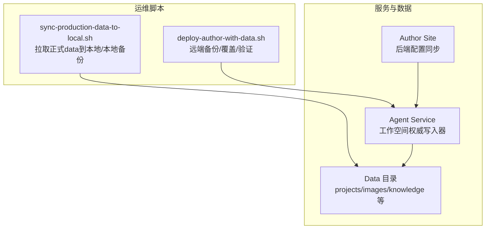
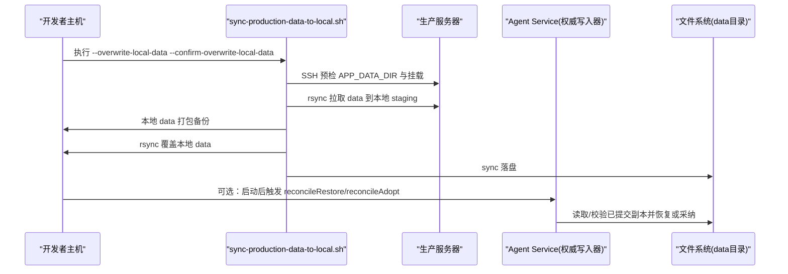
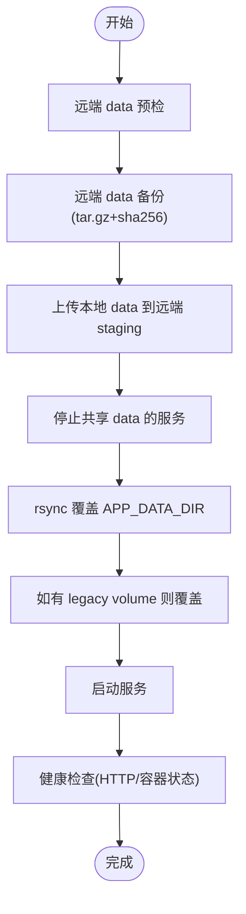
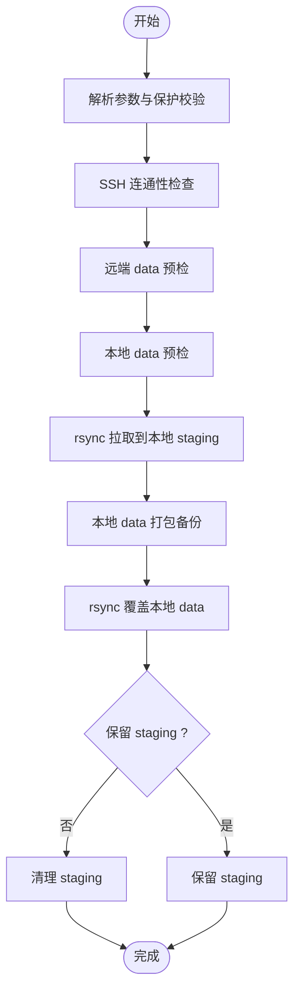
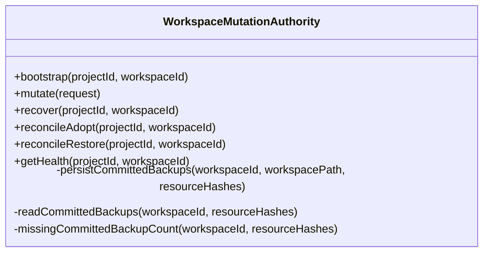
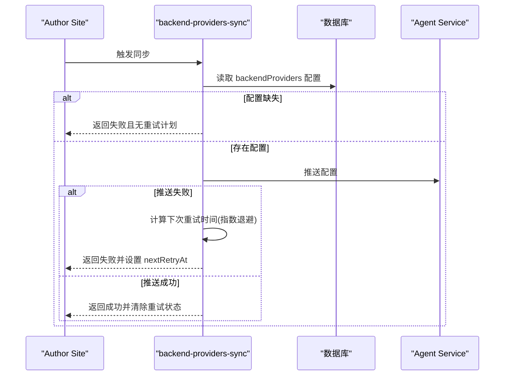
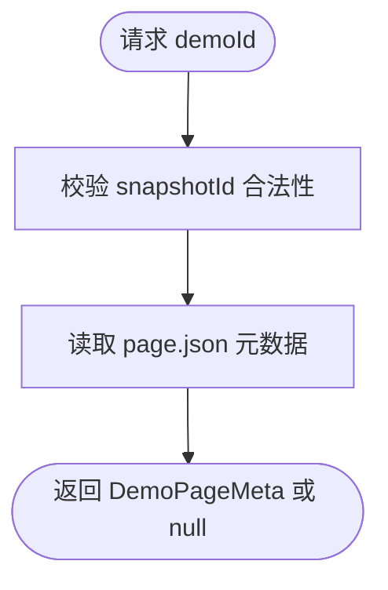
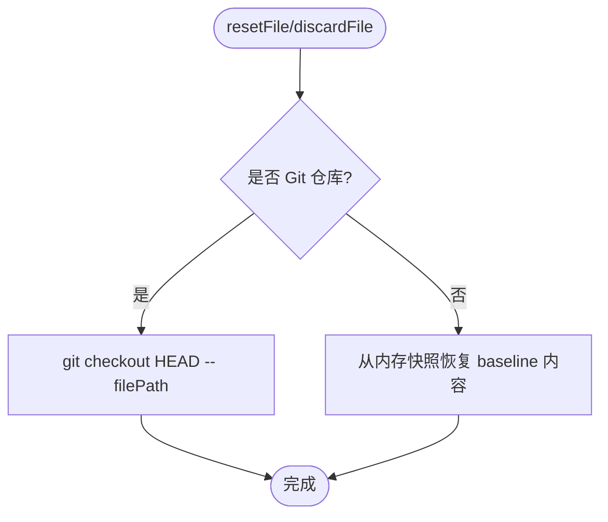
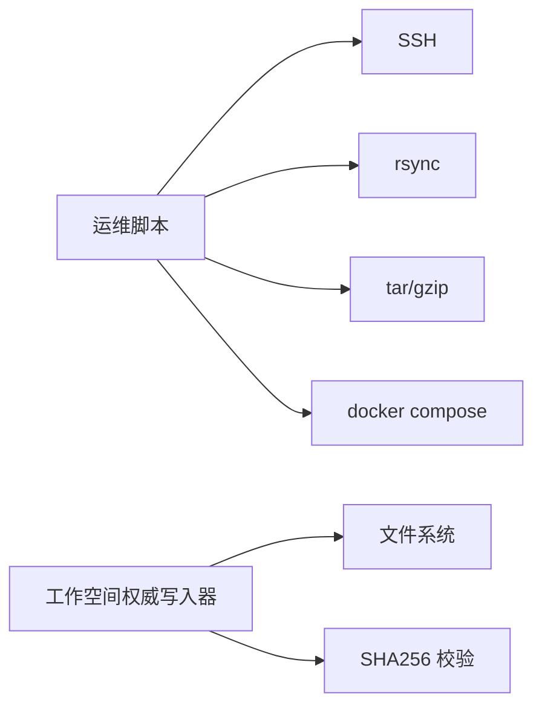

# 备份恢复

<cite>
**本文引用的文件**
- [scripts/deploy-author-with-data.sh](file://scripts/deploy-author-with-data.sh)
- [scripts/sync-production-data-to-local.sh](file://scripts/sync-production-data-to-local.sh)
- [packages/agent-service/src/workspace/workspace-mutation-authority.ts](file://packages/agent-service/src/workspace/workspace-mutation-authority.ts)
- [packages/agent-service/tests/unit/workspace-mutation-authority.test.ts](file://packages/agent-service/tests/unit/workspace-mutation-authority.test.ts)
- [packages/author-site/src/lib/backend-providers-sync.ts](file://packages/author-site/src/lib/backend-providers-sync.ts)
- [packages/author-site/src/app/api/projects/[projectId]/demos/[demoId]/route.ts](file://packages/author-site/src/app/api/projects/[projectId]/demos/[demoId]/route.ts)
- [packages/agent-service/src/session/snapshot-service.ts](file://packages/agent-service/src/session/snapshot-service.ts)
- [OPS/CLI/src/commands/logs.ts](file://OPS/CLI/src/commands/logs.ts)
</cite>

## 目录
1. [简介](#简介)
2. [项目结构](#项目结构)
3. [核心组件](#核心组件)
4. [架构总览](#架构总览)
5. [详细组件分析](#详细组件分析)
6. [依赖关系分析](#依赖关系分析)
7. [性能与成本优化](#性能与成本优化)
8. [故障排查指南](#故障排查指南)
9. [结论](#结论)
10. [附录](#附录)

## 简介
本文件面向 Workbench 平台的数据备份与恢复，覆盖以下目标：
- 数据备份策略：项目文件、数据库快照（如适用）、配置文件、用户上传内容的备份方案
- 自动化备份脚本：定时任务配置、增量备份与压缩存储
- 数据恢复流程：灾难恢复预案、数据一致性验证与回滚操作
- 数据同步机制：生产到开发环境同步、跨地域复制与版本管理
- 备份验证与测试：完整性检查、恢复演练与故障模拟
- 存储优化与成本控制建议

## 项目结构
Workbench 的备份与恢复相关能力由“部署与运维脚本”和“工作空间权威写入器”共同构成：
- 部署与运维脚本负责远端/本地 data 目录的预检、打包、传输、覆盖与健康校验
- 工作空间权威写入器负责工作区资源变更的原子化提交、持久化已提交副本、以及恢复/采纳漂移

图示来源
- [scripts/deploy-author-with-data.sh:172-215](file://scripts/deploy-author-with-data.sh#L172-L215)
- [scripts/sync-production-data-to-local.sh:189-231](file://scripts/sync-production-data-to-local.sh#L189-L231)
- [packages/agent-service/src/workspace/workspace-mutation-authority.ts:988-1028](file://packages/agent-service/src/workspace/workspace-mutation-authority.ts#L988-L1028)

章节来源
- [scripts/deploy-author-with-data.sh:1-469](file://scripts/deploy-author-with-data.sh#L1-L469)
- [scripts/sync-production-data-to-local.sh:1-335](file://scripts/sync-production-data-to-local.sh#L1-L335)
- [packages/agent-service/src/workspace/workspace-mutation-authority.ts:1-800](file://packages/agent-service/src/workspace/workspace-mutation-authority.ts#L1-L800)

## 核心组件
- 远端备份与覆盖脚本：支持只读预检、远端 data 打包、上传 staging、停止服务、覆盖并重启、健康验证
- 本地同步脚本：支持从远端拉取 data 到本地 staging、本地 data 备份、覆盖本地 data
- 工作空间权威写入器：维护工作区状态、持久化已提交资源副本、提供恢复/采纳漂移能力，保障一致性

章节来源
- [scripts/deploy-author-with-data.sh:119-215](file://scripts/deploy-author-with-data.sh#L119-L215)
- [scripts/sync-production-data-to-local.sh:119-231](file://scripts/sync-production-data-to-local.sh#L119-L231)
- [packages/agent-service/src/workspace/workspace-mutation-authority.ts:286-378](file://packages/agent-service/src/workspace/workspace-mutation-authority.ts#L286-L378)

## 架构总览
下图展示一次“生产数据覆盖到本地”的关键调用链与数据流。

图示来源
- [scripts/sync-production-data-to-local.sh:210-265](file://scripts/sync-production-data-to-local.sh#L210-L265)
- [packages/agent-service/src/workspace/workspace-mutation-authority.ts:309-378](file://packages/agent-service/src/workspace/workspace-mutation-authority.ts#L309-L378)

## 详细组件分析

### 组件A：远端备份与覆盖（deploy-author-with-data.sh）
职责
- 远端 data 预检：解析 .env.docker 中的 APP_DATA_DIR，统计大小与目录清单
- 远端 data 备份：将 bind mount 与 legacy volume 分别打包为 tar.gz，输出 sha256
- 上传 staging：将本地 data 上传至远端 staging 目录并校验
- 覆盖与重启：停止共享 data 的服务，rsync 覆盖 app_data_dir 与 legacy volume，重启服务
- 健康验证：轮询容器健康状态与 HTTP 端点

关键流程（覆盖）

图示来源
- [scripts/deploy-author-with-data.sh:172-215](file://scripts/deploy-author-with-data.sh#L172-L215)
- [scripts/deploy-author-with-data.sh:254-326](file://scripts/deploy-author-with-data.sh#L254-L326)
- [scripts/deploy-author-with-data.sh:328-386](file://scripts/deploy-author-with-data.sh#L328-L386)

章节来源
- [scripts/deploy-author-with-data.sh:119-215](file://scripts/deploy-author-with-data.sh#L119-L215)
- [scripts/deploy-author-with-data.sh:254-326](file://scripts/deploy-author-with-data.sh#L254-L326)
- [scripts/deploy-author-with-data.sh:328-386](file://scripts/deploy-author-with-data.sh#L328-L386)

### 组件B：生产到本地同步（sync-production-data-to-local.sh）
职责
- 参数保护：--backup-only 与 --overwrite-local-data 互斥；覆盖需显式确认
- 远端预检：解析 APP_DATA_DIR，统计目录与大小
- 本地预检：统计现有 data 目录
- 本地备份：将本地 data 打包为 tar.gz 并输出 sha256
- 拉取与覆盖：rsync 拉取到 staging，再覆盖本地 data

关键流程（覆盖）

图示来源
- [scripts/sync-production-data-to-local.sh:189-231](file://scripts/sync-production-data-to-local.sh#L189-L231)
- [scripts/sync-production-data-to-local.sh:233-265](file://scripts/sync-production-data-to-local.sh#L233-L265)

章节来源
- [scripts/sync-production-data-to-local.sh:1-335](file://scripts/sync-production-data-to-local.sh#L1-L335)

### 组件C：工作空间权威写入器（WorkspaceMutationAuthority）
职责
- 唯一可信写入者：对激活的工作区进行串行化、带租约的原子写入
- 已提交副本持久化：按资源哈希持久化二进制内容，供后续恢复使用
- 恢复与采纳：reconcileRestore 丢弃外部漂移并恢复到上次已提交状态；reconcileAdopt 接受外部漂移为新版本
- 健康指标：包含 missingBackupCount、preparedCount、externalDrift 等

类图（节选）

图示来源
- [packages/agent-service/src/workspace/workspace-mutation-authority.ts:988-1028](file://packages/agent-service/src/workspace/workspace-mutation-authority.ts#L988-L1028)
- [packages/agent-service/src/workspace/workspace-mutation-authority.ts:286-378](file://packages/agent-service/src/workspace/workspace-mutation-authority.ts#L286-L378)

章节来源
- [packages/agent-service/src/workspace/workspace-mutation-authority.ts:1-800](file://packages/agent-service/src/workspace/workspace-mutation-authority.ts#L1-L800)
- [packages/agent-service/tests/unit/workspace-mutation-authority.test.ts:321-345](file://packages/agent-service/tests/unit/workspace-mutation-authority.test.ts#L321-L345)

### 组件D：后端配置同步（backend-providers-sync）
职责
- 当数据库中缺少 backendProviders 配置时，阻止推送并记录失败原因
- 失败重试采用指数退避，成功则清除重试状态

时序（失败重试）

图示来源
- [packages/author-site/src/lib/backend-providers-sync.ts:158-217](file://packages/author-site/src/lib/backend-providers-sync.ts#L158-L217)

章节来源
- [packages/author-site/src/lib/backend-providers-sync.ts:158-217](file://packages/author-site/src/lib/backend-providers-sync.ts#L158-L217)

### 组件E：演示页面快照元数据读取
职责
- 安全校验 snapshotId，防止路径穿越
- 读取删除页面的快照元数据，用于恢复/展示

图示来源
- [packages/author-site/src/app/api/projects/[projectId]/demos/[demoId]/route.ts:126-148](file://packages/author-site/src/app/api/projects/[projectId]/demos/[demoId]/route.ts#L126-L148)

章节来源
- [packages/author-site/src/app/api/projects/[projectId]/demos/[demoId]/route.ts:126-148](file://packages/author-site/src/app/api/projects/[projectId]/demos/[demoId]/route.ts#L126-L148)

### 组件F：会话级文件快照与回滚（snapshot-service）
职责
- 基于 Git 仓库或内存快照，支持文件的丢弃/重置
- 在会话内快速回滚文件到基线

图示来源
- [packages/agent-service/src/session/snapshot-service.ts:302-341](file://packages/agent-service/src/session/snapshot-service.ts#L302-L341)

章节来源
- [packages/agent-service/src/session/snapshot-service.ts:302-341](file://packages/agent-service/src/session/snapshot-service.ts#L302-L341)

## 依赖关系分析
- 脚本层依赖 SSH/rsync/tar/sha256sum 等系统工具
- 覆盖流程依赖 Docker Compose 控制服务启停与卷挂载
- 工作空间权威写入器依赖文件系统原子写与哈希校验，确保幂等与可恢复

图示来源
- [scripts/deploy-author-with-data.sh:172-215](file://scripts/deploy-author-with-data.sh#L172-L215)
- [scripts/sync-production-data-to-local.sh:210-231](file://scripts/sync-production-data-to-local.sh#L210-L231)
- [packages/agent-service/src/workspace/workspace-mutation-authority.ts:988-1028](file://packages/agent-service/src/workspace/workspace-mutation-authority.ts#L988-L1028)

章节来源
- [scripts/deploy-author-with-data.sh:1-469](file://scripts/deploy-author-with-data.sh#L1-L469)
- [scripts/sync-production-data-to-local.sh:1-335](file://scripts/sync-production-data-to-local.sh#L1-L335)
- [packages/agent-service/src/workspace/workspace-mutation-authority.ts:1-800](file://packages/agent-service/src/workspace/workspace-mutation-authority.ts#L1-L800)

## 性能与成本优化
- 增量备份
  - 使用 rsync 的 --delete 与增量传输减少带宽与时间
  - 结合本地 staging 目录，避免直接覆盖生产数据
- 压缩与去重
  - 使用 tar.gz 压缩归档，降低存储占用
  - 对大体积 assets 目录考虑对象存储的分片与重复数据消除
- 生命周期管理
  - 对历史备份实施分层存储与过期清理策略
  - 仅保留关键里程碑的全量快照，其余以增量为主
- 并发与锁
  - 通过工作空间权威写入器的串行队列与租约机制避免并发写入冲突
- 监控与告警
  - 利用健康检查与日志命令辅助定位问题，减少停机时间

[本节为通用指导，不直接分析具体文件]

## 故障排查指南
- 常见错误码与含义
  - WORKSPACE_EXTERNAL_DRIFT：磁盘实际内容与权威状态不一致，需先 reconcileAdopt 或 reconcileRestore
  - WORKSPACE_AUTHORITY_BACKUP_MISSING：已提交副本缺失，无法安全恢复
  - WORKSPACE_RESOURCE_CONFLICT：基础版本过旧，需重新获取最新状态
- 健康检查
  - 使用 CLI 命令访问 /health 接口，查看 agent-service 状态与代理数量
- 恢复演练步骤
  - 使用 --dry-run 进行只读预检
  - 先执行 --backup-only 生成本地备份
  - 再执行覆盖流程，完成后立即运行 verify 或健康检查
- 日志与诊断
  - 使用 OPS CLI 的日志命令收集健康信息与错误堆栈

章节来源
- [packages/agent-service/tests/unit/workspace-mutation-authority.test.ts:321-345](file://packages/agent-service/tests/unit/workspace-mutation-authority.test.ts#L321-L345)
- [OPS/CLI/src/commands/logs.ts:138-160](file://OPS/CLI/src/commands/logs.ts#L138-L160)

## 结论
Workbench 的备份与恢复体系以“脚本驱动 + 权威写入器”为核心：
- 脚本负责跨机器的数据拉取、打包、覆盖与健康验证
- 权威写入器保证工作区资源的原子性与可恢复性，并提供明确的恢复/采纳路径
- 通过参数保护、预检与校验，显著降低误操作风险
- 配合增量、压缩与生命周期策略，可在保障一致性的同时优化成本

[本节为总结，不直接分析具体文件]

## 附录

### 自动化备份与定时任务建议
- 使用系统 cron 或容器编排调度器定期执行：
  - 远端只备份：deploy-author-with-data.sh --backup-only
  - 本地同步：sync-production-data-to-local.sh --backup-only
- 建议每日全量、每小时增量（基于 rsync 的增量特性）
- 将备份产物迁移至异地对象存储，并开启版本控制

[本节为通用指导，不直接分析具体文件]

### 数据一致性验证方法
- 校验值比对：对比 tar.gz 的 sha256 与源端输出
- 目录结构核对：比较顶层目录清单与大小
- 应用层验证：启动后调用 /health 与业务端点，确认服务可用

章节来源
- [scripts/deploy-author-with-data.sh:211-215](file://scripts/deploy-author-with-data.sh#L211-L215)
- [scripts/sync-production-data-to-local.sh:76-84](file://scripts/sync-production-data-to-local.sh#L76-L84)
- [scripts/deploy-author-with-data.sh:328-386](file://scripts/deploy-author-with-data.sh#L328-L386)