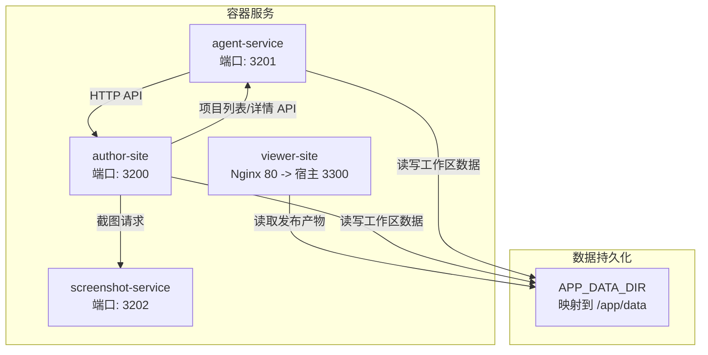
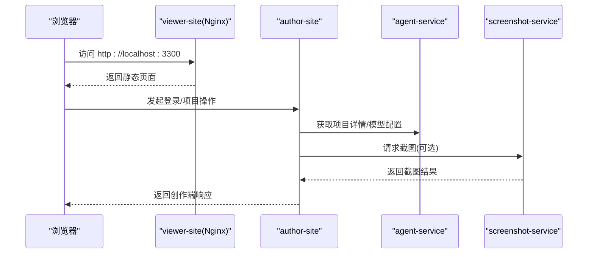
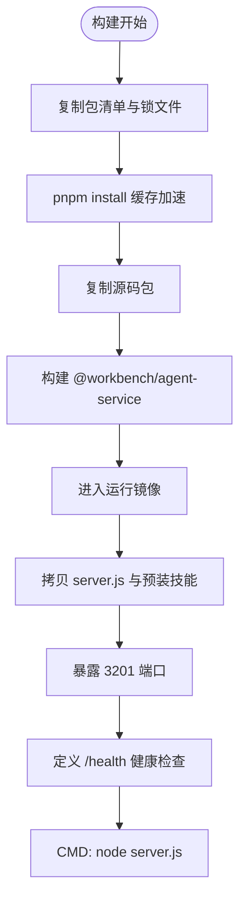
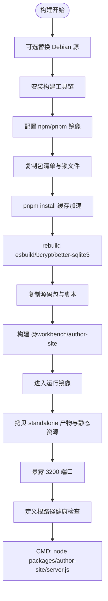
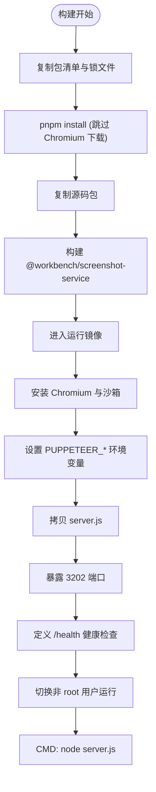
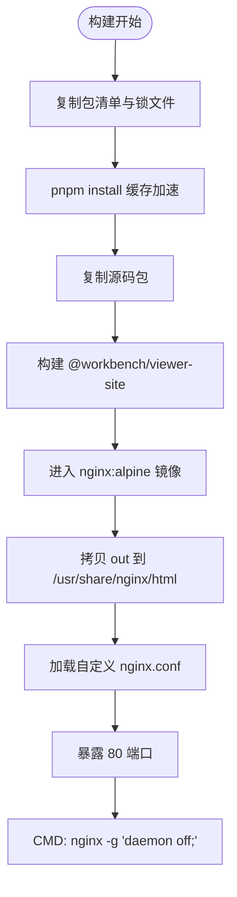
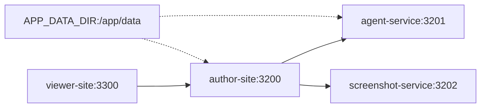
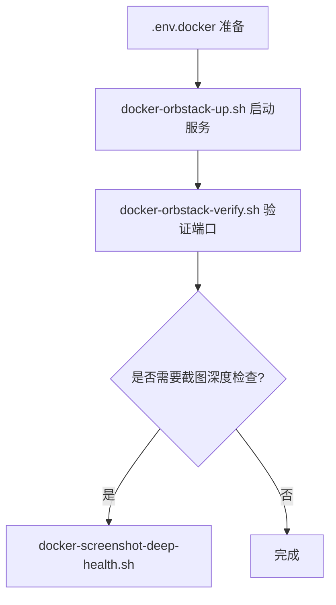

# 容器化部署

<cite>
**本文引用的文件**   
- [docker-compose.yml](file://docker-compose.yml)
- [agent-service/Dockerfile](file://docker/agent-service/Dockerfile)
- [author-site/Dockerfile](file://docker/author-site/Dockerfile)
- [screenshot-service/Dockerfile](file://docker/screenshot-service/Dockerfile)
- [viewer-site/Dockerfile](file://docker/viewer-site/Dockerfile)
- [viewer-site/nginx.conf](file://docker/viewer-site/nginx.conf)
- [docker-orbstack-up.sh](file://scripts/docker-orbstack-up.sh)
- [docker-orbstack-verify.sh](file://scripts/docker-orbstack-verify.sh)
- [docker-build-check.sh](file://scripts/docker-build-check.sh)
- [docker-prepull.sh](file://scripts/docker-prepull.sh)
- [docker-screenshot-deep-health.sh](file://scripts/docker-screenshot-deep-health.sh)
- [deploy-fast.sh](file://scripts/deploy-fast.sh)
- [deploy.sh](file://scripts/deploy.sh)
</cite>

## 目录
1. [简介](#简介)
2. [项目结构](#项目结构)
3. [核心组件](#核心组件)
4. [架构总览](#架构总览)
5. [详细组件分析](#详细组件分析)
6. [依赖关系分析](#依赖关系分析)
7. [性能与资源限制](#性能与资源限制)
8. [健康检查与日志](#健康检查与日志)
9. [本地开发环境搭建](#本地开发环境搭建)
10. [生产环境编排与安全建议](#生产环境编排与安全建议)
11. [故障排查指南](#故障排查指南)
12. [结论](#结论)

## 简介
本文件面向 Workbench 平台的容器化部署，覆盖 Docker 镜像构建、Docker Compose 编排、资源限制、健康检查与自动重启、日志收集、本地开发与生产最佳实践。文档基于仓库中现有 Dockerfile、Compose 配置与脚本进行系统化梳理，帮助读者快速理解并落地部署。

## 项目结构
Workbench 的容器化相关资产集中在以下位置：
- docker/<服务名>/Dockerfile：各服务的多阶段镜像定义
- docker-compose.yml：服务编排、网络、卷挂载、环境变量与资源限制
- scripts/*：本地启动、验证、预拉取基础镜像、构建校验与一键部署脚本
- docker/viewer-site/nginx.conf：静态站点反向代理与缓存策略

图示来源
- [docker-compose.yml:1-140](file://docker-compose.yml#L1-L140)
- [viewer-site/nginx.conf:1-45](file://docker/viewer-site/nginx.conf#L1-L45)

章节来源
- [docker-compose.yml:1-140](file://docker-compose.yml#L1-L140)
- [viewer-site/nginx.conf:1-45](file://docker/viewer-site/nginx.conf#L1-L45)

## 核心组件
- agent-service：提供 AI Agent 能力与项目元数据 API，暴露 /health 端点，使用 Fastify 生态（运行时安装）
- author-site：创作端 Next.js 应用，采用 standalone 模式运行，内置数据库初始化脚本入口
- screenshot-service：基于 Puppeteer + Chromium 的截图服务，支持深度健康检查
- viewer-site：纯静态站点，由 Nginx 托管，按路径规则对发布数据进行缓存控制

章节来源
- [agent-service/Dockerfile:1-43](file://docker/agent-service/Dockerfile#L1-L43)
- [author-site/Dockerfile:1-94](file://docker/author-site/Dockerfile#L1-L94)
- [screenshot-service/Dockerfile:1-56](file://docker/screenshot-service/Dockerfile#L1-L56)
- [viewer-site/Dockerfile:1-46](file://docker/viewer-site/Dockerfile#L1-L46)
- [viewer-site/nginx.conf:1-45](file://docker/viewer-site/nginx.conf#L1-L45)

## 架构总览
从浏览器到后端的数据流如下：
- 用户访问 viewer-site（3300），Nginx 返回静态页面并通过 /data 路由读取已发布内容
- 创作端 author-site（3200）负责业务逻辑、鉴权、调用 agent-service 与截图服务
- agent-service（3201）提供模型配置、项目详情等 API，并与 author-site 共享 APP_DATA_DIR
- screenshot-service（3202）在需要时渲染页面生成截图

图示来源
- [docker-compose.yml:1-140](file://docker-compose.yml#L1-L140)
- [viewer-site/nginx.conf:1-45](file://docker/viewer-site/nginx.conf#L1-L45)

## 详细组件分析

### agent-service 镜像与服务
- 构建阶段
  - 使用 node:20-bookworm-slim 作为基础镜像
  - 启用 corepack 并固定 pnpm@8.15.0
  - 仅复制必要 package.json 以利用缓存层
  - 通过 --filter 指定 @workbench/agent-service 执行 build:docker
- 运行阶段
  - 仅拷贝编译产物 server.js 与预装技能目录
  - 运行时按需安装 fastify 生态与日志库
  - 暴露 3201 端口，定义 HEALTHCHECK 探测 /health
  - 默认 CMD 为 node server.js

图示来源
- [agent-service/Dockerfile:1-43](file://docker/agent-service/Dockerfile#L1-L43)

章节来源
- [agent-service/Dockerfile:1-43](file://docker/agent-service/Dockerfile#L1-L43)

### author-site 镜像与服务
- 构建阶段
  - 支持 DEBIAN_MIRROR 替换 apt 源，安装构建依赖（python3、make、g++）
  - 设置 npm/pnpm 国内镜像加速
  - 注入 NEXT_PUBLIC_* 构建期参数，用于前端常量注入
  - 使用 pnpm 缓存与选择性 rebuild（esbuild、bcrypt、better-sqlite3）
  - 输出 Next.js standalone 产物
- 运行阶段
  - 基于 node:20-bookworm-slim，复制 .next/standalone 与静态资源
  - 暴露 3200 端口，定义 HEALTHCHECK 探测根路径
  - CMD 指向 packages/author-site/server.js

图示来源
- [author-site/Dockerfile:1-94](file://docker/author-site/Dockerfile#L1-L94)

章节来源
- [author-site/Dockerfile:1-94](file://docker/author-site/Dockerfile#L1-L94)

### screenshot-service 镜像与服务
- 构建阶段
  - 跳过 Chromium 下载，仅安装 Node 依赖
  - 构建 @workbench/screenshot-service
- 运行阶段
  - 安装 Chromium 与 sandbox，设置 PUPPETEER_EXECUTABLE_PATH
  - 暴露 3202 端口，定义 /health 健康检查
  - 以非 root 用户运行，提升安全性

图示来源
- [screenshot-service/Dockerfile:1-56](file://docker/screenshot-service/Dockerfile#L1-L56)

章节来源
- [screenshot-service/Dockerfile:1-56](file://docker/screenshot-service/Dockerfile#L1-L56)

### viewer-site 镜像与 Nginx 配置
- 构建阶段
  - 注入 NEXT_PUBLIC_* 构建期参数
  - 构建 @workbench/viewer-site 输出到 out 目录
- 运行阶段
  - 基于 nginx:alpine，将 out 复制到 /usr/share/nginx/html
  - 自定义 default.conf 实现 SPA try_files、/data 路由与缓存策略
  - 暴露 80 端口，CMD 前台运行 nginx

图示来源
- [viewer-site/Dockerfile:1-46](file://docker/viewer-site/Dockerfile#L1-L46)
- [viewer-site/nginx.conf:1-45](file://docker/viewer-site/nginx.conf#L1-L45)

章节来源
- [viewer-site/Dockerfile:1-46](file://docker/viewer-site/Dockerfile#L1-L46)
- [viewer-site/nginx.conf:1-45](file://docker/viewer-site/nginx.conf#L1-L45)

## 依赖关系分析
- 服务间依赖
  - author-site 依赖 agent-service（API 调用）
  - screenshot-service 依赖 author-site（可选，用于回退或联动）
  - viewer-site 依赖 author-site（项目列表/详情接口）
- 数据共享
  - 所有写服务通过 APP_DATA_DIR 映射到宿主机 /opt/workbench/data，统一写入 /app/data
- 网络与端口
  - 3200/3201/3202/3300 分别对外暴露，内部通过 compose 网络互通

图示来源
- [docker-compose.yml:1-140](file://docker-compose.yml#L1-L140)

章节来源
- [docker-compose.yml:1-140](file://docker-compose.yml#L1-L140)

## 性能与资源限制
- CPU/内存/进程数
  - agent-service：CPU 1.0，内存 1g，进程上限 512
  - author-site：CPU 1.0，内存 1g，进程上限 512
  - screenshot-service：CPU 1.0，内存 1536m，进程上限 768，共享内存 256m
  - viewer-site：CPU 0.5，内存 512m，进程上限 256
- 平台与并行
  - screenshot-service 支持 platform 参数（默认 linux/amd64）
  - 构建可通过 COMPOSE_PARALLEL_LIMIT 控制并发
- 镜像体积优化
  - 多阶段构建：仅在 builder 阶段安装构建依赖，运行镜像仅包含产物与最小运行时
  - 使用 slim/alpine 基础镜像
  - 选择性安装运行时依赖（如 agent-service 运行时安装 fastify 生态）
  - 使用 pnpm store 缓存加速构建

章节来源
- [docker-compose.yml:1-140](file://docker-compose.yml#L1-L140)
- [agent-service/Dockerfile:1-43](file://docker/agent-service/Dockerfile#L1-L43)
- [author-site/Dockerfile:1-94](file://docker/author-site/Dockerfile#L1-L94)
- [screenshot-service/Dockerfile:1-56](file://docker/screenshot-service/Dockerfile#L1-L56)
- [viewer-site/Dockerfile:1-46](file://docker/viewer-site/Dockerfile#L1-L46)

## 健康检查与日志
- 健康检查
  - agent-service：/health 返回 HTTP 状态码
  - author-site：根路径返回 200
  - screenshot-service：/health 返回 JSON，支持 deep=1 深度检查
- 自动重启
  - 所有服务均配置 restart: unless-stopped
- 日志收集
  - 建议使用宿主机日志驱动（json-file 或 journald）集中采集
  - 结合 docker logs 与外部日志系统（如 Loki/ELK）进行聚合

章节来源
- [docker-compose.yml:1-140](file://docker-compose.yml#L1-L140)
- [docker-screenshot-deep-health.sh:1-41](file://scripts/docker-screenshot-deep-health.sh#L1-L41)

## 本地开发环境搭建
- 前置准备
  - 安装 OrbStack 或 Docker Desktop
  - 准备 .env.docker 文件（参考脚本提示）
- 快速启动
  - 使用 scripts/docker-orbstack-up.sh 拉起默认服务（可带 --with-screenshot 启动截图服务）
  - 脚本会导出常用环境变量（CORS、NEXT_PUBLIC_*、PUPPETEER_DISABLE_SANDBOX 等）
- 启动后验证
  - 使用 scripts/docker-orbstack-verify.sh 校验 HTTP 表面可用性
  - 如需截图服务深度诊断，使用 scripts/docker-screenshot-deep-health.sh
- 构建校验与预拉取
  - scripts/docker-build-check.sh：串行或并行构建校验
  - scripts/docker-prepull.sh：预拉取 node:20-bookworm-slim 与 nginx:alpine

图示来源
- [docker-orbstack-up.sh:1-98](file://scripts/docker-orbstack-up.sh#L1-L98)
- [docker-orbstack-verify.sh:1-92](file://scripts/docker-orbstack-verify.sh#L1-L92)
- [docker-build-check.sh:1-94](file://scripts/docker-build-check.sh#L1-L94)
- [docker-prepull.sh:1-45](file://scripts/docker-prepull.sh#L1-L45)
- [docker-screenshot-deep-health.sh:1-41](file://scripts/docker-screenshot-deep-health.sh#L1-L41)

章节来源
- [docker-orbstack-up.sh:1-98](file://scripts/docker-orbstack-up.sh#L1-L98)
- [docker-orbstack-verify.sh:1-92](file://scripts/docker-orbstack-verify.sh#L1-L92)
- [docker-build-check.sh:1-94](file://scripts/docker-build-check.sh#L1-L94)
- [docker-prepull.sh:1-45](file://scripts/docker-prepull.sh#L1-L45)
- [docker-screenshot-deep-health.sh:1-41](file://scripts/docker-screenshot-deep-health.sh#L1-L41)

## 生产环境编排与安全建议
- 部署流程
  - 使用 scripts/deploy.sh 执行端到端部署，支持 local/remote 两种构建模式
  - 默认 targeted sync 仅同步目标服务所需包，减少传输与构建时间
  - 默认本地构建镜像并上传至服务器，避免在生产机执行重型构建
- 安全与一致性
  - 强制要求 INTERNAL_API_TOKEN 非空，确保管理后台与 agent-service 鉴权一致
  - 禁止在正式机自动创建空 APP_DATA_DIR，防止误切到空数据
  - 远程构建前检查可用内存与负载，超限则拒绝构建
- 健康与自检
  - 部署后检查容器运行状态与健康检查
  - 校验 author-site/agent-service/screenshot-service 的 HTTP 端点可达
  - 校验 agent-service 内部模型配置接口鉴权链路
- 安全加固建议
  - 使用只读数据卷挂载（如 viewer-site 已使用 :ro）
  - 在非 root 用户下运行敏感服务（screenshot-service 已使用 USER node）
  - 限制对外暴露端口，仅开放必要端口（3200/3201/3202/3300）
  - 使用 HTTPS 反向代理（如 Nginx/Traefik）终止 TLS，并在 author-site 启用 USE_SECURE_COOKIE=true
  - 使用 secrets 管理敏感信息（JWT_SECRET、INTERNAL_API_TOKEN、OAuth 凭据等）

章节来源
- [deploy.sh:1-800](file://scripts/deploy.sh#L1-L800)
- [deploy-fast.sh:1-140](file://scripts/deploy-fast.sh#L1-L140)
- [docker-compose.yml:1-140](file://docker-compose.yml#L1-L140)

## 故障排查指南
- 常见症状与定位
  - 端口不可达：使用 docker-orbstack-verify.sh 检查 HTTP 状态码
  - 截图服务异常：使用 docker-screenshot-deep-health.sh 查看 deepCheck 结果
  - 健康检查失败：查看容器健康状态与最近日志
- 关键检查点
  - 确认 APP_DATA_DIR 存在且权限正确
  - 确认 INTERNAL_API_TOKEN 一致且非空
  - 确认 CORS_ORIGINS 包含前端域名
  - 确认 screenshot-service 平台与架构匹配（SCREENSHOT_SERVICE_PLATFORM）
- 辅助命令
  - docker compose ps/logs/top
  - docker inspect 查看健康状态与资源限制
  - 使用 deploy.sh 的自检输出定位问题

章节来源
- [docker-orbstack-verify.sh:1-92](file://scripts/docker-orbstack-verify.sh#L1-L92)
- [docker-screenshot-deep-health.sh:1-41](file://scripts/docker-screenshot-deep-health.sh#L1-L41)
- [deploy.sh:593-794](file://scripts/deploy.sh#L593-L794)

## 结论
Workbench 的容器化方案通过多阶段构建、最小化运行镜像、严格的资源限制与健康检查，实现了可移植、可观测、易运维的部署形态。配合本地与生产两套脚本体系，既能满足快速迭代，也能保障生产稳定性。建议在后续演进中持续完善日志聚合、密钥管理与灰度发布能力。