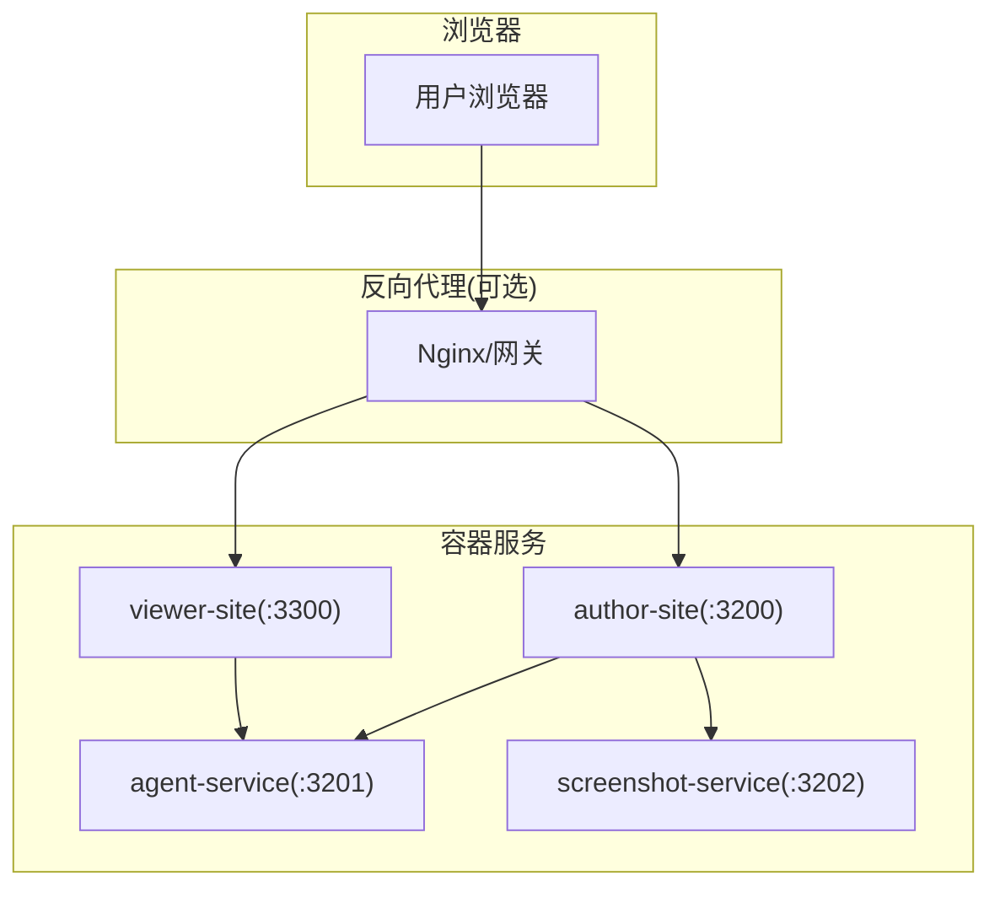
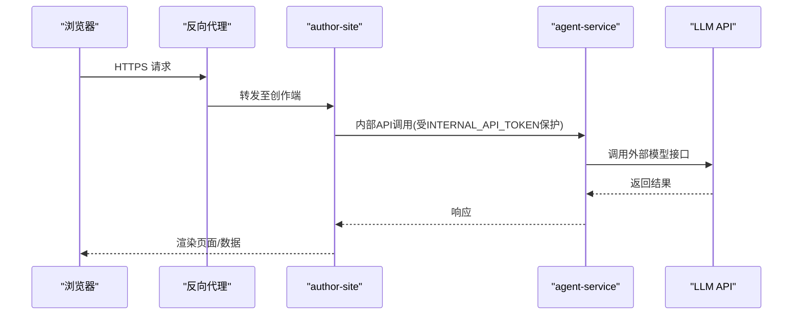
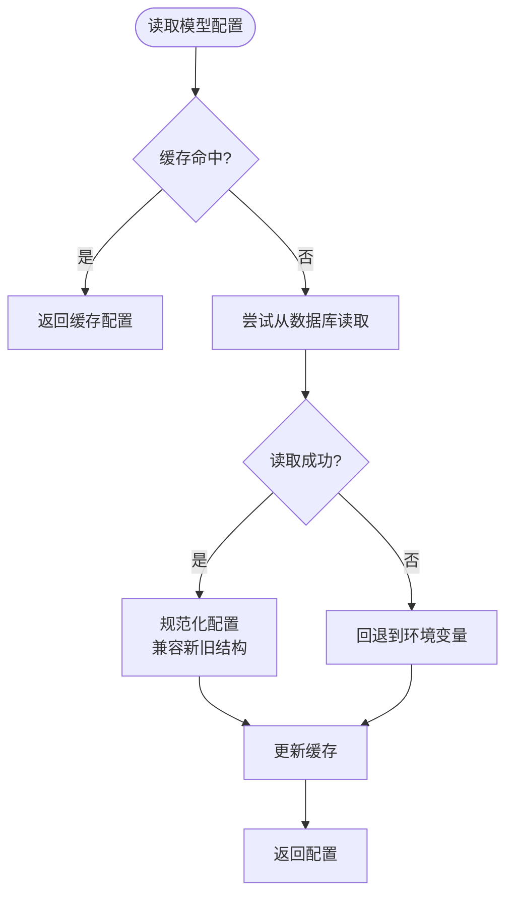
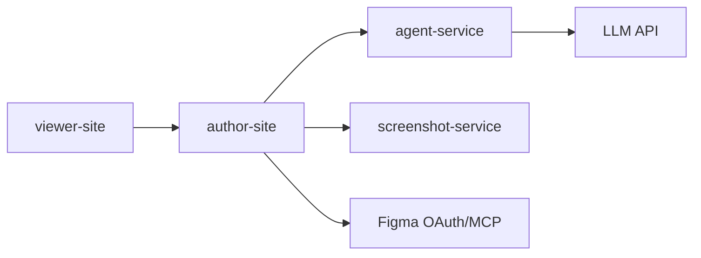

# 生产环境配置

<cite>
**本文引用的文件**   
- [docker-compose.yml](file://docker-compose.yml)
- [Docker部署方案.md](file://docs/项目文档/创作端/06-基础设施/技术/03_Docker部署方案.md)
- [部署与CORS配置.md](file://docs/项目文档/使用端/03-部署与嵌入/技术/01_部署与CORS配置.md)
- [backend-providers.ts](file://packages/agent-service/src/config/backend-providers.ts)
- [model-config.ts](file://packages/author-site/src/lib/model-config.ts)
- [logger.ts](file://packages/agent-service/src/utils/logger.ts)
- [workspace-performance-sampling.ts](file://packages/author-site/src/lib/workspace-performance-sampling.ts)
- [iframe-template.ts](file://packages/shared/src/demo/iframe-template.ts)
- [admin-auth.ts](file://packages/author-site/src/lib/admin-auth.ts)
- [session-store.ts](file://packages/agent-service/src/session/session-store.ts)
</cite>

## 目录
1. [简介](#简介)
2. [项目结构](#项目结构)
3. [核心组件](#核心组件)
4. [架构总览](#架构总览)
5. [详细组件分析](#详细组件分析)
6. [依赖关系分析](#依赖关系分析)
7. [性能调优](#性能调优)
8. [安全配置最佳实践](#安全配置最佳实践)
9. [负载均衡与高可用](#负载均衡与高可用)
10. [监控指标与日志聚合](#监控指标与日志聚合)
11. [容量规划与资源估算](#容量规划与资源估算)
12. [故障排查指南](#故障排查指南)
13. [结论](#结论)

## 简介
本文件面向生产环境的 Workbench 平台，聚焦以下目标：
- 环境变量配置管理：敏感信息保护、配置模板与动态配置更新
- 性能调优参数：Node.js 运行时优化、数据库连接池与缓存策略
- 安全配置：HTTPS 证书、CORS 策略与访问控制规则
- 负载均衡与高可用：反向代理、会话保持与健康检查
- 监控与日志：系统指标、应用日志与错误追踪
- 容量规划与资源估算

## 项目结构
Workbench 采用多服务容器化部署，核心服务包括：
- author-site（创作端）：Next.js SSR + API
- agent-service（Agent 服务）：Fastify + Pi Agent
- screenshot-service（截图服务）：Puppeteer Core + Chromium
- viewer-site（使用端/预览端）：Nginx 静态站点

图示来源
- [docker-compose.yml:1-140](file://docker-compose.yml#L1-L140)
- [Docker部署方案.md:38-94](file://docs/项目文档/创作端/06-基础设施/技术/03_Docker部署方案.md#L38-L94)

章节来源
- [docker-compose.yml:1-140](file://docker-compose.yml#L1-L140)
- [Docker部署方案.md:38-94](file://docs/项目文档/创作端/06-基础设施/技术/03_Docker部署方案.md#L38-L94)

## 核心组件
- 环境变量与配置注入：通过 docker-compose.yml 的 environment 字段集中注入；部分构建期变量通过 build args 注入到镜像。
- 动态配置：模型与后端供应商配置支持“数据库优先 + 环境变量回退”，并支持运行时推送更新。
- 健康检查：容器级健康检查用于进程可用性判断；截图服务提供深度健康检查能力。
- 日志与指标：统一日志输出与采样指标收集，便于外部聚合与告警。

章节来源
- [docker-compose.yml:1-140](file://docker-compose.yml#L1-L140)
- [Docker部署方案.md:231-240](file://docs/项目文档/创作端/06-基础设施/技术/03_Docker部署方案.md#L231-L240)
- [model-config.ts:172-201](file://packages/author-site/src/lib/model-config.ts#L172-L201)
- [backend-providers.ts:18-47](file://packages/agent-service/src/config/backend-providers.ts#L18-L47)

## 架构总览
下图展示生产环境典型部署拓扑与关键数据流，包含反向代理、服务间调用与外部 LLM API 的交互。

图示来源
- [Docker部署方案.md:83-94](file://docs/项目文档/创作端/06-基础设施/技术/03_Docker部署方案.md#L83-L94)
- [docker-compose.yml:1-140](file://docker-compose.yml#L1-L140)

## 详细组件分析

### 环境变量与配置管理
- 容器内环境变量：在 docker-compose.yml 中为各服务定义 PORT、HOST、CORS_ORIGINS、DATA_DIR、NEXT_PUBLIC_* 等变量。
- 构建期变量：通过 build args 注入 NEXT_PUBLIC_* 等前端可见变量，影响构建产物。
- 敏感信息：JWT_SECRET、INTERNAL_API_TOKEN、PI_AGENT_API_KEY、FIGMA_OAUTH_* 等应通过外部密钥管理系统或编排平台注入，避免硬编码。
- 配置模板：建议维护 .env.docker 作为模板，结合部署脚本生成运行期 .deploy.env。

章节来源
- [docker-compose.yml:1-140](file://docker-compose.yml#L1-L140)
- [Docker部署方案.md:123-180](file://docs/项目文档/创作端/06-基础设施/技术/03_Docker部署方案.md#L123-L180)

### 动态配置更新（模型与后端供应商）
- 优先级：数据库 > 环境变量（启动时 fallback）> 默认值
- 运行时推送：author-site 写入数据库后，主动推送最新配置到 agent-service，实现热更新
- 缓存策略：服务端对配置进行短期缓存，降低数据库压力

图示来源
- [model-config.ts:172-201](file://packages/author-site/src/lib/model-config.ts#L172-L201)
- [backend-providers.ts:18-47](file://packages/agent-service/src/config/backend-providers.ts#L18-L47)

章节来源
- [model-config.ts:172-201](file://packages/author-site/src/lib/model-config.ts#L172-L201)
- [backend-providers.ts:18-47](file://packages/agent-service/src/config/backend-providers.ts#L18-L47)

### CORS 与安全访问控制
- CORS 来源：通过 CORS_ORIGINS 统一配置，需同时包含创作端、使用端及必要的 localhost 来源
- 预检处理：author-site 中间件在认证前对 OPTIONS 预检直接返回 204
- Cookie 安全：USE_SECURE_COOKIE 控制是否启用 secure cookie；生产 HTTPS 场景必须开启
- 管理员鉴权：支持 URL 参数、Cookie、Authorization header 三种方式验证管理员身份

章节来源
- [部署与CORS配置.md:70-101](file://docs/项目文档/使用端/03-部署与嵌入/技术/01_部署与CORS配置.md#L70-L101)
- [Docker部署方案.md:171-180](file://docs/项目文档/创作端/06-基础设施/技术/03_Docker部署方案.md#L171-L180)
- [admin-auth.ts:45-99](file://packages/author-site/src/lib/admin-auth.ts#L45-L99)

### 健康检查与会话管理
- 健康检查：容器级别检查 HTTP 端点可用性；截图服务支持深度健康检查
- 会话清理：内存会话存储定期清理过期元数据，防止内存泄漏

章节来源
- [Docker部署方案.md:231-240](file://docs/项目文档/创作端/06-基础设施/技术/03_Docker部署方案.md#L231-L240)
- [session-store.ts:101-122](file://packages/agent-service/src/session/session-store.ts#L101-L122)

## 依赖关系分析
- 服务耦合：author-site 依赖 agent-service 与 screenshot-service；viewer-site 仅依赖 author-site 的数据映射
- 配置依赖：模型配置与后端供应商配置跨服务共享，需保证 INTERNAL_API_TOKEN 一致
- 外部依赖：LLM API、Figma OAuth/MCP、截图服务 Chromium

图示来源
- [docker-compose.yml:1-140](file://docker-compose.yml#L1-L140)
- [Docker部署方案.md:83-94](file://docs/项目文档/创作端/06-基础设施/技术/03_Docker部署方案.md#L83-L94)

章节来源
- [docker-compose.yml:1-140](file://docker-compose.yml#L1-L140)

## 性能调优

### Node.js 运行时优化
- 日志级别：通过 LOG_LEVEL 控制日志输出粒度，生产环境建议使用 info 或 warn
- 并发限制：通过 pids_limit 限制进程数，避免单服务耗尽宿主机资源
- 内存上限：根据服务特性设置 mem_limit，截图服务需更高内存以支撑 Chromium

章节来源
- [logger.ts:14-30](file://packages/agent-service/src/utils/logger.ts#L14-L30)
- [docker-compose.yml:36-40](file://docker-compose.yml#L36-L40)

### 数据库连接池与缓存策略
- 配置缓存：模型配置在服务端进行短期缓存，减少数据库读取频率
- 会话清理：定期清理过期会话元数据，释放内存

章节来源
- [model-config.ts:172-201](file://packages/author-site/src/lib/model-config.ts#L172-L201)
- [session-store.ts:101-122](file://packages/agent-service/src/session/session-store.ts#L101-L122)

### 预览性能与资源加载
- 预览运行时：支持同源加载与 CDN 回退，可通过 PREVIEW_RUNTIME_SOURCE 控制
- 资源时序采集：预览 iframe 内置性能计时与资源统计，便于诊断首屏延迟

章节来源
- [Docker部署方案.md:280-288](file://docs/项目文档/创作端/06-基础设施/技术/03_Docker部署方案.md#L280-L288)
- [iframe-template.ts:999-1050](file://packages/shared/src/demo/iframe-template.ts#L999-L1050)

## 安全配置最佳实践

### HTTPS 证书配置
- 反向代理层：建议在 Nginx/网关层终止 TLS，配置有效证书与强加密套件
- Cookie 安全：生产环境启用 USE_SECURE_COOKIE=true，确保 Cookie 仅通过 HTTPS 传输

章节来源
- [Docker部署方案.md:171-180](file://docs/项目文档/创作端/06-基础设施/技术/03_Docker部署方案.md#L171-L180)

### CORS 策略设置
- 最小权限原则：仅允许必要的域名与端口，避免使用通配符
- 预检优化：在认证前快速响应 OPTIONS 请求，减少无效认证开销

章节来源
- [部署与CORS配置.md:70-101](file://docs/项目文档/使用端/03-部署与嵌入/技术/01_部署与CORS配置.md#L70-L101)

### 访问控制规则
- 内部接口鉴权：author-site 与 agent-service 通过 INTERNAL_API_TOKEN 互信
- 管理员鉴权：支持多种认证方式，生产环境建议禁用 URL 参数方式，仅使用 Cookie 或 Authorization header

章节来源
- [Docker部署方案.md:171-180](file://docs/项目文档/创作端/06-基础设施/技术/03_Docker部署方案.md#L171-L180)
- [admin-auth.ts:45-99](file://packages/author-site/src/lib/admin-auth.ts#L45-L99)

## 负载均衡与高可用

### 反向代理设置
- 流量分发：在 Nginx/网关层实现轮询或加权轮询，将请求分发到多个 author-site 实例
- 静态资源：viewer-site 通过只读挂载 data/published 目录，配合长期缓存提升性能

章节来源
- [部署与CORS配置.md:124-134](file://docs/项目文档/使用端/03-部署与嵌入/技术/01_部署与CORS配置.md#L124-L134)

### 会话保持与健康检查
- 会话状态：当前会话存储在内存中，多实例部署需考虑会话共享或粘性会话
- 健康检查：容器级健康检查确保流量仅路由到健康实例

章节来源
- [session-store.ts:135-143](file://packages/agent-service/src/session/session-store.ts#L135-L143)
- [Docker部署方案.md:231-240](file://docs/项目文档/创作端/06-基础设施/技术/03_Docker部署方案.md#L231-L240)

## 监控指标与日志聚合

### 系统指标收集
- 性能采样：作者端提供工作区性能采样器，记录队列等待、提交延迟、远程更新延迟等关键指标
- SLO 报告：基于采样数据生成 SLO 合规报告，便于监控告警

章节来源
- [workspace-performance-sampling.ts:201-248](file://packages/author-site/src/lib/workspace-performance-sampling.ts#L201-L248)

### 应用日志与错误追踪
- 统一日志：agent-service 使用 Pino 输出结构化日志，支持日志级别与序列化
- 预览日志：预览 iframe 通过 postMessage 上报控制台日志，便于前端调试

章节来源
- [logger.ts:14-30](file://packages/agent-service/src/utils/logger.ts#L14-L30)
- [iframe-template.ts:999-1050](file://packages/shared/src/demo/iframe-template.ts#L999-L1050)

## 容量规划与资源估算

### 资源限制参考
- author-site：CPU 1.0，内存 1GB，进程数 512
- agent-service：CPU 1.0，内存 1GB，进程数 512
- screenshot-service：CPU 1.0，内存 1536MB，进程数 768，共享内存 256MB
- viewer-site：CPU 0.5，内存 512MB，进程数 256

### 扩展策略
- 水平扩展：无状态服务（author-site、viewer-site）可横向扩展，注意会话共享
- 垂直扩展：有状态服务（agent-service）需评估内存与 CPU 瓶颈，必要时拆分功能模块

章节来源
- [Docker部署方案.md:68-80](file://docs/项目文档/创作端/06-基础设施/技术/03_Docker部署方案.md#L68-L80)
- [docker-compose.yml:36-40](file://docker-compose.yml#L36-L40)

## 故障排查指南

### 常见问题定位
- 配置不同步：检查 INTERNAL_API_TOKEN 一致性与管理后台配置同步链路
- CORS 预检失败：确认 CORS_ORIGINS 包含所有必要来源
- 截图服务异常：执行深度健康检查验证 Chromium 能力
- 性能问题：查看性能采样指标与预览资源加载时序

章节来源
- [Docker部署方案.md:396-411](file://docs/项目文档/创作端/06-基础设施/技术/03_Docker部署方案.md#L396-L411)
- [workspace-performance-sampling.ts:201-248](file://packages/author-site/src/lib/workspace-performance-sampling.ts#L201-L248)

## 结论
生产环境配置需要综合考虑安全性、性能、可用性与可观测性。通过环境变量统一管理、动态配置更新、严格的 CORS 策略、完善的健康检查与监控体系，可以确保 Workbench 平台在生产环境中稳定高效地运行。建议结合具体业务需求持续优化资源配置与监控策略。