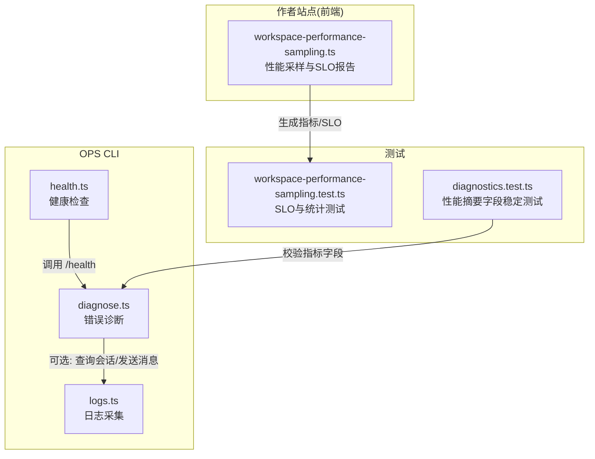
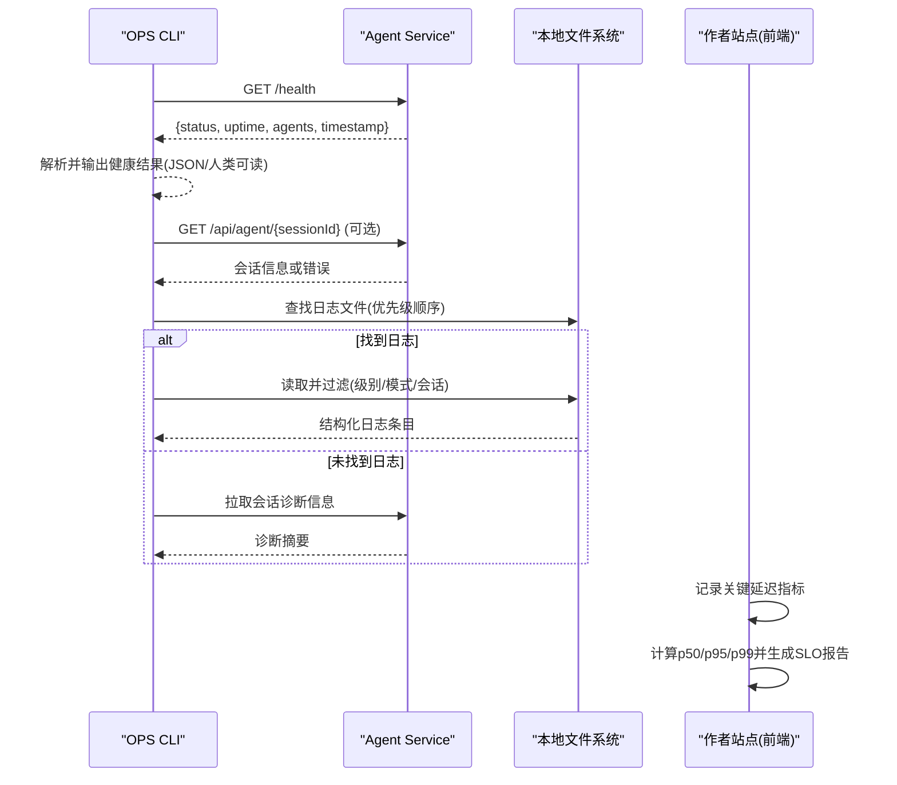
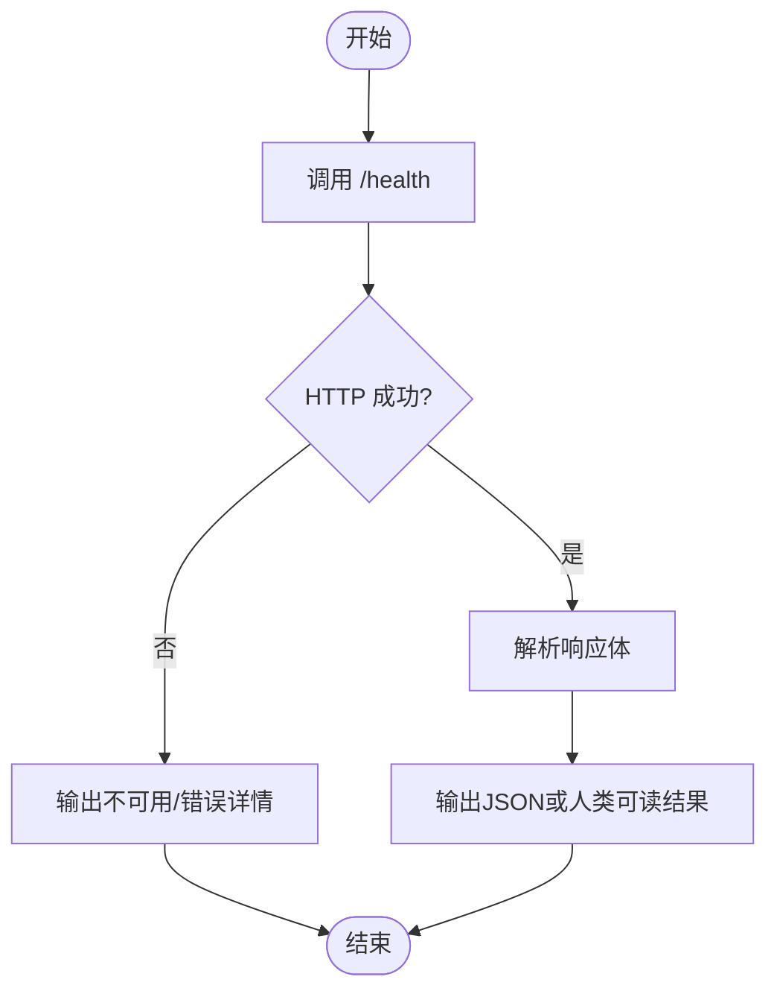
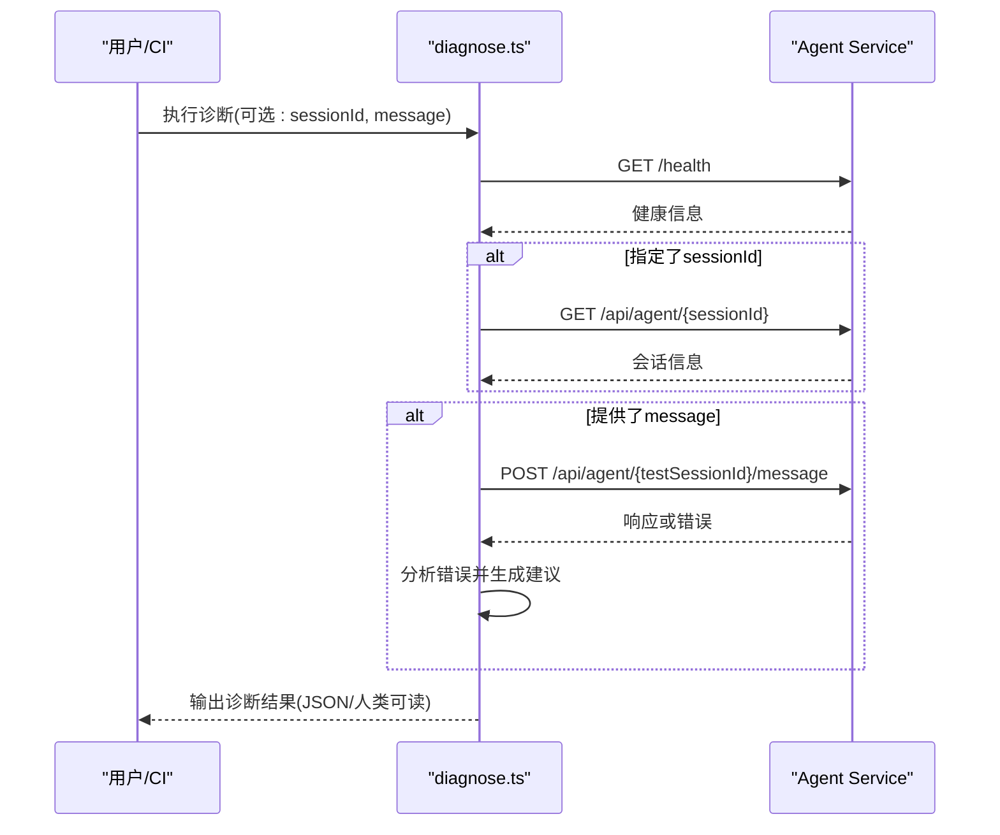
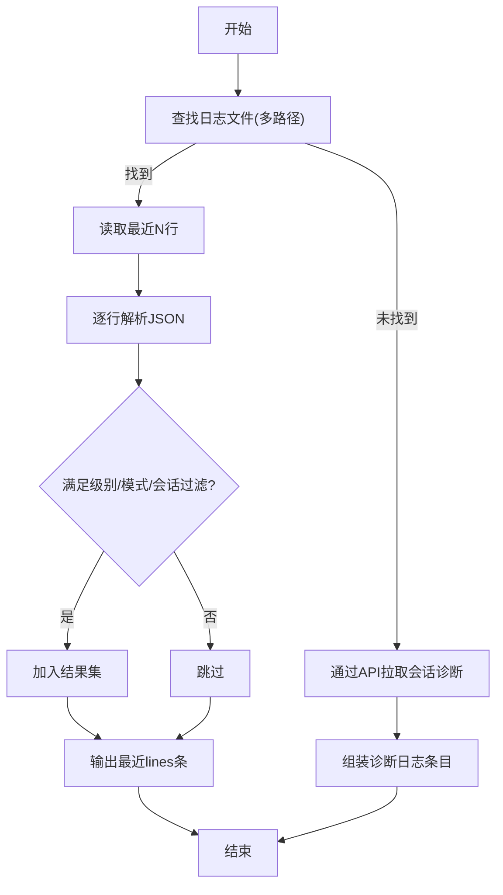
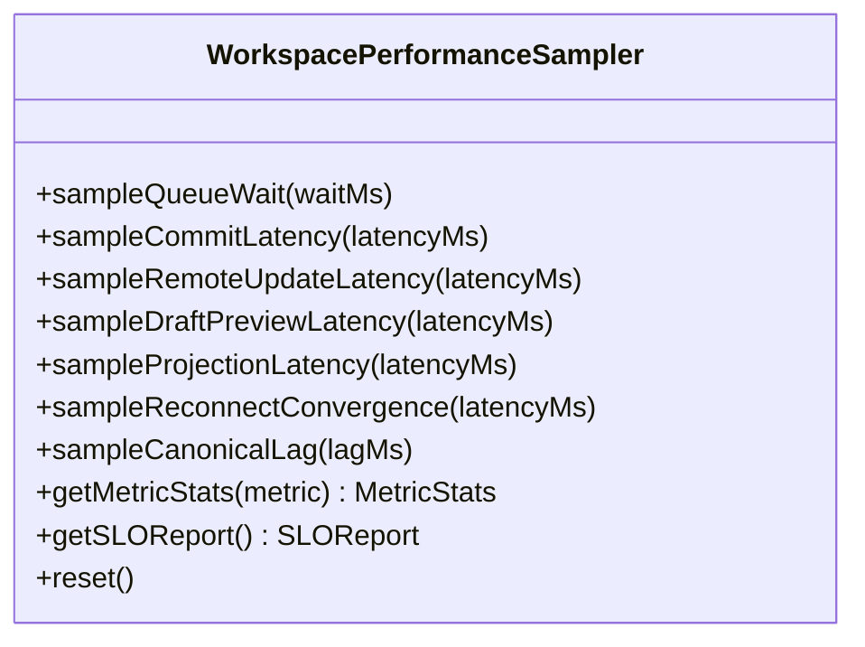
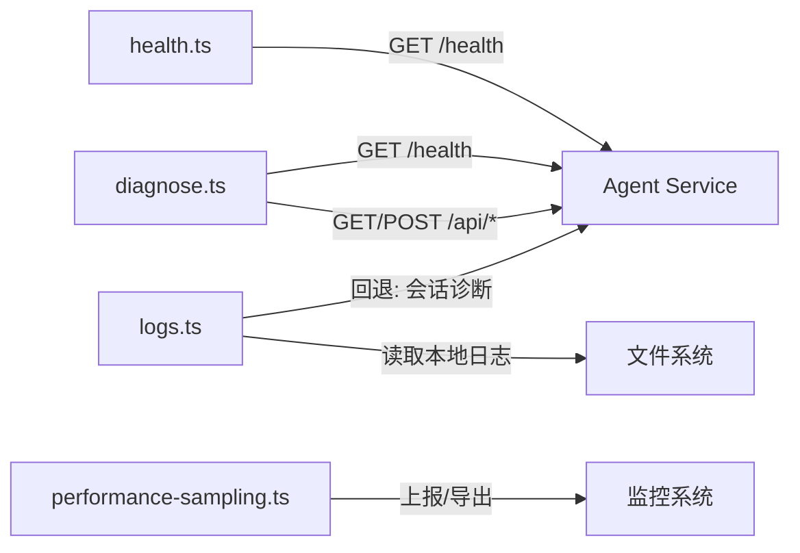

# 监控告警

<cite>
**本文引用的文件**   
- [diagnose.ts](file://OPS/CLI/src/commands/diagnose.ts)
- [logs.ts](file://OPS/CLI/src/commands/logs.ts)
- [health.ts](file://OPS/CLI/src/commands/health.ts)
- [workspace-performance-sampling.ts](file://packages/author-site/src/lib/workspace-performance-sampling.ts)
- [workspace-performance-sampling.test.ts](file://packages/author-site/src/lib/__tests__/workspace-performance-sampling.test.ts)
- [diagnostics.test.ts](file://OPS/CLI/src/commands/diagnostics.test.ts)
</cite>

## 目录
1. [简介](#简介)
2. [项目结构](#项目结构)
3. [核心组件](#核心组件)
4. [架构总览](#架构总览)
5. [详细组件分析](#详细组件分析)
6. [依赖关系分析](#依赖关系分析)
7. [性能与瓶颈识别](#性能与瓶颈识别)
8. [故障诊断工具使用指南](#故障诊断工具使用指南)
9. [监控仪表板与可视化方案](#监控仪表板与可视化方案)
10. [结论](#结论)

## 简介
本文件面向 Workbench 平台的运维与研发人员，系统化说明监控指标采集、日志收集与分析策略、告警规则配置、性能监控与瓶颈识别方法、故障诊断工具使用以及监控仪表板的配置与可视化展示方案。内容基于仓库中现有实现进行梳理与扩展建议，确保可落地执行。

## 项目结构
围绕监控与诊断能力，当前仓库主要涉及以下模块：
- OPS CLI 命令：健康检查、错误诊断、日志采集等
- 创作端（Author Site）前端性能采样器：用于采集工作区关键延迟指标并生成 SLO 报告
- 诊断测试用例：验证性能摘要字段稳定性与跨存储流程

图表来源
- [health.ts:1-90](file://OPS/CLI/src/commands/health.ts#L1-L90)
- [diagnose.ts:1-372](file://OPS/CLI/src/commands/diagnose.ts#L1-L372)
- [logs.ts:1-294](file://OPS/CLI/src/commands/logs.ts#L1-L294)
- [workspace-performance-sampling.ts:201-279](file://packages/author-site/src/lib/workspace-performance-sampling.ts#L201-L279)
- [workspace-performance-sampling.test.ts:148-185](file://packages/author-site/src/lib/__tests__/workspace-performance-sampling.test.ts#L148-L185)
- [diagnostics.test.ts:241-277](file://OPS/CLI/src/commands/diagnostics.test.ts#L241-L277)

章节来源
- [health.ts:1-90](file://OPS/CLI/src/commands/health.ts#L1-L90)
- [diagnose.ts:1-372](file://OPS/CLI/src/commands/diagnose.ts#L1-L372)
- [logs.ts:1-294](file://OPS/CLI/src/commands/logs.ts#L1-L294)
- [workspace-performance-sampling.ts:201-279](file://packages/author-site/src/lib/workspace-performance-sampling.ts#L201-L279)
- [workspace-performance-sampling.test.ts:148-185](file://packages/author-site/src/lib/__tests__/workspace-performance-sampling.test.ts#L148-L185)
- [diagnostics.test.ts:241-277](file://OPS/CLI/src/commands/diagnostics.test.ts#L241-L277)

## 核心组件
- 健康检查（Health Check）
  - 通过访问服务 /health 接口获取状态、运行时间、活跃 Agent 数量等信息，支持 JSON 输出便于自动化集成。
- 错误诊断（Diagnose）
  - 自动探测服务可用性、会话存在性与消息收发，结合错误码与消息文本给出问题定位与建议。
- 日志采集（Logs）
  - 优先读取本地日志文件；若未找到则回退到通过 API 拉取会话诊断信息，支持级别过滤、模式匹配与会话筛选。
- 前端性能采样（Performance Sampling）
  - 采集工作区关键延迟指标（队列等待、提交延迟、远程更新延迟、草稿预览延迟、投影确认延迟、重连收敛时间、规范物化滞后），计算 p50/p95/p99 并生成 SLO 报告。

章节来源
- [health.ts:1-90](file://OPS/CLI/src/commands/health.ts#L1-L90)
- [diagnose.ts:1-372](file://OPS/CLI/src/commands/diagnose.ts#L1-L372)
- [logs.ts:1-294](file://OPS/CLI/src/commands/logs.ts#L1-L294)
- [workspace-performance-sampling.ts:201-279](file://packages/author-site/src/lib/workspace-performance-sampling.ts#L201-L279)

## 架构总览
下图展示了从 CLI 到后端服务的健康检查与诊断流程，以及前端性能采样与 SLO 报告的生成路径。

图表来源
- [health.ts:1-90](file://OPS/CLI/src/commands/health.ts#L1-L90)
- [diagnose.ts:1-372](file://OPS/CLI/src/commands/diagnose.ts#L1-L372)
- [logs.ts:1-294](file://OPS/CLI/src/commands/logs.ts#L1-L294)
- [workspace-performance-sampling.ts:201-279](file://packages/author-site/src/lib/workspace-performance-sampling.ts#L201-L279)

## 详细组件分析

### 健康检查组件（health.ts）
- 功能要点
  - 请求 /health，返回健康状态、运行时长、活跃 Agent 数、时间戳及可选的引擎列表。
  - 支持 JSON 输出，便于 CI/CD 与健康探针集成。
- 异常处理
  - HTTP 非 2xx 时输出不可用提示与可能原因；网络异常时给出连接失败详情与启动建议。
- 使用建议
  - 在容器编排中作为 liveness/readiness probe 的入口。
  - 将 JSON 输出接入监控系统（如 Prometheus Exporter 或自定义上报）。

图表来源
- [health.ts:1-90](file://OPS/CLI/src/commands/health.ts#L1-L90)

章节来源
- [health.ts:1-90](file://OPS/CLI/src/commands/health.ts#L1-L90)

### 错误诊断组件（diagnose.ts）
- 功能要点
  - 步骤一：检查服务健康；步骤二：查询指定会话是否存在；步骤三：发送测试消息并测量耗时；步骤四：根据错误码与消息文本进行分析与建议。
  - 支持 JSON 模式输出，便于自动化流水线集成。
- 错误分析
  - 针对常见错误场景（无活跃会话、内部错误、连接被拒绝、会话不存在）提供可能原因与解决方案。
- 使用建议
  - 在发布前后、变更影响评估时执行端到端连通性自检。
  - 将诊断结果持久化至制品库或日志系统，便于回溯。

图表来源
- [diagnose.ts:1-372](file://OPS/CLI/src/commands/diagnose.ts#L1-L372)

章节来源
- [diagnose.ts:1-372](file://OPS/CLI/src/commands/diagnose.ts#L1-L372)

### 日志采集组件（logs.ts）
- 功能要点
  - 优先扫描本地日志路径（按优先级查找 agent-service.log 或 latest.log）。
  - 若未找到日志文件，则回退为通过 API 拉取会话诊断信息。
  - 支持按日志级别过滤、正则/子串模式匹配、按会话 ID 筛选。
- 日志格式
  - 期望每行一条 JSON 结构化日志；若解析失败，会降级为包含 level/time/msg 的兜底结构。
- 使用建议
  - 在生产环境建议统一输出 JSON 结构化日志，便于集中式采集与检索。
  - 对高吞吐场景，建议仅保留必要字段，避免过大日志体积。

图表来源
- [logs.ts:1-294](file://OPS/CLI/src/commands/logs.ts#L1-L294)

章节来源
- [logs.ts:1-294](file://OPS/CLI/src/commands/logs.ts#L1-L294)

### 前端性能采样与 SLO 报告（workspace-performance-sampling.ts）
- 指标覆盖
  - 队列等待、Authority commit 延迟、远程协作更新延迟、草稿预览延迟、投影确认延迟、重连收敛时间、规范物化滞后。
- 统计与 SLO
  - 计算 count/p50/p95/p99/min/max/average，并按预设目标生成 SLO 报告，判定是否达标。
- 使用建议
  - 将 SLO 报告定时上报至监控系统，设置阈值告警。
  - 结合业务峰值时段动态调整阈值，避免误报。

图表来源
- [workspace-performance-sampling.ts:201-279](file://packages/author-site/src/lib/workspace-performance-sampling.ts#L201-L279)

章节来源
- [workspace-performance-sampling.ts:201-279](file://packages/author-site/src/lib/workspace-performance-sampling.ts#L201-L279)
- [workspace-performance-sampling.test.ts:148-185](file://packages/author-site/src/lib/__tests__/workspace-performance-sampling.test.ts#L148-L185)

## 依赖关系分析
- 组件耦合
  - diagnose.ts 依赖 health 检查与会话/消息 API，具备一定内聚性。
  - logs.ts 同时依赖本地文件系统与 API，具备回退机制，提升鲁棒性。
  - 前端性能采样器独立于后端，通过周期性上报与 SLO 报告形成闭环。
- 外部依赖
  - 健康检查与诊断均依赖后端 /health 与 /api/* 接口契约。
  - 日志采集依赖结构化日志输出约定。

图表来源
- [health.ts:1-90](file://OPS/CLI/src/commands/health.ts#L1-L90)
- [diagnose.ts:1-372](file://OPS/CLI/src/commands/diagnose.ts#L1-L372)
- [logs.ts:1-294](file://OPS/CLI/src/commands/logs.ts#L1-L294)
- [workspace-performance-sampling.ts:201-279](file://packages/author-site/src/lib/workspace-performance-sampling.ts#L201-L279)

章节来源
- [health.ts:1-90](file://OPS/CLI/src/commands/health.ts#L1-L90)
- [diagnose.ts:1-372](file://OPS/CLI/src/commands/diagnose.ts#L1-L372)
- [logs.ts:1-294](file://OPS/CLI/src/commands/logs.ts#L1-L294)
- [workspace-performance-sampling.ts:201-279](file://packages/author-site/src/lib/workspace-performance-sampling.ts#L201-L279)

## 性能与瓶颈识别
- 慢查询分析
  - 建议在后端数据库层开启慢查询日志，结合 SQL 指纹与执行计划进行热点分析。
  - 在前端侧关注“草稿预览延迟”“投影确认延迟”，若持续偏高，需排查渲染与数据同步链路。
- 内存泄漏检测
  - 使用 Node.js 堆快照对比（前后各一次）定位增长对象；前端可使用浏览器性能面板的 Memory 视图观察长驻对象。
- 并发请求监控
  - 关注队列等待与提交延迟，若 p95/p99 显著高于 p50，可能存在锁竞争或资源争用。
  - 结合系统级指标（CPU、I/O、网络）与进程级指标（句柄、线程池）综合判断。
- 指标口径与稳定性
  - 诊断测试已验证性能摘要字段（p50/p95/p99）的稳定性，建议在告警规则中采用相同口径。

章节来源
- [diagnostics.test.ts:241-277](file://OPS/CLI/src/commands/diagnostics.test.ts#L241-L277)
- [workspace-performance-sampling.ts:201-279](file://packages/author-site/src/lib/workspace-performance-sampling.ts#L201-L279)

## 故障诊断工具使用指南
- 健康检查
  - 使用健康检查命令快速验证服务可达性与基本状态，推荐在部署后与定时巡检中使用。
- 错误诊断
  - 当出现会话错误或消息发送失败时，使用诊断命令自动完成健康检查、会话查询与消息测试，并输出分析与建议。
- 日志采集
  - 优先查看本地日志文件；若无日志文件，可通过命令回退到 API 拉取会话诊断信息，支持级别、模式与会话过滤。
- 调试技巧
  - 在 JSON 模式下输出结构化结果，便于脚本解析与入库。
  - 结合会话 ID 精准定位问题上下文，减少噪音。

章节来源
- [health.ts:1-90](file://OPS/CLI/src/commands/health.ts#L1-L90)
- [diagnose.ts:1-372](file://OPS/CLI/src/commands/diagnose.ts#L1-L372)
- [logs.ts:1-294](file://OPS/CLI/src/commands/logs.ts#L1-L294)

## 监控仪表板与可视化方案
- 指标体系建议
  - 服务健康：/health 返回的状态、运行时间、活跃 Agent 数。
  - 请求质量：API 成功率、错误率、P50/P95/P99 延迟。
  - 资源使用：CPU、内存、磁盘、网络 I/O。
  - 前端性能：队列等待、提交延迟、远程更新延迟、草稿预览延迟、投影确认延迟、重连收敛时间、规范物化滞后。
- 告警规则建议
  - 阈值类：错误率超过阈值、P95/P99 延迟超阈、健康检查失败次数。
  - 趋势类：连续 N 分钟延迟上升、内存持续增长。
  - 复合类：错误率升高且延迟同时升高，触发更高级别告警。
- 通知渠道
  - 企业微信/钉钉/邮件/短信等多通道，按告警级别路由。
- 可视化展示
  - 使用仪表盘聚合关键指标，提供多维度下钻（按服务、版本、区域、会话类型）。
  - 将 SLO 报告纳入看板，直观展示达标情况。

[本节为通用指导，不直接分析具体文件]

## 结论
Workbench 平台已具备健康检查、错误诊断、日志采集与前端性能采样的基础能力。建议在此基础上完善结构化日志规范、统一指标口径、建立分层告警与多渠道通知，并通过仪表板实现可视化运营，持续提升系统的可观测性与稳定性。